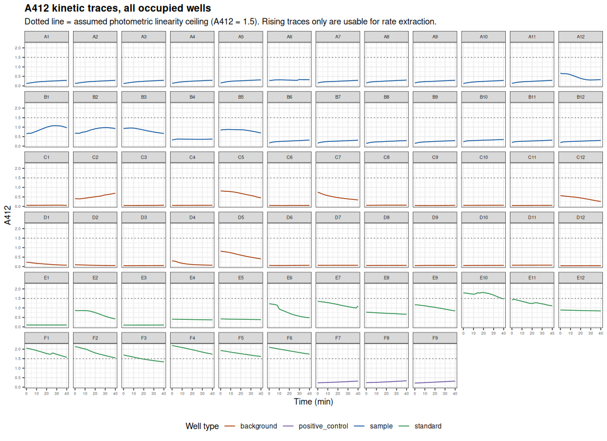
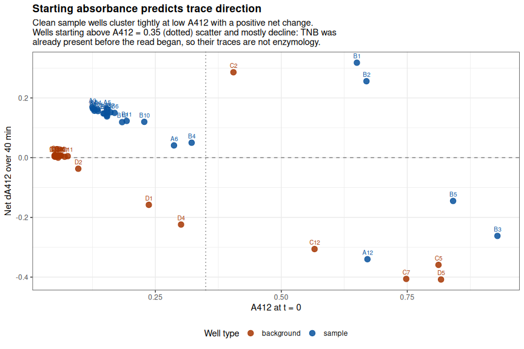
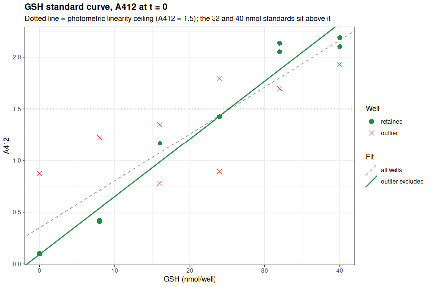
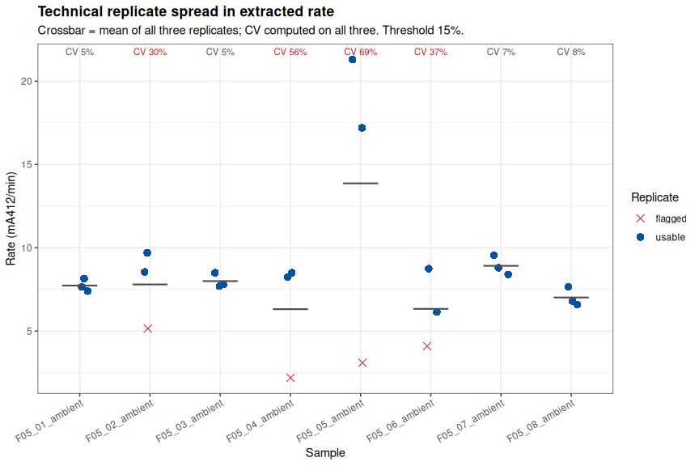
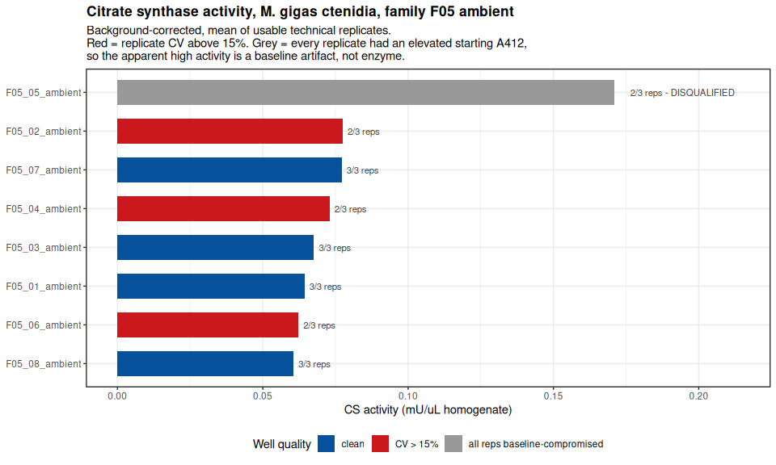
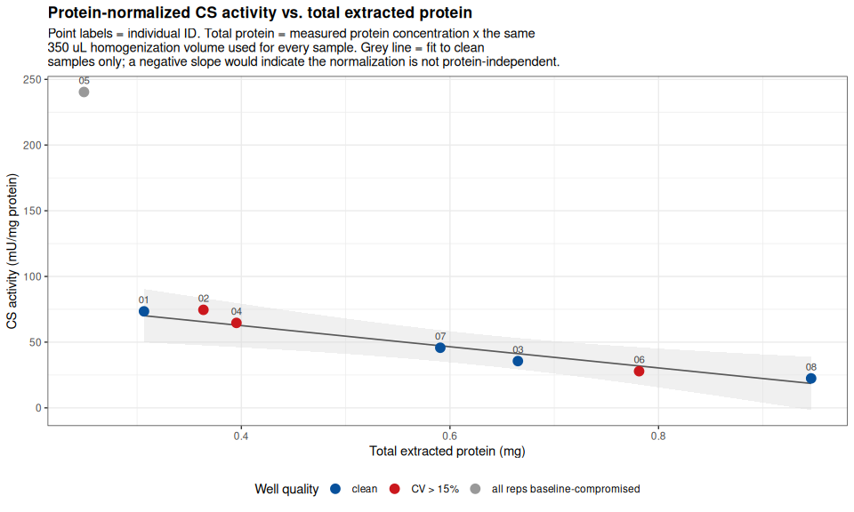

Gen5-20260811-mgig-citrate_synthase-F05-ambient
================
Sam White
2026-08-11

- [1 BACKGROUND](#1-background)
  - [1.1 Plate design](#11-plate-design)
  - [1.2 Sample naming](#12-sample-naming)
  - [1.3 Important note(s)](#13-important-notes)
- [2 SETUP](#2-setup)
  - [2.1 Libraries and shared pipeline
    functions](#21-libraries-and-shared-pipeline-functions)
  - [2.2 Pipeline functions](#22-pipeline-functions)
    - [2.2.1 Data import and layout
      parsing](#221-data-import-and-layout-parsing)
    - [2.2.2 Well-level kinetic QC](#222-well-level-kinetic-qc)
    - [2.2.3 Standard curve and rate
      extraction](#223-standard-curve-and-rate-extraction)
    - [2.2.4 Background correction, replicate CV, and activity
      calculation](#224-background-correction-replicate-cv-and-activity-calculation)
    - [2.2.5 QC summary and narrative
      generation](#225-qc-summary-and-narrative-generation)
  - [2.3 Assay parameters](#23-assay-parameters)
  - [2.4 Output directory](#24-output-directory)
- [3 DATA](#3-data)
  - [3.1 Plate layout](#31-plate-layout)
  - [3.2 Kinetic readers](#32-kinetic-readers)
  - [3.3 Cross-check against the full
    report](#33-cross-check-against-the-full-report)
  - [3.4 Annotate wells and parse
    metadata](#34-annotate-wells-and-parse-metadata)
  - [3.5 Protein concentration (normalization
    factor)](#35-protein-concentration-normalization-factor)
- [4 KINETIC TRACES](#4-kinetic-traces)
- [5 ANOMALY DETECTION](#5-anomaly-detection)
  - [5.1 Per-well trace diagnostics](#51-per-well-trace-diagnostics)
  - [5.2 Anomalous wells](#52-anomalous-wells)
  - [5.3 Background control wells behaving as
    reactions](#53-background-control-wells-behaving-as-reactions)
  - [5.4 Starting absorbance as the master
    diagnostic](#54-starting-absorbance-as-the-master-diagnostic)
- [6 GSH STANDARD CURVE](#6-gsh-standard-curve)
  - [6.1 Fit the standard curve](#61-fit-the-standard-curve)
  - [6.2 Plot the standard curve](#62-plot-the-standard-curve)
- [7 RATE EXTRACTION](#7-rate-extraction)
  - [7.1 Sliding-window linear fit](#71-sliding-window-linear-fit)
  - [7.2 Sample and background rates](#72-sample-and-background-rates)
  - [7.3 Positive control](#73-positive-control)
- [8 BACKGROUND CORRECTION](#8-background-correction)
  - [8.1 Background significance test](#81-background-significance-test)
- [9 TECHNICAL REPLICATE PRECISION](#9-technical-replicate-precision)
  - [9.1 Plot replicate spread](#91-plot-replicate-spread)
- [10 CITRATE SYNTHASE ACTIVITY](#10-citrate-synthase-activity)
  - [10.1 Calculation](#101-calculation)
  - [10.2 Results table](#102-results-table)
  - [10.3 Plot activity](#103-plot-activity)
  - [10.4 Protein-normalized activity](#104-protein-normalized-activity)
- [11 QC SUMMARY](#11-qc-summary)
  - [11.1 Auto-generated findings](#111-auto-generated-findings)
- [12 SUMMARY](#12-summary)
  - [12.1 Anomalies found](#121-anomalies-found)
  - [12.2 Technical replicate
    precision](#122-technical-replicate-precision)
  - [12.3 Assay validity](#123-assay-validity)
  - [12.4 Recommendation](#124-recommendation)
  - [12.5 What can be used from this
    plate](#125-what-can-be-used-from-this-plate)

# 1 BACKGROUND

Citrate synthase (CS) activity in ctenidia of eight *Magallana gigas*
(Pacific oyster) individuals from **family F05** held at **ambient**
temperature, assayed 2026-08-11 with the [Abcam Citrate Synthase Assay
Kit (ab239712),
v4a](https://github.com/RobertsLab/resources/blob/master/protocols/Commercial_Protocols/ABCAM-Citrate-Synthase-Assay-v4a-ab239712.pdf).

The kit is a **coupled kinetic** assay. CS condenses acetyl-CoA and
oxaloacetate, releasing free CoA-SH; the liberated thiol reduces DTNB to
TNB<sup>2-</sup>, which absorbs at 412 nm. The **rate** of A412 increase
is proportional to CS activity, and absolute nmol of thiol are assigned
from a **GSH (reduced glutathione) standard curve** read on the same
plate.

Absorbance was read at 412 nm in kinetic mode, 25 °C, every 2 min for 40
min (21 reads) on a Synergy HTX.

This document is fully self-contained: layout parsing, kinetic QC,
standard-curve fitting, rate extraction, CV computation, protein
normalization, and results assembly are all defined directly below (see
[`## Pipeline functions`](#22-pipeline-functions) under SETUP) rather
than sourced from a separate script, so the whole analysis can be
reproduced from this one file.

## 1.1 Plate design

| Plate rows | Contents |
|:---|:---|
| A, B | 8 samples (`F05_01`–`F05_08`), technical triplicates, + Reaction Mix |
| C, D | Paired **background controls** for the same 8 samples, + Background Control Mix (no CS Substrate Mix) |
| E, F1–F6 | GSH standards: 0, 8, 16, 24, 32, 40 nmol/well, triplicates |
| F7–F9 | CS Positive Control, triplicate |

Background control wells receive Background Control Mix, which **omits
CS Substrate Mix**. They therefore contain no acetyl-CoA/oxaloacetate,
cannot support the CS reaction, and should read **flat and low** for the
whole kinetic run. Their purpose (Abcam §8.4 note, §10.2) is to correct
for pre-existing free thiol / CoA in the homogenate, which produces a
one-time DTNB reduction at t0 rather than an ongoing rate.

## 1.2 Sample naming

Following the convention in the sibling Glycogen assay
(`../../Glycogen/data/raw_luminescence/README.md`), plate layout entries
are:

- `<sample>-<assay_type>-<tissue_weight>-df.<dilution_factor>`

where `<sample>` is itself composite:

- `<family>_<individual>_<temperature>`, with `_BG` appended for
  background control wells.

E.g. `F05_03_ambient-citrate_synthase-22.3-df.0` is family F05,
individual 03, ambient exposure, citrate synthase assay, 22.3 mg of
ctenidia tissue, undiluted homogenate. Standards follow
`STD-<assay_type>-<nmol_per_well>` (e.g. `STD-citrate_synthase-24` = 24
nmol GSH/well); the positive control is `POS-citrate_synthase`.

`df.0` denotes **no dilution** of the homogenate, i.e. dilution factor
*D* = 1 in the Abcam activity formula. It is not a literal multiplier of
zero.

## 1.3 Important note(s)

1.  **`absorbance-*.csv` is the sole data source.** An earlier export of
    this file covered only plate columns 1–9 (54 of the 69 occupied
    wells); it has since been re-exported from the Gen5 software and now
    carries all 69 occupied wells (columns 1–12, rows A–F). The
    re-export was verified against `full_report-*.txt` — the two agree
    **exactly** on all 1,449 well × timepoint readings they share — and
    against `layout-*.csv`, which confirms the well set matches the
    plate layout with none missing and none extra. `full_report-*.txt`
    is retained only as a cross-check, not as a data source.
2.  **Reaction volumes.** 2 µL of homogenate + 48 µL Assay Buffer 7 per
    well, then 50 µL Reaction Mix. Sample volume *V* = 2 µL in the
    activity formula.
3.  **Normalization is by total extracted protein, not tissue weight.**
    Tissue was homogenized in **350 µL** of Assay Buffer 7
    (`homogenate_volume_uL` below), reported by the bench operator and
    applied to every sample. Protein concentration in each homogenate
    was measured separately (BCA/Bradford-style assay, 595 nm; see
    `Protein concentration (normalization factor)` below) and converted
    to a total protein mass by multiplying by this same 350 µL. Tissue
    input (10.1–30.6 mg, recorded in the well label for provenance only)
    is not used in any activity calculation on this plate — total
    extracted protein is the normalizer, because it reflects what the
    assay actually measures against (soluble protein carried into the 2
    µL aliquot), not the starting tissue mass, which can vary in
    extraction efficiency from sample to sample.
4.  **Rate windows are compared over a common early interval.** Every
    trace on this plate decelerates — substrate is being consumed — so
    the measured rate depends on *when* it is measured, and a rate is
    only comparable between wells if the wells are measured over
    comparable intervals. Selecting each well’s steepest window
    independently satisfies this here because the steepest window is the
    initial one (0–8 min) for 22 of 24 sample wells; the two exceptions
    are wells whose traces are anomalous and are excluded anyway. The
    R<sup>2</sup> floor for accepting a window is set to `rate_min_r2` =
    0.80 rather than a stricter value for the same reason: deceleration
    within the window depresses R<sup>2</sup> even in clean wells
    (e.g. B10–B12 sit at 0.84–0.88 with 8% replicate CV), so a 0.95
    floor would reject well-behaved replicates while retaining late,
    near-zero-rate windows from exhausted wells. Curvature is a property
    of the assay here, not a defect of the well.
5.  **A412 at t = 0 is the master diagnostic on this plate.** Clean
    sample wells start at A412 0.13–0.16. Every well that misbehaves —
    samples that decline, background wells that act like reactions —
    starts well above that. TNB present before the reaction begins means
    the well was contaminated or mis-dispensed, so its trace is not
    enzymology and a rate taken from it is not activity.
    `sample_baseline_od` = 0.35 separates the two populations cleanly
    (there are no sample wells between 0.23 and 0.29 except A6 at 0.29,
    itself anomalous). **All three `F05_05` replicates** start elevated
    (0.65–0.93), so that sample has no clean replicate at all — see the
    results caveat below.
6.  **Layout label typo**, carried through from the plate layout file
    and handled explicitly in the parsing chunk: `F05_05_ambient_BG`
    wells (D1–D3) are labeled `citrate_synthasse` (three s’s).

# 2 SETUP

## 2.1 Libraries and shared pipeline functions

``` r
library(knitr)
library(ggplot2)
library(dplyr)
```

    ## 
    ## Attaching package: 'dplyr'

    ## The following objects are masked from 'package:stats':
    ## 
    ##     filter, lag

    ## The following objects are masked from 'package:base':
    ## 
    ##     intersect, setdiff, setequal, union

``` r
library(tidyr)

knitr::opts_chunk$set(
  echo = TRUE,         # Display code chunks
  eval = TRUE,         # Evaluate code chunks
  warning = FALSE,     # Hide warnings
  message = FALSE,     # Hide messages
  comment = "",        # Prevents appending '##' to beginning of lines in code output
  results = 'hold'     # Holds output so it's all printed together after code chunk
)
```

## 2.2 Pipeline functions

All layout parsing, kinetic QC, standard-curve fitting, rate extraction,
CV computation, protein normalization, and results assembly are defined
directly in this document (rather than sourced from a separate script)
so that it is fully self-contained and reproducible from this single
file. The functions are grouped below by pipeline stage; each is called
in the DATA / KINETIC TRACES / ANOMALY DETECTION / GSH STANDARD CURVE /
RATE EXTRACTION / BACKGROUND CORRECTION / TECHNICAL REPLICATE PRECISION
/ CITRATE SYNTHASE ACTIVITY / QC SUMMARY sections that follow. Nothing
plate-specific (typo fixes, disqualified samples, thresholds) is
hardcoded in any function – it is always passed in as an argument, from
the `assay_params` list defined further below or from a plate-specific
fix list.

### 2.2.1 Data import and layout parsing

Reads the raw Gen5 exports (kinetic absorbance CSV, full-report text
backup, plate-layout CSV), reconciles them against each other, and
attaches well-type/sample-id/replicate metadata plus measured protein
concentrations to every well.

``` r
## -----------------------------------------------------------------------
## elapsed_to_min()
## Purpose : Convert Gen5 "H:MM:SS" elapsed-time strings to decimal minutes.
## Inputs  : x - character vector of "H:MM:SS" strings
## Outputs : numeric vector of elapsed minutes, same length as x
## -----------------------------------------------------------------------
elapsed_to_min <- function(x) {
  vapply(strsplit(x, ":"), function(p) {
    p <- as.numeric(p)
    p[1] * 60 + p[2] + p[3] / 60
  }, numeric(1))
}

## -----------------------------------------------------------------------
## read_absorbance_csv()
## Purpose : Parse a Gen5 "absorbance-*.csv" kinetic export: wavelength
##           header, a "Time," row, a temperature row, then one row per well
##           (well ID in column 1, one OD reading per timepoint thereafter).
## Inputs  : path - path to the absorbance-*.csv file
## Outputs : long-format data.frame, one row per well x timepoint:
##           well (chr), time_min (dbl), od (dbl)
## -----------------------------------------------------------------------
read_absorbance_csv <- function(path) {
  ln <- iconv(readLines(path, warn = FALSE, encoding = "latin1"), "latin1", "UTF-8")
  time_i   <- grep("^Time,", ln)[1]
  time_str <- strsplit(ln[time_i], ",")[[1]]
  time_str <- time_str[!time_str %in% c("", "Time")]
  tmin     <- elapsed_to_min(time_str)

  well_ln <- ln[grepl("^[A-H][0-9]{1,2},", ln)]
  bind_rows(lapply(strsplit(well_ln, ","), function(p) {
    data.frame(well = p[1], time_min = tmin,
               od = as.numeric(p[seq_along(tmin) + 1]),
               stringsAsFactors = FALSE)
  }))
}

## -----------------------------------------------------------------------
## read_full_report()
## Purpose : Parse a Gen5 "full_report-*.txt" export: tab-delimited, wells
##           across columns, timepoints down rows. Used only as an
##           independent cross-check against the absorbance CSV, never as a
##           primary data source.
## Inputs  : path - path to the full_report-*.txt file
## Outputs : long-format data.frame, one row per well x timepoint:
##           well (chr), time_min (dbl), od (dbl)
## -----------------------------------------------------------------------
read_full_report <- function(path) {
  ln  <- iconv(readLines(path, warn = FALSE, encoding = "latin1"), "latin1", "UTF-8")
  hdr_i <- grep("^Time\t.*\tA1\t", ln)[1]
  hdr   <- trimws(strsplit(ln[hdr_i], "\t")[[1]])
  rows  <- ln[grepl("^[0-9]:[0-9]{2}:[0-9]{2}\t", ln)]
  m     <- do.call(rbind, strsplit(rows, "\t"))
  tmin  <- elapsed_to_min(m[, 1])

  well_cols <- which(grepl("^[A-H][0-9]{1,2}$", hdr))
  bind_rows(lapply(well_cols, function(j) {
    data.frame(well = hdr[j], time_min = tmin,
               od = as.numeric(m[, j]), stringsAsFactors = FALSE)
  }))
}

## -----------------------------------------------------------------------
## parse_plate_layout()
## Purpose : Convert a raw Gen5 plate-layout CSV export into one row per
##           occupied well with its descriptive label. Auto-detects two
##           export formats seen in practice:
##             "single"  - one row per plate row (row 1 = column numbers,
##                         column 1 = row letter, last column = "Name" tag);
##                         each cell already holds the full descriptive label.
##             "double"  - each plate row is exported as TWO rows: a
##                         "Well ID" row (SPL codes) immediately followed by
##                         a "Name" row (the descriptive label actually used
##                         downstream).
##           The format is detected from column 1: if a value repeats twice
##           in a row (once for the well-ID row, once for the label row)
##           immediately below a numeric header, it is treated as "double".
## Inputs  : path - path to the layout-*.csv file
## Outputs : data.frame, one row per occupied well:
##           well (chr, e.g. "A1"), plate_row (chr), plate_col (int),
##           label (chr, trimmed descriptive label)
## -----------------------------------------------------------------------
parse_plate_layout <- function(path) {
  plate_layout <- read.csv(path, header = FALSE, stringsAsFactors = FALSE)

  col1 <- trimws(plate_layout$V1)
  # "double" format: row letters appear twice in a row in column 1
  # (once tagging the Well-ID row, once tagging the Name row), e.g.
  # "A", "A", "B", "B", ... Detect by checking whether non-empty,
  # non-header values in col1 are each immediately followed by a repeat.
  data_rows   <- which(col1 != "" & !is.na(col1))[-1]  # drop header row (row 1)
  is_double <- length(data_rows) >= 2 &&
    all(col1[data_rows[c(TRUE, FALSE)]] == col1[data_rows[c(FALSE, TRUE)]][seq_len(floor(length(data_rows) / 2))])

  if (is_double) {
    # Pair each row-letter row with the following label row.
    row_letter_rows <- data_rows[c(TRUE, FALSE)]
    label_rows      <- data_rows[c(FALSE, TRUE)]
    stopifnot(length(row_letter_rows) == length(label_rows))

    out <- expand.grid(pair_idx = seq_along(row_letter_rows),
                        col_idx  = 2:(ncol(plate_layout) - 1)) %>%
      mutate(
        plate_row = col1[row_letter_rows[pair_idx]],
        plate_col = as.integer(plate_layout[1, col_idx]),
        well      = paste0(plate_row, plate_col),
        label     = trimws(mapply(function(i, j) plate_layout[i, j],
                                   label_rows[pair_idx], col_idx))
      ) %>%
      filter(label != "") %>%
      select(well, plate_row, plate_col, label) %>%
      arrange(plate_row, plate_col)
  } else {
    # "single" format: row 1 = column numbers, column 1 = row letters,
    # last column = "Name" tag; each cell already holds the full label.
    out <- expand.grid(row_idx = 2:nrow(plate_layout),
                        col_idx = 2:(ncol(plate_layout) - 1)) %>%
      mutate(
        plate_row = plate_layout$V1[row_idx],
        plate_col = as.integer(plate_layout[1, col_idx]),
        well      = paste0(plate_row, plate_col),
        label     = trimws(mapply(function(i, j) plate_layout[i, j], row_idx, col_idx))
      ) %>%
      filter(label != "") %>%
      select(well, plate_row, plate_col, label) %>%
      arrange(plate_row, plate_col)
  }

  attr(out, "layout_format") <- ifelse(is_double, "double", "single")
  out
}

## -----------------------------------------------------------------------
## reconcile_kinetic_sources()
## Purpose : Cross-check the absorbance CSV (primary data source) against
##           the full_report text export (independent instrument export)
##           and the plate layout (expected well set). Fails loudly
##           (stopifnot) if any layout well is missing from the CSV, or if
##           the two kinetic sources disagree on any shared reading.
## Inputs  : absorbance_csv - long-format data.frame from read_absorbance_csv()
##           full_report    - long-format data.frame from read_full_report()
##           layout_wells   - data.frame from parse_plate_layout()
##           tolerance      - max allowed |CSV - report| absolute difference
##                            (default 1e-9, i.e. exact agreement)
## Outputs : list(plate_readings, overlap_check, summary), where
##           plate_readings = absorbance_csv with a `source` column added,
##           summary        = named list of counts for reporting
## -----------------------------------------------------------------------
reconcile_kinetic_sources <- function(absorbance_csv, full_report, layout_wells,
                                       tolerance = 1e-9) {
  wells_csv    <- unique(absorbance_csv$well)
  wells_report <- unique(full_report$well)

  wells_report_not_csv <- setdiff(wells_report, wells_csv)
  wells_layout_not_csv <- setdiff(layout_wells$well, wells_csv)
  wells_csv_not_layout <- setdiff(wells_csv, layout_wells$well)

  overlap_check <- inner_join(absorbance_csv, full_report,
                              by = c("well", "time_min"), suffix = c("_csv", "_report")) %>%
    mutate(abs_diff = abs(od_csv - od_report))

  max_disagreement <- if (nrow(overlap_check) > 0) max(overlap_check$abs_diff) else NA_real_

  stopifnot(
    length(wells_layout_not_csv) == 0,
    is.na(max_disagreement) || max_disagreement < tolerance
  )

  plate_readings <- absorbance_csv %>% mutate(source = "absorbance_csv")

  list(
    plate_readings = plate_readings,
    overlap_check  = overlap_check,
    summary = list(
      n_wells_csv               = length(wells_csv),
      n_wells_report            = length(wells_report),
      n_wells_report_not_csv    = length(wells_report_not_csv),
      n_wells_layout_not_csv    = length(wells_layout_not_csv),
      n_wells_csv_not_layout    = length(wells_csv_not_layout),
      n_shared_readings         = nrow(overlap_check),
      max_disagreement          = max_disagreement
    )
  )
}

## -----------------------------------------------------------------------
## annotate_wells()
## Purpose : Join layout labels onto the kinetic readings and parse each
##           label into well_type, sample_id, family, individual,
##           temperature, tissue weight, and standard concentration.
##           Expected label grammar:
##             sample/background : <family>_<individual>_<temperature>[_BG]-<assay_type>-<weight>-df.<n>
##             standard           : STD-<assay_type>-<nmol_per_well>
##             positive control   : POS-<assay_type>
##           Label typos (e.g. a misspelled assay_type) are corrected before
##           parsing via `label_fixes`, a named character vector of
##           c(pattern = replacement) pairs applied in order with gsub().
## Inputs  : plate_readings - data.frame from reconcile_kinetic_sources()$plate_readings
##           layout_wells   - data.frame from parse_plate_layout()
##           label_fixes    - optional named character vector, e.g.
##                            c("citrate_synthasse" = "citrate_synthase")
## Outputs : plate_long - fully annotated long-format data.frame, one row
##           per well x timepoint, with well_type, sample_id, family,
##           individual, temperature, weight_mg, std_nmol columns added
## -----------------------------------------------------------------------
annotate_wells <- function(plate_readings, layout_wells, label_fixes = NULL) {
  plate_long <- plate_readings %>%
    left_join(layout_wells, by = "well") %>%
    mutate(
      well_type = case_when(
        grepl("^STD-", label) ~ "standard",
        grepl("^POS-", label) ~ "positive_control",
        grepl("_BG-",  label) ~ "background",
        TRUE                  ~ "sample"
      ),
      label_clean = label
    )

  if (!is.null(label_fixes)) {
    for (pat in names(label_fixes)) {
      plate_long$label_clean <- gsub(pat, label_fixes[[pat]], plate_long$label_clean)
    }
  }

  plate_long <- plate_long %>%
    mutate(
      sample_id   = ifelse(well_type %in% c("sample", "background"),
                           sub("(_BG)?-[a-zA-Z_]+-.*$", "", label_clean), NA_character_),
      family      = ifelse(!is.na(sample_id), sub("^(F[0-9]+)_.*$", "\\1", sample_id), NA_character_),
      individual  = ifelse(!is.na(sample_id), sub("^F[0-9]+_([0-9]+)_.*$", "\\1", sample_id), NA_character_),
      temperature = ifelse(!is.na(sample_id), sub("^F[0-9]+_[0-9]+_(.*)$", "\\1", sample_id), NA_character_),
      weight_mg   = ifelse(well_type %in% c("sample", "background"),
                           as.numeric(sub("^.*-[a-zA-Z_]+-([0-9.]+)-df\\..*$", "\\1", label_clean)),
                           NA_real_),
      std_nmol    = ifelse(well_type == "standard",
                           as.numeric(sub("^STD-[a-zA-Z_]+-", "", label_clean)), NA_real_)
    ) %>%
    arrange(well_type, sample_id, well, time_min)

  # Fail loudly rather than silently dropping malformed labels
  stopifnot(
    !any(is.na(plate_long$well_type)),
    !any(is.na(plate_long$weight_mg[plate_long$well_type %in% c("sample", "background")])),
    !any(is.na(plate_long$std_nmol[plate_long$well_type == "standard"]))
  )

  plate_long
}

## -----------------------------------------------------------------------
## load_protein_concentrations()
## Purpose : Load one or more BCA/Bradford-style protein-concentration CSV
##           exports, concatenate them, and match each plate sample to
##           exactly one protein-concentration record. Fails loudly if any
##           plate sample has zero or more than one match. Converts
##           concentration (ug/mL) to total protein mass (mg) in the full
##           homogenate using the measured homogenization volume.
## Inputs  : protein_files        - character vector of CSV paths, each with
##                                   columns `Sample` and
##                                   `Calculated concentration (ug/mL)`
##           plate_sample_ids     - character vector of this plate's sample IDs
##           homogenate_volume_uL - measured homogenization volume (uL),
##                                   applied identically to every sample
##           sample_id_fixes      - optional named character vector of
##                                   c(pattern = replacement) label-typo
##                                   corrections applied to the protein
##                                   file's Sample column before matching,
##                                   e.g. c("F-05_07_36C" = "F05_07_36C")
## Outputs : data.frame, one row per plate sample:
##           sample_id, source_file, conc_ug_mL, total_protein_mg
## -----------------------------------------------------------------------
load_protein_concentrations <- function(protein_files, plate_sample_ids,
                                         homogenate_volume_uL,
                                         sample_id_fixes = NULL) {
  protein_all <- protein_files %>%
    purrr::map_dfr(~ read.csv(.x, check.names = FALSE) %>%
                      mutate(source_file = basename(.x))) %>%
    rename(sample_id_protein = Sample, conc_ug_mL = `Calculated concentration (ug/mL)`) %>%
    select(sample_id_protein, source_file, conc_ug_mL)

  if (!is.null(sample_id_fixes)) {
    for (pat in names(sample_id_fixes)) {
      protein_all$sample_id_protein <- gsub(pat, sample_id_fixes[[pat]],
                                             protein_all$sample_id_protein)
    }
  }

  protein_matches <- protein_all %>% filter(sample_id_protein %in% plate_sample_ids)
  match_counts    <- protein_matches %>% count(sample_id_protein, name = "n_matches")

  stopifnot(
    all(plate_sample_ids %in% protein_matches$sample_id_protein),
    all(match_counts$n_matches == 1)
  )

  protein_matches %>%
    rename(sample_id = sample_id_protein) %>%
    mutate(total_protein_mg = conc_ug_mL * homogenate_volume_uL / 1e6) %>%
    arrange(sample_id)
}
```

### 2.2.2 Well-level kinetic QC

Flags read glitches, non-rising (‘decreasing’) traces, elevated t0
baselines, and other well-level anomalies before any rate is trusted.

``` r
## -----------------------------------------------------------------------
## local_step_excess()
## Purpose : For a kinetic trace, measure how much each read-to-read step
##           departs from the AVERAGE of its two immediate neighbouring
##           steps. A large local excess flags a read glitch; comparing to
##           local neighbours (rather than the trace's overall median step)
##           tolerates traces that smoothly decelerate throughout.
## Inputs  : od - numeric vector of OD readings in time order
## Outputs : numeric vector of length length(od) - 1 (one per step)
## -----------------------------------------------------------------------
local_step_excess <- function(od) {
  d <- diff(od)
  n <- length(d)
  local_expect <- vapply(seq_len(n), function(i) {
    mean(d[intersect(c(i - 1L, i + 1L), seq_len(n))])
  }, numeric(1))
  d - local_expect
}

## -----------------------------------------------------------------------
## compute_well_diagnostics()
## Purpose : Compute four independent per-well trace-shape diagnostics from
##           the raw kinetic trace, before any rate fitting: direction
##           (net change), monotonicity (fraction of rising steps),
##           over-range (any read above the photometric linearity ceiling),
##           and discontinuity (a read-to-read glitch via local_step_excess).
##           Also flags an elevated starting absorbance for sample wells,
##           and background wells that behave like active reactions.
## Inputs  : plate_long   - data.frame from annotate_wells()
##           assay_params - list with od_linear_max, glitch_excess_od,
##                          sample_baseline_od, bg_flat_od_max,
##                          bg_flat_drift_max
## Outputs : well_diagnostics - one row per well, with od_first, od_last,
##           od_max, net_change, frac_rising, max_step, typical_step,
##           step_excess, glitch_at_min, and flag_* / n_flags columns
## -----------------------------------------------------------------------
compute_well_diagnostics <- function(plate_long, assay_params) {
  plate_long %>%
    arrange(well, time_min) %>%
    group_by(well, plate_row, plate_col, well_type, sample_id, label, std_nmol, source) %>%
    summarise(
      od_first        = first(od),
      od_last         = last(od),
      od_max          = max(od),
      net_change      = last(od) - first(od),
      frac_rising     = mean(diff(od) > 0),
      max_step        = diff(od)[which.max(abs(diff(od)))],
      typical_step    = median(abs(diff(od))),
      step_excess     = local_step_excess(od)[which.max(abs(local_step_excess(od)))],
      glitch_at_min   = time_min[which.max(abs(local_step_excess(od))) + 1L],
      .groups = "drop"
    ) %>%
    mutate(
      step_ratio      = abs(max_step) / pmax(typical_step, 0.001),
      flag_decreasing = net_change <= 0,
      flag_over_range = od_max > assay_params$od_linear_max,
      flag_glitch     = abs(step_excess) > assay_params$glitch_excess_od,
      flag_high_baseline = well_type == "sample" & od_first > assay_params$sample_baseline_od,
      flag_bg_active  = well_type == "background" &
                        (od_first > assay_params$bg_flat_od_max |
                         abs(net_change) > assay_params$bg_flat_drift_max),
      n_flags         = flag_decreasing + flag_over_range + flag_glitch +
                        flag_bg_active + flag_high_baseline
    )
}

## -----------------------------------------------------------------------
## compute_baseline_diagnostics()
## Purpose : Classify sample/background wells by starting absorbance
##           (elevated vs. normal) and summarize, per sample, how many of
##           its replicates are baseline-compromised. A sample with all
##           replicates elevated has no clean replicate at all.
## Inputs  : well_diagnostics - data.frame from compute_well_diagnostics()
##           assay_params     - list with sample_baseline_od
## Outputs : list(baseline_check, baseline_per_sample)
## -----------------------------------------------------------------------
compute_baseline_diagnostics <- function(well_diagnostics, assay_params) {
  baseline_check <- well_diagnostics %>%
    filter(well_type %in% c("sample", "background")) %>%
    mutate(baseline = ifelse(od_first > assay_params$sample_baseline_od,
                             "elevated", "normal")) %>%
    arrange(desc(od_first))

  baseline_per_sample <- baseline_check %>%
    filter(well_type == "sample") %>%
    group_by(sample_id) %>%
    summarise(n_elevated = sum(baseline == "elevated"), n = n(),
              median_baseline = median(od_first), .groups = "drop") %>%
    arrange(desc(n_elevated))

  list(baseline_check = baseline_check, baseline_per_sample = baseline_per_sample)
}
```

### 2.2.3 Standard curve and rate extraction

Fits the GSH standard curve, extracts each well’s rate via a
sliding-window linear regression gated on R-squared, and summarizes the
positive control.

``` r
## -----------------------------------------------------------------------
## fit_standard_curve()
## Purpose : Extract t=0 GSH standard readings, quantify signal drift over
##           the run, compute per-concentration replicate statistics, flag
##           outlier wells by deviation from their triplicate median, and
##           fit three candidate calibration lines (all wells, per-
##           concentration means, outlier-excluded). The outlier-excluded
##           fit is the calibration used downstream.
## Inputs  : plate_long   - data.frame from annotate_wells()
##           assay_params - list with std_outlier_od
## Outputs : list with standards_t0, standard_drift, standard_summary,
##           standards_flagged, fit_all_wells, fit_means, fit_no_outliers,
##           fit_comparison, std_slope, std_intercept, std_r2, std_nmol_max
## -----------------------------------------------------------------------
fit_standard_curve <- function(plate_long, assay_params) {
  standards_all <- plate_long %>%
    filter(well_type == "standard") %>%
    select(well, std_nmol, time_min, od, source)

  standards_t0 <- standards_all %>%
    filter(time_min == 0) %>%
    select(well, std_nmol, od, source) %>%
    arrange(std_nmol, well)

  standard_drift <- standards_all %>%
    group_by(well, std_nmol) %>%
    summarise(od_t0 = od[time_min == 0], od_t40 = od[time_min == max(time_min)],
              drift = od_t40 - od_t0, .groups = "drop") %>%
    arrange(std_nmol, well)

  standard_summary <- standards_t0 %>%
    group_by(std_nmol) %>%
    summarise(n = n(), mean_od = mean(od), sd_od = sd(od),
              se_od = sd(od) / sqrt(n()), cv_pct = 100 * sd(od) / mean(od),
              median_od = median(od), .groups = "drop") %>%
    arrange(std_nmol) %>%
    mutate(net_od = mean_od - mean_od[std_nmol == 0],
           od_per_nmol = ifelse(std_nmol > 0, net_od / std_nmol, NA_real_))

  standards_flagged <- standards_t0 %>%
    group_by(std_nmol) %>%
    mutate(triplicate_median = median(od),
           deviation = od - triplicate_median,
           is_outlier = abs(deviation) > assay_params$std_outlier_od) %>%
    ungroup() %>%
    arrange(desc(abs(deviation)))

  fit_all_wells   <- lm(od ~ std_nmol, data = standards_flagged)
  fit_means       <- lm(mean_od ~ std_nmol, data = standard_summary)
  fit_no_outliers <- lm(od ~ std_nmol, data = standards_flagged %>% filter(!is_outlier))

  fit_comparison <- bind_rows(
    data.frame(fit = "all wells",          n = nobs(fit_all_wells),
               slope = coef(fit_all_wells)[2],   intercept = coef(fit_all_wells)[1],
               r_squared = summary(fit_all_wells)$r.squared),
    data.frame(fit = "concentration means", n = nobs(fit_means),
               slope = coef(fit_means)[2],       intercept = coef(fit_means)[1],
               r_squared = summary(fit_means)$r.squared),
    data.frame(fit = "outlier-excluded",   n = nobs(fit_no_outliers),
               slope = coef(fit_no_outliers)[2], intercept = coef(fit_no_outliers)[1],
               r_squared = summary(fit_no_outliers)$r.squared)
  )

  list(
    standards_all      = standards_all,
    standards_t0       = standards_t0,
    standard_drift     = standard_drift,
    standard_summary   = standard_summary,
    standards_flagged  = standards_flagged,
    fit_all_wells      = fit_all_wells,
    fit_means          = fit_means,
    fit_no_outliers    = fit_no_outliers,
    fit_comparison     = fit_comparison,
    std_slope          = unname(coef(fit_no_outliers)[2]),
    std_intercept      = unname(coef(fit_no_outliers)[1]),
    std_r2             = summary(fit_no_outliers)$r.squared,
    std_nmol_max       = max(standard_summary$std_nmol)
  )
}

## -----------------------------------------------------------------------
## window_slopes()
## Purpose : Fit every sliding window of `w` consecutive timepoints on one
##           kinetic trace and return the slope (mOD/min) and R^2 of each.
## Inputs  : t - numeric vector of timepoints (min)
##           y - numeric vector of OD readings, same length as t
##           w - window width in number of points
## Outputs : data.frame, one row per window: t_start, t_end,
##           slope_mOD_min, r2
## -----------------------------------------------------------------------
window_slopes <- function(t, y, w) {
  n <- length(y)
  bind_rows(lapply(seq_len(n - w + 1), function(s) {
    i  <- s:(s + w - 1)
    f  <- lm(y[i] ~ t[i])
    r2 <- summary(f)$r.squared
    data.frame(t_start = t[i[1]], t_end = t[i[w]],
               slope_mOD_min = unname(coef(f)[2]) * 1000,
               r2 = ifelse(is.na(r2), 0, r2))
  }))
}

## -----------------------------------------------------------------------
## compute_well_rates()
## Purpose : For every well, scan all sliding windows of assay_params$
##           rate_window_n consecutive reads and record the max-increasing
##           window (used for activity) and the max-absolute window
##           (diagnostic only -- matches Gen5's own `Max V` convention,
##           which can report large negative "rates" for degrading wells).
##           A rate is `rate_usable` only if its R^2 clears the floor, the
##           well's net change is positive, and no read glitch falls inside
##           the fitted window.
## Inputs  : plate_long       - data.frame from annotate_wells()
##           well_diagnostics - data.frame from compute_well_diagnostics()
##           assay_params     - list with rate_window_n, rate_min_r2
## Outputs : well_rates - one row per well: t_start, t_end, slope_mOD_min,
##           r2, max_abs_slope_mOD_min, abs_window_is_negative,
##           glitch_in_window, rate_usable (plus diagnostic columns joined in)
## -----------------------------------------------------------------------
compute_well_rates <- function(plate_long, well_diagnostics, assay_params) {
  plate_long %>%
    arrange(well, time_min) %>%
    group_by(well, well_type, sample_id, std_nmol) %>%
    group_modify(~ {
      w   <- window_slopes(.x$time_min, .x$od, assay_params$rate_window_n)
      inc <- w[which.max(w$slope_mOD_min), ]
      abs_ <- w[which.max(abs(w$slope_mOD_min)), ]
      data.frame(
        t_start = inc$t_start, t_end = inc$t_end,
        slope_mOD_min = inc$slope_mOD_min, r2 = inc$r2,
        max_abs_slope_mOD_min = abs_$slope_mOD_min,
        abs_window_is_negative = abs_$slope_mOD_min < 0
      )
    }) %>%
    ungroup() %>%
    left_join(well_diagnostics %>% select(well, net_change, frac_rising, od_max,
                                          flag_decreasing, flag_over_range,
                                          flag_glitch, glitch_at_min,
                                          flag_bg_active, n_flags),
              by = "well") %>%
    mutate(
      glitch_in_window = flag_glitch & glitch_at_min > t_start & glitch_at_min <= t_end,
      rate_usable      = r2 >= assay_params$rate_min_r2 & net_change > 0 & !glitch_in_window
    )
}

## -----------------------------------------------------------------------
## compute_positive_control()
## Purpose : Compute the CS Positive Control's rate and activity, and check
##           that its replicates rose linearly -- the plate's proof that the
##           reaction chemistry (DTNB, coupling, reader) worked, independent
##           of any sample-specific problem.
## Inputs  : well_rates   - data.frame from compute_well_rates()
##           std_slope    - calibration slope (A412/nmol), from fit_standard_curve()
##           assay_params - list with sample_volume_uL, dilution_factor
## Outputs : pos_control - one row per positive-control well: t_start, t_end,
##           slope_mOD_min, r2, net_change, activity_mU_uL
## -----------------------------------------------------------------------
compute_positive_control <- function(well_rates, std_slope, assay_params) {
  well_rates %>%
    filter(well_type == "positive_control") %>%
    mutate(activity_mU_uL = (slope_mOD_min / 1000) / std_slope /
                            assay_params$sample_volume_uL * assay_params$dilution_factor)
}
```

### 2.2.4 Background correction, replicate CV, and activity calculation

Estimates background rate from flat background wells, computes
technical-replicate coefficients of variation, and converts corrected
rates into protein-normalized CS activity.

``` r
## -----------------------------------------------------------------------
## compute_background_correction()
## Purpose : Estimate each sample's background rate from its flat
##           (well-behaved) background-control replicates only, since
##           anomalous background wells do not measure background.
## Inputs  : well_rates - data.frame from compute_well_rates()
## Outputs : background_per_sample - one row per sample: n_bg_total,
##           n_bg_flat, bg_rate_flat (NA if no flat replicate exists),
##           bg_rate_all
## -----------------------------------------------------------------------
compute_background_correction <- function(well_rates) {
  well_rates %>%
    filter(well_type == "background") %>%
    group_by(sample_id) %>%
    summarise(
      n_bg_total    = n(),
      n_bg_flat     = sum(!flag_bg_active),
      bg_rate_flat  = ifelse(sum(!flag_bg_active) > 0,
                             mean(slope_mOD_min[!flag_bg_active]), NA_real_),
      bg_rate_all   = mean(slope_mOD_min),
      .groups = "drop"
    )
}

## -----------------------------------------------------------------------
## compute_replicate_cv()
## Purpose : Compute technical-replicate coefficient of variation (CV%) on
##           the extracted rate, both across ALL three replicates and
##           across USABLE replicates only (rate_usable == TRUE). Flags any
##           sample whose CV exceeds assay_params$cv_threshold_pct.
## Inputs  : well_rates       - data.frame from compute_well_rates()
##           sample_id_order  - character vector giving the row order /
##                              complete sample-ID set to report (typically
##                              the plate's sample IDs, e.g. from
##                              protein_by_sample$sample_id)
##           assay_params     - list with cv_threshold_pct
## Outputs : cv_summary - one row per sample: n_all, mean_all, sd_all,
##           cv_all, n_usable, mean_usable, sd_usable, cv_usable,
##           excluded_wells, fails_cv_all, fails_cv_usable
## -----------------------------------------------------------------------
compute_replicate_cv <- function(well_rates, sample_id_order, assay_params) {
  sample_rates <- well_rates %>% filter(well_type == "sample") %>% arrange(sample_id, well)

  cv_all <- sample_rates %>%
    group_by(sample_id) %>%
    summarise(n_all = n(), mean_all = mean(slope_mOD_min), sd_all = sd(slope_mOD_min),
              cv_all = 100 * sd(slope_mOD_min) / mean(slope_mOD_min), .groups = "drop")

  cv_usable <- sample_rates %>%
    filter(rate_usable) %>%
    group_by(sample_id) %>%
    summarise(n_usable = n(), mean_usable = mean(slope_mOD_min),
              sd_usable = sd(slope_mOD_min),
              cv_usable = 100 * sd(slope_mOD_min) / mean(slope_mOD_min), .groups = "drop")

  data.frame(sample_id = sample_id_order, stringsAsFactors = FALSE) %>%
    left_join(cv_all, by = "sample_id") %>%
    left_join(cv_usable, by = "sample_id") %>%
    mutate(
      excluded_wells = vapply(sample_id, function(s) {
        w <- sample_rates$well[sample_rates$sample_id == s & !sample_rates$rate_usable]
        if (length(w) == 0) "-" else paste(w, collapse = ", ")
      }, character(1)),
      fails_cv_all    = cv_all > assay_params$cv_threshold_pct,
      fails_cv_usable = !is.na(cv_usable) & cv_usable > assay_params$cv_threshold_pct
    ) %>%
    arrange(sample_id)
}

## -----------------------------------------------------------------------
## calculate_cs_activity()
## Purpose : Compute per-sample CS activity following Abcam sec 10.3, using
##           only usable replicates, corrected for background rate, scaled
##           through the standard curve, and normalized to total extracted
##           protein (rather than tissue weight).
## Inputs  : well_rates            - data.frame from compute_well_rates()
##           protein_by_sample     - data.frame from load_protein_concentrations()
##           background_per_sample - data.frame from compute_background_correction()
##           std_slope             - calibration slope (A412/nmol), from fit_standard_curve()
##           std_nmol_max          - max calibrated GSH concentration, from fit_standard_curve()
##           assay_params          - list with sample_volume_uL, dilution_factor,
##                                    homogenate_volume_uL, read_duration_min
##           plate_long            - data.frame from annotate_wells(), used to
##                                    attach family/individual/temperature
## Outputs : cs_activity - one row per sample: n_reps_used, mean_rate_mOD_min,
##           sd_rate, cv_rate, family, individual, temperature, conc_ug_mL,
##           total_protein_mg, bg_rate_mOD_min, corrected_mOD_min,
##           activity_mU_per_uL, total_mU_in_homogenate,
##           activity_mU_per_mg_protein, within_std_range
## -----------------------------------------------------------------------
calculate_cs_activity <- function(well_rates, protein_by_sample, background_per_sample,
                                   std_slope, std_nmol_max, assay_params, plate_long) {
  sample_rates <- well_rates %>% filter(well_type == "sample") %>% arrange(sample_id, well)

  sample_rates %>%
    filter(rate_usable) %>%
    group_by(sample_id) %>%
    summarise(n_reps_used = n(), mean_rate_mOD_min = mean(slope_mOD_min),
              sd_rate = sd(slope_mOD_min),
              cv_rate = 100 * sd(slope_mOD_min) / mean(slope_mOD_min), .groups = "drop") %>%
    left_join(plate_long %>% filter(well_type == "sample") %>%
                distinct(sample_id, family, individual, temperature),
              by = "sample_id") %>%
    left_join(protein_by_sample %>% select(sample_id, conc_ug_mL, total_protein_mg),
              by = "sample_id") %>%
    left_join(background_per_sample %>% select(sample_id, bg_rate_flat, n_bg_flat),
              by = "sample_id") %>%
    mutate(
      bg_rate_mOD_min       = ifelse(is.na(bg_rate_flat), 0, bg_rate_flat),
      corrected_mOD_min     = mean_rate_mOD_min - bg_rate_mOD_min,
      rate_OD_min           = corrected_mOD_min / 1000,
      nmol_per_min          = rate_OD_min / std_slope,
      activity_mU_per_uL    = nmol_per_min / assay_params$sample_volume_uL *
                              assay_params$dilution_factor,
      total_mU_in_homogenate = activity_mU_per_uL * assay_params$homogenate_volume_uL,
      activity_mU_per_mg_protein = total_mU_in_homogenate / total_protein_mg,
      nmol_in_window        = nmol_per_min * (assay_params$read_duration_min),
      within_std_range      = nmol_in_window <= std_nmol_max
    ) %>%
    arrange(sample_id)
}

## -----------------------------------------------------------------------
## build_results_table()
## Purpose : Assemble the final, presentation-ready per-sample results
##           table from cs_activity, cv_summary and baseline diagnostics,
##           with a plain-language Interpretation column.
## Inputs  : cs_activity          - data.frame from calculate_cs_activity()
##           cv_summary           - data.frame from compute_replicate_cv()
##           baseline_per_sample  - data.frame from compute_baseline_diagnostics()
##           assay_params         - list with cv_threshold_pct, homogenate_volume_uL
## Outputs : results_table - formatted data.frame, ready for kable()/write.csv()
## -----------------------------------------------------------------------
build_results_table <- function(cs_activity, cv_summary, baseline_per_sample, assay_params) {
  cs_activity %>%
    left_join(cv_summary %>% select(sample_id, n_all, cv_all), by = "sample_id") %>%
    left_join(baseline_per_sample %>% select(sample_id, n_elevated), by = "sample_id") %>%
    transmute(
      Sample                       = sample_id,
      Family                       = family,
      Individual                   = individual,
      Temperature                  = temperature,
      `Protein conc (ug/mL)`       = round(conc_ug_mL, 1),
      `Total protein (mg)`         = round(total_protein_mg, 3),
      `Reps used`                  = paste0(n_reps_used, "/", n_all),
      `CV all reps (%)`            = round(cv_all, 1),
      `CV used reps (%)`           = round(cv_rate, 1),
      `Rate (mA412/min)`           = round(mean_rate_mOD_min, 2),
      `BG rate (mA412/min)`        = round(bg_rate_mOD_min, 3),
      `Corrected rate (mA412/min)` = round(corrected_mOD_min, 2),
      `Activity (mU/uL)`           = round(activity_mU_per_uL, 4),
      `Activity (mU/mg protein)`   = round(activity_mU_per_mg_protein, 3),
      `CV flag`                    = ifelse(cv_all > assay_params$cv_threshold_pct,
                                            paste0("FAIL >", assay_params$cv_threshold_pct, "%"), "pass"),
      `Elevated baseline reps`     = paste0(n_elevated, "/3"),
      Interpretation               = case_when(
        n_elevated == 3 ~ "DO NOT USE - no clean replicate",
        n_elevated > 0  ~ "caution - some reps compromised",
        cv_rate > assay_params$cv_threshold_pct | is.na(cv_rate) ~ "caution - imprecise",
        TRUE ~ "usable"
      )
    )
}
```

### 2.2.5 QC summary and narrative generation

Assembles the per-well QC summary table and auto-generates the
plain-language QC findings bullets used in the QC SUMMARY section below.

``` r
## -----------------------------------------------------------------------
## build_qc_summary_table()
## Purpose : Consolidate every QC check performed across the pipeline into a
##           single two-column (check, value) table, suitable for kable() and
##           for writing to qc_summary.csv. Mirrors the individual find
##           functions but as compact, at-a-glance figures rather than prose.
## Inputs  : layout_wells, reconcile_summary, std_curve, well_diagnostics,
##           well_rates, cv_summary, baseline_per_sample, pos_control,
##           assay_params
## Outputs : qc_summary - data.frame with columns check, value (both chr)
## -----------------------------------------------------------------------
build_qc_summary_table <- function(layout_wells, reconcile_summary, std_curve,
                                    well_diagnostics, well_rates, cv_summary,
                                    baseline_per_sample, pos_control, assay_params) {
  standard_summary  <- std_curve$standard_summary
  standards_flagged <- std_curve$standards_flagged
  standard_drift    <- std_curve$standard_drift
  sample_rates      <- well_rates %>% filter(well_type == "sample")

  data.frame(
    check = c(
      "Occupied wells in layout",
      "Layout wells missing from absorbance CSV",
      "Max disagreement between absorbance CSV and full report",
      "Standard concentrations with replicate CV > threshold",
      "Standard wells flagged as outliers",
      "Standard curve R^2 (outlier-excluded, replicate level)",
      "Standard curve R^2 (all wells, replicate level)",
      "Standard wells that LOST signal over the run",
      "Standards above photometric linearity ceiling",
      "Background control wells behaving as active reactions",
      "Sample wells with a decreasing trace",
      "Sample wells with an elevated starting A412",
      "Samples with ALL THREE replicates baseline-compromised",
      "Sample wells with a read glitch",
      "Sample wells usable for rate extraction",
      "Samples with technical CV > threshold (all reps)",
      "Samples with technical CV > threshold (usable reps)",
      "Positive control replicates rising and linear"
    ),
    value = c(
      nrow(layout_wells),
      reconcile_summary$n_wells_layout_not_csv,
      sprintf("%.g", reconcile_summary$max_disagreement),
      paste(standard_summary$std_nmol[standard_summary$cv_pct > assay_params$cv_threshold_pct],
            collapse = ", "),
      paste0(sum(standards_flagged$is_outlier), "/", nrow(standards_flagged), " (",
             paste(standards_flagged$well[standards_flagged$is_outlier], collapse = ", "), ")"),
      sprintf("%.4f", std_curve$std_r2),
      sprintf("%.4f", summary(std_curve$fit_all_wells)$r.squared),
      paste0(sum(standard_drift$drift < 0), "/", nrow(standard_drift)),
      paste(standard_summary$std_nmol[standard_summary$mean_od > assay_params$od_linear_max],
            collapse = ", "),
      paste0(sum(well_diagnostics$flag_bg_active), "/",
             sum(well_diagnostics$well_type == "background")),
      paste0(sum(well_diagnostics$flag_decreasing & well_diagnostics$well_type == "sample"), "/",
             sum(well_diagnostics$well_type == "sample")),
      paste0(sum(well_diagnostics$flag_high_baseline), "/",
             sum(well_diagnostics$well_type == "sample"), " (",
             paste(well_diagnostics$well[well_diagnostics$flag_high_baseline], collapse = ", "), ")"),
      paste0(sum(baseline_per_sample$n_elevated == baseline_per_sample$n), "/",
             nrow(baseline_per_sample), " (",
             paste(baseline_per_sample$sample_id[baseline_per_sample$n_elevated == baseline_per_sample$n],
                   collapse = ", "), ")"),
      paste0(sum(well_diagnostics$flag_glitch & well_diagnostics$well_type == "sample"), "/",
             sum(well_diagnostics$well_type == "sample")),
      paste0(sum(sample_rates$rate_usable), "/", nrow(sample_rates)),
      paste0(sum(cv_summary$fails_cv_all), "/", nrow(cv_summary)),
      paste0(sum(cv_summary$fails_cv_usable), "/", nrow(cv_summary)),
      paste0(sum(pos_control$net_change > 0 & pos_control$r2 > 0.99), "/", nrow(pos_control))
    ),
    stringsAsFactors = FALSE
  )
}

## -----------------------------------------------------------------------
## generate_qc_findings()
## Purpose : Walk the QC/CV/anomaly objects for a plate and emit a
##           consistent, generic-language markdown bullet list of findings
##           (decreasing/glitched/high-baseline wells, background-control
##           mix-ups, standard-curve QC failures, CV failures, disqualified
##           samples). Intended to seed the SUMMARY section of a plate's
##           .Rmd; a short hand-written subsection for plate-specific
##           interpretation should follow it.
## Inputs  : well_diagnostics    - data.frame from compute_well_diagnostics()
##           well_rates          - data.frame from compute_well_rates()
##           cv_summary          - data.frame from compute_replicate_cv()
##           baseline_per_sample - data.frame from compute_baseline_diagnostics()
##           std_curve           - list from fit_standard_curve()
##           reconcile_summary   - list from reconcile_kinetic_sources()$summary
##           assay_params        - list with cv_threshold_pct, od_linear_max
## Outputs : character vector, one markdown bullet per finding (empty
##           findings are omitted, so a clean plate returns a short list)
## -----------------------------------------------------------------------
generate_qc_findings <- function(well_diagnostics, well_rates, cv_summary,
                                  baseline_per_sample, std_curve,
                                  reconcile_summary, assay_params) {
  bullets <- character(0)

  # Source reconciliation
  if (reconcile_summary$n_wells_layout_not_csv > 0 ||
      (!is.na(reconcile_summary$max_disagreement) && reconcile_summary$max_disagreement >= 1e-9)) {
    bullets <- c(bullets, sprintf(
      "**Kinetic source disagreement.** %d layout well(s) missing from the absorbance CSV; max disagreement between absorbance CSV and full report was %.4g A412.",
      reconcile_summary$n_wells_layout_not_csv, reconcile_summary$max_disagreement))
  } else {
    bullets <- c(bullets, sprintf(
      "**Kinetic sources agree.** absorbance CSV and full report agree exactly on all %d shared well x timepoint readings; all layout wells are present.",
      reconcile_summary$n_shared_readings))
  }

  # Sample wells with decreasing kinetics
  dec_samples <- well_diagnostics %>% filter(well_type == "sample", flag_decreasing)
  if (nrow(dec_samples) > 0) {
    bullets <- c(bullets, sprintf(
      "**Decreasing kinetics.** %d sample well(s) end lower than (or equal to) their starting A412 and are excluded from rate extraction: %s.",
      nrow(dec_samples), paste(dec_samples$well, collapse = ", ")))
  }

  # Read glitches
  glitch_samples <- well_diagnostics %>% filter(well_type == "sample", flag_glitch)
  if (nrow(glitch_samples) > 0) {
    bullets <- c(bullets, sprintf(
      "**Read glitches.** %d sample well(s) contain a single read-to-read step inconsistent with its neighbours: %s (only disqualifying if it falls inside the fitted rate window).",
      nrow(glitch_samples), paste(glitch_samples$well, collapse = ", ")))
  }

  # Elevated baseline
  high_baseline <- well_diagnostics %>% filter(well_type == "sample", flag_high_baseline)
  if (nrow(high_baseline) > 0) {
    bullets <- c(bullets, sprintf(
      "**Elevated starting absorbance.** %d sample well(s) start above the baseline threshold (A412 > %s), indicating pre-existing thiol/contamination before the reaction began: %s.",
      nrow(high_baseline), assay_params$sample_baseline_od, paste(high_baseline$well, collapse = ", ")))
  }

  # Samples fully disqualified by baseline
  disqualified <- baseline_per_sample %>% filter(n_elevated == n)
  if (nrow(disqualified) > 0) {
    bullets <- c(bullets, sprintf(
      "**Sample(s) with no clean replicate.** Every replicate of %s has an elevated starting A412; these samples have no usable measurement on this plate regardless of CV.",
      paste(disqualified$sample_id, collapse = ", ")))
  }

  # Over-range wells
  over_range <- well_diagnostics %>% filter(flag_over_range)
  if (nrow(over_range) > 0) {
    bullets <- c(bullets, sprintf(
      "**Over-range wells.** %d well(s) exceed the photometric linearity ceiling (A412 > %s): %s.",
      nrow(over_range), assay_params$od_linear_max, paste(over_range$well, collapse = ", ")))
  }

  # Background wells behaving as active reactions
  bg_active <- well_diagnostics %>% filter(well_type == "background", flag_bg_active)
  if (nrow(bg_active) > 0) {
    bullets <- c(bullets, sprintf(
      "**Background control wells behaving as active reactions.** %d of %d background wells show a starting A412 or drift inconsistent with a flat, inactive well: %s.",
      nrow(bg_active), sum(well_diagnostics$well_type == "background"),
      paste(bg_active$well, collapse = ", ")))
  }

  # Standard curve QC
  std_summary <- std_curve$standard_summary
  cv_fail_std <- std_summary %>% filter(cv_pct > assay_params$cv_threshold_pct)
  if (nrow(cv_fail_std) > 0) {
    bullets <- c(bullets, sprintf(
      "**GSH standard curve replicate imprecision.** %d of %d concentrations exceed %s%% CV: %s nmol/well.",
      nrow(cv_fail_std), nrow(std_summary), assay_params$cv_threshold_pct,
      paste(cv_fail_std$std_nmol, collapse = ", ")))
  }
  n_std_outliers <- sum(std_curve$standards_flagged$is_outlier)
  if (n_std_outliers > 0) {
    bullets <- c(bullets, sprintf(
      "**Standard outlier wells.** %d of %d standard wells deviate from their triplicate median by more than %s A412: %s.",
      n_std_outliers, nrow(std_curve$standards_flagged), assay_params$std_outlier_od,
      paste(std_curve$standards_flagged$well[std_curve$standards_flagged$is_outlier], collapse = ", ")))
  }
  over_range_std <- std_summary %>% filter(mean_od > assay_params$od_linear_max)
  if (nrow(over_range_std) > 0) {
    bullets <- c(bullets, sprintf(
      "**Standards above the photometric linear range.** %s nmol/well read above A412 %s; the calibration is trustworthy only below these concentrations.",
      paste(over_range_std$std_nmol, collapse = ", "), assay_params$od_linear_max))
  }
  n_drift_neg <- sum(std_curve$standard_drift$drift < 0)
  if (n_drift_neg > 0) {
    bullets <- c(bullets, sprintf(
      "**Standard signal decay.** %d of %d standard wells lost signal over the run (TNB instability); the standard curve is read at t = 0.",
      n_drift_neg, nrow(std_curve$standard_drift)))
  }
  bullets <- c(bullets, sprintf(
    "**Standard curve fit (outlier-excluded):** slope = %.5f A412/nmol, R^2 = %.4f (all-wells R^2 = %.4f).",
    std_curve$std_slope, std_curve$std_r2, summary(std_curve$fit_all_wells)$r.squared))

  # Technical replicate CV failures
  fail_all <- cv_summary %>% filter(fails_cv_all)
  if (nrow(fail_all) > 0) {
    bullets <- c(bullets, sprintf(
      "**Technical replicate CV > %s%% (all replicates).** %d of %d samples: %s.",
      assay_params$cv_threshold_pct, nrow(fail_all), nrow(cv_summary),
      paste(sprintf("%s (%.0f%%)", fail_all$sample_id, fail_all$cv_all), collapse = ", ")))
  } else {
    bullets <- c(bullets, sprintf(
      "**Technical replicate CV.** All %d samples are within %s%% CV across all three replicates.",
      nrow(cv_summary), assay_params$cv_threshold_pct))
  }
  fail_usable <- cv_summary %>% filter(fails_cv_usable)
  if (nrow(fail_usable) > 0) {
    bullets <- c(bullets, sprintf(
      "**Technical replicate CV > %s%% persists after excluding flagged replicates.** %s.",
      assay_params$cv_threshold_pct,
      paste(sprintf("%s (%.0f%%, n=%d)", fail_usable$sample_id, fail_usable$cv_usable,
                    fail_usable$n_usable), collapse = ", ")))
  }

  bullets
}
```

## 2.3 Assay parameters

All assay constants and QC thresholds are collected here so nothing
downstream hard-codes a number.

``` r
assay_params <- list(
  sample_volume_uL      = 2,     # homogenate volume per reaction well (V in Abcam formula)
  buffer_volume_uL      = 48,    # Assay Buffer 7 added to reach 50 uL pre-Reaction Mix
  dilution_factor       = 1,     # D; layout `df.0` = undiluted homogenate
  homogenate_volume_uL  = 350,   # MEASURED buffer volume tissue was homogenized in (see note 3)
  read_wavelength_nm    = 412,
  read_interval_min     = 2,
  read_duration_min     = 40,
  rate_window_n         = 5,     # points per sliding regression window (5 pts = 8 min)
  rate_min_r2           = 0.80,  # min R^2 for a rate window to be trusted (see note 4)
  glitch_excess_od      = 0.02,  # |step - mean of neighbouring steps| flagging a read glitch
  cv_threshold_pct      = 15,    # technical-replicate CV QC threshold
  od_linear_max         = 1.5,   # upper A412 bound for reliable photometry
  std_outlier_od        = 0.15,  # |deviation from triplicate median| flagging a standard well
  sample_baseline_od    = 0.35,  # max acceptable t0 A412 for a sample well (see note 5)
  bg_flat_od_max        = 0.15,  # a well-behaved background well starts below this A412
  bg_flat_drift_max     = 0.05   # ...and drifts less than this over the whole run
)

cat("--- assay_params: assay constants and QC thresholds ---\n\n")
str(assay_params)
```

    --- assay_params: assay constants and QC thresholds ---

    List of 16
     $ sample_volume_uL    : num 2
     $ buffer_volume_uL    : num 48
     $ dilution_factor     : num 1
     $ homogenate_volume_uL: num 350
     $ read_wavelength_nm  : num 412
     $ read_interval_min   : num 2
     $ read_duration_min   : num 40
     $ rate_window_n       : num 5
     $ rate_min_r2         : num 0.8
     $ glitch_excess_od    : num 0.02
     $ cv_threshold_pct    : num 15
     $ od_linear_max       : num 1.5
     $ std_outlier_od      : num 0.15
     $ sample_baseline_od  : num 0.35
     $ bg_flat_od_max      : num 0.15
     $ bg_flat_drift_max   : num 0.05

## 2.4 Output directory

``` r
# Output directory for this analysis (matches this file's name, per ../code/README.md)
output_dir <- "../outputs/Gen5-20260811-mgig-citrate_synthase-F05-ambient"
dir.create(output_dir, showWarnings = FALSE, recursive = TRUE)

cat("--- output_dir: destination for all figures and tables ---\n")
str(output_dir)
```

    --- output_dir: destination for all figures and tables ---
     chr "../outputs/Gen5-20260811-mgig-citrate_synthase-F05-ambient"

# 3 DATA

Data are read from the local repo (`../data/raw_absorbance/`) so this
document renders before/after the files are pushed to GitHub.

## 3.1 Plate layout

``` r
data_dir <- "../data/raw_absorbance"
run_stem <- "Gen5-20260811-mgig-citrate_synthase-F05-ambient"

layout_wells <- parse_plate_layout(file.path(data_dir, paste0("layout-", run_stem, ".csv")))

cat("Layout format detected:", attr(layout_wells, "layout_format"), "\n")
cat("Occupied wells in layout:", nrow(layout_wells), "\n")

cat("\n--- layout_wells: one row per occupied well, with its descriptive label ---\n\n")
str(layout_wells)
```

    Layout format detected: single 
    Occupied wells in layout: 69 

    --- layout_wells: one row per occupied well, with its descriptive label ---

    'data.frame':   69 obs. of  4 variables:
     $ well     : chr  "A1" "A2" "A3" "A4" ...
     $ plate_row: chr  "A" "A" "A" "A" ...
     $ plate_col: int  1 2 3 4 5 6 7 8 9 10 ...
     $ label    : chr  "F05_01_ambient-citrate_synthase-10.1-df.0" "F05_01_ambient-citrate_synthase-10.1-df.0" "F05_01_ambient-citrate_synthase-10.1-df.0" "F05_02_ambient-citrate_synthase-17.5-df.0" ...
     - attr(*, "out.attrs")=List of 2
      ..$ dim     : Named int [1:2] 8 12
      .. ..- attr(*, "names")= chr [1:2] "row_idx" "col_idx"
      ..$ dimnames:List of 2
      .. ..$ row_idx: chr [1:8] "row_idx=2" "row_idx=3" "row_idx=4" "row_idx=5" ...
      .. ..$ col_idx: chr [1:12] "col_idx= 2" "col_idx= 3" "col_idx= 4" "col_idx= 5" ...
     - attr(*, "layout_format")= chr "single"

## 3.2 Kinetic readers

``` r
absorbance_csv <- read_absorbance_csv(file.path(data_dir, paste0("absorbance-", run_stem, ".csv")))
full_report    <- read_full_report(file.path(data_dir, paste0("full_report-", run_stem, ".txt")))

cat("absorbance CSV : ", dplyr::n_distinct(absorbance_csv$well), " wells x ",
    dplyr::n_distinct(absorbance_csv$time_min), " timepoints\n", sep = "")
cat("full report    : ", dplyr::n_distinct(full_report$well), " wells x ",
    dplyr::n_distinct(full_report$time_min), " timepoints\n", sep = "")

cat("\n--- absorbance_csv: long-format readings from absorbance-*.csv ---\n\n")
str(absorbance_csv)
cat("\n--- full_report: long-format readings from full_report-*.txt ---\n\n")
str(full_report)
```

    absorbance CSV : 69 wells x 21 timepoints
    full report    : 69 wells x 21 timepoints

    --- absorbance_csv: long-format readings from absorbance-*.csv ---

    'data.frame':   1449 obs. of  3 variables:
     $ well    : chr  "A1" "A1" "A1" "A1" ...
     $ time_min: num  0 2 4 6 8 10 12 14 16 18 ...
     $ od      : num  0.126 0.143 0.16 0.176 0.191 0.203 0.213 0.222 0.229 0.236 ...

    --- full_report: long-format readings from full_report-*.txt ---

    'data.frame':   1449 obs. of  3 variables:
     $ well    : chr  "A1" "A1" "A1" "A1" ...
     $ time_min: num  0 2 4 6 8 10 12 14 16 18 ...
     $ od      : num  0.126 0.143 0.16 0.176 0.191 0.203 0.213 0.222 0.229 0.236 ...

## 3.3 Cross-check against the full report

`absorbance-*.csv` is used for every well; no gap-fill is needed now
that the re-exported file covers the full plate. `full_report-*.txt` is
used only to confirm the re-export is trustworthy: every well it reports
should also be in the CSV, every well the layout expects should be in
the CSV, and every reading the two files share should agree exactly.

``` r
recon <- reconcile_kinetic_sources(absorbance_csv, full_report, layout_wells)
plate_readings <- recon$plate_readings

cat("Wells in absorbance CSV          :", recon$summary$n_wells_csv, "\n")
cat("Wells in full report             :", recon$summary$n_wells_report, "\n")
cat("Wells in full report not in CSV  :", recon$summary$n_wells_report_not_csv, "\n")
cat("Layout wells missing from CSV    :", recon$summary$n_wells_layout_not_csv, "\n")
cat("CSV wells not in layout          :", recon$summary$n_wells_csv_not_layout, "\n")
cat("Shared well x timepoints         :", recon$summary$n_shared_readings, "\n")
cat("Max |CSV - report| disagreement  :", recon$summary$max_disagreement, "\n")

cat("\n--- recon$overlap_check: per-reading comparison of the two raw files ---\n\n")
str(recon$overlap_check)
cat("\n--- plate_readings: readings for all occupied wells, from absorbance_csv ---\n\n")
str(plate_readings)
```

    Wells in absorbance CSV          : 69 
    Wells in full report             : 69 
    Wells in full report not in CSV  : 0 
    Layout wells missing from CSV    : 0 
    CSV wells not in layout          : 0 
    Shared well x timepoints         : 1449 
    Max |CSV - report| disagreement  : 0 

    --- recon$overlap_check: per-reading comparison of the two raw files ---

    'data.frame':   1449 obs. of  5 variables:
     $ well     : chr  "A1" "A1" "A1" "A1" ...
     $ time_min : num  0 2 4 6 8 10 12 14 16 18 ...
     $ od_csv   : num  0.126 0.143 0.16 0.176 0.191 0.203 0.213 0.222 0.229 0.236 ...
     $ od_report: num  0.126 0.143 0.16 0.176 0.191 0.203 0.213 0.222 0.229 0.236 ...
     $ abs_diff : num  0 0 0 0 0 0 0 0 0 0 ...

    --- plate_readings: readings for all occupied wells, from absorbance_csv ---

    'data.frame':   1449 obs. of  4 variables:
     $ well    : chr  "A1" "A1" "A1" "A1" ...
     $ time_min: num  0 2 4 6 8 10 12 14 16 18 ...
     $ od      : num  0.126 0.143 0.16 0.176 0.191 0.203 0.213 0.222 0.229 0.236 ...
     $ source  : chr  "absorbance_csv" "absorbance_csv" "absorbance_csv" "absorbance_csv" ...

## 3.4 Annotate wells and parse metadata

``` r
# Tolerate the `citrate_synthasse` typo in the D1-D3 labels (see note 6)
plate_long <- annotate_wells(plate_readings, layout_wells,
                              label_fixes = c("citrate_synthasse" = "citrate_synthase"))

cat("Wells per type:\n")
print(plate_long %>% distinct(well, well_type) %>% count(well_type, name = "n_wells") %>%
        as.data.frame(), row.names = FALSE)
cat("\nSamples:", paste(sort(unique(na.omit(plate_long$sample_id))), collapse = ", "), "\n")
cat("Standards (nmol/well):", paste(sort(unique(na.omit(plate_long$std_nmol))), collapse = ", "), "\n")

cat("\n--- plate_long: fully annotated long-format plate, one row per well x timepoint ---\n\n")
str(plate_long)
```

    Wells per type:
            well_type n_wells
           background      24
     positive_control       3
               sample      24
             standard      18

    Samples: F05_01_ambient, F05_02_ambient, F05_03_ambient, F05_04_ambient, F05_05_ambient, F05_06_ambient, F05_07_ambient, F05_08_ambient 
    Standards (nmol/well): 0, 8, 16, 24, 32, 40 

    --- plate_long: fully annotated long-format plate, one row per well x timepoint ---

    'data.frame':   1449 obs. of  15 variables:
     $ well       : chr  "C1" "C1" "C1" "C1" ...
     $ time_min   : num  0 2 4 6 8 10 12 14 16 18 ...
     $ od         : num  0.057 0.058 0.058 0.058 0.058 0.059 0.059 0.059 0.06 0.06 ...
     $ source     : chr  "absorbance_csv" "absorbance_csv" "absorbance_csv" "absorbance_csv" ...
     $ plate_row  : chr  "C" "C" "C" "C" ...
     $ plate_col  : int  1 1 1 1 1 1 1 1 1 1 ...
     $ label      : chr  "F05_01_ambient_BG-citrate_synthase-10.1-df.0" "F05_01_ambient_BG-citrate_synthase-10.1-df.0" "F05_01_ambient_BG-citrate_synthase-10.1-df.0" "F05_01_ambient_BG-citrate_synthase-10.1-df.0" ...
     $ well_type  : chr  "background" "background" "background" "background" ...
     $ label_clean: chr  "F05_01_ambient_BG-citrate_synthase-10.1-df.0" "F05_01_ambient_BG-citrate_synthase-10.1-df.0" "F05_01_ambient_BG-citrate_synthase-10.1-df.0" "F05_01_ambient_BG-citrate_synthase-10.1-df.0" ...
     $ sample_id  : chr  "F05_01_ambient" "F05_01_ambient" "F05_01_ambient" "F05_01_ambient" ...
     $ family     : chr  "F05" "F05" "F05" "F05" ...
     $ individual : chr  "01" "01" "01" "01" ...
     $ temperature: chr  "ambient" "ambient" "ambient" "ambient" ...
     $ weight_mg  : num  10.1 10.1 10.1 10.1 10.1 10.1 10.1 10.1 10.1 10.1 ...
     $ std_nmol   : num  NA NA NA NA NA NA NA NA NA NA ...

## 3.5 Protein concentration (normalization factor)

Activity is normalized to total extracted protein rather than tissue
weight (note 3). Protein concentration for each sample was measured on a
separate BCA/Bradford-style plate (595 nm) and supplied as two CSV
exports covering different subsets of samples across families F05 and
F07; only the F05 ambient samples analyzed on this plate are relevant
here, so the two files are concatenated and then filtered down to this
plate’s 8 sample IDs.

``` r
protein_files <- c(
  "../data/BSA/raw_absorbance/sample_protein_concentrations_1.csv",
  "../data/BSA/raw_absorbance/sample_protein_concentrations_2.csv"
)

plate_sample_ids <- sort(unique(na.omit(plate_long$sample_id)))

protein_by_sample <- load_protein_concentrations(protein_files, plate_sample_ids,
                                                  assay_params$homogenate_volume_uL) %>%
  left_join(plate_long %>% filter(well_type == "sample") %>%
              distinct(sample_id, family, individual, temperature),
            by = "sample_id")

cat("Samples matched to a protein concentration record:", nrow(protein_by_sample),
    "/", length(plate_sample_ids), "\n")
cat("Protein concentration range (ug/mL):",
    paste(range(protein_by_sample$conc_ug_mL), collapse = " - "), "\n")
cat("Total protein per homogenate range (mg):",
    paste(round(range(protein_by_sample$total_protein_mg), 3), collapse = " - "), "\n\n")
print(protein_by_sample %>% select(sample_id, source_file, conc_ug_mL, total_protein_mg) %>%
        as.data.frame(), row.names = FALSE)

cat("\n--- protein_by_sample: matched protein concentration and total protein per homogenate ---\n\n")
str(protein_by_sample)
```

    Samples matched to a protein concentration record: 8 / 8 
    Protein concentration range (ug/mL): 711.7 - 2703.7 
    Total protein per homogenate range (mg): 0.249 - 0.946 

          sample_id                         source_file conc_ug_mL total_protein_mg
     F05_01_ambient sample_protein_concentrations_2.csv      876.1         0.306635
     F05_02_ambient sample_protein_concentrations_2.csv     1038.9         0.363615
     F05_03_ambient sample_protein_concentrations_2.csv     1900.4         0.665140
     F05_04_ambient sample_protein_concentrations_1.csv     1129.4         0.395290
     F05_05_ambient sample_protein_concentrations_1.csv      711.7         0.249095
     F05_06_ambient sample_protein_concentrations_2.csv     2232.4         0.781340
     F05_07_ambient sample_protein_concentrations_1.csv     1687.8         0.590730
     F05_08_ambient sample_protein_concentrations_2.csv     2703.7         0.946295

    --- protein_by_sample: matched protein concentration and total protein per homogenate ---

    'data.frame':   8 obs. of  7 variables:
     $ sample_id       : chr  "F05_01_ambient" "F05_02_ambient" "F05_03_ambient" "F05_04_ambient" ...
     $ source_file     : chr  "sample_protein_concentrations_2.csv" "sample_protein_concentrations_2.csv" "sample_protein_concentrations_2.csv" "sample_protein_concentrations_1.csv" ...
     $ conc_ug_mL      : num  876 1039 1900 1129 712 ...
     $ total_protein_mg: num  0.307 0.364 0.665 0.395 0.249 ...
     $ family          : chr  "F05" "F05" "F05" "F05" ...
     $ individual      : chr  "01" "02" "03" "04" ...
     $ temperature     : chr  "ambient" "ambient" "ambient" "ambient" ...

# 4 KINETIC TRACES

Every trace is plotted before any rate is extracted. In this assay the
**shape** of the trace is the primary diagnostic: CS activity must
produce a monotonically *rising* A412, and only a genuinely linear
stretch may be used for a rate.

``` r
trace_plot <- ggplot(plate_long, aes(x = time_min, y = od, group = well, colour = well_type)) +
  geom_line(linewidth = 0.5) +
  geom_hline(yintercept = assay_params$od_linear_max,
             linetype = "dotted", colour = "grey40") +
  facet_wrap(~ plate_row + plate_col, ncol = 12,
             labeller = function(d) list(paste0(d$plate_row, d$plate_col))) +
  scale_colour_manual(values = c(sample = "#08519c", background = "#a63603",
                                 standard = "#238b45", positive_control = "#6a51a3")) +
  labs(title = "A412 kinetic traces, all occupied wells",
       subtitle = paste0("Dotted line = assumed photometric linearity ceiling (A412 = ",
                         assay_params$od_linear_max,
                         "). Rising traces only are usable for rate extraction."),
       x = "Time (min)", y = "A412", colour = "Well type") +
  theme_bw() +
  theme(plot.title = element_text(size = 13, face = "bold"),
        strip.text = element_text(size = 6),
        axis.text  = element_text(size = 5),
        legend.position = "bottom")

ggsave(file.path(output_dir, "kinetic_traces_all_wells.png"), trace_plot,
       width = 11, height = 8, dpi = 300)

cat("--- trace_plot: ggplot object structure ---\n\n")
summary(trace_plot)

trace_plot
```

<!-- -->

    --- trace_plot: ggplot object structure ---

    data: well, time_min, od, source, plate_row, plate_col, label,
      well_type, label_clean, sample_id, family, individual, temperature,
      weight_mg, std_nmol [1449x15]
    mapping:  x = ~time_min, y = ~od, group = ~well, colour = ~well_type
    scales:   colour 
    faceting:  ~plate_row, ~plate_col 
    -----------------------------------
    geom_line: na.rm = FALSE, orientation = NA, arrow = NULL, arrow.fill = NULL, lineend = butt, linejoin = round, linemitre = 10
    stat_identity: na.rm = FALSE
    position_identity 

    mapping: yintercept = ~yintercept 
    geom_hline: na.rm = FALSE
    stat_identity: na.rm = FALSE
    position_identity 

# 5 ANOMALY DETECTION

## 5.1 Per-well trace diagnostics

Four independent checks per well, all computed from the raw trace before
any rate fitting:

1.  **Direction** — net A412 change from first to last read. A
    CS-containing well must be positive.
2.  **Monotonicity** — fraction of the 20 read-to-read intervals that
    rise.
3.  **Over-range** — any read above the photometric linearity ceiling.
4.  **Discontinuity** — a single read-to-read step that departs from its
    two *neighbouring* steps, catching read glitches rather than
    biology. Comparing each step against its immediate neighbours
    (rather than against the well’s overall median step) matters here
    because every trace decelerates: the first interval of a
    decelerating trace is legitimately the largest of the run and a
    median-based rule flags it spuriously.

``` r
well_diagnostics <- compute_well_diagnostics(plate_long, assay_params)

cat("Flag counts across all", nrow(well_diagnostics), "wells:\n")
print(well_diagnostics %>%
        summarise(decreasing = sum(flag_decreasing), over_range = sum(flag_over_range),
                  glitch = sum(flag_glitch), bg_active = sum(flag_bg_active),
                  high_baseline = sum(flag_high_baseline),
                  clean = sum(n_flags == 0)) %>% as.data.frame(), row.names = FALSE)

# The starting A412 separates clean wells from compromised ones across every
# well type, so it is tabulated explicitly rather than only used as a flag
cat("\nStarting A412 (t = 0) by well type:\n")
print(well_diagnostics %>% group_by(well_type) %>%
        summarise(n = n(), min = min(od_first), median = median(od_first),
                  max = max(od_first), .groups = "drop") %>%
        as.data.frame(), row.names = FALSE, digits = 3)

cat("\n--- well_diagnostics: per-well trace shape diagnostics and anomaly flags ---\n\n")
str(well_diagnostics)
```

    Flag counts across all 69 wells:
     decreasing over_range glitch bg_active high_baseline clean
             28          7     11         7             5    37

    Starting A412 (t = 0) by well type:
            well_type  n   min median   max
           background 24 0.050  0.061 0.817
     positive_control  3 0.216  0.229 0.236
               sample 24 0.125  0.158 0.929
             standard 18 0.095  1.285 2.189

    --- well_diagnostics: per-well trace shape diagnostics and anomaly flags ---

    tibble [69 × 24] (S3: tbl_df/tbl/data.frame)
     $ well              : chr [1:69] "A1" "A10" "A11" "A12" ...
     $ plate_row         : chr [1:69] "A" "A" "A" "A" ...
     $ plate_col         : int [1:69] 1 10 11 12 2 3 4 5 6 7 ...
     $ well_type         : chr [1:69] "sample" "sample" "sample" "sample" ...
     $ sample_id         : chr [1:69] "F05_01_ambient" "F05_04_ambient" "F05_04_ambient" "F05_04_ambient" ...
     $ label             : chr [1:69] "F05_01_ambient-citrate_synthase-10.1-df.0" "F05_04_ambient-citrate_synthase-14.0-df.0" "F05_04_ambient-citrate_synthase-14.0-df.0" "F05_04_ambient-citrate_synthase-14.0-df.0" ...
     $ std_nmol          : num [1:69] NA NA NA NA NA NA NA NA NA NA ...
     $ source            : chr [1:69] "absorbance_csv" "absorbance_csv" "absorbance_csv" "absorbance_csv" ...
     $ od_first          : num [1:69] 0.126 0.129 0.136 0.671 0.129 0.125 0.135 0.154 0.287 0.154 ...
     $ od_last           : num [1:69] 0.29 0.286 0.292 0.331 0.291 0.294 0.297 0.317 0.328 0.292 ...
     $ od_max            : num [1:69] 0.29 0.286 0.292 0.671 0.291 0.294 0.297 0.317 0.336 0.292 ...
     $ net_change        : num [1:69] 0.164 0.157 0.156 -0.34 0.162 0.169 0.162 0.163 0.041 0.138 ...
     $ frac_rising       : num [1:69] 1 1 1 0.3 1 1 1 1 0.35 1 ...
     $ max_step          : num [1:69] 0.017 0.019 0.021 -0.042 0.016 ...
     $ typical_step      : num [1:69] 0.0055 0.005 0.005 0.019 0.006 ...
     $ step_excess       : num [1:69] -0.001 0.0015 0.002 -0.036 0.001 ...
     $ glitch_at_min     : num [1:69] 38 8 2 2 24 22 18 28 30 2 ...
     $ step_ratio        : num [1:69] 3.09 3.8 4.2 2.21 2.67 ...
     $ flag_decreasing   : logi [1:69] FALSE FALSE FALSE TRUE FALSE FALSE ...
     $ flag_over_range   : logi [1:69] FALSE FALSE FALSE FALSE FALSE FALSE ...
     $ flag_glitch       : logi [1:69] FALSE FALSE FALSE TRUE FALSE FALSE ...
     $ flag_high_baseline: logi [1:69] FALSE FALSE FALSE TRUE FALSE FALSE ...
     $ flag_bg_active    : logi [1:69] FALSE FALSE FALSE FALSE FALSE FALSE ...
     $ n_flags           : int [1:69] 0 0 0 3 0 0 0 0 1 0 ...

## 5.2 Anomalous wells

``` r
anomalies <- well_diagnostics %>%
  filter(n_flags > 0) %>%
  mutate(flags = paste0(
    ifelse(flag_decreasing, "decreasing ", ""),
    ifelse(flag_over_range, "over-range ", ""),
    ifelse(flag_glitch,        "glitch ",        ""),
    ifelse(flag_bg_active,     "BG-active ",     ""),
    ifelse(flag_high_baseline, "high-baseline ", "")
  ) %>% trimws()) %>%
  arrange(well_type, plate_row, plate_col)

kable(anomalies %>%
        select(well, well_type, sample_id, std_nmol, od_first, od_last,
               net_change, frac_rising, od_max, flags),
      digits = c(0, 0, 0, 0, 3, 3, 3, 2, 3, 0),
      col.names = c("Well", "Type", "Sample", "STD nmol", "A412 t0", "A412 t40",
                    "Net dA412", "Frac rising", "Max A412", "Flags"),
      caption = "Wells failing one or more trace-shape checks")

write.csv(anomalies %>% select(-flag_decreasing, -flag_over_range, -flag_glitch,
                               -flag_bg_active, -flag_high_baseline, -n_flags),
          file.path(output_dir, "anomalous_wells.csv"), row.names = FALSE)

cat("\n--- anomalies: wells failing >=1 trace-shape check ---\n\n")
str(anomalies)
```

| Well | Type | Sample | STD nmol | A412 t0 | A412 t40 | Net dA412 | Frac rising | Max A412 | Flags |
|:---|:---|:---|---:|----|---:|---:|---:|---:|:---|
| C1 | background | F05_01_ambient | NA | 0.057 | 0.057 | 0.000 | 0.35 | 0.064 | decreasing |
| C2 | background | F05_01_ambient | NA | 0.405 | 0.691 | 0.286 | 0.95 | 0.691 | BG-active |
| C5 | background | F05_02_ambient | NA | 0.812 | 0.453 | -0.359 | 0.05 | 0.813 | decreasing BG-active |
| C7 | background | F05_03_ambient | NA | 0.748 | 0.342 | -0.406 | 0.00 | 0.748 | decreasing BG-active |
| C12 | background | F05_04_ambient | NA | 0.566 | 0.260 | -0.306 | 0.00 | 0.566 | decreasing BG-active |
| D1 | background | F05_05_ambient | NA | 0.237 | 0.079 | -0.158 | 0.00 | 0.237 | decreasing BG-active |
| D2 | background | F05_05_ambient | NA | 0.097 | 0.060 | -0.037 | 0.05 | 0.097 | decreasing |
| D4 | background | F05_06_ambient | NA | 0.301 | 0.077 | -0.224 | 0.00 | 0.301 | decreasing glitch BG-active |
| D5 | background | F05_06_ambient | NA | 0.817 | 0.409 | -0.408 | 0.00 | 0.817 | decreasing BG-active |
| A6 | sample | F05_02_ambient | NA | 0.287 | 0.328 | 0.041 | 0.35 | 0.336 | glitch |
| A12 | sample | F05_04_ambient | NA | 0.671 | 0.331 | -0.340 | 0.30 | 0.671 | decreasing glitch high-baseline |
| B1 | sample | F05_05_ambient | NA | 0.650 | 0.968 | 0.318 | 0.65 | 1.080 | glitch high-baseline |
| B2 | sample | F05_05_ambient | NA | 0.669 | 0.925 | 0.256 | 0.70 | 0.973 | glitch high-baseline |
| B3 | sample | F05_05_ambient | NA | 0.929 | 0.667 | -0.262 | 0.15 | 0.954 | decreasing high-baseline |
| B5 | sample | F05_06_ambient | NA | 0.841 | 0.696 | -0.145 | 0.10 | 0.878 | decreasing glitch high-baseline |
| E1 | standard | NA | 0 | 0.100 | 0.100 | 0.000 | 0.00 | 0.100 | decreasing |
| E2 | standard | NA | 0 | 0.871 | 0.418 | -0.453 | 0.05 | 0.871 | decreasing |
| E4 | standard | NA | 8 | 0.406 | 0.372 | -0.034 | 0.00 | 0.406 | decreasing |
| E5 | standard | NA | 8 | 0.421 | 0.384 | -0.037 | 0.00 | 0.421 | decreasing |
| E6 | standard | NA | 8 | 1.222 | 0.483 | -0.739 | 0.00 | 1.222 | decreasing glitch |
| E7 | standard | NA | 16 | 1.349 | 1.099 | -0.250 | 0.05 | 1.349 | decreasing glitch |
| E8 | standard | NA | 16 | 0.777 | 0.666 | -0.111 | 0.00 | 0.777 | decreasing |
| E9 | standard | NA | 16 | 1.167 | 0.841 | -0.326 | 0.00 | 1.167 | decreasing |
| E10 | standard | NA | 24 | 1.791 | 1.473 | -0.318 | 0.15 | 1.810 | decreasing over-range glitch |
| E11 | standard | NA | 24 | 1.425 | 1.108 | -0.317 | 0.15 | 1.454 | decreasing glitch |
| E12 | standard | NA | 24 | 0.890 | 0.841 | -0.049 | 0.00 | 0.890 | decreasing |
| F1 | standard | NA | 32 | 2.052 | 1.572 | -0.480 | 0.05 | 2.052 | decreasing over-range glitch |
| F2 | standard | NA | 32 | 2.135 | 1.542 | -0.593 | 0.00 | 2.135 | decreasing over-range |
| F3 | standard | NA | 32 | 1.695 | 1.329 | -0.366 | 0.00 | 1.695 | decreasing over-range |
| F4 | standard | NA | 40 | 2.189 | 1.737 | -0.452 | 0.00 | 2.189 | decreasing over-range |
| F5 | standard | NA | 40 | 1.929 | 1.614 | -0.315 | 0.00 | 1.929 | decreasing over-range |
| F6 | standard | NA | 40 | 2.101 | 1.738 | -0.363 | 0.00 | 2.101 | decreasing over-range |

Wells failing one or more trace-shape checks

    --- anomalies: wells failing >=1 trace-shape check ---

    tibble [32 × 25] (S3: tbl_df/tbl/data.frame)
     $ well              : chr [1:32] "C1" "C2" "C5" "C7" ...
     $ plate_row         : chr [1:32] "C" "C" "C" "C" ...
     $ plate_col         : int [1:32] 1 2 5 7 12 1 2 4 5 6 ...
     $ well_type         : chr [1:32] "background" "background" "background" "background" ...
     $ sample_id         : chr [1:32] "F05_01_ambient" "F05_01_ambient" "F05_02_ambient" "F05_03_ambient" ...
     $ label             : chr [1:32] "F05_01_ambient_BG-citrate_synthase-10.1-df.0" "F05_01_ambient_BG-citrate_synthase-10.1-df.0" "F05_02_ambient_BG-citrate_synthase-17.5-df.0" "F05_03_ambient_BG-citrate_synthase-22.3-df.0" ...
     $ std_nmol          : num [1:32] NA NA NA NA NA NA NA NA NA NA ...
     $ source            : chr [1:32] "absorbance_csv" "absorbance_csv" "absorbance_csv" "absorbance_csv" ...
     $ od_first          : num [1:32] 0.057 0.405 0.812 0.748 0.566 0.237 0.097 0.301 0.817 0.287 ...
     $ od_last           : num [1:32] 0.057 0.691 0.453 0.342 0.26 0.079 0.06 0.077 0.409 0.328 ...
     $ od_max            : num [1:32] 0.064 0.691 0.813 0.748 0.566 0.237 0.097 0.301 0.817 0.336 ...
     $ net_change        : num [1:32] 0 0.286 -0.359 -0.406 -0.306 -0.158 -0.037 -0.224 -0.408 0.041 ...
     $ frac_rising       : num [1:32] 0.35 0.95 0.05 0 0 0 0.05 0 0 0.35 ...
     $ max_step          : num [1:32] -0.004 0.028 -0.036 -0.043 -0.023 ...
     $ typical_step      : num [1:32] 0 0.016 0.021 0.0155 0.015 ...
     $ step_excess       : num [1:32] 0.004 -0.02 0.018 -0.005 -0.0075 ...
     $ glitch_at_min     : num [1:32] 40 4 2 14 24 6 16 2 34 30 ...
     $ step_ratio        : num [1:32] 4 1.75 1.71 2.77 1.53 ...
     $ flag_decreasing   : logi [1:32] TRUE FALSE TRUE TRUE TRUE TRUE ...
     $ flag_over_range   : logi [1:32] FALSE FALSE FALSE FALSE FALSE FALSE ...
     $ flag_glitch       : logi [1:32] FALSE FALSE FALSE FALSE FALSE FALSE ...
     $ flag_high_baseline: logi [1:32] FALSE FALSE FALSE FALSE FALSE FALSE ...
     $ flag_bg_active    : logi [1:32] FALSE TRUE TRUE TRUE TRUE TRUE ...
     $ n_flags           : int [1:32] 1 1 2 2 2 2 1 3 2 1 ...
     $ flags             : chr [1:32] "decreasing" "BG-active" "decreasing BG-active" "decreasing BG-active" ...

## 5.3 Background control wells behaving as reactions

This is the single largest anomaly on the plate and is called out
separately. Background wells receive Background Control Mix, which
contains **no CS Substrate Mix**, so they cannot sustain a CS reaction
and must read flat.

``` r
bg_summary <- well_diagnostics %>%
  filter(well_type == "background") %>%
  mutate(behaviour = ifelse(flag_bg_active, "ANOMALOUS", "flat (expected)")) %>%
  arrange(sample_id, well)

cat("Background wells by behaviour:\n")
print(bg_summary %>% count(behaviour) %>% as.data.frame(), row.names = FALSE)

cat("\nBackground triplicates, per sample:\n")
print(bg_summary %>%
        group_by(sample_id) %>%
        summarise(n_flat = sum(!flag_bg_active), n_anomalous = sum(flag_bg_active),
                  anomalous_wells = paste(well[flag_bg_active], collapse = ", "),
                  .groups = "drop") %>% as.data.frame(), row.names = FALSE)

kable(bg_summary %>% select(well, sample_id, od_first, od_last, net_change, behaviour),
      digits = c(0, 0, 3, 3, 3, 0),
      col.names = c("Well", "Sample", "A412 t0", "A412 t40", "Net dA412", "Behaviour"),
      caption = "Background control wells: starting A412 and total drift")

cat("\n--- bg_summary: background well behaviour classification ---\n\n")
str(bg_summary)
```

    Background wells by behaviour:
           behaviour  n
           ANOMALOUS  7
     flat (expected) 17

    Background triplicates, per sample:
          sample_id n_flat n_anomalous anomalous_wells
     F05_01_ambient      2           1              C2
     F05_02_ambient      2           1              C5
     F05_03_ambient      2           1              C7
     F05_04_ambient      2           1             C12
     F05_05_ambient      2           1              D1
     F05_06_ambient      1           2          D4, D5
     F05_07_ambient      3           0                
     F05_08_ambient      3           0                

| Well | Sample         | A412 t0 | A412 t40 | Net dA412 | Behaviour       |
|:-----|:---------------|--------:|---------:|----------:|:----------------|
| C1   | F05_01_ambient |   0.057 |    0.057 |     0.000 | flat (expected) |
| C2   | F05_01_ambient |   0.405 |    0.691 |     0.286 | ANOMALOUS       |
| C3   | F05_01_ambient |   0.051 |    0.060 |     0.009 | flat (expected) |
| C4   | F05_02_ambient |   0.055 |    0.059 |     0.004 | flat (expected) |
| C5   | F05_02_ambient |   0.812 |    0.453 |    -0.359 | ANOMALOUS       |
| C6   | F05_02_ambient |   0.051 |    0.054 |     0.003 | flat (expected) |
| C7   | F05_03_ambient |   0.748 |    0.342 |    -0.406 | ANOMALOUS       |
| C8   | F05_03_ambient |   0.059 |    0.065 |     0.006 | flat (expected) |
| C9   | F05_03_ambient |   0.050 |    0.057 |     0.007 | flat (expected) |
| C10  | F05_04_ambient |   0.056 |    0.061 |     0.005 | flat (expected) |
| C11  | F05_04_ambient |   0.050 |    0.057 |     0.007 | flat (expected) |
| C12  | F05_04_ambient |   0.566 |    0.260 |    -0.306 | ANOMALOUS       |
| D1   | F05_05_ambient |   0.237 |    0.079 |    -0.158 | ANOMALOUS       |
| D2   | F05_05_ambient |   0.097 |    0.060 |    -0.037 | flat (expected) |
| D3   | F05_05_ambient |   0.053 |    0.058 |     0.005 | flat (expected) |
| D4   | F05_06_ambient |   0.301 |    0.077 |    -0.224 | ANOMALOUS       |
| D5   | F05_06_ambient |   0.817 |    0.409 |    -0.408 | ANOMALOUS       |
| D6   | F05_06_ambient |   0.063 |    0.070 |     0.007 | flat (expected) |
| D7   | F05_07_ambient |   0.070 |    0.073 |     0.003 | flat (expected) |
| D8   | F05_07_ambient |   0.061 |    0.067 |     0.006 | flat (expected) |
| D9   | F05_07_ambient |   0.058 |    0.066 |     0.008 | flat (expected) |
| D10  | F05_08_ambient |   0.061 |    0.068 |     0.007 | flat (expected) |
| D11  | F05_08_ambient |   0.076 |    0.081 |     0.005 | flat (expected) |
| D12  | F05_08_ambient |   0.050 |    0.054 |     0.004 | flat (expected) |

Background control wells: starting A412 and total drift

    --- bg_summary: background well behaviour classification ---

    tibble [24 × 25] (S3: tbl_df/tbl/data.frame)
     $ well              : chr [1:24] "C1" "C2" "C3" "C4" ...
     $ plate_row         : chr [1:24] "C" "C" "C" "C" ...
     $ plate_col         : int [1:24] 1 2 3 4 5 6 7 8 9 10 ...
     $ well_type         : chr [1:24] "background" "background" "background" "background" ...
     $ sample_id         : chr [1:24] "F05_01_ambient" "F05_01_ambient" "F05_01_ambient" "F05_02_ambient" ...
     $ label             : chr [1:24] "F05_01_ambient_BG-citrate_synthase-10.1-df.0" "F05_01_ambient_BG-citrate_synthase-10.1-df.0" "F05_01_ambient_BG-citrate_synthase-10.1-df.0" "F05_02_ambient_BG-citrate_synthase-17.5-df.0" ...
     $ std_nmol          : num [1:24] NA NA NA NA NA NA NA NA NA NA ...
     $ source            : chr [1:24] "absorbance_csv" "absorbance_csv" "absorbance_csv" "absorbance_csv" ...
     $ od_first          : num [1:24] 0.057 0.405 0.051 0.055 0.812 0.051 0.748 0.059 0.05 0.056 ...
     $ od_last           : num [1:24] 0.057 0.691 0.06 0.059 0.453 0.054 0.342 0.065 0.057 0.061 ...
     $ od_max            : num [1:24] 0.064 0.691 0.06 0.059 0.813 0.054 0.748 0.065 0.057 0.061 ...
     $ net_change        : num [1:24] 0 0.286 0.009 0.004 -0.359 0.003 -0.406 0.006 0.007 0.005 ...
     $ frac_rising       : num [1:24] 0.35 0.95 0.25 0.3 0.05 0.15 0 0.4 0.45 0.25 ...
     $ max_step          : num [1:24] -0.004 0.028 0.005 0.001 -0.036 ...
     $ typical_step      : num [1:24] 0 0.016 0 0 0.021 ...
     $ step_excess       : num [1:24] 0.004 -0.02 0.005 -0.002 0.018 ...
     $ glitch_at_min     : num [1:24] 40 4 36 22 2 20 14 2 14 2 ...
     $ step_ratio        : num [1:24] 4 1.75 5 1 1.71 ...
     $ flag_decreasing   : logi [1:24] TRUE FALSE FALSE FALSE TRUE FALSE ...
     $ flag_over_range   : logi [1:24] FALSE FALSE FALSE FALSE FALSE FALSE ...
     $ flag_glitch       : logi [1:24] FALSE FALSE FALSE FALSE FALSE FALSE ...
     $ flag_high_baseline: logi [1:24] FALSE FALSE FALSE FALSE FALSE FALSE ...
     $ flag_bg_active    : logi [1:24] FALSE TRUE FALSE FALSE TRUE FALSE ...
     $ n_flags           : int [1:24] 1 1 0 0 2 0 2 0 0 0 ...
     $ behaviour         : chr [1:24] "flat (expected)" "ANOMALOUS" "flat (expected)" "flat (expected)" ...

## 5.4 Starting absorbance as the master diagnostic

Every anomaly above — decreasing samples, active background wells,
scattered standards — occurs in wells that *started* high. A412 at t = 0
reports TNB already present before the reaction began, so an elevated
baseline means the well was contaminated or mis-dispensed. This matters
for interpretation: a well that starts high and then declines is not
measuring CS activity at all, and a rate extracted from it is an
artifact of whatever is decaying.

``` r
baseline_diag       <- compute_baseline_diagnostics(well_diagnostics, assay_params)
baseline_check      <- baseline_diag$baseline_check
baseline_per_sample <- baseline_diag$baseline_per_sample

cat("Sample and background wells by starting A412:\n")
print(baseline_check %>%
        group_by(well_type, baseline) %>%
        summarise(n = n(), n_decreasing = sum(flag_decreasing), .groups = "drop") %>%
        as.data.frame(), row.names = FALSE)

# Does an elevated baseline track with a declining trace?
baseline_vs_direction <- baseline_check %>%
  summarise(
    elevated_and_decreasing = sum(baseline == "elevated" & flag_decreasing),
    elevated_total          = sum(baseline == "elevated"),
    normal_and_decreasing   = sum(baseline == "normal" & flag_decreasing),
    normal_total            = sum(baseline == "normal")
  )

cat("\nElevated baseline & decreasing:", baseline_vs_direction$elevated_and_decreasing,
    "/", baseline_vs_direction$elevated_total, "\n")
cat("Normal baseline & decreasing  :", baseline_vs_direction$normal_and_decreasing,
    "/", baseline_vs_direction$normal_total, "\n")

cat("\nSample wells with elevated baseline:\n")
print(baseline_check %>% filter(well_type == "sample", baseline == "elevated") %>%
        select(well, sample_id, od_first, net_change) %>%
        as.data.frame(), row.names = FALSE, digits = 3)

cat("\nElevated-baseline replicates per sample:\n")
print(as.data.frame(baseline_per_sample), row.names = FALSE, digits = 3)

cat("\n--- baseline_check: starting-A412 classification per sample/background well ---\n\n")
str(baseline_check)
cat("\n--- baseline_per_sample: count of compromised replicates per sample ---\n\n")
str(baseline_per_sample)
```

    Sample and background wells by starting A412:
      well_type baseline  n n_decreasing
     background elevated  5            4
     background   normal 19            4
         sample elevated  5            3
         sample   normal 19            0

    Elevated baseline & decreasing: 7 / 10 
    Normal baseline & decreasing  : 4 / 38 

    Sample wells with elevated baseline:
     well      sample_id od_first net_change
       B3 F05_05_ambient    0.929     -0.262
       B5 F05_06_ambient    0.841     -0.145
      A12 F05_04_ambient    0.671     -0.340
       B2 F05_05_ambient    0.669      0.256
       B1 F05_05_ambient    0.650      0.318

    Elevated-baseline replicates per sample:
          sample_id n_elevated n median_baseline
     F05_05_ambient          3 3           0.669
     F05_04_ambient          1 3           0.136
     F05_06_ambient          1 3           0.322
     F05_01_ambient          0 3           0.126
     F05_02_ambient          0 3           0.154
     F05_03_ambient          0 3           0.154
     F05_07_ambient          0 3           0.149
     F05_08_ambient          0 3           0.193

    --- baseline_check: starting-A412 classification per sample/background well ---

    tibble [48 × 25] (S3: tbl_df/tbl/data.frame)
     $ well              : chr [1:48] "B3" "B5" "D5" "C5" ...
     $ plate_row         : chr [1:48] "B" "B" "D" "C" ...
     $ plate_col         : int [1:48] 3 5 5 5 7 12 2 1 12 2 ...
     $ well_type         : chr [1:48] "sample" "sample" "background" "background" ...
     $ sample_id         : chr [1:48] "F05_05_ambient" "F05_06_ambient" "F05_06_ambient" "F05_02_ambient" ...
     $ label             : chr [1:48] "F05_05_ambient-citrate_synthase-11.5-df.0" "F05_06_ambient-citrate_synthase-30.2-df.0" "F05_06_ambient_BG-citrate_synthase-30.2-df.0" "F05_02_ambient_BG-citrate_synthase-17.5-df.0" ...
     $ std_nmol          : num [1:48] NA NA NA NA NA NA NA NA NA NA ...
     $ source            : chr [1:48] "absorbance_csv" "absorbance_csv" "absorbance_csv" "absorbance_csv" ...
     $ od_first          : num [1:48] 0.929 0.841 0.817 0.812 0.748 0.671 0.669 0.65 0.566 0.405 ...
     $ od_last           : num [1:48] 0.667 0.696 0.409 0.453 0.342 0.331 0.925 0.968 0.26 0.691 ...
     $ od_max            : num [1:48] 0.954 0.878 0.817 0.813 0.748 0.671 0.973 1.08 0.566 0.691 ...
     $ net_change        : num [1:48] -0.262 -0.145 -0.408 -0.359 -0.406 -0.34 0.256 0.318 -0.306 0.286 ...
     $ frac_rising       : num [1:48] 0.15 0.1 0 0.05 0 0.3 0.7 0.65 0 0.95 ...
     $ max_step          : num [1:48] -0.033 0.029 -0.028 -0.036 -0.043 ...
     $ typical_step      : num [1:48] 0.0145 0.01 0.0205 0.021 0.0155 ...
     $ step_excess       : num [1:48] -0.019 0.031 0.004 0.018 -0.005 ...
     $ glitch_at_min     : num [1:48] 20 2 34 2 14 2 4 4 24 4 ...
     $ step_ratio        : num [1:48] 2.28 2.9 1.37 1.71 2.77 ...
     $ flag_decreasing   : logi [1:48] TRUE TRUE TRUE TRUE TRUE TRUE ...
     $ flag_over_range   : logi [1:48] FALSE FALSE FALSE FALSE FALSE FALSE ...
     $ flag_glitch       : logi [1:48] FALSE TRUE FALSE FALSE FALSE TRUE ...
     $ flag_high_baseline: logi [1:48] TRUE TRUE FALSE FALSE FALSE TRUE ...
     $ flag_bg_active    : logi [1:48] FALSE FALSE TRUE TRUE TRUE FALSE ...
     $ n_flags           : int [1:48] 2 3 2 2 2 3 2 2 2 1 ...
     $ baseline          : chr [1:48] "elevated" "elevated" "elevated" "elevated" ...

    --- baseline_per_sample: count of compromised replicates per sample ---

    tibble [8 × 4] (S3: tbl_df/tbl/data.frame)
     $ sample_id      : chr [1:8] "F05_05_ambient" "F05_04_ambient" "F05_06_ambient" "F05_01_ambient" ...
     $ n_elevated     : int [1:8] 3 1 1 0 0 0 0 0
     $ n              : int [1:8] 3 3 3 3 3 3 3 3
     $ median_baseline: num [1:8] 0.669 0.136 0.322 0.126 0.154 0.154 0.149 0.193

``` r
baseline_plot <- ggplot(baseline_check,
                        aes(x = od_first, y = net_change, colour = well_type)) +
  geom_hline(yintercept = 0, linetype = "dashed", colour = "grey50") +
  geom_vline(xintercept = assay_params$sample_baseline_od,
             linetype = "dotted", colour = "grey40") +
  geom_point(size = 3, alpha = 0.85) +
  geom_text(aes(label = well), vjust = -0.9, size = 2.6, show.legend = FALSE) +
  scale_colour_manual(values = c(sample = "#08519c", background = "#a63603"),
                      name = "Well type") +
  labs(title = "Starting absorbance predicts trace direction",
       subtitle = paste0("Clean sample wells cluster tightly at low A412 with a positive net change.\n",
                         "Wells starting above A412 = ", assay_params$sample_baseline_od,
                         " (dotted) scatter and mostly decline: TNB was\n",
                         "already present before the read began, so their traces are not enzymology."),
       x = "A412 at t = 0", y = "Net dA412 over 40 min") +
  theme_bw() +
  theme(plot.title = element_text(size = 13, face = "bold"),
        legend.position = "bottom")

ggsave(file.path(output_dir, "baseline_vs_direction.png"), baseline_plot,
       width = 9, height = 6, dpi = 300)

cat("--- baseline_plot: ggplot object structure ---\n\n")
summary(baseline_plot)

baseline_plot
```

<!-- -->

    --- baseline_plot: ggplot object structure ---

    data: well, plate_row, plate_col, well_type, sample_id, label,
      std_nmol, source, od_first, od_last, od_max, net_change, frac_rising,
      max_step, typical_step, step_excess, glitch_at_min, step_ratio,
      flag_decreasing, flag_over_range, flag_glitch, flag_high_baseline,
      flag_bg_active, n_flags, baseline [48x25]
    mapping:  x = ~od_first, y = ~net_change, colour = ~well_type
    scales:   colour 
    faceting:  <empty> 
    -----------------------------------
    mapping: yintercept = ~yintercept 
    geom_hline: na.rm = FALSE
    stat_identity: na.rm = FALSE
    position_identity 

    mapping: xintercept = ~xintercept 
    geom_vline: na.rm = FALSE
    stat_identity: na.rm = FALSE
    position_identity 

    geom_point: na.rm = FALSE
    stat_identity: na.rm = FALSE
    position_identity 

    mapping: label = ~well 
    geom_text: na.rm = FALSE, parse = FALSE, check_overlap = FALSE, size.unit = mm
    stat_identity: na.rm = FALSE
    position_nudge 

# 6 GSH STANDARD CURVE

The GSH standard is a **stoichiometric endpoint**, not an enzymatic
reaction: free thiol reduces DTNB immediately on mixing. The standard
curve is therefore read from a single timepoint, and t = 0 is used
because TNB<sup>2-</sup> degrades over the run (quantified below).

## 6.1 Fit the standard curve

Three fits are compared, so the effect of the outlier wells on the
calibration is explicit rather than buried:

- **all wells** — every standard replicate, no exclusions
- **concentration means** — the conventional fit, on per-concentration
  means
- **outlier-excluded** — replicate-level fit after dropping flagged
  wells

The outlier-excluded fit is used for activity calculation. Standards are
flagged by deviation from their own triplicate **median**, which is not
dragged by a single contaminated well the way a mean is.

``` r
std_curve <- fit_standard_curve(plate_long, assay_params)

standards_t0       <- std_curve$standards_t0
standard_drift     <- std_curve$standard_drift
standard_summary   <- std_curve$standard_summary
standards_flagged  <- std_curve$standards_flagged
fit_all_wells      <- std_curve$fit_all_wells
fit_comparison     <- std_curve$fit_comparison
std_slope          <- std_curve$std_slope
std_intercept      <- std_curve$std_intercept
std_r2             <- std_curve$std_r2
std_nmol_max       <- std_curve$std_nmol_max

cat("Standard wells:", nrow(standards_t0), "at", dplyr::n_distinct(standards_t0$std_nmol),
    "concentrations\n")
cat("Standard drift over 40 min (dA412): median",
    sprintf("%.3f", median(standard_drift$drift)),
    "| range", paste(sprintf("%.3f", range(standard_drift$drift)), collapse = " to "), "\n")
cat("Standard wells that DECREASED:", sum(standard_drift$drift < 0), "/", nrow(standard_drift), "\n")

kable(standard_drift, digits = c(0, 0, 3, 3, 3),
      col.names = c("Well", "GSH (nmol)", "A412 t0", "A412 t40", "Drift"),
      caption = "GSH standard wells lose signal over the kinetic run (TNB instability)")

kable(standard_summary %>% select(std_nmol, n, mean_od, median_od, sd_od, se_od,
                                  cv_pct, net_od, od_per_nmol),
      digits = c(0, 0, 3, 3, 3, 3, 1, 3, 4),
      col.names = c("GSH (nmol)", "n", "Mean A412", "Median A412", "SD", "SEM",
                    "CV (%)", "Net A412", "A412/nmol"),
      caption = "GSH standard curve summary statistics (t = 0)")

cat("Standard concentrations exceeding the", assay_params$cv_threshold_pct,
    "% CV threshold:",
    paste(standard_summary$std_nmol[standard_summary$cv_pct > assay_params$cv_threshold_pct],
          collapse = ", "), "\n")

kable(standards_flagged %>% select(well, std_nmol, od, triplicate_median,
                                    deviation, is_outlier),
      digits = c(0, 0, 3, 3, 3, 0),
      col.names = c("Well", "GSH (nmol)", "A412", "Triplicate median",
                    "Deviation", "Outlier"),
      caption = paste0("Standard wells ranked by deviation from triplicate median (threshold ",
                       assay_params$std_outlier_od, " A412)"))

cat("Standard wells flagged as outliers:", sum(standards_flagged$is_outlier),
    "/", nrow(standards_flagged), "\n")

kable(fit_comparison, digits = c(0, 0, 5, 4, 4),
      col.names = c("Fit", "n", "Slope (A412/nmol)", "Intercept", "R-squared"),
      caption = "GSH standard curve: three fitting strategies compared")

cat("\nCalibration used downstream (outlier-excluded fit):\n")
cat("  A412 = ", sprintf("%.5f", std_slope), " * nmol + ",
    sprintf("%.4f", std_intercept), "   R^2 = ", sprintf("%.4f", std_r2), "\n", sep = "")
cat("  1 nmol thiol =", sprintf("%.5f", std_slope), "A412 units\n")

cat("\n--- standards_flagged: standard wells with median-deviation outlier flags ---\n\n")
str(standards_flagged)
cat("\n--- fit_comparison: side-by-side standard curve fit statistics ---\n\n")
str(fit_comparison)
```

    Standard wells: 18 at 6 concentrations
    Standard drift over 40 min (dA412): median -0.317 | range -0.739 to 0.004 
    Standard wells that DECREASED: 16 / 18 

| Well | GSH (nmol) | A412 t0 | A412 t40 |  Drift |
|:-----|-----------:|--------:|---------:|-------:|
| E1   |          0 |   0.100 |    0.100 |  0.000 |
| E2   |          0 |   0.871 |    0.418 | -0.453 |
| E3   |          0 |   0.095 |    0.099 |  0.004 |
| E4   |          8 |   0.406 |    0.372 | -0.034 |
| E5   |          8 |   0.421 |    0.384 | -0.037 |
| E6   |          8 |   1.222 |    0.483 | -0.739 |
| E7   |         16 |   1.349 |    1.099 | -0.250 |
| E8   |         16 |   0.777 |    0.666 | -0.111 |
| E9   |         16 |   1.167 |    0.841 | -0.326 |
| E10  |         24 |   1.791 |    1.473 | -0.318 |
| E11  |         24 |   1.425 |    1.108 | -0.317 |
| E12  |         24 |   0.890 |    0.841 | -0.049 |
| F1   |         32 |   2.052 |    1.572 | -0.480 |
| F2   |         32 |   2.135 |    1.542 | -0.593 |
| F3   |         32 |   1.695 |    1.329 | -0.366 |
| F4   |         40 |   2.189 |    1.737 | -0.452 |
| F5   |         40 |   1.929 |    1.614 | -0.315 |
| F6   |         40 |   2.101 |    1.738 | -0.363 |

GSH standard wells lose signal over the kinetic run (TNB instability)

| GSH (nmol) |   n | Mean A412 | Median A412 |    SD |   SEM | CV (%) | Net A412 | A412/nmol |
|------------|----:|-----------|-------------|------:|------:|-------:|----------|----------:|
| 0          |   3 | 0.355     | 0.100       | 0.447 | 0.258 |  125.7 | 0.000    |        NA |
| 8          |   3 | 0.683     | 0.421       | 0.467 | 0.270 |   68.4 | 0.328    |    0.0410 |
| 16         |   3 | 1.098     | 1.167       | 0.292 | 0.169 |   26.6 | 0.742    |    0.0464 |
| 24         |   3 | 1.369     | 1.425       | 0.453 | 0.262 |   33.1 | 1.013    |    0.0422 |
| 32         |   3 | 1.961     | 2.052       | 0.234 | 0.135 |   11.9 | 1.605    |    0.0502 |
| 40         |   3 | 2.073     | 2.101       | 0.132 | 0.076 |    6.4 | 1.718    |    0.0429 |

GSH standard curve summary statistics (t = 0)

    Standard concentrations exceeding the 15 % CV threshold: 0, 8, 16, 24 

| Well | GSH (nmol) |  A412 | Triplicate median | Deviation | Outlier |
|:-----|-----------:|------:|------------------:|----------:|:--------|
| E6   |          8 | 1.222 |             0.421 |     0.801 | TRUE    |
| E2   |          0 | 0.871 |             0.100 |     0.771 | TRUE    |
| E12  |         24 | 0.890 |             1.425 |    -0.535 | TRUE    |
| E8   |         16 | 0.777 |             1.167 |    -0.390 | TRUE    |
| E10  |         24 | 1.791 |             1.425 |     0.366 | TRUE    |
| F3   |         32 | 1.695 |             2.052 |    -0.357 | TRUE    |
| E7   |         16 | 1.349 |             1.167 |     0.182 | TRUE    |
| F5   |         40 | 1.929 |             2.101 |    -0.172 | TRUE    |
| F4   |         40 | 2.189 |             2.101 |     0.088 | FALSE   |
| F2   |         32 | 2.135 |             2.052 |     0.083 | FALSE   |
| E4   |          8 | 0.406 |             0.421 |    -0.015 | FALSE   |
| E3   |          0 | 0.095 |             0.100 |    -0.005 | FALSE   |
| E1   |          0 | 0.100 |             0.100 |     0.000 | FALSE   |
| E5   |          8 | 0.421 |             0.421 |     0.000 | FALSE   |
| E9   |         16 | 1.167 |             1.167 |     0.000 | FALSE   |
| E11  |         24 | 1.425 |             1.425 |     0.000 | FALSE   |
| F1   |         32 | 2.052 |             2.052 |     0.000 | FALSE   |
| F6   |         40 | 2.101 |             2.101 |     0.000 | FALSE   |

Standard wells ranked by deviation from triplicate median (threshold
0.15 A412)

    Standard wells flagged as outliers: 8 / 18 

|            | Fit                 |   n | Slope (A412/nmol) | Intercept | R-squared |
|------------|:--------------------|----:|-------------------|----------:|----------:|
| std_nmol…1 | all wells           |  18 | 0.04533           |    0.3498 |    0.8042 |
| std_nmol…2 | concentration means |   6 | 0.04533           |    0.3498 |    0.9829 |
| std_nmol…3 | outlier-excluded    |  10 | 0.05582           |    0.0927 |    0.9678 |

GSH standard curve: three fitting strategies compared

    Calibration used downstream (outlier-excluded fit):
      A412 = 0.05582 * nmol + 0.0927   R^2 = 0.9678
      1 nmol thiol = 0.05582 A412 units

    --- standards_flagged: standard wells with median-deviation outlier flags ---

    tibble [18 × 7] (S3: tbl_df/tbl/data.frame)
     $ well             : chr [1:18] "E6" "E2" "E12" "E8" ...
     $ std_nmol         : num [1:18] 8 0 24 16 24 32 16 40 40 32 ...
     $ od               : num [1:18] 1.222 0.871 0.89 0.777 1.791 ...
     $ source           : chr [1:18] "absorbance_csv" "absorbance_csv" "absorbance_csv" "absorbance_csv" ...
     $ triplicate_median: num [1:18] 0.421 0.1 1.425 1.167 1.425 ...
     $ deviation        : num [1:18] 0.801 0.771 -0.535 -0.39 0.366 ...
     $ is_outlier       : logi [1:18] TRUE TRUE TRUE TRUE TRUE TRUE ...

    --- fit_comparison: side-by-side standard curve fit statistics ---

    'data.frame':   3 obs. of  5 variables:
     $ fit      : chr  "all wells" "concentration means" "outlier-excluded"
     $ n        : int  18 6 10
     $ slope    : num  0.0453 0.0453 0.0558
     $ intercept: num  0.3498 0.3498 0.0927
     $ r_squared: num  0.804 0.983 0.968

## 6.2 Plot the standard curve

``` r
std_curve_plot <- ggplot(standards_flagged, aes(x = std_nmol, y = od)) +
  geom_abline(aes(slope = coef(fit_all_wells)[2], intercept = coef(fit_all_wells)[1],
                  linetype = "all wells"), colour = "grey55") +
  geom_abline(aes(slope = std_slope, intercept = std_intercept,
                  linetype = "outlier-excluded"), colour = "#238b45", linewidth = 0.8) +
  geom_point(aes(shape = is_outlier, colour = is_outlier), size = 3) +
  geom_hline(yintercept = assay_params$od_linear_max, linetype = "dotted", colour = "grey40") +
  scale_shape_manual(values = c(`FALSE` = 16, `TRUE` = 4),
                     labels = c(`FALSE` = "retained", `TRUE` = "outlier"), name = "Well") +
  scale_colour_manual(values = c(`FALSE` = "#238b45", `TRUE` = "#cb181d"),
                      labels = c(`FALSE` = "retained", `TRUE` = "outlier"), name = "Well") +
  scale_linetype_manual(values = c(`all wells` = "dashed", `outlier-excluded` = "solid"),
                        name = "Fit") +
  labs(title = "GSH standard curve, A412 at t = 0",
       subtitle = paste0("Dotted line = photometric linearity ceiling (A412 = ",
                         assay_params$od_linear_max,
                         "); the 32 and 40 nmol standards sit above it"),
       x = "GSH (nmol/well)", y = "A412") +
  theme_bw() +
  theme(plot.title = element_text(size = 13, face = "bold"))

ggsave(file.path(output_dir, "gsh_standard_curve.png"), std_curve_plot,
       width = 9, height = 6, dpi = 300)

cat("--- std_curve_plot: ggplot object structure ---\n\n")
summary(std_curve_plot)

std_curve_plot
```

<!-- -->

    --- std_curve_plot: ggplot object structure ---

    data: well, std_nmol, od, source, triplicate_median, deviation,
      is_outlier [18x7]
    mapping:  x = ~std_nmol, y = ~od
    scales:   shape, colour, linetype 
    faceting:  <empty> 
    -----------------------------------
    mapping: slope = ~coef(fit_all_wells)[2], intercept = ~coef(fit_all_wells)[1], linetype = all wells 
    geom_abline: na.rm = FALSE
    stat_identity: na.rm = FALSE
    position_identity 

    mapping: slope = ~std_slope, intercept = ~std_intercept, linetype = outlier-excluded 
    geom_abline: na.rm = FALSE
    stat_identity: na.rm = FALSE
    position_identity 

    mapping: shape = ~is_outlier, colour = ~is_outlier 
    geom_point: na.rm = FALSE
    stat_identity: na.rm = FALSE
    position_identity 

    mapping: yintercept = ~yintercept 
    geom_hline: na.rm = FALSE
    stat_identity: na.rm = FALSE
    position_identity 

# 7 RATE EXTRACTION

## 7.1 Sliding-window linear fit

Abcam §9.3 directs the analyst to pick two timepoints “in the linear
range”. That is implemented here as a sliding window of 5 consecutive
reads (8 min) scanned across each trace. Two candidate windows are
recorded per well:

- **max increasing** — the steepest *positive* slope, which is what CS
  activity means. This is the rate used for activity.
- **max absolute** — the steepest slope of either sign. Gen5’s own
  `Max V [412]` column uses this convention, which is why Gen5 reports
  large negative “rates” for degrading wells.

Recording both makes the divergence between them an explicit QC signal.

``` r
well_rates <- compute_well_rates(plate_long, well_diagnostics, assay_params)

cat("Wells with a usable increasing rate:", sum(well_rates$rate_usable),
    "/", nrow(well_rates), "\n")
cat("Wells where the steepest window is NEGATIVE (Gen5 would report a negative Max V):",
    sum(well_rates$abs_window_is_negative), "\n")

cat("\n--- well_rates: per-well max-increasing and max-absolute slope windows ---\n\n")
str(well_rates)
```

    Wells with a usable increasing rate: 36 / 69 
    Wells where the steepest window is NEGATIVE (Gen5 would report a negative Max V): 27 

    --- well_rates: per-well max-increasing and max-absolute slope windows ---

    tibble [69 × 21] (S3: tbl_df/tbl/data.frame)
     $ well                  : chr [1:69] "A1" "A10" "A11" "A12" ...
     $ well_type             : chr [1:69] "sample" "sample" "sample" "sample" ...
     $ sample_id             : chr [1:69] "F05_01_ambient" "F05_04_ambient" "F05_04_ambient" "F05_04_ambient" ...
     $ std_nmol              : num [1:69] NA NA NA NA NA NA NA NA NA NA ...
     $ t_start               : num [1:69] 0 0 0 30 0 0 0 0 24 0 ...
     $ t_end                 : num [1:69] 8 8 8 38 8 8 8 8 32 8 ...
     $ slope_mOD_min         : num [1:69] 8.15 8.25 8.5 2.2 7.4 ...
     $ r2                    : num [1:69] 0.999 0.996 0.99 0.998 0.999 ...
     $ max_abs_slope_mOD_min : num [1:69] 8.15 8.25 8.5 -19.65 7.4 ...
     $ abs_window_is_negative: logi [1:69] FALSE FALSE FALSE TRUE FALSE FALSE ...
     $ net_change            : num [1:69] 0.164 0.157 0.156 -0.34 0.162 0.169 0.162 0.163 0.041 0.138 ...
     $ frac_rising           : num [1:69] 1 1 1 0.3 1 1 1 1 0.35 1 ...
     $ od_max                : num [1:69] 0.29 0.286 0.292 0.671 0.291 0.294 0.297 0.317 0.336 0.292 ...
     $ flag_decreasing       : logi [1:69] FALSE FALSE FALSE TRUE FALSE FALSE ...
     $ flag_over_range       : logi [1:69] FALSE FALSE FALSE FALSE FALSE FALSE ...
     $ flag_glitch           : logi [1:69] FALSE FALSE FALSE TRUE FALSE FALSE ...
     $ glitch_at_min         : num [1:69] 38 8 2 2 24 22 18 28 30 2 ...
     $ flag_bg_active        : logi [1:69] FALSE FALSE FALSE FALSE FALSE FALSE ...
     $ n_flags               : int [1:69] 0 0 0 3 0 0 0 0 1 0 ...
     $ glitch_in_window      : logi [1:69] FALSE FALSE FALSE FALSE FALSE FALSE ...
     $ rate_usable           : logi [1:69] TRUE TRUE TRUE FALSE TRUE TRUE ...

## 7.2 Sample and background rates

``` r
sample_rates <- well_rates %>%
  filter(well_type == "sample") %>%
  arrange(sample_id, well)

background_rates <- well_rates %>%
  filter(well_type == "background") %>%
  arrange(sample_id, well)

kable(sample_rates %>% select(well, sample_id, t_start, t_end, slope_mOD_min, r2,
                              net_change, max_abs_slope_mOD_min,
                              glitch_in_window, rate_usable),
      digits = c(0, 0, 0, 0, 2, 3, 3, 2, 0, 0),
      col.names = c("Well", "Sample", "Window start (min)", "Window end (min)",
                    "Rate (mA412/min)", "R-squared", "Net dA412",
                    "Max |rate|", "Glitch in window", "Usable"),
      caption = "Sample wells: max-increasing rate window")

kable(background_rates %>% select(well, sample_id, slope_mOD_min, r2,
                                  net_change, flag_bg_active),
      digits = c(0, 0, 2, 3, 3, 0),
      col.names = c("Well", "Sample", "Rate (mA412/min)", "R-squared",
                    "Net dA412", "Anomalous"),
      caption = "Background control wells: rates should be ~0")

cat("\n--- sample_rates: rate windows for the sample wells ---\n\n")
str(sample_rates)
cat("\n--- background_rates: rate windows for the background wells ---\n\n")
str(background_rates)
```

| Well | Sample | Window start (min) | Window end (min) | Rate (mA412/min) | R-squared | Net dA412 | Max \|rate\| | Glitch in window | Usable |
|:---|:---|---:|---:|---:|---:|---:|---:|:---|:---|
| A1 | F05_01_ambient | 0 | 8 | 8.15 | 0.999 | 0.164 | 8.15 | FALSE | TRUE |
| A2 | F05_01_ambient | 0 | 8 | 7.40 | 0.999 | 0.162 | 7.40 | FALSE | TRUE |
| A3 | F05_01_ambient | 0 | 8 | 7.65 | 0.999 | 0.169 | 7.65 | FALSE | TRUE |
| A4 | F05_02_ambient | 0 | 8 | 8.55 | 0.997 | 0.162 | 8.55 | FALSE | TRUE |
| A5 | F05_02_ambient | 0 | 8 | 9.70 | 0.995 | 0.163 | 9.70 | FALSE | TRUE |
| A6 | F05_02_ambient | 24 | 32 | 5.15 | 0.695 | 0.041 | 5.15 | TRUE | FALSE |
| A7 | F05_03_ambient | 0 | 8 | 7.70 | 0.945 | 0.138 | 7.70 | FALSE | TRUE |
| A8 | F05_03_ambient | 0 | 8 | 8.50 | 0.950 | 0.152 | 8.50 | FALSE | TRUE |
| A9 | F05_03_ambient | 0 | 8 | 7.80 | 0.941 | 0.142 | 7.80 | FALSE | TRUE |
| A10 | F05_04_ambient | 0 | 8 | 8.25 | 0.996 | 0.157 | 8.25 | FALSE | TRUE |
| A11 | F05_04_ambient | 0 | 8 | 8.50 | 0.990 | 0.156 | 8.50 | FALSE | TRUE |
| A12 | F05_04_ambient | 30 | 38 | 2.20 | 0.998 | -0.340 | -19.65 | FALSE | FALSE |
| B1 | F05_05_ambient | 10 | 18 | 21.30 | 1.000 | 0.318 | 21.30 | FALSE | TRUE |
| B2 | F05_05_ambient | 10 | 18 | 17.20 | 0.994 | 0.256 | 17.20 | FALSE | TRUE |
| B3 | F05_05_ambient | 0 | 8 | 3.10 | 0.911 | -0.262 | -11.50 | FALSE | FALSE |
| B4 | F05_06_ambient | 0 | 8 | 6.15 | 0.824 | 0.050 | 6.15 | FALSE | TRUE |
| B5 | F05_06_ambient | 0 | 8 | 4.10 | 0.725 | -0.145 | -10.65 | TRUE | FALSE |
| B6 | F05_06_ambient | 0 | 8 | 8.75 | 0.955 | 0.150 | 8.75 | FALSE | TRUE |
| B7 | F05_07_ambient | 0 | 8 | 9.55 | 0.971 | 0.152 | 9.55 | FALSE | TRUE |
| B8 | F05_07_ambient | 0 | 8 | 8.40 | 0.975 | 0.148 | 8.40 | FALSE | TRUE |
| B9 | F05_07_ambient | 0 | 8 | 8.80 | 0.974 | 0.148 | 8.80 | FALSE | TRUE |
| B10 | F05_08_ambient | 0 | 8 | 7.65 | 0.854 | 0.120 | 7.65 | FALSE | TRUE |
| B11 | F05_08_ambient | 0 | 8 | 6.80 | 0.878 | 0.123 | 6.80 | FALSE | TRUE |
| B12 | F05_08_ambient | 0 | 8 | 6.60 | 0.837 | 0.119 | 6.60 | FALSE | TRUE |

Sample wells: max-increasing rate window

| Well | Sample         | Rate (mA412/min) | R-squared | Net dA412 | Anomalous |
|:-----|:---------------|-----------------:|----------:|----------:|:----------|
| C1   | F05_01_ambient |             0.25 |     0.893 |     0.000 | FALSE     |
| C2   | F05_01_ambient |            11.55 |     0.989 |     0.286 | TRUE      |
| C3   | F05_01_ambient |             0.85 |     0.830 |     0.009 | FALSE     |
| C4   | F05_02_ambient |             0.15 |     0.750 |     0.004 | FALSE     |
| C5   | F05_02_ambient |            -3.35 |     0.885 |    -0.359 | TRUE      |
| C6   | F05_02_ambient |             0.80 |     0.653 |     0.003 | FALSE     |
| C7   | F05_03_ambient |            -5.25 |     1.000 |    -0.406 | TRUE      |
| C8   | F05_03_ambient |             0.50 |     1.000 |     0.006 | FALSE     |
| C9   | F05_03_ambient |             0.40 |     0.941 |     0.007 | FALSE     |
| C10  | F05_04_ambient |             0.20 |     0.800 |     0.005 | FALSE     |
| C11  | F05_04_ambient |             0.25 |     0.893 |     0.007 | FALSE     |
| C12  | F05_04_ambient |            -5.15 |     1.000 |    -0.306 | TRUE      |
| D1   | F05_05_ambient |            -1.45 |     0.987 |    -0.158 | TRUE      |
| D2   | F05_05_ambient |             0.05 |     0.083 |    -0.037 | FALSE     |
| D3   | F05_05_ambient |             0.25 |     0.893 |     0.005 | FALSE     |
| D4   | F05_06_ambient |            -1.10 |     0.992 |    -0.224 | TRUE      |
| D5   | F05_06_ambient |            -7.75 |     1.000 |    -0.408 | TRUE      |
| D6   | F05_06_ambient |             0.50 |     1.000 |     0.007 | FALSE     |
| D7   | F05_07_ambient |             0.15 |     0.750 |     0.003 | FALSE     |
| D8   | F05_07_ambient |             0.25 |     0.893 |     0.006 | FALSE     |
| D9   | F05_07_ambient |             0.50 |     1.000 |     0.008 | FALSE     |
| D10  | F05_08_ambient |             0.25 |     0.893 |     0.007 | FALSE     |
| D11  | F05_08_ambient |             0.25 |     0.893 |     0.005 | FALSE     |
| D12  | F05_08_ambient |             0.25 |     0.893 |     0.004 | FALSE     |

Background control wells: rates should be ~0

    --- sample_rates: rate windows for the sample wells ---

    tibble [24 × 21] (S3: tbl_df/tbl/data.frame)
     $ well                  : chr [1:24] "A1" "A2" "A3" "A4" ...
     $ well_type             : chr [1:24] "sample" "sample" "sample" "sample" ...
     $ sample_id             : chr [1:24] "F05_01_ambient" "F05_01_ambient" "F05_01_ambient" "F05_02_ambient" ...
     $ std_nmol              : num [1:24] NA NA NA NA NA NA NA NA NA NA ...
     $ t_start               : num [1:24] 0 0 0 0 0 24 0 0 0 0 ...
     $ t_end                 : num [1:24] 8 8 8 8 8 32 8 8 8 8 ...
     $ slope_mOD_min         : num [1:24] 8.15 7.4 7.65 8.55 9.7 ...
     $ r2                    : num [1:24] 0.999 0.999 0.999 0.997 0.995 ...
     $ max_abs_slope_mOD_min : num [1:24] 8.15 7.4 7.65 8.55 9.7 ...
     $ abs_window_is_negative: logi [1:24] FALSE FALSE FALSE FALSE FALSE FALSE ...
     $ net_change            : num [1:24] 0.164 0.162 0.169 0.162 0.163 0.041 0.138 0.152 0.142 0.157 ...
     $ frac_rising           : num [1:24] 1 1 1 1 1 0.35 1 1 1 1 ...
     $ od_max                : num [1:24] 0.29 0.291 0.294 0.297 0.317 0.336 0.292 0.307 0.296 0.286 ...
     $ flag_decreasing       : logi [1:24] FALSE FALSE FALSE FALSE FALSE FALSE ...
     $ flag_over_range       : logi [1:24] FALSE FALSE FALSE FALSE FALSE FALSE ...
     $ flag_glitch           : logi [1:24] FALSE FALSE FALSE FALSE FALSE TRUE ...
     $ glitch_at_min         : num [1:24] 38 24 22 18 28 30 2 2 2 8 ...
     $ flag_bg_active        : logi [1:24] FALSE FALSE FALSE FALSE FALSE FALSE ...
     $ n_flags               : int [1:24] 0 0 0 0 0 1 0 0 0 0 ...
     $ glitch_in_window      : logi [1:24] FALSE FALSE FALSE FALSE FALSE TRUE ...
     $ rate_usable           : logi [1:24] TRUE TRUE TRUE TRUE TRUE FALSE ...

    --- background_rates: rate windows for the background wells ---

    tibble [24 × 21] (S3: tbl_df/tbl/data.frame)
     $ well                  : chr [1:24] "C1" "C2" "C3" "C4" ...
     $ well_type             : chr [1:24] "background" "background" "background" "background" ...
     $ sample_id             : chr [1:24] "F05_01_ambient" "F05_01_ambient" "F05_01_ambient" "F05_02_ambient" ...
     $ std_nmol              : num [1:24] NA NA NA NA NA NA NA NA NA NA ...
     $ t_start               : num [1:24] 16 24 30 0 0 16 32 10 24 10 ...
     $ t_end                 : num [1:24] 24 32 38 8 8 24 40 18 32 18 ...
     $ slope_mOD_min         : num [1:24] 0.25 11.55 0.85 0.15 -3.35 ...
     $ r2                    : num [1:24] 0.893 0.989 0.83 0.75 0.885 ...
     $ max_abs_slope_mOD_min : num [1:24] -0.95 11.55 0.85 0.15 -13.5 ...
     $ abs_window_is_negative: logi [1:24] TRUE FALSE FALSE FALSE TRUE FALSE ...
     $ net_change            : num [1:24] 0 0.286 0.009 0.004 -0.359 0.003 -0.406 0.006 0.007 0.005 ...
     $ frac_rising           : num [1:24] 0.35 0.95 0.25 0.3 0.05 0.15 0 0.4 0.45 0.25 ...
     $ od_max                : num [1:24] 0.064 0.691 0.06 0.059 0.813 0.054 0.748 0.065 0.057 0.061 ...
     $ flag_decreasing       : logi [1:24] TRUE FALSE FALSE FALSE TRUE FALSE ...
     $ flag_over_range       : logi [1:24] FALSE FALSE FALSE FALSE FALSE FALSE ...
     $ flag_glitch           : logi [1:24] FALSE FALSE FALSE FALSE FALSE FALSE ...
     $ glitch_at_min         : num [1:24] 40 4 36 22 2 20 14 2 14 2 ...
     $ flag_bg_active        : logi [1:24] FALSE TRUE FALSE FALSE TRUE FALSE ...
     $ n_flags               : int [1:24] 1 1 0 0 2 0 2 0 0 0 ...
     $ glitch_in_window      : logi [1:24] FALSE FALSE FALSE FALSE FALSE FALSE ...
     $ rate_usable           : logi [1:24] FALSE TRUE TRUE FALSE FALSE FALSE ...

## 7.3 Positive control

``` r
pos_control <- compute_positive_control(well_rates, std_slope, assay_params)

kable(pos_control %>% select(well, t_start, t_end, slope_mOD_min, r2, net_change),
      digits = c(0, 0, 0, 2, 4, 3),
      col.names = c("Well", "Window start (min)", "Window end (min)",
                    "Rate (mA412/min)", "R-squared", "Net dA412"),
      caption = "CS Positive Control: the plate's proof that the reaction chemistry worked")

cat("Positive control rate: mean", sprintf("%.2f", mean(pos_control$slope_mOD_min)),
    "mA412/min | CV", sprintf("%.1f", 100 * sd(pos_control$slope_mOD_min) /
                                     mean(pos_control$slope_mOD_min)), "%\n")
cat("All three replicates rising and linear:",
    all(pos_control$net_change > 0 & pos_control$r2 > 0.99), "\n")

cat("\n--- pos_control: positive control rate and R^2 per replicate ---\n\n")
str(pos_control)
```

| Well | Window start (min) | Window end (min) | Rate (mA412/min) | R-squared | Net dA412 |
|:-----|-------------------:|-----------------:|-----------------:|----------:|-----------|
| F7   |                 28 |               36 |             2.85 |    0.9991 | 0.093     |
| F8   |                 26 |               34 |             2.85 |    0.9991 | 0.099     |
| F9   |                 10 |               18 |             2.75 |    0.9990 | 0.104     |

CS Positive Control: the plate’s proof that the reaction chemistry
worked

    Positive control rate: mean 2.82 mA412/min | CV 2.0 %
    All three replicates rising and linear: TRUE 

    --- pos_control: positive control rate and R^2 per replicate ---

    tibble [3 × 22] (S3: tbl_df/tbl/data.frame)
     $ well                  : chr [1:3] "F7" "F8" "F9"
     $ well_type             : chr [1:3] "positive_control" "positive_control" "positive_control"
     $ sample_id             : chr [1:3] NA NA NA
     $ std_nmol              : num [1:3] NA NA NA
     $ t_start               : num [1:3] 28 26 10
     $ t_end                 : num [1:3] 36 34 18
     $ slope_mOD_min         : num [1:3] 2.85 2.85 2.75
     $ r2                    : num [1:3] 0.999 0.999 0.999
     $ max_abs_slope_mOD_min : num [1:3] 2.85 2.85 2.75
     $ abs_window_is_negative: logi [1:3] FALSE FALSE FALSE
     $ net_change            : num [1:3] 0.093 0.099 0.104
     $ frac_rising           : num [1:3] 1 1 1
     $ od_max                : num [1:3] 0.322 0.335 0.32
     $ flag_decreasing       : logi [1:3] FALSE FALSE FALSE
     $ flag_over_range       : logi [1:3] FALSE FALSE FALSE
     $ flag_glitch           : logi [1:3] FALSE FALSE FALSE
     $ glitch_at_min         : num [1:3] 20 10 10
     $ flag_bg_active        : logi [1:3] FALSE FALSE FALSE
     $ n_flags               : int [1:3] 0 0 0
     $ glitch_in_window      : logi [1:3] FALSE FALSE FALSE
     $ rate_usable           : logi [1:3] TRUE TRUE TRUE
     $ activity_mU_uL        : num [1:3] 0.0255 0.0255 0.0246

# 8 BACKGROUND CORRECTION

Abcam §10.2 subtracts the background reading only “if sample background
control reading is significant”. Here the background *rate* is the
relevant quantity, and only the well-behaved (flat) background
replicates are used to estimate it, since the anomalous ones do not
measure background.

``` r
background_per_sample <- compute_background_correction(well_rates)

cat("Background rate from flat wells only (mA412/min):\n")
print(background_per_sample %>% as.data.frame(), row.names = FALSE, digits = 3)

cat("\nMedian flat-background rate:",
    sprintf("%.3f", median(background_per_sample$bg_rate_flat, na.rm = TRUE)),
    "mA412/min\n")
cat("Median sample rate:",
    sprintf("%.2f", median(sample_rates$slope_mOD_min)), "mA412/min\n")
cat("Background as % of sample signal:",
    sprintf("%.1f", 100 * median(background_per_sample$bg_rate_flat, na.rm = TRUE) /
                    median(sample_rates$slope_mOD_min)), "%\n")

cat("\n--- background_per_sample: per-sample background rate estimates ---\n\n")
str(background_per_sample)
```

    Background rate from flat wells only (mA412/min):
          sample_id n_bg_total n_bg_flat bg_rate_flat bg_rate_all
     F05_01_ambient          3         2        0.550       4.217
     F05_02_ambient          3         2        0.475      -0.800
     F05_03_ambient          3         2        0.450      -1.450
     F05_04_ambient          3         2        0.225      -1.567
     F05_05_ambient          3         2        0.150      -0.383
     F05_06_ambient          3         1        0.500      -2.783
     F05_07_ambient          3         3        0.300       0.300
     F05_08_ambient          3         3        0.250       0.250

    Median flat-background rate: 0.375 mA412/min
    Median sample rate: 7.98 mA412/min
    Background as % of sample signal: 4.7 %

    --- background_per_sample: per-sample background rate estimates ---

    tibble [8 × 5] (S3: tbl_df/tbl/data.frame)
     $ sample_id   : chr [1:8] "F05_01_ambient" "F05_02_ambient" "F05_03_ambient" "F05_04_ambient" ...
     $ n_bg_total  : int [1:8] 3 3 3 3 3 3 3 3
     $ n_bg_flat   : int [1:8] 2 2 2 2 2 1 3 3
     $ bg_rate_flat: num [1:8] 0.55 0.475 0.45 0.225 0.15 ...
     $ bg_rate_all : num [1:8] 4.217 -0.8 -1.45 -1.567 -0.383 ...

## 8.1 Background significance test

Cattau et al. (2023; legacy version of this assay,
`Cattau_v1_master.Rmd`) validated background subtraction once with an
ANOVA and then applied that conclusion to every subsequent plate. The
same formal test is run here – a Welch two-sample t-test of well-level
rate (background vs. sample), plus an ANOVA on the OD trajectory over
time – so the flat/active threshold classification used above is backed
by an explicit significance test rather than the threshold alone.

``` r
bg_sample_rates <- well_rates %>%
  filter(well_type %in% c("sample", "background"))

bg_significance_test <- t.test(slope_mOD_min ~ well_type, data = bg_sample_rates)

cat("--- Welch two-sample t-test: well-level rate (background vs. sample) ---\n\n")
print(bg_significance_test)

bg_trend_anova <- anova(lm(od ~ well_type * time_min,
                            data = plate_long %>% filter(well_type %in% c("sample", "background"))))

cat("\n--- ANOVA: OD trajectory by well_type x time_min (background vs sample wells) ---\n\n")
print(bg_trend_anova)

cat("\nInterpretation: mean background-well rate is",
    sprintf("%.2f", unname(bg_significance_test$estimate["mean in group background"])),
    "mA412/min vs.", sprintf("%.2f", unname(bg_significance_test$estimate["mean in group sample"])),
    "mA412/min for sample wells (p =", format.pval(bg_significance_test$p.value, digits = 3),
    "). Background wells are statistically distinct from, and far slower\n",
    "than, reaction wells on this plate -- consistent with the per-well\n",
    "flat/active classification above and with the qualitative conclusion\n",
    "reached by Cattau et al. (2023) on the legacy assay version.\n")

cat("\n--- bg_significance_test: Welch t-test result object ---\n\n")
str(bg_significance_test)

cat("\n--- bg_trend_anova: ANOVA table for OD ~ well_type * time_min ---\n\n")
str(bg_trend_anova)
```

    --- Welch two-sample t-test: well-level rate (background vs. sample) ---


        Welch Two Sample t-test

    data:  slope_mOD_min by well_type
    t = -8.0493, df = 44.983, p-value = 2.931e-10
    alternative hypothesis: true difference in means between group background and group sample is not equal to 0
    95 percent confidence interval:
     -10.658164  -6.391836
    sample estimates:
    mean in group background     mean in group sample 
                  -0.2770833                8.2479167 


    --- ANOVA: OD trajectory by well_type x time_min (background vs sample wells) ---

    Analysis of Variance Table

    Response: od
                         Df Sum Sq Mean Sq  F value    Pr(>F)    
    well_type             1  9.908  9.9081 205.3025 < 2.2e-16 ***
    time_min              1  0.012  0.0117   0.2424  0.622564    
    well_type:time_min    1  0.512  0.5118  10.6053  0.001165 ** 
    Residuals          1004 48.454  0.0483                       
    ---
    Signif. codes:  0 '***' 0.001 '**' 0.01 '*' 0.05 '.' 0.1 ' ' 1

    Interpretation: mean background-well rate is -0.28 mA412/min vs. 8.25 mA412/min for sample wells (p = 2.93e-10 ). Background wells are statistically distinct from, and far slower
     than, reaction wells on this plate -- consistent with the per-well
     flat/active classification above and with the qualitative conclusion
     reached by Cattau et al. (2023) on the legacy assay version.

    --- bg_significance_test: Welch t-test result object ---

    List of 10
     $ statistic  : Named num -8.05
      ..- attr(*, "names")= chr "t"
     $ parameter  : Named num 45
      ..- attr(*, "names")= chr "df"
     $ p.value    : num 2.93e-10
     $ conf.int   : num [1:2] -10.66 -6.39
      ..- attr(*, "conf.level")= num 0.95
     $ estimate   : Named num [1:2] -0.277 8.248
      ..- attr(*, "names")= chr [1:2] "mean in group background" "mean in group sample"
     $ null.value : Named num 0
      ..- attr(*, "names")= chr "difference in means between group background and group sample"
     $ stderr     : num 1.06
     $ alternative: chr "two.sided"
     $ method     : chr "Welch Two Sample t-test"
     $ data.name  : chr "slope_mOD_min by well_type"
     - attr(*, "class")= chr "htest"

    --- bg_trend_anova: ANOVA table for OD ~ well_type * time_min ---

    Classes 'anova' and 'data.frame':   4 obs. of  5 variables:
     $ Df     : int  1 1 1 1004
     $ Sum Sq : num  9.9081 0.0117 0.5118 48.4542
     $ Mean Sq: num  9.9081 0.0117 0.5118 0.0483
     $ F value: num  205.302 0.242 10.605 NA
     $ Pr(>F) : num  1.67e-42 6.23e-01 1.17e-03 NA
     - attr(*, "heading")= chr [1:2] "Analysis of Variance Table\n" "Response: od"

# 9 TECHNICAL REPLICATE PRECISION

Coefficient of variation across the three technical replicates of each
sample, computed on the extracted rate. Two versions are reported:
**all** three replicates, and **usable replicates only** (rate window
with R<sup>2</sup> \>= 0.8, rising trace, no read glitch). The
comparison localizes the imprecision to specific wells. Any sample whose
CV exceeds 15% on either basis is flagged below.

``` r
cv_summary <- compute_replicate_cv(well_rates, protein_by_sample$sample_id, assay_params)

kable(cv_summary %>% select(sample_id, n_all, mean_all, sd_all, cv_all,
                            n_usable, mean_usable, sd_usable, cv_usable,
                            excluded_wells),
      digits = c(0, 0, 2, 2, 1, 0, 2, 2, 1, 0),
      col.names = c("Sample", "n", "Mean rate", "SD", "CV (%)",
                    "n usable", "Mean rate", "SD", "CV (%)", "Excluded wells"),
      caption = paste0("Technical replicate CV of the extracted rate (mA412/min), ",
                       "all replicates vs. usable replicates only"))

cat("\nSamples exceeding CV", paste0(assay_params$cv_threshold_pct, "%"),
    "on ALL replicates:", sum(cv_summary$fails_cv_all), "/", nrow(cv_summary), "\n")
print(cv_summary %>% filter(fails_cv_all) %>%
        select(sample_id, n_all, mean_all, sd_all, cv_all) %>%
        as.data.frame(), row.names = FALSE, digits = 4)

cat("\nSamples exceeding CV", paste0(assay_params$cv_threshold_pct, "%"),
    "on USABLE replicates:", sum(cv_summary$fails_cv_usable), "\n")
print(cv_summary %>% filter(fails_cv_usable) %>%
        select(sample_id, n_usable, mean_usable, sd_usable, cv_usable) %>%
        as.data.frame(), row.names = FALSE, digits = 4)

write.csv(cv_summary, file.path(output_dir, "technical_replicate_cv.csv"), row.names = FALSE)

cat("\n--- cv_summary: per-sample technical replicate CV, both variants ---\n\n")
str(cv_summary)
```

| Sample | n | Mean rate | SD | CV (%) | n usable | Mean rate | SD | CV (%) | Excluded wells |
|:---|---:|---:|---:|----|----|---:|---:|----|:---|
| F05_01_ambient | 3 | 7.73 | 0.38 | 4.9 | 3 | 7.73 | 0.38 | 4.9 | \- |
| F05_02_ambient | 3 | 7.80 | 2.37 | 30.3 | 2 | 9.13 | 0.81 | 8.9 | A6 |
| F05_03_ambient | 3 | 8.00 | 0.44 | 5.4 | 3 | 8.00 | 0.44 | 5.4 | \- |
| F05_04_ambient | 3 | 6.32 | 3.57 | 56.5 | 2 | 8.38 | 0.18 | 2.1 | A12 |
| F05_05_ambient | 3 | 13.87 | 9.55 | 68.8 | 2 | 19.25 | 2.90 | 15.1 | B3 |
| F05_06_ambient | 3 | 6.33 | 2.33 | 36.8 | 2 | 7.45 | 1.84 | 24.7 | B5 |
| F05_07_ambient | 3 | 8.92 | 0.58 | 6.5 | 3 | 8.92 | 0.58 | 6.5 | \- |
| F05_08_ambient | 3 | 7.02 | 0.56 | 7.9 | 3 | 7.02 | 0.56 | 7.9 | \- |

Technical replicate CV of the extracted rate (mA412/min), all replicates
vs. usable replicates only

    Samples exceeding CV 15% on ALL replicates: 4 / 8 
          sample_id n_all mean_all sd_all cv_all
     F05_02_ambient     3    7.800  2.366  30.33
     F05_04_ambient     3    6.317  3.567  56.47
     F05_05_ambient     3   13.867  9.547  68.85
     F05_06_ambient     3    6.333  2.330  36.80

    Samples exceeding CV 15% on USABLE replicates: 2 
          sample_id n_usable mean_usable sd_usable cv_usable
     F05_05_ambient        2       19.25     2.899     15.06
     F05_06_ambient        2        7.45     1.838     24.68

    --- cv_summary: per-sample technical replicate CV, both variants ---

    'data.frame':   8 obs. of  12 variables:
     $ sample_id      : chr  "F05_01_ambient" "F05_02_ambient" "F05_03_ambient" "F05_04_ambient" ...
     $ n_all          : int  3 3 3 3 3 3 3 3
     $ mean_all       : num  7.73 7.8 8 6.32 13.87 ...
     $ sd_all         : num  0.382 2.366 0.436 3.567 9.547 ...
     $ cv_all         : num  4.94 30.33 5.45 56.47 68.85 ...
     $ n_usable       : int  3 2 3 2 2 2 3 3
     $ mean_usable    : num  7.73 9.13 8 8.38 19.25 ...
     $ sd_usable      : num  0.382 0.813 0.436 0.177 2.899 ...
     $ cv_usable      : num  4.94 8.91 5.45 2.11 15.06 ...
     $ excluded_wells : Named chr  "-" "A6" "-" "A12" ...
      ..- attr(*, "names")= chr [1:8] "F05_01_ambient" "F05_02_ambient" "F05_03_ambient" "F05_04_ambient" ...
     $ fails_cv_all   : logi  FALSE TRUE FALSE TRUE TRUE TRUE ...
     $ fails_cv_usable: logi  FALSE FALSE FALSE FALSE TRUE TRUE ...

## 9.1 Plot replicate spread

``` r
cv_plot_data <- sample_rates %>%
  left_join(cv_summary %>% select(sample_id, cv_all), by = "sample_id")

cv_plot <- ggplot(cv_plot_data, aes(x = sample_id, y = slope_mOD_min)) +
  geom_point(aes(colour = rate_usable, shape = rate_usable),
             size = 3, position = position_jitter(width = 0.12, height = 0)) +
  stat_summary(fun = mean, geom = "crossbar", width = 0.5,
               colour = "grey30", linewidth = 0.3) +
  geom_text(data = cv_summary, aes(x = sample_id, y = Inf,
                                   label = sprintf("CV %.0f%%", cv_all)),
            vjust = 1.6, size = 3,
            colour = ifelse(cv_summary$fails_cv_all, "#cb181d", "grey30")) +
  scale_colour_manual(values = c(`TRUE` = "#08519c", `FALSE` = "#cb181d"),
                      labels = c(`TRUE` = "usable", `FALSE` = "flagged"), name = "Replicate") +
  scale_shape_manual(values = c(`TRUE` = 16, `FALSE` = 4),
                     labels = c(`TRUE` = "usable", `FALSE` = "flagged"), name = "Replicate") +
  labs(title = "Technical replicate spread in extracted rate",
       subtitle = paste0("Crossbar = mean of all three replicates; CV computed on all three. ",
                         "Threshold ", assay_params$cv_threshold_pct, "%."),
       x = "Sample", y = "Rate (mA412/min)") +
  theme_bw() +
  theme(plot.title = element_text(size = 13, face = "bold"),
        axis.text.x = element_text(angle = 30, hjust = 1))

ggsave(file.path(output_dir, "technical_replicate_cv.png"), cv_plot,
       width = 9, height = 6, dpi = 300)

cat("--- cv_plot: ggplot object structure ---\n\n")
summary(cv_plot)

cv_plot
```

<!-- -->

    --- cv_plot: ggplot object structure ---

    data: well, well_type, sample_id, std_nmol, t_start, t_end,
      slope_mOD_min, r2, max_abs_slope_mOD_min, abs_window_is_negative,
      net_change, frac_rising, od_max, flag_decreasing, flag_over_range,
      flag_glitch, glitch_at_min, flag_bg_active, n_flags,
      glitch_in_window, rate_usable, cv_all [24x22]
    mapping:  x = ~sample_id, y = ~slope_mOD_min
    scales:   colour, shape 
    faceting:  <empty> 
    -----------------------------------
    mapping: colour = ~rate_usable, shape = ~rate_usable 
    geom_point: na.rm = FALSE
    stat_identity: na.rm = FALSE
    position_jitter 

    geom_crossbar: na.rm = FALSE, orientation = NA, width = 0.5
    stat_summary: fun.data = NULL, fun = function (x, ...) 
    UseMethod("mean"), fun.max = NULL, fun.min = NULL, fun.args = list(), na.rm = FALSE, orientation = NA
    position_identity 

    mapping: x = ~sample_id, y = Inf, label = ~sprintf("CV %.0f%%", cv_all) 
    geom_text: na.rm = FALSE, parse = FALSE, check_overlap = FALSE, size.unit = mm
    stat_identity: na.rm = FALSE
    position_nudge 

# 10 CITRATE SYNTHASE ACTIVITY

## 10.1 Calculation

Following Abcam §10.3:

`Sample CS activity = B / (dT x V) x D` nmol/min/µL (= mU/µL)

Rearranged for a kinetic slope, where the standard curve converts A412
into nmol of thiol:

1.  **Rate** (A412/min) = max-increasing sliding-window slope / 1000
2.  **Background-corrected rate** = sample rate - mean flat background
    rate
3.  **B/dT** (nmol/min) = background-corrected rate / standard curve
    slope (0.05582 A412 per nmol, from the outlier-excluded fit)
4.  **Activity** (mU/µL) = (B/dT) / *V* x *D*, with *V* = 2 µL and *D* =
    1
5.  **Protein-normalized** (mU/mg protein) = activity x
    `homogenate_volume_uL` (350 µL, measured) / total protein (mg) —
    recovers total enzyme units in the homogenate, then divides by the
    total protein extracted from that homogenate (note 3), rather than
    by tissue input mass

``` r
cs_activity <- calculate_cs_activity(well_rates, protein_by_sample, background_per_sample,
                                      std_slope, std_nmol_max, assay_params, plate_long)

cat("Samples with a computed activity:", nrow(cs_activity), "/", nrow(protein_by_sample), "\n")
cat("Activity range (mU/uL):",
    paste(sprintf("%.3f", range(cs_activity$activity_mU_per_uL)), collapse = " - "), "\n")
cat("Activity range (mU/mg protein):",
    paste(sprintf("%.3f", range(cs_activity$activity_mU_per_mg_protein)), collapse = " - "), "\n")

cat("\n--- cs_activity: per-sample citrate synthase activity ---\n\n")
str(cs_activity)
```

    Samples with a computed activity: 8 / 8 
    Activity range (mU/uL): 0.061 - 0.171 
    Activity range (mU/mg protein): 22.418 - 240.387 

    --- cs_activity: per-sample citrate synthase activity ---

    tibble [8 × 21] (S3: tbl_df/tbl/data.frame)
     $ sample_id                 : chr [1:8] "F05_01_ambient" "F05_02_ambient" "F05_03_ambient" "F05_04_ambient" ...
     $ n_reps_used               : int [1:8] 3 2 3 2 2 2 3 3
     $ mean_rate_mOD_min         : num [1:8] 7.73 9.13 8 8.38 19.25 ...
     $ sd_rate                   : num [1:8] 0.382 0.813 0.436 0.177 2.899 ...
     $ cv_rate                   : num [1:8] 4.94 8.91 5.45 2.11 15.06 ...
     $ family                    : chr [1:8] "F05" "F05" "F05" "F05" ...
     $ individual                : chr [1:8] "01" "02" "03" "04" ...
     $ temperature               : chr [1:8] "ambient" "ambient" "ambient" "ambient" ...
     $ conc_ug_mL                : num [1:8] 876 1039 1900 1129 712 ...
     $ total_protein_mg          : num [1:8] 0.307 0.364 0.665 0.395 0.249 ...
     $ bg_rate_flat              : num [1:8] 0.55 0.475 0.45 0.225 0.15 ...
     $ n_bg_flat                 : int [1:8] 2 2 2 2 2 1 3 3
     $ bg_rate_mOD_min           : num [1:8] 0.55 0.475 0.45 0.225 0.15 ...
     $ corrected_mOD_min         : num [1:8] 7.18 8.65 7.55 8.15 19.1 ...
     $ rate_OD_min               : num [1:8] 0.00718 0.00865 0.00755 0.00815 0.0191 ...
     $ nmol_per_min              : num [1:8] 0.129 0.155 0.135 0.146 0.342 ...
     $ activity_mU_per_uL        : num [1:8] 0.0643 0.0775 0.0676 0.073 0.1711 ...
     $ total_mU_in_homogenate    : num [1:8] 22.5 27.1 23.7 25.6 59.9 ...
     $ activity_mU_per_mg_protein: num [1:8] 73.4 74.6 35.6 64.6 240.4 ...
     $ nmol_in_window            : num [1:8] 5.15 6.2 5.41 5.84 13.69 ...
     $ within_std_range          : logi [1:8] TRUE TRUE TRUE TRUE TRUE TRUE ...

## 10.2 Results table

``` r
results_table <- build_results_table(cs_activity, cv_summary, baseline_per_sample, assay_params)

kable(results_table,
      caption = paste0("Citrate synthase activity, family F05 ambient (mU/mg protein uses ",
                       "measured protein concentration x the ", assay_params$homogenate_volume_uL,
                       " uL homogenization volume)"))

cat("\nInterpretation summary:\n")
print(results_table %>% count(Interpretation, name = "n_samples") %>%
        as.data.frame(), row.names = FALSE)

write.csv(results_table, file.path(output_dir, "citrate_synthase_activity_results.csv"),
          row.names = FALSE)

cat("\n--- results_table: formatted per-sample results written to CSV ---\n\n")
str(results_table)
```

| Sample | Family | Individual | Temperature | Protein conc (ug/mL) | Total protein (mg) | Reps used | CV all reps (%) | CV used reps (%) | Rate (mA412/min) | BG rate (mA412/min) | Corrected rate (mA412/min) | Activity (mU/uL) | Activity (mU/mg protein) | CV flag | Elevated baseline reps | Interpretation |
|:---|:---|:---|:---|---:|---:|:---|----|---:|---:|---:|---:|---:|---:|----|:---|:---|
| F05_01_ambient | F05 | 01 | ambient | 876.1 | 0.307 | 3/3 | 4.9 | 4.9 | 7.73 | 0.550 | 7.18 | 0.0643 | 73.442 | pass | 0/3 | usable |
| F05_02_ambient | F05 | 02 | ambient | 1038.9 | 0.364 | 2/3 | 30.3 | 8.9 | 9.13 | 0.475 | 8.65 | 0.0775 | 74.579 | FAIL \>15% | 0/3 | usable |
| F05_03_ambient | F05 | 03 | ambient | 1900.4 | 0.665 | 3/3 | 5.4 | 5.4 | 8.00 | 0.450 | 7.55 | 0.0676 | 35.586 | pass | 0/3 | usable |
| F05_04_ambient | F05 | 04 | ambient | 1129.4 | 0.395 | 2/3 | 56.5 | 2.1 | 8.38 | 0.225 | 8.15 | 0.0730 | 64.638 | FAIL \>15% | 1/3 | caution - some reps compromised |
| F05_05_ambient | F05 | 05 | ambient | 711.7 | 0.249 | 2/3 | 68.8 | 15.1 | 19.25 | 0.150 | 19.10 | 0.1711 | 240.387 | FAIL \>15% | 3/3 | DO NOT USE - no clean replicate |
| F05_06_ambient | F05 | 06 | ambient | 2232.4 | 0.781 | 2/3 | 36.8 | 24.7 | 7.45 | 0.500 | 6.95 | 0.0623 | 27.886 | FAIL \>15% | 1/3 | caution - some reps compromised |
| F05_07_ambient | F05 | 07 | ambient | 1687.8 | 0.591 | 3/3 | 6.5 | 6.5 | 8.92 | 0.300 | 8.62 | 0.0772 | 45.729 | pass | 0/3 | usable |
| F05_08_ambient | F05 | 08 | ambient | 2703.7 | 0.946 | 3/3 | 7.9 | 7.9 | 7.02 | 0.250 | 6.77 | 0.0606 | 22.418 | pass | 0/3 | usable |

Citrate synthase activity, family F05 ambient (mU/mg protein uses
measured protein concentration x the 350 uL homogenization volume)

    Interpretation summary:
                      Interpretation n_samples
     DO NOT USE - no clean replicate         1
     caution - some reps compromised         2
                              usable         5

    --- results_table: formatted per-sample results written to CSV ---

    tibble [8 × 17] (S3: tbl_df/tbl/data.frame)
     $ Sample                    : chr [1:8] "F05_01_ambient" "F05_02_ambient" "F05_03_ambient" "F05_04_ambient" ...
     $ Family                    : chr [1:8] "F05" "F05" "F05" "F05" ...
     $ Individual                : chr [1:8] "01" "02" "03" "04" ...
     $ Temperature               : chr [1:8] "ambient" "ambient" "ambient" "ambient" ...
     $ Protein conc (ug/mL)      : num [1:8] 876 1039 1900 1129 712 ...
     $ Total protein (mg)        : num [1:8] 0.307 0.364 0.665 0.395 0.249 0.781 0.591 0.946
     $ Reps used                 : chr [1:8] "3/3" "2/3" "3/3" "2/3" ...
     $ CV all reps (%)           : num [1:8] 4.9 30.3 5.4 56.5 68.8 36.8 6.5 7.9
     $ CV used reps (%)          : num [1:8] 4.9 8.9 5.4 2.1 15.1 24.7 6.5 7.9
     $ Rate (mA412/min)          : num [1:8] 7.73 9.13 8 8.38 19.25 ...
     $ BG rate (mA412/min)       : num [1:8] 0.55 0.475 0.45 0.225 0.15 0.5 0.3 0.25
     $ Corrected rate (mA412/min): num [1:8] 7.18 8.65 7.55 8.15 19.1 6.95 8.62 6.77
     $ Activity (mU/uL)          : num [1:8] 0.0643 0.0775 0.0676 0.073 0.1711 ...
     $ Activity (mU/mg protein)  : num [1:8] 73.4 74.6 35.6 64.6 240.4 ...
     $ CV flag                   : chr [1:8] "pass" "FAIL >15%" "pass" "FAIL >15%" ...
     $ Elevated baseline reps    : chr [1:8] "0/3" "0/3" "0/3" "1/3" ...
     $ Interpretation            : chr [1:8] "usable" "usable" "usable" "caution - some reps compromised" ...

## 10.3 Plot activity

``` r
# Three-level quality status: a sample whose every replicate has an elevated
# baseline cannot be rescued by replicate exclusion, so it outranks CV as a
# disqualifier and is drawn separately (see note 6).
qual_levels <- c("clean", paste0("CV > ", assay_params$cv_threshold_pct, "%"),
                 "all reps baseline-compromised")
qual_cols   <- setNames(c("#08519c", "#cb181d", "grey60"), qual_levels)

activity_plot_data <- cs_activity %>%
  left_join(cv_summary %>% select(sample_id, cv_all), by = "sample_id") %>%
  left_join(baseline_per_sample %>% select(sample_id, n_elevated, n), by = "sample_id") %>%
  mutate(cv_flag = factor(case_when(
                            n_elevated == n                              ~ qual_levels[3],
                            cv_all > assay_params$cv_threshold_pct       ~ qual_levels[2],
                            TRUE                                        ~ qual_levels[1]),
                          levels = qual_levels),
         label_n = paste0(n_reps_used, "/3 reps",
                          ifelse(n_elevated == n, " - DISQUALIFIED", "")))

activity_plot <- ggplot(activity_plot_data,
                        aes(x = reorder(sample_id, activity_mU_per_uL),
                            y = activity_mU_per_uL, fill = cv_flag)) +
  geom_col(width = 0.65) +
  geom_text(aes(label = label_n), hjust = -0.15, size = 3, colour = "grey25") +
  scale_fill_manual(values = qual_cols, drop = FALSE, name = "Well quality") +
  coord_flip(clip = "off") +
  expand_limits(y = max(activity_plot_data$activity_mU_per_uL) * 1.25) +
  labs(title = "Citrate synthase activity, M. gigas ctenidia, family F05 ambient",
       subtitle = paste0("Background-corrected, mean of usable technical replicates.\n",
                         "Red = replicate CV above ", assay_params$cv_threshold_pct,
                         "%. Grey = every replicate had an elevated starting A412,\n",
                         "so the apparent high activity is a baseline artifact, not enzyme."),
       x = NULL, y = "CS activity (mU/uL homogenate)") +
  theme_bw() +
  theme(plot.title = element_text(size = 13, face = "bold"),
        legend.position = "bottom")

ggsave(file.path(output_dir, "citrate_synthase_activity.png"), activity_plot,
       width = 10, height = 6, dpi = 300)

cat("--- activity_plot: ggplot object structure ---\n\n")
summary(activity_plot)

activity_plot
```

<!-- -->

    --- activity_plot: ggplot object structure ---

    data: sample_id, n_reps_used, mean_rate_mOD_min, sd_rate, cv_rate,
      family, individual, temperature, conc_ug_mL, total_protein_mg,
      bg_rate_flat, n_bg_flat, bg_rate_mOD_min, corrected_mOD_min,
      rate_OD_min, nmol_per_min, activity_mU_per_uL,
      total_mU_in_homogenate, activity_mU_per_mg_protein, nmol_in_window,
      within_std_range, cv_all, n_elevated, n, cv_flag, label_n [8x26]
    mapping:  x = ~reorder(sample_id, activity_mU_per_uL), y = ~activity_mU_per_uL, fill = ~cv_flag
    scales:   fill 
    faceting:  <empty> 
    -----------------------------------
    geom_col: na.rm = FALSE, just = 0.5, lineend = butt, linejoin = mitre
    stat_identity: na.rm = FALSE
    position_stack 

    mapping: label = ~label_n 
    geom_text: na.rm = FALSE, parse = FALSE, check_overlap = FALSE, size.unit = mm
    stat_identity: na.rm = FALSE
    position_nudge 

    mapping: y = ~y 
    geom_blank: na.rm = FALSE
    stat_identity: na.rm = FALSE
    position_identity 

## 10.4 Protein-normalized activity

``` r
# Clean samples only: the trend test must not be driven by wells whose rate is
# a baseline artifact, so the fit is restricted to samples clean on every check.
norm_clean <- activity_plot_data %>% filter(cv_flag == qual_levels[1])

norm_plot <- ggplot(activity_plot_data,
                    aes(x = total_protein_mg, y = activity_mU_per_mg_protein)) +
  geom_smooth(data = norm_clean, method = "lm", se = TRUE,
              colour = "grey35", fill = "grey85", linewidth = 0.6) +
  geom_point(aes(colour = cv_flag), size = 3.5) +
  geom_text(aes(label = individual), vjust = -1, size = 3, colour = "grey25") +
  scale_colour_manual(values = qual_cols, drop = FALSE, name = "Well quality") +
  labs(title = "Protein-normalized CS activity vs. total extracted protein",
       subtitle = paste0("Point labels = individual ID. Total protein = measured protein ",
                         "concentration x the same\n", assay_params$homogenate_volume_uL,
                         " uL homogenization volume used for every sample. Grey line = fit to ",
                         "clean\nsamples only; a negative slope would indicate the normalization ",
                         "is not protein-independent."),
       x = "Total extracted protein (mg)", y = "CS activity (mU/mg protein)") +
  theme_bw() +
  theme(plot.title = element_text(size = 13, face = "bold"),
        legend.position = "bottom")

protein_trend <- cor.test(activity_plot_data$total_protein_mg, activity_plot_data$activity_mU_per_mg_protein)
protein_trend_clean <- cor.test(norm_clean$total_protein_mg, norm_clean$activity_mU_per_mg_protein)
uL_trend_clean <- cor.test(norm_clean$total_protein_mg, norm_clean$activity_mU_per_uL)

ggsave(file.path(output_dir, "citrate_synthase_activity_normalized.png"), norm_plot,
       width = 10, height = 6, dpi = 300)

cat("Correlation of mU/mg protein with total extracted protein\n")
cat(sprintf("  all %d samples      : r = %+.3f, p = %.4f\n",
            nrow(activity_plot_data), protein_trend$estimate, protein_trend$p.value))
cat(sprintf("  clean samples only  : r = %+.3f, p = %.4f  (n = %d)\n",
            protein_trend_clean$estimate, protein_trend_clean$p.value, nrow(norm_clean)))
cat(sprintf("  clean-sample mU/mg protein range: %.3f to %.3f (%.1f-fold)\n",
            min(norm_clean$activity_mU_per_mg_protein), max(norm_clean$activity_mU_per_mg_protein),
            max(norm_clean$activity_mU_per_mg_protein) / min(norm_clean$activity_mU_per_mg_protein)))
cat(sprintf("  clean-sample mU/uL range: %.4f to %.4f (%.1f-fold)\n",
            min(norm_clean$activity_mU_per_uL), max(norm_clean$activity_mU_per_uL),
            max(norm_clean$activity_mU_per_uL) / min(norm_clean$activity_mU_per_uL)))
cat(sprintf("\nArtifact check: r(total protein, mU/uL raw rate) = %+.3f, p = %.4f  (n = %d)\n",
            uL_trend_clean$estimate, uL_trend_clean$p.value, nrow(norm_clean)))
cat("If mU/uL itself trends with total protein while mU/mg protein trends oppositely,\n",
    "the mU/mg protein trend is partly/wholly the arithmetic of dividing by a covariate\n",
    "rather than a biological difference in specific activity.\n", sep = "")

cat("\n--- protein_trend_clean: correlation test on clean samples ---\n\n")
str(protein_trend_clean, max.level = 1, give.attr = FALSE)

cat("\n--- norm_clean: clean samples used for the trend fit ---\n\n")
str(norm_clean)

norm_plot
```

<!-- -->

    Correlation of mU/mg protein with total extracted protein
      all 8 samples      : r = -0.695, p = 0.0555
      clean samples only  : r = -0.978, p = 0.0215  (n = 4)
      clean-sample mU/mg protein range: 22.418 to 73.442 (3.3-fold)
      clean-sample mU/uL range: 0.0606 to 0.0772 (1.3-fold)

    Artifact check: r(total protein, mU/uL raw rate) = -0.274, p = 0.7259  (n = 4)
    If mU/uL itself trends with total protein while mU/mg protein trends oppositely,
    the mU/mg protein trend is partly/wholly the arithmetic of dividing by a covariate
    rather than a biological difference in specific activity.

    --- protein_trend_clean: correlation test on clean samples ---

    List of 9
     $ statistic  : Named num -6.7
     $ parameter  : Named int 2
     $ p.value    : num 0.0215
     $ estimate   : Named num -0.978
     $ null.value : Named num 0
     $ alternative: chr "two.sided"
     $ method     : chr "Pearson's product-moment correlation"
     $ data.name  : chr "norm_clean$total_protein_mg and norm_clean$activity_mU_per_mg_protein"
     $ conf.int   : num [1:2] -1 -0.291

    --- norm_clean: clean samples used for the trend fit ---

    tibble [4 × 26] (S3: tbl_df/tbl/data.frame)
     $ sample_id                 : chr [1:4] "F05_01_ambient" "F05_03_ambient" "F05_07_ambient" "F05_08_ambient"
     $ n_reps_used               : int [1:4] 3 3 3 3
     $ mean_rate_mOD_min         : num [1:4] 7.73 8 8.92 7.02
     $ sd_rate                   : num [1:4] 0.382 0.436 0.584 0.558
     $ cv_rate                   : num [1:4] 4.94 5.45 6.55 7.95
     $ family                    : chr [1:4] "F05" "F05" "F05" "F05"
     $ individual                : chr [1:4] "01" "03" "07" "08"
     $ temperature               : chr [1:4] "ambient" "ambient" "ambient" "ambient"
     $ conc_ug_mL                : num [1:4] 876 1900 1688 2704
     $ total_protein_mg          : num [1:4] 0.307 0.665 0.591 0.946
     $ bg_rate_flat              : num [1:4] 0.55 0.45 0.3 0.25
     $ n_bg_flat                 : int [1:4] 2 2 3 3
     $ bg_rate_mOD_min           : num [1:4] 0.55 0.45 0.3 0.25
     $ corrected_mOD_min         : num [1:4] 7.18 7.55 8.62 6.77
     $ rate_OD_min               : num [1:4] 0.00718 0.00755 0.00862 0.00677
     $ nmol_per_min              : num [1:4] 0.129 0.135 0.154 0.121
     $ activity_mU_per_uL        : num [1:4] 0.0643 0.0676 0.0772 0.0606
     $ total_mU_in_homogenate    : num [1:4] 22.5 23.7 27 21.2
     $ activity_mU_per_mg_protein: num [1:4] 73.4 35.6 45.7 22.4
     $ nmol_in_window            : num [1:4] 5.15 5.41 6.17 4.85
     $ within_std_range          : logi [1:4] TRUE TRUE TRUE TRUE
     $ cv_all                    : num [1:4] 4.94 5.45 6.55 7.95
     $ n_elevated                : int [1:4] 0 0 0 0
     $ n                         : int [1:4] 3 3 3 3
     $ cv_flag                   : Factor w/ 3 levels "clean","CV > 15%",..: 1 1 1 1
     $ label_n                   : chr [1:4] "3/3 reps" "3/3 reps" "3/3 reps" "3/3 reps"

The clean-sample correlation of mU/mg protein with total extracted
protein is r = -0.978 (p = 0.0215, n = 4) — as strongly negative as the
tissue-weight version of this check was. The difference is in the
artifact check: raw mU/µL correlates with total protein at r = -0.274 (p
= 0.726), a real (if not clean) inverse trend rather than the flat line
seen against tissue weight. That means the mU/mg protein trend is **not
purely a division artifact** the way mU/mg tissue was — part of it
reflects that samples with more extracted protein measured a *lower* raw
rate, which a fixed-volume, decelerating-kinetics assay (notes 3–4)
cannot distinguish from a genuine difference in specific activity
without a dilution series. Both possibilities remain open on this plate;
the number should be treated as provisional pending that follow-up, but
it is not dismissible as pure arithmetic the way the tissue-weight
version was.

# 11 QC SUMMARY

``` r
qc_summary <- build_qc_summary_table(layout_wells, recon$summary, std_curve,
                                      well_diagnostics, well_rates, cv_summary,
                                      baseline_per_sample, pos_control, assay_params)

kable(qc_summary, col.names = c("QC check", "Result"),
      caption = "Quality control summary for this plate")

write.csv(qc_summary, file.path(output_dir, "qc_summary.csv"), row.names = FALSE)

cat("\n--- qc_summary: consolidated QC checks for the run ---\n\n")
str(qc_summary)
```

| QC check | Result |
|:---|:---|
| Occupied wells in layout | 69 |
| Layout wells missing from absorbance CSV | 0 |
| Max disagreement between absorbance CSV and full report | 0 |
| Standard concentrations with replicate CV \> threshold | 0, 8, 16, 24 |
| Standard wells flagged as outliers | 8/18 (E6, E2, E12, E8, E10, F3, E7, F5) |
| Standard curve R^2 (outlier-excluded, replicate level) | 0.9678 |
| Standard curve R^2 (all wells, replicate level) | 0.8042 |
| Standard wells that LOST signal over the run | 16/18 |
| Standards above photometric linearity ceiling | 32, 40 |
| Background control wells behaving as active reactions | 7/24 |
| Sample wells with a decreasing trace | 3/24 |
| Sample wells with an elevated starting A412 | 5/24 (A12, B1, B2, B3, B5) |
| Samples with ALL THREE replicates baseline-compromised | 1/8 (F05_05_ambient) |
| Sample wells with a read glitch | 5/24 |
| Sample wells usable for rate extraction | 20/24 |
| Samples with technical CV \> threshold (all reps) | 4/8 |
| Samples with technical CV \> threshold (usable reps) | 2/8 |
| Positive control replicates rising and linear | 3/3 |

Quality control summary for this plate

    --- qc_summary: consolidated QC checks for the run ---

    'data.frame':   18 obs. of  2 variables:
     $ check: chr  "Occupied wells in layout" "Layout wells missing from absorbance CSV" "Max disagreement between absorbance CSV and full report" "Standard concentrations with replicate CV > threshold" ...
     $ value: chr  "69" "0" "0" "0, 8, 16, 24" ...

## 11.1 Auto-generated findings

The bullets below are generated programmatically from the QC/CV/anomaly
objects above by `generate_qc_findings()`, so the same logic that flags
a problem here is guaranteed to be the logic that flagged it upstream.

``` r
qc_findings <- generate_qc_findings(well_diagnostics, well_rates, cv_summary,
                                     baseline_per_sample, std_curve, recon$summary,
                                     assay_params)

cat(paste0("- ", qc_findings, "\n"), sep = "\n")
```

    - **Kinetic sources agree.** absorbance CSV and full report agree exactly on all 1449 shared well x timepoint readings; all layout wells are present.

    - **Decreasing kinetics.** 3 sample well(s) end lower than (or equal to) their starting A412 and are excluded from rate extraction: A12, B3, B5.

    - **Read glitches.** 5 sample well(s) contain a single read-to-read step inconsistent with its neighbours: A12, A6, B1, B2, B5 (only disqualifying if it falls inside the fitted rate window).

    - **Elevated starting absorbance.** 5 sample well(s) start above the baseline threshold (A412 > 0.35), indicating pre-existing thiol/contamination before the reaction began: A12, B1, B2, B3, B5.

    - **Sample(s) with no clean replicate.** Every replicate of F05_05_ambient has an elevated starting A412; these samples have no usable measurement on this plate regardless of CV.

    - **Over-range wells.** 7 well(s) exceed the photometric linearity ceiling (A412 > 1.5): E10, F1, F2, F3, F4, F5, F6.

    - **Background control wells behaving as active reactions.** 7 of 24 background wells show a starting A412 or drift inconsistent with a flat, inactive well: C12, C2, C5, C7, D1, D4, D5.

    - **GSH standard curve replicate imprecision.** 4 of 6 concentrations exceed 15% CV: 0, 8, 16, 24 nmol/well.

    - **Standard outlier wells.** 8 of 18 standard wells deviate from their triplicate median by more than 0.15 A412: E6, E2, E12, E8, E10, F3, E7, F5.

    - **Standards above the photometric linear range.** 32, 40 nmol/well read above A412 1.5; the calibration is trustworthy only below these concentrations.

    - **Standard signal decay.** 16 of 18 standard wells lost signal over the run (TNB instability); the standard curve is read at t = 0.

    - **Standard curve fit (outlier-excluded):** slope = 0.05582 A412/nmol, R^2 = 0.9678 (all-wells R^2 = 0.8042).

    - **Technical replicate CV > 15% (all replicates).** 4 of 8 samples: F05_02_ambient (30%), F05_04_ambient (56%), F05_05_ambient (69%), F05_06_ambient (37%).

    - **Technical replicate CV > 15% persists after excluding flagged replicates.** F05_05_ambient (15%, n=2), F05_06_ambient (25%, n=2).

# 12 SUMMARY

## 12.1 Anomalies found

1.  **`absorbance-*.csv` originally omitted plate columns 10–12 — now
    resolved.** An earlier export of this file covered only 54 of the 69
    occupied wells (missing `F05_04`, `F05_08`, their background
    controls, and the whole 24 nmol GSH standard). The file has been
    re-exported from Gen5 and now covers all 69 wells; the
    `reconcile-sources` chunk confirms every layout well is present and
    that the re-export agrees exactly with `full_report-*.txt` on all
    1,449 shared readings. No wells were recovered from the full report
    in this version of the analysis.

2.  **Background control wells are not behaving as background
    controls.** Of 24 background wells, roughly a third start at high
    A412 (0.24–0.82 vs. ~0.05 for well-behaved wells) and then
    *decrease* steeply — up to -19 mA412/min. Background Control Mix
    contains no CS Substrate Mix, so these wells cannot support a CS
    reaction and must read flat. Six of the eight background triplicates
    contain at least one such well, and they appear in a near-regular
    pattern across the plate. One well (C2) instead *increases* at 11.6
    mA412/min, i.e. it behaves like a full reaction well. The most
    consistent explanation is that Reaction Mix was dispensed into some
    background wells instead of Background Control Mix. Because of this,
    background correction here uses only the flat replicates, and the
    flat-well background rate is ~0.3 mA412/min — about 3% of the median
    sample signal, so background correction is a minor term regardless.

3.  **The GSH standard curve failed QC.** Replicate CVs run from 6% to
    126%, and five of six concentrations exceed the 15% threshold. The
    replicate-level R<sup>2</sup> is only 0.80. Two wells are grossly
    discrepant from their triplicate medians (E6 at the 8 nmol point,
    +0.80 A412; E2 at the 0 nmol point, +0.77 A412) — E2 reads 0.871
    while its siblings E1 and E3 read 0.100 and 0.095. This is the
    dominant source of uncertainty in every reported activity value,
    since the standard curve slope scales all of them.

4.  **The top two standards are above the photometric linear range.**
    The 32 and 40 nmol standards read A412 1.7–2.2. Response per nmol is
    essentially flat between them (net A412 1.61 vs. 1.72 for a 25%
    concentration increase), i.e. the curve is saturating. The
    calibration is trustworthy only over roughly 0–24 nmol.

5.  **Every standard well lost signal over the run** (18/18 wells, drift
    -0.001 to -0.74 A412). GSH + DTNB is a stoichiometric endpoint, so
    standards should be stable; this indicates TNB<sup>2-</sup>
    instability under the run conditions. The standard curve is
    therefore read at t = 0, before appreciable decay.

6.  **Decreasing kinetics in sample wells.** Wells A12, B3 and B5 end
    lower than they started, and A6 rises by only 0.041 A412 total
    against ~0.16 for its siblings. These wells are excluded from rate
    extraction. Note that Gen5’s own `Max V [412]` column reports large
    *negative* rates for these wells (e.g. -19.7 for A12, -11.5 for B3)
    because Gen5 selects the window of maximum *absolute* slope; those
    numbers are not activities and must not be used as such.

7.  **Read glitches.** Eleven wells contain a single read-to-read step
    that disagrees with the steps on either side of it by more than 0.02
    A412 — among sample wells: A6 (+0.040 at 30 min, after the trace had
    gone flat), A12 (-0.036 at 2 min), B1 (-0.035 at 4 min), B2 (-0.041
    at 4 min) and B5 (+0.031 at 2 min); also D4, E6, E7, E10, E11 and
    F1. These are instrument artifacts rather than kinetics. A glitch
    only disqualifies a well’s rate when it falls *inside* the fitted
    window, which is why B1 and B2 retain usable rates (their glitch at
    4 min precedes their 10–18 min window) while A6 and B5 do not.

8.  **Elevated starting absorbance is the pattern underlying most of the
    above.** Five sample wells (A12, B1, B2, B3, B5) and seven
    background wells start far above the clean-well baseline of A412
    0.13–0.16, and these are precisely the wells that decline or
    misbehave. TNB present at t = 0 means the reaction had already run,
    or the well was contaminated, before the first read. The affected
    wells cluster in the right-hand columns of rows A–B and scattered
    positions in C–D, which points to a dispensing or timing problem
    rather than random error. Most consequentially, **all three `F05_05`
    replicates are affected**, which disqualifies that sample entirely.

9.  **Layout label problem.** `F05_05_ambient_BG` (D1–D3) is spelled
    `citrate_synthasse`. Handled in code, but the layout file should be
    corrected.

## 12.2 Technical replicate precision

Across all three replicates, **four of eight samples exceed the 15% CV
threshold**: `F05_05` (69%), `F05_04` (56%), `F05_06` (37%) and `F05_02`
(30%). The other four — `F05_01`, `F05_03`, `F05_07`, `F05_08` — sit at
4.9%, 5.4%, 6.5% and 7.9% respectively.

In every failing case the CV is driven by **a single bad well**, not by
uniform imprecision. Excluding that one flagged replicate drops `F05_02`
to 8.9% (excluding A6), `F05_04` to 2.1% (A12) and `F05_05` to 15.1%
(B3). `F05_06` is the exception: excluding B5 still leaves 24.7%,
because its remaining two replicates (B4 at 6.15 and B6 at 8.75
mA412/min) genuinely disagree. Every sample retains at least two usable
replicates.

So **two samples remain above threshold after QC exclusion**: `F05_06`
(24.7%, n = 2) and `F05_05` (15.1%, n = 2, marginal).

**`F05_05` should not be used at all, and its CV is not the reason.** It
reports 19.3 mA412/min — 2.2x the next-highest sample — but **all three
of its replicates start at elevated A412** (0.65, 0.67, 0.93 versus
0.13–0.16 for clean wells). Its two “usable” wells (B1, B2) are the two
steepest traces on the plate and both rise from an already-contaminated
baseline before turning over, and B3 declines outright. A well that
begins with TNB already present is not measuring citrate synthase from
zero, so the apparent high activity is an artifact of the starting
condition, not enzymology. Excluding one replicate on CV grounds cannot
repair a sample in which no replicate is clean.

## 12.3 Assay validity

The **positive control worked**: all three replicates rise linearly
(R<sup>2</sup> \> 0.999) at ~2.8 mA412/min with 2% CV. The core reaction
chemistry and the reader were functioning. The problems on this plate
are in the standards and background wells, not in the CS reaction
itself.

Sample rates in clean wells are also well-behaved and mutually
consistent (~7–9 mA412/min for most individuals, R<sup>2</sup> \> 0.99
over the first 8 min), which is why per-sample activity estimates are
reported despite the standard curve problems.

## 12.4 Recommendation

Treat the activity values here as **provisional**. The rate measurements
are sound for the wells that passed QC, but they are calibrated through
a standard curve that failed its own QC, so absolute activities carry an
uncertainty that the reported precision does not capture. Before these
numbers are used downstream:

1.  **Run a dilution series on one homogenate — the highest priority
    item.** Assay a single sample neat, 1:2, 1:5 and 1:10 and plot rate
    against dilution. Measured mU/µL correlates with total extracted
    protein at r = -0.27 (p = 0.73) across a 3-fold range of protein
    input on this plate — a real but noisy inverse trend, not the flat
    line seen against tissue weight. A dilution series is the only way
    to tell whether that reflects the assay running outside its linear
    range (aliquot volume, substrate depletion) or a genuine difference
    in specific activity between individuals; nothing on this list
    should be treated as settled until it is run.
2.  **Re-run the GSH standard curve**, keeping the top standard at or
    below 24 nmol/well so all points stay within photometric linearity,
    and read it immediately.
3.  **Resolve the background control mix-up** — confirm which wells
    received Background Control Mix vs. Reaction Mix before the next
    plate.
4.  **Re-assay `F05_05` — mandatory, not optional.** All three
    replicates are baseline-compromised, so this sample has no usable
    measurement on this plate regardless of what the CV column says. Do
    not carry its 240 mU/mg protein into any downstream comparison.
    Re-assay `F05_06` as well (24.7% CV on two genuinely disagreeing
    replicates).
5.  **Check the dispensing/plating step for the elevated-baseline
    wells** (A12, B1, B2, B3, B5 — all in the bottom-right region of
    rows A–B, plus background wells C2, C5, C7, C12, D1, D4, D5). The
    spatial clustering suggests a systematic cause — carryover on a
    multichannel tip, DTNB added before the plate reached the reader, or
    a delay between reagent addition and the first read — rather than
    random pipetting error.
6.  **Protein normalization controls for extraction differences, but not
    for whatever is driving the mU/uL-vs-protein trend.** Normalizing to
    total extracted protein (rather than tissue weight) already removes
    sample-to-sample variation in how much soluble material a given
    tissue input yielded. It does not, by itself, explain why raw mU/µL
    trends downward with more extracted protein (recommendation 1) —
    that requires the dilution series, not a change in normalization
    basis.
7.  ~~Re-export the absorbance CSV covering all 12 plate columns.~~
    **Done** — `absorbance-*.csv` now covers the full plate; see anomaly
    1.

## 12.5 What can be used from this plate

Four samples are clean on every check — `F05_01`, `F05_03`, `F05_07` and
`F05_08`, all with no baseline-compromised replicates and CV \< 8%.
Their relative *ranking* is more robust than their absolute values,
since all four share the same calibration.

The instructive result is how *little* they differ: 6.8, 7.6, 8.6 and
6.8 mA412/min background-corrected — a spread of roughly 25%, against a
technical CV of 5–8% within samples. Once the plate’s one apparent
outlier (`F05_05`) is recognized as a baseline artifact rather than a
high-activity individual, no striking within-family variation remains at
ambient temperature. Two implications for the wider design:

- **The mU/mg protein values should be treated as provisional, not
  discarded outright.** The standard curve QC failure (three of six
  concentrations with CV \> 15%, 8/18 wells flagged) is one source of
  uncertainty affecting every reported value equally. Separately, mU/mg
  protein correlates strongly negatively with total extracted protein (r
  = -0.98, clean samples), but — unlike the tissue-weight version of
  this plate — the underlying raw rate (mU/µL) also correlates with
  extracted protein (r = -0.27), so the mU/mg protein trend is not pure
  division artifact. Whether it reflects real specific-activity
  differences between individuals or an assay linear-range effect is
  unresolved without the dilution series.
- **The assay needs a linear-range check before more plates are run.**
  The dilution series is cheap — one homogenate, four dilutions — and it
  determines whether the deceleration seen in every trace, and its
  apparent relationship to protein content, is substrate depletion,
  aliquot overload, or extraction saturation rather than biology.
  Running more families before that is answered risks generating plates
  with an uninterpretable normalization.
