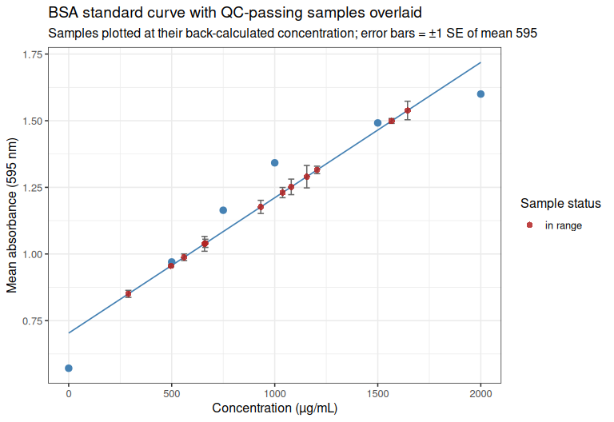

Gen5-20260813-mgig-sormi-BSA-F07-protein
================
Sam White
2026-08-13

- [1 BACKGROUND](#1-background)
- [2 SETUP](#2-setup)
  - [2.1 Libraries](#21-libraries)
  - [2.2 Set output directory](#22-set-output-directory)
- [3 DATA IMPORT](#3-data-import)
- [4 RESHAPING](#4-reshaping)
- [5 MEAN VALUES](#5-mean-values)
  - [5.1 Mean 595 nm absorbance](#51-mean-595-nm-absorbance)
  - [5.2 Mean concentration](#52-mean-concentration)
- [6 STANDARD DEVIATION AND COEFFICIENT OF
  VARIATION](#6-standard-deviation-and-coefficient-of-variation)
  - [6.1 SD and CV of 595 nm
    absorbance](#61-sd-and-cv-of-595-nm-absorbance)
  - [6.2 SD and CV of concentration](#62-sd-and-cv-of-concentration)
  - [6.3 Combined per-group summary](#63-combined-per-group-summary)
- [7 CV-BASED EXCLUSION](#7-cv-based-exclusion)
- [8 STANDARD CURVE](#8-standard-curve)
  - [8.1 Plot standard curve](#81-plot-standard-curve)
- [9 APPLYING THE STANDARD CURVE TO
  SAMPLES](#9-applying-the-standard-curve-to-samples)
  - [9.1 Plot samples on standard
    curve](#91-plot-samples-on-standard-curve)
- [10 RESULTS TABLE](#10-results-table)
- [11 SUMMARY](#11-summary)
  - [11.1 Samples passing QC](#111-samples-passing-qc)
  - [11.2 Samples recommended for
    re-assay](#112-samples-recommended-for-re-assay)

# 1 BACKGROUND

Protein quantification (BCA/Bradford-style, 595 nm) of *Magallana gigas*
(Pacific oyster) SoRMI plate `F07`, 16 samples (`F07_01`-`F07_08`,
ambient and 36°C exposure) plus an 8-point BSA standard curve, each
measured in triplicate wells.

The raw Gen5 export (`Gen5-20260813-mgig-BSA-F07-absorbance.csv`) is a
per-well table where each triplicate group’s first row carries the
sample/standard ID and the instrument’s own pre-computed
mean/SD/CV-of-concentration, and the two replicate rows below it carry
only well-level data. This document ignores the instrument’s
pre-computed summary columns and recomputes mean, SD, and CV
independently in R via `dplyr`, for both the raw absorbance (595 nm) and
the concentration.

**CV QC metric used for exclusion:** the \>15% technical-replicate CV
exclusion rule (including for standard-curve points) is applied to **CV
of concentration** (matching what the instrument’s own `CV (%)` column
already represents for this export – verified against the raw file:
e.g. `SPL1`’s given Mean/SD/CV of 694.467/49.577/7.139 are exactly the
mean/SD/CV of its three `[Concentration]` values, not of its `595`
values). Concentration CV is the more sensitive metric here: several
groups exceed 15% on concentration while none do on raw absorbance,
since back-calculation against a curve with a non-zero intercept
amplifies small absorbance differences into larger relative
concentration differences.

Two edge cases in the raw `[Concentration]` column need explicit
handling:

- **Censored reads.** Wells reading outside the instrument’s own
  internal standard-curve range are reported as `<0.000` or `>2100.000`
  rather than a number. These are parsed to a `_censored` flag plus the
  boundary value, and excluded from concentration mean/SD/CV
  calculations (their true value is unknown, not equal to the boundary).
- **The zero (blank) BSA standard** (`STD8`) is *always* censored
  (`<0.000` on all three wells), by construction – a true-zero
  standard’s back-calculated concentration is not a meaningful quantity
  to compute a CV on, and this is not a data-quality problem. `STD8` is
  therefore exempt from the concentration-CV exclusion rule and is
  retained as the curve’s origin point on the strength of its
  (excellent) 595 CV instead.

Any other group left with fewer than 2 valid (non-censored)
concentration replicates has an undefined (`NA`) concentration CV and is
treated as failing QC, consistent with the source file itself being
unable to compute a CV there either (`?????`). In this plate’s data,
every sample well yields a numeric (non-censored) concentration, so this
case only arises for the zero BSA standard (which is exempted, above).

# 2 SETUP

## 2.1 Libraries

``` r
library(knitr)
library(ggplot2)
library(dplyr)
```

    ## 
    ## Attaching package: 'dplyr'

    ## The following objects are masked from 'package:stats':
    ## 
    ##     filter, lag

    ## The following objects are masked from 'package:base':
    ## 
    ##     intersect, setdiff, setequal, union

``` r
library(tidyr)

knitr::opts_chunk$set(
  echo = TRUE,         # Display code chunks
  eval = TRUE,         # Evaluate code chunks
  warning = FALSE,     # Hide warnings
  message = FALSE,     # Hide messages
  comment = "",        # Prevents appending '##' to beginning of lines in code output
  results = 'hold'     # Holds output so it's all printed together after code chunk
)
```

## 2.2 Set output directory

``` r
output_dir <- "../outputs/Gen5-20260813-mgig-BSA-F07"
dir.create(output_dir, showWarnings = FALSE, recursive = TRUE)
```

# 3 DATA IMPORT

The raw file is a Gen5 per-well export with non-syntactic column names
(`[Concentration]`, `CV (%)`, etc.) and a UTF-8 byte-order mark on the
first header cell, so columns are renamed by position immediately after
import rather than referenced by their original names.

``` r
data_path <- "../data/BSA/raw_absorbance/Gen5-20260813-mgig-BSA-F07-absorbance.csv"

protein_raw <- read.csv(data_path, stringsAsFactors = FALSE, check.names = FALSE,
                         na.strings = c("", "NA"))
colnames(protein_raw) <- c("well_id", "name", "well", "std_conc_known", "abs_595",
                           "gen5_concentration", "gen5_count", "gen5_mean",
                           "gen5_sd", "gen5_cv")

cat("--- protein_raw: as imported from the Gen5 export ---\n")
str(protein_raw)
```

    --- protein_raw: as imported from the Gen5 export ---
    'data.frame':   72 obs. of  10 variables:
     $ well_id           : chr  "SPL1" NA NA "SPL2" ...
     $ name              : chr  "F07_01_36C" NA NA "F07_02_36C" ...
     $ well              : chr  "A1" "A2" "A3" "A4" ...
     $ std_conc_known    : int  NA NA NA NA NA NA NA NA NA NA ...
     $ abs_595           : num  1.01 1.04 1.07 1.15 1.15 ...
     $ gen5_concentration: chr  "645.965" "692.383" "745.053" "909.883" ...
     $ gen5_count        : int  3 NA NA 3 NA NA 3 NA NA 3 ...
     $ gen5_mean         : chr  "694.467" NA NA "953.017" ...
     $ gen5_sd           : chr  "49.577" NA NA "81.025" ...
     $ gen5_cv           : chr  "7.139" NA NA "8.502" ...

# 4 RESHAPING

`well_id` and `name` are only populated on the first row of each
triplicate group in the raw export, so they are filled downward. Each
row is also classified as a `standard` (`well_id` starts with `STD`) or
a `sample` (`SPL`), and the instrument’s censored concentration strings
(`<0.000`, `>2100.000`) are parsed into a numeric value plus a
`gen5_concentration_censored` flag.

``` r
protein_long <- protein_raw %>%
  select(well_id, name, well, std_conc_known, abs_595, gen5_concentration) %>%
  fill(well_id, name, .direction = "down") %>%
  mutate(
    type = if_else(grepl("^STD", well_id), "standard", "sample"),
    gen5_concentration_censored = grepl("^[<>]", gen5_concentration),
    gen5_concentration_numeric  = as.numeric(gsub("[<>]", "", gen5_concentration))
  )

cat("--- protein_long: one row per well, group identifiers filled down ---\n")
str(protein_long)
```

    --- protein_long: one row per well, group identifiers filled down ---
    'data.frame':   72 obs. of  9 variables:
     $ well_id                    : chr  "SPL1" "SPL1" "SPL1" "SPL2" ...
     $ name                       : chr  "F07_01_36C" "F07_01_36C" "F07_01_36C" "F07_02_36C" ...
     $ well                       : chr  "A1" "A2" "A3" "A4" ...
     $ std_conc_known             : int  NA NA NA NA NA NA NA NA NA NA ...
     $ abs_595                    : num  1.01 1.04 1.07 1.15 1.15 ...
     $ gen5_concentration         : chr  "645.965" "692.383" "745.053" "909.883" ...
     $ type                       : chr  "sample" "sample" "sample" "sample" ...
     $ gen5_concentration_censored: logi  FALSE FALSE FALSE FALSE FALSE FALSE ...
     $ gen5_concentration_numeric : num  646 692 745 910 903 ...

# 5 MEAN VALUES

## 5.1 Mean 595 nm absorbance

``` r
mean_595_by_group <- protein_long %>%
  group_by(well_id, name, type, std_conc_known) %>%
  summarise(n_wells  = n(),
            mean_595 = mean(abs_595),
            .groups  = "drop")

cat("--- mean_595_by_group ---\n")
str(mean_595_by_group)
```

    --- mean_595_by_group ---
    tibble [24 × 6] (S3: tbl_df/tbl/data.frame)
     $ well_id       : chr [1:24] "SPL1" "SPL10" "SPL11" "SPL12" ...
     $ name          : chr [1:24] "F07_01_36C" "F07_02_ambient" "F07_03_ambient" "F07_04_ambient" ...
     $ type          : chr [1:24] "sample" "sample" "sample" "sample" ...
     $ std_conc_known: int [1:24] NA NA NA NA NA NA NA NA NA NA ...
     $ n_wells       : int [1:24] 3 3 3 3 3 3 3 3 3 3 ...
     $ mean_595      : num [1:24] 1.04 1.25 1.29 1.02 1.04 ...

## 5.2 Mean concentration

Censored wells (reading outside the instrument’s own standard-curve
range) are dropped before averaging, since their true concentration is
unknown.

``` r
mean_conc_by_group <- protein_long %>%
  filter(!gen5_concentration_censored) %>%
  group_by(well_id, name, type, std_conc_known) %>%
  summarise(n_wells_valid_conc  = n(),
            mean_concentration  = mean(gen5_concentration_numeric),
            .groups = "drop")

cat("--- mean_conc_by_group ---\n")
str(mean_conc_by_group)
```

    --- mean_conc_by_group ---
    tibble [23 × 6] (S3: tbl_df/tbl/data.frame)
     $ well_id           : chr [1:23] "SPL1" "SPL10" "SPL11" "SPL12" ...
     $ name              : chr [1:23] "F07_01_36C" "F07_02_ambient" "F07_03_ambient" "F07_04_ambient" ...
     $ type              : chr [1:23] "sample" "sample" "sample" "sample" ...
     $ std_conc_known    : int [1:23] NA NA NA NA NA NA NA NA NA NA ...
     $ n_wells_valid_conc: int [1:23] 3 3 3 3 3 3 3 3 3 3 ...
     $ mean_concentration: num [1:23] 694 1096 1168 652 691 ...

# 6 STANDARD DEVIATION AND COEFFICIENT OF VARIATION

## 6.1 SD and CV of 595 nm absorbance

``` r
sd_cv_595_by_group <- protein_long %>%
  group_by(well_id, name, type, std_conc_known) %>%
  summarise(
    n_wells  = n(),
    mean_595 = mean(abs_595),
    sd_595   = sd(abs_595),
    cv_595   = 100 * sd_595 / mean_595,
    .groups  = "drop"
  )

cat("--- sd_cv_595_by_group ---\n")
str(sd_cv_595_by_group)
```

    --- sd_cv_595_by_group ---
    tibble [24 × 8] (S3: tbl_df/tbl/data.frame)
     $ well_id       : chr [1:24] "SPL1" "SPL10" "SPL11" "SPL12" ...
     $ name          : chr [1:24] "F07_01_36C" "F07_02_ambient" "F07_03_ambient" "F07_04_ambient" ...
     $ type          : chr [1:24] "sample" "sample" "sample" "sample" ...
     $ std_conc_known: int [1:24] NA NA NA NA NA NA NA NA NA NA ...
     $ n_wells       : int [1:24] 3 3 3 3 3 3 3 3 3 3 ...
     $ mean_595      : num [1:24] 1.04 1.25 1.29 1.02 1.04 ...
     $ sd_595        : num [1:24] 0.0265 0.0505 0.073 0.0835 0.0481 ...
     $ cv_595        : num [1:24] 2.55 4.03 5.66 8.2 4.64 ...

## 6.2 SD and CV of concentration

``` r
sd_cv_conc_by_group <- protein_long %>%
  filter(!gen5_concentration_censored) %>%
  group_by(well_id, name, type, std_conc_known) %>%
  summarise(
    n_wells_valid_conc  = n(),
    mean_concentration  = mean(gen5_concentration_numeric),
    sd_concentration    = sd(gen5_concentration_numeric),
    cv_concentration    = 100 * sd_concentration / mean_concentration,
    .groups = "drop"
  )

cat("--- sd_cv_conc_by_group ---\n")
str(sd_cv_conc_by_group)
```

    --- sd_cv_conc_by_group ---
    tibble [23 × 8] (S3: tbl_df/tbl/data.frame)
     $ well_id           : chr [1:23] "SPL1" "SPL10" "SPL11" "SPL12" ...
     $ name              : chr [1:23] "F07_01_36C" "F07_02_ambient" "F07_03_ambient" "F07_04_ambient" ...
     $ type              : chr [1:23] "sample" "sample" "sample" "sample" ...
     $ std_conc_known    : int [1:23] NA NA NA NA NA NA NA NA NA NA ...
     $ n_wells_valid_conc: int [1:23] 3 3 3 3 3 3 3 3 3 3 ...
     $ mean_concentration: num [1:23] 694 1096 1168 652 691 ...
     $ sd_concentration  : num [1:23] 49.6 95.8 138.6 157.5 91.5 ...
     $ cv_concentration  : num [1:23] 7.14 8.74 11.87 24.15 13.24 ...

## 6.3 Combined per-group summary

``` r
group_stats <- sd_cv_595_by_group %>%
  left_join(
    sd_cv_conc_by_group %>%
      select(well_id, mean_concentration, sd_concentration, cv_concentration, n_wells_valid_conc),
    by = "well_id"
  ) %>%
  arrange(type, well_id)

cat("--- group_stats: one row per sample/standard, 595- and concentration-level stats ---\n")
str(group_stats)
kable(group_stats, digits = 3)
```

    --- group_stats: one row per sample/standard, 595- and concentration-level stats ---
    tibble [24 × 12] (S3: tbl_df/tbl/data.frame)
     $ well_id           : chr [1:24] "SPL1" "SPL10" "SPL11" "SPL12" ...
     $ name              : chr [1:24] "F07_01_36C" "F07_02_ambient" "F07_03_ambient" "F07_04_ambient" ...
     $ type              : chr [1:24] "sample" "sample" "sample" "sample" ...
     $ std_conc_known    : int [1:24] NA NA NA NA NA NA NA NA NA NA ...
     $ n_wells           : int [1:24] 3 3 3 3 3 3 3 3 3 3 ...
     $ mean_595          : num [1:24] 1.04 1.25 1.29 1.02 1.04 ...
     $ sd_595            : num [1:24] 0.0265 0.0505 0.073 0.0835 0.0481 ...
     $ cv_595            : num [1:24] 2.55 4.03 5.66 8.2 4.64 ...
     $ mean_concentration: num [1:24] 694 1096 1168 652 691 ...
     $ sd_concentration  : num [1:24] 49.6 95.8 138.6 157.5 91.5 ...
     $ cv_concentration  : num [1:24] 7.14 8.74 11.87 24.15 13.24 ...
     $ n_wells_valid_conc: int [1:24] 3 3 3 3 3 3 3 3 3 3 ...

| well_id | name | type | std_conc_known | n_wells | mean_595 | sd_595 | cv_595 | mean_concentration | sd_concentration | cv_concentration | n_wells_valid_conc |
|:---|:---|:---|---:|---:|---:|---:|---:|---:|---:|---:|---:|
| SPL1 | F07_01_36C | sample | NA | 3 | 1.040 | 0.027 | 2.549 | 694.467 | 49.577 | 7.139 | 3 |
| SPL10 | F07_02_ambient | sample | NA | 3 | 1.252 | 0.051 | 4.035 | 1095.807 | 95.759 | 8.739 | 3 |
| SPL11 | F07_03_ambient | sample | NA | 3 | 1.290 | 0.073 | 5.658 | 1168.307 | 138.620 | 11.865 | 3 |
| SPL12 | F07_04_ambient | sample | NA | 3 | 1.018 | 0.083 | 8.203 | 652.091 | 157.509 | 24.154 | 3 |
| SPL13 | F07_05_ambient | sample | NA | 3 | 1.038 | 0.048 | 4.637 | 690.741 | 91.456 | 13.240 | 3 |
| SPL14 | F07_06_ambient | sample | NA | 3 | 1.296 | 0.099 | 7.647 | 1178.349 | 187.114 | 15.879 | 3 |
| SPL15 | F07_07_ambient | sample | NA | 3 | 1.538 | 0.060 | 3.922 | 1638.927 | 114.400 | 6.980 | 3 |
| SPL16 | F07_08_ambient | sample | NA | 3 | 0.988 | 0.022 | 2.184 | 595.253 | 41.154 | 6.914 | 3 |
| SPL2 | F07_02_36C | sample | NA | 3 | 1.177 | 0.043 | 3.635 | 953.017 | 81.025 | 8.502 | 3 |
| SPL3 | F07_03_36C | sample | NA | 3 | 1.315 | 0.024 | 1.841 | 1216.746 | 46.107 | 3.789 | 3 |
| SPL4 | F07_04_36C | sample | NA | 3 | 1.499 | 0.016 | 1.048 | 1564.027 | 29.665 | 1.897 | 3 |
| SPL5 | F07_05_36C | sample | NA | 3 | 0.878 | 0.031 | 3.585 | 388.299 | 59.694 | 15.373 | 3 |
| SPL6 | F07_06_36C | sample | NA | 3 | 0.955 | 0.008 | 0.813 | 533.741 | 14.556 | 2.727 | 3 |
| SPL7 | F07_07_36C | sample | NA | 3 | 1.230 | 0.033 | 2.689 | 1054.821 | 63.068 | 5.979 | 3 |
| SPL8 | F07_08_36C | sample | NA | 3 | 0.850 | 0.023 | 2.675 | 334.997 | 42.754 | 12.762 | 3 |
| SPL9 | F07_01_ambient | sample | NA | 3 | 0.805 | 0.059 | 7.285 | 249.551 | 110.645 | 44.338 | 3 |
| STD1 | BSA | standard | 2000 | 3 | 1.600 | 0.023 | 1.442 | 1755.192 | 43.330 | 2.469 | 3 |
| STD2 | BSA | standard | 1500 | 3 | 1.492 | 0.021 | 1.423 | 1549.754 | 40.397 | 2.607 | 3 |
| STD3 | BSA | standard | 1000 | 3 | 1.342 | 0.031 | 2.328 | 1266.321 | 59.723 | 4.716 | 3 |
| STD4 | BSA | standard | 750 | 3 | 1.164 | 0.039 | 3.324 | 930.092 | 73.726 | 7.927 | 3 |
| STD5 | BSA | standard | 500 | 3 | 0.970 | 0.024 | 2.455 | 561.213 | 44.720 | 7.968 | 3 |
| STD6 | BSA | standard | 250 | 3 | 0.796 | 0.030 | 3.726 | 232.689 | 55.661 | 23.921 | 3 |
| STD7 | BSA | standard | 125 | 3 | 0.686 | 0.016 | 2.314 | 23.525 | 29.610 | 125.869 | 3 |
| STD8 | BSA | standard | 0 | 3 | 0.571 | 0.007 | 1.165 | NA | NA | NA | NA |

# 7 CV-BASED EXCLUSION

Groups with CV(concentration) \> 15% – or an undefined concentration CV
due to insufficient valid (non-censored) replicates – are flagged and
excluded from all downstream analysis, including standard-curve fitting.
The zero BSA standard (`STD8`) is exempt from this rule (see Background)
and is always retained.

``` r
group_stats <- group_stats %>%
  mutate(
    is_zero_standard = type == "standard" & !is.na(std_conc_known) & std_conc_known == 0,
    high_cv = !is_zero_standard & (is.na(cv_concentration) | cv_concentration > 15)
  )

excluded_groups <- group_stats %>% filter(high_cv)

cat("--- excluded_groups: CV(concentration) > 15% (or undefined), dropped from further analysis ---\n")
str(excluded_groups)
kable(excluded_groups %>%
        select(well_id, name, type, std_conc_known, n_wells_valid_conc,
               mean_concentration, sd_concentration, cv_concentration),
      digits = 3)

clean_group_stats <- group_stats %>% filter(!high_cv)

cat("\nRetained after CV exclusion:", nrow(clean_group_stats), "of", nrow(group_stats), "groups\n")
str(clean_group_stats)
```

    --- excluded_groups: CV(concentration) > 15% (or undefined), dropped from further analysis ---
    tibble [6 × 14] (S3: tbl_df/tbl/data.frame)
     $ well_id           : chr [1:6] "SPL12" "SPL14" "SPL5" "SPL9" ...
     $ name              : chr [1:6] "F07_04_ambient" "F07_06_ambient" "F07_05_36C" "F07_01_ambient" ...
     $ type              : chr [1:6] "sample" "sample" "sample" "sample" ...
     $ std_conc_known    : int [1:6] NA NA NA NA 250 125
     $ n_wells           : int [1:6] 3 3 3 3 3 3
     $ mean_595          : num [1:6] 1.018 1.296 0.878 0.805 0.796 ...
     $ sd_595            : num [1:6] 0.0835 0.0991 0.0315 0.0586 0.0297 ...
     $ cv_595            : num [1:6] 8.2 7.65 3.59 7.28 3.73 ...
     $ mean_concentration: num [1:6] 652 1178 388 250 233 ...
     $ sd_concentration  : num [1:6] 157.5 187.1 59.7 110.6 55.7 ...
     $ cv_concentration  : num [1:6] 24.2 15.9 15.4 44.3 23.9 ...
     $ n_wells_valid_conc: int [1:6] 3 3 3 3 3 3
     $ is_zero_standard  : logi [1:6] FALSE FALSE FALSE FALSE FALSE FALSE
     $ high_cv           : logi [1:6] TRUE TRUE TRUE TRUE TRUE TRUE

| well_id | name | type | std_conc_known | n_wells_valid_conc | mean_concentration | sd_concentration | cv_concentration |
|:---|:---|:---|---:|---:|---:|---:|---:|
| SPL12 | F07_04_ambient | sample | NA | 3 | 652.091 | 157.509 | 24.154 |
| SPL14 | F07_06_ambient | sample | NA | 3 | 1178.349 | 187.114 | 15.879 |
| SPL5 | F07_05_36C | sample | NA | 3 | 388.299 | 59.694 | 15.373 |
| SPL9 | F07_01_ambient | sample | NA | 3 | 249.551 | 110.645 | 44.338 |
| STD6 | BSA | standard | 250 | 3 | 232.689 | 55.661 | 23.921 |
| STD7 | BSA | standard | 125 | 3 | 23.525 | 29.610 | 125.869 |

    Retained after CV exclusion: 18 of 24 groups
    tibble [18 × 14] (S3: tbl_df/tbl/data.frame)
     $ well_id           : chr [1:18] "SPL1" "SPL10" "SPL11" "SPL13" ...
     $ name              : chr [1:18] "F07_01_36C" "F07_02_ambient" "F07_03_ambient" "F07_05_ambient" ...
     $ type              : chr [1:18] "sample" "sample" "sample" "sample" ...
     $ std_conc_known    : int [1:18] NA NA NA NA NA NA NA NA NA NA ...
     $ n_wells           : int [1:18] 3 3 3 3 3 3 3 3 3 3 ...
     $ mean_595          : num [1:18] 1.04 1.25 1.29 1.04 1.54 ...
     $ sd_595            : num [1:18] 0.0265 0.0505 0.073 0.0481 0.0603 ...
     $ cv_595            : num [1:18] 2.55 4.03 5.66 4.64 3.92 ...
     $ mean_concentration: num [1:18] 694 1096 1168 691 1639 ...
     $ sd_concentration  : num [1:18] 49.6 95.8 138.6 91.5 114.4 ...
     $ cv_concentration  : num [1:18] 7.14 8.74 11.87 13.24 6.98 ...
     $ n_wells_valid_conc: int [1:18] 3 3 3 3 3 3 3 3 3 3 ...
     $ is_zero_standard  : logi [1:18] FALSE FALSE FALSE FALSE FALSE FALSE ...
     $ high_cv           : logi [1:18] FALSE FALSE FALSE FALSE FALSE FALSE ...

# 8 STANDARD CURVE

Fit using only the retained (CV ≤ 15%) standard points: known BSA
concentration (`Conc/Dil`) on the x-axis, mean 595 nm absorbance on the
y-axis.

``` r
standards_clean <- clean_group_stats %>% filter(type == "standard")

cat("--- standards_clean: standard points retained for curve fitting ---\n")
str(standards_clean)

standard_curve_model <- lm(mean_595 ~ std_conc_known, data = standards_clean)

curve_slope     <- unname(coef(standard_curve_model)[2])
curve_intercept <- unname(coef(standard_curve_model)[1])
curve_r2        <- summary(standard_curve_model)$r.squared

cat("Standard curve fit: 595 =", format(curve_slope, digits = 6), "* concentration +",
    format(curve_intercept, digits = 4), "\n")
cat("R2:", round(curve_r2, 5), "\n")
```

    --- standards_clean: standard points retained for curve fitting ---
    tibble [6 × 14] (S3: tbl_df/tbl/data.frame)
     $ well_id           : chr [1:6] "STD1" "STD2" "STD3" "STD4" ...
     $ name              : chr [1:6] "BSA" "BSA" "BSA" "BSA" ...
     $ type              : chr [1:6] "standard" "standard" "standard" "standard" ...
     $ std_conc_known    : int [1:6] 2000 1500 1000 750 500 0
     $ n_wells           : int [1:6] 3 3 3 3 3 3
     $ mean_595          : num [1:6] 1.6 1.49 1.34 1.16 0.97 ...
     $ sd_595            : num [1:6] 0.0231 0.0212 0.0312 0.0387 0.0238 ...
     $ cv_595            : num [1:6] 1.44 1.42 2.33 3.32 2.45 ...
     $ mean_concentration: num [1:6] 1755 1550 1266 930 561 ...
     $ sd_concentration  : num [1:6] 43.3 40.4 59.7 73.7 44.7 ...
     $ cv_concentration  : num [1:6] 2.47 2.61 4.72 7.93 7.97 ...
     $ n_wells_valid_conc: int [1:6] 3 3 3 3 3 NA
     $ is_zero_standard  : logi [1:6] FALSE FALSE FALSE FALSE FALSE TRUE
     $ high_cv           : logi [1:6] FALSE FALSE FALSE FALSE FALSE FALSE
    Standard curve fit: 595 = 0.000507804 * concentration + 0.7032 
    R2: 0.92166 

## 8.1 Plot standard curve

``` r
eq_label <- paste0("y = ", format(curve_slope, digits = 4, scientific = TRUE), "x + ",
                    sprintf("%.4f", curve_intercept),
                    "\nR² = ", sprintf("%.4f", curve_r2))

standard_curve_plot <- ggplot(standards_clean, aes(x = std_conc_known, y = mean_595)) +
  geom_smooth(method = "lm", formula = y ~ x, se = FALSE, color = "steelblue", linewidth = 0.6) +
  geom_errorbar(aes(ymin = mean_595 - sd_595, ymax = mean_595 + sd_595),
                width = 30, color = "grey40") +
  geom_point(size = 2.6, color = "steelblue") +
  annotate("text", x = -Inf, y = Inf, label = eq_label,
           hjust = -0.08, vjust = 1.3, size = 3.6, fontface = "bold") +
  labs(x = "BSA standard concentration (µg/mL)",
       y = "Mean absorbance (595 nm)",
       title = "BSA standard curve",
       subtitle = "Points with technical-replicate CV(concentration) > 15% excluded (see below)") +
  theme_bw(base_size = 12)

print(standard_curve_plot)
```

<!-- -->

``` r
ggsave(file.path(output_dir, "standard_curve_595.png"), standard_curve_plot,
       width = 7, height = 5.5, dpi = 300)
```

Standard points excluded from the curve:

``` r
excluded_standards <- group_stats %>% filter(type == "standard", high_cv)

cat("--- excluded_standards ---\n")
str(excluded_standards)
kable(excluded_standards %>%
        select(well_id, std_conc_known, mean_concentration, sd_concentration, cv_concentration),
      digits = 3)
```

    --- excluded_standards ---
    tibble [2 × 14] (S3: tbl_df/tbl/data.frame)
     $ well_id           : chr [1:2] "STD6" "STD7"
     $ name              : chr [1:2] "BSA" "BSA"
     $ type              : chr [1:2] "standard" "standard"
     $ std_conc_known    : int [1:2] 250 125
     $ n_wells           : int [1:2] 3 3
     $ mean_595          : num [1:2] 0.796 0.686
     $ sd_595            : num [1:2] 0.0297 0.0159
     $ cv_595            : num [1:2] 3.73 2.31
     $ mean_concentration: num [1:2] 232.7 23.5
     $ sd_concentration  : num [1:2] 55.7 29.6
     $ cv_concentration  : num [1:2] 23.9 125.9
     $ n_wells_valid_conc: int [1:2] 3 3
     $ is_zero_standard  : logi [1:2] FALSE FALSE
     $ high_cv           : logi [1:2] TRUE TRUE

| well_id | std_conc_known | mean_concentration | sd_concentration | cv_concentration |
|:--------|---------------:|-------------------:|-----------------:|-----------------:|
| STD6    |            250 |            232.689 |           55.661 |           23.921 |
| STD7    |            125 |             23.525 |           29.610 |          125.869 |

# 9 APPLYING THE STANDARD CURVE TO SAMPLES

Samples that passed CV QC are back-calculated against the fitted curve.
Samples whose mean 595 falls outside the retained standards’ absorbance
range are flagged as extrapolated.

``` r
samples_clean <- clean_group_stats %>%
  filter(type == "sample") %>%
  mutate(
    se_595                    = sd_595 / sqrt(n_wells),
    calculated_concentration  = (mean_595 - curve_intercept) / curve_slope,
    in_curve_range            = mean_595 >= min(standards_clean$mean_595) &
                                  mean_595 <= max(standards_clean$mean_595)
  ) %>%
  arrange(name)

cat("--- samples_clean: CV-QC-passing samples, quantified against the fitted standard curve ---\n")
str(samples_clean)
```

    --- samples_clean: CV-QC-passing samples, quantified against the fitted standard curve ---
    tibble [12 × 17] (S3: tbl_df/tbl/data.frame)
     $ well_id                 : chr [1:12] "SPL1" "SPL2" "SPL10" "SPL3" ...
     $ name                    : chr [1:12] "F07_01_36C" "F07_02_36C" "F07_02_ambient" "F07_03_36C" ...
     $ type                    : chr [1:12] "sample" "sample" "sample" "sample" ...
     $ std_conc_known          : int [1:12] NA NA NA NA NA NA NA NA NA NA ...
     $ n_wells                 : int [1:12] 3 3 3 3 3 3 3 3 3 3 ...
     $ mean_595                : num [1:12] 1.04 1.18 1.25 1.32 1.29 ...
     $ sd_595                  : num [1:12] 0.0265 0.0428 0.0505 0.0242 0.073 ...
     $ cv_595                  : num [1:12] 2.55 3.63 4.03 1.84 5.66 ...
     $ mean_concentration      : num [1:12] 694 953 1096 1217 1168 ...
     $ sd_concentration        : num [1:12] 49.6 81 95.8 46.1 138.6 ...
     $ cv_concentration        : num [1:12] 7.14 8.5 8.74 3.79 11.87 ...
     $ n_wells_valid_conc      : int [1:12] 3 3 3 3 3 3 3 3 3 3 ...
     $ is_zero_standard        : logi [1:12] FALSE FALSE FALSE FALSE FALSE FALSE ...
     $ high_cv                 : logi [1:12] FALSE FALSE FALSE FALSE FALSE FALSE ...
     $ se_595                  : num [1:12] 0.0153 0.0247 0.0292 0.014 0.0421 ...
     $ calculated_concentration: num [1:12] 663 932 1080 1205 1156 ...
     $ in_curve_range          : logi [1:12] TRUE TRUE TRUE TRUE TRUE TRUE ...

``` r
cat("Samples with absorbance outside the retained standard curve's range (extrapolated):\n")
kable(samples_clean %>% filter(!in_curve_range) %>%
        select(well_id, name, mean_595, calculated_concentration),
      digits = 3)
```

    Samples with absorbance outside the retained standard curve's range (extrapolated):

well_id name mean_595 calculated_concentration ——— —— ———- ————————–

## 9.1 Plot samples on standard curve

Every QC-passing sample is plotted at its own mean 595 and
back-calculated concentration, with vertical error bars of ±1 standard
error (of mean 595, across its 2-3 retained technical replicates),
overlaid on the standard curve fit line and retained standard points.

``` r
samples_on_curve_plot <- ggplot() +
  geom_smooth(data = standards_clean, aes(x = std_conc_known, y = mean_595),
              method = "lm", formula = y ~ x, se = FALSE,
              color = "steelblue", linewidth = 0.6) +
  geom_point(data = standards_clean, aes(x = std_conc_known, y = mean_595),
             size = 2.6, color = "steelblue") +
  geom_errorbar(data = samples_clean,
                aes(x = calculated_concentration,
                    ymin = mean_595 - se_595, ymax = mean_595 + se_595),
                width = 30, color = "grey40") +
  geom_point(data = samples_clean,
             aes(x = calculated_concentration, y = mean_595, shape = in_curve_range),
             size = 2.4, color = "firebrick", alpha = 0.85) +
  scale_shape_manual(values = c(`TRUE` = 16, `FALSE` = 4),
                      labels = c(`TRUE` = "in range", `FALSE` = "extrapolated"),
                      name = "Sample status") +
  labs(x = "Concentration (µg/mL)",
       y = "Mean absorbance (595 nm)",
       title = "BSA standard curve with QC-passing samples overlaid",
       subtitle = "Samples plotted at their back-calculated concentration; error bars = ±1 SE of mean 595") +
  theme_bw(base_size = 12)

print(samples_on_curve_plot)
```

<!-- -->

``` r
ggsave(file.path(output_dir, "standard_curve_with_samples.png"), samples_on_curve_plot,
       width = 8, height = 5.5, dpi = 300)
```

# 10 RESULTS TABLE

``` r
results_table <- samples_clean %>%
  transmute(
    Sample                              = name,
    `Well ID`                           = well_id,
    `Mean 595`                          = round(mean_595, 3),
    `CV 595 (%)`                        = round(cv_595, 2),
    `CV concentration (%)`              = round(cv_concentration, 2),
    `Calculated concentration (ug/mL)`  = round(calculated_concentration, 1),
    `In standard curve range`           = ifelse(in_curve_range, "yes", "NO - extrapolated")
  ) %>%
  arrange(gsub("[0-9]+$", "", `Well ID`), as.numeric(gsub("^[A-Za-z]+", "", `Well ID`)))

kable(results_table)
```

| Sample | Well ID | Mean 595 | CV 595 (%) | CV concentration (%) | Calculated concentration (ug/mL) | In standard curve range |
|:---|----|---:|----|---:|---:|:---|
| F07_01_36C | SPL1 | 1.040 | 2.55 | 7.14 | 663.3 | yes |
| F07_02_36C | SPL2 | 1.177 | 3.63 | 8.50 | 932.4 | yes |
| F07_03_36C | SPL3 | 1.315 | 1.84 | 3.79 | 1205.5 | yes |
| F07_04_36C | SPL4 | 1.499 | 1.05 | 1.90 | 1567.2 | yes |
| F07_06_36C | SPL6 | 0.955 | 0.81 | 2.73 | 496.5 | yes |
| F07_07_36C | SPL7 | 1.230 | 2.69 | 5.98 | 1038.1 | yes |
| F07_08_36C | SPL8 | 0.850 | 2.67 | 12.76 | 289.8 | yes |
| F07_02_ambient | SPL10 | 1.252 | 4.03 | 8.74 | 1080.1 | yes |
| F07_03_ambient | SPL11 | 1.290 | 5.66 | 11.87 | 1155.6 | yes |
| F07_05_ambient | SPL13 | 1.038 | 4.64 | 13.24 | 659.3 | yes |
| F07_07_ambient | SPL15 | 1.538 | 3.92 | 6.98 | 1644.6 | yes |
| F07_08_ambient | SPL16 | 0.988 | 2.18 | 6.91 | 560.2 | yes |

Only samples passing *all* QC – CV ≤ 15% and within the retained
standard curve’s range (i.e. not extrapolated) – are written to the CSV
output.

``` r
results_table_export <- results_table %>% filter(`In standard curve range` == "yes")

cat("--- results_table_export: samples passing all QC (CV and in-range), written to CSV ---\n")
str(results_table_export)

write.csv(results_table_export, file.path(output_dir, "sample_protein_concentrations.csv"), row.names = FALSE)
```

    --- results_table_export: samples passing all QC (CV and in-range), written to CSV ---
    tibble [12 × 7] (S3: tbl_df/tbl/data.frame)
     $ Sample                          : chr [1:12] "F07_01_36C" "F07_02_36C" "F07_03_36C" "F07_04_36C" ...
     $ Well ID                         : chr [1:12] "SPL1" "SPL2" "SPL3" "SPL4" ...
     $ Mean 595                        : num [1:12] 1.04 1.177 1.315 1.499 0.955 ...
     $ CV 595 (%)                      : num [1:12] 2.55 3.63 1.84 1.05 0.81 2.69 2.67 4.03 5.66 4.64 ...
     $ CV concentration (%)            : num [1:12] 7.14 8.5 3.79 1.9 2.73 ...
     $ Calculated concentration (ug/mL): num [1:12] 663 932 1206 1567 496 ...
     $ In standard curve range         : chr [1:12] "yes" "yes" "yes" "yes" ...

# 11 SUMMARY

- 24 sample/standard triplicate groups were imported (8 BSA standards,
  16 samples).
- 6 group(s) exceeded 15% technical-replicate CV(concentration), or had
  an undefined CV from insufficient valid replicates, and were excluded
  from all downstream analysis: SPL12 (F07_04_ambient), SPL14
  (F07_06_ambient), SPL5 (F07_05_36C), SPL9 (F07_01_ambient), STD6
  (BSA), STD7 (BSA).
- The BSA standard curve was fit on the 6 remaining standard points:
  slope = 0.0005078, intercept = 0.7032, R² = 0.9217.
- 0 CV-QC-passing sample(s) fell outside the retained standard curve’s
  absorbance range and are flagged as extrapolated in the results table
  above.

## 11.1 Samples passing QC

Sample names are sorted naturally (e.g. `F07_02_ambient` before
`F07_10_ambient`, and ignoring any stray punctuation), rather than by
plain lexicographic string order.

``` r
natural_sort_key <- function(x) gsub("[^A-Za-z0-9]", "", x)
```

``` r
passing_samples_table <- samples_clean %>%
  transmute(sample_name = name,
            `concentration(ug/mL)` = round(calculated_concentration, 1)) %>%
  arrange(natural_sort_key(sample_name))

cat("--- passing_samples_table: samples passing CV QC, name + calculated concentration ---\n")
str(passing_samples_table)

kable(passing_samples_table)
```

    --- passing_samples_table: samples passing CV QC, name + calculated concentration ---
    tibble [12 × 2] (S3: tbl_df/tbl/data.frame)
     $ sample_name         : chr [1:12] "F07_01_36C" "F07_02_36C" "F07_02_ambient" "F07_03_36C" ...
     $ concentration(ug/mL): num [1:12] 663 932 1080 1206 1156 ...

| sample_name    | concentration(ug/mL) |
|:---------------|---------------------:|
| F07_01_36C     |                663.3 |
| F07_02_36C     |                932.4 |
| F07_02_ambient |               1080.1 |
| F07_03_36C     |               1205.5 |
| F07_03_ambient |               1155.6 |
| F07_04_36C     |               1567.2 |
| F07_05_ambient |                659.3 |
| F07_06_36C     |                496.5 |
| F07_07_36C     |               1038.1 |
| F07_07_ambient |               1644.6 |
| F07_08_36C     |                289.8 |
| F07_08_ambient |                560.2 |

## 11.2 Samples recommended for re-assay

``` r
failed_qc_samples    <- excluded_groups %>% filter(type == "sample") %>% arrange(name)
extrapolated_samples <- samples_clean %>% filter(!in_curve_range) %>% arrange(name)

cat("--- failed_qc_samples: samples excluded from analysis on CV grounds ---\n")
str(failed_qc_samples)
cat("\n--- extrapolated_samples: QC-passing samples outside the retained standard curve's range ---\n")
str(extrapolated_samples)
```

    --- failed_qc_samples: samples excluded from analysis on CV grounds ---
    tibble [4 × 14] (S3: tbl_df/tbl/data.frame)
     $ well_id           : chr [1:4] "SPL9" "SPL12" "SPL5" "SPL14"
     $ name              : chr [1:4] "F07_01_ambient" "F07_04_ambient" "F07_05_36C" "F07_06_ambient"
     $ type              : chr [1:4] "sample" "sample" "sample" "sample"
     $ std_conc_known    : int [1:4] NA NA NA NA
     $ n_wells           : int [1:4] 3 3 3 3
     $ mean_595          : num [1:4] 0.805 1.018 0.878 1.296
     $ sd_595            : num [1:4] 0.0586 0.0835 0.0315 0.0991
     $ cv_595            : num [1:4] 7.28 8.2 3.59 7.65
     $ mean_concentration: num [1:4] 250 652 388 1178
     $ sd_concentration  : num [1:4] 110.6 157.5 59.7 187.1
     $ cv_concentration  : num [1:4] 44.3 24.2 15.4 15.9
     $ n_wells_valid_conc: int [1:4] 3 3 3 3
     $ is_zero_standard  : logi [1:4] FALSE FALSE FALSE FALSE
     $ high_cv           : logi [1:4] TRUE TRUE TRUE TRUE

    --- extrapolated_samples: QC-passing samples outside the retained standard curve's range ---
    tibble [0 × 17] (S3: tbl_df/tbl/data.frame)
     $ well_id                 : chr(0) 
     $ name                    : chr(0) 
     $ type                    : chr(0) 
     $ std_conc_known          : int(0) 
     $ n_wells                 : int(0) 
     $ mean_595                : num(0) 
     $ sd_595                  : num(0) 
     $ cv_595                  : num(0) 
     $ mean_concentration      : num(0) 
     $ sd_concentration        : num(0) 
     $ cv_concentration        : num(0) 
     $ n_wells_valid_conc      : int(0) 
     $ is_zero_standard        : logi(0) 
     $ high_cv                 : logi(0) 
     $ se_595                  : num(0) 
     $ calculated_concentration: num(0) 
     $ in_curve_range          : logi(0) 

``` r
reassay_candidates <- bind_rows(
  failed_qc_samples %>%
    transmute(`Sample name` = name,
              `Rationale for re-assay` = as.character(ifelse(
                is.na(cv_concentration),
                "CV undefined (< 2 valid replicates)",
                "CV > 15%"
              ))),
  extrapolated_samples %>%
    transmute(`Sample name` = name,
              `Rationale for re-assay` = "outside standard curve range")
) %>%
  arrange(natural_sort_key(`Sample name`))

cat("--- reassay_candidates: all samples flagged for re-assay, with rationale ---\n")
str(reassay_candidates)

kable(reassay_candidates)
```

    --- reassay_candidates: all samples flagged for re-assay, with rationale ---
    tibble [4 × 2] (S3: tbl_df/tbl/data.frame)
     $ Sample name           : chr [1:4] "F07_01_ambient" "F07_04_ambient" "F07_05_36C" "F07_06_ambient"
     $ Rationale for re-assay: chr [1:4] "CV > 15%" "CV > 15%" "CV > 15%" "CV > 15%"

| Sample name    | Rationale for re-assay |
|:---------------|:-----------------------|
| F07_01_ambient | CV \> 15%              |
| F07_04_ambient | CV \> 15%              |
| F07_05_36C     | CV \> 15%              |
| F07_06_ambient | CV \> 15%              |
