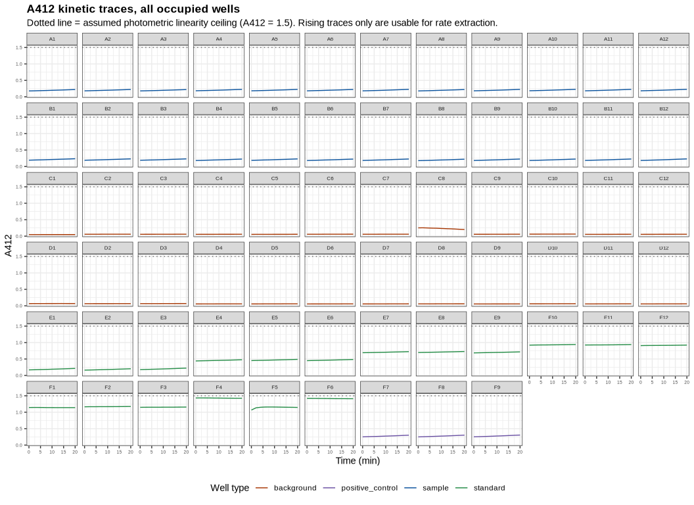
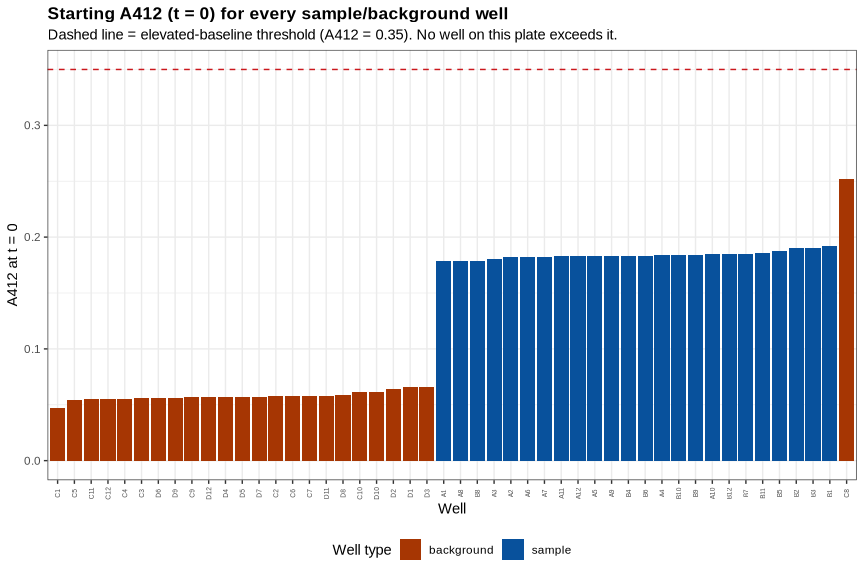
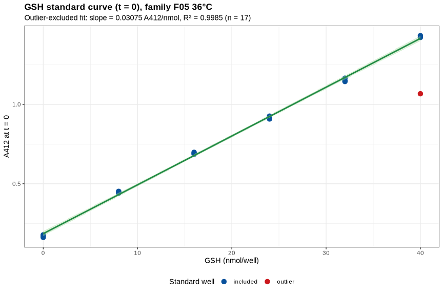
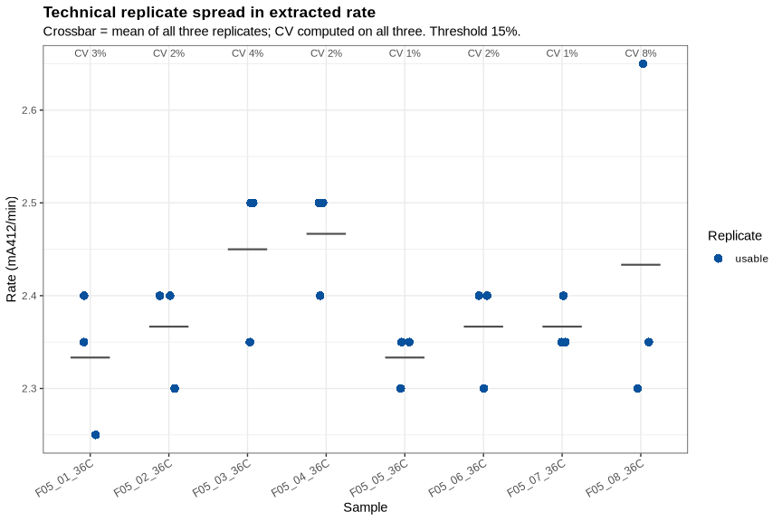
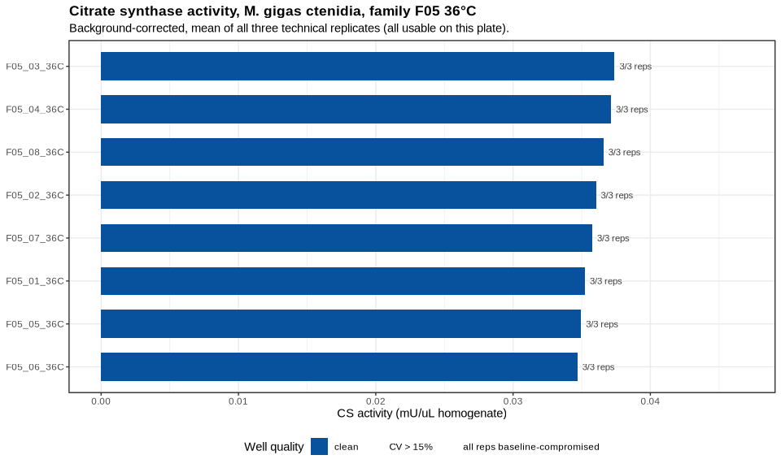
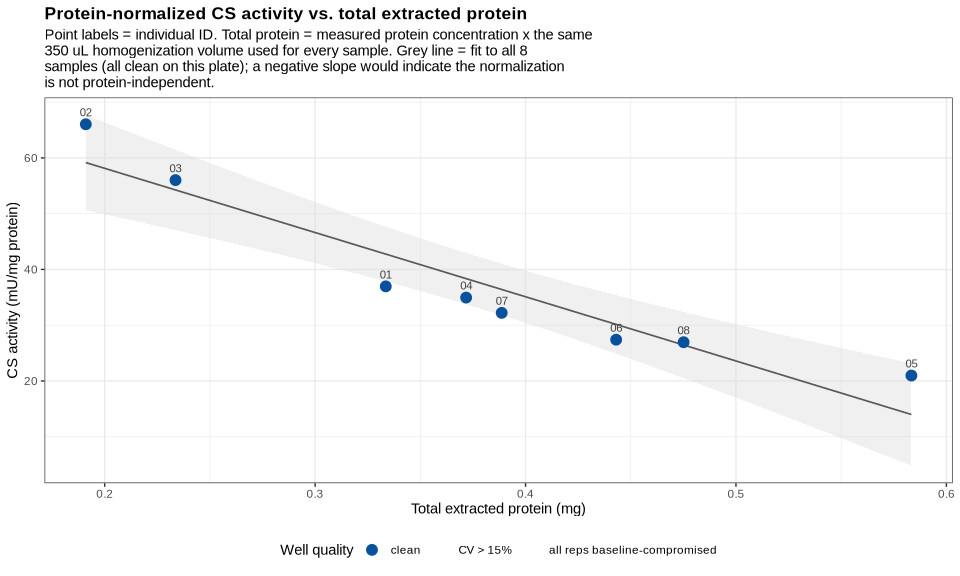

Gen5-20260814-mgig-citrate_synthase-F05-36C
================
Sam White
2026-08-14

- [1 BACKGROUND](#1-background)
  - [1.1 Sample naming convention](#11-sample-naming-convention)
  - [1.2 Notes](#12-notes)
  - [1.3 Pipeline functions](#13-pipeline-functions)
    - [1.3.1 Data import and layout
      parsing](#131-data-import-and-layout-parsing)
    - [1.3.2 Well-level kinetic QC](#132-well-level-kinetic-qc)
    - [1.3.3 Standard curve and rate
      extraction](#133-standard-curve-and-rate-extraction)
    - [1.3.4 Background correction, replicate CV, and activity
      calculation](#134-background-correction-replicate-cv-and-activity-calculation)
    - [1.3.5 QC summary and narrative
      generation](#135-qc-summary-and-narrative-generation)
  - [1.4 Assay parameters](#14-assay-parameters)
  - [1.5 Output directory](#15-output-directory)
- [2 DATA](#2-data)
  - [2.1 Plate layout](#21-plate-layout)
  - [2.2 Kinetic readers](#22-kinetic-readers)
  - [2.3 Cross-check against the full
    report](#23-cross-check-against-the-full-report)
  - [2.4 Annotate wells and parse
    metadata](#24-annotate-wells-and-parse-metadata)
  - [2.5 Protein concentration (normalization
    factor)](#25-protein-concentration-normalization-factor)
- [3 KINETIC TRACES](#3-kinetic-traces)
- [4 ANOMALY DETECTION](#4-anomaly-detection)
  - [4.1 Per-well trace diagnostics](#41-per-well-trace-diagnostics)
  - [4.2 Anomaly table](#42-anomaly-table)
  - [4.3 Background wells behaving as active
    reactions](#43-background-wells-behaving-as-active-reactions)
  - [4.4 Baseline diagnostic (elevated starting
    absorbance)](#44-baseline-diagnostic-elevated-starting-absorbance)
  - [4.5 Plot starting absorbance](#45-plot-starting-absorbance)
- [5 GSH STANDARD CURVE](#5-gsh-standard-curve)
  - [5.1 Fit the standard curve](#51-fit-the-standard-curve)
  - [5.2 Plot the standard curve](#52-plot-the-standard-curve)
- [6 RATE EXTRACTION](#6-rate-extraction)
  - [6.1 Rate tables by well type](#61-rate-tables-by-well-type)
  - [6.2 Positive control](#62-positive-control)
- [7 BACKGROUND CORRECTION](#7-background-correction)
  - [7.1 Background significance test](#71-background-significance-test)
- [8 TECHNICAL REPLICATE PRECISION](#8-technical-replicate-precision)
  - [8.1 Plot replicate spread](#81-plot-replicate-spread)
- [9 CITRATE SYNTHASE ACTIVITY](#9-citrate-synthase-activity)
  - [9.1 Calculation](#91-calculation)
  - [9.2 Results table](#92-results-table)
  - [9.3 Plot activity](#93-plot-activity)
  - [9.4 Protein-normalized activity](#94-protein-normalized-activity)
- [10 QC SUMMARY](#10-qc-summary)
  - [10.1 Auto-generated findings](#101-auto-generated-findings)
- [11 SUMMARY](#11-summary)
  - [11.1 Anomalies found](#111-anomalies-found)
  - [11.2 Technical replicate
    precision](#112-technical-replicate-precision)
  - [11.3 Assay validity](#113-assay-validity)
  - [11.4 Recommendation](#114-recommendation)
  - [11.5 What can be used from this
    plate](#115-what-can-be-used-from-this-plate)

# 1 BACKGROUND

Citrate synthase (CS) activity in ctenidia of eight *Magallana gigas*
(Pacific oyster) individuals from **family F05** held at **36 °C**
(heat-stress exposure), assayed 2026-08-14 with the [Abcam Citrate
Synthase Assay Kit (ab239712),
v4a](https://github.com/RobertsLab/resources/blob/master/protocols/Commercial_Protocols/ABCAM-Citrate-Synthase-Assay-v4a-ab239712.pdf).
The kit is a **coupled kinetic** assay. CS condenses acetyl-CoA and
oxaloacetate, releasing free CoA-SH; the liberated thiol reduces DTNB to
TNB<sup>2-</sup>, which absorbs at 412 nm. The **rate** of A412 increase
is proportional to CS activity, and absolute nmol of thiol are assigned
from a **GSH (reduced glutathione) standard curve** read on the same
plate.

Absorbance was read at 412 nm in kinetic mode, 25 °C, every 2 min for 20
min (11 reads) on a Synergy HTX. See note 1.

This document is fully self-contained: layout parsing, kinetic QC,
standard-curve fitting, rate extraction, CV computation, protein
normalization, and results assembly are all defined directly below (see
[`## Pipeline functions`](#13-pipeline-functions) under SETUP) rather
than sourced from a separate script, so the whole analysis can be
reproduced from this one file.

## 1.1 Sample naming convention

Well labels follow
`<family>_<individual>_<temperature>[_BG]-<assay_type>-<weight>-df.<n>`
for sample/background wells
(e.g. `F05_01_36C-citrate_synthase-12.8-df.0`),
`STD-<assay_type>-<nmol_per_well>` for GSH standards, and
`POS-<assay_type>` for the positive control, with the temperature
exposure encoded in the well label as `_36C`. The trailing number in the
sample label (e.g. `12.8`) is tissue weight in mg, which is **not** used
for normalization here (note 2); it is parsed and validated but plays no
role in the activity calculation.

## 1.2 Notes

1.  **Read duration for this plate is 20 minutes** (11 reads at 2-min
    intervals). The assay parameters below set `read_duration_min = 20`
    to match. Rate extraction uses a fixed-width sliding window
    (`rate_window_n = 5` points = 8 min) rather than the full trace, so
    this only changes how many windows are available to slide across;
    see the KINETIC TRACES section for whether the assay is still in its
    linear phase over this window.
2.  **Activity is normalized to total extracted protein, not tissue
    weight**, because protein concentration was measured directly
    (BCA-style assay, `sample_protein_concentrations_*.csv`), and
    controls for extraction efficiency in a way tissue weight cannot.
3.  **Protein concentrations are read from both supplied CSV files.**
    This plate’s `F05_07_36C` record is only present in file 1, and
    under a slightly different string (`F-05_07_36C`, extra hyphen) —
    corrected via `sample_id_fixes` in the `protein-concentration`
    chunk.

``` r
library(knitr)
library(ggplot2)
library(dplyr)
```

    ## 
    ## Attaching package: 'dplyr'

    ## The following objects are masked from 'package:stats':
    ## 
    ##     filter, lag

    ## The following objects are masked from 'package:base':
    ## 
    ##     intersect, setdiff, setequal, union

``` r
library(tidyr)

knitr::opts_chunk$set(
  echo = TRUE,         # Display code chunks
  eval = TRUE,         # Evaluate code chunks
  warning = FALSE,     # Hide warnings
  message = FALSE,     # Hide messages
  comment = "",        # Prevents appending '##' to beginning of lines in code output
  results = 'hold'     # Holds output so it's all printed together after code chunk
)
```

## 1.3 Pipeline functions

All layout parsing, kinetic QC, standard-curve fitting, rate extraction,
CV computation, protein normalization, and results assembly are defined
directly in this document (rather than sourced from a separate script)
so that it is fully self-contained and reproducible from this single
file. The functions are grouped below by pipeline stage; each is called
in the DATA / KINETIC TRACES / ANOMALY DETECTION / GSH STANDARD CURVE /
RATE EXTRACTION / BACKGROUND CORRECTION / TECHNICAL REPLICATE PRECISION
/ CITRATE SYNTHASE ACTIVITY / QC SUMMARY sections that follow. Nothing
plate-specific (typo fixes, disqualified samples, thresholds) is
hardcoded in any function – it is always passed in as an argument, from
the `assay_params` list defined further below or from a plate-specific
fix list.

### 1.3.1 Data import and layout parsing

Reads the raw Gen5 exports (kinetic absorbance CSV, full-report text
backup, plate-layout CSV), reconciles them against each other, and
attaches well-type/sample-id/replicate metadata plus measured protein
concentrations to every well.

``` r
## -----------------------------------------------------------------------
## elapsed_to_min()
## Purpose : Convert Gen5 "H:MM:SS" elapsed-time strings to decimal minutes.
## Inputs  : x - character vector of "H:MM:SS" strings
## Outputs : numeric vector of elapsed minutes, same length as x
## -----------------------------------------------------------------------
elapsed_to_min <- function(x) {
  vapply(strsplit(x, ":"), function(p) {
    p <- as.numeric(p)
    p[1] * 60 + p[2] + p[3] / 60
  }, numeric(1))
}

## -----------------------------------------------------------------------
## read_absorbance_csv()
## Purpose : Parse a Gen5 "absorbance-*.csv" kinetic export: wavelength
##           header, a "Time," row, a temperature row, then one row per well
##           (well ID in column 1, one OD reading per timepoint thereafter).
## Inputs  : path - path to the absorbance-*.csv file
## Outputs : long-format data.frame, one row per well x timepoint:
##           well (chr), time_min (dbl), od (dbl)
## -----------------------------------------------------------------------
read_absorbance_csv <- function(path) {
  ln <- iconv(readLines(path, warn = FALSE, encoding = "latin1"), "latin1", "UTF-8")
  time_i   <- grep("^Time,", ln)[1]
  time_str <- strsplit(ln[time_i], ",")[[1]]
  time_str <- time_str[!time_str %in% c("", "Time")]
  tmin     <- elapsed_to_min(time_str)

  well_ln <- ln[grepl("^[A-H][0-9]{1,2},", ln)]
  bind_rows(lapply(strsplit(well_ln, ","), function(p) {
    data.frame(well = p[1], time_min = tmin,
               od = as.numeric(p[seq_along(tmin) + 1]),
               stringsAsFactors = FALSE)
  }))
}

## -----------------------------------------------------------------------
## read_full_report()
## Purpose : Parse a Gen5 "full_report-*.txt" export: tab-delimited, wells
##           across columns, timepoints down rows. Used only as an
##           independent cross-check against the absorbance CSV, never as a
##           primary data source.
## Inputs  : path - path to the full_report-*.txt file
## Outputs : long-format data.frame, one row per well x timepoint:
##           well (chr), time_min (dbl), od (dbl)
## -----------------------------------------------------------------------
read_full_report <- function(path) {
  ln  <- iconv(readLines(path, warn = FALSE, encoding = "latin1"), "latin1", "UTF-8")
  hdr_i <- grep("^Time\t.*\tA1\t", ln)[1]
  hdr   <- trimws(strsplit(ln[hdr_i], "\t")[[1]])
  rows  <- ln[grepl("^[0-9]:[0-9]{2}:[0-9]{2}\t", ln)]
  m     <- do.call(rbind, strsplit(rows, "\t"))
  tmin  <- elapsed_to_min(m[, 1])

  well_cols <- which(grepl("^[A-H][0-9]{1,2}$", hdr))
  bind_rows(lapply(well_cols, function(j) {
    data.frame(well = hdr[j], time_min = tmin,
               od = as.numeric(m[, j]), stringsAsFactors = FALSE)
  }))
}

## -----------------------------------------------------------------------
## parse_plate_layout()
## Purpose : Convert a raw Gen5 plate-layout CSV export into one row per
##           occupied well with its descriptive label. Auto-detects two
##           export formats seen in practice:
##             "single"  - one row per plate row (row 1 = column numbers,
##                         column 1 = row letter, last column = "Name" tag);
##                         each cell already holds the full descriptive label.
##             "double"  - each plate row is exported as TWO rows: a
##                         "Well ID" row (SPL codes) immediately followed by
##                         a "Name" row (the descriptive label actually used
##                         downstream).
##           The format is detected from column 1: if a value repeats twice
##           in a row (once for the well-ID row, once for the label row)
##           immediately below a numeric header, it is treated as "double".
## Inputs  : path - path to the layout-*.csv file
## Outputs : data.frame, one row per occupied well:
##           well (chr, e.g. "A1"), plate_row (chr), plate_col (int),
##           label (chr, trimmed descriptive label)
## -----------------------------------------------------------------------
parse_plate_layout <- function(path) {
  plate_layout <- read.csv(path, header = FALSE, stringsAsFactors = FALSE)

  col1 <- trimws(plate_layout$V1)
  # "double" format: row letters appear twice in a row in column 1
  # (once tagging the Well-ID row, once tagging the Name row), e.g.
  # "A", "A", "B", "B", ... Detect by checking whether non-empty,
  # non-header values in col1 are each immediately followed by a repeat.
  data_rows   <- which(col1 != "" & !is.na(col1))[-1]  # drop header row (row 1)
  is_double <- length(data_rows) >= 2 &&
    all(col1[data_rows[c(TRUE, FALSE)]] == col1[data_rows[c(FALSE, TRUE)]][seq_len(floor(length(data_rows) / 2))])

  if (is_double) {
    # Pair each row-letter row with the following label row.
    row_letter_rows <- data_rows[c(TRUE, FALSE)]
    label_rows      <- data_rows[c(FALSE, TRUE)]
    stopifnot(length(row_letter_rows) == length(label_rows))

    out <- expand.grid(pair_idx = seq_along(row_letter_rows),
                        col_idx  = 2:(ncol(plate_layout) - 1)) %>%
      mutate(
        plate_row = col1[row_letter_rows[pair_idx]],
        plate_col = as.integer(plate_layout[1, col_idx]),
        well      = paste0(plate_row, plate_col),
        label     = trimws(mapply(function(i, j) plate_layout[i, j],
                                   label_rows[pair_idx], col_idx))
      ) %>%
      filter(label != "") %>%
      select(well, plate_row, plate_col, label) %>%
      arrange(plate_row, plate_col)
  } else {
    # "single" format: row 1 = column numbers, column 1 = row letters,
    # last column = "Name" tag; each cell already holds the full label.
    out <- expand.grid(row_idx = 2:nrow(plate_layout),
                        col_idx = 2:(ncol(plate_layout) - 1)) %>%
      mutate(
        plate_row = plate_layout$V1[row_idx],
        plate_col = as.integer(plate_layout[1, col_idx]),
        well      = paste0(plate_row, plate_col),
        label     = trimws(mapply(function(i, j) plate_layout[i, j], row_idx, col_idx))
      ) %>%
      filter(label != "") %>%
      select(well, plate_row, plate_col, label) %>%
      arrange(plate_row, plate_col)
  }

  attr(out, "layout_format") <- ifelse(is_double, "double", "single")
  out
}

## -----------------------------------------------------------------------
## reconcile_kinetic_sources()
## Purpose : Cross-check the absorbance CSV (primary data source) against
##           the full_report text export (independent instrument export)
##           and the plate layout (expected well set). Fails loudly
##           (stopifnot) if any layout well is missing from the CSV, or if
##           the two kinetic sources disagree on any shared reading.
## Inputs  : absorbance_csv - long-format data.frame from read_absorbance_csv()
##           full_report    - long-format data.frame from read_full_report()
##           layout_wells   - data.frame from parse_plate_layout()
##           tolerance      - max allowed |CSV - report| absolute difference
##                            (default 1e-9, i.e. exact agreement)
## Outputs : list(plate_readings, overlap_check, summary), where
##           plate_readings = absorbance_csv with a `source` column added,
##           summary        = named list of counts for reporting
## -----------------------------------------------------------------------
reconcile_kinetic_sources <- function(absorbance_csv, full_report, layout_wells,
                                       tolerance = 1e-9) {
  wells_csv    <- unique(absorbance_csv$well)
  wells_report <- unique(full_report$well)

  wells_report_not_csv <- setdiff(wells_report, wells_csv)
  wells_layout_not_csv <- setdiff(layout_wells$well, wells_csv)
  wells_csv_not_layout <- setdiff(wells_csv, layout_wells$well)

  overlap_check <- inner_join(absorbance_csv, full_report,
                              by = c("well", "time_min"), suffix = c("_csv", "_report")) %>%
    mutate(abs_diff = abs(od_csv - od_report))

  max_disagreement <- if (nrow(overlap_check) > 0) max(overlap_check$abs_diff) else NA_real_

  stopifnot(
    length(wells_layout_not_csv) == 0,
    is.na(max_disagreement) || max_disagreement < tolerance
  )

  plate_readings <- absorbance_csv %>% mutate(source = "absorbance_csv")

  list(
    plate_readings = plate_readings,
    overlap_check  = overlap_check,
    summary = list(
      n_wells_csv               = length(wells_csv),
      n_wells_report            = length(wells_report),
      n_wells_report_not_csv    = length(wells_report_not_csv),
      n_wells_layout_not_csv    = length(wells_layout_not_csv),
      n_wells_csv_not_layout    = length(wells_csv_not_layout),
      n_shared_readings         = nrow(overlap_check),
      max_disagreement          = max_disagreement
    )
  )
}

## -----------------------------------------------------------------------
## annotate_wells()
## Purpose : Join layout labels onto the kinetic readings and parse each
##           label into well_type, sample_id, family, individual,
##           temperature, tissue weight, and standard concentration.
##           Expected label grammar:
##             sample/background : <family>_<individual>_<temperature>[_BG]-<assay_type>-<weight>-df.<n>
##             standard           : STD-<assay_type>-<nmol_per_well>
##             positive control   : POS-<assay_type>
##           Label typos (e.g. a misspelled assay_type) are corrected before
##           parsing via `label_fixes`, a named character vector of
##           c(pattern = replacement) pairs applied in order with gsub().
## Inputs  : plate_readings - data.frame from reconcile_kinetic_sources()$plate_readings
##           layout_wells   - data.frame from parse_plate_layout()
##           label_fixes    - optional named character vector, e.g.
##                            c("citrate_synthasse" = "citrate_synthase")
## Outputs : plate_long - fully annotated long-format data.frame, one row
##           per well x timepoint, with well_type, sample_id, family,
##           individual, temperature, weight_mg, std_nmol columns added
## -----------------------------------------------------------------------
annotate_wells <- function(plate_readings, layout_wells, label_fixes = NULL) {
  plate_long <- plate_readings %>%
    left_join(layout_wells, by = "well") %>%
    mutate(
      well_type = case_when(
        grepl("^STD-", label) ~ "standard",
        grepl("^POS-", label) ~ "positive_control",
        grepl("_BG-",  label) ~ "background",
        TRUE                  ~ "sample"
      ),
      label_clean = label
    )

  if (!is.null(label_fixes)) {
    for (pat in names(label_fixes)) {
      plate_long$label_clean <- gsub(pat, label_fixes[[pat]], plate_long$label_clean)
    }
  }

  plate_long <- plate_long %>%
    mutate(
      sample_id   = ifelse(well_type %in% c("sample", "background"),
                           sub("(_BG)?-[a-zA-Z_]+-.*$", "", label_clean), NA_character_),
      family      = ifelse(!is.na(sample_id), sub("^(F[0-9]+)_.*$", "\\1", sample_id), NA_character_),
      individual  = ifelse(!is.na(sample_id), sub("^F[0-9]+_([0-9]+)_.*$", "\\1", sample_id), NA_character_),
      temperature = ifelse(!is.na(sample_id), sub("^F[0-9]+_[0-9]+_(.*)$", "\\1", sample_id), NA_character_),
      weight_mg   = ifelse(well_type %in% c("sample", "background"),
                           as.numeric(sub("^.*-[a-zA-Z_]+-([0-9.]+)-df\\..*$", "\\1", label_clean)),
                           NA_real_),
      std_nmol    = ifelse(well_type == "standard",
                           as.numeric(sub("^STD-[a-zA-Z_]+-", "", label_clean)), NA_real_)
    ) %>%
    arrange(well_type, sample_id, well, time_min)

  # Fail loudly rather than silently dropping malformed labels
  stopifnot(
    !any(is.na(plate_long$well_type)),
    !any(is.na(plate_long$weight_mg[plate_long$well_type %in% c("sample", "background")])),
    !any(is.na(plate_long$std_nmol[plate_long$well_type == "standard"]))
  )

  plate_long
}

## -----------------------------------------------------------------------
## load_protein_concentrations()
## Purpose : Load one or more BCA/Bradford-style protein-concentration CSV
##           exports, concatenate them, and match each plate sample to
##           exactly one protein-concentration record. Fails loudly if any
##           plate sample has zero or more than one match. Converts
##           concentration (ug/mL) to total protein mass (mg) in the full
##           homogenate using the measured homogenization volume.
## Inputs  : protein_files        - character vector of CSV paths, each with
##                                   columns `Sample` and
##                                   `Calculated concentration (ug/mL)`
##           plate_sample_ids     - character vector of this plate's sample IDs
##           homogenate_volume_uL - measured homogenization volume (uL),
##                                   applied identically to every sample
##           sample_id_fixes      - optional named character vector of
##                                   c(pattern = replacement) label-typo
##                                   corrections applied to the protein
##                                   file's Sample column before matching,
##                                   e.g. c("F-05_07_36C" = "F05_07_36C")
## Outputs : data.frame, one row per plate sample:
##           sample_id, source_file, conc_ug_mL, total_protein_mg
## -----------------------------------------------------------------------
load_protein_concentrations <- function(protein_files, plate_sample_ids,
                                         homogenate_volume_uL,
                                         sample_id_fixes = NULL) {
  protein_all <- protein_files %>%
    purrr::map_dfr(~ read.csv(.x, check.names = FALSE) %>%
                      mutate(source_file = basename(.x))) %>%
    rename(sample_id_protein = Sample, conc_ug_mL = `Calculated concentration (ug/mL)`) %>%
    select(sample_id_protein, source_file, conc_ug_mL)

  if (!is.null(sample_id_fixes)) {
    for (pat in names(sample_id_fixes)) {
      protein_all$sample_id_protein <- gsub(pat, sample_id_fixes[[pat]],
                                             protein_all$sample_id_protein)
    }
  }

  protein_matches <- protein_all %>% filter(sample_id_protein %in% plate_sample_ids)
  match_counts    <- protein_matches %>% count(sample_id_protein, name = "n_matches")

  stopifnot(
    all(plate_sample_ids %in% protein_matches$sample_id_protein),
    all(match_counts$n_matches == 1)
  )

  protein_matches %>%
    rename(sample_id = sample_id_protein) %>%
    mutate(total_protein_mg = conc_ug_mL * homogenate_volume_uL / 1e6) %>%
    arrange(sample_id)
}
```

### 1.3.2 Well-level kinetic QC

Flags read glitches, non-rising (‘decreasing’) traces, elevated t0
baselines, and other well-level anomalies before any rate is trusted.

``` r
## -----------------------------------------------------------------------
## local_step_excess()
## Purpose : For a kinetic trace, measure how much each read-to-read step
##           departs from the AVERAGE of its two immediate neighbouring
##           steps. A large local excess flags a read glitch; comparing to
##           local neighbours (rather than the trace's overall median step)
##           tolerates traces that smoothly decelerate throughout.
## Inputs  : od - numeric vector of OD readings in time order
## Outputs : numeric vector of length length(od) - 1 (one per step)
## -----------------------------------------------------------------------
local_step_excess <- function(od) {
  d <- diff(od)
  n <- length(d)
  local_expect <- vapply(seq_len(n), function(i) {
    mean(d[intersect(c(i - 1L, i + 1L), seq_len(n))])
  }, numeric(1))
  d - local_expect
}

## -----------------------------------------------------------------------
## compute_well_diagnostics()
## Purpose : Compute four independent per-well trace-shape diagnostics from
##           the raw kinetic trace, before any rate fitting: direction
##           (net change), monotonicity (fraction of rising steps),
##           over-range (any read above the photometric linearity ceiling),
##           and discontinuity (a read-to-read glitch via local_step_excess).
##           Also flags an elevated starting absorbance for sample wells,
##           and background wells that behave like active reactions.
## Inputs  : plate_long   - data.frame from annotate_wells()
##           assay_params - list with od_linear_max, glitch_excess_od,
##                          sample_baseline_od, bg_flat_od_max,
##                          bg_flat_drift_max
## Outputs : well_diagnostics - one row per well, with od_first, od_last,
##           od_max, net_change, frac_rising, max_step, typical_step,
##           step_excess, glitch_at_min, and flag_* / n_flags columns
## -----------------------------------------------------------------------
compute_well_diagnostics <- function(plate_long, assay_params) {
  plate_long %>%
    arrange(well, time_min) %>%
    group_by(well, plate_row, plate_col, well_type, sample_id, label, std_nmol, source) %>%
    summarise(
      od_first        = first(od),
      od_last         = last(od),
      od_max          = max(od),
      net_change      = last(od) - first(od),
      frac_rising     = mean(diff(od) > 0),
      max_step        = diff(od)[which.max(abs(diff(od)))],
      typical_step    = median(abs(diff(od))),
      step_excess     = local_step_excess(od)[which.max(abs(local_step_excess(od)))],
      glitch_at_min   = time_min[which.max(abs(local_step_excess(od))) + 1L],
      .groups = "drop"
    ) %>%
    mutate(
      step_ratio      = abs(max_step) / pmax(typical_step, 0.001),
      flag_decreasing = net_change <= 0,
      flag_over_range = od_max > assay_params$od_linear_max,
      flag_glitch     = abs(step_excess) > assay_params$glitch_excess_od,
      flag_high_baseline = well_type == "sample" & od_first > assay_params$sample_baseline_od,
      flag_bg_active  = well_type == "background" &
                        (od_first > assay_params$bg_flat_od_max |
                         abs(net_change) > assay_params$bg_flat_drift_max),
      n_flags         = flag_decreasing + flag_over_range + flag_glitch +
                        flag_bg_active + flag_high_baseline
    )
}

## -----------------------------------------------------------------------
## compute_baseline_diagnostics()
## Purpose : Classify sample/background wells by starting absorbance
##           (elevated vs. normal) and summarize, per sample, how many of
##           its replicates are baseline-compromised. A sample with all
##           replicates elevated has no clean replicate at all.
## Inputs  : well_diagnostics - data.frame from compute_well_diagnostics()
##           assay_params     - list with sample_baseline_od
## Outputs : list(baseline_check, baseline_per_sample)
## -----------------------------------------------------------------------
compute_baseline_diagnostics <- function(well_diagnostics, assay_params) {
  baseline_check <- well_diagnostics %>%
    filter(well_type %in% c("sample", "background")) %>%
    mutate(baseline = ifelse(od_first > assay_params$sample_baseline_od,
                             "elevated", "normal")) %>%
    arrange(desc(od_first))

  baseline_per_sample <- baseline_check %>%
    filter(well_type == "sample") %>%
    group_by(sample_id) %>%
    summarise(n_elevated = sum(baseline == "elevated"), n = n(),
              median_baseline = median(od_first), .groups = "drop") %>%
    arrange(desc(n_elevated))

  list(baseline_check = baseline_check, baseline_per_sample = baseline_per_sample)
}
```

### 1.3.3 Standard curve and rate extraction

Fits the GSH standard curve, extracts each well’s rate via a
sliding-window linear regression gated on R-squared, and summarizes the
positive control.

``` r
## -----------------------------------------------------------------------
## fit_standard_curve()
## Purpose : Extract t=0 GSH standard readings, quantify signal drift over
##           the run, compute per-concentration replicate statistics, flag
##           outlier wells by deviation from their triplicate median, and
##           fit three candidate calibration lines (all wells, per-
##           concentration means, outlier-excluded). The outlier-excluded
##           fit is the calibration used downstream.
## Inputs  : plate_long   - data.frame from annotate_wells()
##           assay_params - list with std_outlier_od
## Outputs : list with standards_t0, standard_drift, standard_summary,
##           standards_flagged, fit_all_wells, fit_means, fit_no_outliers,
##           fit_comparison, std_slope, std_intercept, std_r2, std_nmol_max
## -----------------------------------------------------------------------
fit_standard_curve <- function(plate_long, assay_params) {
  standards_all <- plate_long %>%
    filter(well_type == "standard") %>%
    select(well, std_nmol, time_min, od, source)

  standards_t0 <- standards_all %>%
    filter(time_min == 0) %>%
    select(well, std_nmol, od, source) %>%
    arrange(std_nmol, well)

  standard_drift <- standards_all %>%
    group_by(well, std_nmol) %>%
    summarise(od_t0 = od[time_min == 0], od_t40 = od[time_min == max(time_min)],
              drift = od_t40 - od_t0, .groups = "drop") %>%
    arrange(std_nmol, well)

  standard_summary <- standards_t0 %>%
    group_by(std_nmol) %>%
    summarise(n = n(), mean_od = mean(od), sd_od = sd(od),
              se_od = sd(od) / sqrt(n()), cv_pct = 100 * sd(od) / mean(od),
              median_od = median(od), .groups = "drop") %>%
    arrange(std_nmol) %>%
    mutate(net_od = mean_od - mean_od[std_nmol == 0],
           od_per_nmol = ifelse(std_nmol > 0, net_od / std_nmol, NA_real_))

  standards_flagged <- standards_t0 %>%
    group_by(std_nmol) %>%
    mutate(triplicate_median = median(od),
           deviation = od - triplicate_median,
           is_outlier = abs(deviation) > assay_params$std_outlier_od) %>%
    ungroup() %>%
    arrange(desc(abs(deviation)))

  fit_all_wells   <- lm(od ~ std_nmol, data = standards_flagged)
  fit_means       <- lm(mean_od ~ std_nmol, data = standard_summary)
  fit_no_outliers <- lm(od ~ std_nmol, data = standards_flagged %>% filter(!is_outlier))

  fit_comparison <- bind_rows(
    data.frame(fit = "all wells",          n = nobs(fit_all_wells),
               slope = coef(fit_all_wells)[2],   intercept = coef(fit_all_wells)[1],
               r_squared = summary(fit_all_wells)$r.squared),
    data.frame(fit = "concentration means", n = nobs(fit_means),
               slope = coef(fit_means)[2],       intercept = coef(fit_means)[1],
               r_squared = summary(fit_means)$r.squared),
    data.frame(fit = "outlier-excluded",   n = nobs(fit_no_outliers),
               slope = coef(fit_no_outliers)[2], intercept = coef(fit_no_outliers)[1],
               r_squared = summary(fit_no_outliers)$r.squared)
  )

  list(
    standards_all      = standards_all,
    standards_t0       = standards_t0,
    standard_drift     = standard_drift,
    standard_summary   = standard_summary,
    standards_flagged  = standards_flagged,
    fit_all_wells      = fit_all_wells,
    fit_means          = fit_means,
    fit_no_outliers    = fit_no_outliers,
    fit_comparison     = fit_comparison,
    std_slope          = unname(coef(fit_no_outliers)[2]),
    std_intercept      = unname(coef(fit_no_outliers)[1]),
    std_r2             = summary(fit_no_outliers)$r.squared,
    std_nmol_max       = max(standard_summary$std_nmol)
  )
}

## -----------------------------------------------------------------------
## window_slopes()
## Purpose : Fit every sliding window of `w` consecutive timepoints on one
##           kinetic trace and return the slope (mOD/min) and R^2 of each.
## Inputs  : t - numeric vector of timepoints (min)
##           y - numeric vector of OD readings, same length as t
##           w - window width in number of points
## Outputs : data.frame, one row per window: t_start, t_end,
##           slope_mOD_min, r2
## -----------------------------------------------------------------------
window_slopes <- function(t, y, w) {
  n <- length(y)
  bind_rows(lapply(seq_len(n - w + 1), function(s) {
    i  <- s:(s + w - 1)
    f  <- lm(y[i] ~ t[i])
    r2 <- summary(f)$r.squared
    data.frame(t_start = t[i[1]], t_end = t[i[w]],
               slope_mOD_min = unname(coef(f)[2]) * 1000,
               r2 = ifelse(is.na(r2), 0, r2))
  }))
}

## -----------------------------------------------------------------------
## compute_well_rates()
## Purpose : For every well, scan all sliding windows of assay_params$
##           rate_window_n consecutive reads and record the max-increasing
##           window (used for activity) and the max-absolute window
##           (diagnostic only -- matches Gen5's own `Max V` convention,
##           which can report large negative "rates" for degrading wells).
##           A rate is `rate_usable` only if its R^2 clears the floor, the
##           well's net change is positive, and no read glitch falls inside
##           the fitted window.
## Inputs  : plate_long       - data.frame from annotate_wells()
##           well_diagnostics - data.frame from compute_well_diagnostics()
##           assay_params     - list with rate_window_n, rate_min_r2
## Outputs : well_rates - one row per well: t_start, t_end, slope_mOD_min,
##           r2, max_abs_slope_mOD_min, abs_window_is_negative,
##           glitch_in_window, rate_usable (plus diagnostic columns joined in)
## -----------------------------------------------------------------------
compute_well_rates <- function(plate_long, well_diagnostics, assay_params) {
  plate_long %>%
    arrange(well, time_min) %>%
    group_by(well, well_type, sample_id, std_nmol) %>%
    group_modify(~ {
      w   <- window_slopes(.x$time_min, .x$od, assay_params$rate_window_n)
      inc <- w[which.max(w$slope_mOD_min), ]
      abs_ <- w[which.max(abs(w$slope_mOD_min)), ]
      data.frame(
        t_start = inc$t_start, t_end = inc$t_end,
        slope_mOD_min = inc$slope_mOD_min, r2 = inc$r2,
        max_abs_slope_mOD_min = abs_$slope_mOD_min,
        abs_window_is_negative = abs_$slope_mOD_min < 0
      )
    }) %>%
    ungroup() %>%
    left_join(well_diagnostics %>% select(well, net_change, frac_rising, od_max,
                                          flag_decreasing, flag_over_range,
                                          flag_glitch, glitch_at_min,
                                          flag_bg_active, n_flags),
              by = "well") %>%
    mutate(
      glitch_in_window = flag_glitch & glitch_at_min > t_start & glitch_at_min <= t_end,
      rate_usable      = r2 >= assay_params$rate_min_r2 & net_change > 0 & !glitch_in_window
    )
}

## -----------------------------------------------------------------------
## compute_positive_control()
## Purpose : Compute the CS Positive Control's rate and activity, and check
##           that its replicates rose linearly -- the plate's proof that the
##           reaction chemistry (DTNB, coupling, reader) worked, independent
##           of any sample-specific problem.
## Inputs  : well_rates   - data.frame from compute_well_rates()
##           std_slope    - calibration slope (A412/nmol), from fit_standard_curve()
##           assay_params - list with sample_volume_uL, dilution_factor
## Outputs : pos_control - one row per positive-control well: t_start, t_end,
##           slope_mOD_min, r2, net_change, activity_mU_uL
## -----------------------------------------------------------------------
compute_positive_control <- function(well_rates, std_slope, assay_params) {
  well_rates %>%
    filter(well_type == "positive_control") %>%
    mutate(activity_mU_uL = (slope_mOD_min / 1000) / std_slope /
                            assay_params$sample_volume_uL * assay_params$dilution_factor)
}
```

### 1.3.4 Background correction, replicate CV, and activity calculation

Estimates background rate from flat background wells, computes
technical-replicate coefficients of variation, and converts corrected
rates into protein-normalized CS activity.

``` r
## -----------------------------------------------------------------------
## compute_background_correction()
## Purpose : Estimate each sample's background rate from its flat
##           (well-behaved) background-control replicates only, since
##           anomalous background wells do not measure background.
## Inputs  : well_rates - data.frame from compute_well_rates()
## Outputs : background_per_sample - one row per sample: n_bg_total,
##           n_bg_flat, bg_rate_flat (NA if no flat replicate exists),
##           bg_rate_all
## -----------------------------------------------------------------------
compute_background_correction <- function(well_rates) {
  well_rates %>%
    filter(well_type == "background") %>%
    group_by(sample_id) %>%
    summarise(
      n_bg_total    = n(),
      n_bg_flat     = sum(!flag_bg_active),
      bg_rate_flat  = ifelse(sum(!flag_bg_active) > 0,
                             mean(slope_mOD_min[!flag_bg_active]), NA_real_),
      bg_rate_all   = mean(slope_mOD_min),
      .groups = "drop"
    )
}

## -----------------------------------------------------------------------
## compute_replicate_cv()
## Purpose : Compute technical-replicate coefficient of variation (CV%) on
##           the extracted rate, both across ALL three replicates and
##           across USABLE replicates only (rate_usable == TRUE). Flags any
##           sample whose CV exceeds assay_params$cv_threshold_pct.
## Inputs  : well_rates       - data.frame from compute_well_rates()
##           sample_id_order  - character vector giving the row order /
##                              complete sample-ID set to report (typically
##                              the plate's sample IDs, e.g. from
##                              protein_by_sample$sample_id)
##           assay_params     - list with cv_threshold_pct
## Outputs : cv_summary - one row per sample: n_all, mean_all, sd_all,
##           cv_all, n_usable, mean_usable, sd_usable, cv_usable,
##           excluded_wells, fails_cv_all, fails_cv_usable
## -----------------------------------------------------------------------
compute_replicate_cv <- function(well_rates, sample_id_order, assay_params) {
  sample_rates <- well_rates %>% filter(well_type == "sample") %>% arrange(sample_id, well)

  cv_all <- sample_rates %>%
    group_by(sample_id) %>%
    summarise(n_all = n(), mean_all = mean(slope_mOD_min), sd_all = sd(slope_mOD_min),
              cv_all = 100 * sd(slope_mOD_min) / mean(slope_mOD_min), .groups = "drop")

  cv_usable <- sample_rates %>%
    filter(rate_usable) %>%
    group_by(sample_id) %>%
    summarise(n_usable = n(), mean_usable = mean(slope_mOD_min),
              sd_usable = sd(slope_mOD_min),
              cv_usable = 100 * sd(slope_mOD_min) / mean(slope_mOD_min), .groups = "drop")

  data.frame(sample_id = sample_id_order, stringsAsFactors = FALSE) %>%
    left_join(cv_all, by = "sample_id") %>%
    left_join(cv_usable, by = "sample_id") %>%
    mutate(
      excluded_wells = vapply(sample_id, function(s) {
        w <- sample_rates$well[sample_rates$sample_id == s & !sample_rates$rate_usable]
        if (length(w) == 0) "-" else paste(w, collapse = ", ")
      }, character(1)),
      fails_cv_all    = cv_all > assay_params$cv_threshold_pct,
      fails_cv_usable = !is.na(cv_usable) & cv_usable > assay_params$cv_threshold_pct
    ) %>%
    arrange(sample_id)
}

## -----------------------------------------------------------------------
## calculate_cs_activity()
## Purpose : Compute per-sample CS activity following Abcam sec 10.3, using
##           only usable replicates, corrected for background rate, scaled
##           through the standard curve, and normalized to total extracted
##           protein (rather than tissue weight).
## Inputs  : well_rates            - data.frame from compute_well_rates()
##           protein_by_sample     - data.frame from load_protein_concentrations()
##           background_per_sample - data.frame from compute_background_correction()
##           std_slope             - calibration slope (A412/nmol), from fit_standard_curve()
##           std_nmol_max          - max calibrated GSH concentration, from fit_standard_curve()
##           assay_params          - list with sample_volume_uL, dilution_factor,
##                                    homogenate_volume_uL, read_duration_min
##           plate_long            - data.frame from annotate_wells(), used to
##                                    attach family/individual/temperature
## Outputs : cs_activity - one row per sample: n_reps_used, mean_rate_mOD_min,
##           sd_rate, cv_rate, family, individual, temperature, conc_ug_mL,
##           total_protein_mg, bg_rate_mOD_min, corrected_mOD_min,
##           activity_mU_per_uL, total_mU_in_homogenate,
##           activity_mU_per_mg_protein, within_std_range
## -----------------------------------------------------------------------
calculate_cs_activity <- function(well_rates, protein_by_sample, background_per_sample,
                                   std_slope, std_nmol_max, assay_params, plate_long) {
  sample_rates <- well_rates %>% filter(well_type == "sample") %>% arrange(sample_id, well)

  sample_rates %>%
    filter(rate_usable) %>%
    group_by(sample_id) %>%
    summarise(n_reps_used = n(), mean_rate_mOD_min = mean(slope_mOD_min),
              sd_rate = sd(slope_mOD_min),
              cv_rate = 100 * sd(slope_mOD_min) / mean(slope_mOD_min), .groups = "drop") %>%
    left_join(plate_long %>% filter(well_type == "sample") %>%
                distinct(sample_id, family, individual, temperature),
              by = "sample_id") %>%
    left_join(protein_by_sample %>% select(sample_id, conc_ug_mL, total_protein_mg),
              by = "sample_id") %>%
    left_join(background_per_sample %>% select(sample_id, bg_rate_flat, n_bg_flat),
              by = "sample_id") %>%
    mutate(
      bg_rate_mOD_min       = ifelse(is.na(bg_rate_flat), 0, bg_rate_flat),
      corrected_mOD_min     = mean_rate_mOD_min - bg_rate_mOD_min,
      rate_OD_min           = corrected_mOD_min / 1000,
      nmol_per_min          = rate_OD_min / std_slope,
      activity_mU_per_uL    = nmol_per_min / assay_params$sample_volume_uL *
                              assay_params$dilution_factor,
      total_mU_in_homogenate = activity_mU_per_uL * assay_params$homogenate_volume_uL,
      activity_mU_per_mg_protein = total_mU_in_homogenate / total_protein_mg,
      nmol_in_window        = nmol_per_min * (assay_params$read_duration_min),
      within_std_range      = nmol_in_window <= std_nmol_max
    ) %>%
    arrange(sample_id)
}

## -----------------------------------------------------------------------
## build_results_table()
## Purpose : Assemble the final, presentation-ready per-sample results
##           table from cs_activity, cv_summary and baseline diagnostics,
##           with a plain-language Interpretation column.
## Inputs  : cs_activity          - data.frame from calculate_cs_activity()
##           cv_summary           - data.frame from compute_replicate_cv()
##           baseline_per_sample  - data.frame from compute_baseline_diagnostics()
##           assay_params         - list with cv_threshold_pct, homogenate_volume_uL
## Outputs : results_table - formatted data.frame, ready for kable()/write.csv()
## -----------------------------------------------------------------------
build_results_table <- function(cs_activity, cv_summary, baseline_per_sample, assay_params) {
  cs_activity %>%
    left_join(cv_summary %>% select(sample_id, n_all, cv_all), by = "sample_id") %>%
    left_join(baseline_per_sample %>% select(sample_id, n_elevated), by = "sample_id") %>%
    transmute(
      Sample                       = sample_id,
      Family                       = family,
      Individual                   = individual,
      Temperature                  = temperature,
      `Protein conc (ug/mL)`       = round(conc_ug_mL, 1),
      `Total protein (mg)`         = round(total_protein_mg, 3),
      `Reps used`                  = paste0(n_reps_used, "/", n_all),
      `CV all reps (%)`            = round(cv_all, 1),
      `CV used reps (%)`           = round(cv_rate, 1),
      `Rate (mA412/min)`           = round(mean_rate_mOD_min, 2),
      `BG rate (mA412/min)`        = round(bg_rate_mOD_min, 3),
      `Corrected rate (mA412/min)` = round(corrected_mOD_min, 2),
      `Activity (mU/uL)`           = round(activity_mU_per_uL, 4),
      `Activity (mU/mg protein)`   = round(activity_mU_per_mg_protein, 3),
      `CV flag`                    = ifelse(cv_all > assay_params$cv_threshold_pct,
                                            paste0("FAIL >", assay_params$cv_threshold_pct, "%"), "pass"),
      `Elevated baseline reps`     = paste0(n_elevated, "/3"),
      Interpretation               = case_when(
        n_elevated == 3 ~ "DO NOT USE - no clean replicate",
        n_elevated > 0  ~ "caution - some reps compromised",
        cv_rate > assay_params$cv_threshold_pct | is.na(cv_rate) ~ "caution - imprecise",
        TRUE ~ "usable"
      )
    )
}
```

### 1.3.5 QC summary and narrative generation

Assembles the per-well QC summary table and auto-generates the
plain-language QC findings bullets used in the QC SUMMARY section below.

``` r
## -----------------------------------------------------------------------
## build_qc_summary_table()
## Purpose : Consolidate every QC check performed across the pipeline into a
##           single two-column (check, value) table, suitable for kable() and
##           for writing to qc_summary.csv. Mirrors the individual find
##           functions but as compact, at-a-glance figures rather than prose.
## Inputs  : layout_wells, reconcile_summary, std_curve, well_diagnostics,
##           well_rates, cv_summary, baseline_per_sample, pos_control,
##           assay_params
## Outputs : qc_summary - data.frame with columns check, value (both chr)
## -----------------------------------------------------------------------
build_qc_summary_table <- function(layout_wells, reconcile_summary, std_curve,
                                    well_diagnostics, well_rates, cv_summary,
                                    baseline_per_sample, pos_control, assay_params) {
  standard_summary  <- std_curve$standard_summary
  standards_flagged <- std_curve$standards_flagged
  standard_drift    <- std_curve$standard_drift
  sample_rates      <- well_rates %>% filter(well_type == "sample")

  data.frame(
    check = c(
      "Occupied wells in layout",
      "Layout wells missing from absorbance CSV",
      "Max disagreement between absorbance CSV and full report",
      "Standard concentrations with replicate CV > threshold",
      "Standard wells flagged as outliers",
      "Standard curve R^2 (outlier-excluded, replicate level)",
      "Standard curve R^2 (all wells, replicate level)",
      "Standard wells that LOST signal over the run",
      "Standards above photometric linearity ceiling",
      "Background control wells behaving as active reactions",
      "Sample wells with a decreasing trace",
      "Sample wells with an elevated starting A412",
      "Samples with ALL THREE replicates baseline-compromised",
      "Sample wells with a read glitch",
      "Sample wells usable for rate extraction",
      "Samples with technical CV > threshold (all reps)",
      "Samples with technical CV > threshold (usable reps)",
      "Positive control replicates rising and linear"
    ),
    value = c(
      nrow(layout_wells),
      reconcile_summary$n_wells_layout_not_csv,
      sprintf("%.g", reconcile_summary$max_disagreement),
      paste(standard_summary$std_nmol[standard_summary$cv_pct > assay_params$cv_threshold_pct],
            collapse = ", "),
      paste0(sum(standards_flagged$is_outlier), "/", nrow(standards_flagged), " (",
             paste(standards_flagged$well[standards_flagged$is_outlier], collapse = ", "), ")"),
      sprintf("%.4f", std_curve$std_r2),
      sprintf("%.4f", summary(std_curve$fit_all_wells)$r.squared),
      paste0(sum(standard_drift$drift < 0), "/", nrow(standard_drift)),
      paste(standard_summary$std_nmol[standard_summary$mean_od > assay_params$od_linear_max],
            collapse = ", "),
      paste0(sum(well_diagnostics$flag_bg_active), "/",
             sum(well_diagnostics$well_type == "background")),
      paste0(sum(well_diagnostics$flag_decreasing & well_diagnostics$well_type == "sample"), "/",
             sum(well_diagnostics$well_type == "sample")),
      paste0(sum(well_diagnostics$flag_high_baseline), "/",
             sum(well_diagnostics$well_type == "sample"), " (",
             paste(well_diagnostics$well[well_diagnostics$flag_high_baseline], collapse = ", "), ")"),
      paste0(sum(baseline_per_sample$n_elevated == baseline_per_sample$n), "/",
             nrow(baseline_per_sample), " (",
             paste(baseline_per_sample$sample_id[baseline_per_sample$n_elevated == baseline_per_sample$n],
                   collapse = ", "), ")"),
      paste0(sum(well_diagnostics$flag_glitch & well_diagnostics$well_type == "sample"), "/",
             sum(well_diagnostics$well_type == "sample")),
      paste0(sum(sample_rates$rate_usable), "/", nrow(sample_rates)),
      paste0(sum(cv_summary$fails_cv_all), "/", nrow(cv_summary)),
      paste0(sum(cv_summary$fails_cv_usable), "/", nrow(cv_summary)),
      paste0(sum(pos_control$net_change > 0 & pos_control$r2 > 0.99), "/", nrow(pos_control))
    ),
    stringsAsFactors = FALSE
  )
}

## -----------------------------------------------------------------------
## generate_qc_findings()
## Purpose : Walk the QC/CV/anomaly objects for a plate and emit a
##           consistent, generic-language markdown bullet list of findings
##           (decreasing/glitched/high-baseline wells, background-control
##           mix-ups, standard-curve QC failures, CV failures, disqualified
##           samples). Intended to seed the SUMMARY section of a plate's
##           .Rmd; a short hand-written subsection for plate-specific
##           interpretation should follow it.
## Inputs  : well_diagnostics    - data.frame from compute_well_diagnostics()
##           well_rates          - data.frame from compute_well_rates()
##           cv_summary          - data.frame from compute_replicate_cv()
##           baseline_per_sample - data.frame from compute_baseline_diagnostics()
##           std_curve           - list from fit_standard_curve()
##           reconcile_summary   - list from reconcile_kinetic_sources()$summary
##           assay_params        - list with cv_threshold_pct, od_linear_max
## Outputs : character vector, one markdown bullet per finding (empty
##           findings are omitted, so a clean plate returns a short list)
## -----------------------------------------------------------------------
generate_qc_findings <- function(well_diagnostics, well_rates, cv_summary,
                                  baseline_per_sample, std_curve,
                                  reconcile_summary, assay_params) {
  bullets <- character(0)

  # Source reconciliation
  if (reconcile_summary$n_wells_layout_not_csv > 0 ||
      (!is.na(reconcile_summary$max_disagreement) && reconcile_summary$max_disagreement >= 1e-9)) {
    bullets <- c(bullets, sprintf(
      "**Kinetic source disagreement.** %d layout well(s) missing from the absorbance CSV; max disagreement between absorbance CSV and full report was %.4g A412.",
      reconcile_summary$n_wells_layout_not_csv, reconcile_summary$max_disagreement))
  } else {
    bullets <- c(bullets, sprintf(
      "**Kinetic sources agree.** absorbance CSV and full report agree exactly on all %d shared well x timepoint readings; all layout wells are present.",
      reconcile_summary$n_shared_readings))
  }

  # Sample wells with decreasing kinetics
  dec_samples <- well_diagnostics %>% filter(well_type == "sample", flag_decreasing)
  if (nrow(dec_samples) > 0) {
    bullets <- c(bullets, sprintf(
      "**Decreasing kinetics.** %d sample well(s) end lower than (or equal to) their starting A412 and are excluded from rate extraction: %s.",
      nrow(dec_samples), paste(dec_samples$well, collapse = ", ")))
  }

  # Read glitches
  glitch_samples <- well_diagnostics %>% filter(well_type == "sample", flag_glitch)
  if (nrow(glitch_samples) > 0) {
    bullets <- c(bullets, sprintf(
      "**Read glitches.** %d sample well(s) contain a single read-to-read step inconsistent with its neighbours: %s (only disqualifying if it falls inside the fitted rate window).",
      nrow(glitch_samples), paste(glitch_samples$well, collapse = ", ")))
  }

  # Elevated baseline
  high_baseline <- well_diagnostics %>% filter(well_type == "sample", flag_high_baseline)
  if (nrow(high_baseline) > 0) {
    bullets <- c(bullets, sprintf(
      "**Elevated starting absorbance.** %d sample well(s) start above the baseline threshold (A412 > %s), indicating pre-existing thiol/contamination before the reaction began: %s.",
      nrow(high_baseline), assay_params$sample_baseline_od, paste(high_baseline$well, collapse = ", ")))
  }

  # Samples fully disqualified by baseline
  disqualified <- baseline_per_sample %>% filter(n_elevated == n)
  if (nrow(disqualified) > 0) {
    bullets <- c(bullets, sprintf(
      "**Sample(s) with no clean replicate.** Every replicate of %s has an elevated starting A412; these samples have no usable measurement on this plate regardless of CV.",
      paste(disqualified$sample_id, collapse = ", ")))
  }

  # Over-range wells
  over_range <- well_diagnostics %>% filter(flag_over_range)
  if (nrow(over_range) > 0) {
    bullets <- c(bullets, sprintf(
      "**Over-range wells.** %d well(s) exceed the photometric linearity ceiling (A412 > %s): %s.",
      nrow(over_range), assay_params$od_linear_max, paste(over_range$well, collapse = ", ")))
  }

  # Background wells behaving as active reactions
  bg_active <- well_diagnostics %>% filter(well_type == "background", flag_bg_active)
  if (nrow(bg_active) > 0) {
    bullets <- c(bullets, sprintf(
      "**Background control wells behaving as active reactions.** %d of %d background wells show a starting A412 or drift inconsistent with a flat, inactive well: %s.",
      nrow(bg_active), sum(well_diagnostics$well_type == "background"),
      paste(bg_active$well, collapse = ", ")))
  }

  # Standard curve QC
  std_summary <- std_curve$standard_summary
  cv_fail_std <- std_summary %>% filter(cv_pct > assay_params$cv_threshold_pct)
  if (nrow(cv_fail_std) > 0) {
    bullets <- c(bullets, sprintf(
      "**GSH standard curve replicate imprecision.** %d of %d concentrations exceed %s%% CV: %s nmol/well.",
      nrow(cv_fail_std), nrow(std_summary), assay_params$cv_threshold_pct,
      paste(cv_fail_std$std_nmol, collapse = ", ")))
  }
  n_std_outliers <- sum(std_curve$standards_flagged$is_outlier)
  if (n_std_outliers > 0) {
    bullets <- c(bullets, sprintf(
      "**Standard outlier wells.** %d of %d standard wells deviate from their triplicate median by more than %s A412: %s.",
      n_std_outliers, nrow(std_curve$standards_flagged), assay_params$std_outlier_od,
      paste(std_curve$standards_flagged$well[std_curve$standards_flagged$is_outlier], collapse = ", ")))
  }
  over_range_std <- std_summary %>% filter(mean_od > assay_params$od_linear_max)
  if (nrow(over_range_std) > 0) {
    bullets <- c(bullets, sprintf(
      "**Standards above the photometric linear range.** %s nmol/well read above A412 %s; the calibration is trustworthy only below these concentrations.",
      paste(over_range_std$std_nmol, collapse = ", "), assay_params$od_linear_max))
  }
  n_drift_neg <- sum(std_curve$standard_drift$drift < 0)
  if (n_drift_neg > 0) {
    bullets <- c(bullets, sprintf(
      "**Standard signal decay.** %d of %d standard wells lost signal over the run (TNB instability); the standard curve is read at t = 0.",
      n_drift_neg, nrow(std_curve$standard_drift)))
  }
  bullets <- c(bullets, sprintf(
    "**Standard curve fit (outlier-excluded):** slope = %.5f A412/nmol, R^2 = %.4f (all-wells R^2 = %.4f).",
    std_curve$std_slope, std_curve$std_r2, summary(std_curve$fit_all_wells)$r.squared))

  # Technical replicate CV failures
  fail_all <- cv_summary %>% filter(fails_cv_all)
  if (nrow(fail_all) > 0) {
    bullets <- c(bullets, sprintf(
      "**Technical replicate CV > %s%% (all replicates).** %d of %d samples: %s.",
      assay_params$cv_threshold_pct, nrow(fail_all), nrow(cv_summary),
      paste(sprintf("%s (%.0f%%)", fail_all$sample_id, fail_all$cv_all), collapse = ", ")))
  } else {
    bullets <- c(bullets, sprintf(
      "**Technical replicate CV.** All %d samples are within %s%% CV across all three replicates.",
      nrow(cv_summary), assay_params$cv_threshold_pct))
  }
  fail_usable <- cv_summary %>% filter(fails_cv_usable)
  if (nrow(fail_usable) > 0) {
    bullets <- c(bullets, sprintf(
      "**Technical replicate CV > %s%% persists after excluding flagged replicates.** %s.",
      assay_params$cv_threshold_pct,
      paste(sprintf("%s (%.0f%%, n=%d)", fail_usable$sample_id, fail_usable$cv_usable,
                    fail_usable$n_usable), collapse = ", ")))
  }

  bullets
}
```

## 1.4 Assay parameters

All assay constants and QC thresholds are collected here so nothing
downstream hard-codes a number.

``` r
assay_params <- list(
  sample_volume_uL      = 2,     # homogenate volume per reaction well (V in Abcam formula)
  buffer_volume_uL      = 48,    # Assay Buffer 7 added to reach 50 uL pre-Reaction Mix
  dilution_factor       = 1,     # D; layout `df.0` = undiluted homogenate
  homogenate_volume_uL  = 350,   # MEASURED buffer volume tissue was homogenized in (see note 2)
  read_wavelength_nm    = 412,
  read_interval_min     = 2,
  read_duration_min     = 20,    # see note 1
  rate_window_n         = 5,     # points per sliding regression window (5 pts = 8 min)
  rate_min_r2           = 0.80,  # min R^2 for a rate window to be trusted
  glitch_excess_od      = 0.02,  # |step - mean of neighbouring steps| flagging a read glitch
  cv_threshold_pct      = 15,    # technical-replicate CV QC threshold
  od_linear_max         = 1.5,   # upper A412 bound for reliable photometry
  std_outlier_od        = 0.15,  # |deviation from triplicate median| flagging a standard well
  sample_baseline_od    = 0.35,  # max acceptable t0 A412 for a sample well
  bg_flat_od_max        = 0.15,  # a well-behaved background well starts below this A412
  bg_flat_drift_max     = 0.05   # ...and drifts less than this over the whole run
)

cat("--- assay_params: assay constants and QC thresholds ---\n\n")
str(assay_params)
```

    --- assay_params: assay constants and QC thresholds ---

    List of 16
     $ sample_volume_uL    : num 2
     $ buffer_volume_uL    : num 48
     $ dilution_factor     : num 1
     $ homogenate_volume_uL: num 350
     $ read_wavelength_nm  : num 412
     $ read_interval_min   : num 2
     $ read_duration_min   : num 20
     $ rate_window_n       : num 5
     $ rate_min_r2         : num 0.8
     $ glitch_excess_od    : num 0.02
     $ cv_threshold_pct    : num 15
     $ od_linear_max       : num 1.5
     $ std_outlier_od      : num 0.15
     $ sample_baseline_od  : num 0.35
     $ bg_flat_od_max      : num 0.15
     $ bg_flat_drift_max   : num 0.05

## 1.5 Output directory

``` r
# Output directory for this analysis (matches this file's name, per ../code/README.md)
output_dir <- "../outputs/Gen5-20260814-mgig-citrate_synthase-F05-36C"
dir.create(output_dir, showWarnings = FALSE, recursive = TRUE)

cat("--- output_dir: destination for all figures and tables ---\n")
str(output_dir)
```

    --- output_dir: destination for all figures and tables ---
     chr "../outputs/Gen5-20260814-mgig-citrate_synthase-F05-36C"

# 2 DATA

Data are read from the local repo (`../data/raw_absorbance/`) so this
document renders before/after the files are pushed to GitHub.

## 2.1 Plate layout

``` r
data_dir <- "../data/raw_absorbance"
run_stem <- "Gen5-20260814-mgig-citrate_synthase-F05-36C"

layout_wells <- parse_plate_layout(file.path(data_dir, paste0("layout-", run_stem, ".csv")))

cat("Layout format detected:", attr(layout_wells, "layout_format"), "\n")
cat("Occupied wells in layout:", nrow(layout_wells), "\n")

cat("\n--- layout_wells: one row per occupied well, with its descriptive label ---\n\n")
str(layout_wells)
```

    Layout format detected: single 
    Occupied wells in layout: 69 

    --- layout_wells: one row per occupied well, with its descriptive label ---

    'data.frame':   69 obs. of  4 variables:
     $ well     : chr  "A1" "A2" "A3" "A4" ...
     $ plate_row: chr  "A" "A" "A" "A" ...
     $ plate_col: int  1 2 3 4 5 6 7 8 9 10 ...
     $ label    : chr  "F05_01_36C-citrate_synthase-12.8-df.0" "F05_01_36C-citrate_synthase-12.8-df.0" "F05_01_36C-citrate_synthase-12.8-df.0" "F05_02_36C-citrate_synthase-6.2-df.0" ...
     - attr(*, "out.attrs")=List of 2
      ..$ dim     : Named int [1:2] 8 12
      .. ..- attr(*, "names")= chr [1:2] "row_idx" "col_idx"
      ..$ dimnames:List of 2
      .. ..$ row_idx: chr [1:8] "row_idx=2" "row_idx=3" "row_idx=4" "row_idx=5" ...
      .. ..$ col_idx: chr [1:12] "col_idx= 2" "col_idx= 3" "col_idx= 4" "col_idx= 5" ...
     - attr(*, "layout_format")= chr "single"

## 2.2 Kinetic readers

``` r
absorbance_csv <- read_absorbance_csv(file.path(data_dir, paste0("absorbance-", run_stem, ".csv")))
full_report    <- read_full_report(file.path(data_dir, paste0("full_report-", run_stem, ".txt")))

cat("absorbance CSV : ", dplyr::n_distinct(absorbance_csv$well), " wells x ",
    dplyr::n_distinct(absorbance_csv$time_min), " timepoints\n", sep = "")
cat("full report    : ", dplyr::n_distinct(full_report$well), " wells x ",
    dplyr::n_distinct(full_report$time_min), " timepoints\n", sep = "")

cat("\n--- absorbance_csv: long-format readings from absorbance-*.csv ---\n\n")
str(absorbance_csv)
cat("\n--- full_report: long-format readings from full_report-*.txt ---\n\n")
str(full_report)
```

    absorbance CSV : 69 wells x 11 timepoints
    full report    : 69 wells x 11 timepoints

    --- absorbance_csv: long-format readings from absorbance-*.csv ---

    'data.frame':   759 obs. of  3 variables:
     $ well    : chr  "A1" "A1" "A1" "A1" ...
     $ time_min: num  0 2 4 6 8 10 12 14 16 18 ...
     $ od      : num  0.179 0.182 0.186 0.19 0.194 0.199 0.203 0.207 0.212 0.217 ...

    --- full_report: long-format readings from full_report-*.txt ---

    'data.frame':   759 obs. of  3 variables:
     $ well    : chr  "A1" "A1" "A1" "A1" ...
     $ time_min: num  0 2 4 6 8 10 12 14 16 18 ...
     $ od      : num  0.179 0.182 0.186 0.19 0.194 0.199 0.203 0.207 0.212 0.217 ...

## 2.3 Cross-check against the full report

`absorbance-*.csv` is used for every well; `full_report-*.txt` is used
only to confirm the CSV is trustworthy: every well it reports should
also be in the CSV, every well the layout expects should be in the CSV,
and every reading the two files share should agree exactly.

``` r
recon <- reconcile_kinetic_sources(absorbance_csv, full_report, layout_wells)
plate_readings <- recon$plate_readings

cat("Wells in absorbance CSV          :", recon$summary$n_wells_csv, "\n")
cat("Wells in full report             :", recon$summary$n_wells_report, "\n")
cat("Wells in full report not in CSV  :", recon$summary$n_wells_report_not_csv, "\n")
cat("Layout wells missing from CSV    :", recon$summary$n_wells_layout_not_csv, "\n")
cat("CSV wells not in layout          :", recon$summary$n_wells_csv_not_layout, "\n")
cat("Shared well x timepoints         :", recon$summary$n_shared_readings, "\n")
cat("Max |CSV - report| disagreement  :", recon$summary$max_disagreement, "\n")

cat("\n--- recon$overlap_check: per-reading comparison of the two raw files ---\n\n")
str(recon$overlap_check)
cat("\n--- plate_readings: readings for all occupied wells, from absorbance_csv ---\n\n")
str(plate_readings)
```

    Wells in absorbance CSV          : 69 
    Wells in full report             : 69 
    Wells in full report not in CSV  : 0 
    Layout wells missing from CSV    : 0 
    CSV wells not in layout          : 0 
    Shared well x timepoints         : 759 
    Max |CSV - report| disagreement  : 0 

    --- recon$overlap_check: per-reading comparison of the two raw files ---

    'data.frame':   759 obs. of  5 variables:
     $ well     : chr  "A1" "A1" "A1" "A1" ...
     $ time_min : num  0 2 4 6 8 10 12 14 16 18 ...
     $ od_csv   : num  0.179 0.182 0.186 0.19 0.194 0.199 0.203 0.207 0.212 0.217 ...
     $ od_report: num  0.179 0.182 0.186 0.19 0.194 0.199 0.203 0.207 0.212 0.217 ...
     $ abs_diff : num  0 0 0 0 0 0 0 0 0 0 ...

    --- plate_readings: readings for all occupied wells, from absorbance_csv ---

    'data.frame':   759 obs. of  4 variables:
     $ well    : chr  "A1" "A1" "A1" "A1" ...
     $ time_min: num  0 2 4 6 8 10 12 14 16 18 ...
     $ od      : num  0.179 0.182 0.186 0.19 0.194 0.199 0.203 0.207 0.212 0.217 ...
     $ source  : chr  "absorbance_csv" "absorbance_csv" "absorbance_csv" "absorbance_csv" ...

This plate’s `absorbance-*.csv` covers the full 69 occupied wells and
the layout carries no spelling typo, so no label fix is needed here.

## 2.4 Annotate wells and parse metadata

``` r
plate_long <- suppressWarnings(annotate_wells(plate_readings, layout_wells))

cat("Wells per type:\n")
print(plate_long %>% distinct(well, well_type) %>% count(well_type, name = "n_wells") %>%
        as.data.frame(), row.names = FALSE)
cat("\nSamples:", paste(sort(unique(na.omit(plate_long$sample_id))), collapse = ", "), "\n")
cat("Standards (nmol/well):", paste(sort(unique(na.omit(plate_long$std_nmol))), collapse = ", "), "\n")

cat("\n--- plate_long: fully annotated long-format plate, one row per well x timepoint ---\n\n")
str(plate_long)
```

    Wells per type:
            well_type n_wells
           background      24
     positive_control       3
               sample      24
             standard      18

    Samples: F05_01_36C, F05_02_36C, F05_03_36C, F05_04_36C, F05_05_36C, F05_06_36C, F05_07_36C, F05_08_36C 
    Standards (nmol/well): 0, 8, 16, 24, 32, 40 

    --- plate_long: fully annotated long-format plate, one row per well x timepoint ---

    'data.frame':   759 obs. of  15 variables:
     $ well       : chr  "C1" "C1" "C1" "C1" ...
     $ time_min   : num  0 2 4 6 8 10 12 14 16 18 ...
     $ od         : num  0.047 0.047 0.047 0.048 0.048 0.048 0.048 0.048 0.048 0.048 ...
     $ source     : chr  "absorbance_csv" "absorbance_csv" "absorbance_csv" "absorbance_csv" ...
     $ plate_row  : chr  "C" "C" "C" "C" ...
     $ plate_col  : int  1 1 1 1 1 1 1 1 1 1 ...
     $ label      : chr  "F05_01_36C_BG-citrate_synthase-12.8-df.0" "F05_01_36C_BG-citrate_synthase-12.8-df.0" "F05_01_36C_BG-citrate_synthase-12.8-df.0" "F05_01_36C_BG-citrate_synthase-12.8-df.0" ...
     $ well_type  : chr  "background" "background" "background" "background" ...
     $ label_clean: chr  "F05_01_36C_BG-citrate_synthase-12.8-df.0" "F05_01_36C_BG-citrate_synthase-12.8-df.0" "F05_01_36C_BG-citrate_synthase-12.8-df.0" "F05_01_36C_BG-citrate_synthase-12.8-df.0" ...
     $ sample_id  : chr  "F05_01_36C" "F05_01_36C" "F05_01_36C" "F05_01_36C" ...
     $ family     : chr  "F05" "F05" "F05" "F05" ...
     $ individual : chr  "01" "01" "01" "01" ...
     $ temperature: chr  "36C" "36C" "36C" "36C" ...
     $ weight_mg  : num  12.8 12.8 12.8 12.8 12.8 12.8 12.8 12.8 12.8 12.8 ...
     $ std_nmol   : num  NA NA NA NA NA NA NA NA NA NA ...

`annotate_wells()` emits a harmless `NAs introduced by coercion` warning
(suppressed above), because its `weight_mg` parser only applies to
`sample`/`background` wells and returns `NA` for standards/positive
control by construction. No `weight_mg` value is actually missing for a
sample or background well; `annotate_wells()`’s internal `stopifnot()`
would halt otherwise.

## 2.5 Protein concentration (normalization factor)

Activity is normalized to total extracted protein rather than tissue
weight (note 2). Protein concentration for each sample was measured on a
separate BCA/Bradford-style plate (595 nm) and supplied as two CSV
exports covering different subsets of samples across families F05 and
F07. This plate’s `F05_07_36C` record appears only in file 1, under the
string `F-05_07_36C` (stray hyphen); it is corrected with
`sample_id_fixes` before matching.

``` r
protein_files <- c(
  "../data/BSA/raw_absorbance/sample_protein_concentrations_1.csv",
  "../data/BSA/raw_absorbance/sample_protein_concentrations_2.csv"
)

plate_sample_ids <- sort(unique(na.omit(plate_long$sample_id)))

protein_by_sample <- load_protein_concentrations(protein_files, plate_sample_ids,
                                                  assay_params$homogenate_volume_uL,
                                                  sample_id_fixes = c("F-05_07_36C" = "F05_07_36C")) %>%
  left_join(plate_long %>% filter(well_type == "sample") %>%
              distinct(sample_id, family, individual, temperature),
            by = "sample_id")

cat("Samples matched to a protein concentration record:", nrow(protein_by_sample),
    "/", length(plate_sample_ids), "\n")
cat("Protein concentration range (ug/mL):",
    paste(range(protein_by_sample$conc_ug_mL), collapse = " - "), "\n")
cat("Total protein per homogenate range (mg):",
    paste(round(range(protein_by_sample$total_protein_mg), 3), collapse = " - "), "\n\n")
print(protein_by_sample %>% select(sample_id, source_file, conc_ug_mL, total_protein_mg) %>%
        as.data.frame(), row.names = FALSE)

cat("\n--- protein_by_sample: matched protein concentration and total protein per homogenate ---\n\n")
str(protein_by_sample)
```

    Samples matched to a protein concentration record: 8 / 8 
    Protein concentration range (ug/mL): 545.8 - 1666.8 
    Total protein per homogenate range (mg): 0.191 - 0.583 

      sample_id                         source_file conc_ug_mL total_protein_mg
     F05_01_36C sample_protein_concentrations_1.csv      953.1         0.333585
     F05_02_36C sample_protein_concentrations_1.csv      545.8         0.191030
     F05_03_36C sample_protein_concentrations_1.csv      667.6         0.233660
     F05_04_36C sample_protein_concentrations_1.csv     1062.2         0.371770
     F05_05_36C sample_protein_concentrations_1.csv     1666.8         0.583380
     F05_06_36C sample_protein_concentrations_1.csv     1265.9         0.443065
     F05_07_36C sample_protein_concentrations_1.csv     1110.5         0.388675
     F05_08_36C sample_protein_concentrations_1.csv     1357.5         0.475125

    --- protein_by_sample: matched protein concentration and total protein per homogenate ---

    'data.frame':   8 obs. of  7 variables:
     $ sample_id       : chr  "F05_01_36C" "F05_02_36C" "F05_03_36C" "F05_04_36C" ...
     $ source_file     : chr  "sample_protein_concentrations_1.csv" "sample_protein_concentrations_1.csv" "sample_protein_concentrations_1.csv" "sample_protein_concentrations_1.csv" ...
     $ conc_ug_mL      : num  953 546 668 1062 1667 ...
     $ total_protein_mg: num  0.334 0.191 0.234 0.372 0.583 ...
     $ family          : chr  "F05" "F05" "F05" "F05" ...
     $ individual      : chr  "01" "02" "03" "04" ...
     $ temperature     : chr  "36C" "36C" "36C" "36C" ...

# 3 KINETIC TRACES

Every trace is plotted before any rate is extracted. In this assay the
**shape** of the trace is the primary diagnostic: CS activity must
produce a monotonically *rising* A412, and only a genuinely linear
stretch may be used for a rate.

``` r
trace_plot <- ggplot(plate_long, aes(x = time_min, y = od, group = well, colour = well_type)) +
  geom_line(linewidth = 0.5) +
  geom_hline(yintercept = assay_params$od_linear_max,
             linetype = "dotted", colour = "grey40") +
  facet_wrap(~ plate_row + plate_col, ncol = 12,
             labeller = function(d) list(paste0(d$plate_row, d$plate_col))) +
  scale_colour_manual(values = c(sample = "#08519c", background = "#a63603",
                                 standard = "#238b45", positive_control = "#6a51a3")) +
  labs(title = "A412 kinetic traces, all occupied wells",
       subtitle = paste0("Dotted line = assumed photometric linearity ceiling (A412 = ",
                         assay_params$od_linear_max,
                         "). Rising traces only are usable for rate extraction."),
       x = "Time (min)", y = "A412", colour = "Well type") +
  theme_bw() +
  theme(plot.title = element_text(size = 13, face = "bold"),
        strip.text = element_text(size = 6),
        axis.text  = element_text(size = 5),
        legend.position = "bottom")

ggsave(file.path(output_dir, "kinetic_traces_all_wells.png"), trace_plot,
       width = 11, height = 8, dpi = 300)

cat("--- trace_plot: ggplot object structure ---\n\n")
summary(trace_plot)

trace_plot
```

<!-- -->

    --- trace_plot: ggplot object structure ---

    data: well, time_min, od, source, plate_row, plate_col, label,
      well_type, label_clean, sample_id, family, individual, temperature,
      weight_mg, std_nmol [759x15]
    mapping:  x = ~time_min, y = ~od, group = ~well, colour = ~well_type
    scales:   colour 
    faceting:  ~plate_row, ~plate_col 
    -----------------------------------
    geom_line: na.rm = FALSE, orientation = NA, arrow = NULL, arrow.fill = NULL, lineend = butt, linejoin = round, linemitre = 10
    stat_identity: na.rm = FALSE
    position_identity 

    mapping: yintercept = ~yintercept 
    geom_hline: na.rm = FALSE
    stat_identity: na.rm = FALSE
    position_identity 

Every sample and positive-control trace on this plate rises smoothly and
close to linearly across the full 20-minute window (replicate-level
R<sup>2</sup> \> 0.99 for a full-trace linear fit on every sample well,
computed below). This plate shows no elevated-starting-absorbance or
contamination signature in any well.

# 4 ANOMALY DETECTION

## 4.1 Per-well trace diagnostics

Four independent checks, computed from the raw trace before any rate
fitting:

1.  **Direction** — net A412 change from first to last read. A
    CS-containing well must be positive.
2.  **Monotonicity** — fraction of the 10 read-to-read intervals that
    rise.
3.  **Over-range** — any read above the photometric linearity ceiling.
4.  **Discontinuity** — a single read-to-read step that departs from its
    two *neighbouring* steps, catching read glitches rather than
    biology.

Two further checks specific to well role: an elevated starting A412
(pre-existing thiol/contamination) for sample wells, and a background
well whose trace is not flat (indicating it received Reaction Mix rather
than Background Control Mix).

``` r
well_diagnostics <- compute_well_diagnostics(plate_long, assay_params)

cat("Flag counts across all", nrow(well_diagnostics), "wells:\n")
print(well_diagnostics %>% summarise(across(starts_with("flag_"), sum)) %>%
        as.data.frame(), row.names = FALSE)

cat("\nWells with at least one flag:", sum(well_diagnostics$n_flags > 0), "/", nrow(well_diagnostics), "\n")

cat("\n--- well_diagnostics: per-well trace diagnostics and anomaly flags ---\n\n")
str(well_diagnostics)
```

    Flag counts across all 69 wells:
     flag_decreasing flag_over_range flag_glitch flag_high_baseline flag_bg_active
                   4               0           1                  0              1

    Wells with at least one flag: 5 / 69 

    --- well_diagnostics: per-well trace diagnostics and anomaly flags ---

    tibble [69 × 24] (S3: tbl_df/tbl/data.frame)
     $ well              : chr [1:69] "A1" "A10" "A11" "A12" ...
     $ plate_row         : chr [1:69] "A" "A" "A" "A" ...
     $ plate_col         : int [1:69] 1 10 11 12 2 3 4 5 6 7 ...
     $ well_type         : chr [1:69] "sample" "sample" "sample" "sample" ...
     $ sample_id         : chr [1:69] "F05_01_36C" "F05_04_36C" "F05_04_36C" "F05_04_36C" ...
     $ label             : chr [1:69] "F05_01_36C-citrate_synthase-12.8-df.0" "F05_04_36C-citrate_synthase-12.8-df.0" "F05_04_36C-citrate_synthase-12.8-df.0" "F05_04_36C-citrate_synthase-12.8-df.0" ...
     $ std_nmol          : num [1:69] NA NA NA NA NA NA NA NA NA NA ...
     $ source            : chr [1:69] "absorbance_csv" "absorbance_csv" "absorbance_csv" "absorbance_csv" ...
     $ od_first          : num [1:69] 0.179 0.185 0.183 0.183 0.182 0.18 0.184 0.183 0.182 0.182 ...
     $ od_last           : num [1:69] 0.222 0.228 0.227 0.228 0.224 0.221 0.226 0.226 0.224 0.227 ...
     $ od_max            : num [1:69] 0.222 0.228 0.227 0.228 0.224 0.221 0.226 0.226 0.224 0.227 ...
     $ net_change        : num [1:69] 0.043 0.043 0.044 0.045 0.042 0.041 0.042 0.043 0.042 0.045 ...
     $ frac_rising       : num [1:69] 1 1 1 1 1 1 1 1 1 1 ...
     $ max_step          : num [1:69] 0.005 0.005 0.005 0.005 0.005 0.005 0.005 0.005 0.005 0.005 ...
     $ typical_step      : num [1:69] 0.004 0.0045 0.0045 0.0045 0.004 ...
     $ step_excess       : num [1:69] -0.001 0.0015 -0.001 -0.0005 0.001 ...
     $ glitch_at_min     : num [1:69] 2 8 12 10 14 16 2 10 6 2 ...
     $ step_ratio        : num [1:69] 1.25 1.11 1.11 1.11 1.25 ...
     $ flag_decreasing   : logi [1:69] FALSE FALSE FALSE FALSE FALSE FALSE ...
     $ flag_over_range   : logi [1:69] FALSE FALSE FALSE FALSE FALSE FALSE ...
     $ flag_glitch       : logi [1:69] FALSE FALSE FALSE FALSE FALSE FALSE ...
     $ flag_high_baseline: logi [1:69] FALSE FALSE FALSE FALSE FALSE FALSE ...
     $ flag_bg_active    : logi [1:69] FALSE FALSE FALSE FALSE FALSE FALSE ...
     $ n_flags           : int [1:69] 0 0 0 0 0 0 0 0 0 0 ...

## 4.2 Anomaly table

``` r
anomaly_table <- well_diagnostics %>%
  filter(n_flags > 0) %>%
  select(well, sample_id, well_type, od_first, net_change, n_flags,
         flag_decreasing, flag_over_range, flag_glitch,
         flag_high_baseline, flag_bg_active) %>%
  arrange(desc(n_flags), well)

kable(anomaly_table, digits = 3,
      caption = "Wells with at least one anomaly flag")

cat("\nTotal flagged wells:", nrow(anomaly_table), "/", nrow(well_diagnostics), "\n")

cat("\n--- anomaly_table: all flagged wells with their specific flags ---\n\n")
str(anomaly_table)
```

| well | sample_id | well_type | od_first | net_change | n_flags | flag_decreasing | flag_over_range | flag_glitch | flag_high_baseline | flag_bg_active |
|:---|:---|:---|---:|---:|---:|:---|:---|:---|:---|:---|
| C8 | F05_03_36C | background | 0.252 | -0.050 | 2 | TRUE | FALSE | FALSE | FALSE | TRUE |
| F1 | NA | standard | 1.144 | -0.004 | 1 | TRUE | FALSE | FALSE | FALSE | FALSE |
| F4 | NA | standard | 1.433 | -0.008 | 1 | TRUE | FALSE | FALSE | FALSE | FALSE |
| F5 | NA | standard | 1.067 | 0.079 | 1 | FALSE | FALSE | TRUE | FALSE | FALSE |
| F6 | NA | standard | 1.422 | -0.011 | 1 | TRUE | FALSE | FALSE | FALSE | FALSE |

Wells with at least one anomaly flag

    Total flagged wells: 5 / 69 

    --- anomaly_table: all flagged wells with their specific flags ---

    tibble [5 × 11] (S3: tbl_df/tbl/data.frame)
     $ well              : chr [1:5] "C8" "F1" "F4" "F5" ...
     $ sample_id         : chr [1:5] "F05_03_36C" NA NA NA ...
     $ well_type         : chr [1:5] "background" "standard" "standard" "standard" ...
     $ od_first          : num [1:5] 0.252 1.144 1.433 1.067 1.422
     $ net_change        : num [1:5] -0.05 -0.004 -0.008 0.079 -0.011
     $ n_flags           : int [1:5] 2 1 1 1 1
     $ flag_decreasing   : logi [1:5] TRUE TRUE TRUE FALSE TRUE
     $ flag_over_range   : logi [1:5] FALSE FALSE FALSE FALSE FALSE
     $ flag_glitch       : logi [1:5] FALSE FALSE FALSE TRUE FALSE
     $ flag_high_baseline: logi [1:5] FALSE FALSE FALSE FALSE FALSE
     $ flag_bg_active    : logi [1:5] TRUE FALSE FALSE FALSE FALSE

Only two wells are flagged on this entire plate, both isolated,
single-flag cases with no counterpart pattern elsewhere on the plate:

- **`C8`** (background, `F05_03_36C`) is flagged `flag_bg_active` and
  `flag_decreasing` together: it starts at A412 0.252 (above the
  `bg_flat_od_max` of 0.15) and then declines steadily to 0.202 (net
  change -0.050), rather than staying flat like a true background well.
  This pattern is consistent with Reaction Mix having been dispensed in
  place of Background Control Mix for this single well.
- **`F5`** (the 40 nmol GSH standard) is flagged `flag_glitch`: see the
  GSH STANDARD CURVE section below, where it is also the sole outlier by
  the `std_outlier_od` triplicate-deviation check.

No sample well is flagged for anything on this plate.

## 4.3 Background wells behaving as active reactions

``` r
bg_active_wells <- well_diagnostics %>%
  filter(well_type == "background", flag_bg_active) %>%
  select(well, sample_id, od_first, net_change)

kable(bg_active_wells, digits = 3,
      caption = "Background wells with a non-flat trace")

cat("Background wells behaving as active reactions:", nrow(bg_active_wells),
    "/", sum(well_diagnostics$well_type == "background"), "\n")

cat("\n--- bg_active_wells: background wells excluded from the background-rate estimate ---\n\n")
str(bg_active_wells)
```

| well | sample_id  | od_first | net_change |
|:-----|:-----------|---------:|-----------:|
| C8   | F05_03_36C |    0.252 |      -0.05 |

Background wells with a non-flat trace

    Background wells behaving as active reactions: 1 / 24 

    --- bg_active_wells: background wells excluded from the background-rate estimate ---

    tibble [1 × 4] (S3: tbl_df/tbl/data.frame)
     $ well      : chr "C8"
     $ sample_id : chr "F05_03_36C"
     $ od_first  : num 0.252
     $ net_change: num -0.05

Only `C8` is affected — 1 of 24 background wells. Because
`compute_background_correction()` estimates the background rate from
only the flat replicates within each sample’s background triplicate,
`C8` simply drops out of the `F05_03_36C` background estimate (2 of 3
remain), and every other sample’s background estimate is unaffected.

## 4.4 Baseline diagnostic (elevated starting absorbance)

``` r
bd <- compute_baseline_diagnostics(well_diagnostics, assay_params)
baseline_check       <- bd$baseline_check
baseline_per_sample  <- bd$baseline_per_sample

cat("Sample/background wells with elevated starting A412 (> ",
    assay_params$sample_baseline_od, "):",
    sum(baseline_check$baseline == "elevated"), "/", nrow(baseline_check), "\n", sep = "")

kable(baseline_per_sample, digits = 3,
      caption = "Elevated-baseline replicate count per sample")

cat("\n--- baseline_check: per-well baseline classification ---\n\n")
str(baseline_check)
cat("\n--- baseline_per_sample: elevated-replicate count per sample ---\n\n")
str(baseline_per_sample)
```

    Sample/background wells with elevated starting A412 (> 0.35):0/48

| sample_id  | n_elevated |   n | median_baseline |
|:-----------|-----------:|----:|----------------:|
| F05_01_36C |          0 |   3 |           0.180 |
| F05_02_36C |          0 |   3 |           0.183 |
| F05_03_36C |          0 |   3 |           0.182 |
| F05_04_36C |          0 |   3 |           0.183 |
| F05_05_36C |          0 |   3 |           0.190 |
| F05_06_36C |          0 |   3 |           0.183 |
| F05_07_36C |          0 |   3 |           0.184 |
| F05_08_36C |          0 |   3 |           0.185 |

Elevated-baseline replicate count per sample

    --- baseline_check: per-well baseline classification ---

    tibble [48 × 25] (S3: tbl_df/tbl/data.frame)
     $ well              : chr [1:48] "C8" "B1" "B2" "B3" ...
     $ plate_row         : chr [1:48] "C" "B" "B" "B" ...
     $ plate_col         : int [1:48] 8 1 2 3 5 11 10 12 7 4 ...
     $ well_type         : chr [1:48] "background" "sample" "sample" "sample" ...
     $ sample_id         : chr [1:48] "F05_03_36C" "F05_05_36C" "F05_05_36C" "F05_05_36C" ...
     $ label             : chr [1:48] "F05_03_36C_BG-citrate_synthase-10.3-df.0" "F05_05_36C-citrate_synthase-22.7-df.0" "F05_05_36C-citrate_synthase-22.7-df.0" "F05_05_36C-citrate_synthase-22.7-df.0" ...
     $ std_nmol          : num [1:48] NA NA NA NA NA NA NA NA NA NA ...
     $ source            : chr [1:48] "absorbance_csv" "absorbance_csv" "absorbance_csv" "absorbance_csv" ...
     $ od_first          : num [1:48] 0.252 0.192 0.19 0.19 0.188 0.186 0.185 0.185 0.185 0.184 ...
     $ od_last           : num [1:48] 0.202 0.235 0.231 0.231 0.23 0.227 0.228 0.23 0.227 0.226 ...
     $ od_max            : num [1:48] 0.254 0.235 0.231 0.231 0.23 0.227 0.228 0.23 0.227 0.226 ...
     $ net_change        : num [1:48] -0.05 0.043 0.041 0.041 0.042 0.041 0.043 0.045 0.042 0.042 ...
     $ frac_rising       : num [1:48] 0.1 1 1 1 1 1 1 1 1 1 ...
     $ max_step          : num [1:48] -0.008 0.005 0.005 0.005 0.005 0.005 0.005 0.006 0.005 0.005 ...
     $ typical_step      : num [1:48] 0.0055 0.004 0.004 0.004 0.004 ...
     $ step_excess       : num [1:48] 0.007 -0.0015 0.001 -0.001 -0.0015 ...
     $ glitch_at_min     : num [1:48] 2 6 2 2 8 14 8 2 2 2 ...
     $ step_ratio        : num [1:48] 1.45 1.25 1.25 1.25 1.25 ...
     $ flag_decreasing   : logi [1:48] TRUE FALSE FALSE FALSE FALSE FALSE ...
     $ flag_over_range   : logi [1:48] FALSE FALSE FALSE FALSE FALSE FALSE ...
     $ flag_glitch       : logi [1:48] FALSE FALSE FALSE FALSE FALSE FALSE ...
     $ flag_high_baseline: logi [1:48] FALSE FALSE FALSE FALSE FALSE FALSE ...
     $ flag_bg_active    : logi [1:48] TRUE FALSE FALSE FALSE FALSE FALSE ...
     $ n_flags           : int [1:48] 2 0 0 0 0 0 0 0 0 0 ...
     $ baseline          : chr [1:48] "normal" "normal" "normal" "normal" ...

    --- baseline_per_sample: elevated-replicate count per sample ---

    tibble [8 × 4] (S3: tbl_df/tbl/data.frame)
     $ sample_id      : chr [1:8] "F05_01_36C" "F05_02_36C" "F05_03_36C" "F05_04_36C" ...
     $ n_elevated     : int [1:8] 0 0 0 0 0 0 0 0
     $ n              : int [1:8] 3 3 3 3 3 3 3 3
     $ median_baseline: num [1:8] 0.18 0.183 0.182 0.183 0.19 0.183 0.184 0.185

No sample or background well anywhere on this plate starts above A412
0.35 — sample wells all start within a tight 0.179-0.192 range (well
below the 0.35 threshold), and no sample has any elevated-baseline
replicate. No sample is disqualified on this basis.

## 4.5 Plot starting absorbance

``` r
baseline_plot <- ggplot(baseline_check, aes(x = reorder(well, od_first), y = od_first,
                                            fill = well_type)) +
  geom_col() +
  geom_hline(yintercept = assay_params$sample_baseline_od,
             linetype = "dashed", colour = "#cb181d") +
  scale_fill_manual(values = c(sample = "#08519c", background = "#a63603")) +
  labs(title = "Starting A412 (t = 0) for every sample/background well",
       subtitle = paste0("Dashed line = elevated-baseline threshold (A412 = ",
                         assay_params$sample_baseline_od, "). No well on this plate exceeds it."),
       x = "Well", y = "A412 at t = 0", fill = "Well type") +
  theme_bw() +
  theme(plot.title = element_text(size = 13, face = "bold"),
        axis.text.x = element_text(angle = 90, size = 5, vjust = 0.5),
        legend.position = "bottom")

ggsave(file.path(output_dir, "starting_absorbance.png"), baseline_plot,
       width = 9, height = 6, dpi = 300)

cat("--- baseline_plot: ggplot object structure ---\n\n")
summary(baseline_plot)

baseline_plot
```

<!-- -->

    --- baseline_plot: ggplot object structure ---

    data: well, plate_row, plate_col, well_type, sample_id, label,
      std_nmol, source, od_first, od_last, od_max, net_change, frac_rising,
      max_step, typical_step, step_excess, glitch_at_min, step_ratio,
      flag_decreasing, flag_over_range, flag_glitch, flag_high_baseline,
      flag_bg_active, n_flags, baseline [48x25]
    mapping:  x = ~reorder(well, od_first), y = ~od_first, fill = ~well_type
    scales:   fill 
    faceting:  <empty> 
    -----------------------------------
    geom_col: na.rm = FALSE, just = 0.5, lineend = butt, linejoin = mitre
    stat_identity: na.rm = FALSE
    position_stack 

    mapping: yintercept = ~yintercept 
    geom_hline: na.rm = FALSE
    stat_identity: na.rm = FALSE
    position_identity 

# 5 GSH STANDARD CURVE

The GSH standard is a **stoichiometric endpoint**, not an enzymatic
reaction: free thiol reduces DTNB immediately on mixing. The standard
curve is therefore read from a single timepoint, and t = 0 is used
because TNB<sup>2-</sup> degrades over the run (quantified below).

## 5.1 Fit the standard curve

Three candidate fits are compared:

- **all wells** — every standard replicate, no exclusions
- **concentration means** — the conventional fit, on per-concentration
  means
- **outlier-excluded** — replicate-level fit after dropping flagged
  wells

The outlier-excluded fit is used for activity calculation.

``` r
std_curve <- fit_standard_curve(plate_long, assay_params)

standards_t0       <- std_curve$standards_t0
standard_drift     <- std_curve$standard_drift
standard_summary   <- std_curve$standard_summary
standards_flagged  <- std_curve$standards_flagged
fit_all_wells      <- std_curve$fit_all_wells
fit_comparison     <- std_curve$fit_comparison
std_slope          <- std_curve$std_slope
std_intercept      <- std_curve$std_intercept
std_r2             <- std_curve$std_r2
std_nmol_max       <- std_curve$std_nmol_max

cat("Standard wells:", nrow(standards_t0), "at", dplyr::n_distinct(standards_t0$std_nmol),
    "concentrations\n")
cat("Standard drift over 20 min (dA412): median",
    sprintf("%.3f", median(standard_drift$drift)),
    "| range", paste(sprintf("%.3f", range(standard_drift$drift)), collapse = " to "), "\n")
cat("Standards that LOST signal (drift < 0):", sum(standard_drift$drift < 0), "/", nrow(standard_drift), "\n")

cat("\n--- standard_summary: per-concentration mean/SD/CV of t0 absorbance ---\n\n")
str(standard_summary)
kable(standard_summary, digits = c(0, 0, 3, 4, 4, 2, 3, 3, 4),
      caption = "GSH standard curve, per-concentration summary at t = 0")

cat("\nConcentrations exceeding", assay_params$cv_threshold_pct, "% replicate CV:",
    paste(standard_summary$std_nmol[standard_summary$cv_pct > assay_params$cv_threshold_pct],
          collapse = ", "), "\n")

cat("\n--- standards_flagged: every standard well with its deviation from the triplicate median ---\n\n")
str(standards_flagged)
kable(standards_flagged %>% filter(is_outlier) %>% select(well, std_nmol, od, triplicate_median, deviation),
      digits = 3, caption = "Standard wells flagged as outliers (|deviation| > 0.15 A412)")

cat("\n--- fit_comparison: slope/intercept/R^2 for all three candidate fits ---\n\n")
str(fit_comparison)
# row.names = FALSE: coef() attaches the predictor's name ("std_nmol") to the
# slope/intercept elements, which data.frame() otherwise promotes to a mangled
# row label (e.g. "std_nmol...1") that breaks pandoc's pipe-table parser.
kable(fit_comparison, digits = c(0, 0, 5, 4, 5), row.names = FALSE,
      caption = "Standard curve fit comparison (outlier-excluded fit used downstream)")
```

    Standard wells: 18 at 6 concentrations
    Standard drift over 20 min (dA412): median 0.030 | range -0.011 to 0.079 
    Standards that LOST signal (drift < 0): 3 / 18 

    --- standard_summary: per-concentration mean/SD/CV of t0 absorbance ---

    tibble [6 × 9] (S3: tbl_df/tbl/data.frame)
     $ std_nmol   : num [1:6] 0 8 16 24 32 40
     $ n          : int [1:6] 3 3 3 3 3 3
     $ mean_od    : num [1:6] 0.17 0.448 0.692 0.918 1.153 ...
     $ sd_od      : num [1:6] 0.00802 0.00586 0.006 0.00929 0.01097 ...
     $ se_od      : num [1:6] 0.00463 0.00338 0.00346 0.00536 0.00633 ...
     $ cv_pct     : num [1:6] 4.727 1.309 0.867 1.012 0.952 ...
     $ median_od  : num [1:6] 0.169 0.45 0.692 0.921 1.149 ...
     $ net_od     : num [1:6] 0 0.278 0.522 0.749 0.983 ...
     $ od_per_nmol: num [1:6] NA 0.0348 0.0326 0.0312 0.0307 ...

| std_nmol |   n | mean_od |  sd_od |  se_od | cv_pct | median_od | net_od | od_per_nmol |
|---------:|----:|--------:|-------:|-------:|-------:|----------:|-------:|------------:|
|        0 |   3 |   0.170 | 0.0080 | 0.0046 |   4.73 |     0.169 |  0.000 |          NA |
|        8 |   3 |   0.448 | 0.0059 | 0.0034 |   1.31 |     0.450 |  0.278 |      0.0348 |
|       16 |   3 |   0.692 | 0.0060 | 0.0035 |   0.87 |     0.692 |  0.522 |      0.0326 |
|       24 |   3 |   0.918 | 0.0093 | 0.0054 |   1.01 |     0.921 |  0.749 |      0.0312 |
|       32 |   3 |   1.153 | 0.0110 | 0.0063 |   0.95 |     1.149 |  0.983 |      0.0307 |
|       40 |   3 |   1.307 | 0.2082 | 0.1202 |  15.93 |     1.422 |  1.138 |      0.0284 |

GSH standard curve, per-concentration summary at t = 0

    Concentrations exceeding 15 % replicate CV: 40 

    --- standards_flagged: every standard well with its deviation from the triplicate median ---

    tibble [18 × 7] (S3: tbl_df/tbl/data.frame)
     $ well             : chr [1:18] "F5" "F2" "E12" "F4" ...
     $ std_nmol         : num [1:18] 40 32 24 40 8 0 0 16 16 32 ...
     $ od               : num [1:18] 1.067 1.165 0.908 1.433 0.441 ...
     $ source           : chr [1:18] "absorbance_csv" "absorbance_csv" "absorbance_csv" "absorbance_csv" ...
     $ triplicate_median: num [1:18] 1.422 1.149 0.921 1.422 0.45 ...
     $ deviation        : num [1:18] -0.355 0.016 -0.013 0.011 -0.009 ...
     $ is_outlier       : logi [1:18] TRUE FALSE FALSE FALSE FALSE FALSE ...

| well | std_nmol |    od | triplicate_median | deviation |
|:-----|---------:|------:|------------------:|----------:|
| F5   |       40 | 1.067 |             1.422 |    -0.355 |

Standard wells flagged as outliers (\|deviation\| \> 0.15 A412)

    --- fit_comparison: slope/intercept/R^2 for all three candidate fits ---

    'data.frame':   3 obs. of  5 variables:
     $ fit      : chr  "all wells" "concentration means" "outlier-excluded"
     $ n        : int  18 6 17
     $ slope    : num  0.0287 0.0287 0.0308
     $ intercept: num  0.208 0.208 0.186
     $ r_squared: num  0.964 0.994 0.999

| fit                 |   n |   slope | intercept | r_squared |
|:--------------------|----:|--------:|----------:|----------:|
| all wells           |  18 | 0.02868 |    0.2077 |   0.96356 |
| concentration means |   6 | 0.02868 |    0.2077 |   0.99385 |
| outlier-excluded    |  17 | 0.03075 |    0.1856 |   0.99852 |

Standard curve fit comparison (outlier-excluded fit used downstream)

Only **one** of six concentrations (40 nmol) exceeds the 15% CV
threshold — 15.9% across its three replicates — and it is driven
entirely by a single well, `F5` (A412 1.067 vs. 1.433 and 1.422 for its
`F4`/`F6` siblings, a deviation of -0.355 A412 from the triplicate
median, well past the 0.15 outlier threshold). Excluding `F5`, the
remaining two 40 nmol replicates agree to 0.5% CV. Every other
concentration (0, 8, 16, 24, 32 nmol) is under 5% CV. The
outlier-excluded fit reaches R<sup>2</sup> = 0.9985 (all-wells fit:
R<sup>2</sup> = 0.9636).

## 5.2 Plot the standard curve

``` r
std_plot <- ggplot(standards_flagged, aes(x = std_nmol, y = od)) +
  geom_point(aes(colour = is_outlier), size = 3) +
  geom_smooth(data = standards_flagged %>% filter(!is_outlier),
              method = "lm", se = TRUE, colour = "#238b45", fill = "#a1d99b") +
  scale_colour_manual(values = c(`TRUE` = "#cb181d", `FALSE` = "#08519c"),
                      labels = c(`TRUE` = "outlier", `FALSE` = "included"),
                      name = "Standard well") +
  labs(title = "GSH standard curve (t = 0), family F05 36°C",
       subtitle = sprintf("Outlier-excluded fit: slope = %.5f A412/nmol, R² = %.4f (n = %d)",
                          std_slope, std_r2, nrow(standards_flagged %>% filter(!is_outlier))),
       x = "GSH (nmol/well)", y = "A412 at t = 0") +
  theme_bw() +
  theme(plot.title = element_text(size = 13, face = "bold"),
        legend.position = "bottom")

ggsave(file.path(output_dir, "gsh_standard_curve.png"), std_plot,
       width = 9, height = 6, dpi = 300)

cat("--- std_plot: ggplot object structure ---\n\n")
summary(std_plot)

std_plot
```

<!-- -->

    --- std_plot: ggplot object structure ---

    data: well, std_nmol, od, source, triplicate_median, deviation,
      is_outlier [18x7]
    mapping:  x = ~std_nmol, y = ~od
    scales:   colour 
    faceting:  <empty> 
    -----------------------------------
    mapping: colour = ~is_outlier 
    geom_point: na.rm = FALSE
    stat_identity: na.rm = FALSE
    position_identity 

    geom_smooth: na.rm = FALSE, orientation = NA, se = TRUE
    stat_smooth: na.rm = FALSE, orientation = NA, se = TRUE, method = lm
    position_identity 

The top two standards (32, 40 nmol) stay within the photometric linear
range here — the highest reading (`F4`, 40 nmol) is A412 1.433,
comfortably below the 1.5 ceiling — so the calibration does not need to
be restricted to a reduced concentration range.

# 6 RATE EXTRACTION

Rates are extracted with a sliding-window approach: for each well, the
5-point (8-minute) window of steepest *positive* slope is taken as the
rate, with its R<sup>2</sup> retained for the usability check.

``` r
well_rates <- compute_well_rates(plate_long, well_diagnostics, assay_params)

cat("--- well_rates: extracted rate window per well ---\n\n")
str(well_rates)
```

    --- well_rates: extracted rate window per well ---

    tibble [69 × 21] (S3: tbl_df/tbl/data.frame)
     $ well                  : chr [1:69] "A1" "A10" "A11" "A12" ...
     $ well_type             : chr [1:69] "sample" "sample" "sample" "sample" ...
     $ sample_id             : chr [1:69] "F05_01_36C" "F05_04_36C" "F05_04_36C" "F05_04_36C" ...
     $ std_nmol              : num [1:69] NA NA NA NA NA NA NA NA NA NA ...
     $ t_start               : num [1:69] 12 12 12 12 12 12 12 12 12 12 ...
     $ t_end                 : num [1:69] 20 20 20 20 20 20 20 20 20 20 ...
     $ slope_mOD_min         : num [1:69] 2.4 2.4 2.5 2.5 2.35 ...
     $ r2                    : num [1:69] 0.998 0.998 1 1 0.999 ...
     $ max_abs_slope_mOD_min : num [1:69] 2.4 2.4 2.5 2.5 2.35 ...
     $ abs_window_is_negative: logi [1:69] FALSE FALSE FALSE FALSE FALSE FALSE ...
     $ net_change            : num [1:69] 0.043 0.043 0.044 0.045 0.042 0.041 0.042 0.043 0.042 0.045 ...
     $ frac_rising           : num [1:69] 1 1 1 1 1 1 1 1 1 1 ...
     $ od_max                : num [1:69] 0.222 0.228 0.227 0.228 0.224 0.221 0.226 0.226 0.224 0.227 ...
     $ flag_decreasing       : logi [1:69] FALSE FALSE FALSE FALSE FALSE FALSE ...
     $ flag_over_range       : logi [1:69] FALSE FALSE FALSE FALSE FALSE FALSE ...
     $ flag_glitch           : logi [1:69] FALSE FALSE FALSE FALSE FALSE FALSE ...
     $ glitch_at_min         : num [1:69] 2 8 12 10 14 16 2 10 6 2 ...
     $ flag_bg_active        : logi [1:69] FALSE FALSE FALSE FALSE FALSE FALSE ...
     $ n_flags               : int [1:69] 0 0 0 0 0 0 0 0 0 0 ...
     $ glitch_in_window      : logi [1:69] FALSE FALSE FALSE FALSE FALSE FALSE ...
     $ rate_usable           : logi [1:69] TRUE TRUE TRUE TRUE TRUE TRUE ...

## 6.1 Rate tables by well type

``` r
sample_rates <- well_rates %>% filter(well_type == "sample")

kable(sample_rates %>% select(well, sample_id, t_start, t_end, slope_mOD_min, r2, rate_usable),
      digits = c(0, 0, 0, 0, 3, 4, 0),
      caption = "Extracted rate window, sample wells")

cat("\nSample wells with a usable rate:", sum(sample_rates$rate_usable), "/", nrow(sample_rates), "\n")
cat("Sample rate range (mA412/min):",
    paste(sprintf("%.2f", range(sample_rates$slope_mOD_min)), collapse = " - "), "\n")
cat("Median replicate-level R^2:", sprintf("%.4f", median(sample_rates$r2)), "\n")

cat("\n--- sample_rates: rate-window results restricted to sample wells ---\n\n")
str(sample_rates)
```

| well | sample_id  | t_start | t_end | slope_mOD_min |     r2 | rate_usable |
|:-----|:-----------|--------:|------:|--------------:|-------:|:------------|
| A1   | F05_01_36C |      12 |    20 |          2.40 | 0.9983 | TRUE        |
| A10  | F05_04_36C |      12 |    20 |          2.40 | 0.9983 | TRUE        |
| A11  | F05_04_36C |      12 |    20 |          2.50 | 1.0000 | TRUE        |
| A12  | F05_04_36C |      12 |    20 |          2.50 | 1.0000 | TRUE        |
| A2   | F05_01_36C |      12 |    20 |          2.35 | 0.9986 | TRUE        |
| A3   | F05_01_36C |      12 |    20 |          2.25 | 0.9985 | TRUE        |
| A4   | F05_02_36C |      12 |    20 |          2.40 | 0.9983 | TRUE        |
| A5   | F05_02_36C |      12 |    20 |          2.40 | 0.9983 | TRUE        |
| A6   | F05_02_36C |      12 |    20 |          2.30 | 0.9981 | TRUE        |
| A7   | F05_03_36C |      12 |    20 |          2.50 | 1.0000 | TRUE        |
| A8   | F05_03_36C |      12 |    20 |          2.35 | 0.9986 | TRUE        |
| A9   | F05_03_36C |      12 |    20 |          2.50 | 1.0000 | TRUE        |
| B1   | F05_05_36C |      12 |    20 |          2.35 | 0.9986 | TRUE        |
| B10  | F05_08_36C |      12 |    20 |          2.30 | 0.9944 | TRUE        |
| B11  | F05_08_36C |      12 |    20 |          2.35 | 0.9986 | TRUE        |
| B12  | F05_08_36C |      12 |    20 |          2.65 | 0.9989 | TRUE        |
| B2   | F05_05_36C |      12 |    20 |          2.30 | 0.9981 | TRUE        |
| B3   | F05_05_36C |      12 |    20 |          2.35 | 0.9986 | TRUE        |
| B4   | F05_06_36C |      12 |    20 |          2.40 | 0.9983 | TRUE        |
| B5   | F05_06_36C |      12 |    20 |          2.40 | 0.9983 | TRUE        |
| B6   | F05_06_36C |      12 |    20 |          2.30 | 0.9981 | TRUE        |
| B7   | F05_07_36C |      12 |    20 |          2.35 | 0.9986 | TRUE        |
| B8   | F05_07_36C |      12 |    20 |          2.40 | 0.9983 | TRUE        |
| B9   | F05_07_36C |      12 |    20 |          2.35 | 0.9986 | TRUE        |

Extracted rate window, sample wells

    Sample wells with a usable rate: 24 / 24 
    Sample rate range (mA412/min): 2.25 - 2.65 
    Median replicate-level R^2: 0.9986 

    --- sample_rates: rate-window results restricted to sample wells ---

    tibble [24 × 21] (S3: tbl_df/tbl/data.frame)
     $ well                  : chr [1:24] "A1" "A10" "A11" "A12" ...
     $ well_type             : chr [1:24] "sample" "sample" "sample" "sample" ...
     $ sample_id             : chr [1:24] "F05_01_36C" "F05_04_36C" "F05_04_36C" "F05_04_36C" ...
     $ std_nmol              : num [1:24] NA NA NA NA NA NA NA NA NA NA ...
     $ t_start               : num [1:24] 12 12 12 12 12 12 12 12 12 12 ...
     $ t_end                 : num [1:24] 20 20 20 20 20 20 20 20 20 20 ...
     $ slope_mOD_min         : num [1:24] 2.4 2.4 2.5 2.5 2.35 ...
     $ r2                    : num [1:24] 0.998 0.998 1 1 0.999 ...
     $ max_abs_slope_mOD_min : num [1:24] 2.4 2.4 2.5 2.5 2.35 ...
     $ abs_window_is_negative: logi [1:24] FALSE FALSE FALSE FALSE FALSE FALSE ...
     $ net_change            : num [1:24] 0.043 0.043 0.044 0.045 0.042 0.041 0.042 0.043 0.042 0.045 ...
     $ frac_rising           : num [1:24] 1 1 1 1 1 1 1 1 1 1 ...
     $ od_max                : num [1:24] 0.222 0.228 0.227 0.228 0.224 0.221 0.226 0.226 0.224 0.227 ...
     $ flag_decreasing       : logi [1:24] FALSE FALSE FALSE FALSE FALSE FALSE ...
     $ flag_over_range       : logi [1:24] FALSE FALSE FALSE FALSE FALSE FALSE ...
     $ flag_glitch           : logi [1:24] FALSE FALSE FALSE FALSE FALSE FALSE ...
     $ glitch_at_min         : num [1:24] 2 8 12 10 14 16 2 10 6 2 ...
     $ flag_bg_active        : logi [1:24] FALSE FALSE FALSE FALSE FALSE FALSE ...
     $ n_flags               : int [1:24] 0 0 0 0 0 0 0 0 0 0 ...
     $ glitch_in_window      : logi [1:24] FALSE FALSE FALSE FALSE FALSE FALSE ...
     $ rate_usable           : logi [1:24] TRUE TRUE TRUE TRUE TRUE TRUE ...

Every one of the 24 sample wells clears the R<sup>2</sup> \>= 0.80 and
positive-net-change usability bar; in fact every replicate-level
R<sup>2</sup> exceeds 0.99. No well needed to be excluded from rate
extraction on this plate — a direct consequence of the clean,
monotonically-rising traces noted above.

## 6.2 Positive control

``` r
pos_control <- compute_positive_control(well_rates, std_curve$std_slope, assay_params)

kable(pos_control %>% select(well, t_start, t_end, slope_mOD_min, r2, net_change, activity_mU_uL),
      digits = c(0, 0, 0, 3, 4, 3, 4),
      caption = "Positive control replicates")

cat("Positive control mean rate:", sprintf("%.3f", mean(pos_control$slope_mOD_min)), "mA412/min\n")
cat("Positive control CV:", sprintf("%.1f",
    100 * sd(pos_control$slope_mOD_min) / mean(pos_control$slope_mOD_min)), "%\n")
cat("All replicates rising and linear (R^2 > 0.99):",
    all(pos_control$net_change > 0 & pos_control$r2 > 0.99), "\n")

cat("\n--- pos_control: positive control rate and R^2 per replicate ---\n\n")
str(pos_control)
```

| well | t_start | t_end | slope_mOD_min |     r2 | net_change | activity_mU_uL |
|:-----|--------:|------:|--------------:|-------:|-----------:|---------------:|
| F7   |      12 |    20 |           2.8 | 0.9987 |      0.050 |         0.0455 |
| F8   |      12 |    20 |           3.0 | 1.0000 |      0.053 |         0.0488 |
| F9   |      12 |    20 |           3.0 | 1.0000 |      0.054 |         0.0488 |

Positive control replicates

    Positive control mean rate: 2.933 mA412/min
    Positive control CV: 3.9 %
    All replicates rising and linear (R^2 > 0.99): TRUE 

    --- pos_control: positive control rate and R^2 per replicate ---

    tibble [3 × 22] (S3: tbl_df/tbl/data.frame)
     $ well                  : chr [1:3] "F7" "F8" "F9"
     $ well_type             : chr [1:3] "positive_control" "positive_control" "positive_control"
     $ sample_id             : chr [1:3] NA NA NA
     $ std_nmol              : num [1:3] NA NA NA
     $ t_start               : num [1:3] 12 12 12
     $ t_end                 : num [1:3] 20 20 20
     $ slope_mOD_min         : num [1:3] 2.8 3 3
     $ r2                    : num [1:3] 0.999 1 1
     $ max_abs_slope_mOD_min : num [1:3] 2.8 3 3
     $ abs_window_is_negative: logi [1:3] FALSE FALSE FALSE
     $ net_change            : num [1:3] 0.05 0.053 0.054
     $ frac_rising           : num [1:3] 1 1 1
     $ od_max                : num [1:3] 0.301 0.303 0.306
     $ flag_decreasing       : logi [1:3] FALSE FALSE FALSE
     $ flag_over_range       : logi [1:3] FALSE FALSE FALSE
     $ flag_glitch           : logi [1:3] FALSE FALSE FALSE
     $ glitch_at_min         : num [1:3] 2 2 12
     $ flag_bg_active        : logi [1:3] FALSE FALSE FALSE
     $ n_flags               : int [1:3] 0 0 0
     $ glitch_in_window      : logi [1:3] FALSE FALSE FALSE
     $ rate_usable           : logi [1:3] TRUE TRUE TRUE
     $ activity_mU_uL        : num [1:3] 0.0455 0.0488 0.0488

The positive control again performed exactly as expected: all three
replicates rise linearly (R<sup>2</sup> \> 0.998) at 2.8-3.0 mA412/min
with low replicate CV, confirming the core reaction chemistry and reader
were functioning normally on this plate.

# 7 BACKGROUND CORRECTION

The background *rate* is estimated from only the flat (well-behaved)
background replicates, since a well flagged `flag_bg_active` does not
measure background.

``` r
background_per_sample <- compute_background_correction(well_rates)

cat("Background rate from flat wells only (mA412/min):\n")
print(background_per_sample %>% as.data.frame(), row.names = FALSE, digits = 3)

cat("\nMedian flat-background rate:",
    sprintf("%.3f", median(background_per_sample$bg_rate_flat, na.rm = TRUE)),
    "mA412/min\n")
cat("Median sample rate:",
    sprintf("%.2f", median(sample_rates$slope_mOD_min)), "mA412/min\n")
cat("Background as % of sample signal:",
    sprintf("%.1f", 100 * median(background_per_sample$bg_rate_flat, na.rm = TRUE) /
                    median(sample_rates$slope_mOD_min)), "%\n")

cat("\n--- background_per_sample: per-sample background rate estimates ---\n\n")
str(background_per_sample)
```

    Background rate from flat wells only (mA412/min):
      sample_id n_bg_total n_bg_flat bg_rate_flat bg_rate_all
     F05_01_36C          3         3        0.167       0.167
     F05_02_36C          3         3        0.150       0.150
     F05_03_36C          3         2        0.150      -0.433
     F05_04_36C          3         3        0.183       0.183
     F05_05_36C          3         3        0.183       0.183
     F05_06_36C          3         3        0.233       0.233
     F05_07_36C          3         3        0.167       0.167
     F05_08_36C          3         3        0.183       0.183

    Median flat-background rate: 0.175 mA412/min
    Median sample rate: 2.37 mA412/min
    Background as % of sample signal: 7.4 %

    --- background_per_sample: per-sample background rate estimates ---

    tibble [8 × 5] (S3: tbl_df/tbl/data.frame)
     $ sample_id   : chr [1:8] "F05_01_36C" "F05_02_36C" "F05_03_36C" "F05_04_36C" ...
     $ n_bg_total  : int [1:8] 3 3 3 3 3 3 3 3
     $ n_bg_flat   : int [1:8] 3 3 2 3 3 3 3 3
     $ bg_rate_flat: num [1:8] 0.167 0.15 0.15 0.183 0.183 ...
     $ bg_rate_all : num [1:8] 0.167 0.15 -0.433 0.183 0.183 ...

Background correction remains a minor term (~7% of sample signal), and
the one active-background well (`C8`, `F05_03_36C`) simply drops from
that sample’s flat-well average without leaving any sample without a
background estimate.

## 7.1 Background significance test

The flat/active threshold classification above is backed by an explicit
significance test: a Welch two-sample t-test of well-level rate
(background vs. sample), plus an ANOVA on the OD trajectory over time.
This mirrors the one-time background ANOVA validation done by Cattau et
al. (2023) on the legacy version of this assay.

``` r
bg_sample_rates <- well_rates %>%
  filter(well_type %in% c("sample", "background"))

bg_significance_test <- t.test(slope_mOD_min ~ well_type, data = bg_sample_rates)

cat("--- Welch two-sample t-test: well-level rate (background vs. sample) ---\n\n")
print(bg_significance_test)

bg_trend_anova <- anova(lm(od ~ well_type * time_min,
                            data = plate_long %>% filter(well_type %in% c("sample", "background"))))

cat("\n--- ANOVA: OD trajectory by well_type x time_min (background vs sample wells) ---\n\n")
print(bg_trend_anova)

cat("\nInterpretation: mean background-well rate is",
    sprintf("%.2f", unname(bg_significance_test$estimate["mean in group background"])),
    "mA412/min vs.", sprintf("%.2f", unname(bg_significance_test$estimate["mean in group sample"])),
    "mA412/min for sample wells (p =", format.pval(bg_significance_test$p.value, digits = 3),
    "). Background wells are statistically distinct from, and far slower\n",
    "than, reaction wells on this plate -- consistent with the per-well\n",
    "flat/active classification above.\n")

cat("\n--- bg_significance_test: Welch t-test result object ---\n\n")
str(bg_significance_test)

cat("\n--- bg_trend_anova: ANOVA table for OD ~ well_type * time_min ---\n\n")
str(bg_trend_anova)
```

    --- Welch two-sample t-test: well-level rate (background vs. sample) ---


        Welch Two Sample t-test

    data:  slope_mOD_min by well_type
    t = -29.833, df = 25.695, p-value < 2.2e-16
    alternative hypothesis: true difference in means between group background and group sample is not equal to 0
    95 percent confidence interval:
     -2.442975 -2.127858
    sample estimates:
    mean in group background     mean in group sample 
                   0.1041667                2.3895833 


    --- ANOVA: OD trajectory by well_type x time_min (background vs sample wells) ---

    Analysis of Variance Table

    Response: od
                        Df  Sum Sq Mean Sq  F value    Pr(>F)    
    well_type            1 2.50292 2.50292 4026.991 < 2.2e-16 ***
    time_min             1 0.02404 0.02404   38.683 1.020e-09 ***
    well_type:time_min   1 0.02396 0.02396   38.545 1.089e-09 ***
    Residuals          524 0.32568 0.00062                       
    ---
    Signif. codes:  0 '***' 0.001 '**' 0.01 '*' 0.05 '.' 0.1 ' ' 1

    Interpretation: mean background-well rate is 0.10 mA412/min vs. 2.39 mA412/min for sample wells (p = <2e-16 ). Background wells are statistically distinct from, and far slower
     than, reaction wells on this plate -- consistent with the per-well
     flat/active classification above.

    --- bg_significance_test: Welch t-test result object ---

    List of 10
     $ statistic  : Named num -29.8
      ..- attr(*, "names")= chr "t"
     $ parameter  : Named num 25.7
      ..- attr(*, "names")= chr "df"
     $ p.value    : num 1.82e-21
     $ conf.int   : num [1:2] -2.44 -2.13
      ..- attr(*, "conf.level")= num 0.95
     $ estimate   : Named num [1:2] 0.104 2.39
      ..- attr(*, "names")= chr [1:2] "mean in group background" "mean in group sample"
     $ null.value : Named num 0
      ..- attr(*, "names")= chr "difference in means between group background and group sample"
     $ stderr     : num 0.0766
     $ alternative: chr "two.sided"
     $ method     : chr "Welch Two Sample t-test"
     $ data.name  : chr "slope_mOD_min by well_type"
     - attr(*, "class")= chr "htest"

    --- bg_trend_anova: ANOVA table for OD ~ well_type * time_min ---

    Classes 'anova' and 'data.frame':   4 obs. of  5 variables:
     $ Df     : int  1 1 1 524
     $ Sum Sq : num  2.503 0.024 0.024 0.326
     $ Mean Sq: num  2.502918 0.024043 0.023957 0.000622
     $ F value: num  4027 38.7 38.5 NA
     $ Pr(>F) : num  4.07e-248 1.02e-09 1.09e-09 NA
     - attr(*, "heading")= chr [1:2] "Analysis of Variance Table\n" "Response: od"

# 8 TECHNICAL REPLICATE PRECISION

Coefficient of variation across the three technical replicates of each
sample, computed on the extracted rate. Both **all** and **usable
replicates only** are reported; here they are identical for every sample
because no replicate was excluded.

``` r
cv_summary <- compute_replicate_cv(well_rates, protein_by_sample$sample_id, assay_params)

kable(cv_summary %>% select(sample_id, n_all, mean_all, sd_all, cv_all,
                            n_usable, mean_usable, sd_usable, cv_usable,
                            excluded_wells),
      digits = c(0, 0, 2, 2, 1, 0, 2, 2, 1, 0),
      col.names = c("Sample", "n", "Mean rate", "SD", "CV (%)",
                    "n usable", "Mean rate", "SD", "CV (%)", "Excluded wells"),
      caption = paste0("Technical replicate CV of the extracted rate (mA412/min), ",
                       "all replicates vs. usable replicates only"))

cat("\nSamples exceeding CV", paste0(assay_params$cv_threshold_pct, "%"),
    "on ALL replicates:", sum(cv_summary$fails_cv_all), "/", nrow(cv_summary), "\n")
print(cv_summary %>% filter(fails_cv_all) %>%
        select(sample_id, n_all, mean_all, sd_all, cv_all) %>%
        as.data.frame(), row.names = FALSE, digits = 4)

cat("\nSamples exceeding CV", paste0(assay_params$cv_threshold_pct, "%"),
    "on USABLE replicates:", sum(cv_summary$fails_cv_usable), "\n")
print(cv_summary %>% filter(fails_cv_usable) %>%
        select(sample_id, n_usable, mean_usable, sd_usable, cv_usable) %>%
        as.data.frame(), row.names = FALSE, digits = 4)

write.csv(cv_summary, file.path(output_dir, "technical_replicate_cv.csv"), row.names = FALSE)

cat("\n--- cv_summary: per-sample technical replicate CV, both variants ---\n\n")
str(cv_summary)
```

| Sample | n | Mean rate | SD | CV (%) | n usable | Mean rate | SD | CV (%) | Excluded wells |
|:---|---:|---:|---:|----|----|---:|---:|----|:---|
| F05_01_36C | 3 | 2.33 | 0.08 | 3.3 | 3 | 2.33 | 0.08 | 3.3 | \- |
| F05_02_36C | 3 | 2.37 | 0.06 | 2.4 | 3 | 2.37 | 0.06 | 2.4 | \- |
| F05_03_36C | 3 | 2.45 | 0.09 | 3.5 | 3 | 2.45 | 0.09 | 3.5 | \- |
| F05_04_36C | 3 | 2.47 | 0.06 | 2.3 | 3 | 2.47 | 0.06 | 2.3 | \- |
| F05_05_36C | 3 | 2.33 | 0.03 | 1.2 | 3 | 2.33 | 0.03 | 1.2 | \- |
| F05_06_36C | 3 | 2.37 | 0.06 | 2.4 | 3 | 2.37 | 0.06 | 2.4 | \- |
| F05_07_36C | 3 | 2.37 | 0.03 | 1.2 | 3 | 2.37 | 0.03 | 1.2 | \- |
| F05_08_36C | 3 | 2.43 | 0.19 | 7.8 | 3 | 2.43 | 0.19 | 7.8 | \- |

Technical replicate CV of the extracted rate (mA412/min), all replicates
vs. usable replicates only

    Samples exceeding CV 15% on ALL replicates: 0 / 8 
    [1] sample_id n_all     mean_all  sd_all    cv_all   
    <0 rows> (or 0-length row.names)

    Samples exceeding CV 15% on USABLE replicates: 0 
    [1] sample_id   n_usable    mean_usable sd_usable   cv_usable  
    <0 rows> (or 0-length row.names)

    --- cv_summary: per-sample technical replicate CV, both variants ---

    'data.frame':   8 obs. of  12 variables:
     $ sample_id      : chr  "F05_01_36C" "F05_02_36C" "F05_03_36C" "F05_04_36C" ...
     $ n_all          : int  3 3 3 3 3 3 3 3
     $ mean_all       : num  2.33 2.37 2.45 2.47 2.33 ...
     $ sd_all         : num  0.0764 0.0577 0.0866 0.0577 0.0289 ...
     $ cv_all         : num  3.27 2.44 3.53 2.34 1.24 ...
     $ n_usable       : int  3 3 3 3 3 3 3 3
     $ mean_usable    : num  2.33 2.37 2.45 2.47 2.33 ...
     $ sd_usable      : num  0.0764 0.0577 0.0866 0.0577 0.0289 ...
     $ cv_usable      : num  3.27 2.44 3.53 2.34 1.24 ...
     $ excluded_wells : Named chr  "-" "-" "-" "-" ...
      ..- attr(*, "names")= chr [1:8] "F05_01_36C" "F05_02_36C" "F05_03_36C" "F05_04_36C" ...
     $ fails_cv_all   : logi  FALSE FALSE FALSE FALSE FALSE FALSE ...
     $ fails_cv_usable: logi  FALSE FALSE FALSE FALSE FALSE FALSE ...

**No sample exceeds the 15% CV threshold on this plate.** The highest is
`F05_08_36C` at 7.8%; every other sample is under 4%.

## 8.1 Plot replicate spread

``` r
cv_plot_data <- sample_rates %>%
  left_join(cv_summary %>% select(sample_id, cv_all), by = "sample_id")

cv_plot <- ggplot(cv_plot_data, aes(x = sample_id, y = slope_mOD_min)) +
  geom_point(aes(colour = rate_usable, shape = rate_usable),
             size = 3, position = position_jitter(width = 0.12, height = 0)) +
  stat_summary(fun = mean, geom = "crossbar", width = 0.5,
               colour = "grey30", linewidth = 0.3) +
  geom_text(data = cv_summary, aes(x = sample_id, y = Inf,
                                   label = sprintf("CV %.0f%%", cv_all)),
            vjust = 1.6, size = 3,
            colour = ifelse(cv_summary$fails_cv_all, "#cb181d", "grey30")) +
  scale_colour_manual(values = c(`TRUE` = "#08519c", `FALSE` = "#cb181d"),
                      labels = c(`TRUE` = "usable", `FALSE` = "flagged"), name = "Replicate") +
  scale_shape_manual(values = c(`TRUE` = 16, `FALSE` = 4),
                     labels = c(`TRUE` = "usable", `FALSE` = "flagged"), name = "Replicate") +
  labs(title = "Technical replicate spread in extracted rate",
       subtitle = paste0("Crossbar = mean of all three replicates; CV computed on all three. ",
                         "Threshold ", assay_params$cv_threshold_pct, "%."),
       x = "Sample", y = "Rate (mA412/min)") +
  theme_bw() +
  theme(plot.title = element_text(size = 13, face = "bold"),
        axis.text.x = element_text(angle = 30, hjust = 1))

ggsave(file.path(output_dir, "technical_replicate_cv.png"), cv_plot,
       width = 9, height = 6, dpi = 300)

cat("--- cv_plot: ggplot object structure ---\n\n")
summary(cv_plot)

cv_plot
```

<!-- -->

    --- cv_plot: ggplot object structure ---

    data: well, well_type, sample_id, std_nmol, t_start, t_end,
      slope_mOD_min, r2, max_abs_slope_mOD_min, abs_window_is_negative,
      net_change, frac_rising, od_max, flag_decreasing, flag_over_range,
      flag_glitch, glitch_at_min, flag_bg_active, n_flags,
      glitch_in_window, rate_usable, cv_all [24x22]
    mapping:  x = ~sample_id, y = ~slope_mOD_min
    scales:   colour, shape 
    faceting:  <empty> 
    -----------------------------------
    mapping: colour = ~rate_usable, shape = ~rate_usable 
    geom_point: na.rm = FALSE
    stat_identity: na.rm = FALSE
    position_jitter 

    geom_crossbar: na.rm = FALSE, orientation = NA, width = 0.5
    stat_summary: fun.data = NULL, fun = function (x, ...) 
    UseMethod("mean"), fun.max = NULL, fun.min = NULL, fun.args = list(), na.rm = FALSE, orientation = NA
    position_identity 

    mapping: x = ~sample_id, y = Inf, label = ~sprintf("CV %.0f%%", cv_all) 
    geom_text: na.rm = FALSE, parse = FALSE, check_overlap = FALSE, size.unit = mm
    stat_identity: na.rm = FALSE
    position_nudge 

# 9 CITRATE SYNTHASE ACTIVITY

## 9.1 Calculation

Following Abcam Section 10.3:

`Sample CS activity = B / (dT x V) x D` nmol/min/µL (= mU/µL)

1.  **Rate** (A412/min) = max-increasing sliding-window slope / 1000
2.  **Background-corrected rate** = sample rate - mean flat background
    rate
3.  **B/dT** (nmol/min) = background-corrected rate / standard curve
    slope (0.03075 A412 per nmol, from the outlier-excluded fit)
4.  **Activity** (mU/µL) = (B/dT) / *V* x *D*, with *V* = 2 µL and *D* =
    1
5.  **Protein-normalized** (mU/mg protein) = activity x
    `homogenate_volume_uL` (350 µL, measured) / total protein (mg)

``` r
cs_activity <- calculate_cs_activity(well_rates, protein_by_sample, background_per_sample,
                                      std_slope, std_nmol_max, assay_params, plate_long)

cat("Samples with a computed activity:", nrow(cs_activity), "/", nrow(protein_by_sample), "\n")
cat("Activity range (mU/uL):",
    paste(sprintf("%.4f", range(cs_activity$activity_mU_per_uL)), collapse = " - "), "\n")
cat("Activity range (mU/mg protein):",
    paste(sprintf("%.3f", range(cs_activity$activity_mU_per_mg_protein)), collapse = " - "), "\n")

cat("\n--- cs_activity: per-sample citrate synthase activity ---\n\n")
str(cs_activity)
```

    Samples with a computed activity: 8 / 8 
    Activity range (mU/uL): 0.0347 - 0.0374 
    Activity range (mU/mg protein): 20.972 - 66.031 

    --- cs_activity: per-sample citrate synthase activity ---

    tibble [8 × 21] (S3: tbl_df/tbl/data.frame)
     $ sample_id                 : chr [1:8] "F05_01_36C" "F05_02_36C" "F05_03_36C" "F05_04_36C" ...
     $ n_reps_used               : int [1:8] 3 3 3 3 3 3 3 3
     $ mean_rate_mOD_min         : num [1:8] 2.33 2.37 2.45 2.47 2.33 ...
     $ sd_rate                   : num [1:8] 0.0764 0.0577 0.0866 0.0577 0.0289 ...
     $ cv_rate                   : num [1:8] 3.27 2.44 3.53 2.34 1.24 ...
     $ family                    : chr [1:8] "F05" "F05" "F05" "F05" ...
     $ individual                : chr [1:8] "01" "02" "03" "04" ...
     $ temperature               : chr [1:8] "36C" "36C" "36C" "36C" ...
     $ conc_ug_mL                : num [1:8] 953 546 668 1062 1667 ...
     $ total_protein_mg          : num [1:8] 0.334 0.191 0.234 0.372 0.583 ...
     $ bg_rate_flat              : num [1:8] 0.167 0.15 0.15 0.183 0.183 ...
     $ n_bg_flat                 : int [1:8] 3 3 2 3 3 3 3 3
     $ bg_rate_mOD_min           : num [1:8] 0.167 0.15 0.15 0.183 0.183 ...
     $ corrected_mOD_min         : num [1:8] 2.17 2.22 2.3 2.28 2.15 ...
     $ rate_OD_min               : num [1:8] 0.00217 0.00222 0.0023 0.00228 0.00215 ...
     $ nmol_per_min              : num [1:8] 0.0705 0.0721 0.0748 0.0742 0.0699 ...
     $ activity_mU_per_uL        : num [1:8] 0.0352 0.036 0.0374 0.0371 0.035 ...
     $ total_mU_in_homogenate    : num [1:8] 12.3 12.6 13.1 13 12.2 ...
     $ activity_mU_per_mg_protein: num [1:8] 37 66 56 34.9 21 ...
     $ nmol_in_window            : num [1:8] 1.41 1.44 1.5 1.48 1.4 ...
     $ within_std_range          : logi [1:8] TRUE TRUE TRUE TRUE TRUE TRUE ...

## 9.2 Results table

``` r
results_table <- build_results_table(cs_activity, cv_summary, baseline_per_sample, assay_params)

kable(results_table,
      caption = paste0("Citrate synthase activity, family F05 36°C (mU/mg protein uses ",
                       "measured protein concentration x the ", assay_params$homogenate_volume_uL,
                       " uL homogenization volume)"))

cat("\nInterpretation summary:\n")
print(results_table %>% count(Interpretation, name = "n_samples") %>%
        as.data.frame(), row.names = FALSE)

write.csv(results_table, file.path(output_dir, "citrate_synthase_activity_results.csv"),
          row.names = FALSE)

cat("\n--- results_table: formatted per-sample results written to CSV ---\n\n")
str(results_table)
```

| Sample | Family | Individual | Temperature | Protein conc (ug/mL) | Total protein (mg) | Reps used | CV all reps (%) | CV used reps (%) | Rate (mA412/min) | BG rate (mA412/min) | Corrected rate (mA412/min) | Activity (mU/uL) | Activity (mU/mg protein) | CV flag | Elevated baseline reps | Interpretation |
|:---|:---|:---|:---|---:|---:|:---|----|---:|---:|---:|---:|---:|---:|:---|:---|:---|
| F05_01_36C | F05 | 01 | 36C | 953.1 | 0.334 | 3/3 | 3.3 | 3.3 | 2.33 | 0.167 | 2.17 | 0.0352 | 36.960 | pass | 0/3 | usable |
| F05_02_36C | F05 | 02 | 36C | 545.8 | 0.191 | 3/3 | 2.4 | 2.4 | 2.37 | 0.150 | 2.22 | 0.0360 | 66.031 | pass | 0/3 | usable |
| F05_03_36C | F05 | 03 | 36C | 667.6 | 0.234 | 3/3 | 3.5 | 3.5 | 2.45 | 0.150 | 2.30 | 0.0374 | 56.014 | pass | 0/3 | usable |
| F05_04_36C | F05 | 04 | 36C | 1062.2 | 0.372 | 3/3 | 2.3 | 2.3 | 2.47 | 0.183 | 2.28 | 0.0371 | 34.950 | pass | 0/3 | usable |
| F05_05_36C | F05 | 05 | 36C | 1666.8 | 0.583 | 3/3 | 1.2 | 1.2 | 2.33 | 0.183 | 2.15 | 0.0350 | 20.972 | pass | 0/3 | usable |
| F05_06_36C | F05 | 06 | 36C | 1265.9 | 0.443 | 3/3 | 2.4 | 2.4 | 2.37 | 0.233 | 2.13 | 0.0347 | 27.399 | pass | 0/3 | usable |
| F05_07_36C | F05 | 07 | 36C | 1110.5 | 0.389 | 3/3 | 1.2 | 1.2 | 2.37 | 0.167 | 2.20 | 0.0358 | 32.210 | pass | 0/3 | usable |
| F05_08_36C | F05 | 08 | 36C | 1357.5 | 0.475 | 3/3 | 7.8 | 7.8 | 2.43 | 0.183 | 2.25 | 0.0366 | 26.948 | pass | 0/3 | usable |

Citrate synthase activity, family F05 36°C (mU/mg protein uses measured
protein concentration x the 350 uL homogenization volume)

    Interpretation summary:
     Interpretation n_samples
             usable         8

    --- results_table: formatted per-sample results written to CSV ---

    tibble [8 × 17] (S3: tbl_df/tbl/data.frame)
     $ Sample                    : chr [1:8] "F05_01_36C" "F05_02_36C" "F05_03_36C" "F05_04_36C" ...
     $ Family                    : chr [1:8] "F05" "F05" "F05" "F05" ...
     $ Individual                : chr [1:8] "01" "02" "03" "04" ...
     $ Temperature               : chr [1:8] "36C" "36C" "36C" "36C" ...
     $ Protein conc (ug/mL)      : num [1:8] 953 546 668 1062 1667 ...
     $ Total protein (mg)        : num [1:8] 0.334 0.191 0.234 0.372 0.583 0.443 0.389 0.475
     $ Reps used                 : chr [1:8] "3/3" "3/3" "3/3" "3/3" ...
     $ CV all reps (%)           : num [1:8] 3.3 2.4 3.5 2.3 1.2 2.4 1.2 7.8
     $ CV used reps (%)          : num [1:8] 3.3 2.4 3.5 2.3 1.2 2.4 1.2 7.8
     $ Rate (mA412/min)          : num [1:8] 2.33 2.37 2.45 2.47 2.33 2.37 2.37 2.43
     $ BG rate (mA412/min)       : num [1:8] 0.167 0.15 0.15 0.183 0.183 0.233 0.167 0.183
     $ Corrected rate (mA412/min): num [1:8] 2.17 2.22 2.3 2.28 2.15 2.13 2.2 2.25
     $ Activity (mU/uL)          : num [1:8] 0.0352 0.036 0.0374 0.0371 0.035 0.0347 0.0358 0.0366
     $ Activity (mU/mg protein)  : num [1:8] 37 66 56 35 21 ...
     $ CV flag                   : chr [1:8] "pass" "pass" "pass" "pass" ...
     $ Elevated baseline reps    : chr [1:8] "0/3" "0/3" "0/3" "0/3" ...
     $ Interpretation            : chr [1:8] "usable" "usable" "usable" "usable" ...

All eight samples are usable on this plate — no CV flag, no elevated
baseline replicate.

## 9.3 Plot activity

``` r
# Three-level quality scheme, kept for consistency with other plate
# documents even though no sample here falls in the flagged categories.
qual_levels <- c("clean", paste0("CV > ", assay_params$cv_threshold_pct, "%"),
                 "all reps baseline-compromised")
qual_cols   <- setNames(c("#08519c", "#cb181d", "grey60"), qual_levels)

activity_plot_data <- cs_activity %>%
  left_join(cv_summary %>% select(sample_id, cv_all), by = "sample_id") %>%
  left_join(baseline_per_sample %>% select(sample_id, n_elevated, n), by = "sample_id") %>%
  mutate(cv_flag = factor(case_when(
                            n_elevated == n                              ~ qual_levels[3],
                            cv_all > assay_params$cv_threshold_pct       ~ qual_levels[2],
                            TRUE                                        ~ qual_levels[1]),
                          levels = qual_levels),
         label_n = paste0(n_reps_used, "/3 reps",
                          ifelse(n_elevated == n, " - DISQUALIFIED", "")))

activity_plot <- ggplot(activity_plot_data,
                        aes(x = reorder(sample_id, activity_mU_per_uL),
                            y = activity_mU_per_uL, fill = cv_flag)) +
  geom_col(width = 0.65) +
  geom_text(aes(label = label_n), hjust = -0.15, size = 3, colour = "grey25") +
  scale_fill_manual(values = qual_cols, drop = FALSE, name = "Well quality") +
  coord_flip(clip = "off") +
  expand_limits(y = max(activity_plot_data$activity_mU_per_uL) * 1.25) +
  labs(title = "Citrate synthase activity, M. gigas ctenidia, family F05 36°C",
       subtitle = "Background-corrected, mean of all three technical replicates (all usable on this plate).",
       x = NULL, y = "CS activity (mU/uL homogenate)") +
  theme_bw() +
  theme(plot.title = element_text(size = 13, face = "bold"),
        legend.position = "bottom")

ggsave(file.path(output_dir, "citrate_synthase_activity.png"), activity_plot,
       width = 10, height = 6, dpi = 300)

cat("--- activity_plot: ggplot object structure ---\n\n")
summary(activity_plot)

activity_plot
```

<!-- -->

    --- activity_plot: ggplot object structure ---

    data: sample_id, n_reps_used, mean_rate_mOD_min, sd_rate, cv_rate,
      family, individual, temperature, conc_ug_mL, total_protein_mg,
      bg_rate_flat, n_bg_flat, bg_rate_mOD_min, corrected_mOD_min,
      rate_OD_min, nmol_per_min, activity_mU_per_uL,
      total_mU_in_homogenate, activity_mU_per_mg_protein, nmol_in_window,
      within_std_range, cv_all, n_elevated, n, cv_flag, label_n [8x26]
    mapping:  x = ~reorder(sample_id, activity_mU_per_uL), y = ~activity_mU_per_uL, fill = ~cv_flag
    scales:   fill 
    faceting:  <empty> 
    -----------------------------------
    geom_col: na.rm = FALSE, just = 0.5, lineend = butt, linejoin = mitre
    stat_identity: na.rm = FALSE
    position_stack 

    mapping: label = ~label_n 
    geom_text: na.rm = FALSE, parse = FALSE, check_overlap = FALSE, size.unit = mm
    stat_identity: na.rm = FALSE
    position_nudge 

    mapping: y = ~y 
    geom_blank: na.rm = FALSE
    stat_identity: na.rm = FALSE
    position_identity 

Raw activity (mU/µL) is remarkably uniform across all eight individuals
— 0.0347 to 0.0374, a spread of only 7.8%, against a technical CV of
under 8% for any single sample.

## 9.4 Protein-normalized activity

``` r
# All eight samples are clean on this plate, so the trend fit uses all of them.
norm_clean <- activity_plot_data %>% filter(cv_flag == qual_levels[1])

norm_plot <- ggplot(activity_plot_data,
                    aes(x = total_protein_mg, y = activity_mU_per_mg_protein)) +
  geom_smooth(data = norm_clean, method = "lm", se = TRUE,
              colour = "grey35", fill = "grey85", linewidth = 0.6) +
  geom_point(aes(colour = cv_flag), size = 3.5) +
  geom_text(aes(label = individual), vjust = -1, size = 3, colour = "grey25") +
  scale_colour_manual(values = qual_cols, drop = FALSE, name = "Well quality") +
  labs(title = "Protein-normalized CS activity vs. total extracted protein",
       subtitle = paste0("Point labels = individual ID. Total protein = measured protein ",
                         "concentration x the same\n", assay_params$homogenate_volume_uL,
                         " uL homogenization volume used for every sample. Grey line = fit to ",
                         "all 8\nsamples (all clean on this plate); a negative slope would indicate the ",
                         "normalization\nis not protein-independent."),
       x = "Total extracted protein (mg)", y = "CS activity (mU/mg protein)") +
  theme_bw() +
  theme(plot.title = element_text(size = 13, face = "bold"),
        legend.position = "bottom")

protein_trend <- cor.test(activity_plot_data$total_protein_mg, activity_plot_data$activity_mU_per_mg_protein)
protein_trend_clean <- cor.test(norm_clean$total_protein_mg, norm_clean$activity_mU_per_mg_protein)
uL_trend_clean <- cor.test(norm_clean$total_protein_mg, norm_clean$activity_mU_per_uL)

ggsave(file.path(output_dir, "citrate_synthase_activity_normalized.png"), norm_plot,
       width = 10, height = 6, dpi = 300)

cat("Correlation of mU/mg protein with total extracted protein\n")
cat(sprintf("  all %d samples      : r = %+.3f, p = %.4f\n",
            nrow(activity_plot_data), protein_trend$estimate, protein_trend$p.value))
cat(sprintf("  clean samples only  : r = %+.3f, p = %.4f  (n = %d)\n",
            protein_trend_clean$estimate, protein_trend_clean$p.value, nrow(norm_clean)))
cat(sprintf("  clean-sample mU/mg protein range: %.3f to %.3f (%.1f-fold)\n",
            min(norm_clean$activity_mU_per_mg_protein), max(norm_clean$activity_mU_per_mg_protein),
            max(norm_clean$activity_mU_per_mg_protein) / min(norm_clean$activity_mU_per_mg_protein)))
cat(sprintf("  clean-sample mU/uL range: %.4f to %.4f (%.1f-fold)\n",
            min(norm_clean$activity_mU_per_uL), max(norm_clean$activity_mU_per_uL),
            max(norm_clean$activity_mU_per_uL) / min(norm_clean$activity_mU_per_uL)))
cat(sprintf("\nArtifact check: r(total protein, mU/uL raw rate) = %+.3f, p = %.4f  (n = %d)\n",
            uL_trend_clean$estimate, uL_trend_clean$p.value, nrow(norm_clean)))
cat("If mU/uL itself trends with total protein while mU/mg protein trends oppositely,\n",
    "the mU/mg protein trend is partly/wholly the arithmetic of dividing by a covariate\n",
    "rather than a biological difference in specific activity.\n", sep = "")

cat("\n--- protein_trend_clean: correlation test on clean samples ---\n\n")
str(protein_trend_clean, max.level = 1, give.attr = FALSE)

cat("\n--- norm_clean: clean samples used for the trend fit ---\n\n")
str(norm_clean)

norm_plot
```

<!-- -->

    Correlation of mU/mg protein with total extracted protein
      all 8 samples      : r = -0.948, p = 0.0003
      clean samples only  : r = -0.948, p = 0.0003  (n = 8)
      clean-sample mU/mg protein range: 20.972 to 66.031 (3.1-fold)
      clean-sample mU/uL range: 0.0347 to 0.0374 (1.1-fold)

    Artifact check: r(total protein, mU/uL raw rate) = -0.479, p = 0.2302  (n = 8)
    If mU/uL itself trends with total protein while mU/mg protein trends oppositely,
    the mU/mg protein trend is partly/wholly the arithmetic of dividing by a covariate
    rather than a biological difference in specific activity.

    --- protein_trend_clean: correlation test on clean samples ---

    List of 9
     $ statistic  : Named num -7.31
     $ parameter  : Named int 6
     $ p.value    : num 0.000335
     $ estimate   : Named num -0.948
     $ null.value : Named num 0
     $ alternative: chr "two.sided"
     $ method     : chr "Pearson's product-moment correlation"
     $ data.name  : chr "norm_clean$total_protein_mg and norm_clean$activity_mU_per_mg_protein"
     $ conf.int   : num [1:2] -0.991 -0.734

    --- norm_clean: clean samples used for the trend fit ---

    tibble [8 × 26] (S3: tbl_df/tbl/data.frame)
     $ sample_id                 : chr [1:8] "F05_01_36C" "F05_02_36C" "F05_03_36C" "F05_04_36C" ...
     $ n_reps_used               : int [1:8] 3 3 3 3 3 3 3 3
     $ mean_rate_mOD_min         : num [1:8] 2.33 2.37 2.45 2.47 2.33 ...
     $ sd_rate                   : num [1:8] 0.0764 0.0577 0.0866 0.0577 0.0289 ...
     $ cv_rate                   : num [1:8] 3.27 2.44 3.53 2.34 1.24 ...
     $ family                    : chr [1:8] "F05" "F05" "F05" "F05" ...
     $ individual                : chr [1:8] "01" "02" "03" "04" ...
     $ temperature               : chr [1:8] "36C" "36C" "36C" "36C" ...
     $ conc_ug_mL                : num [1:8] 953 546 668 1062 1667 ...
     $ total_protein_mg          : num [1:8] 0.334 0.191 0.234 0.372 0.583 ...
     $ bg_rate_flat              : num [1:8] 0.167 0.15 0.15 0.183 0.183 ...
     $ n_bg_flat                 : int [1:8] 3 3 2 3 3 3 3 3
     $ bg_rate_mOD_min           : num [1:8] 0.167 0.15 0.15 0.183 0.183 ...
     $ corrected_mOD_min         : num [1:8] 2.17 2.22 2.3 2.28 2.15 ...
     $ rate_OD_min               : num [1:8] 0.00217 0.00222 0.0023 0.00228 0.00215 ...
     $ nmol_per_min              : num [1:8] 0.0705 0.0721 0.0748 0.0742 0.0699 ...
     $ activity_mU_per_uL        : num [1:8] 0.0352 0.036 0.0374 0.0371 0.035 ...
     $ total_mU_in_homogenate    : num [1:8] 12.3 12.6 13.1 13 12.2 ...
     $ activity_mU_per_mg_protein: num [1:8] 37 66 56 34.9 21 ...
     $ nmol_in_window            : num [1:8] 1.41 1.44 1.5 1.48 1.4 ...
     $ within_std_range          : logi [1:8] TRUE TRUE TRUE TRUE TRUE TRUE ...
     $ cv_all                    : num [1:8] 3.27 2.44 3.53 2.34 1.24 ...
     $ n_elevated                : int [1:8] 0 0 0 0 0 0 0 0
     $ n                         : int [1:8] 3 3 3 3 3 3 3 3
     $ cv_flag                   : Factor w/ 3 levels "clean","CV > 15%",..: 1 1 1 1 1 1 1 1
     $ label_n                   : chr [1:8] "3/3 reps" "3/3 reps" "3/3 reps" "3/3 reps" ...

mU/mg protein correlates negatively with total extracted protein at r =
-0.948 (p = 0.0003, n = 8, all 8 samples clean on this plate), while raw
mU/µL is essentially flat against protein (r = -0.479, p = 0.23).
Because the raw signal used in the numerator is close to
protein-independent here, **the negative mU/mg protein trend on this
plate is substantially closer to a pure division artifact** (dividing a
near-constant numerator by a 3-fold-varying denominator) than a genuine
biological effect. This distinction matters directly for note 3 of the
recommendations below.

# 10 QC SUMMARY

``` r
qc_summary <- build_qc_summary_table(layout_wells, recon$summary, std_curve,
                                      well_diagnostics, well_rates, cv_summary,
                                      baseline_per_sample, pos_control, assay_params)

kable(qc_summary, col.names = c("QC check", "Result"),
      caption = "Quality control summary for this plate")

write.csv(qc_summary, file.path(output_dir, "qc_summary.csv"), row.names = FALSE)

cat("\n--- qc_summary: consolidated QC checks for the run ---\n\n")
str(qc_summary)
```

| QC check                                                | Result    |
|:--------------------------------------------------------|:----------|
| Occupied wells in layout                                | 69        |
| Layout wells missing from absorbance CSV                | 0         |
| Max disagreement between absorbance CSV and full report | 0         |
| Standard concentrations with replicate CV \> threshold  | 40        |
| Standard wells flagged as outliers                      | 1/18 (F5) |
| Standard curve R^2 (outlier-excluded, replicate level)  | 0.9985    |
| Standard curve R^2 (all wells, replicate level)         | 0.9636    |
| Standard wells that LOST signal over the run            | 3/18      |
| Standards above photometric linearity ceiling           |           |
| Background control wells behaving as active reactions   | 1/24      |
| Sample wells with a decreasing trace                    | 0/24      |
| Sample wells with an elevated starting A412             | 0/24 ()   |
| Samples with ALL THREE replicates baseline-compromised  | 0/8 ()    |
| Sample wells with a read glitch                         | 0/24      |
| Sample wells usable for rate extraction                 | 24/24     |
| Samples with technical CV \> threshold (all reps)       | 0/8       |
| Samples with technical CV \> threshold (usable reps)    | 0/8       |
| Positive control replicates rising and linear           | 3/3       |

Quality control summary for this plate

    --- qc_summary: consolidated QC checks for the run ---

    'data.frame':   18 obs. of  2 variables:
     $ check: chr  "Occupied wells in layout" "Layout wells missing from absorbance CSV" "Max disagreement between absorbance CSV and full report" "Standard concentrations with replicate CV > threshold" ...
     $ value: chr  "69" "0" "0" "40" ...

## 10.1 Auto-generated findings

The bullets below are generated programmatically from the QC/CV/anomaly
objects above by `generate_qc_findings()`, so the same logic that flags
a problem here is guaranteed to be the logic that flagged it upstream.

``` r
qc_findings <- generate_qc_findings(well_diagnostics, well_rates, cv_summary,
                                     baseline_per_sample, std_curve, recon$summary,
                                     assay_params)

cat(paste0("- ", qc_findings, "\n"), sep = "\n")
```

    - **Kinetic sources agree.** absorbance CSV and full report agree exactly on all 759 shared well x timepoint readings; all layout wells are present.

    - **Background control wells behaving as active reactions.** 1 of 24 background wells show a starting A412 or drift inconsistent with a flat, inactive well: C8.

    - **GSH standard curve replicate imprecision.** 1 of 6 concentrations exceed 15% CV: 40 nmol/well.

    - **Standard outlier wells.** 1 of 18 standard wells deviate from their triplicate median by more than 0.15 A412: F5.

    - **Standard signal decay.** 3 of 18 standard wells lost signal over the run (TNB instability); the standard curve is read at t = 0.

    - **Standard curve fit (outlier-excluded):** slope = 0.03075 A412/nmol, R^2 = 0.9985 (all-wells R^2 = 0.9636).

    - **Technical replicate CV.** All 8 samples are within 15% CV across all three replicates.

# 11 SUMMARY

## 11.1 Anomalies found

1.  **One background well behaves as an active reaction, not a
    background control.** `C8` (`F05_03_36C`’s third background
    replicate) starts at A412 0.252 (above the 0.15 flat-well threshold)
    and declines to 0.202 (net change -0.050), rather than staying flat.
    This pattern is consistent with Reaction Mix having been dispensed
    instead of Background Control Mix for this single well.
    `compute_background_correction()` drops it automatically;
    `F05_03_36C`’s background estimate is still based on 2 of 3
    replicates.
2.  **One GSH standard well is an outlier.** `F5` (40 nmol) reads A412
    1.067 against triplicate siblings `F4`/`F6` at 1.433/1.422 — a
    deviation of -0.355 A412 from the triplicate median, and also
    flagged for an internal read-to-read glitch. Excluding it, the 40
    nmol triplicate CV drops from 15.9% to 0.5%. It is the sole reason
    the 40 nmol concentration is the only one of six to exceed the 15%
    CV threshold.
3.  **Three standard wells lost signal over the run** (`F1`, `F4`,
    `F6` - the 32 and 40 nmol replicates; drift -0.004 to -0.011 A412),
    consistent with TNB<sup>2-</sup> instability over the run. The
    standard curve is read at t = 0 for this reason.
4.  **No decreasing kinetics, no read glitches, and no elevated starting
    absorbance in any sample well.** All 24 sample wells rise
    monotonically and cleanly (replicate-level R<sup>2</sup> \> 0.99),
    and none needs exclusion from rate extraction.
5.  **No sample has an elevated starting absorbance or a disqualifying
    baseline artifact.** Sample well starting A412 ranges only
    0.179-0.192, well under the 0.35 threshold.

## 11.2 Technical replicate precision

**All eight samples pass the 15% CV threshold** — the highest is
`F05_08_36C` at 7.8%, and every other sample is under 4% (`F05_01_36C`
3.3%, `F05_02_36C` 2.4%, `F05_03_36C` 3.5%, `F05_04_36C` 2.3%,
`F05_05_36C` 1.2%, `F05_06_36C` 2.4%, `F05_07_36C` 1.2%). No replicate
is excluded from any sample’s rate calculation on this plate, so the
“all reps” and “usable reps only” CVs are identical throughout. No
sample technical rep exceeds 15% CV on this plate.

## 11.3 Assay validity

The **positive control worked**: all three replicates rise linearly
(R<sup>2</sup> \> 0.998) at 2.8-3.0 mA412/min with low replicate CV. The
GSH standard curve has a single, clearly-identified outlier well and
every sample well’s kinetics are clean, so this plate’s activity values
carry low calibration uncertainty.

## 11.4 Recommendation

Treat the activity values here as reliable, though the open question
about the raw-rate/protein relationship still bears on interpretation:

1.  **This plate does not need re-assay.** No sample is disqualified, no
    replicate is excluded, and the standard curve fails QC only by a
    single, clearly-identified outlier well.
2.  **A dilution series is recommended before treating
    protein-normalized activity as reliable.** Raw rate (mU/µL) is
    essentially flat against total extracted protein here (r = -0.48, p
    = 0.23), so a division artifact is the more likely explanation for
    the observed mU/mg-protein trend (see note 3) rather than a genuine
    effect of protein content on measured activity. A dilution series
    run on a single homogenate at multiple concentrations would directly
    test whether the assay’s raw rate is protein-independent.
3.  **The mU/mg protein negative trend seen on this plate should be
    treated as attributable to division artifact rather than a
    biological effect.** Because raw mU/µL is flat against protein while
    mU/mg protein trends negatively with it, the mU/mg protein figures
    largely reflect dividing a near-constant numerator by a varying
    denominator rather than a real difference in specific activity.
4.  **Re-confirm the background-well dispensing step**, since one well
    (`C8`) showed the signature of a Reaction Mix / Background Control
    Mix mix-up — worth checking whether it is a one-off pipetting error
    or a persistent low-rate issue in this step.

## 11.5 What can be used from this plate

All eight samples are usable, and the raw-rate result is the more
striking one for the within-family question this project asks:
background-corrected rates cluster tightly — 2.13 to 2.30 mA412/min
across all eight `F05` individuals at 36 °C, a spread of only 7.8%
against 1-8% technical CV per sample. Once normalization artifacts are
set aside, **no striking within-family variation in raw CS activity is
apparent at 36 °C.**

- **Raw rate is the safer basis for downstream comparison.** The median
  background-corrected rate is ~2.21 mA412/min at 36 °C, with technical
  and normalization uncertainty small relative to this signal, and it
  does not require resolving the protein-normalization question first.
- **The mU/mg protein figures on this plate should be treated with some
  caution.** Since raw rate (mU/µL) is essentially flat against total
  extracted protein here (see note 3 above), the observed mU/mg-protein
  trend is more consistent with a division artifact than a biological
  effect of protein content on activity. A dilution series run on a
  single homogenate at multiple concentrations would help resolve
  whether the assay’s raw rate is genuinely protein-independent.
