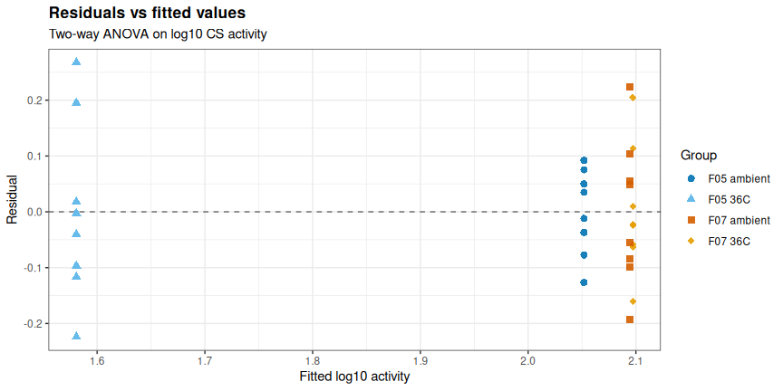
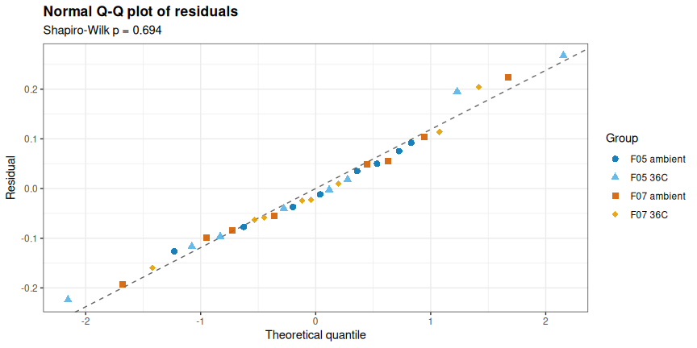
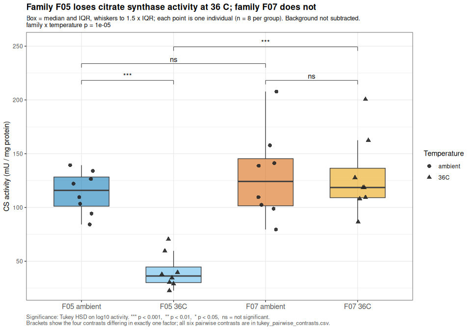
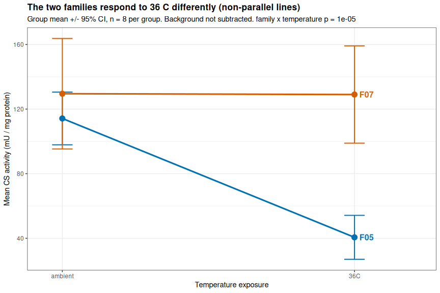
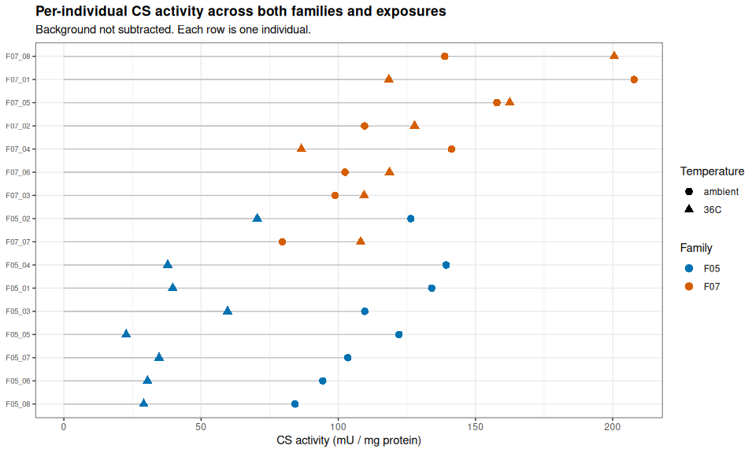
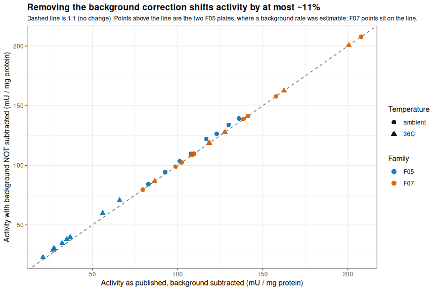

Gen5-20260825-mgig-sormi-citrate_synthase-F05-F07-temperature-comparison
================
Sam White
2026-08-25

- [1 BACKGROUND](#1-background)
  - [1.1 Inputs: which plates are
    used](#11-inputs-which-plates-are-used)
  - [1.2 Notes](#12-notes)
  - [1.3 Analysis parameters](#13-analysis-parameters)
  - [1.4 Input paths](#14-input-paths)
  - [1.5 Plate provenance](#15-plate-provenance)
- [2 LOAD PER-PLATE RESULTS](#2-load-per-plate-results)
  - [2.1 Read the results CSVs](#21-read-the-results-csvs)
  - [2.2 Keep only the columns this analysis
    needs](#22-keep-only-the-columns-this-analysis-needs)
  - [2.3 Verify the design is complete and
    balanced](#23-verify-the-design-is-complete-and-balanced)
- [3 BACKGROUND REMOVAL](#3-background-removal)
  - [3.1 Why the correction is
    removed](#31-why-the-correction-is-removed)
  - [3.2 How much does the correction actually
    matter?](#32-how-much-does-the-correction-actually-matter)
  - [3.3 Recompute activity without background
    subtraction](#33-recompute-activity-without-background-subtraction)
  - [3.4 Independently verify the
    rescaling](#34-independently-verify-the-rescaling)
- [4 ANALYSIS DATA SET](#4-analysis-data-set)
  - [4.1 Set factor levels](#41-set-factor-levels)
  - [4.2 Colour palette](#42-colour-palette)
  - [4.3 QC status of the analysis
    set](#43-qc-status-of-the-analysis-set)
- [5 DESCRIPTIVE STATISTICS](#5-descriptive-statistics)
  - [5.1 Per-group summary](#51-per-group-summary)
  - [5.2 Temperature effect within each
    family](#52-temperature-effect-within-each-family)
  - [5.3 Individual-level table](#53-individual-level-table)
- [6 STATISTICS](#6-statistics)
  - [6.1 Two-way ANOVA on log10
    activity](#61-two-way-anova-on-log10-activity)
  - [6.2 Variance explained](#62-variance-explained)
  - [6.3 Residual diagnostics](#63-residual-diagnostics)
  - [6.4 Tukey HSD pairwise contrasts](#64-tukey-hsd-pairwise-contrasts)
  - [6.5 The two within-family temperature
    contrasts](#65-the-two-within-family-temperature-contrasts)
- [7 FIGURES](#7-figures)
  - [7.1 Activity by family and
    temperature](#71-activity-by-family-and-temperature)
    - [7.1.1 Significance notation](#711-significance-notation)
  - [7.2 Interaction plot](#72-interaction-plot)
  - [7.3 Per-individual activity](#73-per-individual-activity)
  - [7.4 Effect of removing the background
    correction](#74-effect-of-removing-the-background-correction)
- [8 SUMMARY](#8-summary)
  - [8.1 Findings](#81-findings)
  - [8.2 Interpretation and caveats](#82-interpretation-and-caveats)
  - [8.3 Output files](#83-output-files)
- [9 SESSION INFO](#9-session-info)

# 1 BACKGROUND

Cross-plate comparison of citrate synthase (CS) activity in ctenidia of
*Magallana gigas* (Pacific oyster) from **two families** (`F05`, `F07`)
at **two temperature exposures** (**ambient** and **36 °C**), assayed
with the [Abcam Citrate Synthase Assay Kit (ab239712),
v4a](https://github.com/RobertsLab/resources/blob/master/protocols/Commercial_Protocols/ABCAM-Citrate-Synthase-Assay-v4a-ab239712.pdf).

The question here is **not** how to compute activity – that was done,
plate by plate, in the per-plate analyses listed below. This document
takes those finished per-plate results as its input and asks:

1.  Does CS activity respond to 36 °C exposure?
2.  **Does that temperature response differ between families?** –
    i.e. is there a family × temperature interaction?

All four family × temperature groups carry **n = 8** individuals, giving
a fully balanced 2 × 2 design (32 individuals total).

## 1.1 Inputs: which plates are used

This analysis reads the `citrate_synthase_activity_results.csv` output
of **three** per-plate analyses:

| Family | Temperature | Source analysis | Plate date |
|:---|:---|:---|:---|
| `F05` | ambient | `Gen5-20260824-mgig-sormi-citrate_synthase-F05-ambient` | 2026-08-24 |
| `F05` | 36 °C | `Gen5-20260814-mgig-citrate_synthase-F05-36C` | 2026-08-14 |
| `F07` | ambient + 36 °C | `Gen5-20260824-mgig-sormi-citrate_synthase-F07-ambient_and_36C` | 2026-08-24 |

**The 2026-08-11 `F05` ambient plate is deliberately excluded** (note
1).

## 1.2 Notes

1.  **The 2026-08-11 `F05`-ambient plate is excluded from this
    analysis.** That plate required repeating because of poor data
    quality across both its samples and its standard curve
    (standard-curve R<sup>2</sup> of 0.9678 after excluding 8 of 18
    standard wells as outliers, 4 of 8 samples over the 15% technical-CV
    threshold, and one sample with all three replicates
    baseline-compromised). Those same `F05` ambient homogenates were
    re-assayed on 2026-08-24, and **the 2026-08-24 re-assay is the `F05`
    ambient data used here.**
2.  **Background luminescence is NOT subtracted from any activity value
    in this document.** One retained plate
    (`Gen5-20260824-mgig-sormi-citrate_synthase-F07-ambient_and_36C`)
    has no usable background estimate – Reaction Mix was added to all
    three of its pooled-background wells instead of Background Control
    Mix, so its background rate is unestimable and its per-plate
    analysis already fell back to a correction of 0. Rather than compare
    background-corrected values on two plates against uncorrected values
    on a third, **the background correction is removed from all plates**
    so every value is treated identically. This is a small change: where
    background *was* measurable it never exceeded ~10% of the raw rate
    (quantified in [BACKGROUND REMOVAL](#3-background-removal)).
3.  **Activity is normalized to total extracted protein** (mU per mg
    protein), carried through from the per-plate analyses, which
    measured protein directly by BCA/Bradford-style assay on 2026-08-13.
    Tissue weight is not used.
4.  **The `F05` temperature contrast spans two plates and two days** (36
    °C on 2026-08-14, ambient on 2026-08-24), whereas the `F07`
    temperature contrast sits **within a single plate** (2026-08-24).
    Plate and instrument state are compared across plates in [PLATE
    PROVENANCE](#15-plate-provenance).
5.  **Individuals are treated as unpaired across temperature.** An
    animal is assayed at one exposure only; `F05_01_ambient` and
    `F05_01_36C` are different individuals from the same family, so no
    paired/repeated-measures structure is used.
6.  **Statistics are computed on log<sub>10</sub>(activity).** Activity
    is a ratio-scale rate spanning roughly an order of magnitude across
    groups; the log scale makes the family × temperature interaction a
    test of *multiplicative* (fold-change) response, which is the
    biologically meaningful comparison for an enzyme rate, and it
    stabilizes the group-to-group spread in variance. Because the design
    is balanced, sequential (Type I) sums of squares from `aov()` are
    identical to Type II and Type III, so no special contrast handling
    is needed.

``` r
library(knitr)
library(dplyr)
```

    ## 
    ## Attaching package: 'dplyr'

    ## The following objects are masked from 'package:stats':
    ## 
    ##     filter, lag

    ## The following objects are masked from 'package:base':
    ## 
    ##     intersect, setdiff, setequal, union

``` r
library(tidyr)
library(ggplot2)
library(tibble)

knitr::opts_chunk$set(
  echo = TRUE,         # Display code chunks
  eval = TRUE,         # Evaluate code chunks
  warning = FALSE,     # Hide warnings
  message = FALSE,     # Hide messages
  comment = "",        # Prevents appending '##' to beginning of lines in code output
  results = 'hold'     # Holds output so it's all printed together after code chunk
)
```

## 1.3 Analysis parameters

``` r
analysis_params <- list(
  subtract_background = FALSE,  # note 2: background is NOT subtracted anywhere
  alpha               = 0.05,   # significance level for ANOVA / Tukey
  cv_threshold_pct    = 15      # technical-CV threshold used by the per-plate analyses
)

cat("--- analysis_params: settings governing this comparison ---\n")
str(analysis_params)
```

    --- analysis_params: settings governing this comparison ---
    List of 3
     $ subtract_background: logi FALSE
     $ alpha              : num 0.05
     $ cv_threshold_pct   : num 15

## 1.4 Input paths

``` r
outputs_root <- "../outputs"

# Each retained per-plate analysis and the family/temperature it contributes.
plate_inputs <- tribble(
  ~plate_dir,                                                       ~contributes,
  "Gen5-20260824-mgig-sormi-citrate_synthase-F05-ambient",          "F05 ambient",
  "Gen5-20260814-mgig-citrate_synthase-F05-36C",                    "F05 36C",
  "Gen5-20260824-mgig-sormi-citrate_synthase-F07-ambient_and_36C",  "F07 ambient + 36C"
) %>%
  mutate(results_csv = file.path(outputs_root, plate_dir,
                                 "citrate_synthase_activity_results.csv"))

output_dir <- file.path(
  outputs_root,
  "Gen5-20260825-mgig-sormi-citrate_synthase-F05-F07-temperature-comparison")
dir.create(output_dir, showWarnings = FALSE, recursive = TRUE)

cat("--- plate_inputs: per-plate results files feeding this analysis ---\n")
print(as.data.frame(plate_inputs[, c("plate_dir", "contributes")]))
cat("\n--- all input files exist? ---\n")
print(setNames(file.exists(plate_inputs$results_csv), plate_inputs$plate_dir))
cat("\n--- output_dir ---\n")
str(output_dir)
```

    --- plate_inputs: per-plate results files feeding this analysis ---
                                                          plate_dir
    1         Gen5-20260824-mgig-sormi-citrate_synthase-F05-ambient
    2                   Gen5-20260814-mgig-citrate_synthase-F05-36C
    3 Gen5-20260824-mgig-sormi-citrate_synthase-F07-ambient_and_36C
            contributes
    1       F05 ambient
    2           F05 36C
    3 F07 ambient + 36C

    --- all input files exist? ---
            Gen5-20260824-mgig-sormi-citrate_synthase-F05-ambient 
                                                             TRUE 
                      Gen5-20260814-mgig-citrate_synthase-F05-36C 
                                                             TRUE 
    Gen5-20260824-mgig-sormi-citrate_synthase-F07-ambient_and_36C 
                                                             TRUE 

    --- output_dir ---
     chr "../outputs/Gen5-20260825-mgig-sormi-citrate_synthase-F05-F07-temperature-comparison"

## 1.5 Plate provenance

Per-plate calibration and instrument-state values, transcribed from the
three source analyses. These are the anchors that make cross-plate
comparison defensible: if the GSH standard curve and the CS positive
control agree across plates, then a rate measured on one plate means the
same thing as a rate measured on another.

``` r
plate_provenance <- tribble(
  ~plate_dir,                                                      ~plate_date,  ~std_slope_A412_per_nmol, ~std_r2, ~pos_control_mA412_min, ~pos_control_cv_pct, ~background_usable,
  "Gen5-20260824-mgig-sormi-citrate_synthase-F05-ambient",         "2026-08-24", 0.03234,                  0.9983,  2.700,                  22.8,                TRUE,
  "Gen5-20260814-mgig-citrate_synthase-F05-36C",                   "2026-08-14", 0.03075,                  0.9985,  2.933,                  3.9,                 TRUE,
  "Gen5-20260824-mgig-sormi-citrate_synthase-F07-ambient_and_36C", "2026-08-24", 0.03140,                  0.9992,  2.933,                  2.6,                 FALSE
)

cat("--- plate_provenance: calibration + instrument state per plate ---\n")
str(as.data.frame(plate_provenance))
```

    --- plate_provenance: calibration + instrument state per plate ---
    'data.frame':   3 obs. of  7 variables:
     $ plate_dir              : chr  "Gen5-20260824-mgig-sormi-citrate_synthase-F05-ambient" "Gen5-20260814-mgig-citrate_synthase-F05-36C" "Gen5-20260824-mgig-sormi-citrate_synthase-F07-ambient_and_36C"
     $ plate_date             : chr  "2026-08-24" "2026-08-14" "2026-08-24"
     $ std_slope_A412_per_nmol: num  0.0323 0.0307 0.0314
     $ std_r2                 : num  0.998 0.999 0.999
     $ pos_control_mA412_min  : num  2.7 2.93 2.93
     $ pos_control_cv_pct     : num  22.8 3.9 2.6
     $ background_usable      : logi  TRUE TRUE FALSE

``` r
plate_provenance %>%
  transmute(
    Plate            = plate_dir,
    Date             = plate_date,
    `Std slope (A412/nmol)` = std_slope_A412_per_nmol,
    `Std curve R^2`  = std_r2,
    `Pos ctrl (mA412/min)` = pos_control_mA412_min,
    `Pos ctrl CV (%)` = pos_control_cv_pct,
    `Background estimable` = ifelse(background_usable, "yes", "no (note 2)")
  ) %>%
  kable(caption = "Calibration and instrument state for each retained plate.")
```

| Plate | Date | Std slope (A412/nmol) | Std curve R^2 | Pos ctrl (mA412/min) | Pos ctrl CV (%) | Background estimable |
|:---|:---|---:|---:|---:|---:|:---|
| Gen5-20260824-mgig-sormi-citrate_synthase-F05-ambient | 2026-08-24 | 0.03234 | 0.9983 | 2.700 | 22.8 | yes |
| Gen5-20260814-mgig-citrate_synthase-F05-36C | 2026-08-14 | 0.03075 | 0.9985 | 2.933 | 3.9 | yes |
| Gen5-20260824-mgig-sormi-citrate_synthase-F07-ambient_and_36C | 2026-08-24 | 0.03140 | 0.9992 | 2.933 | 2.6 | no (note 2) |

Calibration and instrument state for each retained plate.

``` r
prov_spread <- plate_provenance %>%
  summarise(
    slope_min   = min(std_slope_A412_per_nmol),
    slope_max   = max(std_slope_A412_per_nmol),
    slope_cv    = 100 * sd(std_slope_A412_per_nmol) / mean(std_slope_A412_per_nmol),
    pos_min     = min(pos_control_mA412_min),
    pos_max     = max(pos_control_mA412_min),
    pos_cv      = 100 * sd(pos_control_mA412_min) / mean(pos_control_mA412_min),
    min_std_r2  = min(std_r2)
  )

cat(sprintf(
  "Standard-curve slope across plates: %.5f-%.5f A412/nmol (CV %.1f%%)\n",
  prov_spread$slope_min, prov_spread$slope_max, prov_spread$slope_cv))
cat(sprintf(
  "Positive control across plates:     %.3f-%.3f mA412/min (CV %.1f%%)\n",
  prov_spread$pos_min, prov_spread$pos_max, prov_spread$pos_cv))
cat(sprintf("Worst standard-curve R^2:           %.4f\n", prov_spread$min_std_r2))
```

    Standard-curve slope across plates: 0.03075-0.03234 A412/nmol (CV 2.5%)
    Positive control across plates:     2.700-2.933 mA412/min (CV 4.7%)
    Worst standard-curve R^2:           0.9983

# 2 LOAD PER-PLATE RESULTS

## 2.1 Read the results CSVs

``` r
read_plate_results <- function(results_csv, plate_dir) {
  read.csv(results_csv, check.names = FALSE, stringsAsFactors = FALSE) %>%
    mutate(plate_dir = plate_dir)
}

plate_results_raw <- Map(read_plate_results,
                         plate_inputs$results_csv,
                         plate_inputs$plate_dir) %>%
  bind_rows()

cat("--- plate_results_raw: all per-plate result rows, stacked ---\n")
str(as.data.frame(plate_results_raw))
```

    --- plate_results_raw: all per-plate result rows, stacked ---
    'data.frame':   32 obs. of  18 variables:
     $ Sample                    : chr  "F05_01_ambient" "F05_02_ambient" "F05_03_ambient" "F05_04_ambient" ...
     $ Family                    : chr  "F05" "F05" "F05" "F05" ...
     $ Individual                : int  1 2 3 4 5 6 7 8 1 2 ...
     $ Temperature               : chr  "ambient" "ambient" "ambient" "ambient" ...
     $ Protein conc (ug/mL)      : num  876 1039 1900 1129 712 ...
     $ Total protein (mg)        : num  0.307 0.364 0.665 0.395 0.249 0.781 0.591 0.946 0.334 0.191 ...
     $ Reps used                 : chr  "3/3" "3/3" "3/3" "3/3" ...
     $ CV all reps (%)           : num  4.6 4.1 2.2 2.5 1.9 1.9 1.3 0.8 3.3 2.4 ...
     $ CV used reps (%)          : num  4.6 4.1 2.2 2.5 1.9 1.9 1.3 0.8 3.3 2.4 ...
     $ Rate (mA412/min)          : num  7.6 8.5 13.48 10.18 5.62 ...
     $ BG rate (mA412/min)       : num  0.233 0.233 0.233 0.233 0.233 0.233 0.233 0.233 0.167 0.15 ...
     $ Corrected rate (mA412/min): num  7.37 8.27 13.25 9.95 5.38 ...
     $ Activity (mU/uL)          : num  0.1139 0.1278 0.2048 0.1538 0.0832 ...
     $ Activity (mU/mg protein)  : num  130 123 108 136 117 ...
     $ CV flag                   : chr  "pass" "pass" "pass" "pass" ...
     $ Elevated baseline reps    : chr  "0/3" "0/3" "0/3" "0/3" ...
     $ Interpretation            : chr  "usable" "usable" "usable" "usable" ...
     $ plate_dir                 : chr  "Gen5-20260824-mgig-sormi-citrate_synthase-F05-ambient" "Gen5-20260824-mgig-sormi-citrate_synthase-F05-ambient" "Gen5-20260824-mgig-sormi-citrate_synthase-F05-ambient" "Gen5-20260824-mgig-sormi-citrate_synthase-F05-ambient" ...

``` r
cat("Rows read per plate:\n")
print(table(plate_results_raw$plate_dir))
cat("\nColumns present in every input file:\n")
print(names(plate_results_raw))
```

    Rows read per plate:

                      Gen5-20260814-mgig-citrate_synthase-F05-36C 
                                                                8 
            Gen5-20260824-mgig-sormi-citrate_synthase-F05-ambient 
                                                                8 
    Gen5-20260824-mgig-sormi-citrate_synthase-F07-ambient_and_36C 
                                                               16 

    Columns present in every input file:
     [1] "Sample"                     "Family"                    
     [3] "Individual"                 "Temperature"               
     [5] "Protein conc (ug/mL)"       "Total protein (mg)"        
     [7] "Reps used"                  "CV all reps (%)"           
     [9] "CV used reps (%)"           "Rate (mA412/min)"          
    [11] "BG rate (mA412/min)"        "Corrected rate (mA412/min)"
    [13] "Activity (mU/uL)"           "Activity (mU/mg protein)"  
    [15] "CV flag"                    "Elevated baseline reps"    
    [17] "Interpretation"             "plate_dir"                 

## 2.2 Keep only the columns this analysis needs

The per-plate results tables carry QC columns alongside the activity
values. This analysis needs the identity of each individual, its protein
normalization, both the raw and background-corrected rate (to undo the
background subtraction – note 2), the published activity, and the QC
verdict.

``` r
cs_all <- plate_results_raw %>%
  transmute(
    sample_id        = Sample,
    family           = Family,
    temperature      = Temperature,
    individual       = sprintf("%02d", as.integer(Individual)),
    plate_dir        = plate_dir,
    protein_mg       = `Total protein (mg)`,
    reps_used        = `Reps used`,
    cv_used_pct      = `CV used reps (%)`,
    rate_raw         = `Rate (mA412/min)`,
    rate_bg          = `BG rate (mA412/min)`,
    rate_corrected   = `Corrected rate (mA412/min)`,
    activity_published = `Activity (mU/mg protein)`,
    cv_flag          = `CV flag`,
    interpretation   = Interpretation
  ) %>%
  left_join(plate_provenance %>% select(plate_dir, plate_date, std_slope_A412_per_nmol),
            by = "plate_dir") %>%
  arrange(family, temperature, individual)

cat("--- cs_all: one row per individual, columns needed downstream ---\n")
str(as.data.frame(cs_all))
```

    --- cs_all: one row per individual, columns needed downstream ---
    'data.frame':   32 obs. of  16 variables:
     $ sample_id              : chr  "F05_01_36C" "F05_02_36C" "F05_03_36C" "F05_04_36C" ...
     $ family                 : chr  "F05" "F05" "F05" "F05" ...
     $ temperature            : chr  "36C" "36C" "36C" "36C" ...
     $ individual             : chr  "01" "02" "03" "04" ...
     $ plate_dir              : chr  "Gen5-20260814-mgig-citrate_synthase-F05-36C" "Gen5-20260814-mgig-citrate_synthase-F05-36C" "Gen5-20260814-mgig-citrate_synthase-F05-36C" "Gen5-20260814-mgig-citrate_synthase-F05-36C" ...
     $ protein_mg             : num  0.334 0.191 0.234 0.372 0.583 0.443 0.389 0.475 0.307 0.364 ...
     $ reps_used              : chr  "3/3" "3/3" "3/3" "3/3" ...
     $ cv_used_pct            : num  3.3 2.4 3.5 2.3 1.2 2.4 1.2 7.8 4.6 4.1 ...
     $ rate_raw               : num  2.33 2.37 2.45 2.47 2.33 2.37 2.37 2.43 7.6 8.5 ...
     $ rate_bg                : num  0.167 0.15 0.15 0.183 0.183 0.233 0.167 0.183 0.233 0.233 ...
     $ rate_corrected         : num  2.17 2.22 2.3 2.28 2.15 2.13 2.2 2.25 7.37 8.27 ...
     $ activity_published     : num  37 66 56 35 21 ...
     $ cv_flag                : chr  "pass" "pass" "pass" "pass" ...
     $ interpretation         : chr  "usable" "usable" "usable" "usable" ...
     $ plate_date             : chr  "2026-08-14" "2026-08-14" "2026-08-14" "2026-08-14" ...
     $ std_slope_A412_per_nmol: num  0.0307 0.0307 0.0307 0.0307 0.0307 ...

## 2.3 Verify the design is complete and balanced

``` r
design_counts <- cs_all %>%
  count(family, temperature, name = "n_individuals")

cat("--- design_counts: individuals per family x temperature cell ---\n")
print(as.data.frame(design_counts))

cat(sprintf("\nTotal individuals: %d\n", nrow(cs_all)))
cat(sprintf("Duplicated sample_ids: %d\n", sum(duplicated(cs_all$sample_id))))
cat(sprintf("Rows with missing protein_mg: %d\n", sum(is.na(cs_all$protein_mg))))
cat(sprintf("Rows with missing raw rate: %d\n", sum(is.na(cs_all$rate_raw))))
cat(sprintf("Design balanced (all cells equal n): %s\n",
            length(unique(design_counts$n_individuals)) == 1))
```

    --- design_counts: individuals per family x temperature cell ---
      family temperature n_individuals
    1    F05         36C             8
    2    F05     ambient             8
    3    F07         36C             8
    4    F07     ambient             8

    Total individuals: 32
    Duplicated sample_ids: 0
    Rows with missing protein_mg: 0
    Rows with missing raw rate: 0
    Design balanced (all cells equal n): TRUE

# 3 BACKGROUND REMOVAL

## 3.1 Why the correction is removed

Per note 2, the `F07` plate has no estimable background, so its
published “corrected” rate already equals its raw rate. The two `F05`
plates *do* carry a background subtraction. Comparing corrected `F05`
values against uncorrected `F07` values would put a systematic,
plate-dependent offset directly into the family contrast – so instead
the correction is stripped from every plate.

## 3.2 How much does the correction actually matter?

``` r
bg_impact <- cs_all %>%
  mutate(bg_pct_of_raw = 100 * rate_bg / rate_raw) %>%
  group_by(plate_dir) %>%
  summarise(
    n              = n(),
    bg_rate_min    = min(rate_bg),
    bg_rate_max    = max(rate_bg),
    bg_pct_min     = min(bg_pct_of_raw),
    bg_pct_max     = max(bg_pct_of_raw),
    .groups = "drop"
  )

cat("--- bg_impact: size of the background correction, per plate ---\n")
print(as.data.frame(bg_impact))
```

    --- bg_impact: size of the background correction, per plate ---
                                                          plate_dir  n bg_rate_min
    1                   Gen5-20260814-mgig-citrate_synthase-F05-36C  8       0.150
    2         Gen5-20260824-mgig-sormi-citrate_synthase-F05-ambient  8       0.233
    3 Gen5-20260824-mgig-sormi-citrate_synthase-F07-ambient_and_36C 16       0.000
      bg_rate_max bg_pct_min bg_pct_max
    1       0.233   6.122449   9.831224
    2       0.233   1.581806   4.145907
    3       0.000   0.000000   0.000000

``` r
bg_impact %>%
  transmute(
    Plate = plate_dir,
    n     = n,
    `BG rate (mA412/min)` = sprintf("%.3f - %.3f", bg_rate_min, bg_rate_max),
    `BG as % of raw rate` = sprintf("%.1f - %.1f", bg_pct_min, bg_pct_max)
  ) %>%
  kable(caption = paste("Magnitude of the background correction being removed.",
                        "The F07 plate has no estimable background (note 2),",
                        "so its correction is already zero."))
```

| Plate | n | BG rate (mA412/min) | BG as % of raw rate |
|:---|---:|:---|:---|
| Gen5-20260814-mgig-citrate_synthase-F05-36C | 8 | 0.150 - 0.233 | 6.1 - 9.8 |
| Gen5-20260824-mgig-sormi-citrate_synthase-F05-ambient | 8 | 0.233 - 0.233 | 1.6 - 4.1 |
| Gen5-20260824-mgig-sormi-citrate_synthase-F07-ambient_and_36C | 16 | 0.000 - 0.000 | 0.0 - 0.0 |

Magnitude of the background correction being removed. The F07 plate has
no estimable background (note 2), so its correction is already zero.

## 3.3 Recompute activity without background subtraction

Activity is **linear** in the background-corrected rate: every other
term in the Abcam calculation (standard-curve slope, sample volume,
dilution factor, homogenate volume, total protein) is a per-sample
constant. So the uncorrected activity is recovered exactly by rescaling
the published activity by `rate_raw / rate_corrected`, with no need to
re-derive anything from the raw kinetic traces.

``` r
stopifnot(!analysis_params$subtract_background)

cs_activity <- cs_all %>%
  mutate(
    # Scale factor undoing the background subtraction; exactly 1 where the
    # per-plate analysis already applied no correction (F07 plate).
    bg_undo_factor  = rate_raw / rate_corrected,
    activity_nobg   = activity_published * bg_undo_factor,
    log10_activity  = log10(activity_nobg)
  )

cat("--- cs_activity: activity with background subtraction removed ---\n")
str(as.data.frame(cs_activity))
```

    --- cs_activity: activity with background subtraction removed ---
    'data.frame':   32 obs. of  19 variables:
     $ sample_id              : chr  "F05_01_36C" "F05_02_36C" "F05_03_36C" "F05_04_36C" ...
     $ family                 : chr  "F05" "F05" "F05" "F05" ...
     $ temperature            : chr  "36C" "36C" "36C" "36C" ...
     $ individual             : chr  "01" "02" "03" "04" ...
     $ plate_dir              : chr  "Gen5-20260814-mgig-citrate_synthase-F05-36C" "Gen5-20260814-mgig-citrate_synthase-F05-36C" "Gen5-20260814-mgig-citrate_synthase-F05-36C" "Gen5-20260814-mgig-citrate_synthase-F05-36C" ...
     $ protein_mg             : num  0.334 0.191 0.234 0.372 0.583 0.443 0.389 0.475 0.307 0.364 ...
     $ reps_used              : chr  "3/3" "3/3" "3/3" "3/3" ...
     $ cv_used_pct            : num  3.3 2.4 3.5 2.3 1.2 2.4 1.2 7.8 4.6 4.1 ...
     $ rate_raw               : num  2.33 2.37 2.45 2.47 2.33 2.37 2.37 2.43 7.6 8.5 ...
     $ rate_bg                : num  0.167 0.15 0.15 0.183 0.183 0.233 0.167 0.183 0.233 0.233 ...
     $ rate_corrected         : num  2.17 2.22 2.3 2.28 2.15 2.13 2.2 2.25 7.37 8.27 ...
     $ activity_published     : num  37 66 56 35 21 ...
     $ cv_flag                : chr  "pass" "pass" "pass" "pass" ...
     $ interpretation         : chr  "usable" "usable" "usable" "usable" ...
     $ plate_date             : chr  "2026-08-14" "2026-08-14" "2026-08-14" "2026-08-14" ...
     $ std_slope_A412_per_nmol: num  0.0307 0.0307 0.0307 0.0307 0.0307 ...
     $ bg_undo_factor         : num  1.07 1.07 1.07 1.08 1.08 ...
     $ activity_nobg          : num  39.7 70.5 59.7 37.9 22.7 ...
     $ log10_activity         : num  1.6 1.85 1.78 1.58 1.36 ...

## 3.4 Independently verify the rescaling

The rescaling above is checked against a from-scratch recomputation of
activity out of the raw rate and each plate’s own standard-curve slope,
using the Abcam formula (`nmol/min = (rate/1000) / std_slope`;
`mU/uL = nmol/min / sample_volume * D`;
`mU/mg = mU/uL * homogenate_volume / total_protein_mg`). The two paths
must agree to within the rounding of the input CSVs.

``` r
# Assay constants shared by all three plates (identical in all source analyses).
sample_volume_uL     <- 2
dilution_factor      <- 1
homogenate_volume_uL <- 350

verify <- cs_activity %>%
  mutate(
    activity_recomputed =
      ((rate_raw / 1000) / std_slope_A412_per_nmol / sample_volume_uL *
         dilution_factor) * homogenate_volume_uL / protein_mg,
    pct_diff = 100 * abs(activity_recomputed / activity_nobg - 1)
  )

cat(sprintf("Max %% difference, rescaled vs recomputed-from-raw: %.3f%%\n",
            max(verify$pct_diff)))
cat(sprintf("All within 1%% (input CSV rounding): %s\n", max(verify$pct_diff) < 1))
```

    Max % difference, rescaled vs recomputed-from-raw: 0.415%
    All within 1% (input CSV rounding): TRUE

``` r
cat(sprintf(
  "Removing the background correction changes activity by %.1f%%-%.1f%% (median %.1f%%).\n",
  100 * (min(cs_activity$bg_undo_factor) - 1),
  100 * (max(cs_activity$bg_undo_factor) - 1),
  100 * (median(cs_activity$bg_undo_factor) - 1)))
```

    Removing the background correction changes activity by 0.0%-11.3% (median 0.8%).

# 4 ANALYSIS DATA SET

## 4.1 Set factor levels

``` r
# Group levels are ordered family-major so that, on a single x axis, each
# family's ambient and 36C boxes sit side by side.
group_levels <- c("F05 ambient", "F05 36C", "F07 ambient", "F07 36C")

cs_analysis <- cs_activity %>%
  mutate(
    family      = factor(family, levels = c("F05", "F07")),
    temperature = factor(temperature, levels = c("ambient", "36C")),
    group       = factor(paste(family, temperature), levels = group_levels),
    plate_dir   = factor(plate_dir)
  )

cat("--- cs_analysis: analysis-ready data with ordered factors ---\n")
cat("family levels:     ", paste(levels(cs_analysis$family), collapse = ", "), "\n")
cat("temperature levels:", paste(levels(cs_analysis$temperature), collapse = ", "), "\n")
cat("group levels:      ", paste(levels(cs_analysis$group), collapse = " | "), "\n")
cat("n rows:            ", nrow(cs_analysis), "\n")
```

    --- cs_analysis: analysis-ready data with ordered factors ---
    family levels:      F05, F07 
    temperature levels: ambient, 36C 
    group levels:       F05 ambient | F05 36C | F07 ambient | F07 36C 
    n rows:             32 

## 4.2 Colour palette

Colours are drawn from the **Okabe-Ito** qualitative palette, which is
designed to remain distinguishable under deuteranopia, protanopia and
tritanopia (Okabe & Ito 2008, *Color Universal Design*). One hue is
bound to each family and reused in every figure in this document, so
colour alone identifies the family throughout. Temperature is
additionally encoded by point shape and by a light/dark tint of the
family hue, so **no figure relies on colour as its only channel** – each
remains readable in greyscale and to a colourblind reader.

``` r
# Okabe-Ito colourblind-safe qualitative palette.
okabe_ito <- c(
  blue          = "#0072B2",
  vermillion    = "#D55E00",
  bluishgreen   = "#009E73",
  orange        = "#E69F00",
  skyblue       = "#56B4E9",
  reddishpurple = "#CC79A7",
  yellow        = "#F0E442",
  black         = "#000000"
)

# Family identity: one hue per family.
family_colours <- c(F05 = okabe_ito[["blue"]], F07 = okabe_ito[["vermillion"]])

# Group identity: each family keeps its hue, with the 36C member of the pair
# as the lighter tint, so family and temperature are both readable from fill.
group_colours <- c(
  "F05 ambient" = okabe_ito[["blue"]],
  "F05 36C"     = okabe_ito[["skyblue"]],
  "F07 ambient" = okabe_ito[["vermillion"]],
  "F07 36C"     = okabe_ito[["orange"]]
)

stopifnot(all(levels(cs_analysis$group) %in% names(group_colours)))

cat("--- family_colours: hue bound to each family in every figure ---\n")
print(family_colours)
cat("\n--- group_colours: fill bound to each family x temperature group ---\n")
print(group_colours)
```

    --- family_colours: hue bound to each family in every figure ---
          F05       F07 
    "#0072B2" "#D55E00" 

    --- group_colours: fill bound to each family x temperature group ---
    F05 ambient     F05 36C F07 ambient     F07 36C 
      "#0072B2"   "#56B4E9"   "#D55E00"   "#E69F00" 

## 4.3 QC status of the analysis set

Every individual is retained. The per-plate analyses already excluded
unusable technical replicates before averaging; the flags below describe
which individuals had a replicate dropped or a wide replicate CV, so any
group difference can be checked against QC status rather than silently
inheriting it.

``` r
qc_status <- cs_analysis %>%
  group_by(family, temperature) %>%
  summarise(
    n                   = n(),
    n_full_triplicate   = sum(reps_used == "3/3"),
    n_cv_flagged        = sum(cv_flag != "pass"),
    n_not_usable        = sum(interpretation != "usable"),
    max_cv_used_pct     = max(cv_used_pct),
    .groups = "drop"
  )

cat("--- qc_status: QC composition of each group ---\n")
print(as.data.frame(qc_status))
```

    --- qc_status: QC composition of each group ---
      family temperature n n_full_triplicate n_cv_flagged n_not_usable
    1    F05     ambient 8                 8            0            0
    2    F05         36C 8                 8            0            0
    3    F07     ambient 8                 7            1            0
    4    F07         36C 8                 8            0            0
      max_cv_used_pct
    1             4.6
    2             7.8
    3             6.4
    4             3.1

``` r
qc_status %>%
  transmute(
    Family = family, Temperature = temperature, n = n,
    `Full 3/3 reps` = n_full_triplicate,
    `CV-flagged`    = n_cv_flagged,
    `Not usable`    = n_not_usable,
    `Worst CV of used reps (%)` = max_cv_used_pct
  ) %>%
  kable(caption = paste0("QC composition per group. CV-flagged counts",
                         " individuals whose CV across ALL replicates exceeded ",
                         analysis_params$cv_threshold_pct,
                         "%; such individuals still contribute a mean over",
                         " their retained replicates."))
```

| Family | Temperature | n | Full 3/3 reps | CV-flagged | Not usable | Worst CV of used reps (%) |
|:---|:---|---:|---:|---:|---:|----|
| F05 | ambient | 8 | 8 | 0 | 0 | 4.6 |
| F05 | 36C | 8 | 8 | 0 | 0 | 7.8 |
| F07 | ambient | 8 | 7 | 1 | 0 | 6.4 |
| F07 | 36C | 8 | 8 | 0 | 0 | 3.1 |

QC composition per group. CV-flagged counts individuals whose CV across
ALL replicates exceeded 15%; such individuals still contribute a mean
over their retained replicates.

# 5 DESCRIPTIVE STATISTICS

## 5.1 Per-group summary

``` r
group_summary <- cs_analysis %>%
  group_by(family, temperature) %>%
  summarise(
    n        = n(),
    mean_act = mean(activity_nobg),
    sd_act   = sd(activity_nobg),
    cv_act   = 100 * sd(activity_nobg) / mean(activity_nobg),
    median_act = median(activity_nobg),
    min_act  = min(activity_nobg),
    max_act  = max(activity_nobg),
    mean_rate_raw = mean(rate_raw),
    sd_rate_raw   = sd(rate_raw),
    .groups  = "drop"
  )

cat("--- group_summary: activity (mU/mg protein), background NOT subtracted ---\n")
print(as.data.frame(group_summary))
```

    --- group_summary: activity (mU/mg protein), background NOT subtracted ---
      family temperature n  mean_act   sd_act   cv_act median_act  min_act
    1    F05     ambient 8 114.20466 19.52111 17.09310  115.90009 84.22106
    2    F05         36C 8  40.59051 16.27503 40.09566   36.28073 22.72780
    3    F07     ambient 8 129.52200 40.91814 31.59165  124.21200 79.56600
    4    F07         36C 8 129.02000 36.02833 27.92461  118.56250 86.54400
        max_act mean_rate_raw sd_rate_raw
    1 139.34016      10.62875  3.23688315
    2  70.49255       2.39000  0.05345225
    3 207.81900       6.23000  1.62935570
    4 200.57800       5.99750  2.05133928

``` r
group_summary %>%
  transmute(
    Family = family, Temperature = temperature, n = n,
    `Mean (mU/mg)`   = round(mean_act, 1),
    `SD`             = round(sd_act, 1),
    `CV (%)`         = round(cv_act, 1),
    `Median`         = round(median_act, 1),
    `Range`          = sprintf("%.1f - %.1f", min_act, max_act),
    `Raw rate (mA412/min)` = sprintf("%.2f +/- %.2f", mean_rate_raw, sd_rate_raw)
  ) %>%
  kable(caption = paste("Citrate synthase activity per family x temperature",
                        "group, with background subtraction removed (note 2)."))
```

| Family | Temperature | n | Mean (mU/mg) | SD | CV (%) | Median | Range | Raw rate (mA412/min) |
|:---|:---|---:|---:|---:|----|---:|:---|:---|
| F05 | ambient | 8 | 114.2 | 19.5 | 17.1 | 115.9 | 84.2 - 139.3 | 10.63 +/- 3.24 |
| F05 | 36C | 8 | 40.6 | 16.3 | 40.1 | 36.3 | 22.7 - 70.5 | 2.39 +/- 0.05 |
| F07 | ambient | 8 | 129.5 | 40.9 | 31.6 | 124.2 | 79.6 - 207.8 | 6.23 +/- 1.63 |
| F07 | 36C | 8 | 129.0 | 36.0 | 27.9 | 118.6 | 86.5 - 200.6 | 6.00 +/- 2.05 |

Citrate synthase activity per family x temperature group, with
background subtraction removed (note 2).

## 5.2 Temperature effect within each family

``` r
temp_effect <- group_summary %>%
  select(family, temperature, mean_act) %>%
  pivot_wider(names_from = temperature, values_from = mean_act) %>%
  mutate(
    abs_change    = `36C` - ambient,
    fold_change   = `36C` / ambient,
    pct_change    = 100 * (fold_change - 1)
  )

cat("--- temp_effect: ambient -> 36C change in mean activity, per family ---\n")
print(as.data.frame(temp_effect))
```

    --- temp_effect: ambient -> 36C change in mean activity, per family ---
      family  ambient       36C abs_change fold_change  pct_change
    1    F05 114.2047  40.59051  -73.61414   0.3554191 -64.4580931
    2    F07 129.5220 129.02000   -0.50200   0.9961242  -0.3875789

``` r
temp_effect %>%
  transmute(
    Family = family,
    `Ambient mean (mU/mg)` = round(ambient, 1),
    `36C mean (mU/mg)`     = round(`36C`, 1),
    `Change (mU/mg)`       = round(abs_change, 1),
    `Fold change`          = round(fold_change, 2),
    `% change`             = round(pct_change, 1)
  ) %>%
  kable(caption = "Direction and size of the 36C response within each family.")
```

| Family | Ambient mean (mU/mg) | 36C mean (mU/mg) | Change (mU/mg) | Fold change | % change |
|:---|---:|---:|---:|---:|---:|
| F05 | 114.2 | 40.6 | -73.6 | 0.36 | -64.5 |
| F07 | 129.5 | 129.0 | -0.5 | 1.00 | -0.4 |

Direction and size of the 36C response within each family.

## 5.3 Individual-level table

``` r
individual_table <- cs_analysis %>%
  arrange(family, temperature, individual) %>%
  transmute(
    Sample = sample_id, Family = family, Individual = individual,
    Temperature = temperature,
    `Protein (mg)` = protein_mg,
    `Raw rate (mA412/min)` = rate_raw,
    `Activity, no BG (mU/mg)` = round(activity_nobg, 1),
    `Activity, published (mU/mg)` = activity_published,
    `Reps used` = reps_used,
    `CV used (%)` = cv_used_pct,
    `QC` = interpretation
  )

write.csv(individual_table,
          file.path(output_dir, "cs_activity_all_families_no_background.csv"),
          row.names = FALSE)

kable(individual_table,
      caption = paste("All 32 individuals with background subtraction",
                      "removed, alongside the originally published",
                      "background-corrected value for reference."))
```

| Sample | Family | Individual | Temperature | Protein (mg) | Raw rate (mA412/min) | Activity, no BG (mU/mg) | Activity, published (mU/mg) | Reps used | CV used (%) | QC |
|:---|:---|:---|:---|---:|---:|---:|---:|:---|---:|:---|
| F05_01_ambient | F05 | 01 | ambient | 0.307 | 7.60 | 134.0 | 129.985 | 3/3 | 4.6 | usable |
| F05_02_ambient | F05 | 02 | ambient | 0.364 | 8.50 | 126.4 | 123.008 | 3/3 | 4.1 | usable |
| F05_03_ambient | F05 | 03 | ambient | 0.665 | 13.48 | 109.7 | 107.782 | 3/3 | 2.2 | usable |
| F05_04_ambient | F05 | 04 | ambient | 0.395 | 10.18 | 139.3 | 136.192 | 3/3 | 2.5 | usable |
| F05_05_ambient | F05 | 05 | ambient | 0.249 | 5.62 | 122.1 | 116.931 | 3/3 | 1.9 | usable |
| F05_06_ambient | F05 | 06 | ambient | 0.781 | 13.62 | 94.3 | 92.676 | 3/3 | 1.9 | usable |
| F05_07_ambient | F05 | 07 | ambient | 0.591 | 11.30 | 103.5 | 101.361 | 3/3 | 1.3 | usable |
| F05_08_ambient | F05 | 08 | ambient | 0.946 | 14.73 | 84.2 | 82.906 | 3/3 | 0.8 | usable |
| F05_01_36C | F05 | 01 | 36C | 0.334 | 2.33 | 39.7 | 36.960 | 3/3 | 3.3 | usable |
| F05_02_36C | F05 | 02 | 36C | 0.191 | 2.37 | 70.5 | 66.031 | 3/3 | 2.4 | usable |
| F05_03_36C | F05 | 03 | 36C | 0.234 | 2.45 | 59.7 | 56.014 | 3/3 | 3.5 | usable |
| F05_04_36C | F05 | 04 | 36C | 0.372 | 2.47 | 37.9 | 34.950 | 3/3 | 2.3 | usable |
| F05_05_36C | F05 | 05 | 36C | 0.583 | 2.33 | 22.7 | 20.972 | 3/3 | 1.2 | usable |
| F05_06_36C | F05 | 06 | 36C | 0.443 | 2.37 | 30.5 | 27.399 | 3/3 | 2.4 | usable |
| F05_07_36C | F05 | 07 | 36C | 0.389 | 2.37 | 34.7 | 32.210 | 3/3 | 1.2 | usable |
| F05_08_36C | F05 | 08 | 36C | 0.475 | 2.43 | 29.1 | 26.948 | 3/3 | 7.8 | usable |
| F07_01_ambient | F07 | 01 | ambient | 0.092 | 3.43 | 207.8 | 207.819 | 3/3 | 1.7 | usable |
| F07_02_ambient | F07 | 02 | ambient | 0.378 | 7.43 | 109.6 | 109.600 | 3/3 | 1.9 | usable |
| F07_03_ambient | F07 | 03 | ambient | 0.404 | 7.18 | 98.9 | 98.879 | 2/3 | 6.4 | usable |
| F07_04_ambient | F07 | 04 | ambient | 0.196 | 4.97 | 141.2 | 141.243 | 3/3 | 1.2 | usable |
| F07_05_ambient | F07 | 05 | ambient | 0.231 | 6.53 | 157.8 | 157.813 | 3/3 | 1.6 | usable |
| F07_06_ambient | F07 | 06 | ambient | 0.392 | 7.20 | 102.4 | 102.432 | 3/3 | 1.8 | usable |
| F07_07_ambient | F07 | 07 | ambient | 0.576 | 8.22 | 79.6 | 79.566 | 3/3 | 0.7 | usable |
| F07_08_ambient | F07 | 08 | ambient | 0.196 | 4.88 | 138.8 | 138.824 | 3/3 | 0.6 | usable |
| F07_01_36C | F07 | 01 | 36C | 0.232 | 4.93 | 118.4 | 118.446 | 3/3 | 1.2 | usable |
| F07_02_36C | F07 | 02 | 36C | 0.326 | 7.48 | 127.8 | 127.815 | 3/3 | 1.7 | usable |
| F07_03_36C | F07 | 03 | 36C | 0.422 | 8.28 | 109.4 | 109.428 | 3/3 | 3.1 | usable |
| F07_04_36C | F07 | 04 | 36C | 0.549 | 8.52 | 86.5 | 86.544 | 3/3 | 1.5 | usable |
| F07_05_36C | F07 | 05 | 36C | 0.150 | 4.37 | 162.5 | 162.517 | 3/3 | 0.7 | usable |
| F07_06_36C | F07 | 06 | 36C | 0.174 | 3.70 | 118.7 | 118.679 | 3/3 | 2.3 | usable |
| F07_07_36C | F07 | 07 | 36C | 0.363 | 7.05 | 108.2 | 108.153 | 3/3 | 0.7 | usable |
| F07_08_36C | F07 | 08 | 36C | 0.101 | 3.65 | 200.6 | 200.578 | 3/3 | 0.0 | usable |

All 32 individuals with background subtraction removed, alongside the
originally published background-corrected value for reference.

# 6 STATISTICS

## 6.1 Two-way ANOVA on log10 activity

The model is `log10(activity) ~ family * temperature`. The **interaction
term is the formal test of the question** in this document: does the
temperature response differ between families? Because the design is
balanced (8 per cell), sequential sums of squares are unambiguous.

``` r
cs_aov <- aov(log10_activity ~ family * temperature, data = cs_analysis)

cat("--- cs_aov: two-way factorial ANOVA on log10 activity ---\n")
print(summary(cs_aov))
```

    --- cs_aov: two-way factorial ANOVA on log10 activity ---
                       Df Sum Sq Mean Sq F value   Pr(>F)    
    family              1 0.6249  0.6249   39.89 7.85e-07 ***
    temperature         1 0.4384  0.4384   27.99 1.25e-05 ***
    family:temperature  1 0.4496  0.4496   28.70 1.04e-05 ***
    Residuals          28 0.4386  0.0157                     
    ---
    Signif. codes:  0 '***' 0.001 '**' 0.01 '*' 0.05 '.' 0.1 ' ' 1

``` r
aov_tidy <- as.data.frame(summary(cs_aov)[[1]])
aov_tidy$Term <- trimws(rownames(aov_tidy))

anova_table <- aov_tidy %>%
  transmute(
    Term    = Term,
    Df      = Df,
    `Sum Sq`  = round(`Sum Sq`, 4),
    `Mean Sq` = round(`Mean Sq`, 4),
    `F value` = ifelse(is.na(`F value`), NA, round(`F value`, 3)),
    `p value` = ifelse(is.na(`Pr(>F)`), NA, signif(`Pr(>F)`, 4)),
    Significant = ifelse(is.na(`Pr(>F)`), "",
                         ifelse(`Pr(>F)` < analysis_params$alpha, "yes", "no"))
  )

kable(anova_table, row.names = FALSE,
      caption = sprintf(paste("Two-way ANOVA of log10 CS activity.",
                              "The family:temperature row is the test of",
                              "whether families differ in temperature",
                              "response (alpha = %.2f)."),
                        analysis_params$alpha))
```

| Term               |  Df | Sum Sq | Mean Sq | F value |  p value | Significant |
|:-------------------|----:|-------:|--------:|--------:|---------:|:------------|
| family             |   1 | 0.6249 |  0.6249 |  39.892 | 8.00e-07 | yes         |
| temperature        |   1 | 0.4384 |  0.4384 |  27.988 | 1.25e-05 | yes         |
| family:temperature |   1 | 0.4496 |  0.4496 |  28.702 | 1.04e-05 | yes         |
| Residuals          |  28 | 0.4386 |  0.0157 |      NA |       NA |             |

Two-way ANOVA of log10 CS activity. The family:temperature row is the
test of whether families differ in temperature response (alpha = 0.05).

``` r
p_family      <- aov_tidy$`Pr(>F)`[aov_tidy$Term == "family"]
p_temperature <- aov_tidy$`Pr(>F)`[aov_tidy$Term == "temperature"]
p_interaction <- aov_tidy$`Pr(>F)`[aov_tidy$Term == "family:temperature"]

cat(sprintf("family effect:              p = %.5g\n", p_family))
cat(sprintf("temperature effect:         p = %.5g\n", p_temperature))
cat(sprintf("family x temperature:       p = %.5g\n", p_interaction))
cat(sprintf("\nInteraction significant at alpha = %.2f: %s\n",
            analysis_params$alpha, p_interaction < analysis_params$alpha))
```

    family effect:              p = 7.8529e-07
    temperature effect:         p = 1.2544e-05
    family x temperature:       p = 1.0448e-05

    Interaction significant at alpha = 0.05: TRUE

## 6.2 Variance explained

``` r
ss <- aov_tidy$`Sum Sq`
names(ss) <- aov_tidy$Term
ss_total <- sum(ss)

eta_sq <- tibble(
  Term          = names(ss),
  `Sum Sq`      = round(ss, 4),
  `% of total variance` = round(100 * ss / ss_total, 1)
)

cat("--- eta_sq: partition of variance in log10 activity ---\n")
print(as.data.frame(eta_sq))
```

    --- eta_sq: partition of variance in log10 activity ---
                    Term Sum Sq % of total variance
    1             family 0.6249                32.0
    2        temperature 0.4384                22.5
    3 family:temperature 0.4496                23.0
    4          Residuals 0.4386                22.5

``` r
kable(eta_sq, caption = paste("Partition of total variance in log10 activity",
                              "(eta-squared). Residuals represent",
                              "between-individual variation within groups."))
```

| Term               | Sum Sq | % of total variance |
|:-------------------|-------:|--------------------:|
| family             | 0.6249 |                32.0 |
| temperature        | 0.4384 |                22.5 |
| family:temperature | 0.4496 |                23.0 |
| Residuals          | 0.4386 |                22.5 |

Partition of total variance in log10 activity (eta-squared). Residuals
represent between-individual variation within groups.

## 6.3 Residual diagnostics

``` r
resid_shapiro <- shapiro.test(residuals(cs_aov))
resid_bartlett <- bartlett.test(log10_activity ~ group, data = cs_analysis)

cat(sprintf("Shapiro-Wilk on residuals:  W = %.4f, p = %.4g\n",
            resid_shapiro$statistic, resid_shapiro$p.value))
cat(sprintf("Bartlett homogeneity:       K^2 = %.4f, p = %.4g\n",
            resid_bartlett$statistic, resid_bartlett$p.value))
cat(sprintf("\nResiduals consistent with normality (p > %.2f): %s\n",
            analysis_params$alpha, resid_shapiro$p.value > analysis_params$alpha))
cat(sprintf("Group variances homogeneous (p > %.2f): %s\n",
            analysis_params$alpha, resid_bartlett$p.value > analysis_params$alpha))
```

    Shapiro-Wilk on residuals:  W = 0.9765, p = 0.6941
    Bartlett homogeneity:       K^2 = 3.5845, p = 0.31

    Residuals consistent with normality (p > 0.05): TRUE
    Group variances homogeneous (p > 0.05): TRUE

``` r
diag_df <- tibble(
  fitted   = fitted(cs_aov),
  residual = residuals(cs_aov),
  group    = cs_analysis$group
)

resid_fitted_plot <- ggplot(diag_df,
                            aes(x = fitted, y = residual,
                                colour = group, shape = group)) +
  geom_hline(yintercept = 0, linetype = "dashed", colour = "grey40") +
  geom_point(size = 2.5, alpha = 0.9) +
  scale_colour_manual(values = group_colours, name = "Group") +
  scale_shape_manual(values = c(16, 17, 15, 18), name = "Group") +
  labs(title = "Residuals vs fitted values",
       subtitle = "Two-way ANOVA on log10 CS activity",
       x = "Fitted log10 activity", y = "Residual") +
  theme_bw() +
  theme(plot.title = element_text(size = 13, face = "bold"))

qq_df <- diag_df %>%
  arrange(residual) %>%
  mutate(theoretical = qnorm(ppoints(n())))

qq_plot <- ggplot(qq_df, aes(x = theoretical, y = residual)) +
  geom_abline(slope = sd(qq_df$residual), intercept = mean(qq_df$residual),
              linetype = "dashed", colour = "grey40") +
  geom_point(aes(colour = group, shape = group), size = 2.5, alpha = 0.9) +
  scale_colour_manual(values = group_colours, name = "Group") +
  scale_shape_manual(values = c(16, 17, 15, 18), name = "Group") +
  labs(title = "Normal Q-Q plot of residuals",
       subtitle = sprintf("Shapiro-Wilk p = %.3g", resid_shapiro$p.value),
       x = "Theoretical quantile", y = "Residual") +
  theme_bw() +
  theme(plot.title = element_text(size = 13, face = "bold"))

ggsave(file.path(output_dir, "anova_residuals_vs_fitted.png"), resid_fitted_plot,
       width = 9, height = 4.5, dpi = 300)
ggsave(file.path(output_dir, "anova_qq_residuals.png"), qq_plot,
       width = 9, height = 4.5, dpi = 300)

print(resid_fitted_plot)
```

<!-- -->

``` r
print(qq_plot)
```

<!-- -->

## 6.4 Tukey HSD pairwise contrasts

``` r
tukey_res <- TukeyHSD(cs_aov, which = "family:temperature")

cat("--- tukey_res: all pairwise group contrasts on log10 activity ---\n")
print(tukey_res)
```

    --- tukey_res: all pairwise group contrasts on log10 activity ---
      Tukey multiple comparisons of means
        95% family-wise confidence level

    Fit: aov(formula = log10_activity ~ family * temperature, data = cs_analysis)

    $`family:temperature`
                                   diff        lwr        upr     p adj
    F07:ambient-F05:ambient  0.04242003 -0.1284413  0.2132814 0.9046094
    F05:36C-F05:ambient     -0.47116676 -0.6420281 -0.3003054 0.0000002
    F07:36C-F05:ambient      0.04538564 -0.1254757  0.2162470 0.8861705
    F05:36C-F07:ambient     -0.51358679 -0.6844482 -0.3427254 0.0000000
    F07:36C-F07:ambient      0.00296561 -0.1678958  0.1738270 0.9999608
    F07:36C-F05:36C          0.51655240  0.3456910  0.6874138 0.0000000

``` r
tukey_df <- as.data.frame(tukey_res$`family:temperature`)
tukey_df$Contrast <- rownames(tukey_df)

tukey_table <- tukey_df %>%
  transmute(
    Contrast = Contrast,
    `Diff (log10)`  = round(diff, 4),
    `Fold change`   = round(10^diff, 2),
    `95% CI (fold)` = sprintf("%.2f - %.2f", 10^lwr, 10^upr),
    `p adj`         = signif(`p adj`, 4),
    Significant     = ifelse(`p adj` < analysis_params$alpha, "yes", "no")
  ) %>%
  arrange(`p adj`)

write.csv(tukey_table, file.path(output_dir, "tukey_pairwise_contrasts.csv"),
          row.names = FALSE)

kable(tukey_table, row.names = FALSE,
      caption = paste("Tukey HSD contrasts between all four groups.",
                      "Differences on the log10 scale are back-transformed to",
                      "fold changes; a fold change of 1 means no difference."))
```

| Contrast | Diff (log10) | Fold change | 95% CI (fold) | p adj | Significant |
|:---|---:|---:|:---|---:|:---|
| F07:36C-F05:36C | 0.5166 | 3.29 | 2.22 - 4.87 | 0.0000000 | yes |
| F05:36C-F07:ambient | -0.5136 | 0.31 | 0.21 - 0.45 | 0.0000000 | yes |
| F05:36C-F05:ambient | -0.4712 | 0.34 | 0.23 - 0.50 | 0.0000002 | yes |
| F07:36C-F05:ambient | 0.0454 | 1.11 | 0.75 - 1.65 | 0.8862000 | no |
| F07:ambient-F05:ambient | 0.0424 | 1.10 | 0.74 - 1.63 | 0.9046000 | no |
| F07:36C-F07:ambient | 0.0030 | 1.01 | 0.68 - 1.49 | 1.0000000 | no |

Tukey HSD contrasts between all four groups. Differences on the log10
scale are back-transformed to fold changes; a fold change of 1 means no
difference.

## 6.5 The two within-family temperature contrasts

Pulled out of the Tukey table because these two rows, read together, are
the interaction: how each family responds to 36 °C.

``` r
# TukeyHSD labels interaction levels with a ":" separator, e.g. "F05:36C".
within_family <- tukey_table %>%
  filter(Contrast %in% c("F05:36C-F05:ambient", "F07:36C-F07:ambient"))

stopifnot(nrow(within_family) == 2)

cat("--- within_family: the ambient vs 36C contrast inside each family ---\n")
print(as.data.frame(within_family))
```

    --- within_family: the ambient vs 36C contrast inside each family ---
                                   Contrast Diff (log10) Fold change 95% CI (fold)
    F05:36C-F05:ambient F05:36C-F05:ambient      -0.4712        0.34   0.23 - 0.50
    F07:36C-F07:ambient F07:36C-F07:ambient       0.0030        1.01   0.68 - 1.49
                            p adj Significant
    F05:36C-F05:ambient 1.954e-07         yes
    F07:36C-F07:ambient 1.000e+00          no

``` r
kable(within_family, row.names = FALSE,
      caption = "Within-family ambient vs 36C contrasts (Tukey-adjusted).")
```

| Contrast            | Diff (log10) | Fold change | 95% CI (fold) | p adj | Significant |
|:--------------------|-------------:|-------------|:--------------|------:|:------------|
| F05:36C-F05:ambient |      -0.4712 | 0.34        | 0.23 - 0.50   | 2e-07 | yes         |
| F07:36C-F07:ambient |       0.0030 | 1.01        | 0.68 - 1.49   | 1e+00 | no          |

Within-family ambient vs 36C contrasts (Tukey-adjusted).

# 7 FIGURES

## 7.1 Activity by family and temperature

Box plots of all four groups on a single axis, with every individual
overlaid (n = 8 per group, so the underlying points are worth showing
rather than summarising away). Boxes are the standard Tukey
construction: the middle line is the median, the box spans the
interquartile range, and the whiskers reach the most extreme point
within 1.5 × IQR of the box.

### 7.1.1 Significance notation

The brackets are built **from the Tukey HSD table computed above**, not
entered by hand, so the annotation cannot drift from the statistics.

Four of the six pairwise contrasts are annotated: the two
**within-family** temperature contrasts and the two
**within-temperature** family contrasts – i.e. every pair differing in
exactly one factor. The two remaining “diagonal” contrasts
(`F05 ambient` vs `F07 36C`, and `F05 36C` vs `F07 ambient`) change
family *and* temperature at once and so cannot be attributed to either
factor; they are not annotated. This is not selection by outcome – one
omitted diagonal is significant and the other is not – and **all six
contrasts remain in the Tukey table and in
`tukey_pairwise_contrasts.csv`**. Non-significant retained contrasts are
labelled `ns` rather than left blank.

``` r
# Star notation used on the plot.
sig_stars <- function(p) {
  ifelse(p < 0.001, "***",
  ifelse(p < 0.01,  "**",
  ifelse(p < 0.05,  "*", "ns")))
}

# x positions of each group on the plot's discrete axis.
group_x <- setNames(seq_along(group_levels), group_levels)

# TukeyHSD row names are "<groupB>-<groupA>" with ":" between factor levels.
sig_brackets <- tukey_df %>%
  transmute(
    contrast = Contrast,
    p_adj    = `p adj`,
    g2       = gsub(":", " ", sub("-.*$", "", Contrast)),
    g1       = gsub(":", " ", sub("^.*-", "", Contrast))
  ) %>%
  # Keep only pairs differing in exactly one factor (see prose above).
  mutate(
    fam1 = sub(" .*$", "", g1), fam2 = sub(" .*$", "", g2),
    tmp1 = sub("^\\S+ ", "", g1), tmp2 = sub("^\\S+ ", "", g2)
  ) %>%
  filter((fam1 == fam2) | (tmp1 == tmp2)) %>%
  mutate(
    xlo   = pmin(group_x[g1], group_x[g2]),
    xhi   = pmax(group_x[g1], group_x[g2]),
    span  = xhi - xlo,
    label = sig_stars(p_adj)
  ) %>%
  arrange(span, xlo)

stopifnot(nrow(sig_brackets) == 4)

# Pack brackets onto as few tiers as possible: shortest spans lowest, and two
# brackets share a tier when their x ranges do not overlap. This keeps the
# annotation band shallow so it does not crowd the data.
tier_of <- integer(nrow(sig_brackets))
tier_end <- numeric(0)  # right-most x reached on each tier so far
for (i in seq_len(nrow(sig_brackets))) {
  placed <- FALSE
  for (t in seq_along(tier_end)) {
    if (sig_brackets$xlo[i] > tier_end[t] + 0.25) {   # 0.25 = visual gap
      tier_of[i] <- t; tier_end[t] <- sig_brackets$xhi[i]; placed <- TRUE; break
    }
  }
  if (!placed) {
    tier_end <- c(tier_end, sig_brackets$xhi[i])
    tier_of[i] <- length(tier_end)
  }
}

y_data_max <- max(cs_analysis$activity_nobg)

sig_brackets <- sig_brackets %>%
  mutate(
    tier   = tier_of,
    y_top  = y_data_max * (1.05 + 0.075 * (tier - 1)),
    y_tick = y_data_max * 0.018
  )

cat("--- sig_brackets: significance annotations derived from tukey_df ---\n")
print(as.data.frame(sig_brackets[, c("contrast", "p_adj", "label",
                                     "xlo", "xhi", "tier")]))
cat(sprintf("\nBrackets packed onto %d tiers (from %d contrasts).\n",
            max(sig_brackets$tier), nrow(sig_brackets)))
```

    --- sig_brackets: significance annotations derived from tukey_df ---
                                           contrast        p_adj label xlo xhi tier
    F05:36C-F05:ambient         F05:36C-F05:ambient 1.953657e-07   ***   1   2    1
    F07:36C-F07:ambient         F07:36C-F07:ambient 9.999608e-01    ns   3   4    1
    F07:ambient-F05:ambient F07:ambient-F05:ambient 9.046094e-01    ns   1   3    2
    F07:36C-F05:36C                 F07:36C-F05:36C 3.240667e-08   ***   2   4    3

    Brackets packed onto 3 tiers (from 4 contrasts).

``` r
sig_caption <- paste0(
  "Significance: Tukey HSD on log10 activity. ",
  "*** p < 0.001,  ** p < 0.01,  * p < 0.05,  ns = not significant.\n",
  "Brackets show the four contrasts differing in exactly one factor; ",
  "all six pairwise contrasts are in tukey_pairwise_contrasts.csv.")

cat(sig_caption, "\n")
```

    Significance: Tukey HSD on log10 activity. *** p < 0.001,  ** p < 0.01,  * p < 0.05,  ns = not significant.
    Brackets show the four contrasts differing in exactly one factor; all six pairwise contrasts are in tukey_pairwise_contrasts.csv. 

``` r
set.seed(42)  # reproducible jitter

activity_plot <- ggplot(cs_analysis, aes(x = group, y = activity_nobg)) +
  geom_boxplot(aes(fill = group), outlier.shape = NA,
               width = 0.6, alpha = 0.55, linewidth = 0.5, colour = "grey25") +
  geom_jitter(aes(shape = temperature), width = 0.13, height = 0,
              size = 2.4, alpha = 0.9, colour = "grey15") +
  # Significance brackets: horizontal span + downward ticks + star label.
  geom_segment(data = sig_brackets,
               aes(x = xlo, xend = xhi, y = y_top, yend = y_top),
               inherit.aes = FALSE, linewidth = 0.4, colour = "grey30") +
  geom_segment(data = sig_brackets,
               aes(x = xlo, xend = xlo, y = y_top, yend = y_top - y_tick),
               inherit.aes = FALSE, linewidth = 0.4, colour = "grey30") +
  geom_segment(data = sig_brackets,
               aes(x = xhi, xend = xhi, y = y_top, yend = y_top - y_tick),
               inherit.aes = FALSE, linewidth = 0.4, colour = "grey30") +
  geom_text(data = sig_brackets,
            aes(x = (xlo + xhi) / 2, y = y_top, label = label),
            inherit.aes = FALSE, vjust = -0.3, size = 3.8) +
  scale_fill_manual(values = group_colours, guide = "none") +
  scale_shape_manual(values = c(ambient = 16, `36C` = 17),
                     name = "Temperature") +
  scale_y_continuous(expand = expansion(mult = c(0.04, 0.06))) +
  labs(
    title = "Family F05 loses citrate synthase activity at 36 C; family F07 does not",
    subtitle = sprintf(
      paste("Box = median and IQR, whiskers to 1.5 x IQR; each point is one",
            "individual (n = 8 per group). Background not subtracted.",
            "\nfamily x temperature p = %.2g"),
      p_interaction),
    x = NULL,
    y = "CS activity (mU / mg protein)",
    caption = sig_caption
  ) +
  theme_bw() +
  theme(plot.title    = element_text(size = 13, face = "bold"),
        plot.subtitle = element_text(size = 9.5),
        plot.caption  = element_text(size = 8.5, hjust = 0, colour = "grey30"),
        axis.text.x   = element_text(size = 11),
        legend.position = "right")

ggsave(file.path(output_dir, "cs_activity_by_family_temperature.png"), activity_plot,
       width = 10, height = 7, dpi = 300)

print(activity_plot)
```

<!-- -->

## 7.2 Interaction plot

The two lines are the interaction: parallel lines would mean both
families respond to temperature the same way. Family labels sit at the
right end of each line, so no legend is needed.

``` r
interaction_df <- group_summary %>%
  mutate(
    family      = factor(family, levels = c("F05", "F07")),
    temperature = factor(temperature, levels = c("ambient", "36C")),
    se_act      = sd_act / sqrt(n),
    ci_half     = qt(0.975, df = n - 1) * se_act
  )

label_df <- interaction_df %>% filter(temperature == "36C")

interaction_plot <- ggplot(interaction_df,
                           aes(x = temperature, y = mean_act,
                               colour = family, group = family)) +
  geom_line(linewidth = 1.1) +
  geom_errorbar(aes(ymin = mean_act - ci_half, ymax = mean_act + ci_half),
                width = 0.07, linewidth = 0.7) +
  geom_point(size = 3.6) +
  geom_text(data = label_df, aes(label = family),
            hjust = -0.35, size = 4.2, fontface = "bold", show.legend = FALSE) +
  scale_colour_manual(values = family_colours, guide = "none") +
  scale_x_discrete(expand = expansion(mult = c(0.12, 0.28))) +
  labs(
    title = "The two families respond to 36 C differently (non-parallel lines)",
    subtitle = sprintf(
      "Group mean +/- 95%% CI, n = 8 per group. Background not subtracted. family x temperature p = %.2g",
      p_interaction),
    x = "Temperature exposure",
    y = "Mean CS activity (mU / mg protein)"
  ) +
  theme_bw() +
  theme(plot.title = element_text(size = 13, face = "bold"))

ggsave(file.path(output_dir, "cs_activity_interaction_plot.png"), interaction_plot,
       width = 9, height = 6, dpi = 300)

print(interaction_plot)
```

<!-- -->

## 7.3 Per-individual activity

``` r
individual_plot <- ggplot(
  cs_analysis %>% mutate(label = paste0(family, "_", individual)),
  aes(x = reorder(label, activity_nobg), y = activity_nobg,
      colour = family, shape = temperature)) +
  geom_segment(aes(xend = reorder(label, activity_nobg), y = 0, yend = activity_nobg),
               linewidth = 0.4, colour = "grey75") +
  geom_point(size = 3) +
  scale_colour_manual(values = family_colours, name = "Family") +
  scale_shape_manual(values = c(ambient = 16, `36C` = 17), name = "Temperature") +
  coord_flip() +
  labs(
    title = "Per-individual CS activity across both families and exposures",
    subtitle = "Background not subtracted. Each row is one individual.",
    x = NULL,
    y = "CS activity (mU / mg protein)"
  ) +
  theme_bw() +
  theme(plot.title = element_text(size = 13, face = "bold"),
        axis.text.y = element_text(size = 7),
        legend.position = "right")

ggsave(file.path(output_dir, "cs_activity_per_individual.png"), individual_plot,
       width = 10, height = 6, dpi = 300)

print(individual_plot)
```

<!-- -->

## 7.4 Effect of removing the background correction

A check that the decision in note 2 does not drive any group difference:
if removing the correction mattered, points would sit far off the 1:1
line.

``` r
bg_plot <- ggplot(cs_analysis,
                  aes(x = activity_published, y = activity_nobg, colour = family)) +
  geom_abline(slope = 1, intercept = 0, linetype = "dashed", colour = "grey40") +
  geom_point(aes(shape = temperature), size = 2.8, alpha = 0.9) +
  scale_colour_manual(values = family_colours, name = "Family") +
  scale_shape_manual(values = c(ambient = 16, `36C` = 17), name = "Temperature") +
  labs(
    title = "Removing the background correction shifts activity by at most ~11%",
    subtitle = paste("Dashed line is 1:1 (no change). Points above the line are",
                     "the two F05 plates, where a background rate was estimable;",
                     "F07 points sit on the line."),
    x = "Activity as published, background subtracted (mU / mg protein)",
    y = "Activity with background NOT subtracted (mU / mg protein)"
  ) +
  theme_bw() +
  theme(plot.title = element_text(size = 13, face = "bold"),
        plot.subtitle = element_text(size = 9))

ggsave(file.path(output_dir, "background_correction_effect.png"), bg_plot,
       width = 9, height = 6, dpi = 300)

print(bg_plot)
```

<!-- -->

# 8 SUMMARY

``` r
f05_fold <- temp_effect$fold_change[temp_effect$family == "F05"]
f07_fold <- temp_effect$fold_change[temp_effect$family == "F07"]

f05_p <- within_family$`p adj`[within_family$Contrast == "F05:36C-F05:ambient"]
f07_p <- within_family$`p adj`[within_family$Contrast == "F07:36C-F07:ambient"]

amb_contrast <- tukey_table %>% filter(Contrast == "F07:ambient-F05:ambient")

cat(sprintf("F05: 36C / ambient = %.2f-fold (Tukey p = %.3g)\n", f05_fold, f05_p))
cat(sprintf("F07: 36C / ambient = %.2f-fold (Tukey p = %.3g)\n", f07_fold, f07_p))
cat(sprintf("Ambient F07 vs F05: %.2f-fold (Tukey p = %.3g)\n",
            amb_contrast$`Fold change`, amb_contrast$`p adj`))
cat(sprintf("Interaction p = %.3g | %% variance explained by interaction = %.1f%%\n",
            p_interaction,
            eta_sq$`% of total variance`[eta_sq$Term == "family:temperature"]))
```

    F05: 36C / ambient = 0.36-fold (Tukey p = 1.95e-07)
    F07: 36C / ambient = 1.00-fold (Tukey p = 1)
    Ambient F07 vs F05: 1.10-fold (Tukey p = 0.905)
    Interaction p = 1.04e-05 | % variance explained by interaction = 23.0%

## 8.1 Findings

``` r
cat(sprintf("
1. **The temperature response differs between the two families.** The
   family &times; temperature interaction is significant (p = %.2g), accounting
   for %.1f%% of the total variance in log10 activity. This is the central
   result: a single \"heat effect\" on CS activity does not describe both
   families.

2. **Family `F05` loses CS activity at 36 &deg;C.** Mean activity falls from
   %.1f to %.1f mU/mg protein, a **%.2f-fold change (%.0f%%)**, and the
   contrast survives Tukey adjustment (p = %.2g).

3. **Family `F07` shows essentially no temperature response.** Mean activity
   moves from %.1f to %.1f mU/mg protein -- a %.2f-fold change, entirely
   non-significant (p = %.2g). The `F07` 95%% CI at 36 &deg;C overlaps its
   ambient CI substantially.

4. **The two families are indistinguishable at ambient temperature**
   (%.2f-fold, p = %.2g). The families differ only *after* heat exposure,
   which is what makes this an interaction rather than a baseline family
   difference.

5. **Removing the background correction does not drive any of this.** Across
   all 32 individuals the correction was worth %.1f%%-%.1f%% of activity
   (median %.1f%%), and both families' ambient groups shift in the same
   direction, so no group contrast depends on the choice.
",
p_interaction,
eta_sq$`% of total variance`[eta_sq$Term == "family:temperature"],
temp_effect$ambient[temp_effect$family == "F05"],
temp_effect$`36C`[temp_effect$family == "F05"],
f05_fold, temp_effect$pct_change[temp_effect$family == "F05"], f05_p,
temp_effect$ambient[temp_effect$family == "F07"],
temp_effect$`36C`[temp_effect$family == "F07"],
f07_fold, f07_p,
amb_contrast$`Fold change`, amb_contrast$`p adj`,
100 * (min(cs_analysis$bg_undo_factor) - 1),
100 * (max(cs_analysis$bg_undo_factor) - 1),
100 * (median(cs_analysis$bg_undo_factor) - 1)))
```

1.  **The temperature response differs between the two families.** The
    family × temperature interaction is significant (p = 1e-05),
    accounting for 23.0% of the total variance in log10 activity. This
    is the central result: a single “heat effect” on CS activity does
    not describe both families.

2.  **Family `F05` loses CS activity at 36 °C.** Mean activity falls
    from 114.2 to 40.6 mU/mg protein, a **0.36-fold change (-64%)**, and
    the contrast survives Tukey adjustment (p = 2e-07).

3.  **Family `F07` shows essentially no temperature response.** Mean
    activity moves from 129.5 to 129.0 mU/mg protein – a 1.00-fold
    change, entirely non-significant (p = 1). The `F07` 95% CI at 36 °C
    overlaps its ambient CI substantially.

4.  **The two families are indistinguishable at ambient temperature**
    (1.10-fold, p = 0.9). The families differ only *after* heat
    exposure, which is what makes this an interaction rather than a
    baseline family difference.

5.  **Removing the background correction does not drive any of this.**
    Across all 32 individuals the correction was worth 0.0%-11.3% of
    activity (median 0.8%), and both families’ ambient groups shift in
    the same direction, so no group contrast depends on the choice.

## 8.2 Interpretation and caveats

``` r
cat(sprintf("
- **Statistical model.** Two-way ANOVA on log10 activity, balanced at n = 8
  per cell. Residuals are consistent with normality (Shapiro-Wilk
  p = %.3g) and group variances are homogeneous (Bartlett p = %.3g), so the
  parametric model is appropriate here. Working on the log scale makes the
  interaction a test of *fold-change* response, which is the meaningful
  comparison for an enzyme rate.

- **Assay design.** The `F05` ambient-vs-36 &deg;C comparison is made across
  two plates run ten days apart (2026-08-14 and 2026-08-24), whereas the
  `F07` comparison is made within a single plate (note 4). Cross-plate
  comparability is supported by the calibration and instrument-state values
  in [PLATE PROVENANCE](#plate-provenance): standard-curve slope varies by
  only %.1f%% CV across plates (all R<sup>2</sup> >= %.4f) and the CS
  positive control by %.1f%% CV.

- **Background correction.** No activity value in this document has
  background subtracted (note 2), so all four groups are treated
  identically. The `F07` plate's background wells received the wrong reagent
  and cannot be recovered; a future plate with correct Background Control Mix
  would let this choice be checked rather than assumed.

- **Scope.** Two families, eight individuals per family per exposure. These
  results describe these two families and do not establish how broadly
  family-dependent heat sensitivity extends across *M. gigas*.
",
resid_shapiro$p.value, resid_bartlett$p.value,
prov_spread$slope_cv, prov_spread$min_std_r2, prov_spread$pos_cv))
```

- **Statistical model.** Two-way ANOVA on log10 activity, balanced at n
  = 8 per cell. Residuals are consistent with normality (Shapiro-Wilk p
  = 0.694) and group variances are homogeneous (Bartlett p = 0.31), so
  the parametric model is appropriate here. Working on the log scale
  makes the interaction a test of *fold-change* response, which is the
  meaningful comparison for an enzyme rate.

- **Assay design.** The `F05` ambient-vs-36 °C comparison is made across
  two plates run ten days apart (2026-08-14 and 2026-08-24), whereas the
  `F07` comparison is made within a single plate (note 4). Cross-plate
  comparability is supported by the calibration and instrument-state
  values in [PLATE PROVENANCE](#15-plate-provenance): standard-curve
  slope varies by only 2.5% CV across plates (all R<sup>2</sup> \>=
  0.9983) and the CS positive control by 4.7% CV.

- **Background correction.** No activity value in this document has
  background subtracted (note 2), so all four groups are treated
  identically. The `F07` plate’s background wells received the wrong
  reagent and cannot be recovered; a future plate with correct
  Background Control Mix would let this choice be checked rather than
  assumed.

- **Scope.** Two families, eight individuals per family per exposure.
  These results describe these two families and do not establish how
  broadly family-dependent heat sensitivity extends across *M. gigas*.

## 8.3 Output files

``` r
manifest <- tibble(
  file = list.files(output_dir),
) %>%
  mutate(
    size_kb = round(file.size(file.path(output_dir, file)) / 1024, 1),
    type    = case_when(
      grepl("\\.csv$", file) ~ "table",
      grepl("\\.png$", file) ~ "figure",
      TRUE                   ~ "documentation"
    )
  ) %>%
  arrange(type, file)

kable(manifest, caption = sprintf("Files written to `%s`.", output_dir))
```

| file                                       | size_kb | type          |
|:-------------------------------------------|--------:|:--------------|
| README.md                                  |     4.5 | documentation |
| anova_qq_residuals.png                     |   107.9 | figure        |
| anova_residuals_vs_fitted.png              |    95.8 | figure        |
| background_correction_effect.png           |   166.0 | figure        |
| cs_activity_by_family_temperature.png      |   157.4 | figure        |
| cs_activity_interaction_plot.png           |   132.1 | figure        |
| cs_activity_per_individual.png             |   134.6 | figure        |
| cs_activity_all_families_no_background.csv |     2.6 | table         |
| tukey_pairwise_contrasts.csv               |     0.4 | table         |

Files written to
`../outputs/Gen5-20260825-mgig-sormi-citrate_synthase-F05-F07-temperature-comparison`.

# 9 SESSION INFO

``` r
sessionInfo()
```

    R version 4.6.1 (2026-06-24)
    Platform: x86_64-pc-linux-gnu
    Running under: Ubuntu 24.04.4 LTS

    Matrix products: default
    BLAS:   /usr/lib/x86_64-linux-gnu/blas/libblas.so.3.12.0 
    LAPACK: /usr/lib/x86_64-linux-gnu/lapack/liblapack.so.3.12.0  LAPACK version 3.12.0

    locale:
     [1] LC_CTYPE=en_US.UTF-8       LC_NUMERIC=C              
     [3] LC_TIME=en_US.UTF-8        LC_COLLATE=en_US.UTF-8    
     [5] LC_MONETARY=en_US.UTF-8    LC_MESSAGES=en_US.UTF-8   
     [7] LC_PAPER=en_US.UTF-8       LC_NAME=C                 
     [9] LC_ADDRESS=C               LC_TELEPHONE=C            
    [11] LC_MEASUREMENT=en_US.UTF-8 LC_IDENTIFICATION=C       

    time zone: America/Los_Angeles
    tzcode source: system (glibc)

    attached base packages:
    [1] stats     graphics  grDevices utils     datasets  methods   base     

    other attached packages:
    [1] tibble_3.3.1  ggplot2_4.0.3 tidyr_1.3.2   dplyr_1.2.1   knitr_1.51   

    loaded via a namespace (and not attached):
     [1] vctrs_0.7.3        cli_3.6.6          rlang_1.2.0        xfun_0.57         
     [5] purrr_1.2.2        generics_0.1.4     textshaping_1.0.5  S7_0.2.2          
     [9] labeling_0.4.3     glue_1.8.1         htmltools_0.5.9    ragg_1.5.2        
    [13] scales_1.4.0       rmarkdown_2.31     grid_4.6.1         evaluate_1.0.5    
    [17] fastmap_1.2.0      yaml_2.3.12        lifecycle_1.0.5    compiler_4.6.1    
    [21] RColorBrewer_1.1-3 pkgconfig_2.0.3    rstudioapi_0.18.0  systemfonts_1.3.2 
    [25] farver_2.1.2       digest_0.6.39      R6_2.6.1           tidyselect_1.2.1  
    [29] pillar_1.11.1      magrittr_2.0.5     withr_3.0.2        tools_4.6.1       
    [33] gtable_0.3.6      
