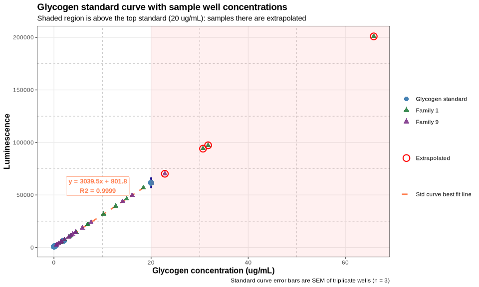
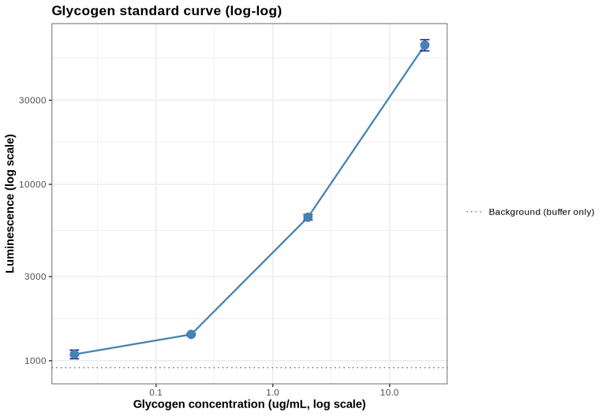
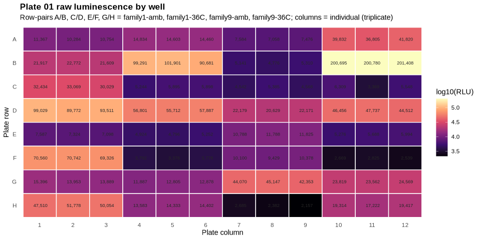
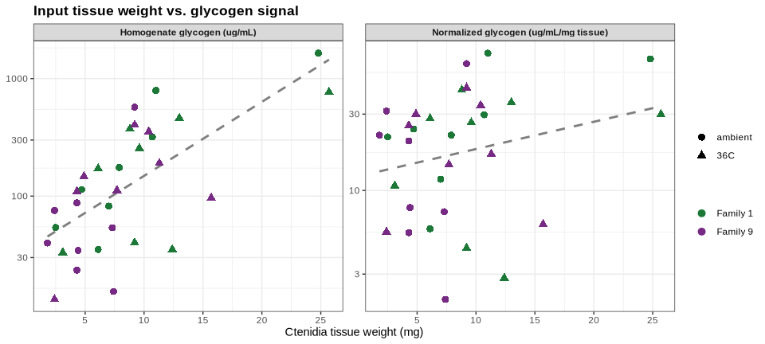
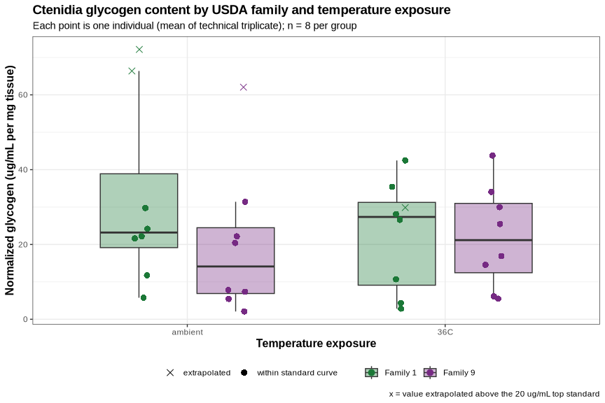
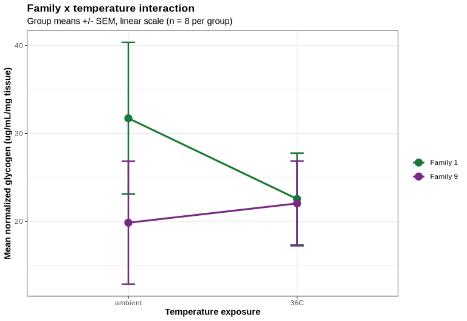

Gen5-20260730-mgig-fams1_9-glycogen-glo
================
Sam White
2026-07-30

- [1 BACKGROUND](#1-background)
  - [1.1 Sample naming](#11-sample-naming)
  - [1.2 Important note(s)](#12-important-notes)
- [2 SETUP](#2-setup)
  - [2.1 Libraries](#21-libraries)
  - [2.2 Output directory](#22-output-directory)
- [3 DATA](#3-data)
  - [3.1 Reshape plates to long
    format](#31-reshape-plates-to-long-format)
- [4 STANDARD CURVES](#4-standard-curves)
  - [4.1 Glycogen Standard Curve](#41-glycogen-standard-curve)
    - [4.1.1 Extract luminescence data](#411-extract-luminescence-data)
    - [4.1.2 Glycogen standard curve summary statistics and linear
      regression](#412-glycogen-standard-curve-summary-statistics-and-linear-regression)
    - [4.1.3 Extract sample data and calculate glycogen
      levels](#413-extract-sample-data-and-calculate-glycogen-levels)
    - [4.1.4 Plot glycogen standard curve with sample
      points](#414-plot-glycogen-standard-curve-with-sample-points)
- [5 QUALITY CONTROL](#5-quality-control)
  - [5.1 Technical replicate
    variability](#51-technical-replicate-variability)
  - [5.2 Samples outside the standard curve
    range](#52-samples-outside-the-standard-curve-range)
  - [5.3 Plate 01 luminescence map](#53-plate-01-luminescence-map)
  - [5.4 Relationship between tissue weight and
    signal](#54-relationship-between-tissue-weight-and-signal)
- [6 SAMPLE GLYCOGEN TABLE](#6-sample-glycogen-table)
- [7 FAMILY AND TEMPERATURE
  COMPARISONS](#7-family-and-temperature-comparisons)
  - [7.1 Group summary statistics](#71-group-summary-statistics)
  - [7.2 Plot: glycogen by family and
    temperature](#72-plot-glycogen-by-family-and-temperature)
  - [7.3 Plot: family x temperature
    interaction](#73-plot-family-x-temperature-interaction)
  - [7.4 Statistical tests](#74-statistical-tests)
    - [7.4.1 Sensitivity analysis: excluding extrapolated
      samples](#741-sensitivity-analysis-excluding-extrapolated-samples)
- [8 SUMMARY](#8-summary)

# 1 BACKGROUND

Glycogen quantification of *Magallana gigas* (Pacific oyster) ctenidia
homogenates using the [Glycogen-Glo Assay
(Promega)](https://github.com/RobertsLab/resources/blob/master/protocols/Commercial_Protocols/Promega_Glycogen_Glo_Assay.pdf)
(GitHub; PDF), read on 2026-07-30.

The experiment compares two USDA oyster families (**family 1** and
**family 9**) across two temperature exposures (**ambient** and
**36°C**), with **8 individuals per family per temperature** (32 samples
total). Each sample was run in **technical triplicate** at a **1:25
dilution**.

Two plates were read on the same instrument/protocol:

- **Plate 01**: all 32 samples, triplicate, filling all 96 wells (no
  standards).
- **Plate 02**: glycogen standard curve (20, 2, 0.2, 0.02, 0 µg/mL) plus
  a buffer-only negative control, all in triplicate.

Because the standards live on a separate plate from the samples, a
single standard curve from plate 02 is applied to all samples on plate
01. Both plates were read with the same protocol
(`luminesence-96wells-1.0s-glycogen_glo.prt`, gain 135, 1.00 s
integration, extended dynamic range) back-to-back, so this is
reasonable, but it does mean plate-to-plate signal drift is not
controlled for. This is flagged in the interpretation.

## 1.1 Sample naming

Per
[`../data/raw_luminescence/README.md`](../data/raw_luminescence/README.md),
plate layout entries follow:

- `<sample>-<assay_type>-<tissue_weight>-df.<dilution_factor>`

Here `<sample>` itself is composite:

- `<family>_<individual>_<temperature>`

E.g. `1_05_36C-glyc-25.7-df.25` is family 1, individual 05, 36°C
exposure, glycogen assay, 25.7 mg of ctenidia tissue, diluted 1:25.

Standards follow `STD-<assay_type>-<concentration>`, e.g. `STD-glyc-20`
(20 µg/mL glycogen); the buffer-only well is `NEG-glyc`.

## 1.2 Important note(s)

1.  **Units.** Promega’s glycogen standards and linear range are
    specified in **µg/mL** (linear to 20 µg/mL), and the layout labels
    (`STD-glyc-20`) are on that scale. Earlier scripts in this repo
    labeled the same quantity “µg/µL”; that label is incorrect by a
    factor of 1000 and is corrected here.

2.  **Tissue weights** are taken from the plate layout labels rather
    than a separate weights CSV, since they are already encoded there
    for this experiment.

# 2 SETUP

## 2.1 Libraries

``` r
library(knitr)
library(ggplot2)
library(dplyr)
```

    ## 
    ## Attaching package: 'dplyr'

    ## The following objects are masked from 'package:stats':
    ## 
    ##     filter, lag

    ## The following objects are masked from 'package:base':
    ## 
    ##     intersect, setdiff, setequal, union

``` r
library(tidyr)

knitr::opts_chunk$set(
  echo = TRUE,         # Display code chunks
  eval = TRUE,         # Evaluate code chunks
  warning = FALSE,     # Hide warnings
  message = FALSE,     # Hide messages
  comment = "",        # Prevents appending '##' to beginning of lines in code output
  results = 'hold'     # Holds output so it's all printed together after code chunk
)
```

## 2.2 Output directory

``` r
# Output directory for this analysis (matches this file's name, per ../code/README.md)
output_dir <- "../output/Gen5-20260730-mgig-fams1_9-glycogen-glo"
dir.create(output_dir, showWarnings = FALSE, recursive = TRUE)

cat("--- output_dir: destination for all figures and tables ---\n")
str(output_dir)
```

    --- output_dir: destination for all figures and tables ---
     chr "../output/Gen5-20260730-mgig-fams1_9-glycogen-glo"

# 3 DATA

Data are read from the local repo (`../data/raw_luminescence/`) so this
document renders before/after the files are pushed to GitHub. The
commented-out URLs are the remote equivalents.

``` r
data_dir <- "../data/raw_luminescence"

# plate 1 - all 32 samples, triplicate, 1:25 dilution

plate_layout1 <- read.csv(file.path(data_dir, "layout-Gen5-20260730-mgig-fams1_9-plate-01.csv"),
                          header = FALSE, stringsAsFactors = FALSE)
raw_luminescence1 <- read.csv(file.path(data_dir, "raw_lum-Gen5-20260730-mgig-fams1_9-plate-01.csv"),
                              header = FALSE)

# plate 2 - glycogen standard curve + negative control, triplicates
plate_layout2 <- read.csv(file.path(data_dir, "layout-Gen5-20260730-mgig-fams1_9-plate-02.csv"),
                          header = FALSE, stringsAsFactors = FALSE)
raw_luminescence2 <- read.csv(file.path(data_dir, "raw_lum-Gen5-20260730-mgig-fams1_9-plate-02.csv"),
                              header = FALSE)

cat("Plate layout 1 (samples):\n\n")
str(plate_layout1)
cat("\nRaw luminescence 1 (samples):\n\n")
str(raw_luminescence1)
cat("\nPlate layout 2 (standards):\n\n")
str(plate_layout2)
cat("\nRaw luminescence 2 (standards):\n\n")
str(raw_luminescence2)
```

    Plate layout 1 (samples):

    'data.frame':   8 obs. of  12 variables:
     $ V1 : chr  "1_01_ambient-glyc-7.0-df.25" "1_05_ambient-glyc-7.9-df.25" "1_01_36C-glyc-9.6-df.25" "1_05_36C-glyc-25.7-df.25" ...
     $ V2 : chr  "1_01_ambient-glyc-7.0-df.25" "1_05_ambient-glyc-7.9-df.25" "1_01_36C-glyc-9.6-df.25" "1_05_36C-glyc-25.7-df.25" ...
     $ V3 : chr  "1_01_ambient-glyc-7.0-df.25" "1_05_ambient-glyc-7.9-df.25" "1_01_36C-glyc-9.6-df.25" "1_05_36C-glyc-25.7-df.25" ...
     $ V4 : chr  "1_02_ambient-glyc-4.7-df.25" "1_06_ambient-glyc-11.0-df.25" "1_02_36C-glyc-9.2-df.25" "1_06_36C-glyc-13.0-df.25" ...
     $ V5 : chr  "1_02_ambient-glyc-4.7-df.25" "1_06_ambient-glyc-11.0-df.25" "1_02_36C-glyc-9.2-df.25" "1_06_36C-glyc-13.0-df.25" ...
     $ V6 : chr  "1_02_ambient-glyc-4.7-df.25" "1_06_ambient-glyc-11.0-df.25" "1_02_36C-glyc-9.2-df.25" "1_06_36C-glyc-13.0-df.25" ...
     $ V7 : chr  "1_03_ambient-glyc-2.5-df.25" "1_07_ambient-glyc-6.1-df.25" "1_03_36C-glyc-3.1-df.25" "1_07_36C-glyc-6.1-df.25" ...
     $ V8 : chr  "1_03_ambient-glyc-2.5-df.25" "1_07_ambient-glyc-6.1-df.25" "1_03_36C-glyc-3.1-df.25" "1_07_36C-glyc-6.1-df.25" ...
     $ V9 : chr  "1_03_ambient-glyc-2.5-df.25" "1_07_ambient-glyc-6.1-df.25" "1_03_36C-glyc-3.1-df.25" "1_07_36C-glyc-6.1-df.25" ...
     $ V10: chr  "1_04_ambient-glyc-10.7-df.25" "1_08_ambient-glyc-24.8-df.25" "1_04_36C-glyc-12.4-df.25" "1_08_36C-glyc-8.8-df.25" ...
     $ V11: chr  "1_04_ambient-glyc-10.7-df.25" "1_08_ambient-glyc-24.8-df.25" "1_04_36C-glyc-12.4-df.25" "1_08_36C-glyc-8.8-df.25" ...
     $ V12: chr  "1_04_ambient-glyc-10.7-df.25" "1_08_ambient-glyc-24.8-df.25" "1_04_36C-glyc-12.4-df.25" "1_08_36C-glyc-8.8-df.25" ...

    Raw luminescence 1 (samples):

    'data.frame':   8 obs. of  12 variables:
     $ V1 : int  11367 21917 32434 99029 7587 70560 15396 47510
     $ V2 : int  10284 22772 33069 89772 7324 70742 13953 51778
     $ V3 : int  10754 21609 30029 93511 7098 69326 13889 50054
     $ V4 : int  14834 99291 5244 56801 4924 3792 11887 13583
     $ V5 : int  14603 101901 5895 55712 4796 3376 12805 14333
     $ V6 : int  14460 90681 5898 57887 5252 3778 12878 14402
     $ V7 : int  7584 5141 4542 22179 10788 10100 44070 2685
     $ V8 : int  7058 4776 5385 20629 11788 9429 45147 2382
     $ V9 : int  7476 5310 4568 22171 11825 10378 42353 2157
     $ V10: int  39832 200695 6309 46456 5276 2669 23819 19314
     $ V11: int  36805 200780 3369 47737 5688 2825 23562 17222
     $ V12: int  41820 201408 5548 44512 5994 2539 24569 19417

    Plate layout 2 (standards):

    'data.frame':   8 obs. of  12 variables:
     $ V1 : chr  "STD-glyc-20" "STD-glyc-0" "NEG-glyc" "" ...
     $ V2 : chr  "STD-glyc-20" "STD-glyc-0" "NEG-glyc" "" ...
     $ V3 : chr  "STD-glyc-20" "STD-glyc-0" "NEG-glyc" "" ...
     $ V4 : chr  "STD-glyc-2" "" "" "" ...
     $ V5 : chr  "STD-glyc-2" "" "" "" ...
     $ V6 : chr  "STD-glyc-2" "" "" "" ...
     $ V7 : chr  "STD-glyc-0.2" "" "" "" ...
     $ V8 : chr  "STD-glyc-0.2" "" "" "" ...
     $ V9 : chr  "STD-glyc-0.2" "" "" "" ...
     $ V10: chr  "STD-glyc-0.02" "" "" "" ...
     $ V11: chr  "STD-glyc-0.02" "" "" "" ...
     $ V12: chr  "STD-glyc-0.02" "" "" "" ...

    Raw luminescence 2 (standards):

    'data.frame':   8 obs. of  12 variables:
     $ V1 : int  53166 924 932 NA NA NA NA NA
     $ V2 : int  68390 909 840 NA NA NA NA NA
     $ V3 : int  63329 897 967 NA NA NA NA NA
     $ V4 : int  6947 NA NA NA NA NA NA NA
     $ V5 : int  6432 NA NA NA NA NA NA NA
     $ V6 : int  6156 NA NA NA NA NA NA NA
     $ V7 : int  1437 NA NA NA NA NA NA NA
     $ V8 : int  1415 NA NA NA NA NA NA NA
     $ V9 : int  1377 NA NA NA NA NA NA NA
     $ V10: int  1144 NA NA NA NA NA NA NA
     $ V11: int  1153 NA NA NA NA NA NA NA
     $ V12: int  963 NA NA NA NA NA NA NA

## 3.1 Reshape plates to long format

Rather than defining one variable per sample, both plates are melted to
a tidy well-level data frame and the sample metadata is parsed out of
the layout labels. This keeps the code independent of how many samples
are on the plate.

``` r
# Convert a paired layout/luminescence plate into one row per well
plate_to_long <- function(layout, luminescence, plate_label) {
  n_row <- 8
  n_col <- 12
  out <- expand.grid(plate_row_idx = 1:n_row, plate_col = 1:n_col)
  out$plate       <- plate_label
  out$plate_row   <- LETTERS[out$plate_row_idx]
  out$well        <- sprintf("%s%02d", out$plate_row, out$plate_col)
  out$label       <- trimws(as.character(mapply(function(i, j) layout[i, j],
                                                out$plate_row_idx, out$plate_col)))
  out$luminescence <- as.numeric(mapply(function(i, j) luminescence[i, j],
                                        out$plate_row_idx, out$plate_col))
  out <- out[order(out$plate_row_idx, out$plate_col), ]
  out[out$label != "" & !is.na(out$label), ]
}

plate1_long <- plate_to_long(plate_layout1, raw_luminescence1, "plate-01")
plate2_long <- plate_to_long(plate_layout2, raw_luminescence2, "plate-02")


cat("--- plate_to_long(): layout + luminescence -> one row per well ---\n\n")
str(args(plate_to_long))

cat("\n--- plate1_long: one row per occupied well, sample plate ---\n\n")
str(plate1_long)

cat("\n--- plate2_long: one row per occupied well, standards plate ---\n\n")
str(plate2_long)
```

    --- plate_to_long(): layout + luminescence -> one row per well ---

    function (layout, luminescence, plate_label)  

    --- plate1_long: one row per occupied well, sample plate ---

    'data.frame':   96 obs. of  7 variables:
     $ plate_row_idx: int  1 1 1 1 1 1 1 1 1 1 ...
     $ plate_col    : int  1 2 3 4 5 6 7 8 9 10 ...
     $ plate        : chr  "plate-01" "plate-01" "plate-01" "plate-01" ...
     $ plate_row    : chr  "A" "A" "A" "A" ...
     $ well         : chr  "A01" "A02" "A03" "A04" ...
     $ label        : chr  "1_01_ambient-glyc-7.0-df.25" "1_01_ambient-glyc-7.0-df.25" "1_01_ambient-glyc-7.0-df.25" "1_02_ambient-glyc-4.7-df.25" ...
     $ luminescence : num  11367 10284 10754 14834 14603 ...
     - attr(*, "out.attrs")=List of 2
      ..$ dim     : Named int [1:2] 8 12
      .. ..- attr(*, "names")= chr [1:2] "plate_row_idx" "plate_col"
      ..$ dimnames:List of 2
      .. ..$ plate_row_idx: chr [1:8] "plate_row_idx=1" "plate_row_idx=2" "plate_row_idx=3" "plate_row_idx=4" ...
      .. ..$ plate_col    : chr [1:12] "plate_col= 1" "plate_col= 2" "plate_col= 3" "plate_col= 4" ...

    --- plate2_long: one row per occupied well, standards plate ---

    'data.frame':   18 obs. of  7 variables:
     $ plate_row_idx: int  1 1 1 1 1 1 1 1 1 1 ...
     $ plate_col    : int  1 2 3 4 5 6 7 8 9 10 ...
     $ plate        : chr  "plate-02" "plate-02" "plate-02" "plate-02" ...
     $ plate_row    : chr  "A" "A" "A" "A" ...
     $ well         : chr  "A01" "A02" "A03" "A04" ...
     $ label        : chr  "STD-glyc-20" "STD-glyc-20" "STD-glyc-20" "STD-glyc-2" ...
     $ luminescence : num  53166 68390 63329 6947 6432 ...
     - attr(*, "out.attrs")=List of 2
      ..$ dim     : Named int [1:2] 8 12
      .. ..- attr(*, "names")= chr [1:2] "plate_row_idx" "plate_col"
      ..$ dimnames:List of 2
      .. ..$ plate_row_idx: chr [1:8] "plate_row_idx=1" "plate_row_idx=2" "plate_row_idx=3" "plate_row_idx=4" ...
      .. ..$ plate_col    : chr [1:12] "plate_col= 1" "plate_col= 2" "plate_col= 3" "plate_col= 4" ...

# 4 STANDARD CURVES

## 4.1 Glycogen Standard Curve

### 4.1.1 Extract luminescence data

Plate 02, row A holds the four non-zero glycogen standards (20, 2, 0.2,
0.02 µg/mL) in triplicate; row B columns 1-3 hold the `STD-glyc-0`
(zero-glycogen) standard and row C columns 1-3 hold the `NEG-glyc`
buffer-only negative control.

``` r
standards <- plate2_long %>%
  filter(grepl("^STD-glyc-", label)) %>%
  mutate(glyc_concentration = as.numeric(sub("^STD-glyc-", "", label)))

negative_control <- plate2_long %>% filter(grepl("^NEG-glyc", label))

cat("Standard concentrations (ug/mL):",
    paste(sort(unique(standards$glyc_concentration)), collapse = ", "), "\n")
cat("Replicates per standard:",
    paste(unique(table(standards$glyc_concentration)), collapse = ", "), "\n\n")

cat("Negative control (buffer only) luminescence:",
    paste(negative_control$luminescence, collapse = ", "),
    "| mean =", round(mean(negative_control$luminescence), 1), "\n")
cat("Zero glycogen standard luminescence:  mean =",
    round(mean(standards$luminescence[standards$glyc_concentration == 0]), 1), "\n")

cat("\n--- standards: standard curve wells with parsed concentration ---\n")
str(standards)
cat("\n--- negative_control: buffer-only wells ---\n")
str(negative_control)
```

    Standard concentrations (ug/mL): 0, 0.02, 0.2, 2, 20 
    Replicates per standard: 3 

    Negative control (buffer only) luminescence: 932, 840, 967 | mean = 913 
    Zero glycogen standard luminescence:  mean = 910 

    --- standards: standard curve wells with parsed concentration ---
    'data.frame':   15 obs. of  8 variables:
     $ plate_row_idx     : int  1 1 1 1 1 1 1 1 1 1 ...
     $ plate_col         : int  1 2 3 4 5 6 7 8 9 10 ...
     $ plate             : chr  "plate-02" "plate-02" "plate-02" "plate-02" ...
     $ plate_row         : chr  "A" "A" "A" "A" ...
     $ well              : chr  "A01" "A02" "A03" "A04" ...
     $ label             : chr  "STD-glyc-20" "STD-glyc-20" "STD-glyc-20" "STD-glyc-2" ...
     $ luminescence      : num  53166 68390 63329 6947 6432 ...
     $ glyc_concentration: num  20 20 20 2 2 2 0.2 0.2 0.2 0.02 ...
     - attr(*, "out.attrs")=List of 2
      ..$ dim     : Named int [1:2] 8 12
      .. ..- attr(*, "names")= chr [1:2] "plate_row_idx" "plate_col"
      ..$ dimnames:List of 2
      .. ..$ plate_row_idx: chr [1:8] "plate_row_idx=1" "plate_row_idx=2" "plate_row_idx=3" "plate_row_idx=4" ...
      .. ..$ plate_col    : chr [1:12] "plate_col= 1" "plate_col= 2" "plate_col= 3" "plate_col= 4" ...

    --- negative_control: buffer-only wells ---
    'data.frame':   3 obs. of  7 variables:
     $ plate_row_idx: int  3 3 3
     $ plate_col    : int  1 2 3
     $ plate        : chr  "plate-02" "plate-02" "plate-02"
     $ plate_row    : chr  "C" "C" "C"
     $ well         : chr  "C01" "C02" "C03"
     $ label        : chr  "NEG-glyc" "NEG-glyc" "NEG-glyc"
     $ luminescence : num  932 840 967
     - attr(*, "out.attrs")=List of 2
      ..$ dim     : Named int [1:2] 8 12
      .. ..- attr(*, "names")= chr [1:2] "plate_row_idx" "plate_col"
      ..$ dimnames:List of 2
      .. ..$ plate_row_idx: chr [1:8] "plate_row_idx=1" "plate_row_idx=2" "plate_row_idx=3" "plate_row_idx=4" ...
      .. ..$ plate_col    : chr [1:12] "plate_col= 1" "plate_col= 2" "plate_col= 3" "plate_col= 4" ...

The buffer-only negative control and the zero-glycogen standard are
indistinguishable, as expected – both report the reagent/instrument
background.

### 4.1.2 Glycogen standard curve summary statistics and linear regression

Following the convention used in previous analyses in this repo, the
regression is fit to the **mean** luminescence at each standard
concentration. The fit to all individual replicate wells is also
reported, since it is the more honest estimate of the curve’s
uncertainty.

``` r
glycogen_summary_data <- standards %>%
  group_by(glyc_concentration) %>%
  summarise(
    glyc_mean_luminescence = mean(luminescence),
    glyc_sd                = sd(luminescence),
    glyc_se                = sd(luminescence) / sqrt(n()),
    glyc_cv                = 100 * sd(luminescence) / mean(luminescence),
    glyc_n                 = n(),
    .groups = "drop"
  ) %>%
  arrange(glyc_concentration)

# Regression on the per-concentration means (repo convention)
lm_model      <- lm(glyc_mean_luminescence ~ glyc_concentration, data = glycogen_summary_data)
glyc_slope     <- coef(lm_model)[2]
glyc_intercept <- coef(lm_model)[1]
glyc_r_squared <- summary(lm_model)$r.squared

# Regression on all individual replicate wells (for comparison)
lm_model_reps    <- lm(luminescence ~ glyc_concentration, data = standards)
glyc_r2_reps     <- summary(lm_model_reps)$r.squared

glyc_conc_min_nonzero <- min(glycogen_summary_data$glyc_concentration[
  glycogen_summary_data$glyc_concentration > 0])
glyc_conc_max <- max(glycogen_summary_data$glyc_concentration)

kable(glycogen_summary_data,
      digits = c(2, 1, 1, 1, 2, 0),
      col.names = c("Glycogen (ug/mL)", "Mean luminescence", "SD", "SEM", "CV (%)", "n"),
      caption = "Glycogen standard curve summary statistics")

cat("\nFit to concentration means:      y =", sprintf("%.1f", glyc_slope), "x +",
    sprintf("%.1f", glyc_intercept), " R^2 =", sprintf("%.4f", glyc_r_squared), "\n")
cat("Fit to individual replicates:    R^2 =", sprintf("%.4f", glyc_r2_reps), "\n")
cat("Quantifiable range (standards):", glyc_conc_min_nonzero, "-", glyc_conc_max, "ug/mL\n")

cat("\n--- glycogen_summary_data: per-concentration summary statistics ---\n")
str(glycogen_summary_data)
cat("\n--- lm_model: regression on per-concentration means ---\n")
str(lm_model, max.level = 1, give.attr = FALSE)
cat("\n--- lm_model_reps: regression on all individual replicate wells ---\n")
str(lm_model_reps, max.level = 1, give.attr = FALSE)
```

| Glycogen (ug/mL) | Mean luminescence |     SD |    SEM | CV (%) |   n |
|-----------------:|------------------:|-------:|-------:|-------:|----:|
|             0.00 |             910.0 |   13.5 |    7.8 |   1.49 |   3 |
|             0.02 |            1086.7 |  107.2 |   61.9 |   9.86 |   3 |
|             0.20 |            1409.7 |   30.4 |   17.5 |   2.15 |   3 |
|             2.00 |            6511.7 |  401.5 |  231.8 |   6.17 |   3 |
|            20.00 |           61628.3 | 7753.2 | 4476.3 |  12.58 |   3 |

Glycogen standard curve summary statistics

    Fit to concentration means:      y = 3039.5 x + 801.8  R^2 = 0.9999 
    Fit to individual replicates:    R^2 = 0.9859 
    Quantifiable range (standards): 0.02 - 20 ug/mL

    --- glycogen_summary_data: per-concentration summary statistics ---
    tibble [5 × 6] (S3: tbl_df/tbl/data.frame)
     $ glyc_concentration    : num [1:5] 0 0.02 0.2 2 20
     $ glyc_mean_luminescence: num [1:5] 910 1087 1410 6512 61628
     $ glyc_sd               : num [1:5] 13.5 107.2 30.4 401.5 7753.2
     $ glyc_se               : num [1:5] 7.81 61.89 17.52 231.79 4476.3
     $ glyc_cv               : num [1:5] 1.49 9.86 2.15 6.17 12.58
     $ glyc_n                : int [1:5] 3 3 3 3 3

    --- lm_model: regression on per-concentration means ---
    List of 12
     $ coefficients : Named num [1:2] 802 3039
     $ residuals    : Named num [1:5] 108.2489 224.1257 0.0166 -369.0743 36.6831
     $ effects      : Named num [1:5] -31996.5 53108.1 -60.1 -412.5 160.5
     $ rank         : int 2
     $ fitted.values: Named num [1:5] 802 863 1410 6881 61592
     $ assign       : int [1:2] 0 1
     $ qr           :List of 5
     $ df.residual  : int 3
     $ xlevels      : Named list()
     $ call         : language lm(formula = glyc_mean_luminescence ~ glyc_concentration, data = glycogen_summary_data)
     $ terms        :Classes 'terms', 'formula'  language glyc_mean_luminescence ~ glyc_concentration
     $ model        :'data.frame':  5 obs. of  2 variables:

    --- lm_model_reps: regression on all individual replicate wells ---
    List of 12
     $ coefficients : Named num [1:2] 802 3039
     $ residuals    : Named num [1:15] -8425.7 6798.3 1737.3 66.3 -448.7 ...
     $ effects      : Named num [1:15] -55420 -91986 993 2923 2408 ...
     $ rank         : int 2
     $ fitted.values: Named num [1:15] 61592 61592 61592 6881 6881 ...
     $ assign       : int [1:2] 0 1
     $ qr           :List of 5
     $ df.residual  : int 13
     $ xlevels      : Named list()
     $ call         : language lm(formula = luminescence ~ glyc_concentration, data = standards)
     $ terms        :Classes 'terms', 'formula'  language luminescence ~ glyc_concentration
     $ model        :'data.frame':  15 obs. of  2 variables:

### 4.1.3 Extract sample data and calculate glycogen levels

Sample labels are parsed into family, individual, temperature, tissue
weight, and dilution factor. The delimiter inconsistencies noted above
(`1_02-36C`, `9-07-36C`, `9-08-36C`) are normalized here.

``` r
samples_wells <- plate1_long %>%
  # Normalize `-` to `_` in the <family>-<individual>-<temperature> prefix
  mutate(label_clean = sub("^([19])[-_]([0-9]{2})[-_](ambient|36C)-", "\\1_\\2_\\3-", label)) %>%
  mutate(
    sample_id  = sub("-glyc-.*$", "", label_clean),
    family     = sub("^([19])_.*$", "\\1", label_clean),
    individual = sub("^[19]_([0-9]{2})_.*$", "\\1", label_clean),
    temperature = sub("^[19]_[0-9]{2}_([^-]+)-.*$", "\\1", label_clean),
    weight_mg  = as.numeric(sub("^.*-glyc-([0-9.]+)-df\\..*$", "\\1", label_clean)),
    dilution   = as.numeric(sub("^.*-df\\.", "", label_clean))
  ) %>%
  mutate(
    family      = factor(paste("Family", family), levels = c("Family 1", "Family 9")),
    temperature = factor(temperature, levels = c("ambient", "36C"))
  )

# Fail loudly rather than silently dropping malformed labels
stopifnot(!any(is.na(samples_wells$weight_mg)),
          !any(is.na(samples_wells$dilution)),
          !any(is.na(samples_wells$temperature)))

cat("Wells parsed:", nrow(samples_wells),
    "| unique samples:", length(unique(samples_wells$sample_id)), "\n")
cat("Dilution factor(s) used:", paste(unique(samples_wells$dilution), collapse = ", "), "\n\n")
cat("Design (wells per group):\n")
print(table(samples_wells$family, samples_wells$temperature))
cat("\nTissue weight range (mg):",
    paste(range(samples_wells$weight_mg), collapse = " - "), "\n")

cat("\n--- samples_wells: one row per sample well, metadata parsed from label ---\n")
str(samples_wells)
```

    Wells parsed: 96 | unique samples: 32 
    Dilution factor(s) used: 25 

    Design (wells per group):
              
               ambient 36C
      Family 1      24  24
      Family 9      24  24

    Tissue weight range (mg): 1.8 - 25.7 

    --- samples_wells: one row per sample well, metadata parsed from label ---
    'data.frame':   96 obs. of  14 variables:
     $ plate_row_idx: int  1 1 1 1 1 1 1 1 1 1 ...
     $ plate_col    : int  1 2 3 4 5 6 7 8 9 10 ...
     $ plate        : chr  "plate-01" "plate-01" "plate-01" "plate-01" ...
     $ plate_row    : chr  "A" "A" "A" "A" ...
     $ well         : chr  "A01" "A02" "A03" "A04" ...
     $ label        : chr  "1_01_ambient-glyc-7.0-df.25" "1_01_ambient-glyc-7.0-df.25" "1_01_ambient-glyc-7.0-df.25" "1_02_ambient-glyc-4.7-df.25" ...
     $ luminescence : num  11367 10284 10754 14834 14603 ...
     $ label_clean  : chr  "1_01_ambient-glyc-7.0-df.25" "1_01_ambient-glyc-7.0-df.25" "1_01_ambient-glyc-7.0-df.25" "1_02_ambient-glyc-4.7-df.25" ...
     $ sample_id    : chr  "1_01_ambient" "1_01_ambient" "1_01_ambient" "1_02_ambient" ...
     $ family       : Factor w/ 2 levels "Family 1","Family 9": 1 1 1 1 1 1 1 1 1 1 ...
     $ individual   : chr  "01" "01" "01" "02" ...
     $ temperature  : Factor w/ 2 levels "ambient","36C": 1 1 1 1 1 1 1 1 1 1 ...
     $ weight_mg    : num  7 7 7 4.7 4.7 4.7 2.5 2.5 2.5 10.7 ...
     $ dilution     : num  25 25 25 25 25 25 25 25 25 25 ...
     - attr(*, "out.attrs")=List of 2
      ..$ dim     : Named int [1:2] 8 12
      .. ..- attr(*, "names")= chr [1:2] "plate_row_idx" "plate_col"
      ..$ dimnames:List of 2
      .. ..$ plate_row_idx: chr [1:8] "plate_row_idx=1" "plate_row_idx=2" "plate_row_idx=3" "plate_row_idx=4" ...
      .. ..$ plate_col    : chr [1:12] "plate_col= 1" "plate_col= 2" "plate_col= 3" "plate_col= 4" ...

Per-sample values are then computed by averaging the technical
triplicate and back-calculating through the standard curve:

1.  **Well concentration** = `(mean luminescence - intercept) / slope` →
    µg/mL in the assayed (diluted) well.
2.  **Homogenate concentration** = well concentration × dilution
    factor (25) → µg/mL in the undiluted homogenate.
3.  **Normalized glycogen** = homogenate concentration / tissue weight →
    µg/mL per mg tissue.

Note on step 3: because homogenization volume is not recorded in these
data files, normalized values are reported as µg glycogen per mL
homogenate per mg tissue. If the standard 1.0 mL homogenization volume
was used (750 µL PBS/0.3N HCl + 250 µL Tris, per
[`../glycogen-promega-notes.md`](../glycogen-promega-notes.md)), these
values are numerically equal to **µg glycogen / mg tissue**. All
comparisons below are unaffected as long as the volume was constant
across samples.

``` r
sample_glycogen <- samples_wells %>%
  group_by(sample_id, family, individual, temperature, weight_mg, dilution) %>%
  summarise(
    n_reps        = n(),
    mean_lum      = mean(luminescence),
    sd_lum        = sd(luminescence),
    cv_lum        = 100 * sd(luminescence) / mean(luminescence),
    .groups = "drop"
  ) %>%
  mutate(
    well_conc_ug_mL       = (mean_lum - glyc_intercept) / glyc_slope,
    homogenate_conc_ug_mL = well_conc_ug_mL * dilution,
    norm_glycogen         = homogenate_conc_ug_mL / weight_mg,
    in_std_range          = well_conc_ug_mL >= glyc_conc_min_nonzero &
                            well_conc_ug_mL <= glyc_conc_max
  ) %>%
  arrange(family, temperature, individual)

cat("Samples quantified:", nrow(sample_glycogen), "\n")

cat("\n--- sample_glycogen: one row per individual, triplicate averaged and back-calculated ---\n")
str(sample_glycogen)
```

    Samples quantified: 32 

    --- sample_glycogen: one row per individual, triplicate averaged and back-calculated ---
    tibble [32 × 14] (S3: tbl_df/tbl/data.frame)
     $ sample_id            : chr [1:32] "1_01_ambient" "1_02_ambient" "1_03_ambient" "1_04_ambient" ...
     $ family               : Factor w/ 2 levels "Family 1","Family 9": 1 1 1 1 1 1 1 1 1 1 ...
     $ individual           : chr [1:32] "01" "02" "03" "04" ...
     $ temperature          : Factor w/ 2 levels "ambient","36C": 1 1 1 1 1 1 1 1 2 2 ...
     $ weight_mg            : num [1:32] 7 4.7 2.5 10.7 7.9 11 6.1 24.8 9.6 9.2 ...
     $ dilution             : num [1:32] 25 25 25 25 25 25 25 25 25 25 ...
     $ n_reps               : int [1:32] 3 3 3 3 3 3 3 3 3 3 ...
     $ mean_lum             : num [1:32] 10802 14632 7373 39486 22099 ...
     $ sd_lum               : num [1:32] 543 189 278 2525 603 ...
     $ cv_lum               : num [1:32] 5.03 1.29 3.77 6.4 2.73 ...
     $ well_conc_ug_mL      : num [1:32] 3.29 4.55 2.16 12.73 7.01 ...
     $ homogenate_conc_ug_mL: num [1:32] 82.2 113.8 54 318.2 175.2 ...
     $ norm_glycogen        : num [1:32] 11.7 24.2 21.6 29.7 22.2 ...
     $ in_std_range         : logi [1:32] TRUE TRUE TRUE TRUE TRUE FALSE ...

### 4.1.4 Plot glycogen standard curve with sample points

``` r
std_curve_plot <- ggplot(glycogen_summary_data,
                         aes(x = glyc_concentration, y = glyc_mean_luminescence)) +
  geom_smooth(aes(linetype = "Std curve best fit line"), method = "lm", se = FALSE,
              color = "coral", linewidth = 1) +
  geom_errorbar(aes(ymin = glyc_mean_luminescence - glyc_se,
                    ymax = glyc_mean_luminescence + glyc_se),
                width = 0.3, linewidth = 1, color = "darkblue") +
  geom_point(aes(color = "Glycogen standard"), shape = 16, size = 4) +
  geom_point(data = sample_glycogen,
             aes(x = well_conc_ug_mL, y = mean_lum, color = family),
             shape = 17, size = 2.5, alpha = 0.85) +
  geom_point(data = filter(sample_glycogen, !in_std_range),
             aes(x = well_conc_ug_mL, y = mean_lum, shape = "Extrapolated"),
             size = 4, stroke = 1.1, color = "red", fill = NA) +
  annotate("rect", xmin = glyc_conc_max, xmax = Inf, ymin = -Inf, ymax = Inf,
           fill = "red", alpha = 0.06) +
  scale_color_manual(name = "",
                     breaks = c("Glycogen standard", "Family 1", "Family 9"),
                     values = c("Glycogen standard" = "steelblue",
                                "Family 1"          = "#1b7837",
                                "Family 9"          = "#762a83")) +
  scale_shape_manual(name = "", values = c("Extrapolated" = 21)) +
  scale_linetype_manual(name = "", values = c("Std curve best fit line" = "dashed")) +
  guides(color = guide_legend(override.aes = list(shape = c(16, 17, 17), size = 3),
                              order = 1),
         shape = guide_legend(order = 2), linetype = guide_legend(order = 3)) +
  annotate("label",
           x = glyc_conc_max * 0.45, y = max(glycogen_summary_data$glyc_mean_luminescence) * 0.95,
           label = sprintf("y = %.1fx + %.1f\nR2 = %.4f", glyc_slope, glyc_intercept, glyc_r_squared),
           size = 3.5, fontface = "bold", fill = "white", color = "coral",
           label.padding = unit(0.3, "lines")) +
  labs(
    title = "Glycogen standard curve with sample well concentrations",
    subtitle = "Shaded region is above the top standard (20 ug/mL): samples there are extrapolated",
    x = "Glycogen concentration (ug/mL)",
    y = "Luminescence",
    caption = "Standard curve error bars are SEM of triplicate wells (n = 3)"
  ) +
  theme_bw() +
  theme(
    plot.title  = element_text(size = 14, face = "bold"),
    axis.title  = element_text(size = 12, face = "bold"),
    panel.grid.minor = element_line(linetype = "dashed", color = "grey70")
  )

cat("--- std_curve_plot: ggplot object structure ---\n")
summary(std_curve_plot)

ggsave(file.path(output_dir, "glycogen_standard_curve.png"), std_curve_plot,
       width = 10, height = 6, dpi = 300)

std_curve_plot
```

<!-- -->

    --- std_curve_plot: ggplot object structure ---
    data: glyc_concentration, glyc_mean_luminescence, glyc_sd, glyc_se,
      glyc_cv, glyc_n [5x6]
    mapping:  x = ~glyc_concentration, y = ~glyc_mean_luminescence
    scales:   colour, shape, linetype 
    faceting:  <empty> 
    -----------------------------------
    mapping: linetype = Std curve best fit line 
    geom_smooth: na.rm = FALSE, orientation = NA, se = FALSE
    stat_smooth: na.rm = FALSE, orientation = NA, se = FALSE, method = lm
    position_identity 

    mapping: ymin = ~glyc_mean_luminescence - glyc_se, ymax = ~glyc_mean_luminescence + glyc_se 
    geom_errorbar: na.rm = FALSE, orientation = NA, lineend = butt, width = 0.3
    stat_identity: na.rm = FALSE
    position_identity 

    mapping: colour = Glycogen standard 
    geom_point: na.rm = FALSE
    stat_identity: na.rm = FALSE
    position_identity 

    mapping: x = ~well_conc_ug_mL, y = ~mean_lum, colour = ~family 
    geom_point: na.rm = FALSE
    stat_identity: na.rm = FALSE
    position_identity 

    mapping: x = ~well_conc_ug_mL, y = ~mean_lum, shape = Extrapolated 
    geom_point: na.rm = FALSE
    stat_identity: na.rm = FALSE
    position_identity 

    mapping: xmin = ~xmin, xmax = ~xmax, ymin = ~ymin, ymax = ~ymax 
    geom_rect: na.rm = FALSE
    stat_identity: na.rm = FALSE
    position_identity 

    mapping: x = ~x, y = ~y 
    geom_label: na.rm = FALSE, label.padding = 0.3
    stat_identity: na.rm = FALSE
    position_identity 

The linear fit is anchored almost entirely by the 20 µg/mL standard. On
a log-log scale it is clear that the three lowest standards (0.02, 0.2,
2 µg/mL) sit essentially on the baseline of this linear model, i.e. the
curve has little resolving power at the bottom of the range:

``` r
std_curve_log_plot <- ggplot(filter(glycogen_summary_data, glyc_concentration > 0),
                             aes(x = glyc_concentration, y = glyc_mean_luminescence)) +
  geom_hline(aes(yintercept = mean(negative_control$luminescence),
                 linetype = "Background (buffer only)"), color = "grey40") +
  geom_line(color = "steelblue", linewidth = 0.8) +
  geom_errorbar(aes(ymin = glyc_mean_luminescence - glyc_se,
                    ymax = glyc_mean_luminescence + glyc_se),
                width = 0.08, color = "darkblue") +
  geom_point(color = "steelblue", size = 3.5) +
  scale_x_log10() +
  scale_y_log10() +
  scale_linetype_manual(name = "", values = c("Background (buffer only)" = "dotted")) +
  labs(
    title = "Glycogen standard curve (log-log)",
    x = "Glycogen concentration (ug/mL, log scale)",
    y = "Luminescence (log scale)"
  ) +
  theme_bw() +
  theme(plot.title = element_text(size = 13, face = "bold"),
        axis.title = element_text(size = 11, face = "bold"))

cat("--- std_curve_log_plot: ggplot object structure ---\n")
summary(std_curve_log_plot)

ggsave(file.path(output_dir, "glycogen_standard_curve_loglog.png"), std_curve_log_plot,
       width = 8, height = 5.5, dpi = 300)

std_curve_log_plot
```

<!-- -->

    --- std_curve_log_plot: ggplot object structure ---
    data: glyc_concentration, glyc_mean_luminescence, glyc_sd, glyc_se,
      glyc_cv, glyc_n [4x6]
    mapping:  x = ~glyc_concentration, y = ~glyc_mean_luminescence
    scales:   x, xmin, xmax, xend, xintercept, xmin_final, xmax_final, xlower, xmiddle, xupper, x0, y, ymin, ymax, yend, yintercept, ymin_final, ymax_final, lower, middle, upper, y0, linetype 
    faceting:  <empty> 
    -----------------------------------
    mapping: yintercept = ~mean(negative_control$luminescence), linetype = Background (buffer only) 
    geom_hline: na.rm = FALSE
    stat_identity: na.rm = FALSE
    position_identity 

    geom_line: na.rm = FALSE, orientation = NA, arrow = NULL, arrow.fill = NULL, lineend = butt, linejoin = round, linemitre = 10
    stat_identity: na.rm = FALSE
    position_identity 

    mapping: ymin = ~glyc_mean_luminescence - glyc_se, ymax = ~glyc_mean_luminescence + glyc_se 
    geom_errorbar: na.rm = FALSE, orientation = NA, lineend = butt, width = 0.08
    stat_identity: na.rm = FALSE
    position_identity 

    geom_point: na.rm = FALSE
    stat_identity: na.rm = FALSE
    position_identity 

# 5 QUALITY CONTROL

## 5.1 Technical replicate variability

``` r
cat("Coefficient of variation across technical triplicates (%):\n")
print(round(summary(sample_glycogen$cv_lum), 2))

cat("\nSamples with CV > 15%:\n")
high_cv <- sample_glycogen %>% filter(cv_lum > 15) %>%
  select(sample_id, mean_lum, sd_lum, cv_lum)
if (nrow(high_cv) == 0) {
  cat("  none\n")
} else {
  print(as.data.frame(high_cv), row.names = FALSE, digits = 4)
}

cat("\n--- high_cv: samples exceeding the 15% triplicate CV threshold ---\n\n")
str(high_cv)
```

    Coefficient of variation across technical triplicates (%):
       Min. 1st Qu.  Median    Mean 3rd Qu.    Max. 
       0.19    3.31    4.92    5.48    6.12   30.07 

    Samples with CV > 15%:
     sample_id mean_lum sd_lum cv_lum
      1_04_36C     5075   1526  30.07

    --- high_cv: samples exceeding the 15% triplicate CV threshold ---

    tibble [1 × 4] (S3: tbl_df/tbl/data.frame)
     $ sample_id: chr "1_04_36C"
     $ mean_lum : num 5075
     $ sd_lum   : num 1526
     $ cv_lum   : num 30.1

## 5.2 Samples outside the standard curve range

``` r
oor <- sample_glycogen %>%
  filter(!in_std_range) %>%
  select(sample_id, family, temperature, mean_lum, well_conc_ug_mL,
         weight_mg, norm_glycogen) %>%
  arrange(desc(well_conc_ug_mL))

cat("Samples with well concentrations outside", glyc_conc_min_nonzero, "-",
    glyc_conc_max, "ug/mL:", nrow(oor), "of", nrow(sample_glycogen), "\n\n")
kable(oor, digits = c(0, 0, 0, 0, 2, 1, 2),
      col.names = c("Sample", "Family", "Temp", "Mean lum.", "Well conc. (ug/mL)",
                    "Tissue (mg)", "Normalized glycogen"),
      caption = "Samples requiring extrapolation beyond the top standard")

cat("\n--- Samples outside the standard curve range ---\n\n")
str(oor)
```

    Samples with well concentrations outside 0.02 - 20 ug/mL: 4 of 32 

| Sample | Family | Temp | Mean lum. | Well conc. (ug/mL) | Tissue (mg) | Normalized glycogen |
|:---|:---|:---|---:|---:|---:|---:|
| 1_08_ambient | Family 1 | ambient | 200961 | 65.85 | 24.8 | 66.38 |
| 1_06_ambient | Family 1 | ambient | 97291 | 31.75 | 11.0 | 72.15 |
| 1_05_36C | Family 1 | 36C | 94104 | 30.70 | 25.7 | 29.86 |
| 9_05_ambient | Family 9 | ambient | 70209 | 22.84 | 9.2 | 62.05 |

Samples requiring extrapolation beyond the top standard

    --- Samples outside the standard curve range ---

    tibble [4 × 7] (S3: tbl_df/tbl/data.frame)
     $ sample_id      : chr [1:4] "1_08_ambient" "1_06_ambient" "1_05_36C" "9_05_ambient"
     $ family         : Factor w/ 2 levels "Family 1","Family 9": 1 1 1 2
     $ temperature    : Factor w/ 2 levels "ambient","36C": 1 1 2 1
     $ mean_lum       : num [1:4] 200961 97291 94104 70209
     $ well_conc_ug_mL: num [1:4] 65.9 31.7 30.7 22.8
     $ weight_mg      : num [1:4] 24.8 11 25.7 9.2
     $ norm_glycogen  : num [1:4] 66.4 72.1 29.9 62.1

All four are **above** the 20 µg/mL top standard, so their
concentrations are extrapolated rather than interpolated. Notably,
`1_08_ambient` reads ~201,000 RLU (3.3× the top standard) with a very
tight triplicate CV (0.2%), which is the signature of a well near the
top of the detector’s usable range. The other three (`1_06_ambient`,
`1_05_36C`, `9_05_ambient`) are more modestly above range
(~70,000-97,000 RLU, roughly 1.5-1.6× the top standard). These samples
should be re-run at a higher dilution (e.g. 1:50-1:100 for
`1_08_ambient`) before the values are treated as quantitative. Group
comparisons below are therefore repeated with these samples excluded as
a sensitivity check.

## 5.3 Plate 01 luminescence map

A well-position map checks for edge effects or systematic gradients that
would confound the family/temperature contrasts. In this design, family
and temperature are both encoded as two-row blocks (rows A/B = family 1
ambient, C/D = family 1 36°C, E/F = family 9 ambient, G/H = family 9
36°C), while column position encodes only the individual (with each
individual’s triplicate occupying 3 adjacent columns). Any row-wise
artifact would therefore alias directly onto the family/temperature
contrasts of interest; a column-wise artifact would not, since
individuals are distributed independently of family and temperature
group.

``` r
plate_map_plot <- ggplot(samples_wells,
                         aes(x = factor(plate_col), y = factor(plate_row, levels = rev(LETTERS[1:8])))) +
  geom_tile(aes(fill = log10(luminescence)), color = "white", linewidth = 0.5) +
  geom_text(aes(label = format(luminescence, big.mark = ",")), size = 2.4, color = "grey15") +
  scale_fill_viridis_c(option = "magma", name = "log10(RLU)") +
  labs(
    title = "Plate 01 raw luminescence by well",
    subtitle = "Row-pairs A/B, C/D, E/F, G/H = family1-amb, family1-36C, family9-amb, family9-36C; columns = individual (triplicate)",
    x = "Plate column", y = "Plate row"
  ) +
  theme_minimal() +
  theme(plot.title = element_text(size = 13, face = "bold"),
        panel.grid = element_blank())

cat("--- plate_map_plot: ggplot object structure ---\n\n")
summary(plate_map_plot)

ggsave(file.path(output_dir, "plate01_luminescence_map.png"), plate_map_plot,
       width = 10, height = 5, dpi = 300)

plate_map_plot
```

<!-- -->

    --- plate_map_plot: ggplot object structure ---

    data: plate_row_idx, plate_col, plate, plate_row, well, label,
      luminescence, label_clean, sample_id, family, individual,
      temperature, weight_mg, dilution [96x14]
    mapping:  x = ~factor(plate_col), y = ~factor(plate_row, levels = rev(LETTERS[1:8]))
    scales:   fill 
    faceting:  <empty> 
    -----------------------------------
    mapping: fill = ~log10(luminescence) 
    geom_tile: na.rm = FALSE, lineend = butt, linejoin = mitre
    stat_identity: na.rm = FALSE
    position_identity 

    mapping: label = ~format(luminescence, big.mark = ",") 
    geom_text: na.rm = FALSE, parse = FALSE, check_overlap = FALSE, size.unit = mm
    stat_identity: na.rm = FALSE
    position_nudge 

## 5.4 Relationship between tissue weight and signal

If normalization by tissue weight is working, normalized glycogen should
show no strong trend against input tissue weight.

``` r
weight_check <- sample_glycogen %>%
  select(sample_id, family, temperature, weight_mg,
         homogenate_conc_ug_mL, norm_glycogen) %>%
  pivot_longer(c(homogenate_conc_ug_mL, norm_glycogen),
               names_to = "metric", values_to = "value") %>%
  mutate(metric = recode(metric,
                         homogenate_conc_ug_mL = "Homogenate glycogen (ug/mL)",
                         norm_glycogen         = "Normalized glycogen (ug/mL/mg tissue)"))

weight_plot <- ggplot(weight_check, aes(x = weight_mg, y = value)) +
  geom_smooth(method = "lm", se = FALSE, color = "grey50", linetype = "dashed") +
  geom_point(aes(color = family, shape = temperature), size = 2.8) +
  facet_wrap(~ metric, scales = "free_y") +
  scale_color_manual(values = c("Family 1" = "#1b7837", "Family 9" = "#762a83"),
                     name = "") +
  scale_shape_manual(values = c("ambient" = 16, "36C" = 17), name = "") +
  scale_y_log10() +
  labs(title = "Input tissue weight vs. glycogen signal",
       x = "Ctenidia tissue weight (mg)", y = NULL) +
  theme_bw() +
  theme(plot.title = element_text(size = 13, face = "bold"),
        strip.text = element_text(face = "bold"))

cat("--- weight_check: long-format data for the two-panel weight check ---\n\n")
str(weight_check)
cat("\n--- weight_plot: ggplot object structure ---\n\n")
summary(weight_plot)

ggsave(file.path(output_dir, "tissue_weight_vs_glycogen.png"), weight_plot,
       width = 10, height = 4.5, dpi = 300)

weight_plot
```

<!-- -->

``` r
cat("Spearman correlation, tissue weight vs. homogenate glycogen concentration:\n\n")
print(cor.test(sample_glycogen$weight_mg, sample_glycogen$homogenate_conc_ug_mL,
               method = "spearman"))
cat("\nSpearman correlation, tissue weight vs. weight-normalized glycogen:\n\n")
print(cor.test(sample_glycogen$weight_mg, sample_glycogen$norm_glycogen,
               method = "spearman"))
```

    --- weight_check: long-format data for the two-panel weight check ---

    tibble [64 × 6] (S3: tbl_df/tbl/data.frame)
     $ sample_id  : chr [1:64] "1_01_ambient" "1_01_ambient" "1_02_ambient" "1_02_ambient" ...
     $ family     : Factor w/ 2 levels "Family 1","Family 9": 1 1 1 1 1 1 1 1 1 1 ...
     $ temperature: Factor w/ 2 levels "ambient","36C": 1 1 1 1 1 1 1 1 1 1 ...
     $ weight_mg  : num [1:64] 7 7 4.7 4.7 2.5 2.5 10.7 10.7 7.9 7.9 ...
     $ metric     : chr [1:64] "Homogenate glycogen (ug/mL)" "Normalized glycogen (ug/mL/mg tissue)" "Homogenate glycogen (ug/mL)" "Normalized glycogen (ug/mL/mg tissue)" ...
     $ value      : num [1:64] 82.2 11.7 113.8 24.2 54 ...

    --- weight_plot: ggplot object structure ---

    data: sample_id, family, temperature, weight_mg, metric, value [64x6]
    mapping:  x = ~weight_mg, y = ~value
    scales:   colour, shape, y, ymin, ymax, yend, yintercept, ymin_final, ymax_final, lower, middle, upper, y0 
    faceting:  ~metric 
    -----------------------------------
    geom_smooth: na.rm = FALSE, orientation = NA, se = FALSE
    stat_smooth: na.rm = FALSE, orientation = NA, se = FALSE, method = lm
    position_identity 

    mapping: colour = ~family, shape = ~temperature 
    geom_point: na.rm = FALSE
    stat_identity: na.rm = FALSE
    position_identity 

    Spearman correlation, tissue weight vs. homogenate glycogen concentration:


        Spearman's rank correlation rho

    data:  sample_glycogen$weight_mg and sample_glycogen$homogenate_conc_ug_mL
    S = 1860.7, p-value = 4.114e-05
    alternative hypothesis: true rho is not equal to 0
    sample estimates:
          rho 
    0.6589619 


    Spearman correlation, tissue weight vs. weight-normalized glycogen:


        Spearman's rank correlation rho

    data:  sample_glycogen$weight_mg and sample_glycogen$norm_glycogen
    S = 3839.5, p-value = 0.09966
    alternative hypothesis: true rho is not equal to 0
    sample estimates:
         rho 
    0.296276 

**Interpretation.** Homogenate glycogen concentration (before dividing
by weight) is strongly and significantly correlated with input tissue
weight (rho = 0.66, p \< 0.0001). This is expected, not a sign of a
problem: every sample was homogenized and diluted by the same fixed
protocol regardless of starting tissue mass, so a heavier piece of
ctenidia simply contributes proportionally more total glycogen into the
same assay volume, mechanically inflating homogenate-level
concentration. It reflects a feature of the protocol (fixed
homogenization/dilution volume, variable input mass), not biological
variation in glycogen content per se.

Dividing by tissue weight is meant to remove exactly this scaling
artifact. After normalization, the correlation with weight drops
sharply, to a weak and non-significant residual (rho = 0.30, p = 0.10) –
roughly a threefold reduction in the strength of association, and no
longer distinguishable from no relationship at this sample size (n =
32). This is the expected signature of normalization working as
intended: most, though perhaps not quite all, of the weight-driven
scaling has been removed, leaving normalized glycogen approximately
independent of how much tissue went into each homogenate. The residual
rho = 0.30 is small enough that it does not indicate normalization
failure, but it is also not exactly zero, so a mild weight-related trend
in the normalized values cannot be fully excluded from this dataset
alone (possible contributors include measurement noise at low tissue
weights, where small absolute pipetting/weighing errors have larger
proportional effects, or a true small biological effect such as larger
individuals tending to have either richer or more dilute ctenidia
glycogen stores). Because none of the family or temperature comparisons
above showed a significant effect, this residual weight association is
not currently a confound for the reported group comparisons, but it is
worth re-checking if a future dataset shows a significant family or
temperature effect that also happens to coincide with a weight imbalance
between groups.

# 6 SAMPLE GLYCOGEN TABLE

``` r
sample_table <- sample_glycogen %>%
  transmute(
    Sample        = sample_id,
    Family        = family,
    Temperature   = temperature,
    Individual    = individual,
    `Tissue (mg)` = weight_mg,
    `Dilution`    = dilution,
    `Mean lum.`   = round(mean_lum, 0),
    `CV (%)`      = round(cv_lum, 1),
    `Well glycogen (ug/mL)`        = round(well_conc_ug_mL, 3),
    `Homogenate glycogen (ug/mL)`  = round(homogenate_conc_ug_mL, 2),
    `Normalized glycogen (ug/mL/mg)` = round(norm_glycogen, 2),
    `In std range` = ifelse(in_std_range, "yes", "NO - extrapolated")
  )

kable(sample_table, caption = "Per-sample glycogen quantification (mean of technical triplicate)")

write.csv(sample_table, file.path(output_dir, "sample_glycogen_results.csv"), row.names = FALSE)

cat("\n--- sample_table: formatted per-sample results written to CSV ---\n\n")
str(sample_table)
```

| Sample | Family | Temperature | Individual | Tissue (mg) | Dilution | Mean lum. | CV (%) | Well glycogen (ug/mL) | Homogenate glycogen (ug/mL) | Normalized glycogen (ug/mL/mg) | In std range |
|:---|:---|:---|:---|---:|---:|---:|----|---:|---:|---:|:---|
| 1_01_ambient | Family 1 | ambient | 01 | 7.0 | 25 | 10802 | 5.0 | 3.290 | 82.25 | 11.75 | yes |
| 1_02_ambient | Family 1 | ambient | 02 | 4.7 | 25 | 14632 | 1.3 | 4.550 | 113.76 | 24.20 | yes |
| 1_03_ambient | Family 1 | ambient | 03 | 2.5 | 25 | 7373 | 3.8 | 2.162 | 54.05 | 21.62 | yes |
| 1_04_ambient | Family 1 | ambient | 04 | 10.7 | 25 | 39486 | 6.4 | 12.727 | 318.18 | 29.74 | yes |
| 1_05_ambient | Family 1 | ambient | 05 | 7.9 | 25 | 22099 | 2.7 | 7.007 | 175.17 | 22.17 | yes |
| 1_06_ambient | Family 1 | ambient | 06 | 11.0 | 25 | 97291 | 6.0 | 31.745 | 793.63 | 72.15 | NO - extrapolated |
| 1_07_ambient | Family 1 | ambient | 07 | 6.1 | 25 | 5076 | 5.4 | 1.406 | 35.15 | 5.76 | yes |
| 1_08_ambient | Family 1 | ambient | 08 | 24.8 | 25 | 200961 | 0.2 | 65.853 | 1646.32 | 66.38 | NO - extrapolated |
| 1_01_36C | Family 1 | 36C | 01 | 9.6 | 25 | 31844 | 5.0 | 10.213 | 255.32 | 26.60 | yes |
| 1_02_36C | Family 1 | 36C | 02 | 9.2 | 25 | 5679 | 6.6 | 1.605 | 40.12 | 4.36 | yes |
| 1_03_36C | Family 1 | 36C | 03 | 3.1 | 25 | 4832 | 9.9 | 1.326 | 33.15 | 10.69 | yes |
| 1_04_36C | Family 1 | 36C | 04 | 12.4 | 25 | 5075 | 30.1 | 1.406 | 35.15 | 2.83 | yes |
| 1_05_36C | Family 1 | 36C | 05 | 25.7 | 25 | 94104 | 4.9 | 30.697 | 767.42 | 29.86 | NO - extrapolated |
| 1_06_36C | Family 1 | 36C | 06 | 13.0 | 25 | 56800 | 1.9 | 18.424 | 460.59 | 35.43 | yes |
| 1_07_36C | Family 1 | 36C | 07 | 6.1 | 25 | 21660 | 4.1 | 6.862 | 171.56 | 28.12 | yes |
| 1_08_36C | Family 1 | 36C | 08 | 8.8 | 25 | 46235 | 3.5 | 14.948 | 373.69 | 42.46 | yes |
| 9_01_ambient | Family 9 | ambient | 01 | 7.3 | 25 | 7336 | 3.3 | 2.150 | 53.75 | 7.36 | yes |
| 9_02_ambient | Family 9 | ambient | 02 | 4.4 | 25 | 4991 | 4.7 | 1.378 | 34.45 | 7.83 | yes |
| 9_03_ambient | Family 9 | ambient | 03 | 4.3 | 25 | 11467 | 5.1 | 3.509 | 87.72 | 20.40 | yes |
| 9_04_ambient | Family 9 | ambient | 04 | 1.8 | 25 | 5653 | 6.4 | 1.596 | 39.90 | 22.17 | yes |
| 9_05_ambient | Family 9 | ambient | 05 | 9.2 | 25 | 70209 | 1.1 | 22.835 | 570.88 | 62.05 | NO - extrapolated |
| 9_06_ambient | Family 9 | ambient | 06 | 4.3 | 25 | 3649 | 6.5 | 0.937 | 23.42 | 5.45 | yes |
| 9_07_ambient | Family 9 | ambient | 07 | 2.4 | 25 | 9969 | 4.9 | 3.016 | 75.40 | 31.42 | yes |
| 9_08_ambient | Family 9 | ambient | 08 | 7.4 | 25 | 2678 | 5.3 | 0.617 | 15.43 | 2.09 | yes |
| 9_01_36C | Family 9 | 36C | 01 | 7.7 | 25 | 14413 | 5.9 | 4.478 | 111.95 | 14.54 | yes |
| 9_02_36C | Family 9 | 36C | 02 | 15.7 | 25 | 12523 | 4.4 | 3.856 | 96.41 | 6.14 | yes |
| 9_03_36C | Family 9 | 36C | 03 | 10.4 | 25 | 43857 | 3.2 | 14.165 | 354.13 | 34.05 | yes |
| 9_04_36C | Family 9 | 36C | 04 | 11.3 | 25 | 23983 | 2.2 | 7.627 | 190.67 | 16.87 | yes |
| 9_05_36C | Family 9 | 36C | 05 | 9.2 | 25 | 49781 | 4.3 | 16.114 | 402.85 | 43.79 | yes |
| 9_06_36C | Family 9 | 36C | 06 | 4.3 | 25 | 14106 | 3.2 | 4.377 | 109.43 | 25.45 | yes |
| 9_07_36C | Family 9 | 36C | 07 | 2.4 | 25 | 2408 | 11.0 | 0.528 | 13.21 | 5.50 | yes |
| 9_08_36C | Family 9 | 36C | 08 | 4.9 | 25 | 18651 | 6.6 | 5.872 | 146.81 | 29.96 | yes |

Per-sample glycogen quantification (mean of technical triplicate)

    --- sample_table: formatted per-sample results written to CSV ---

    tibble [32 × 12] (S3: tbl_df/tbl/data.frame)
     $ Sample                        : chr [1:32] "1_01_ambient" "1_02_ambient" "1_03_ambient" "1_04_ambient" ...
     $ Family                        : Factor w/ 2 levels "Family 1","Family 9": 1 1 1 1 1 1 1 1 1 1 ...
     $ Temperature                   : Factor w/ 2 levels "ambient","36C": 1 1 1 1 1 1 1 1 2 2 ...
     $ Individual                    : chr [1:32] "01" "02" "03" "04" ...
     $ Tissue (mg)                   : num [1:32] 7 4.7 2.5 10.7 7.9 11 6.1 24.8 9.6 9.2 ...
     $ Dilution                      : num [1:32] 25 25 25 25 25 25 25 25 25 25 ...
     $ Mean lum.                     : num [1:32] 10802 14632 7373 39486 22099 ...
     $ CV (%)                        : num [1:32] 5 1.3 3.8 6.4 2.7 6 5.4 0.2 5 6.6 ...
     $ Well glycogen (ug/mL)         : num [1:32] 3.29 4.55 2.16 12.73 7.01 ...
     $ Homogenate glycogen (ug/mL)   : num [1:32] 82.2 113.8 54 318.2 175.2 ...
     $ Normalized glycogen (ug/mL/mg): num [1:32] 11.8 24.2 21.6 29.7 22.2 ...
     $ In std range                  : chr [1:32] "yes" "yes" "yes" "yes" ...

# 7 FAMILY AND TEMPERATURE COMPARISONS

## 7.1 Group summary statistics

``` r
group_summary <- sample_glycogen %>%
  group_by(Family = family, Temperature = temperature) %>%
  summarise(
    n      = n(),
    mean   = mean(norm_glycogen),
    sd     = sd(norm_glycogen),
    se     = sd(norm_glycogen) / sqrt(n()),
    median = median(norm_glycogen),
    min    = min(norm_glycogen),
    max    = max(norm_glycogen),
    .groups = "drop"
  )

kable(group_summary, digits = 2,
      caption = "Normalized glycogen (ug/mL per mg tissue) by family and temperature")

write.csv(group_summary, file.path(output_dir, "group_summary_stats.csv"), row.names = FALSE)

cat("\nSame summary excluding the 4 extrapolated samples:\n\n")
group_summary_inrange <- sample_glycogen %>%
  filter(in_std_range) %>%
  group_by(Family = family, Temperature = temperature) %>%
  summarise(n = n(), mean = mean(norm_glycogen), sd = sd(norm_glycogen),
            median = median(norm_glycogen), .groups = "drop")
print(as.data.frame(group_summary_inrange), row.names = FALSE, digits = 4)

cat("\n--- group_summary: family x temperature summary, all 32 samples ---\n\n")
str(group_summary)
cat("\n--- group_summary_inrange: same summary, extrapolated samples excluded ---\n\n")
str(group_summary_inrange)
```

| Family   | Temperature |   n |  mean |    sd |   se | median |  min |   max |
|:---------|:------------|----:|------:|------:|-----:|-------:|-----:|------:|
| Family 1 | ambient     |   8 | 31.72 | 24.38 | 8.62 |  23.19 | 5.76 | 72.15 |
| Family 1 | 36C         |   8 | 22.55 | 14.75 | 5.22 |  27.36 | 2.83 | 42.46 |
| Family 9 | ambient     |   8 | 19.84 | 19.80 | 7.00 |  14.12 | 2.09 | 62.05 |
| Family 9 | 36C         |   8 | 22.04 | 13.63 | 4.82 |  21.16 | 5.50 | 43.79 |

Normalized glycogen (ug/mL per mg tissue) by family and temperature

    Same summary excluding the 4 extrapolated samples:

       Family Temperature n  mean     sd median
     Family 1     ambient 6 19.21  8.795  21.90
     Family 1         36C 7 21.50 15.612  26.60
     Family 9     ambient 7 13.82 10.863   7.83
     Family 9         36C 8 22.04 13.632  21.16

    --- group_summary: family x temperature summary, all 32 samples ---

    tibble [4 × 9] (S3: tbl_df/tbl/data.frame)
     $ Family     : Factor w/ 2 levels "Family 1","Family 9": 1 1 2 2
     $ Temperature: Factor w/ 2 levels "ambient","36C": 1 2 1 2
     $ n          : int [1:4] 8 8 8 8
     $ mean       : num [1:4] 31.7 22.5 19.8 22
     $ sd         : num [1:4] 24.4 14.8 19.8 13.6
     $ se         : num [1:4] 8.62 5.22 7 4.82
     $ median     : num [1:4] 23.2 27.4 14.1 21.2
     $ min        : num [1:4] 5.76 2.83 2.09 5.5
     $ max        : num [1:4] 72.1 42.5 62.1 43.8

    --- group_summary_inrange: same summary, extrapolated samples excluded ---

    tibble [4 × 6] (S3: tbl_df/tbl/data.frame)
     $ Family     : Factor w/ 2 levels "Family 1","Family 9": 1 1 2 2
     $ Temperature: Factor w/ 2 levels "ambient","36C": 1 2 1 2
     $ n          : int [1:4] 6 7 7 8
     $ mean       : num [1:4] 19.2 21.5 13.8 22
     $ sd         : num [1:4] 8.8 15.6 10.9 13.6
     $ median     : num [1:4] 21.9 26.6 7.83 21.16

## 7.2 Plot: glycogen by family and temperature

``` r
group_plot <- ggplot(sample_glycogen,
                     aes(x = temperature, y = norm_glycogen, fill = family)) +
  geom_boxplot(outlier.shape = NA, alpha = 0.35, width = 0.6,
               position = position_dodge(width = 0.75)) +
  geom_point(aes(color = family, shape = in_std_range, group = family),
             position = position_jitterdodge(jitter.width = 0.15, dodge.width = 0.75,
                                             seed = 42),
             size = 2.8) +
  scale_fill_manual(values = c("Family 1" = "#1b7837", "Family 9" = "#762a83"), name = "") +
  scale_color_manual(values = c("Family 1" = "#1b7837", "Family 9" = "#762a83"), name = "") +
  scale_shape_manual(values = c("TRUE" = 16, "FALSE" = 4),
                     labels = c("TRUE" = "within standard curve",
                                "FALSE" = "extrapolated"),
                     name = "") +
  labs(
    title = "Ctenidia glycogen content by USDA family and temperature exposure",
    subtitle = "Each point is one individual (mean of technical triplicate); n = 8 per group",
    x = "Temperature exposure",
    y = "Normalized glycogen (ug/mL per mg tissue)",
    caption = "x = value extrapolated above the 20 ug/mL top standard"
  ) +
  theme_bw() +
  theme(
    plot.title  = element_text(size = 14, face = "bold"),
    axis.title  = element_text(size = 12, face = "bold"),
    legend.position = "bottom"
  )

cat("--- group_plot: ggplot object structure ---\n\n")
summary(group_plot)

ggsave(file.path(output_dir, "glycogen_by_family_temperature.png"), group_plot,
       width = 9, height = 6, dpi = 300)

group_plot
```

<!-- -->

    --- group_plot: ggplot object structure ---

    data: sample_id, family, individual, temperature, weight_mg, dilution,
      n_reps, mean_lum, sd_lum, cv_lum, well_conc_ug_mL,
      homogenate_conc_ug_mL, norm_glycogen, in_std_range [32x14]
    mapping:  x = ~temperature, y = ~norm_glycogen, fill = ~family
    scales:   fill, colour, shape 
    faceting:  <empty> 
    -----------------------------------
    geom_boxplot: outliers = TRUE, outlier_gp = list(colour = NULL, fill = NULL, shape = NA, size = NULL, stroke = 0.5, alpha = NULL), whisker_gp = list(colour = NULL, linetype = NULL, linewidth = NULL), staple_gp = list(colour = NULL, linetype = NULL, linewidth = NULL), median_gp = list(colour = NULL, linetype = NULL, linewidth = NULL), box_gp = list(colour = NULL, linetype = NULL, linewidth = NULL), notch = FALSE, notchwidth = 0.5, staplewidth = 0, varwidth = FALSE, na.rm = FALSE, orientation = NA
    stat_boxplot: na.rm = FALSE, orientation = NA, width = 0.6
    position_dodge 

    mapping: colour = ~family, shape = ~in_std_range, group = ~family 
    geom_point: na.rm = FALSE
    stat_identity: na.rm = FALSE
    position_jitterdodge 

Note: this boxplot uses a linear y-axis. Given the ~30-fold range of
values and the four extrapolated high points, the linear scale visually
compresses the lower/mid-range groups toward the bottom of the plot; a
log-scale version was reviewed and rejected in favor of this one, but
keep the compression in mind when comparing box heights/positions across
groups by eye – the statistical tests below are unaffected either way,
since they are run on log10-transformed values regardless of which scale
is plotted.

## 7.3 Plot: family x temperature interaction

The boxplot above shows the full per-individual distribution, which
makes it hard to visually judge whether the family gap widens, narrows,
or reverses with temperature – exactly the question an interaction test
asks. The plot below isolates that comparison: group means +/- SEM only,
connected by family, so that the two line slopes are a visual proxy for
the interaction effect size being tested in the ANOVA (Family x
Temperature, p = 0.268 on log10-transformed values; see Statistical
tests below). Near-parallel lines indicate no interaction; converging,
diverging, or crossing lines would indicate the families respond
differently to temperature.

``` r
interaction_data <- sample_glycogen %>%
  group_by(family, temperature) %>%
  summarise(mean_glyc = mean(norm_glycogen),
            se_glyc   = sd(norm_glycogen) / sqrt(n()),
            .groups = "drop")

interaction_plot <- ggplot(interaction_data,
                           aes(x = temperature, y = mean_glyc,
                               color = family, group = family)) +
  geom_line(linewidth = 1.1) +
  geom_errorbar(aes(ymin = mean_glyc - se_glyc, ymax = mean_glyc + se_glyc),
                width = 0.08, linewidth = 0.9) +
  geom_point(size = 4) +
  scale_color_manual(values = c("Family 1" = "#1b7837", "Family 9" = "#762a83"), name = "") +
  labs(
    title = "Family x temperature interaction",
    subtitle = "Group means +/- SEM, linear scale (n = 8 per group)",
    x = "Temperature exposure",
    y = "Mean normalized glycogen (ug/mL/mg tissue)"
  ) +
  theme_bw() +
  theme(plot.title = element_text(size = 13, face = "bold"),
        axis.title = element_text(size = 11, face = "bold"))

cat("--- interaction_data: group means and SEM plotted below ---\n")
str(interaction_data)
cat("\n--- interaction_plot: ggplot object structure ---\n")
summary(interaction_plot)

ggsave(file.path(output_dir, "glycogen_family_temperature_interaction.png"), interaction_plot,
       width = 8, height = 5.5, dpi = 300)

interaction_plot
```

<!-- -->

    --- interaction_data: group means and SEM plotted below ---
    tibble [4 × 4] (S3: tbl_df/tbl/data.frame)
     $ family     : Factor w/ 2 levels "Family 1","Family 9": 1 1 2 2
     $ temperature: Factor w/ 2 levels "ambient","36C": 1 2 1 2
     $ mean_glyc  : num [1:4] 31.7 22.5 19.8 22
     $ se_glyc    : num [1:4] 8.62 5.22 7 4.82

    --- interaction_plot: ggplot object structure ---
    data: family, temperature, mean_glyc, se_glyc [4x4]
    mapping:  x = ~temperature, y = ~mean_glyc, colour = ~family, group = ~family
    scales:   colour 
    faceting:  <empty> 
    -----------------------------------
    geom_line: na.rm = FALSE, orientation = NA, arrow = NULL, arrow.fill = NULL, lineend = butt, linejoin = round, linemitre = 10
    stat_identity: na.rm = FALSE
    position_identity 

    mapping: ymin = ~mean_glyc - se_glyc, ymax = ~mean_glyc + se_glyc 
    geom_errorbar: na.rm = FALSE, orientation = NA, lineend = butt, width = 0.08
    stat_identity: na.rm = FALSE
    position_identity 

    geom_point: na.rm = FALSE
    stat_identity: na.rm = FALSE
    position_identity 

## 7.4 Statistical tests

Normalized glycogen spans roughly two orders of magnitude and is
strongly right-skewed, so residuals from a two-way ANOVA on the raw
scale are non-normal. A log10 transform fixes this, so the log-scale
ANOVA is the primary test and the raw-scale ANOVA plus distribution-free
rank tests are reported alongside it.

``` r
aov_raw <- aov(norm_glycogen ~ family * temperature, data = sample_glycogen)
aov_log <- aov(log10(norm_glycogen) ~ family * temperature, data = sample_glycogen)

cat("Shapiro-Wilk on ANOVA residuals:\n")
cat("  raw scale:   p =", signif(shapiro.test(residuals(aov_raw))$p.value, 4), "\n")
cat("  log10 scale: p =", signif(shapiro.test(residuals(aov_log))$p.value, 4), "\n")
cat("\nBartlett test of homogeneity of variance (log10 scale): p =",
    signif(bartlett.test(log10(norm_glycogen) ~ interaction(family, temperature),
                         data = sample_glycogen)$p.value, 4), "\n")

cat("\n--- aov_raw: two-way ANOVA model, raw scale ---\n")
str(aov_raw, max.level = 1, give.attr = FALSE)
cat("\n--- aov_log: two-way ANOVA model, log10 scale (primary test) ---\n")
str(aov_log, max.level = 1, give.attr = FALSE)
```

    Shapiro-Wilk on ANOVA residuals:
      raw scale:   p = 0.02786 
      log10 scale: p = 0.1979 

    Bartlett test of homogeneity of variance (log10 scale): p = 0.7831 

    --- aov_raw: two-way ANOVA model, raw scale ---
    List of 13
     $ coefficients : Named num [1:4] 31.72 -11.88 -9.18 11.37
     $ residuals    : Named num [1:32] -19.97 -7.52 -10.1 -1.99 -9.55 ...
     $ effects      : Named num [1:32] -135.98 -17.51 -9.88 -16.08 -5.45 ...
     $ rank         : int 4
     $ fitted.values: Named num [1:32] 31.7 31.7 31.7 31.7 31.7 ...
     $ assign       : int [1:4] 0 1 2 3
     $ qr           :List of 5
     $ df.residual  : int 28
     $ contrasts    :List of 2
     $ xlevels      :List of 2
     $ call         : language aov(formula = norm_glycogen ~ family * temperature, data = sample_glycogen)
     $ terms        :Classes 'terms', 'formula'  language norm_glycogen ~ family * temperature
     $ model        :'data.frame':  32 obs. of  3 variables:

    --- aov_log: two-way ANOVA model, log10 scale (primary test) ---
    List of 13
     $ coefficients : Named num [1:4] 1.381 -0.286 -0.175 0.327
     $ residuals    : Named num [1:32] -0.31106 0.00278 -0.04627 0.09219 -0.03526 ...
     $ effects      : Named num [1:32] -6.97065 -0.3466 -0.03325 -0.46218 -0.00809 ...
     $ rank         : int 4
     $ fitted.values: Named num [1:32] 1.38 1.38 1.38 1.38 1.38 ...
     $ assign       : int [1:4] 0 1 2 3
     $ qr           :List of 5
     $ df.residual  : int 28
     $ contrasts    :List of 2
     $ xlevels      :List of 2
     $ call         : language aov(formula = log10(norm_glycogen) ~ family * temperature, data = sample_glycogen)
     $ terms        :Classes 'terms', 'formula'  language log10(norm_glycogen) ~ family * temperature
     $ model        :'data.frame':  32 obs. of  3 variables:

``` r
cat("=== Two-way ANOVA on log10(normalized glycogen) [primary] ===\n")
print(summary(aov_log))

cat("\n=== Two-way ANOVA on raw normalized glycogen [for reference] ===\n")
print(summary(aov_raw))
```

    === Two-way ANOVA on log10(normalized glycogen) [primary] ===
                       Df Sum Sq Mean Sq F value Pr(>F)
    family              1  0.120 0.12013   0.719  0.404
    temperature         1  0.001 0.00111   0.007  0.936
    family:temperature  1  0.214 0.21361   1.278  0.268
    Residuals          28  4.681 0.16717               

    === Two-way ANOVA on raw normalized glycogen [for reference] ===
                       Df Sum Sq Mean Sq F value Pr(>F)
    family              1    307   306.7   0.883  0.356
    temperature         1     98    97.5   0.281  0.600
    family:temperature  1    259   258.6   0.744  0.396
    Residuals          28   9730   347.5               

``` r
cat("=== Wilcoxon rank-sum: family 1 vs family 9 (temperatures pooled) ===\n")
print(wilcox.test(norm_glycogen ~ family, data = sample_glycogen))

cat("=== Wilcoxon rank-sum: ambient vs 36C (families pooled) ===\n")
print(wilcox.test(norm_glycogen ~ temperature, data = sample_glycogen))

cat("=== Stratified comparisons ===\n")
strat <- rbind(
  data.frame(comparison = "ambient vs 36C, within family 1",
             p = wilcox.test(norm_glycogen ~ temperature,
                             data = filter(sample_glycogen, family == "Family 1"))$p.value),
  data.frame(comparison = "ambient vs 36C, within family 9",
             p = wilcox.test(norm_glycogen ~ temperature,
                             data = filter(sample_glycogen, family == "Family 9"))$p.value),
  data.frame(comparison = "family 1 vs 9, within ambient",
             p = wilcox.test(norm_glycogen ~ family,
                             data = filter(sample_glycogen, temperature == "ambient"))$p.value),
  data.frame(comparison = "family 1 vs 9, within 36C",
             p = wilcox.test(norm_glycogen ~ family,
                             data = filter(sample_glycogen, temperature == "36C"))$p.value)
)
strat$p_holm <- p.adjust(strat$p, method = "holm")
kable(strat, digits = 4,
      col.names = c("Comparison", "p (Wilcoxon)", "p (Holm-adjusted)"),
      caption = "Stratified pairwise comparisons of normalized glycogen")

cat("\n--- strat: stratified Wilcoxon comparisons with Holm-adjusted p-values ---\n")
str(strat)
```

    === Wilcoxon rank-sum: family 1 vs family 9 (temperatures pooled) ===

        Wilcoxon rank sum exact test

    data:  norm_glycogen by family
    W = 150, p-value = 0.423
    alternative hypothesis: true location shift is not equal to 0

    === Wilcoxon rank-sum: ambient vs 36C (families pooled) ===

        Wilcoxon rank sum exact test

    data:  norm_glycogen by temperature
    W = 123, p-value = 0.8672
    alternative hypothesis: true location shift is not equal to 0

    === Stratified comparisons ===

| Comparison                      | p (Wilcoxon) | p (Holm-adjusted) |
|:--------------------------------|-------------:|------------------:|
| ambient vs 36C, within family 1 |       0.7984 |            1.0000 |
| ambient vs 36C, within family 9 |       0.5737 |            1.0000 |
| family 1 vs 9, within ambient   |       0.1949 |            0.7795 |
| family 1 vs 9, within 36C       |       0.9591 |            1.0000 |

Stratified pairwise comparisons of normalized glycogen

    --- strat: stratified Wilcoxon comparisons with Holm-adjusted p-values ---
    'data.frame':   4 obs. of  3 variables:
     $ comparison: chr  "ambient vs 36C, within family 1" "ambient vs 36C, within family 9" "family 1 vs 9, within ambient" "family 1 vs 9, within 36C"
     $ p         : num  0.798 0.574 0.195 0.959
     $ p_holm    : num  1 1 0.779 1

### 7.4.1 Sensitivity analysis: excluding extrapolated samples

Three of the four samples that read above the top standard are family 1
(`1_08_ambient`, `1_06_ambient`, `1_05_36C`) and one is family 9
(`9_05_ambient`), so it is important to confirm they are not driving any
apparent family or temperature effect.

``` r
in_range_only <- filter(sample_glycogen, in_std_range)

cat("n retained:", nrow(in_range_only), "of", nrow(sample_glycogen), "\n\n")
cat("=== Two-way ANOVA on log10(normalized glycogen), in-range samples only ===\n")
print(summary(aov(log10(norm_glycogen) ~ family * temperature, data = in_range_only)))

cat("\n=== Wilcoxon, family 1 vs 9 (in-range only, temperatures pooled) ===\n")
print(wilcox.test(norm_glycogen ~ family, data = in_range_only))

cat("\n--- in_range_only: sample_glycogen with extrapolated samples removed ---\n")
str(in_range_only)
```

    n retained: 28 of 32 

    === Two-way ANOVA on log10(normalized glycogen), in-range samples only ===
                       Df Sum Sq Mean Sq F value Pr(>F)
    family              1  0.030 0.03027   0.209  0.652
    temperature         1  0.079 0.07915   0.546  0.467
    family:temperature  1  0.168 0.16849   1.162  0.292
    Residuals          24  3.479 0.14497               

    === Wilcoxon, family 1 vs 9 (in-range only, temperatures pooled) ===

        Wilcoxon rank sum exact test

    data:  norm_glycogen by family
    W = 107, p-value = 0.6832
    alternative hypothesis: true location shift is not equal to 0


    --- in_range_only: sample_glycogen with extrapolated samples removed ---
    tibble [28 × 14] (S3: tbl_df/tbl/data.frame)
     $ sample_id            : chr [1:28] "1_01_ambient" "1_02_ambient" "1_03_ambient" "1_04_ambient" ...
     $ family               : Factor w/ 2 levels "Family 1","Family 9": 1 1 1 1 1 1 1 1 1 1 ...
     $ individual           : chr [1:28] "01" "02" "03" "04" ...
     $ temperature          : Factor w/ 2 levels "ambient","36C": 1 1 1 1 1 1 2 2 2 2 ...
     $ weight_mg            : num [1:28] 7 4.7 2.5 10.7 7.9 6.1 9.6 9.2 3.1 12.4 ...
     $ dilution             : num [1:28] 25 25 25 25 25 25 25 25 25 25 ...
     $ n_reps               : int [1:28] 3 3 3 3 3 3 3 3 3 3 ...
     $ mean_lum             : num [1:28] 10802 14632 7373 39486 22099 ...
     $ sd_lum               : num [1:28] 543 189 278 2525 603 ...
     $ cv_lum               : num [1:28] 5.03 1.29 3.77 6.4 2.73 ...
     $ well_conc_ug_mL      : num [1:28] 3.29 4.55 2.16 12.73 7.01 ...
     $ homogenate_conc_ug_mL: num [1:28] 82.2 113.8 54 318.2 175.2 ...
     $ norm_glycogen        : num [1:28] 11.7 24.2 21.6 29.7 22.2 ...
     $ in_std_range         : logi [1:28] TRUE TRUE TRUE TRUE TRUE TRUE ...

``` r
# Persist the tidy well-level data alongside the summaries for downstream reuse
write.csv(samples_wells %>%
            select(plate, well, sample_id, family, temperature, individual,
                   weight_mg, dilution, luminescence),
          file.path(output_dir, "well_level_luminescence.csv"), row.names = FALSE)

write.csv(glycogen_summary_data,
          file.path(output_dir, "standard_curve_summary.csv"), row.names = FALSE)

cat("Files written to", output_dir, ":\n")
cat(paste(" -", list.files(output_dir)), sep = "\n")
```

    Files written to ../output/Gen5-20260730-mgig-fams1_9-glycogen-glo :
     - glycogen_by_family_temperature.png
     - glycogen_family_temperature_interaction.png
     - glycogen_standard_curve_loglog.png
     - glycogen_standard_curve.png
     - group_summary_stats.csv
     - plate01_luminescence_map.png
     - sample_glycogen_results.csv
     - standard_curve_summary.csv
     - tissue_weight_vs_glycogen.png
     - well_level_luminescence.csv

# 8 SUMMARY

**Standard curve.** The four-point glycogen curve plus zero standard is
linear across the full range when fit to concentration means (R² =
0.9999), but the fit is dominated by the single 20 µg/mL point; fit to
individual replicate wells R² drops to 0.986, and the 20 µg/mL standard
itself has a 12.6% CV. The three lowest standards (0.02-2 µg/mL) are
barely resolved above the buffer-only background (~910 RLU). Adding
intermediate standards (e.g. 5 and 10 µg/mL) and tightening replicate
pipetting at the top standard would make back-calculation in the
mid-range considerably more trustworthy.

**Technical quality.** Triplicate CVs are good overall (median 4.9%,
mean 5.5%); only `1_04_36C` exceeds 15% (30.1%, driven by one low
replicate). The plate map shows no obvious row-wise gradient across the
family/temperature row-blocks (A/B, C/D, E/F, G/H), so the row-block
design does not appear to be confounded with plate position.

**Range.** Four samples read above the top standard and are
extrapolated: `1_08_ambient`, `1_06_ambient`, `1_05_36C`,
`9_05_ambient`. `1_08_ambient` in particular (~201,000 RLU, 3.3× the top
standard) should be re-run at a higher dilution; the other three are
more modestly above range (~94,000-97,000 RLU). The extrapolated samples
are not concentrated in a single family.

Recommended re-assay dilutions for these four samples, targeting a
well-level concentration near the middle of the quantifiable curve (~10
µg/mL, i.e. roughly the midpoint between the 2 and 20 µg/mL standards,
corresponding to ~10 µg/mL/mg tissue-normalized once re-scaled by
weight) rather than just clearing the 20 µg/mL ceiling:

| Sample | Mean luminescence (RLU, current 1:25) | Current dilution | Recommended total dilution | Approx. fold increase |
|:---|---:|---:|---:|---:|
| `1_08_ambient` | ~201,000 | 1:25 | ~1:150 | ~6× |
| `1_06_ambient` | ~97,300 | 1:25 | ~1:80 | ~3× |
| `1_05_36C` | ~94,100 | 1:25 | ~1:75 | ~3× |
| `9_05_ambient` | ~70,200 | 1:25 | ~1:60 | ~2× |

These are rough targets based on each sample’s current homogenate-level
glycogen estimate (extrapolated off the standard curve) and are intended
as a starting point for the next dilution series, not a precise
prescription – actual optimal dilution should be confirmed empirically,
since the extrapolated homogenate concentrations that these estimates
are based on are themselves the values in question.

**Family effect.** Pooling temperatures, group means are 27.1 (family 1)
vs 20.9 (family 9) µg/mL/mg tissue. The effect is not significant in the
log-scale two-way ANOVA (F = 0.72, p = 0.404) or by Wilcoxon (W = 150, p
= 0.423). None of the four stratified family/temperature contrasts reach
significance either before or after Holm correction (smallest unadjusted
p = 0.195, within ambient).

**Temperature effect.** No detectable effect of 36°C exposure. Neither
the main effect (log-scale ANOVA p = 0.936; Wilcoxon p = 0.867) nor the
family × temperature interaction (p = 0.268) reaches significance. Group
means by family and temperature are: family 1 ambient 31.7, family 1
36°C 22.5, family 9 ambient 19.8, family 9 36°C 22.0 µg/mL/mg tissue –
no consistent within-family shift with temperature, and no interaction
pattern suggestive of family-specific heat response.

**Weight relationship.** Homogenate glycogen concentration correlates
with input tissue weight (Spearman rho = 0.66, p \< 0.0001), as expected
since larger samples were run at the same fixed dilution rather than
volume-adjusted – this is a protocol artifact of fixed homogenization
volume, not a biological signal. Weight-normalized glycogen shows a much
weaker, non-significant residual correlation with weight (rho = 0.30, p
= 0.10), consistent with the normalization step removing most, though
perhaps not all, of that scaling effect. The residual association is
small enough not to indicate a normalization failure, and since neither
family nor temperature showed a significant effect in this dataset, it
is not currently confounding those comparisons – but it would be worth
revisiting if a future run shows a significant group difference
alongside a weight imbalance between groups.

**Caveats.**

1.  None of the family, temperature, or family × temperature effects are
    statistically significant at n = 8 per group – excluding the four
    extrapolated samples changes this picture only slightly (log-scale
    ANOVA family p = 0.652, temperature p = 0.467, interaction p =
    0.292, n = 28), so the qualitative conclusion (no detectable family
    or temperature effect) is robust to that exclusion.
2.  Standards were on a separate plate from the samples, so
    plate-to-plate signal offset is uncorrected. Including a short
    standard curve on each sample plate would remove this assumption.
3.  Homogenization volume is not recorded in these files; normalized
    values are therefore per mL of homogenate per mg tissue. Group
    comparisons are unaffected provided the volume was constant, but
    absolute glycogen per mg tissue cannot be stated without it.
