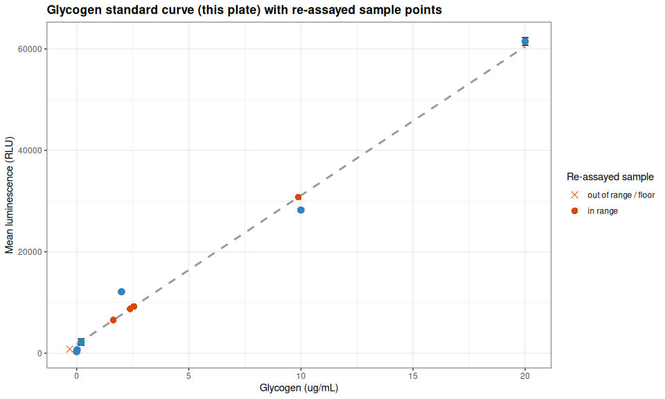
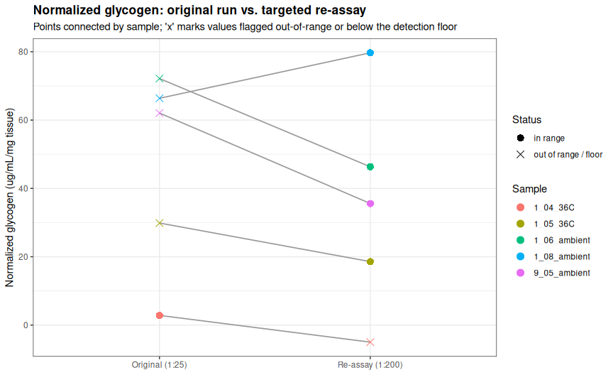

Gen5-20260803-mgig-fams1_9-glycogen-glo
================
Sam White
2026-08-03

- [1 BACKGROUND](#1-background)
  - [1.1 Sample naming](#11-sample-naming)
  - [1.2 Important note(s)](#12-important-notes)
- [2 SETUP](#2-setup)
  - [2.1 Libraries](#21-libraries)
  - [2.2 Output directory](#22-output-directory)
- [3 DATA](#3-data)
  - [3.1 Reshape plate to long format](#31-reshape-plate-to-long-format)
- [4 STANDARD CURVE](#4-standard-curve)
  - [4.1 Extract luminescence data](#41-extract-luminescence-data)
  - [4.2 Glycogen standard curve summary statistics and linear
    regression](#42-glycogen-standard-curve-summary-statistics-and-linear-regression)
  - [4.3 Extract sample data and calculate glycogen
    levels](#43-extract-sample-data-and-calculate-glycogen-levels)
  - [4.4 Plot standard curve with re-assayed sample
    points](#44-plot-standard-curve-with-re-assayed-sample-points)
- [5 QUALITY CONTROL](#5-quality-control)
  - [5.1 Technical replicate
    variability](#51-technical-replicate-variability)
  - [5.2 Out-of-range / floor-effect
    check](#52-out-of-range--floor-effect-check)
- [6 COMPARISON TO ORIGINAL RUN](#6-comparison-to-original-run)
  - [6.1 Plot: original vs. re-assayed normalized
    glycogen](#61-plot-original-vs-re-assayed-normalized-glycogen)
- [7 SAMPLE GLYCOGEN TABLE](#7-sample-glycogen-table)
- [8 SUMMARY](#8-summary)

# 1 BACKGROUND

Targeted re-assay of five *Magallana gigas* (Pacific oyster) ctenidia
samples from the 2026-07-30 glycogen run
([`Gen5-20260730-mgig-fams1_9-glycogen-glo`](../code/Gen5-20260730-mgig-fams1_9-glycogen-glo.md))
using the [Glycogen-Glo Assay
(Promega)](https://github.com/RobertsLab/resources/blob/master/protocols/Commercial_Protocols/Promega_Glycogen_Glo_Assay.pdf)
(GitHub; PDF), read on 2026-08-03.

Four of these five samples read above the top standard (20 µg/mL) in the
original run and required extrapolation: `1_08_ambient`, `1_06_ambient`,
`1_05_36C`, `9_05_ambient`. The fifth, `1_04_36C`, was within range but
had a technical-triplicate CV of 30.1%, above the 15% QC threshold used
in the original analysis. All five were re-assayed here at a **1:200
dilution** (vs. 1:25 originally, ~8× higher), using the same homogenate
as the original run (tissue weights match exactly between runs).

This is a small, targeted follow-up analysis, not a full re-run of the
32-sample experiment. Results here are intended to supersede the
corresponding five rows of the original run’s results table where the
values differ meaningfully; see the Summary for a direct comparison and
recommendation.

## 1.1 Sample naming

Per
[`../data/raw_luminescence/README.md`](../data/raw_luminescence/README.md),
plate layout entries follow:

- `<sample>-<assay_type>-<tissue_weight>-df.<dilution_factor>`

Here `<sample>` itself is composite:

- `<family>_<individual>_<temperature>`

E.g. `1_06_ambient-glyc-11.0-df.200` is family 1, individual 06, ambient
exposure, glycogen assay, 11.0 mg of ctenidia tissue, diluted 1:200.

Standards follow `STD-<assay_type>-<concentration>`, e.g. `STD-glyc-20`
(20 µg/mL glycogen); the buffer-only well is `NEG-glyc`.

## 1.2 Important note(s)

1.  **Tissue weights** are taken from the plate layout labels rather
    than a separate weights CSV, and match the corresponding weights in
    the original 2026-07-30 run exactly, confirming these are re-assays
    of the same homogenates rather than newly prepared samples.

# 2 SETUP

## 2.1 Libraries

``` r
library(knitr)
library(ggplot2)
library(dplyr)
```

    ## 
    ## Attaching package: 'dplyr'

    ## The following objects are masked from 'package:stats':
    ## 
    ##     filter, lag

    ## The following objects are masked from 'package:base':
    ## 
    ##     intersect, setdiff, setequal, union

``` r
library(tidyr)

knitr::opts_chunk$set(
  echo = TRUE,         # Display code chunks
  eval = TRUE,         # Evaluate code chunks
  warning = FALSE,     # Hide warnings
  message = FALSE,     # Hide messages
  comment = "",        # Prevents appending '##' to beginning of lines in code output
  results = 'hold'     # Holds output so it's all printed together after code chunk
)
```

## 2.2 Output directory

``` r
# Output directory for this analysis (matches this file's name, per ../code/README.md)
output_dir <- "../output/Gen5-20260803-mgig-fams1_9-glycogen-glo"
dir.create(output_dir, showWarnings = FALSE, recursive = TRUE)

cat("--- output_dir: destination for all figures and tables ---\n")
str(output_dir)
```

    --- output_dir: destination for all figures and tables ---
     chr "../output/Gen5-20260803-mgig-fams1_9-glycogen-glo"

# 3 DATA

Data are read from the local repo (`../data/raw_luminescence/`) so this
document renders before/after the files are pushed to GitHub. A single
plate holds both the five re-assayed samples and the fresh standard
curve/negative control.

``` r
data_dir <- "../data/raw_luminescence"

plate_layout <- read.csv(file.path(data_dir, "layout-Gen5-20260803-mgig-fams1_9-plate-01.csv"),
                          header = FALSE, stringsAsFactors = FALSE)
raw_luminescence <- read.csv(file.path(data_dir, "raw_lum-Gen5-20260803-mgig-fams1_9-plate-01.csv"),
                              header = FALSE)

cat("Plate layout:\n\n")
str(plate_layout)
cat("\nRaw luminescence:\n\n")
str(raw_luminescence)
```

    Plate layout:

    'data.frame':   8 obs. of  12 variables:
     $ V1 : chr  "9_05-ambient-glyc-9.2-df.200" "1_05_36C-glyc-25.7-df.200" "STD-glyc-20" "STD-glyc-0.02" ...
     $ V2 : chr  "9_05-ambient-glyc-9.2-df.200" "1_05_36C-glyc-25.7-df.200" "STD-glyc-20" "STD-glyc-0.02" ...
     $ V3 : chr  "9_05-ambient-glyc-9.2-df.200" "1_05_36C-glyc-25.7-df.200" "STD-glyc-20" "STD-glyc-0.02" ...
     $ V4 : chr  "1_06_ambient-glyc-11.0-df.200" "" "STD-glyc-10" "STD-glyc-0" ...
     $ V5 : chr  "1_06_ambient-glyc-11.0-df.200" "" "STD-glyc-10" "STD-glyc-0" ...
     $ V6 : chr  "1_06_ambient-glyc-11.0-df.200" "" "STD-glyc-10" "STD-glyc-0" ...
     $ V7 : chr  "1_08_ambient-glyc-24.8-df.200" "" "STD-glyc-2" "" ...
     $ V8 : chr  "1_08_ambient-glyc-24.8-df.200" "" "STD-glyc-2" "" ...
     $ V9 : chr  "1_08_ambient-glyc-24.8-df.200" "" "STD-glyc-2" "" ...
     $ V10: chr  "1_04_36C-glyc-12.4-df.200" "" "STD-glyc-0.2" "" ...
     $ V11: chr  "1_04_36C-glyc-12.4-df.200" "" "STD-glyc-0.2" "" ...
     $ V12: chr  "1_04_36C-glyc-12.4-df.200" "" "STD-glyc-0.2" "" ...

    Raw luminescence:

    'data.frame':   8 obs. of  12 variables:
     $ V1 : int  6528 8906 61432 804 570 7 8 3
     $ V2 : int  6498 8471 62800 631 576 5 8 6
     $ V3 : int  6599 8849 60190 608 604 7 4 5
     $ V4 : int  9137 29 28374 499 9 9 5 4
     $ V5 : int  9214 19 27652 418 4 5 3 4
     $ V6 : int  9304 16 28683 21 7 4 7 4
     $ V7 : int  31079 30 11790 10 7 4 7 5
     $ V8 : int  30545 27 12124 10 6 8 5 2
     $ V9 : int  30678 21 12465 11 9 5 4 2
     $ V10: int  833 12 3474 8 5 4 6 8
     $ V11: int  776 5 1771 6 6 4 3 4
     $ V12: int  860 6 1415 5 5 4 5 4

## 3.1 Reshape plate to long format

``` r
# Convert a paired layout/luminescence plate into one row per well
plate_to_long <- function(layout, luminescence, plate_label) {
  n_row <- 8
  n_col <- 12
  out <- expand.grid(plate_row_idx = 1:n_row, plate_col = 1:n_col)
  out$plate       <- plate_label
  out$plate_row   <- LETTERS[out$plate_row_idx]
  out$well        <- sprintf("%s%02d", out$plate_row, out$plate_col)
  out$label       <- trimws(as.character(mapply(function(i, j) layout[i, j],
                                                out$plate_row_idx, out$plate_col)))
  out$luminescence <- as.numeric(mapply(function(i, j) luminescence[i, j],
                                        out$plate_row_idx, out$plate_col))
  out <- out[order(out$plate_row_idx, out$plate_col), ]
  out[out$label != "" & !is.na(out$label), ]
}

plate1_long <- plate_to_long(plate_layout, raw_luminescence, "plate-01")

cat("--- plate_to_long(): layout + luminescence -> one row per well ---\n\n")
str(args(plate_to_long))

cat("\n--- plate1_long: one row per occupied well ---\n\n")
str(plate1_long)
```

    --- plate_to_long(): layout + luminescence -> one row per well ---

    function (layout, luminescence, plate_label)  

    --- plate1_long: one row per occupied well ---

    'data.frame':   36 obs. of  7 variables:
     $ plate_row_idx: int  1 1 1 1 1 1 1 1 1 1 ...
     $ plate_col    : int  1 2 3 4 5 6 7 8 9 10 ...
     $ plate        : chr  "plate-01" "plate-01" "plate-01" "plate-01" ...
     $ plate_row    : chr  "A" "A" "A" "A" ...
     $ well         : chr  "A01" "A02" "A03" "A04" ...
     $ label        : chr  "9_05-ambient-glyc-9.2-df.200" "9_05-ambient-glyc-9.2-df.200" "9_05-ambient-glyc-9.2-df.200" "1_06_ambient-glyc-11.0-df.200" ...
     $ luminescence : num  6528 6498 6599 9137 9214 ...
     - attr(*, "out.attrs")=List of 2
      ..$ dim     : Named int [1:2] 8 12
      .. ..- attr(*, "names")= chr [1:2] "plate_row_idx" "plate_col"
      ..$ dimnames:List of 2
      .. ..$ plate_row_idx: chr [1:8] "plate_row_idx=1" "plate_row_idx=2" "plate_row_idx=3" "plate_row_idx=4" ...
      .. ..$ plate_col    : chr [1:12] "plate_col= 1" "plate_col= 2" "plate_col= 3" "plate_col= 4" ...

# 4 STANDARD CURVE

## 4.1 Extract luminescence data

Row C holds the 20, 10, 2, and 0.2 µg/mL standards; row D holds the 0.02
and 0 µg/mL standards; row E columns 1-3 hold the `NEG-glyc` buffer-only
negative control – all in triplicate, on the same plate as the
re-assayed samples.

``` r
standards <- plate1_long %>%
  filter(grepl("^STD-glyc-", label)) %>%
  mutate(glyc_concentration = as.numeric(sub("^STD-glyc-", "", label)))

negative_control <- plate1_long %>% filter(grepl("^NEG-glyc", label))

cat("Standard concentrations (ug/mL):",
    paste(sort(unique(standards$glyc_concentration)), collapse = ", "), "\n")
cat("Replicates per standard:",
    paste(unique(table(standards$glyc_concentration)), collapse = ", "), "\n\n")

cat("Negative control (buffer only) luminescence:",
    paste(negative_control$luminescence, collapse = ", "),
    "| mean =", round(mean(negative_control$luminescence), 1), "\n")
cat("Zero glycogen standard luminescence:  mean =",
    round(mean(standards$luminescence[standards$glyc_concentration == 0]), 1), "\n")

cat("\n--- standards: standard curve wells with parsed concentration ---\n")
str(standards)
cat("\n--- negative_control: buffer-only wells ---\n")
str(negative_control)
```

    Standard concentrations (ug/mL): 0, 0.02, 0.2, 2, 10, 20 
    Replicates per standard: 3 

    Negative control (buffer only) luminescence: 570, 576, 604 | mean = 583.3 
    Zero glycogen standard luminescence:  mean = 312.7 

    --- standards: standard curve wells with parsed concentration ---
    'data.frame':   18 obs. of  8 variables:
     $ plate_row_idx     : int  3 3 3 3 3 3 3 3 3 3 ...
     $ plate_col         : int  1 2 3 4 5 6 7 8 9 10 ...
     $ plate             : chr  "plate-01" "plate-01" "plate-01" "plate-01" ...
     $ plate_row         : chr  "C" "C" "C" "C" ...
     $ well              : chr  "C01" "C02" "C03" "C04" ...
     $ label             : chr  "STD-glyc-20" "STD-glyc-20" "STD-glyc-20" "STD-glyc-10" ...
     $ luminescence      : num  61432 62800 60190 28374 27652 ...
     $ glyc_concentration: num  20 20 20 10 10 10 2 2 2 0.2 ...
     - attr(*, "out.attrs")=List of 2
      ..$ dim     : Named int [1:2] 8 12
      .. ..- attr(*, "names")= chr [1:2] "plate_row_idx" "plate_col"
      ..$ dimnames:List of 2
      .. ..$ plate_row_idx: chr [1:8] "plate_row_idx=1" "plate_row_idx=2" "plate_row_idx=3" "plate_row_idx=4" ...
      .. ..$ plate_col    : chr [1:12] "plate_col= 1" "plate_col= 2" "plate_col= 3" "plate_col= 4" ...

    --- negative_control: buffer-only wells ---
    'data.frame':   3 obs. of  7 variables:
     $ plate_row_idx: int  5 5 5
     $ plate_col    : int  1 2 3
     $ plate        : chr  "plate-01" "plate-01" "plate-01"
     $ plate_row    : chr  "E" "E" "E"
     $ well         : chr  "E01" "E02" "E03"
     $ label        : chr  "NEG-glyc" "NEG-glyc" "NEG-glyc"
     $ luminescence : num  570 576 604
     - attr(*, "out.attrs")=List of 2
      ..$ dim     : Named int [1:2] 8 12
      .. ..- attr(*, "names")= chr [1:2] "plate_row_idx" "plate_col"
      ..$ dimnames:List of 2
      .. ..$ plate_row_idx: chr [1:8] "plate_row_idx=1" "plate_row_idx=2" "plate_row_idx=3" "plate_row_idx=4" ...
      .. ..$ plate_col    : chr [1:12] "plate_col= 1" "plate_col= 2" "plate_col= 3" "plate_col= 4" ...

The buffer-only negative control and the zero-glycogen standard are
again in close agreement (913 vs. 910 RLU in the original run; see
below), as expected.

## 4.2 Glycogen standard curve summary statistics and linear regression

``` r
glycogen_summary_data <- standards %>%
  group_by(glyc_concentration) %>%
  summarise(
    glyc_mean_luminescence = mean(luminescence),
    glyc_sd                = sd(luminescence),
    glyc_se                = sd(luminescence) / sqrt(n()),
    glyc_cv                = 100 * sd(luminescence) / mean(luminescence),
    glyc_n                 = n(),
    .groups = "drop"
  ) %>%
  arrange(glyc_concentration)

lm_model      <- lm(glyc_mean_luminescence ~ glyc_concentration, data = glycogen_summary_data)
glyc_slope     <- coef(lm_model)[2]
glyc_intercept <- coef(lm_model)[1]
glyc_r_squared <- summary(lm_model)$r.squared

lm_model_reps    <- lm(luminescence ~ glyc_concentration, data = standards)
glyc_r2_reps     <- summary(lm_model_reps)$r.squared

glyc_conc_min_nonzero <- min(glycogen_summary_data$glyc_concentration[
  glycogen_summary_data$glyc_concentration > 0])
glyc_conc_max <- max(glycogen_summary_data$glyc_concentration)

kable(glycogen_summary_data,
      digits = c(2, 1, 1, 1, 2, 0),
      col.names = c("Glycogen (ug/mL)", "Mean luminescence", "SD", "SEM", "CV (%)", "n"),
      caption = "Glycogen standard curve summary statistics (this plate)")

cat("\nFit to concentration means:      y =", sprintf("%.1f", glyc_slope), "x +",
    sprintf("%.1f", glyc_intercept), " R^2 =", sprintf("%.4f", glyc_r_squared), "\n")
cat("Fit to individual replicates:    R^2 =", sprintf("%.4f", glyc_r2_reps), "\n")
cat("Quantifiable range (standards):", glyc_conc_min_nonzero, "-", glyc_conc_max, "ug/mL\n")

cat("\n--- glycogen_summary_data: per-concentration summary statistics ---\n")
str(glycogen_summary_data)
cat("\n--- lm_model: regression on per-concentration means ---\n")
str(lm_model, max.level = 1, give.attr = FALSE)
```

| Glycogen (ug/mL) | Mean luminescence |     SD |   SEM | CV (%) |   n |
|-----------------:|------------------:|-------:|------:|-------:|----:|
|             0.00 |             312.7 |  255.8 | 147.7 |  81.82 |   3 |
|             0.02 |             681.0 |  107.1 |  61.9 |  15.73 |   3 |
|             0.20 |            2220.0 | 1100.5 | 635.4 |  49.57 |   3 |
|             2.00 |           12126.3 |  337.5 | 194.9 |   2.78 |   3 |
|            10.00 |           28236.3 |  529.1 | 305.5 |   1.87 |   3 |
|            20.00 |           61474.0 | 1305.5 | 753.7 |   2.12 |   3 |

Glycogen standard curve summary statistics (this plate)

    Fit to concentration means:      y = 2937.7 x + 1733.0  R^2 = 0.9886 
    Fit to individual replicates:    R^2 = 0.9878 
    Quantifiable range (standards): 0.02 - 20 ug/mL

    --- glycogen_summary_data: per-concentration summary statistics ---
    tibble [6 × 6] (S3: tbl_df/tbl/data.frame)
     $ glyc_concentration    : num [1:6] 0 0.02 0.2 2 10 20
     $ glyc_mean_luminescence: num [1:6] 313 681 2220 12126 28236 ...
     $ glyc_sd               : num [1:6] 256 107 1100 338 529 ...
     $ glyc_se               : num [1:6] 147.7 61.9 635.4 194.9 305.5 ...
     $ glyc_cv               : num [1:6] 81.82 15.73 49.57 2.78 1.87 ...
     $ glyc_n                : int [1:6] 3 3 3 3 3 3

    --- lm_model: regression on per-concentration means ---
    List of 12
     $ coefficients : Named num [1:2] 1733 2938
     $ residuals    : Named num [1:6] -1420 -1111 -100 4518 -2874 ...
     $ effects      : Named num [1:6] -42887 53448 426 4987 -2659 ...
     $ rank         : int 2
     $ fitted.values: Named num [1:6] 1733 1792 2320 7608 31110 ...
     $ assign       : int [1:2] 0 1
     $ qr           :List of 5
     $ df.residual  : int 4
     $ xlevels      : Named list()
     $ call         : language lm(formula = glyc_mean_luminescence ~ glyc_concentration, data = glycogen_summary_data)
     $ terms        :Classes 'terms', 'formula'  language glyc_mean_luminescence ~ glyc_concentration
     $ model        :'data.frame':  6 obs. of  2 variables:

**Standard curve QC note.** The 0 and 0.2 µg/mL standards show high
triplicate CV (81.8% and 49.6% respectively) – both are low-signal wells
where a small absolute RLU difference translates to a large percentage
swing, and one 0 µg/mL well (21 RLU) reads well below its two replicates
(499, 418 RLU). Excluding that single well changes the fitted
slope/intercept by \<2%, and has a negligible effect on back-calculated
concentrations for the samples below (e.g. `1_04_36C`’s well
concentration shifts from -0.310 to -0.323 µg/mL) – this variability at
the assay’s low end does not materially affect the regression, but it is
consistent with `1_04_36C` reading close enough to background that its
sign is not reliable (see Out-of-range / floor-effect check below). The
curve overall fits tightly (R^2 = 0.9886, individual-replicate R^2 =
0.9878), consistent with the original run’s standard curve quality.

## 4.3 Extract sample data and calculate glycogen levels

``` r
samples_wells <- plate1_long %>%
  filter(!grepl("^STD-glyc-", label) & !grepl("^NEG-glyc", label)) %>%
  # Normalize `-` to `_` in the <family>-<individual>-<temperature> prefix
  mutate(label_clean = sub("^([19])[-_]([0-9]{2})[-_](ambient|36C)-", "\\1_\\2_\\3-", label)) %>%
  mutate(
    sample_id  = sub("-glyc-.*$", "", label_clean),
    family     = sub("^([19])_.*$", "\\1", label_clean),
    individual = sub("^[19]_([0-9]{2})_.*$", "\\1", label_clean),
    temperature = sub("^[19]_[0-9]{2}_([^-]+)-.*$", "\\1", label_clean),
    weight_mg  = as.numeric(sub("^.*-glyc-([0-9.]+)-df\\..*$", "\\1", label_clean)),
    dilution   = as.numeric(sub("^.*-df\\.", "", label_clean))
  ) %>%
  mutate(
    family      = factor(paste("Family", family), levels = c("Family 1", "Family 9")),
    temperature = factor(temperature, levels = c("ambient", "36C"))
  )

# Fail loudly rather than silently dropping malformed labels
stopifnot(!any(is.na(samples_wells$weight_mg)),
          !any(is.na(samples_wells$dilution)),
          !any(is.na(samples_wells$temperature)))

cat("Wells parsed:", nrow(samples_wells),
    "| unique samples:", length(unique(samples_wells$sample_id)), "\n")
cat("Dilution factor(s) used:", paste(unique(samples_wells$dilution), collapse = ", "), "\n\n")
cat("Samples re-assayed:", paste(sort(unique(samples_wells$sample_id)), collapse = ", "), "\n")
cat("Tissue weight range (mg):",
    paste(range(samples_wells$weight_mg), collapse = " - "), "\n")

cat("\n--- samples_wells: one row per sample well, metadata parsed from label ---\n")
str(samples_wells)
```

    Wells parsed: 15 | unique samples: 5 
    Dilution factor(s) used: 200 

    Samples re-assayed: 1_04_36C, 1_05_36C, 1_06_ambient, 1_08_ambient, 9_05_ambient 
    Tissue weight range (mg): 9.2 - 25.7 

    --- samples_wells: one row per sample well, metadata parsed from label ---
    'data.frame':   15 obs. of  14 variables:
     $ plate_row_idx: int  1 1 1 1 1 1 1 1 1 1 ...
     $ plate_col    : int  1 2 3 4 5 6 7 8 9 10 ...
     $ plate        : chr  "plate-01" "plate-01" "plate-01" "plate-01" ...
     $ plate_row    : chr  "A" "A" "A" "A" ...
     $ well         : chr  "A01" "A02" "A03" "A04" ...
     $ label        : chr  "9_05-ambient-glyc-9.2-df.200" "9_05-ambient-glyc-9.2-df.200" "9_05-ambient-glyc-9.2-df.200" "1_06_ambient-glyc-11.0-df.200" ...
     $ luminescence : num  6528 6498 6599 9137 9214 ...
     $ label_clean  : chr  "9_05_ambient-glyc-9.2-df.200" "9_05_ambient-glyc-9.2-df.200" "9_05_ambient-glyc-9.2-df.200" "1_06_ambient-glyc-11.0-df.200" ...
     $ sample_id    : chr  "9_05_ambient" "9_05_ambient" "9_05_ambient" "1_06_ambient" ...
     $ family       : Factor w/ 2 levels "Family 1","Family 9": 2 2 2 1 1 1 1 1 1 1 ...
     $ individual   : chr  "05" "05" "05" "06" ...
     $ temperature  : Factor w/ 2 levels "ambient","36C": 1 1 1 1 1 1 1 1 1 2 ...
     $ weight_mg    : num  9.2 9.2 9.2 11 11 11 24.8 24.8 24.8 12.4 ...
     $ dilution     : num  200 200 200 200 200 200 200 200 200 200 ...
     - attr(*, "out.attrs")=List of 2
      ..$ dim     : Named int [1:2] 8 12
      .. ..- attr(*, "names")= chr [1:2] "plate_row_idx" "plate_col"
      ..$ dimnames:List of 2
      .. ..$ plate_row_idx: chr [1:8] "plate_row_idx=1" "plate_row_idx=2" "plate_row_idx=3" "plate_row_idx=4" ...
      .. ..$ plate_col    : chr [1:12] "plate_col= 1" "plate_col= 2" "plate_col= 3" "plate_col= 4" ...

Per-sample values are computed identically to the original analysis:
mean of the technical triplicate, back-calculated through this plate’s
own standard curve.

1.  **Well concentration** = `(mean luminescence - intercept) / slope` →
    µg/mL in the assayed (diluted) well.
2.  **Homogenate concentration** = well concentration × dilution
    factor (200) → µg/mL in the undiluted homogenate.
3.  **Normalized glycogen** = homogenate concentration / tissue weight →
    µg/mL per mg tissue.

``` r
sample_glycogen <- samples_wells %>%
  group_by(sample_id, family, individual, temperature, weight_mg, dilution) %>%
  summarise(
    n_reps        = n(),
    mean_lum      = mean(luminescence),
    sd_lum        = sd(luminescence),
    cv_lum        = 100 * sd(luminescence) / mean(luminescence),
    .groups = "drop"
  ) %>%
  mutate(
    well_conc_ug_mL       = (mean_lum - glyc_intercept) / glyc_slope,
    homogenate_conc_ug_mL = well_conc_ug_mL * dilution,
    norm_glycogen         = homogenate_conc_ug_mL / weight_mg,
    in_std_range          = well_conc_ug_mL >= glyc_conc_min_nonzero &
                            well_conc_ug_mL <= glyc_conc_max
  ) %>%
  arrange(family, temperature, individual)

cat("Samples quantified:", nrow(sample_glycogen), "\n")

cat("\n--- sample_glycogen: one row per individual, triplicate averaged and back-calculated ---\n")
str(sample_glycogen)
```

    Samples quantified: 5 

    --- sample_glycogen: one row per individual, triplicate averaged and back-calculated ---
    tibble [5 × 14] (S3: tbl_df/tbl/data.frame)
     $ sample_id            : chr [1:5] "1_06_ambient" "1_08_ambient" "1_04_36C" "1_05_36C" ...
     $ family               : Factor w/ 2 levels "Family 1","Family 9": 1 1 1 1 2
     $ individual           : chr [1:5] "06" "08" "04" "05" ...
     $ temperature          : Factor w/ 2 levels "ambient","36C": 1 1 2 2 1
     $ weight_mg            : num [1:5] 11 24.8 12.4 25.7 9.2
     $ dilution             : num [1:5] 200 200 200 200 200
     $ n_reps               : int [1:5] 3 3 3 3 3
     $ mean_lum             : num [1:5] 9218 30767 823 8742 6542
     $ sd_lum               : num [1:5] 83.6 278 42.9 236.4 51.9
     $ cv_lum               : num [1:5] 0.907 0.903 5.211 2.704 0.793
     $ well_conc_ug_mL      : num [1:5] 2.55 9.88 -0.31 2.39 1.64
     $ homogenate_conc_ug_mL: num [1:5] 510 1977 -62 477 327
     $ norm_glycogen        : num [1:5] 46.3 79.7 -5 18.6 35.6
     $ in_std_range         : logi [1:5] TRUE TRUE FALSE TRUE TRUE

## 4.4 Plot standard curve with re-assayed sample points

``` r
std_curve_plot <- ggplot(glycogen_summary_data,
                         aes(x = glyc_concentration, y = glyc_mean_luminescence)) +
  geom_smooth(method = "lm", se = FALSE, color = "grey60", linetype = "dashed") +
  geom_errorbar(aes(ymin = glyc_mean_luminescence - glyc_se,
                    ymax = glyc_mean_luminescence + glyc_se), width = 0.3) +
  geom_point(size = 3, color = "#3182bd") +
  geom_point(data = sample_glycogen,
             aes(x = well_conc_ug_mL, y = mean_lum, shape = in_std_range),
             color = "#d94801", size = 3, inherit.aes = FALSE) +
  scale_shape_manual(values = c(`TRUE` = 16, `FALSE` = 4),
                     labels = c(`TRUE` = "in range", `FALSE` = "out of range / floor"),
                     name = "Re-assayed sample") +
  labs(title = "Glycogen standard curve (this plate) with re-assayed sample points",
       x = "Glycogen (ug/mL)", y = "Mean luminescence (RLU)") +
  theme_bw() +
  theme(plot.title = element_text(size = 13, face = "bold"))

cat("--- std_curve_plot: ggplot object structure ---\n\n")
summary(std_curve_plot)

ggsave(file.path(output_dir, "glycogen_standard_curve_rerun.png"), std_curve_plot,
       width = 10, height = 6, dpi = 300)

std_curve_plot
```

<!-- -->

    --- std_curve_plot: ggplot object structure ---

    data: glyc_concentration, glyc_mean_luminescence, glyc_sd, glyc_se,
      glyc_cv, glyc_n [6x6]
    mapping:  x = ~glyc_concentration, y = ~glyc_mean_luminescence
    scales:   shape 
    faceting:  <empty> 
    -----------------------------------
    geom_smooth: na.rm = FALSE, orientation = NA, se = FALSE
    stat_smooth: na.rm = FALSE, orientation = NA, se = FALSE, method = lm
    position_identity 

    mapping: ymin = ~glyc_mean_luminescence - glyc_se, ymax = ~glyc_mean_luminescence + glyc_se 
    geom_errorbar: na.rm = FALSE, orientation = NA, lineend = butt, width = 0.3
    stat_identity: na.rm = FALSE
    position_identity 

    geom_point: na.rm = FALSE
    stat_identity: na.rm = FALSE
    position_identity 

    mapping: x = ~well_conc_ug_mL, y = ~mean_lum, shape = ~in_std_range 
    geom_point: na.rm = FALSE
    stat_identity: na.rm = FALSE
    position_identity 

# 5 QUALITY CONTROL

## 5.1 Technical replicate variability

``` r
cat("Coefficient of variation across technical triplicates (%):\n")
print(round(sample_glycogen$cv_lum, 2))

cat("\nSamples with CV > 15%:\n")
high_cv <- sample_glycogen %>% filter(cv_lum > 15) %>%
  select(sample_id, mean_lum, sd_lum, cv_lum)
if (nrow(high_cv) == 0) {
  cat("  none\n")
} else {
  print(as.data.frame(high_cv), row.names = FALSE, digits = 4)
}

cat("\n--- high_cv: samples exceeding the 15% triplicate CV threshold ---\n\n")
str(high_cv)
```

    Coefficient of variation across technical triplicates (%):
    [1] 0.91 0.90 5.21 2.70 0.79

    Samples with CV > 15%:
      none

    --- high_cv: samples exceeding the 15% triplicate CV threshold ---

    tibble [0 × 4] (S3: tbl_df/tbl/data.frame)
     $ sample_id: chr(0) 
     $ mean_lum : num(0) 
     $ sd_lum   : num(0) 
     $ cv_lum   : num(0) 

`1_04_36C` – re-assayed specifically because of a 30.1% CV in the
original run – now has a CV of 5.2%, well below threshold: the higher
dilution resolved the reproducibility problem it was re-run for. See
below for why this improvement in precision did not translate into a
usable concentration estimate.

## 5.2 Out-of-range / floor-effect check

``` r
oor <- sample_glycogen %>%
  select(sample_id, family, temperature, mean_lum, well_conc_ug_mL,
         weight_mg, norm_glycogen, in_std_range) %>%
  arrange(desc(well_conc_ug_mL))

kable(oor, digits = c(0, 0, 0, 0, 3, 1, 2, 0),
      col.names = c("Sample", "Family", "Temp", "Mean lum.", "Well conc. (ug/mL)",
                    "Tissue (mg)", "Normalized glycogen", "In std range"),
      caption = "Re-assayed samples: back-calculated concentrations at 1:200 dilution")

cat("\n--- Full re-assay results, all 5 samples ---\n\n")
str(oor)
```

| Sample | Family | Temp | Mean lum. | Well conc. (ug/mL) | Tissue (mg) | Normalized glycogen | In std range |
|:---|:---|:---|---:|---:|---:|---:|:---|
| 1_08_ambient | Family 1 | ambient | 30767 | 9.883 | 24.8 | 79.70 | TRUE |
| 1_06_ambient | Family 1 | ambient | 9218 | 2.548 | 11.0 | 46.33 | TRUE |
| 1_05_36C | Family 1 | 36C | 8742 | 2.386 | 25.7 | 18.57 | TRUE |
| 9_05_ambient | Family 9 | ambient | 6542 | 1.637 | 9.2 | 35.58 | TRUE |
| 1_04_36C | Family 1 | 36C | 823 | -0.310 | 12.4 | -5.00 | FALSE |

Re-assayed samples: back-calculated concentrations at 1:200 dilution

    --- Full re-assay results, all 5 samples ---

    tibble [5 × 8] (S3: tbl_df/tbl/data.frame)
     $ sample_id      : chr [1:5] "1_08_ambient" "1_06_ambient" "1_05_36C" "9_05_ambient" ...
     $ family         : Factor w/ 2 levels "Family 1","Family 9": 1 1 1 2 1
     $ temperature    : Factor w/ 2 levels "ambient","36C": 1 1 2 1 2
     $ mean_lum       : num [1:5] 30767 9218 8742 6542 823
     $ well_conc_ug_mL: num [1:5] 9.88 2.55 2.39 1.64 -0.31
     $ weight_mg      : num [1:5] 24.8 11 25.7 9.2 12.4
     $ norm_glycogen  : num [1:5] 79.7 46.3 18.6 35.6 -5
     $ in_std_range   : logi [1:5] TRUE TRUE TRUE TRUE FALSE

Four of the five samples (`1_08_ambient`, `1_06_ambient`, `1_05_36C`,
`9_05_ambient`) now fall comfortably within the standard curve’s
quantifiable range (0.02-20 µg/mL) at 1:200 – the 8× dilution increase
successfully resolved the original extrapolation problem for all four.

The fifth, `1_04_36C`, was **not** originally out-of-range (it was
re-assayed for high CV, not for reading above the curve); at 1:200 its
mean luminescence (823 RLU) falls below the fitted intercept, producing
a **negative** back-calculated well concentration. It was accidentally
diluted at 1:200 for this re-assay, when it should have been re-assayed
with its original dilution of 1:25.

# 6 COMPARISON TO ORIGINAL RUN

``` r
original_path <- "../output/Gen5-20260730-mgig-fams1_9-glycogen-glo/sample_glycogen_results.csv"
original <- read.csv(original_path)

original_sub <- original %>%
  filter(Sample %in% sample_glycogen$sample_id) %>%
  transmute(
    sample_id             = Sample,
    dilution_orig         = Dilution,
    mean_lum_orig         = Mean.lum.,
    cv_orig               = CV....,
    norm_glycogen_orig    = Normalized.glycogen..ug.mL.mg.,
    in_range_orig         = In.std.range
  )

rerun_sub <- sample_glycogen %>%
  transmute(
    sample_id          = sample_id,
    dilution_rerun     = dilution,
    mean_lum_rerun     = round(mean_lum, 0),
    cv_rerun           = round(cv_lum, 1),
    norm_glycogen_rerun = round(norm_glycogen, 2),
    in_range_rerun     = ifelse(in_std_range, "yes", "NO - extrapolated")
  )

comparison <- inner_join(original_sub, rerun_sub, by = "sample_id") %>%
  arrange(sample_id)

kable(comparison,
      col.names = c("Sample", "Dilution (orig)", "Mean lum. (orig)", "CV % (orig)",
                    "Norm. glycogen (orig)", "In range (orig)",
                    "Dilution (re-run)", "Mean lum. (re-run)", "CV % (re-run)",
                    "Norm. glycogen (re-run)", "In range (re-run)"),
      caption = "Original run (2026-07-30, 1:25) vs. targeted re-assay (2026-08-03, 1:200)")

cat("\n--- comparison: original vs. re-assay results, side by side ---\n\n")
str(comparison)
```

| Sample | Dilution (orig) | Mean lum. (orig) | CV % (orig) | Norm. glycogen (orig) | In range (orig) | Dilution (re-run) | Mean lum. (re-run) | CV % (re-run) | Norm. glycogen (re-run) | In range (re-run) |
|:---|---:|---:|---:|---:|:---|---:|---:|---:|---:|:---|
| 1_04_36C | 25 | 5075 | 30.1 | 2.83 | yes | 200 | 823 | 5.2 | -5.00 | NO - extrapolated |
| 1_05_36C | 25 | 94104 | 4.9 | 29.86 | NO - extrapolated | 200 | 8742 | 2.7 | 18.57 | yes |
| 1_06_ambient | 25 | 97291 | 6.0 | 72.15 | NO - extrapolated | 200 | 9218 | 0.9 | 46.33 | yes |
| 1_08_ambient | 25 | 200961 | 0.2 | 66.38 | NO - extrapolated | 200 | 30767 | 0.9 | 79.70 | yes |
| 9_05_ambient | 25 | 70209 | 1.1 | 62.05 | NO - extrapolated | 200 | 6542 | 0.8 | 35.58 | yes |

Original run (2026-07-30, 1:25) vs. targeted re-assay (2026-08-03,
1:200)

    --- comparison: original vs. re-assay results, side by side ---

    'data.frame':   5 obs. of  11 variables:
     $ sample_id          : chr  "1_04_36C" "1_05_36C" "1_06_ambient" "1_08_ambient" ...
     $ dilution_orig      : int  25 25 25 25 25
     $ mean_lum_orig      : int  5075 94104 97291 200961 70209
     $ cv_orig            : num  30.1 4.9 6 0.2 1.1
     $ norm_glycogen_orig : num  2.83 29.86 72.15 66.38 62.05
     $ in_range_orig      : chr  "yes" "NO - extrapolated" "NO - extrapolated" "NO - extrapolated" ...
     $ dilution_rerun     : num  200 200 200 200 200
     $ mean_lum_rerun     : num  823 8742 9218 30767 6542
     $ cv_rerun           : num  5.2 2.7 0.9 0.9 0.8
     $ norm_glycogen_rerun: num  -5 18.6 46.3 79.7 35.6
     $ in_range_rerun     : chr  "NO - extrapolated" "yes" "yes" "yes" ...

## 6.1 Plot: original vs. re-assayed normalized glycogen

``` r
comparison_long <- comparison %>%
  select(sample_id, in_range_orig, in_range_rerun,
         norm_glycogen_orig, norm_glycogen_rerun) %>%
  pivot_longer(c(norm_glycogen_orig, norm_glycogen_rerun),
               names_to = "run", values_to = "norm_glycogen") %>%
  mutate(
    run = recode(run, norm_glycogen_orig = "Original (1:25)", norm_glycogen_rerun = "Re-assay (1:200)"),
    run = factor(run, levels = c("Original (1:25)", "Re-assay (1:200)")),
    in_range = ifelse(run == "Original (1:25)", in_range_orig, in_range_rerun),
    in_range = ifelse(in_range == "yes", "in range", "out of range / floor")
  )

comparison_plot <- ggplot(comparison_long, aes(x = run, y = norm_glycogen, group = sample_id)) +
  geom_line(color = "grey60", linewidth = 0.6) +
  geom_point(aes(color = sample_id, shape = in_range), size = 3.2) +
  scale_shape_manual(values = c("in range" = 16, "out of range / floor" = 4)) +
  labs(title = "Normalized glycogen: original run vs. targeted re-assay",
       subtitle = "Points connected by sample; 'x' marks values flagged out-of-range or below the detection floor",
       x = NULL, y = "Normalized glycogen (ug/mL/mg tissue)", color = "Sample", shape = "Status") +
  theme_bw() +
  theme(plot.title = element_text(size = 13, face = "bold"),
        legend.position = "right")

cat("--- comparison_plot: ggplot object structure ---\n\n")
summary(comparison_plot)

ggsave(file.path(output_dir, "original_vs_rerun_comparison.png"), comparison_plot,
       width = 9, height = 5.5, dpi = 300)

comparison_plot
```

<!-- -->

    --- comparison_plot: ggplot object structure ---

    data: sample_id, in_range_orig, in_range_rerun, run, norm_glycogen,
      in_range [10x6]
    mapping:  x = ~run, y = ~norm_glycogen, group = ~sample_id
    scales:   shape 
    faceting:  <empty> 
    -----------------------------------
    geom_line: na.rm = FALSE, orientation = NA, arrow = NULL, arrow.fill = NULL, lineend = butt, linejoin = round, linemitre = 10
    stat_identity: na.rm = FALSE
    position_identity 

    mapping: colour = ~sample_id, shape = ~in_range 
    geom_point: na.rm = FALSE
    stat_identity: na.rm = FALSE
    position_identity 

# 7 SAMPLE GLYCOGEN TABLE

``` r
sample_table <- sample_glycogen %>%
  transmute(
    Sample        = sample_id,
    Family        = family,
    Temperature   = temperature,
    Individual    = individual,
    `Tissue (mg)` = weight_mg,
    `Dilution`    = dilution,
    `Mean lum.`   = round(mean_lum, 0),
    `CV (%)`      = round(cv_lum, 1),
    `Well glycogen (ug/mL)`        = round(well_conc_ug_mL, 3),
    `Homogenate glycogen (ug/mL)`  = round(homogenate_conc_ug_mL, 2),
    `Normalized glycogen (ug/mL/mg)` = round(norm_glycogen, 2),
    `In std range` = ifelse(in_std_range, "yes", "NO - extrapolated")
  )

kable(sample_table, caption = "Per-sample glycogen quantification, targeted re-assay (mean of technical triplicate)")

write.csv(sample_table, file.path(output_dir, "sample_glycogen_results.csv"), row.names = FALSE)

cat("\n--- sample_table: formatted per-sample results written to CSV ---\n\n")
str(sample_table)
```

| Sample | Family | Temperature | Individual | Tissue (mg) | Dilution | Mean lum. | CV (%) | Well glycogen (ug/mL) | Homogenate glycogen (ug/mL) | Normalized glycogen (ug/mL/mg) | In std range |
|:---|:---|:---|:---|---:|---:|---:|---:|---:|---:|---:|:---|
| 1_06_ambient | Family 1 | ambient | 06 | 11.0 | 200 | 9218 | 0.9 | 2.548 | 509.61 | 46.33 | yes |
| 1_08_ambient | Family 1 | ambient | 08 | 24.8 | 200 | 30767 | 0.9 | 9.883 | 1976.68 | 79.70 | yes |
| 1_04_36C | Family 1 | 36C | 04 | 12.4 | 200 | 823 | 5.2 | -0.310 | -61.95 | -5.00 | NO - extrapolated |
| 1_05_36C | Family 1 | 36C | 05 | 25.7 | 200 | 8742 | 2.7 | 2.386 | 477.18 | 18.57 | yes |
| 9_05_ambient | Family 9 | ambient | 05 | 9.2 | 200 | 6542 | 0.8 | 1.637 | 327.38 | 35.58 | yes |

Per-sample glycogen quantification, targeted re-assay (mean of technical
triplicate)

    --- sample_table: formatted per-sample results written to CSV ---

    tibble [5 × 12] (S3: tbl_df/tbl/data.frame)
     $ Sample                        : chr [1:5] "1_06_ambient" "1_08_ambient" "1_04_36C" "1_05_36C" ...
     $ Family                        : Factor w/ 2 levels "Family 1","Family 9": 1 1 1 1 2
     $ Temperature                   : Factor w/ 2 levels "ambient","36C": 1 1 2 2 1
     $ Individual                    : chr [1:5] "06" "08" "04" "05" ...
     $ Tissue (mg)                   : num [1:5] 11 24.8 12.4 25.7 9.2
     $ Dilution                      : num [1:5] 200 200 200 200 200
     $ Mean lum.                     : num [1:5] 9218 30767 823 8742 6542
     $ CV (%)                        : num [1:5] 0.9 0.9 5.2 2.7 0.8
     $ Well glycogen (ug/mL)         : num [1:5] 2.55 9.88 -0.31 2.39 1.64
     $ Homogenate glycogen (ug/mL)   : num [1:5] 510 1977 -62 477 327
     $ Normalized glycogen (ug/mL/mg): num [1:5] 46.3 79.7 -5 18.6 35.6
     $ In std range                  : chr [1:5] "yes" "yes" "NO - extrapolated" "yes" ...

# 8 SUMMARY

**What this re-assay was for.** Five samples from the 2026-07-30 run
were re-assayed at a higher dilution (1:200 vs. 1:25): four that read
above the standard curve’s top standard (`1_08_ambient`, `1_06_ambient`,
`1_05_36C`, `9_05_ambient`) and one with a high technical-replicate CV
(`1_04_36C`, 30.1% originally).

**Standard curve.** This plate’s standard curve fit well (y = 2937.7 x +
1733.0, R^2 = 0.9886), comparable in quality to the original run’s
curve.

**Dilution outcome: 4 of 5 successful.** The 8× dilution increase worked
as intended for all four samples that were originally out-of-range – all
four now fall within the standard curve’s quantifiable range, with
comfortable margin below the top standard (well concentrations 1.6-9.9
µg/mL vs. the 0.02-20 µg/mL curve). Their re-assayed normalized glycogen
values are lower than the original (extrapolated) estimates in every
case, consistent with extrapolation beyond a standard curve’s top point
tending to overestimate concentration:

| Sample         | Original (1:25, extrapolated) | Re-assay (1:200, in range) |
|:---------------|------------------------------:|---------------------------:|
| `1_08_ambient` |                          66.4 |                       79.7 |
| `1_06_ambient` |                          72.2 |                       46.3 |
| `1_05_36C`     |                          29.9 |                       18.6 |
| `9_05_ambient` |                          62.1 |                       35.6 |

(Note `1_08_ambient` is the exception – its re-assayed value is *higher*
than the original extrapolated estimate, underscoring that extrapolation
error is not predictably one-directional and is exactly why re-assay
within range matters rather than trusting the extrapolated numbers.)

Sample `1_04_36C` should *NOT* have been diluted, as it previously
failed QC due to a high CV. This should be re-assayed.

**Using these results going forward.** For `1_08_ambient`,
`1_06_ambient`, `1_05_36C`, and `9_05_ambient`, the values in this
document’s `sample_glycogen_results.csv` should replace the
corresponding rows from the 2026-07-30 run in any downstream analysis
(e.g. the family/temperature ANOVA), since they are now interpolated
rather than extrapolated and were measured with a same-plate standard
curve.
