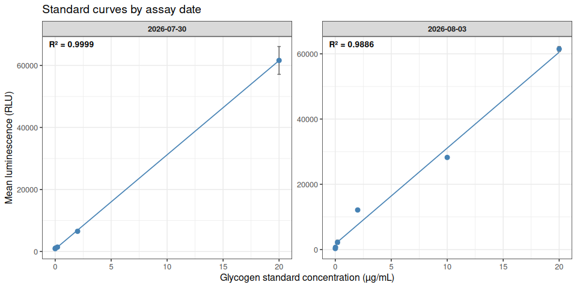
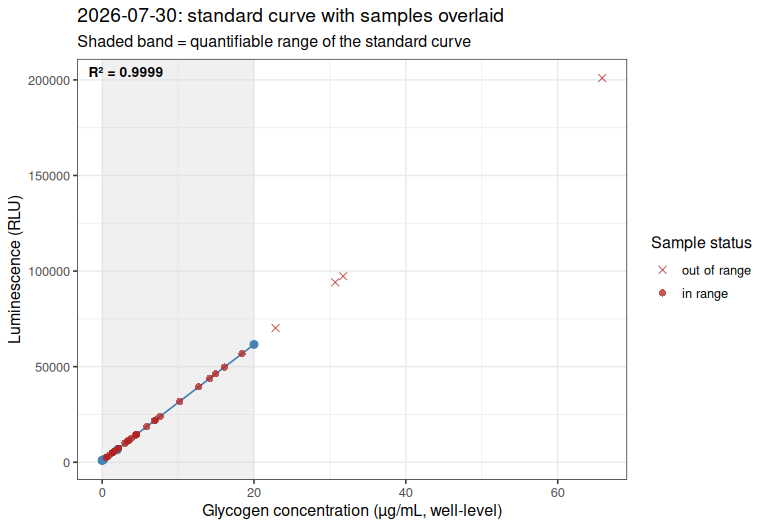
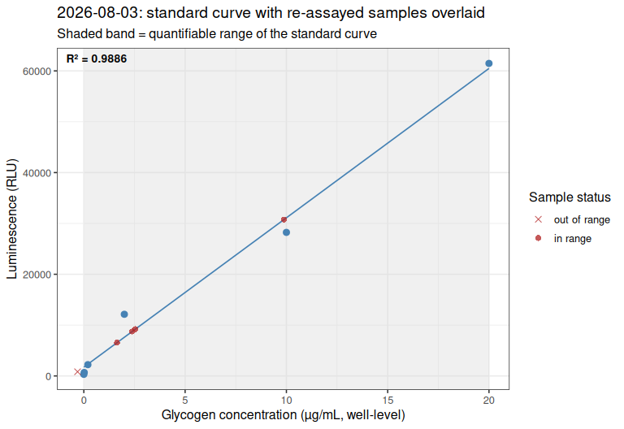
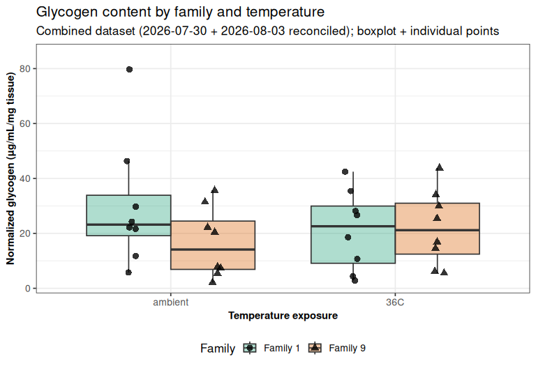
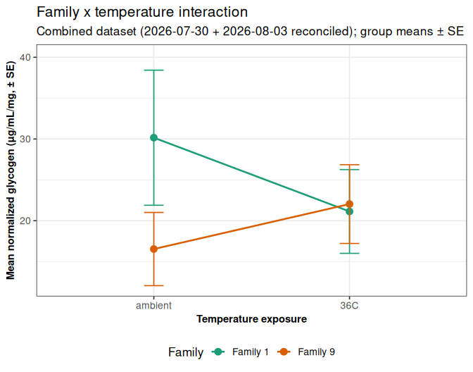

Gen5-20260804-mgig-fams1_9-glycogen-glo-combined
================
Sam White
2026-08-04

- [1 BACKGROUND](#1-background)
  - [1.1 Sample naming](#11-sample-naming)
- [2 SETUP](#2-setup)
  - [2.1 Libraries](#21-libraries)
  - [2.2 Set output directory](#22-set-output-directory)
- [3 DATA IMPORT](#3-data-import)
- [4 PLATE RESHAPING](#4-plate-reshaping)
- [5 STANDARD CURVES](#5-standard-curves)
  - [5.1 Plot standard curves](#51-plot-standard-curves)
- [6 SAMPLE LABEL PARSING](#6-sample-label-parsing)
- [7 PER-SAMPLE GLYCOGEN
  QUANTIFICATION](#7-per-sample-glycogen-quantification)
- [8 COEFFICIENT OF VARIATION (CV)
  CHECK](#8-coefficient-of-variation-cv-check)
- [9 STANDARD CURVES WITH SAMPLES
  OVERLAID](#9-standard-curves-with-samples-overlaid)
  - [9.1 Plot 20260730 Standard Curves with
    Samples](#91-plot-20260730-standard-curves-with-samples)
  - [9.2 Plot 20260803 Standard Curves with
    Samples](#92-plot-20260803-standard-curves-with-samples)
- [10 MERGING RUNS INTO A SINGLE FINAL
  DATASET](#10-merging-runs-into-a-single-final-dataset)
  - [10.1 Excluding out-of-range samples from statistical
    comparisons](#101-excluding-out-of-range-samples-from-statistical-comparisons)
- [11 RESULTS TABLE](#11-results-table)
- [12 GROUP SUMMARY STATISTICS](#12-group-summary-statistics)
- [13 STATISTICAL ANALYSIS](#13-statistical-analysis)
  - [13.1 Two-way ANOVA (family x
    temperature)](#131-two-way-anova-family-x-temperature)
  - [13.2 Overall family and temperature comparisons (Wilcoxon
    rank-sum)](#132-overall-family-and-temperature-comparisons-wilcoxon-rank-sum)
  - [13.3 Reusable significance-annotation
    helpers](#133-reusable-significance-annotation-helpers)
  - [13.4 Within-family temperature comparisons, and within-temperature
    family
    comparisons](#134-within-family-temperature-comparisons-and-within-temperature-family-comparisons)
- [14 EXPLORATORY DISTRIBUTION PLOT](#14-exploratory-distribution-plot)
- [15 FAMILY x TEMPERATURE
  INTERACTION](#15-family-x-temperature-interaction)
- [16 SUMMARY](#16-summary)

# 1 BACKGROUND

Combined glycogen analysis of *Magallana gigas* (Pacific oyster)
ctenidia samples from USDA families 1 and 9, comparing ambient vs. 36°C
temperature exposure, using the [Glycogen-Glo Assay
(Promega)](https://github.com/RobertsLab/resources/blob/master/protocols/Commercial_Protocols/Promega_Glycogen_Glo_Assay.pdf)
(GitHub; PDF).

This document merges results from two assay dates:

- **2026-07-30**
  ([`Gen5-20260730-mgig-fams1_9-glycogen-glo`](Gen5-20260730-mgig-fams1_9-glycogen-glo.md)):
  the full 32-sample experiment (all family × temperature combinations),
  samples run at 1:25 dilution on one plate, standard curve + negative
  control run on a separate plate.

- **2026-08-03**
  ([`Gen5-20260803-mgig-fams1_9-glycogen-glo`](Gen5-20260803-mgig-fams1_9-glycogen-glo.md)):
  a targeted re-assay of 5 samples at 1:200 dilution (~8× higher), run
  alongside a fresh, same-plate standard curve. Four of these five
  (`1_08_ambient`, `1_06_ambient`, `1_05_36C`, `9_05_ambient`) had read
  above the top standard (20 µg/mL) in the original run and required
  extrapolation; the fifth (`1_04_36C`) was in range originally but had
  an elevated technical-replicate CV (30.1%).

**Reconciliation rule applied here:** for each of the 32 samples, this
document selects **whichever available measurement falls within its own
run’s standard-curve range** (interpolated rather than extrapolated),
preferring the more recent run as a tiebreaker if more than one
candidate qualifies. In practice this means:

- `1_08_ambient`, `1_06_ambient`, `1_05_36C`, `9_05_ambient`: the
  **2026-08-03 (1:200)** value is used, since it is in-range and the
  2026-07-30 value was extrapolated.
- `1_04_36C`: the **2026-07-30 (1:25)** value is used per instruction –
  its 2026-08-03 (1:200) re-assay read below the standard curve’s floor
  (negative back-calculated concentration, unusable), so the original
  in-range-but-high-CV value is retained here rather than the unusable
  re-assay value.
- All other 28 samples: only the 2026-07-30 value exists and is used
  as-is.

Full detail on the re-assay rationale, the standard-curve QC checks, and
the outlier/replicate-exclusion analysis for `1_04_36C` (a Grubbs test
found no statistical basis for dropping a replicate, and a general
“exclude any replicate outside 1 SD of the triplicate mean” rule was
tested and rejected as a mathematical inevitability for n=3, not a
data-quality signal) are documented in the two source analyses linked
above and are not repeated here.

## 1.1 Sample naming

Per
[`../data/raw_luminescence/README.md`](../data/raw_luminescence/README.md),
plate layout entries follow
`<sample>-<assay_type>-<tissue_weight>-df.<dilution_factor>`, with
sample tokens formatted as `<family>_<individual>_<temperature>`, e.g.
`1_06_ambient-glyc-11.0-df.25`. Standards are labeled
`STD-glyc-<concentration>` and the negative (buffer-only) control
`NEG-glyc`.

# 2 SETUP

## 2.1 Libraries

``` r
library(knitr)
library(ggplot2)
library(dplyr)
```

    ## 
    ## Attaching package: 'dplyr'

    ## The following objects are masked from 'package:stats':
    ## 
    ##     filter, lag

    ## The following objects are masked from 'package:base':
    ## 
    ##     intersect, setdiff, setequal, union

``` r
library(tidyr)

knitr::opts_chunk$set(
  echo = TRUE,         # Display code chunks
  eval = TRUE,         # Evaluate code chunks
  warning = FALSE,     # Hide warnings
  message = FALSE,     # Hide messages
  comment = "",        # Prevents appending '##' to beginning of lines in code output
  results = 'hold'     # Holds output so it's all printed together after code chunk
)
```

## 2.2 Set output directory

``` r
output_dir <- "../output/Gen5-20260804-mgig-fams1_9-glycogen-glo-combined"
dir.create(output_dir, showWarnings = FALSE, recursive = TRUE)
```

# 3 DATA IMPORT

Raw plate-reader exports (comma-separated, no header, one row per plate
row `A`-`H` and one column per plate column `1`-`12`) are read
separately for each plate, for both assay dates.

``` r
data_dir <- "../data/raw_luminescence"

# 2026-07-30: plate-01 (32 samples, triplicate wells), plate-02 (standard curve + neg. control)
layout_0730_plate01 <- read.csv(file.path(data_dir, "layout-Gen5-20260730-mgig-fams1_9-plate-01.csv"),
                                header = FALSE, stringsAsFactors = FALSE)
raw_0730_plate01    <- read.csv(file.path(data_dir, "raw_lum-Gen5-20260730-mgig-fams1_9-plate-01.csv"),
                                header = FALSE)
layout_0730_plate02 <- read.csv(file.path(data_dir, "layout-Gen5-20260730-mgig-fams1_9-plate-02.csv"),
                                header = FALSE, stringsAsFactors = FALSE)
raw_0730_plate02    <- read.csv(file.path(data_dir, "raw_lum-Gen5-20260730-mgig-fams1_9-plate-02.csv"),
                                header = FALSE)

# 2026-08-03: single plate (5 re-assayed samples + fresh standard curve + neg. control)
layout_0803_plate01 <- read.csv(file.path(data_dir, "layout-Gen5-20260803-mgig-fams1_9-plate-01.csv"),
                                header = FALSE, stringsAsFactors = FALSE)
raw_0803_plate01    <- read.csv(file.path(data_dir, "raw_lum-Gen5-20260803-mgig-fams1_9-plate-01.csv"),
                                header = FALSE)

cat("2026-07-30 plate-01 dims:", dim(layout_0730_plate01), "\n")
cat("2026-07-30 plate-02 dims:", dim(layout_0730_plate02), "\n")
cat("2026-08-03 plate-01 dims:", dim(layout_0803_plate01), "\n")
```

    2026-07-30 plate-01 dims: 8 12 
    2026-07-30 plate-02 dims: 8 12 
    2026-08-03 plate-01 dims: 8 12 

# 4 PLATE RESHAPING

Converts each plate’s row/column layout into long format (one row per
well), dropping any well without a sample/standard label (empty wells).

``` r
plate_to_long <- function(layout, luminescence, plate_label) {
  n_row <- 8
  n_col <- 12
  out <- expand.grid(plate_row_idx = 1:n_row, plate_col = 1:n_col)
  out$plate        <- plate_label
  out$plate_row    <- LETTERS[out$plate_row_idx]
  out$well         <- sprintf("%s%02d", out$plate_row, out$plate_col)
  out$label        <- trimws(as.character(mapply(function(i, j) layout[i, j],
                                                  out$plate_row_idx, out$plate_col)))
  out$luminescence <- as.numeric(mapply(function(i, j) luminescence[i, j],
                                        out$plate_row_idx, out$plate_col))
  out <- out[order(out$plate_row_idx, out$plate_col), ]
  out[out$label != "" & !is.na(out$label), ]
}
```

``` r
plate_0730_01_long <- plate_to_long(layout_0730_plate01, raw_0730_plate01, "0730-plate-01")
plate_0730_02_long <- plate_to_long(layout_0730_plate02, raw_0730_plate02, "0730-plate-02")
plate_0803_01_long <- plate_to_long(layout_0803_plate01, raw_0803_plate01, "0803-plate-01")

cat("--- plate_0730_01_long ---\n")
str(plate_0730_01_long)
cat("\n--- plate_0730_02_long ---\n")
str(plate_0730_02_long)
cat("\n--- plate_0803_01_long ---\n")
str(plate_0803_01_long)
```

    --- plate_0730_01_long ---
    'data.frame':   96 obs. of  7 variables:
     $ plate_row_idx: int  1 1 1 1 1 1 1 1 1 1 ...
     $ plate_col    : int  1 2 3 4 5 6 7 8 9 10 ...
     $ plate        : chr  "0730-plate-01" "0730-plate-01" "0730-plate-01" "0730-plate-01" ...
     $ plate_row    : chr  "A" "A" "A" "A" ...
     $ well         : chr  "A01" "A02" "A03" "A04" ...
     $ label        : chr  "1_01_ambient-glyc-7.0-df.25" "1_01_ambient-glyc-7.0-df.25" "1_01_ambient-glyc-7.0-df.25" "1_02_ambient-glyc-4.7-df.25" ...
     $ luminescence : num  11367 10284 10754 14834 14603 ...
     - attr(*, "out.attrs")=List of 2
      ..$ dim     : Named int [1:2] 8 12
      .. ..- attr(*, "names")= chr [1:2] "plate_row_idx" "plate_col"
      ..$ dimnames:List of 2
      .. ..$ plate_row_idx: chr [1:8] "plate_row_idx=1" "plate_row_idx=2" "plate_row_idx=3" "plate_row_idx=4" ...
      .. ..$ plate_col    : chr [1:12] "plate_col= 1" "plate_col= 2" "plate_col= 3" "plate_col= 4" ...

    --- plate_0730_02_long ---
    'data.frame':   18 obs. of  7 variables:
     $ plate_row_idx: int  1 1 1 1 1 1 1 1 1 1 ...
     $ plate_col    : int  1 2 3 4 5 6 7 8 9 10 ...
     $ plate        : chr  "0730-plate-02" "0730-plate-02" "0730-plate-02" "0730-plate-02" ...
     $ plate_row    : chr  "A" "A" "A" "A" ...
     $ well         : chr  "A01" "A02" "A03" "A04" ...
     $ label        : chr  "STD-glyc-20" "STD-glyc-20" "STD-glyc-20" "STD-glyc-2" ...
     $ luminescence : num  53166 68390 63329 6947 6432 ...
     - attr(*, "out.attrs")=List of 2
      ..$ dim     : Named int [1:2] 8 12
      .. ..- attr(*, "names")= chr [1:2] "plate_row_idx" "plate_col"
      ..$ dimnames:List of 2
      .. ..$ plate_row_idx: chr [1:8] "plate_row_idx=1" "plate_row_idx=2" "plate_row_idx=3" "plate_row_idx=4" ...
      .. ..$ plate_col    : chr [1:12] "plate_col= 1" "plate_col= 2" "plate_col= 3" "plate_col= 4" ...

    --- plate_0803_01_long ---
    'data.frame':   36 obs. of  7 variables:
     $ plate_row_idx: int  1 1 1 1 1 1 1 1 1 1 ...
     $ plate_col    : int  1 2 3 4 5 6 7 8 9 10 ...
     $ plate        : chr  "0803-plate-01" "0803-plate-01" "0803-plate-01" "0803-plate-01" ...
     $ plate_row    : chr  "A" "A" "A" "A" ...
     $ well         : chr  "A01" "A02" "A03" "A04" ...
     $ label        : chr  "9_05-ambient-glyc-9.2-df.200" "9_05-ambient-glyc-9.2-df.200" "9_05-ambient-glyc-9.2-df.200" "1_06_ambient-glyc-11.0-df.200" ...
     $ luminescence : num  6528 6498 6599 9137 9214 ...
     - attr(*, "out.attrs")=List of 2
      ..$ dim     : Named int [1:2] 8 12
      .. ..- attr(*, "names")= chr [1:2] "plate_row_idx" "plate_col"
      ..$ dimnames:List of 2
      .. ..$ plate_row_idx: chr [1:8] "plate_row_idx=1" "plate_row_idx=2" "plate_row_idx=3" "plate_row_idx=4" ...
      .. ..$ plate_col    : chr [1:12] "plate_col= 1" "plate_col= 2" "plate_col= 3" "plate_col= 4" ...

# 5 STANDARD CURVES

Each assay date has its own standard curve (glycogen standards run
alongside the samples), fit independently – samples are always
back-calculated against the curve from *their own* assay date/plate,
never a curve from a different run.

``` r
standards_0730 <- plate_0730_02_long %>%
  filter(grepl("^STD-glyc-", label)) %>%
  mutate(glyc_concentration = as.numeric(sub("^STD-glyc-", "", label)),
         run = "2026-07-30")

negative_0730 <- plate_0730_02_long %>%
  filter(grepl("^NEG-glyc", label)) %>%
  mutate(run = "2026-07-30")

standards_0803 <- plate_0803_01_long %>%
  filter(grepl("^STD-glyc-", label)) %>%
  mutate(glyc_concentration = as.numeric(sub("^STD-glyc-", "", label)),
         run = "2026-08-03")

negative_0803 <- plate_0803_01_long %>%
  filter(grepl("^NEG-glyc", label)) %>%
  mutate(run = "2026-08-03")

cat("--- standards_0730 ---\n")
str(standards_0730)
cat("\n--- standards_0803 ---\n")
str(standards_0803)

cat("\nNegative control, 2026-07-30 (n =", nrow(negative_0730), "): mean luminescence =",
    round(mean(negative_0730$luminescence), 1), "\n")
cat("Negative control, 2026-08-03 (n =", nrow(negative_0803), "): mean luminescence =",
    round(mean(negative_0803$luminescence), 1), "\n")
```

    --- standards_0730 ---
    'data.frame':   15 obs. of  9 variables:
     $ plate_row_idx     : int  1 1 1 1 1 1 1 1 1 1 ...
     $ plate_col         : int  1 2 3 4 5 6 7 8 9 10 ...
     $ plate             : chr  "0730-plate-02" "0730-plate-02" "0730-plate-02" "0730-plate-02" ...
     $ plate_row         : chr  "A" "A" "A" "A" ...
     $ well              : chr  "A01" "A02" "A03" "A04" ...
     $ label             : chr  "STD-glyc-20" "STD-glyc-20" "STD-glyc-20" "STD-glyc-2" ...
     $ luminescence      : num  53166 68390 63329 6947 6432 ...
     $ glyc_concentration: num  20 20 20 2 2 2 0.2 0.2 0.2 0.02 ...
     $ run               : chr  "2026-07-30" "2026-07-30" "2026-07-30" "2026-07-30" ...
     - attr(*, "out.attrs")=List of 2
      ..$ dim     : Named int [1:2] 8 12
      .. ..- attr(*, "names")= chr [1:2] "plate_row_idx" "plate_col"
      ..$ dimnames:List of 2
      .. ..$ plate_row_idx: chr [1:8] "plate_row_idx=1" "plate_row_idx=2" "plate_row_idx=3" "plate_row_idx=4" ...
      .. ..$ plate_col    : chr [1:12] "plate_col= 1" "plate_col= 2" "plate_col= 3" "plate_col= 4" ...

    --- standards_0803 ---
    'data.frame':   18 obs. of  9 variables:
     $ plate_row_idx     : int  3 3 3 3 3 3 3 3 3 3 ...
     $ plate_col         : int  1 2 3 4 5 6 7 8 9 10 ...
     $ plate             : chr  "0803-plate-01" "0803-plate-01" "0803-plate-01" "0803-plate-01" ...
     $ plate_row         : chr  "C" "C" "C" "C" ...
     $ well              : chr  "C01" "C02" "C03" "C04" ...
     $ label             : chr  "STD-glyc-20" "STD-glyc-20" "STD-glyc-20" "STD-glyc-10" ...
     $ luminescence      : num  61432 62800 60190 28374 27652 ...
     $ glyc_concentration: num  20 20 20 10 10 10 2 2 2 0.2 ...
     $ run               : chr  "2026-08-03" "2026-08-03" "2026-08-03" "2026-08-03" ...
     - attr(*, "out.attrs")=List of 2
      ..$ dim     : Named int [1:2] 8 12
      .. ..- attr(*, "names")= chr [1:2] "plate_row_idx" "plate_col"
      ..$ dimnames:List of 2
      .. ..$ plate_row_idx: chr [1:8] "plate_row_idx=1" "plate_row_idx=2" "plate_row_idx=3" "plate_row_idx=4" ...
      .. ..$ plate_col    : chr [1:12] "plate_col= 1" "plate_col= 2" "plate_col= 3" "plate_col= 4" ...

    Negative control, 2026-07-30 (n = 3 ): mean luminescence = 913 
    Negative control, 2026-08-03 (n = 3 ): mean luminescence = 583.3 

``` r
fit_curve <- function(standards) {
  summ <- standards %>%
    group_by(glyc_concentration) %>%
    summarise(
      glyc_mean_luminescence = mean(luminescence),
      glyc_sd                = sd(luminescence),
      glyc_se                = sd(luminescence) / sqrt(n()),
      glyc_cv                = 100 * sd(luminescence) / mean(luminescence),
      glyc_n                 = n(),
      .groups = "drop"
    ) %>%
    arrange(glyc_concentration)

  lm_model <- lm(glyc_mean_luminescence ~ glyc_concentration, data = summ)

  list(
    summary   = summ,
    model     = lm_model,
    slope     = unname(coef(lm_model)[2]),
    intercept = unname(coef(lm_model)[1]),
    r2        = summary(lm_model)$r.squared,
    conc_min  = min(summ$glyc_concentration[summ$glyc_concentration > 0]),
    conc_max  = max(summ$glyc_concentration),
    fit_min   = min(summ$glyc_concentration),
    fit_max   = max(summ$glyc_concentration)
  )
}

curve_0730 <- fit_curve(standards_0730)
curve_0803 <- fit_curve(standards_0803)

cat("--- 2026-07-30 standard curve ---\n")
str(curve_0730$summary)
cat("slope:", curve_0730$slope, " intercept:", curve_0730$intercept,
    " R2:", round(curve_0730$r2, 5), "\n")
cat("quantifiable range:", curve_0730$conc_min, "-", curve_0730$conc_max, "ug/mL\n\n")

cat("--- 2026-08-03 standard curve ---\n")
str(curve_0803$summary)
cat("slope:", curve_0803$slope, " intercept:", curve_0803$intercept,
    " R2:", round(curve_0803$r2, 5), "\n")
cat("quantifiable range:", curve_0803$conc_min, "-", curve_0803$conc_max, "ug/mL\n")
```

    --- 2026-07-30 standard curve ---
    tibble [5 × 6] (S3: tbl_df/tbl/data.frame)
     $ glyc_concentration    : num [1:5] 0 0.02 0.2 2 20
     $ glyc_mean_luminescence: num [1:5] 910 1087 1410 6512 61628
     $ glyc_sd               : num [1:5] 13.5 107.2 30.4 401.5 7753.2
     $ glyc_se               : num [1:5] 7.81 61.89 17.52 231.79 4476.3
     $ glyc_cv               : num [1:5] 1.49 9.86 2.15 6.17 12.58
     $ glyc_n                : int [1:5] 3 3 3 3 3
    slope: 3039.495  intercept: 801.7511  R2: 0.99993 
    quantifiable range: 0.02 - 20 ug/mL

    --- 2026-08-03 standard curve ---
    tibble [6 × 6] (S3: tbl_df/tbl/data.frame)
     $ glyc_concentration    : num [1:6] 0 0.02 0.2 2 10 20
     $ glyc_mean_luminescence: num [1:6] 313 681 2220 12126 28236 ...
     $ glyc_sd               : num [1:6] 256 107 1100 338 529 ...
     $ glyc_se               : num [1:6] 147.7 61.9 635.4 194.9 305.5 ...
     $ glyc_cv               : num [1:6] 81.82 15.73 49.57 2.78 1.87 ...
     $ glyc_n                : int [1:6] 3 3 3 3 3 3
    slope: 2937.696  intercept: 1732.959  R2: 0.98861 
    quantifiable range: 0.02 - 20 ug/mL

## 5.1 Plot standard curves

``` r
curve_plot_data <- bind_rows(
  curve_0730$summary %>% mutate(run = "2026-07-30"),
  curve_0803$summary %>% mutate(run = "2026-08-03")
)
curve_fit_lines <- bind_rows(
  data.frame(run = "2026-07-30", slope = curve_0730$slope, intercept = curve_0730$intercept,
             fit_min = curve_0730$fit_min, fit_max = curve_0730$fit_max, r2 = curve_0730$r2),
  data.frame(run = "2026-08-03", slope = curve_0803$slope, intercept = curve_0803$intercept,
             fit_min = curve_0803$fit_min, fit_max = curve_0803$fit_max, r2 = curve_0803$r2)
) %>%
  mutate(
    y_start   = intercept + slope * fit_min,
    y_end     = intercept + slope * fit_max,
    r2_label  = paste0("R\u00b2 = ", sprintf("%.4f", r2))
  )

cat("--- curve_fit_lines: trend-line endpoints + R2 per run ---\n")
str(curve_fit_lines)

standard_curve_plot <- ggplot(curve_plot_data, aes(x = glyc_concentration, y = glyc_mean_luminescence)) +
  geom_segment(data = curve_fit_lines,
               aes(x = fit_min, xend = fit_max, y = y_start, yend = y_end),
               color = "steelblue", linewidth = 0.6, inherit.aes = FALSE) +
  geom_errorbar(aes(ymin = glyc_mean_luminescence - glyc_se, ymax = glyc_mean_luminescence + glyc_se),
                width = 0.3, color = "grey40") +
  geom_point(size = 2.4, color = "steelblue") +
  geom_text(data = curve_fit_lines, aes(x = -Inf, y = Inf, label = r2_label),
            hjust = -0.15, vjust = 1.8, inherit.aes = FALSE, size = 3.6, fontface = "bold") +
  facet_wrap(~ run, scales = "free_y") +
  labs(x = "Glycogen standard concentration (\u00b5g/mL)",
       y = "Mean luminescence (RLU)",
       title = "Standard curves by assay date") +
  theme_bw(base_size = 12) +
  theme(strip.text = element_text(face = "bold"))

print(standard_curve_plot)
```

<!-- -->

``` r
ggsave(file.path(output_dir, "standard_curves_both_runs.png"), standard_curve_plot,
       width = 10, height = 5, dpi = 300)
```

    --- curve_fit_lines: trend-line endpoints + R2 per run ---
    'data.frame':   2 obs. of  9 variables:
     $ run      : chr  "2026-07-30" "2026-08-03"
     $ slope    : num  3039 2938
     $ intercept: num  802 1733
     $ fit_min  : num  0 0
     $ fit_max  : num  20 20
     $ r2       : num  1 0.989
     $ y_start  : num  802 1733
     $ y_end    : num  61592 60487
     $ r2_label : chr  "R² = 0.9999" "R² = 0.9886"

# 6 SAMPLE LABEL PARSING

Sample labels are parsed into family, individual, temperature, tissue
weight, and dilution factor. Both runs’ sample wells (excluding
standards and the negative control) use the same label grammar.

``` r
parse_samples <- function(plate_long) {
  plate_long %>%
    filter(!grepl("^STD-glyc-|^NEG-glyc", label)) %>%
    mutate(label_clean = sub("^([19])[-_]([0-9]{2})[-_](ambient|36C)-", "\\1_\\2_\\3-", label)) %>%
    mutate(
      sample_id   = sub("-glyc-.*$", "", label_clean),
      family      = sub("^([19])_.*$", "\\1", label_clean),
      individual  = sub("^[19]_([0-9]{2})_.*$", "\\1", label_clean),
      temperature = sub("^[19]_[0-9]{2}_([^-]+)-.*$", "\\1", label_clean),
      weight_mg   = as.numeric(sub("^.*-glyc-([0-9.]+)-df\\..*$", "\\1", label_clean)),
      dilution    = as.numeric(sub("^.*-df\\.", "", label_clean))
    ) %>%
    mutate(
      family      = factor(paste("Family", family), levels = c("Family 1", "Family 9")),
      temperature = factor(temperature, levels = c("ambient", "36C"))
    )
}
```

``` r
samples_0730 <- parse_samples(plate_0730_01_long)
samples_0803 <- parse_samples(plate_0803_01_long)

cat("--- samples_0730 ---\n")
str(samples_0730)
cat("\n--- samples_0803 ---\n")
str(samples_0803)

cat("\n2026-07-30: ", length(unique(samples_0730$sample_id)), "unique samples,",
    nrow(samples_0730), "wells (triplicate).\n")
cat("2026-08-03: ", length(unique(samples_0803$sample_id)), "unique samples,",
    nrow(samples_0803), "wells (triplicate).\n")
```

    --- samples_0730 ---
    'data.frame':   96 obs. of  14 variables:
     $ plate_row_idx: int  1 1 1 1 1 1 1 1 1 1 ...
     $ plate_col    : int  1 2 3 4 5 6 7 8 9 10 ...
     $ plate        : chr  "0730-plate-01" "0730-plate-01" "0730-plate-01" "0730-plate-01" ...
     $ plate_row    : chr  "A" "A" "A" "A" ...
     $ well         : chr  "A01" "A02" "A03" "A04" ...
     $ label        : chr  "1_01_ambient-glyc-7.0-df.25" "1_01_ambient-glyc-7.0-df.25" "1_01_ambient-glyc-7.0-df.25" "1_02_ambient-glyc-4.7-df.25" ...
     $ luminescence : num  11367 10284 10754 14834 14603 ...
     $ label_clean  : chr  "1_01_ambient-glyc-7.0-df.25" "1_01_ambient-glyc-7.0-df.25" "1_01_ambient-glyc-7.0-df.25" "1_02_ambient-glyc-4.7-df.25" ...
     $ sample_id    : chr  "1_01_ambient" "1_01_ambient" "1_01_ambient" "1_02_ambient" ...
     $ family       : Factor w/ 2 levels "Family 1","Family 9": 1 1 1 1 1 1 1 1 1 1 ...
     $ individual   : chr  "01" "01" "01" "02" ...
     $ temperature  : Factor w/ 2 levels "ambient","36C": 1 1 1 1 1 1 1 1 1 1 ...
     $ weight_mg    : num  7 7 7 4.7 4.7 4.7 2.5 2.5 2.5 10.7 ...
     $ dilution     : num  25 25 25 25 25 25 25 25 25 25 ...
     - attr(*, "out.attrs")=List of 2
      ..$ dim     : Named int [1:2] 8 12
      .. ..- attr(*, "names")= chr [1:2] "plate_row_idx" "plate_col"
      ..$ dimnames:List of 2
      .. ..$ plate_row_idx: chr [1:8] "plate_row_idx=1" "plate_row_idx=2" "plate_row_idx=3" "plate_row_idx=4" ...
      .. ..$ plate_col    : chr [1:12] "plate_col= 1" "plate_col= 2" "plate_col= 3" "plate_col= 4" ...

    --- samples_0803 ---
    'data.frame':   15 obs. of  14 variables:
     $ plate_row_idx: int  1 1 1 1 1 1 1 1 1 1 ...
     $ plate_col    : int  1 2 3 4 5 6 7 8 9 10 ...
     $ plate        : chr  "0803-plate-01" "0803-plate-01" "0803-plate-01" "0803-plate-01" ...
     $ plate_row    : chr  "A" "A" "A" "A" ...
     $ well         : chr  "A01" "A02" "A03" "A04" ...
     $ label        : chr  "9_05-ambient-glyc-9.2-df.200" "9_05-ambient-glyc-9.2-df.200" "9_05-ambient-glyc-9.2-df.200" "1_06_ambient-glyc-11.0-df.200" ...
     $ luminescence : num  6528 6498 6599 9137 9214 ...
     $ label_clean  : chr  "9_05_ambient-glyc-9.2-df.200" "9_05_ambient-glyc-9.2-df.200" "9_05_ambient-glyc-9.2-df.200" "1_06_ambient-glyc-11.0-df.200" ...
     $ sample_id    : chr  "9_05_ambient" "9_05_ambient" "9_05_ambient" "1_06_ambient" ...
     $ family       : Factor w/ 2 levels "Family 1","Family 9": 2 2 2 1 1 1 1 1 1 1 ...
     $ individual   : chr  "05" "05" "05" "06" ...
     $ temperature  : Factor w/ 2 levels "ambient","36C": 1 1 1 1 1 1 1 1 1 2 ...
     $ weight_mg    : num  9.2 9.2 9.2 11 11 11 24.8 24.8 24.8 12.4 ...
     $ dilution     : num  200 200 200 200 200 200 200 200 200 200 ...
     - attr(*, "out.attrs")=List of 2
      ..$ dim     : Named int [1:2] 8 12
      .. ..- attr(*, "names")= chr [1:2] "plate_row_idx" "plate_col"
      ..$ dimnames:List of 2
      .. ..$ plate_row_idx: chr [1:8] "plate_row_idx=1" "plate_row_idx=2" "plate_row_idx=3" "plate_row_idx=4" ...
      .. ..$ plate_col    : chr [1:12] "plate_col= 1" "plate_col= 2" "plate_col= 3" "plate_col= 4" ...

    2026-07-30:  32 unique samples, 96 wells (triplicate).
    2026-08-03:  5 unique samples, 15 wells (triplicate).

# 7 PER-SAMPLE GLYCOGEN QUANTIFICATION

For each sample, technical-replicate wells are averaged, back-calculated
against that assay date’s own standard curve, corrected for dilution
factor and tissue weight, and flagged for whether the well-level
luminescence falls within the quantifiable range of that date’s standard
curve.

``` r
calc_glycogen <- function(samples_wells, curve, run_label) {
  samples_wells %>%
    group_by(sample_id, family, individual, temperature, weight_mg, dilution) %>%
    summarise(
      n_reps   = n(),
      mean_lum = mean(luminescence),
      sd_lum   = sd(luminescence),
      cv_lum   = 100 * sd(luminescence) / mean(luminescence),
      .groups  = "drop"
    ) %>%
    mutate(
      run                   = run_label,
      well_conc_ug_mL       = (mean_lum - curve$intercept) / curve$slope,
      homogenate_conc_ug_mL = well_conc_ug_mL * dilution,
      norm_glycogen         = homogenate_conc_ug_mL / weight_mg,
      in_std_range          = well_conc_ug_mL >= curve$conc_min & well_conc_ug_mL <= curve$conc_max
    ) %>%
    arrange(family, temperature, individual)
}
```

``` r
glycogen_0730 <- calc_glycogen(samples_0730, curve_0730, "2026-07-30")
glycogen_0803 <- calc_glycogen(samples_0803, curve_0803, "2026-08-03")

cat("--- glycogen_0730 ---\n")
str(glycogen_0730)
cat("\n--- glycogen_0803 ---\n")
str(glycogen_0803)
```

    --- glycogen_0730 ---
    tibble [32 × 15] (S3: tbl_df/tbl/data.frame)
     $ sample_id            : chr [1:32] "1_01_ambient" "1_02_ambient" "1_03_ambient" "1_04_ambient" ...
     $ family               : Factor w/ 2 levels "Family 1","Family 9": 1 1 1 1 1 1 1 1 1 1 ...
     $ individual           : chr [1:32] "01" "02" "03" "04" ...
     $ temperature          : Factor w/ 2 levels "ambient","36C": 1 1 1 1 1 1 1 1 2 2 ...
     $ weight_mg            : num [1:32] 7 4.7 2.5 10.7 7.9 11 6.1 24.8 9.6 9.2 ...
     $ dilution             : num [1:32] 25 25 25 25 25 25 25 25 25 25 ...
     $ n_reps               : int [1:32] 3 3 3 3 3 3 3 3 3 3 ...
     $ mean_lum             : num [1:32] 10802 14632 7373 39486 22099 ...
     $ sd_lum               : num [1:32] 543 189 278 2525 603 ...
     $ cv_lum               : num [1:32] 5.03 1.29 3.77 6.4 2.73 ...
     $ run                  : chr [1:32] "2026-07-30" "2026-07-30" "2026-07-30" "2026-07-30" ...
     $ well_conc_ug_mL      : num [1:32] 3.29 4.55 2.16 12.73 7.01 ...
     $ homogenate_conc_ug_mL: num [1:32] 82.2 113.8 54 318.2 175.2 ...
     $ norm_glycogen        : num [1:32] 11.7 24.2 21.6 29.7 22.2 ...
     $ in_std_range         : logi [1:32] TRUE TRUE TRUE TRUE TRUE FALSE ...

    --- glycogen_0803 ---
    tibble [5 × 15] (S3: tbl_df/tbl/data.frame)
     $ sample_id            : chr [1:5] "1_06_ambient" "1_08_ambient" "1_04_36C" "1_05_36C" ...
     $ family               : Factor w/ 2 levels "Family 1","Family 9": 1 1 1 1 2
     $ individual           : chr [1:5] "06" "08" "04" "05" ...
     $ temperature          : Factor w/ 2 levels "ambient","36C": 1 1 2 2 1
     $ weight_mg            : num [1:5] 11 24.8 12.4 25.7 9.2
     $ dilution             : num [1:5] 200 200 200 200 200
     $ n_reps               : int [1:5] 3 3 3 3 3
     $ mean_lum             : num [1:5] 9218 30767 823 8742 6542
     $ sd_lum               : num [1:5] 83.6 278 42.9 236.4 51.9
     $ cv_lum               : num [1:5] 0.907 0.903 5.211 2.704 0.793
     $ run                  : chr [1:5] "2026-08-03" "2026-08-03" "2026-08-03" "2026-08-03" ...
     $ well_conc_ug_mL      : num [1:5] 2.55 9.88 -0.31 2.39 1.64
     $ homogenate_conc_ug_mL: num [1:5] 510 1977 -62 477 327
     $ norm_glycogen        : num [1:5] 46.3 79.7 -5 18.6 35.6
     $ in_std_range         : logi [1:5] TRUE TRUE FALSE TRUE TRUE

# 8 COEFFICIENT OF VARIATION (CV) CHECK

Technical-replicate CV is computed for every sample in both runs.
Samples exceeding 15% CV are **flagged, not excluded** – per the
analysis requirements, high CV is a data-quality note carried alongside
the result, not a reason to drop a sample.

``` r
all_glycogen_by_run <- bind_rows(glycogen_0730, glycogen_0803) %>%
  mutate(high_cv = cv_lum > 15)

cat("--- all_glycogen_by_run: every measurement from both runs, CV-flagged ---\n")
str(all_glycogen_by_run)

high_cv_samples <- all_glycogen_by_run %>%
  filter(high_cv) %>%
  select(sample_id, run, n_reps, mean_lum, cv_lum, norm_glycogen, in_std_range)

cat("\nSamples exceeding 15% technical-replicate CV (flagged, not excluded):\n")
kable(high_cv_samples, digits = 2)
```

    --- all_glycogen_by_run: every measurement from both runs, CV-flagged ---
    tibble [37 × 16] (S3: tbl_df/tbl/data.frame)
     $ sample_id            : chr [1:37] "1_01_ambient" "1_02_ambient" "1_03_ambient" "1_04_ambient" ...
     $ family               : Factor w/ 2 levels "Family 1","Family 9": 1 1 1 1 1 1 1 1 1 1 ...
     $ individual           : chr [1:37] "01" "02" "03" "04" ...
     $ temperature          : Factor w/ 2 levels "ambient","36C": 1 1 1 1 1 1 1 1 2 2 ...
     $ weight_mg            : num [1:37] 7 4.7 2.5 10.7 7.9 11 6.1 24.8 9.6 9.2 ...
     $ dilution             : num [1:37] 25 25 25 25 25 25 25 25 25 25 ...
     $ n_reps               : int [1:37] 3 3 3 3 3 3 3 3 3 3 ...
     $ mean_lum             : num [1:37] 10802 14632 7373 39486 22099 ...
     $ sd_lum               : num [1:37] 543 189 278 2525 603 ...
     $ cv_lum               : num [1:37] 5.03 1.29 3.77 6.4 2.73 ...
     $ run                  : chr [1:37] "2026-07-30" "2026-07-30" "2026-07-30" "2026-07-30" ...
     $ well_conc_ug_mL      : num [1:37] 3.29 4.55 2.16 12.73 7.01 ...
     $ homogenate_conc_ug_mL: num [1:37] 82.2 113.8 54 318.2 175.2 ...
     $ norm_glycogen        : num [1:37] 11.7 24.2 21.6 29.7 22.2 ...
     $ in_std_range         : logi [1:37] TRUE TRUE TRUE TRUE TRUE FALSE ...
     $ high_cv              : logi [1:37] FALSE FALSE FALSE FALSE FALSE FALSE ...

    Samples exceeding 15% technical-replicate CV (flagged, not excluded):

| sample_id | run        | n_reps | mean_lum | cv_lum | norm_glycogen | in_std_range |
|:----------|:-----------|-------:|---------:|-------:|--------------:|:-------------|
| 1_04_36C  | 2026-07-30 |      3 |  5075.33 |  30.07 |          2.83 | TRUE         |

# 9 STANDARD CURVES WITH SAMPLES OVERLAID

Each run’s samples are plotted against that run’s own standard curve, on
the well-concentration scale, so it’s visually clear which samples fall
inside vs. outside the curve’s quantifiable range.

## 9.1 Plot 20260730 Standard Curves with Samples

``` r
r2_label_0730 <- paste0("R\u00b2 = ", sprintf("%.4f", curve_0730$r2))

std_samples_0730 <- ggplot() +
  geom_ribbon(data = data.frame(x = c(curve_0730$conc_min, curve_0730$conc_max)),
              aes(x = x, ymin = -Inf, ymax = Inf), fill = "grey85", alpha = 0.4,
              inherit.aes = FALSE) +
  geom_segment(aes(x = curve_0730$fit_min, xend = curve_0730$fit_max,
                    y = curve_0730$intercept + curve_0730$slope * curve_0730$fit_min,
                    yend = curve_0730$intercept + curve_0730$slope * curve_0730$fit_max),
               color = "steelblue", linewidth = 0.6) +
  geom_point(data = curve_0730$summary, aes(x = glyc_concentration, y = glyc_mean_luminescence),
             size = 2.4, color = "steelblue") +
  geom_point(data = glycogen_0730, aes(x = well_conc_ug_mL, y = mean_lum, shape = in_std_range),
             size = 2.2, color = "firebrick", alpha = 0.75) +
  scale_shape_manual(values = c(`TRUE` = 16, `FALSE` = 4),
                      labels = c(`TRUE` = "in range", `FALSE` = "out of range"),
                      name = "Sample status") +
  annotate("text", x = -Inf, y = Inf, label = r2_label_0730,
           hjust = -0.15, vjust = 1.8, size = 3.6, fontface = "bold") +
  labs(x = "Glycogen concentration (\u00b5g/mL, well-level)", y = "Luminescence (RLU)",
       title = "2026-07-30: standard curve with samples overlaid",
       subtitle = "Shaded band = quantifiable range of the standard curve") +
  theme_bw(base_size = 12)

print(std_samples_0730)
```

<!-- -->

``` r
ggsave(file.path(output_dir, "standard_curve_with_samples_20260730.png"), std_samples_0730,
       width = 8, height = 5.5, dpi = 300)
```

## 9.2 Plot 20260803 Standard Curves with Samples

``` r
r2_label_0803 <- paste0("R\u00b2 = ", sprintf("%.4f", curve_0803$r2))

std_samples_0803 <- ggplot() +
  geom_ribbon(data = data.frame(x = c(curve_0803$conc_min, curve_0803$conc_max)),
              aes(x = x, ymin = -Inf, ymax = Inf), fill = "grey85", alpha = 0.4,
              inherit.aes = FALSE) +
  geom_segment(aes(x = curve_0803$fit_min, xend = curve_0803$fit_max,
                    y = curve_0803$intercept + curve_0803$slope * curve_0803$fit_min,
                    yend = curve_0803$intercept + curve_0803$slope * curve_0803$fit_max),
               color = "steelblue", linewidth = 0.6) +
  geom_point(data = curve_0803$summary, aes(x = glyc_concentration, y = glyc_mean_luminescence),
             size = 2.4, color = "steelblue") +
  geom_point(data = glycogen_0803, aes(x = well_conc_ug_mL, y = mean_lum, shape = in_std_range),
             size = 2.2, color = "firebrick", alpha = 0.75) +
  scale_shape_manual(values = c(`TRUE` = 16, `FALSE` = 4),
                      labels = c(`TRUE` = "in range", `FALSE` = "out of range"),
                      name = "Sample status") +
  annotate("text", x = -Inf, y = Inf, label = r2_label_0803,
           hjust = -0.15, vjust = 1.8, size = 3.6, fontface = "bold") +
  labs(x = "Glycogen concentration (\u00b5g/mL, well-level)", y = "Luminescence (RLU)",
       title = "2026-08-03: standard curve with re-assayed samples overlaid",
       subtitle = "Shaded band = quantifiable range of the standard curve") +
  theme_bw(base_size = 12)

print(std_samples_0803)
```

<!-- -->

``` r
ggsave(file.path(output_dir, "standard_curve_with_samples_20260803.png"), std_samples_0803,
       width = 8, height = 5.5, dpi = 300)
```

# 10 MERGING RUNS INTO A SINGLE FINAL DATASET

For the 5 samples with a measurement from both dates, the value used
going forward is the one that falls within its own run’s standard-curve
range (interpolated), with the more recent run used as a tiebreaker if
both qualify. All other 27 samples have only a single (2026-07-30)
measurement and pass through unchanged. This yields the reconciliation
described in Background: the 4 originally-extrapolated samples take
their 2026-08-03 (1:200) value, while `1_04_36C` takes its 2026-07-30
(1:25) value, since its 2026-08-03 re-assay fell below the standard
curve’s floor (negative back-calculated concentration).

``` r
combined_measurements <- bind_rows(glycogen_0730, glycogen_0803) %>%
  mutate(high_cv = cv_lum > 15) %>%
  arrange(sample_id, run)

cat("--- combined_measurements: every available measurement, both runs, before reconciliation ---\n")
str(combined_measurements)

final_glycogen <- combined_measurements %>%
  group_by(sample_id) %>%
  arrange(desc(in_std_range), desc(run), .by_group = TRUE) %>%
  mutate(n_runs_available = n()) %>%
  slice(1) %>%
  ungroup() %>%
  arrange(family, temperature, individual)

cat("\n--- final_glycogen: one reconciled measurement per sample ---\n")
str(final_glycogen)

cat("\nSamples for which the 2026-08-03 re-assay superseded the 2026-07-30 value:\n")
print(as.data.frame(final_glycogen %>%
  filter(n_runs_available > 1, run == "2026-08-03") %>%
  select(sample_id, run, in_std_range, cv_lum, norm_glycogen)))

cat("\nSamples for which the 2026-07-30 value was retained despite a 2026-08-03 re-assay existing:\n")
print(as.data.frame(final_glycogen %>%
  filter(n_runs_available > 1, run == "2026-07-30") %>%
  select(sample_id, run, in_std_range, cv_lum, norm_glycogen)))

cat("\nTotal samples in final dataset:", nrow(final_glycogen), "\n")
cat("Samples still out-of-range after reconciliation:",
    sum(!final_glycogen$in_std_range), "\n")
```

    --- combined_measurements: every available measurement, both runs, before reconciliation ---
    tibble [37 × 16] (S3: tbl_df/tbl/data.frame)
     $ sample_id            : chr [1:37] "1_01_36C" "1_01_ambient" "1_02_36C" "1_02_ambient" ...
     $ family               : Factor w/ 2 levels "Family 1","Family 9": 1 1 1 1 1 1 1 1 1 1 ...
     $ individual           : chr [1:37] "01" "01" "02" "02" ...
     $ temperature          : Factor w/ 2 levels "ambient","36C": 2 1 2 1 2 1 2 2 1 2 ...
     $ weight_mg            : num [1:37] 9.6 7 9.2 4.7 3.1 2.5 12.4 12.4 10.7 25.7 ...
     $ dilution             : num [1:37] 25 25 25 25 25 25 25 200 25 25 ...
     $ n_reps               : int [1:37] 3 3 3 3 3 3 3 3 3 3 ...
     $ mean_lum             : num [1:37] 31844 10802 5679 14632 4832 ...
     $ sd_lum               : num [1:37] 1604 543 377 189 479 ...
     $ cv_lum               : num [1:37] 5.04 5.03 6.63 1.29 9.92 ...
     $ run                  : chr [1:37] "2026-07-30" "2026-07-30" "2026-07-30" "2026-07-30" ...
     $ well_conc_ug_mL      : num [1:37] 10.21 3.29 1.6 4.55 1.33 ...
     $ homogenate_conc_ug_mL: num [1:37] 255.3 82.2 40.1 113.8 33.1 ...
     $ norm_glycogen        : num [1:37] 26.6 11.75 4.36 24.2 10.69 ...
     $ in_std_range         : logi [1:37] TRUE TRUE TRUE TRUE TRUE TRUE ...
     $ high_cv              : logi [1:37] FALSE FALSE FALSE FALSE FALSE FALSE ...

    --- final_glycogen: one reconciled measurement per sample ---
    tibble [32 × 17] (S3: tbl_df/tbl/data.frame)
     $ sample_id            : chr [1:32] "1_01_ambient" "1_02_ambient" "1_03_ambient" "1_04_ambient" ...
     $ family               : Factor w/ 2 levels "Family 1","Family 9": 1 1 1 1 1 1 1 1 1 1 ...
     $ individual           : chr [1:32] "01" "02" "03" "04" ...
     $ temperature          : Factor w/ 2 levels "ambient","36C": 1 1 1 1 1 1 1 1 2 2 ...
     $ weight_mg            : num [1:32] 7 4.7 2.5 10.7 7.9 11 6.1 24.8 9.6 9.2 ...
     $ dilution             : num [1:32] 25 25 25 25 25 200 25 200 25 25 ...
     $ n_reps               : int [1:32] 3 3 3 3 3 3 3 3 3 3 ...
     $ mean_lum             : num [1:32] 10802 14632 7373 39486 22099 ...
     $ sd_lum               : num [1:32] 543 189 278 2525 603 ...
     $ cv_lum               : num [1:32] 5.03 1.29 3.77 6.4 2.73 ...
     $ run                  : chr [1:32] "2026-07-30" "2026-07-30" "2026-07-30" "2026-07-30" ...
     $ well_conc_ug_mL      : num [1:32] 3.29 4.55 2.16 12.73 7.01 ...
     $ homogenate_conc_ug_mL: num [1:32] 82.2 113.8 54 318.2 175.2 ...
     $ norm_glycogen        : num [1:32] 11.7 24.2 21.6 29.7 22.2 ...
     $ in_std_range         : logi [1:32] TRUE TRUE TRUE TRUE TRUE TRUE ...
     $ high_cv              : logi [1:32] FALSE FALSE FALSE FALSE FALSE FALSE ...
     $ n_runs_available     : int [1:32] 1 1 1 1 1 2 1 2 1 1 ...

    Samples for which the 2026-08-03 re-assay superseded the 2026-07-30 value:
         sample_id        run in_std_range    cv_lum norm_glycogen
    1 1_06_ambient 2026-08-03         TRUE 0.9067180      46.32804
    2 1_08_ambient 2026-08-03         TRUE 0.9034992      79.70469
    3     1_05_36C 2026-08-03         TRUE 2.7043812      18.56729
    4 9_05_ambient 2026-08-03         TRUE 0.7928931      35.58473

    Samples for which the 2026-07-30 value was retained despite a 2026-08-03 re-assay existing:
      sample_id        run in_std_range  cv_lum norm_glycogen
    1  1_04_36C 2026-07-30         TRUE 30.0656      2.834712

    Total samples in final dataset: 32 
    Samples still out-of-range after reconciliation: 0 

## 10.1 Excluding out-of-range samples from statistical comparisons

Per the analysis requirements, any sample still falling outside its
standard curve’s quantifiable range after reconciliation is **excluded
from the statistical comparisons** below (family/temperature ANOVA and
pairwise tests), though it remains visible in the full results table and
raw distribution plots.

``` r
stats_data <- final_glycogen %>% filter(in_std_range)

cat("Samples excluded from statistical comparisons (out of range after reconciliation):\n")
print(as.data.frame(final_glycogen %>% filter(!in_std_range) %>%
  select(sample_id, run, in_std_range, norm_glycogen)))

cat("\nn samples entering statistical comparisons:", nrow(stats_data), "of", nrow(final_glycogen), "\n")
str(stats_data)
```

    Samples excluded from statistical comparisons (out of range after reconciliation):
    [1] sample_id     run           in_std_range  norm_glycogen
    <0 rows> (or 0-length row.names)

    n samples entering statistical comparisons: 32 of 32 
    tibble [32 × 17] (S3: tbl_df/tbl/data.frame)
     $ sample_id            : chr [1:32] "1_01_ambient" "1_02_ambient" "1_03_ambient" "1_04_ambient" ...
     $ family               : Factor w/ 2 levels "Family 1","Family 9": 1 1 1 1 1 1 1 1 1 1 ...
     $ individual           : chr [1:32] "01" "02" "03" "04" ...
     $ temperature          : Factor w/ 2 levels "ambient","36C": 1 1 1 1 1 1 1 1 2 2 ...
     $ weight_mg            : num [1:32] 7 4.7 2.5 10.7 7.9 11 6.1 24.8 9.6 9.2 ...
     $ dilution             : num [1:32] 25 25 25 25 25 200 25 200 25 25 ...
     $ n_reps               : int [1:32] 3 3 3 3 3 3 3 3 3 3 ...
     $ mean_lum             : num [1:32] 10802 14632 7373 39486 22099 ...
     $ sd_lum               : num [1:32] 543 189 278 2525 603 ...
     $ cv_lum               : num [1:32] 5.03 1.29 3.77 6.4 2.73 ...
     $ run                  : chr [1:32] "2026-07-30" "2026-07-30" "2026-07-30" "2026-07-30" ...
     $ well_conc_ug_mL      : num [1:32] 3.29 4.55 2.16 12.73 7.01 ...
     $ homogenate_conc_ug_mL: num [1:32] 82.2 113.8 54 318.2 175.2 ...
     $ norm_glycogen        : num [1:32] 11.7 24.2 21.6 29.7 22.2 ...
     $ in_std_range         : logi [1:32] TRUE TRUE TRUE TRUE TRUE TRUE ...
     $ high_cv              : logi [1:32] FALSE FALSE FALSE FALSE FALSE FALSE ...
     $ n_runs_available     : int [1:32] 1 1 1 1 1 2 1 2 1 1 ...

# 11 RESULTS TABLE

``` r
results_table <- final_glycogen %>%
  transmute(
    Sample = sample_id,
    Family = family,
    Temperature = temperature,
    Individual = individual,
    `Tissue (mg)` = weight_mg,
    Dilution = dilution,
    `Run used` = run,
    `Mean lum.` = round(mean_lum, 1),
    `CV (%)` = round(cv_lum, 1),
    `High CV (>15%)` = ifelse(high_cv, "yes", "no"),
    `Well glycogen (ug/mL)` = round(well_conc_ug_mL, 3),
    `Normalized glycogen (ug/mL/mg)` = round(norm_glycogen, 2),
    `In std range` = ifelse(in_std_range, "yes", "NO - excluded from stats")
  )

kable(results_table)

write.csv(results_table, file.path(output_dir, "sample_glycogen_results_combined.csv"), row.names = FALSE)
```

| Sample | Family | Temperature | Individual | Tissue (mg) | Dilution | Run used | Mean lum. | CV (%) | High CV (\>15%) | Well glycogen (ug/mL) | Normalized glycogen (ug/mL/mg) | In std range |
|:---|:---|:---|:---|---:|---:|:---|----|----|:---|---:|---:|:---|
| 1_01_ambient | Family 1 | ambient | 01 | 7.0 | 25 | 2026-07-30 | 10801.7 | 5.0 | no | 3.290 | 11.75 | yes |
| 1_02_ambient | Family 1 | ambient | 02 | 4.7 | 25 | 2026-07-30 | 14632.3 | 1.3 | no | 4.550 | 24.20 | yes |
| 1_03_ambient | Family 1 | ambient | 03 | 2.5 | 25 | 2026-07-30 | 7372.7 | 3.8 | no | 2.162 | 21.62 | yes |
| 1_04_ambient | Family 1 | ambient | 04 | 10.7 | 25 | 2026-07-30 | 39485.7 | 6.4 | no | 12.727 | 29.74 | yes |
| 1_05_ambient | Family 1 | ambient | 05 | 7.9 | 25 | 2026-07-30 | 22099.3 | 2.7 | no | 7.007 | 22.17 | yes |
| 1_06_ambient | Family 1 | ambient | 06 | 11.0 | 200 | 2026-08-03 | 9218.3 | 0.9 | no | 2.548 | 46.33 | yes |
| 1_07_ambient | Family 1 | ambient | 07 | 6.1 | 25 | 2026-07-30 | 5075.7 | 5.4 | no | 1.406 | 5.76 | yes |
| 1_08_ambient | Family 1 | ambient | 08 | 24.8 | 200 | 2026-08-03 | 30767.3 | 0.9 | no | 9.883 | 79.70 | yes |
| 1_01_36C | Family 1 | 36C | 01 | 9.6 | 25 | 2026-07-30 | 31844.0 | 5.0 | no | 10.213 | 26.60 | yes |
| 1_02_36C | Family 1 | 36C | 02 | 9.2 | 25 | 2026-07-30 | 5679.0 | 6.6 | no | 1.605 | 4.36 | yes |
| 1_03_36C | Family 1 | 36C | 03 | 3.1 | 25 | 2026-07-30 | 4831.7 | 9.9 | no | 1.326 | 10.69 | yes |
| 1_04_36C | Family 1 | 36C | 04 | 12.4 | 25 | 2026-07-30 | 5075.3 | 30.1 | yes | 1.406 | 2.83 | yes |
| 1_05_36C | Family 1 | 36C | 05 | 25.7 | 200 | 2026-08-03 | 8742.0 | 2.7 | no | 2.386 | 18.57 | yes |
| 1_06_36C | Family 1 | 36C | 06 | 13.0 | 25 | 2026-07-30 | 56800.0 | 1.9 | no | 18.424 | 35.43 | yes |
| 1_07_36C | Family 1 | 36C | 07 | 6.1 | 25 | 2026-07-30 | 21659.7 | 4.1 | no | 6.862 | 28.12 | yes |
| 1_08_36C | Family 1 | 36C | 08 | 8.8 | 25 | 2026-07-30 | 46235.0 | 3.5 | no | 14.948 | 42.46 | yes |
| 9_01_ambient | Family 9 | ambient | 01 | 7.3 | 25 | 2026-07-30 | 7336.3 | 3.3 | no | 2.150 | 7.36 | yes |
| 9_02_ambient | Family 9 | ambient | 02 | 4.4 | 25 | 2026-07-30 | 4990.7 | 4.7 | no | 1.378 | 7.83 | yes |
| 9_03_ambient | Family 9 | ambient | 03 | 4.3 | 25 | 2026-07-30 | 11467.0 | 5.1 | no | 3.509 | 20.40 | yes |
| 9_04_ambient | Family 9 | ambient | 04 | 1.8 | 25 | 2026-07-30 | 5652.7 | 6.4 | no | 1.596 | 22.17 | yes |
| 9_05_ambient | Family 9 | ambient | 05 | 9.2 | 200 | 2026-08-03 | 6541.7 | 0.8 | no | 1.637 | 35.58 | yes |
| 9_06_ambient | Family 9 | ambient | 06 | 4.3 | 25 | 2026-07-30 | 3648.7 | 6.5 | no | 0.937 | 5.45 | yes |
| 9_07_ambient | Family 9 | ambient | 07 | 2.4 | 25 | 2026-07-30 | 9969.0 | 4.9 | no | 3.016 | 31.42 | yes |
| 9_08_ambient | Family 9 | ambient | 08 | 7.4 | 25 | 2026-07-30 | 2677.7 | 5.3 | no | 0.617 | 2.09 | yes |
| 9_01_36C | Family 9 | 36C | 01 | 7.7 | 25 | 2026-07-30 | 14412.7 | 5.9 | no | 4.478 | 14.54 | yes |
| 9_02_36C | Family 9 | 36C | 02 | 15.7 | 25 | 2026-07-30 | 12523.3 | 4.4 | no | 3.856 | 6.14 | yes |
| 9_03_36C | Family 9 | 36C | 03 | 10.4 | 25 | 2026-07-30 | 43856.7 | 3.2 | no | 14.165 | 34.05 | yes |
| 9_04_36C | Family 9 | 36C | 04 | 11.3 | 25 | 2026-07-30 | 23983.3 | 2.2 | no | 7.627 | 16.87 | yes |
| 9_05_36C | Family 9 | 36C | 05 | 9.2 | 25 | 2026-07-30 | 49780.7 | 4.3 | no | 16.114 | 43.79 | yes |
| 9_06_36C | Family 9 | 36C | 06 | 4.3 | 25 | 2026-07-30 | 14106.0 | 3.2 | no | 4.377 | 25.45 | yes |
| 9_07_36C | Family 9 | 36C | 07 | 2.4 | 25 | 2026-07-30 | 2408.0 | 11.0 | no | 0.528 | 5.50 | yes |
| 9_08_36C | Family 9 | 36C | 08 | 4.9 | 25 | 2026-07-30 | 18651.0 | 6.6 | no | 5.872 | 29.96 | yes |

# 12 GROUP SUMMARY STATISTICS

``` r
group_summary_stats <- stats_data %>%
  group_by(Family = family, Temperature = temperature) %>%
  summarise(
    n      = n(),
    mean   = mean(norm_glycogen),
    sd     = sd(norm_glycogen),
    se     = sd(norm_glycogen) / sqrt(n()),
    median = median(norm_glycogen),
    .groups = "drop"
  )

cat("--- group_summary_stats ---\n")
str(group_summary_stats)
kable(group_summary_stats, digits = 2)

write.csv(group_summary_stats, file.path(output_dir, "group_summary_stats_combined.csv"), row.names = FALSE)
```

    --- group_summary_stats ---
    tibble [4 × 7] (S3: tbl_df/tbl/data.frame)
     $ Family     : Factor w/ 2 levels "Family 1","Family 9": 1 1 2 2
     $ Temperature: Factor w/ 2 levels "ambient","36C": 1 2 1 2
     $ n          : int [1:4] 8 8 8 8
     $ mean       : num [1:4] 30.2 21.1 16.5 22
     $ sd         : num [1:4] 23.4 14.5 12.7 13.6
     $ se         : num [1:4] 8.26 5.12 4.48 4.82
     $ median     : num [1:4] 23.2 22.6 14.1 21.2

| Family   | Temperature |   n |  mean |    sd |   se | median |
|:---------|:------------|----:|------:|------:|-----:|-------:|
| Family 1 | ambient     |   8 | 30.16 | 23.37 | 8.26 |  23.19 |
| Family 1 | 36C         |   8 | 21.13 | 14.49 | 5.12 |  22.58 |
| Family 9 | ambient     |   8 | 16.54 | 12.66 | 4.48 |  14.12 |
| Family 9 | 36C         |   8 | 22.04 | 13.63 | 4.82 |  21.16 |

# 13 STATISTICAL ANALYSIS

Statistical analysis is performed **before** the box plot and
interaction plot below, so that the plots can be annotated with the
significance calls made here. Normalized glycogen values span roughly an
order of magnitude and are right-skewed, so the primary test uses a
**log10 transform** to better meet ANOVA’s normality/homoscedasticity
assumptions; the raw-scale ANOVA and a non-parametric (Wilcoxon
rank-sum) alternative are reported alongside it as robustness checks.
Out-of-range samples (if any remain after reconciliation) are excluded
from all tests below (`stats_data`, 32 samples).

## 13.1 Two-way ANOVA (family x temperature)

``` r
aov_log <- aov(log10(norm_glycogen) ~ family * temperature, data = stats_data)
cat("--- Two-way ANOVA, log10(normalized glycogen) ---\n")
print(summary(aov_log))
```

    --- Two-way ANOVA, log10(normalized glycogen) ---
                       Df Sum Sq Mean Sq F value Pr(>F)
    family              1  0.111 0.11078   0.730  0.400
    temperature         1  0.000 0.00005   0.000  0.986
    family:temperature  1  0.272 0.27183   1.791  0.192
    Residuals          28  4.249 0.15176               

``` r
aov_raw <- aov(norm_glycogen ~ family * temperature, data = stats_data)
cat("--- Two-way ANOVA, raw-scale normalized glycogen (robustness check) ---\n")
print(summary(aov_raw))
```

    --- Two-way ANOVA, raw-scale normalized glycogen (robustness check) ---
                       Df Sum Sq Mean Sq F value Pr(>F)
    family              1    324   323.5   1.174  0.288
    temperature         1     25    24.8   0.090  0.766
    family:temperature  1    422   422.1   1.532  0.226
    Residuals          28   7716   275.6               

## 13.2 Overall family and temperature comparisons (Wilcoxon rank-sum)

``` r
wilcox_family <- wilcox.test(norm_glycogen ~ family, data = stats_data)
wilcox_temp   <- wilcox.test(norm_glycogen ~ temperature, data = stats_data)

cat("Family 1 vs. Family 9 (pooled across temperature):\n")
print(wilcox_family)
cat("\nAmbient vs. 36C (pooled across family):\n")
print(wilcox_temp)
```

    Family 1 vs. Family 9 (pooled across temperature):

        Wilcoxon rank sum exact test

    data:  norm_glycogen by family
    W = 148, p-value = 0.4677
    alternative hypothesis: true location shift is not equal to 0


    Ambient vs. 36C (pooled across family):

        Wilcoxon rank sum exact test

    data:  norm_glycogen by temperature
    W = 127, p-value = 0.9852
    alternative hypothesis: true location shift is not equal to 0

## 13.3 Reusable significance-annotation helpers

These three helpers are plot-agnostic: they take a
`family`/`temperature`-style pairwise-comparison table (built in the
next section) and a data frame, and compute/draw asterisk-annotated
brackets. They generalize directly to other analyses (different family
counts, additional temperature levels, or different grouping factors) as
long as the same long-format comparison table shape (`comparison_type`,
`fixed_level`, `group1`, `group2`, `p_value`) is provided. Defined here,
ahead of the comparisons themselves, since the comparison-building chunk
below calls `sig_stars()` directly.

``` r
# sig_stars(): map p-values to conventional significance stars.
# Returns NA (i.e. "no annotation") for non-significant results, so callers
# can filter on !is.na(sig) to find only what needs to be drawn.
sig_stars <- function(p, thresholds = c(0.001, 0.01, 0.05), symbols = c("***", "**", "*")) {
  ord <- order(thresholds)
  thresholds <- thresholds[ord]; symbols <- symbols[ord]
  out <- rep(NA_character_, length(p))
  for (i in seq_along(thresholds)) out[is.na(out) & p < thresholds[i]] <- symbols[i]
  out
}

# dodge_offset(): x-axis offset of the k-th level of an n-level dodged group,
# matching ggplot2's position_dodge(width)/position_jitterdodge(dodge.width = width).
dodge_offset <- function(group_index, n_groups, width = 0.75) {
  -width / 2 + width / n_groups * (group_index - 0.5)
}

# build_sig_brackets(): compute bracket endpoints + stacked heights for every
# significant (non-NA sig) row of `comparisons`, for a two-factor plot with
# `x_var` on the x-axis and `dodge_var` as the fill/color/dodge factor.
#   - comparison_type == "across_x"     : fixed dodge_var level, compare two
#                                         x_var levels (horizontal bracket
#                                         spanning x positions).
#   - comparison_type == "across_dodge" : fixed x_var level, compare two
#                                         dodge_var levels (horizontal bracket
#                                         spanning dodge offsets within one
#                                         x position; dodge_width = 0 collapses
#                                         this to a zero-width case, so only
#                                         use "across_dodge" when dodge_width > 0).
# Returns list(brackets, tip) where brackets is empty (0 rows) when nothing
# is significant -- callers should add zero layers in that case, which
# geom_sig_brackets() does automatically.
build_sig_brackets <- function(data, y_var, x_var, dodge_var, comparisons,
                                dodge_width = 0.75, step = NULL, tip = NULL) {
  y_vals  <- data[[y_var]]
  y_range <- diff(range(y_vals, na.rm = TRUE))
  if (is.null(step)) step <- 0.09 * y_range
  if (is.null(tip))  tip  <- 0.02 * y_range

  x_levels     <- levels(data[[x_var]])
  dodge_levels <- levels(data[[dodge_var]])
  n_dodge      <- length(dodge_levels)

  offset_for <- function(lvl) dodge_offset(match(lvl, dodge_levels), n_dodge, dodge_width)
  xnum_for   <- function(lvl) match(lvl, x_levels)

  sig_rows <- comparisons %>% filter(!is.na(sig))
  if (nrow(sig_rows) == 0) return(list(brackets = sig_rows, tip = tip))

  base_y <- max(y_vals, na.rm = TRUE) + step

  brackets <- sig_rows %>%
    rowwise() %>%
    mutate(
      x1 = if (comparison_type == "across_x") xnum_for(group1) + offset_for(fixed_level)
           else                               xnum_for(fixed_level) + offset_for(group1),
      x2 = if (comparison_type == "across_x") xnum_for(group2) + offset_for(fixed_level)
           else                               xnum_for(fixed_level) + offset_for(group2)
    ) %>%
    ungroup() %>%
    filter(x1 != x2) %>%   # degenerate (zero-width) brackets are not drawable
    arrange(pmin(x1, x2), abs(x2 - x1)) %>%
    mutate(y = base_y + (row_number() - 1) * step, x_mid = (x1 + x2) / 2)

  list(brackets = brackets, tip = tip)
}

# geom_sig_brackets(): ggplot layer list drawing a horizontal bracket + star
# for every row of a build_sig_brackets() result. Adds nothing when there are
# no significant comparisons, so it is always safe to add to a plot.
geom_sig_brackets <- function(bracket_result) {
  b <- bracket_result$brackets
  if (nrow(b) == 0) return(list())
  tip <- bracket_result$tip
  list(
    geom_segment(data = b, aes(x = x1, xend = x2, y = y, yend = y),
                 inherit.aes = FALSE, linewidth = 0.5),
    geom_segment(data = b, aes(x = x1, xend = x1, y = y, yend = y - tip),
                 inherit.aes = FALSE, linewidth = 0.5),
    geom_segment(data = b, aes(x = x2, xend = x2, y = y, yend = y - tip),
                 inherit.aes = FALSE, linewidth = 0.5),
    geom_text(data = b, aes(x = x_mid, y = y, label = sig),
              inherit.aes = FALSE, vjust = -0.3, size = 4.2, fontface = "bold")
  )
}

cat("Defined: sig_stars(), dodge_offset(), build_sig_brackets(), geom_sig_brackets()\n")
```

    Defined: sig_stars(), dodge_offset(), build_sig_brackets(), geom_sig_brackets()

## 13.4 Within-family temperature comparisons, and within-temperature family comparisons

Four stratified pairwise comparisons, each via Wilcoxon rank-sum, with
Holm correction applied across the family of four tests. This is written
generically over the levels of `family` and `temperature` present in
`stats_data`, so it extends unchanged to analyses with additional
families or temperature levels: every same-family pair across
temperature levels, and every same-temperature pair across families, is
tested and Holm-corrected as one family of comparisons.

``` r
family_levels <- levels(stats_data$family)
temp_levels   <- levels(stats_data$temperature)

# Every pairwise comparison within a fixed family, across temperature levels.
# comparison_type = "across_x" -- generic tag consumed by build_sig_brackets()
# below: it means "x_var (temperature) varies, dodge_var (family) is fixed".
across_temp_tests <- bind_rows(lapply(family_levels, function(fam) {
  d <- filter(stats_data, family == fam)
  combn(temp_levels, 2, simplify = FALSE) %>%
    lapply(function(pair) {
      p <- wilcox.test(norm_glycogen ~ temperature,
                        data = filter(d, temperature %in% pair))$p.value
      data.frame(comparison_type = "across_x", fixed_level = fam,
                 group1 = pair[1], group2 = pair[2], p_value = p,
                 label_prefix = "within-family", stringsAsFactors = FALSE)
    }) %>% bind_rows()
}))

# Every pairwise comparison within a fixed temperature, across family levels.
# comparison_type = "across_dodge" -- "dodge_var (family) varies, x_var
# (temperature) is fixed".
across_family_tests <- bind_rows(lapply(temp_levels, function(tp) {
  d <- filter(stats_data, temperature == tp)
  combn(family_levels, 2, simplify = FALSE) %>%
    lapply(function(pair) {
      p <- wilcox.test(norm_glycogen ~ family,
                        data = filter(d, family %in% pair))$p.value
      data.frame(comparison_type = "across_dodge", fixed_level = tp,
                 group1 = pair[1], group2 = pair[2], p_value = p,
                 label_prefix = "within-temperature", stringsAsFactors = FALSE)
    }) %>% bind_rows()
}))

stratified_tests <- bind_rows(across_temp_tests, across_family_tests) %>%
  mutate(
    p_holm = p.adjust(p_value, method = "holm"),
    sig    = sig_stars(p_holm),
    label  = paste0(label_prefix, " (", fixed_level, "): ", group1, " vs. ", group2)
  )

cat("--- stratified_tests ---\n")
str(stratified_tests)
kable(stratified_tests %>% select(label, comparison_type, p_value, p_holm, sig), digits = 4)
cat("\nSignificant (Holm-corrected) stratified comparisons in this dataset:",
    sum(!is.na(stratified_tests$sig)), "of", nrow(stratified_tests), "\n")
```

    --- stratified_tests ---
    'data.frame':   4 obs. of  9 variables:
     $ comparison_type: chr  "across_x" "across_x" "across_dodge" "across_dodge"
     $ fixed_level    : chr  "Family 1" "Family 9" "ambient" "36C"
     $ group1         : chr  "ambient" "ambient" "Family 1" "Family 1"
     $ group2         : chr  "36C" "36C" "Family 9" "Family 9"
     $ p_value        : num  0.505 0.505 0.195 0.878
     $ label_prefix   : chr  "within-family" "within-family" "within-temperature" "within-temperature"
     $ p_holm         : num  1 1 0.779 1
     $ sig            : chr  NA NA NA NA
     $ label          : chr  "within-family (Family 1): ambient vs. 36C" "within-family (Family 9): ambient vs. 36C" "within-temperature (ambient): Family 1 vs. Family 9" "within-temperature (36C): Family 1 vs. Family 9"

| label | comparison_type | p_value | p_holm | sig |
|:---|:---|---:|---:|:---|
| within-family (Family 1): ambient vs. 36C | across_x | 0.5054 | 1.0000 | NA |
| within-family (Family 9): ambient vs. 36C | across_x | 0.5054 | 1.0000 | NA |
| within-temperature (ambient): Family 1 vs. Family 9 | across_dodge | 0.1949 | 0.7795 | NA |
| within-temperature (36C): Family 1 vs. Family 9 | across_dodge | 0.8785 | 1.0000 | NA |

    Significant (Holm-corrected) stratified comparisons in this dataset: 0 of 4 

# 14 EXPLORATORY DISTRIBUTION PLOT

The box plot is annotated with brackets for every statistically
significant (Holm-corrected p \< 0.05) pairwise comparison from
`stratified_tests` above, via the reusable
`build_sig_brackets()`/`geom_sig_brackets()` helpers. With the current
dataset none of the four stratified comparisons are significant, so no
brackets are drawn – the annotation layer is present but empty. If a
future re-analysis (e.g. additional families, or a stronger temperature
effect) produces a significant pairwise result, a bracket and
asterisk(s) will appear automatically without any code changes.

``` r
box_brackets <- build_sig_brackets(stats_data, y_var = "norm_glycogen",
                                    x_var = "temperature", dodge_var = "family",
                                    comparisons = stratified_tests, dodge_width = 0.75)

cat("--- box_brackets$brackets (significant comparisons drawn on the box plot) ---\n")
str(box_brackets$brackets)

group_plot <- ggplot(stats_data, aes(x = temperature, y = norm_glycogen, fill = family)) +
  geom_boxplot(position = position_dodge(0.75), alpha = 0.35, outlier.shape = NA) +
  geom_point(aes(shape = family), position = position_jitterdodge(jitter.width = 0.15, dodge.width = 0.75),
             size = 2.8, alpha = 0.8) +
  geom_sig_brackets(box_brackets) +
  scale_y_continuous(expand = expansion(mult = c(0.05, 0.12))) +
  labs(x = "Temperature exposure", y = "Normalized glycogen (\u00b5g/mL/mg tissue)",
       title = "Glycogen content by family and temperature",
       subtitle = "Combined dataset (2026-07-30 + 2026-08-03 reconciled); boxplot + individual points",
       fill = "Family", shape = "Family") +
  scale_fill_manual(values = c("Family 1" = "#1b9e77", "Family 9" = "#d95f02")) +
  theme_bw(base_size = 13) +
  theme(axis.title = element_text(size = 11, face = "bold"),
        legend.position = "bottom")

print(group_plot)
```

<!-- -->

``` r
ggsave(file.path(output_dir, "glycogen_by_family_temperature_combined.png"), group_plot,
       width = 8, height = 5.5, dpi = 300)
```

    --- box_brackets$brackets (significant comparisons drawn on the box plot) ---
    'data.frame':   0 obs. of  9 variables:
     $ comparison_type: chr 
     $ fixed_level    : chr 
     $ group1         : chr 
     $ group2         : chr 
     $ p_value        : num 
     $ label_prefix   : chr 
     $ p_holm         : num 
     $ sig            : chr 
     $ label          : chr 

# 15 FAMILY x TEMPERATURE INTERACTION

The interaction plot is annotated using the same `build_sig_brackets()`
helper, restricted to the `"across_temperature"` (within-family)
comparisons and drawn with `dodge_width = 0` since family is encoded by
line color here rather than by horizontal dodging. Within-temperature
family-vs-family comparisons are already shown as brackets on the box
plot above rather than duplicated here, since family is not spatially
separated at a given temperature in this plot.

``` r
interaction_data <- stats_data %>%
  group_by(family, temperature) %>%
  summarise(mean_glycogen = mean(norm_glycogen),
            se_glycogen   = sd(norm_glycogen) / sqrt(n()),
            .groups = "drop")

cat("--- interaction_data ---\n")
str(interaction_data)

interaction_brackets <- build_sig_brackets(
  interaction_data %>% mutate(norm_glycogen = mean_glycogen + se_glycogen),
  y_var = "norm_glycogen", x_var = "temperature", dodge_var = "family",
  comparisons = filter(stratified_tests, comparison_type == "across_x"),
  dodge_width = 0
)

cat("--- interaction_brackets$brackets (significant within-family comparisons drawn) ---\n")
str(interaction_brackets$brackets)

interaction_plot <- ggplot(interaction_data, aes(x = temperature, y = mean_glycogen,
                                                  color = family, group = family)) +
  geom_line(linewidth = 0.9) +
  geom_point(size = 3) +
  geom_errorbar(aes(ymin = mean_glycogen - se_glycogen, ymax = mean_glycogen + se_glycogen),
                width = 0.1) +
  geom_sig_brackets(interaction_brackets) +
  scale_y_continuous(expand = expansion(mult = c(0.05, 0.12))) +
  scale_color_manual(values = c("Family 1" = "#1b9e77", "Family 9" = "#d95f02")) +
  labs(x = "Temperature exposure", y = "Mean normalized glycogen (\u00b5g/mL/mg, \u00b1 SE)",
       title = "Family x temperature interaction",
       subtitle = "Combined dataset (2026-07-30 + 2026-08-03 reconciled); group means \u00b1 SE",
       color = "Family") +
  theme_bw(base_size = 13) +
  theme(axis.title = element_text(size = 11, face = "bold"),
        legend.position = "bottom")

print(interaction_plot)
```

<!-- -->

``` r
ggsave(file.path(output_dir, "glycogen_family_temperature_interaction_combined.png"), interaction_plot,
       width = 7, height = 5.5, dpi = 300)
```

    --- interaction_data ---
    tibble [4 × 4] (S3: tbl_df/tbl/data.frame)
     $ family       : Factor w/ 2 levels "Family 1","Family 9": 1 1 2 2
     $ temperature  : Factor w/ 2 levels "ambient","36C": 1 2 1 2
     $ mean_glycogen: num [1:4] 30.2 21.1 16.5 22
     $ se_glycogen  : num [1:4] 8.26 5.12 4.48 4.82
    --- interaction_brackets$brackets (significant within-family comparisons drawn) ---
    'data.frame':   0 obs. of  9 variables:
     $ comparison_type: chr 
     $ fixed_level    : chr 
     $ group1         : chr 
     $ group2         : chr 
     $ p_value        : num 
     $ label_prefix   : chr 
     $ p_holm         : num 
     $ sig            : chr 
     $ label          : chr 

# 16 SUMMARY

- **Combined dataset:** 32 samples (families 1 and 9, ambient and 36°C),
  reconciling 2026-07-30 and 2026-08-03 measurements per the rule in
  Background. 5 samples had a measurement from both dates; for 4 of
  these (`1_08_ambient`, `1_06_ambient`, `1_05_36C`, `9_05_ambient`) the
  2026-08-03 (1:200) in-range value superseded the original extrapolated
  value, while `1_04_36C` retained its 2026-07-30 (1:25) value since its
  2026-08-03 re-assay fell below the standard curve’s floor.

- **Out-of-range samples:** 0 sample(s) remain outside their standard
  curve’s quantifiable range after reconciliation and were excluded from
  all statistical comparisons above (see “Excluding out-of-range
  samples” for detail).

- **High-CV samples:** samples exceeding 15% technical-replicate CV were
  flagged (see “Coefficient of Variation (CV) Check”) but retained in
  all analyses, per the analysis requirements.

- **Family effect:** no statistically significant difference between
  Family 1 and Family 9 in normalized glycogen content, either pooled
  across temperature (two-way ANOVA `family` term, and the overall
  Wilcoxon test) or within either temperature stratum (Holm-corrected
  pairwise comparisons).

- **Temperature effect:** no statistically significant difference
  between ambient and 36°C exposure, either pooled across family or
  within either family stratum.

- **Family x temperature interaction:** no statistically significant
  interaction term in the two-way ANOVA. The interaction plot shows
  Family 1’s mean glycogen trending down from ambient to 36°C while
  Family 9’s trends up, but neither the interaction term nor the
  stratified within-family comparisons reach significance at this sample
  size – this pattern should be interpreted as a visual trend, not a
  confirmed effect.
