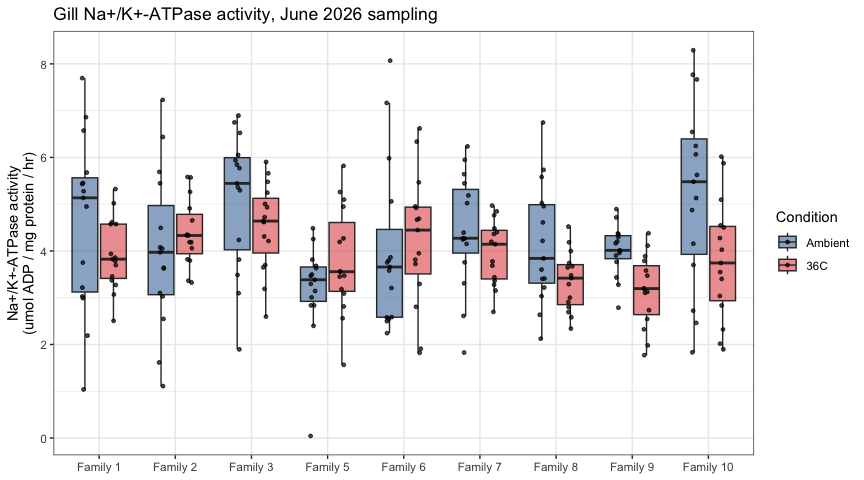

01-NaK-ATPase-202606-sampling
================
Steven Roberts
2026-10-02

-   [Data](#data)
-   [Plot](#plot)

# Data

Gill Na<sup>+</sup>/K<sup>+</sup>-ATPase activity from the June 2026
sampling event, joined to the sampling log by `Tube ID` to recover
condition and family.

``` r
atpase <- read_tsv("../data/202606-sampling.tsv") %>%
  rename(ATPase = `ATPase (umol ADP/mg protein/hr)`)

sampling_log <- read_csv("../../sampling-event-metadata/june-2026/sampling-log.csv") %>%
  select(`Tube ID`, Condition, `Oyster Family ID`, `Oyster ID`)

nak <- atpase %>%
  left_join(sampling_log, by = "Tube ID") %>%
  mutate(
    Family = factor(`Oyster Family ID`,
                    levels = paste("Family", sort(as.integer(str_remove(unique(`Oyster Family ID`), "Family "))))),
    Condition = factor(Condition, levels = c("Ambient", "36C"))
  )

# every assayed tube should match a sampling-log entry
stopifnot(!any(is.na(nak$Condition)))

count(nak, Condition, Family)
```

    ## # A tibble: 18 x 3
    ##    Condition Family        n
    ##    <fct>     <fct>     <int>
    ##  1 Ambient   Family 1     15
    ##  2 Ambient   Family 2     15
    ##  3 Ambient   Family 3     15
    ##  4 Ambient   Family 5     15
    ##  5 Ambient   Family 6     15
    ##  6 Ambient   Family 7     15
    ##  7 Ambient   Family 8     15
    ##  8 Ambient   Family 9     15
    ##  9 Ambient   Family 10    15
    ## 10 36C       Family 1     15
    ## 11 36C       Family 2     15
    ## 12 36C       Family 3     15
    ## 13 36C       Family 5     15
    ## 14 36C       Family 6     15
    ## 15 36C       Family 7     15
    ## 16 36C       Family 8     15
    ## 17 36C       Family 9     15
    ## 18 36C       Family 10    15

# Plot

``` r
ggplot(nak, aes(x = Family, y = ATPase, fill = Condition)) +
  geom_boxplot(outlier.shape = NA, alpha = 0.6) +
  geom_point(position = position_jitterdodge(jitter.width = 0.15), size = 1, alpha = 0.7) +
  scale_fill_manual(values = c(Ambient = "#4C78A8", `36C` = "#E45756")) +
  labs(x = NULL,
       y = "Na+/K+-ATPase activity\n(umol ADP / mg protein / hr)",
       title = "Gill Na+/K+-ATPase activity, June 2026 sampling") +
  theme_bw()
```

<!-- -->
