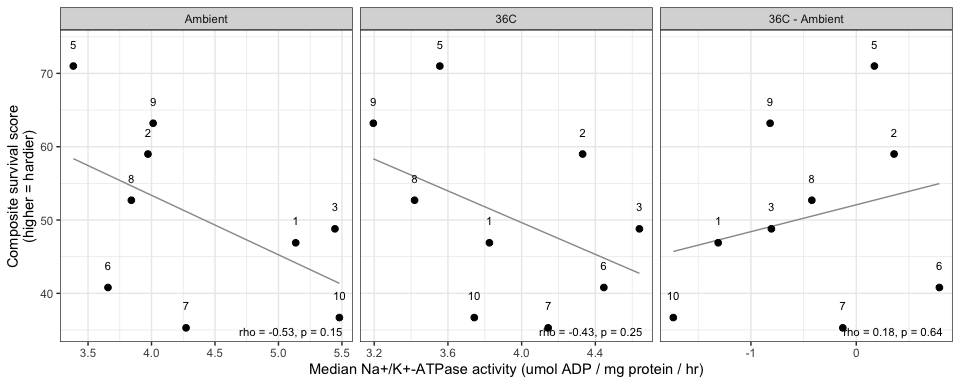
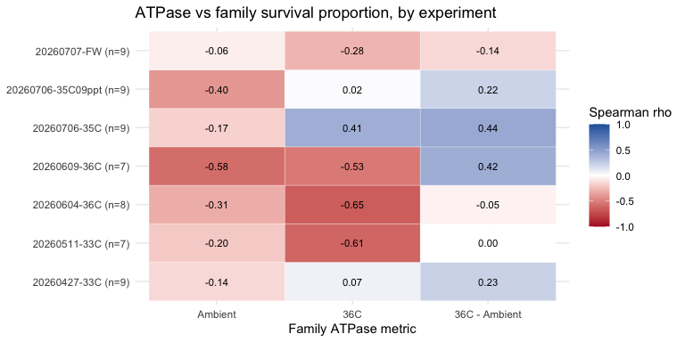
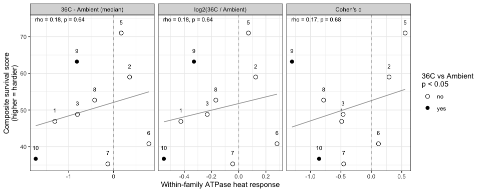
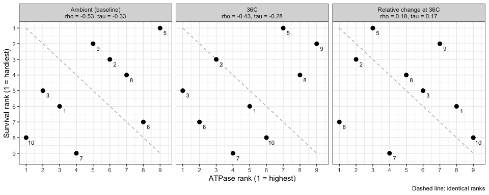
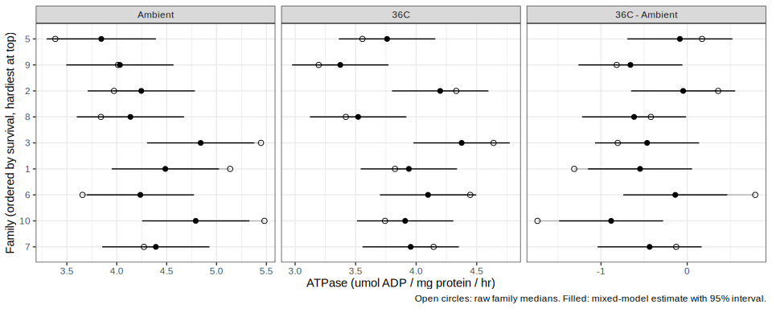
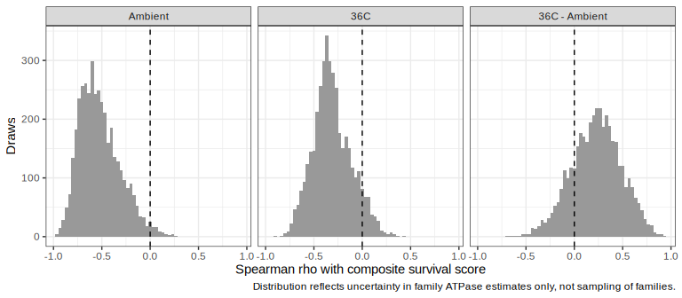

02-NaK-ATPase-vs-family-survival
================
Steven Roberts
2026-10-02

- [Overview](#overview)
- [Data](#data)
  - [Na/K-ATPase](#nak-atpase)
  - [Survival](#survival)
- [ATPase vs overall survival
  ranking](#atpase-vs-overall-survival-ranking)
- [ATPase vs survival in each
  experiment](#atpase-vs-survival-in-each-experiment)
- [Within-family heat response vs
  survival](#within-family-heat-response-vs-survival)
- [Family rankings: ATPase vs
  survival](#family-rankings-atpase-vs-survival)
- [Mixed-model estimates of family
  ATPase](#mixed-model-estimates-of-family-atpase)
  - [How much of the variation is between
    families?](#how-much-of-the-variation-is-between-families)
  - [Joint model](#joint-model)
  - [Family estimates with
    uncertainty](#family-estimates-with-uncertainty)
  - [Survival correlation with uncertainty carried
    through](#survival-correlation-with-uncertainty-carried-through)

# Overview

Compare family-level gill Na<sup>+</sup>/K<sup>+</sup>-ATPase activity
(June 2026 sampling; see `01-NaK-ATPase-202606-sampling.Rmd`) with
family-level survival from the heat-survivorship cross-experiment
summary
(`heat-survivorship/code/09-mgig-survivorship-cross-experiment-summary.qmd`).

Only 9 families are shared, so correlations are descriptive.

# Data

## Na/K-ATPase

``` r
atpase <- read_tsv("../data/202606-sampling.tsv") %>%
  rename(ATPase = `ATPase (umol ADP/mg protein/hr)`)

sampling_log <- read_csv("../../sampling-event-metadata/june-2026/sampling-log.csv") %>%
  select(`Tube ID`, Condition, `Oyster Family ID`)

nak <- atpase %>%
  left_join(sampling_log, by = "Tube ID") %>%
  mutate(family = str_remove(`Oyster Family ID`, "Family "))

stopifnot(!any(is.na(nak$Condition)))
```

Family summaries: median activity under each condition (median is robust
to the failed M21 assay), and the heat response as the 36C - Ambient
difference.

``` r
fam_atpase <- nak %>%
  group_by(family, Condition) %>%
  summarise(median_ATPase = median(ATPase), .groups = "drop") %>%
  pivot_wider(names_from = Condition, values_from = median_ATPase) %>%
  mutate(delta_36C_minus_Ambient = `36C` - Ambient)

knitr::kable(fam_atpase, digits = 2)
```

| family |  36C | Ambient | delta_36C_minus_Ambient |
|:-------|-----:|--------:|------------------------:|
| 1      | 3.83 |    5.14 |                   -1.31 |
| 10     | 3.74 |    5.48 |                   -1.74 |
| 2      | 4.33 |    3.97 |                    0.36 |
| 3      | 4.64 |    5.44 |                   -0.81 |
| 5      | 3.56 |    3.38 |                    0.17 |
| 6      | 4.45 |    3.66 |                    0.79 |
| 7      | 4.14 |    4.27 |                   -0.13 |
| 8      | 3.42 |    3.84 |                   -0.42 |
| 9      | 3.19 |    4.01 |                   -0.82 |

## Survival

``` r
surv_dir <- "../../heat-survivorship/outputs/09-mgig-survivorship-cross-experiment-summary"

fam_rank <- read_csv(file.path(surv_dir, "family_ranking.csv"),
                     col_types = cols(family = col_character()))
fam_exp  <- read_csv(file.path(surv_dir, "family_by_experiment.csv"),
                     col_types = cols(family = col_character()))

fam <- fam_atpase %>% inner_join(fam_rank, by = "family")
nrow(fam)
```

    ## [1] 9

# ATPase vs overall survival ranking

`composite_score` is the mean within-experiment survival percentile
(0-100, higher = hardier) across all seven survival experiments.

``` r
fam_long <- fam %>%
  pivot_longer(c(Ambient, `36C`, delta_36C_minus_Ambient),
               names_to = "atpase_metric", values_to = "atpase_value") %>%
  mutate(atpase_metric = factor(atpase_metric,
                                levels = c("Ambient", "36C", "delta_36C_minus_Ambient"),
                                labels = c("Ambient", "36C", "36C - Ambient")))

overall_cor <- fam_long %>%
  group_by(atpase_metric) %>%
  summarise(rho = cor(atpase_value, composite_score, method = "spearman"),
            p   = cor.test(atpase_value, composite_score, method = "spearman", exact = TRUE)$p.value,
            .groups = "drop")

knitr::kable(overall_cor, digits = 3)
```

| atpase_metric |    rho |     p |
|:--------------|-------:|------:|
| Ambient       | -0.533 | 0.148 |
| 36C           | -0.433 | 0.250 |
| 36C - Ambient |  0.183 | 0.644 |

``` r
ggplot(fam_long, aes(x = atpase_value, y = composite_score)) +
  geom_smooth(method = "lm", se = FALSE, colour = "grey60", linewidth = 0.5) +
  geom_point(size = 2) +
  geom_text(aes(label = family), nudge_y = 3, size = 3) +
  geom_text(data = overall_cor,
            aes(label = sprintf("rho = %.2f, p = %.2f", rho, p)),
            x = Inf, y = -Inf, hjust = 1.1, vjust = -0.8, size = 3, inherit.aes = FALSE) +
  facet_wrap(~ atpase_metric, scales = "free_x") +
  labs(x = "Median Na+/K+-ATPase activity (umol ADP / mg protein / hr)",
       y = "Composite survival score\n(higher = hardier)") +
  theme_bw()
```

<!-- -->

# ATPase vs survival in each experiment

Spearman correlation between family ATPase metrics and within-experiment
survival proportion. Experiments with few families (or near-total
mortality) carry little information.

``` r
exp_cor <- fam_exp %>%
  inner_join(fam_atpase, by = "family") %>%
  pivot_longer(c(Ambient, `36C`, delta_36C_minus_Ambient),
               names_to = "atpase_metric", values_to = "atpase_value") %>%
  group_by(exp_id, stressor, atpase_metric) %>%
  summarise(n_fam = n(),
            rho   = suppressWarnings(cor(atpase_value, surv_prop, method = "spearman")),
            .groups = "drop") %>%
  mutate(atpase_metric = factor(atpase_metric,
                                levels = c("Ambient", "36C", "delta_36C_minus_Ambient"),
                                labels = c("Ambient", "36C", "36C - Ambient")),
         exp_label = paste0(exp_id, " (n=", n_fam, ")"))

ggplot(exp_cor, aes(x = atpase_metric, y = exp_label, fill = rho)) +
  geom_tile(colour = "white") +
  geom_text(aes(label = ifelse(is.na(rho), "NA", sprintf("%.2f", rho))), size = 3) +
  scale_fill_gradient2(low = "#B2182B", mid = "white", high = "#2166AC",
                       limits = c(-1, 1), na.value = "grey85") +
  labs(x = "Family ATPase metric", y = NULL, fill = "Spearman rho",
       title = "ATPase vs family survival proportion, by experiment") +
  theme_minimal()
```

<!-- -->

# Within-family heat response vs survival

Does the change in ATPase between 36C and Ambient *within* a family
predict survival? The heat response is expressed three ways:

- `diff`: difference in medians (36C - Ambient), as above
- `log2ratio`: log2(median 36C / median Ambient), a relative change
- `cohens_d`: standardized mean difference, scaling the change by
  within-family variability

`wilcox_p` tests whether 36C and Ambient differ within each family.

``` r
heat_resp <- nak %>%
  group_by(family) %>%
  summarise(
    diff      = median(ATPase[Condition == "36C"]) - median(ATPase[Condition == "Ambient"]),
    log2ratio = log2(median(ATPase[Condition == "36C"]) / median(ATPase[Condition == "Ambient"])),
    cohens_d  = (mean(ATPase[Condition == "36C"]) - mean(ATPase[Condition == "Ambient"])) /
      sqrt((var(ATPase[Condition == "36C"]) + var(ATPase[Condition == "Ambient"])) / 2),
    wilcox_p  = suppressWarnings(
      wilcox.test(ATPase[Condition == "36C"], ATPase[Condition == "Ambient"])$p.value),
    .groups = "drop"
  ) %>%
  inner_join(fam_rank, by = "family") %>%
  arrange(desc(composite_score))

heat_resp %>%
  select(family, composite_score, mean_surv_prop, diff, log2ratio, cohens_d, wilcox_p) %>%
  knitr::kable(digits = 3)
```

| family | composite_score | mean_surv_prop |   diff | log2ratio | cohens_d | wilcox_p |
|:-------|----------------:|---------------:|-------:|----------:|---------:|---------:|
| 5      |            71.0 |          0.329 |  0.172 |     0.072 |    0.557 |    0.267 |
| 9      |            63.2 |          0.346 | -0.818 |    -0.329 |   -1.304 |    0.002 |
| 2      |            59.0 |          0.356 |  0.359 |     0.125 |    0.292 |    0.267 |
| 8      |            52.7 |          0.190 | -0.422 |    -0.168 |   -0.784 |    0.098 |
| 3      |            48.8 |          0.218 | -0.806 |    -0.231 |   -0.463 |    0.116 |
| 1      |            46.9 |          0.219 | -1.311 |    -0.425 |   -0.488 |    0.245 |
| 6      |            40.8 |          0.186 |  0.789 |     0.282 |    0.118 |    0.412 |
| 10     |            36.7 |          0.185 | -1.737 |    -0.550 |   -0.859 |    0.037 |
| 7      |            35.3 |          0.168 | -0.128 |    -0.044 |   -0.454 |    0.202 |

``` r
heat_long <- heat_resp %>%
  pivot_longer(c(diff, log2ratio, cohens_d),
               names_to = "response_metric", values_to = "response_value") %>%
  mutate(response_metric = factor(response_metric, levels = c("diff", "log2ratio", "cohens_d")))

heat_cor <- heat_long %>%
  pivot_longer(c(composite_score, mean_surv_prop),
               names_to = "survival_metric", values_to = "survival_value") %>%
  group_by(response_metric, survival_metric) %>%
  summarise(rho = cor(response_value, survival_value, method = "spearman"),
            p   = cor.test(response_value, survival_value, method = "spearman", exact = TRUE)$p.value,
            .groups = "drop")

knitr::kable(heat_cor, digits = 3)
```

| response_metric | survival_metric |   rho |     p |
|:----------------|:----------------|------:|------:|
| diff            | composite_score | 0.183 | 0.644 |
| diff            | mean_surv_prop  | 0.117 | 0.776 |
| log2ratio       | composite_score | 0.183 | 0.644 |
| log2ratio       | mean_surv_prop  | 0.117 | 0.776 |
| cohens_d        | composite_score | 0.167 | 0.678 |
| cohens_d        | mean_surv_prop  | 0.167 | 0.678 |

``` r
heat_lab <- filter(heat_cor, survival_metric == "composite_score")

ggplot(heat_long, aes(x = response_value, y = composite_score)) +
  geom_vline(xintercept = 0, linetype = "dashed", colour = "grey70") +
  geom_smooth(method = "lm", se = FALSE, colour = "grey60", linewidth = 0.5) +
  geom_point(aes(shape = wilcox_p < 0.05), size = 2.5) +
  geom_text(aes(label = family), nudge_y = 3, size = 3) +
  geom_text(data = heat_lab,
            aes(label = sprintf("rho = %.2f, p = %.2f", rho, p)),
            x = -Inf, y = Inf, hjust = -0.1, vjust = 1.5, size = 3, inherit.aes = FALSE) +
  scale_shape_manual(values = c(`FALSE` = 1, `TRUE` = 16),
                     labels = c(`FALSE` = "no", `TRUE` = "yes"),
                     name = "36C vs Ambient\np < 0.05") +
  facet_wrap(~ response_metric, scales = "free_x",
             labeller = as_labeller(c(diff = "36C - Ambient (median)",
                                      log2ratio = "log2(36C / Ambient)",
                                      cohens_d = "Cohen's d"))) +
  labs(x = "Within-family ATPase heat response",
       y = "Composite survival score\n(higher = hardier)") +
  theme_bw()
```

<!-- -->

The heat response does not track survival under any of the three metrics
(Spearman rho 0.12-0.18, all p \> 0.6). The two hardiest families (5, 2)
held or slightly raised ATPase at 36C, but family 9 (second hardiest)
showed the clearest decline and family 6 (near the bottom) the largest
increase. Only families 9 and 10 changed significantly within family,
and they sit at opposite ends of the survival ranking.

# Family rankings: ATPase vs survival

Rank families (1 = highest) by survival `composite_score` and by three
ATPase measures: baseline (Ambient median), 36C median, and the relative
change at 36C (`log2ratio`, where rank 1 = largest gain). Spearman rho
is the correlation of these ranks; Kendall tau is a more conservative
rank-agreement measure for small samples.

``` r
fam_ranks <- heat_resp %>%
  select(family, composite_score, log2ratio) %>%
  left_join(fam_atpase %>% select(family, Ambient, `36C`), by = "family") %>%
  mutate(
    survival_rank = rank(-composite_score),
    ambient_rank  = rank(-Ambient),
    heat_rank     = rank(-`36C`),
    relative_rank = rank(-log2ratio)
  ) %>%
  arrange(survival_rank)

fam_ranks %>%
  select(family, survival_rank, composite_score, ambient_rank, Ambient,
         heat_rank, `36C`, relative_rank, log2ratio) %>%
  knitr::kable(digits = 2)
```

| family | survival_rank | composite_score | ambient_rank | Ambient | heat_rank |  36C | relative_rank | log2ratio |
|:-------|--------------:|----------------:|-------------:|--------:|----------:|-----:|--------------:|----------:|
| 5      |             1 |            71.0 |            9 |    3.38 |         7 | 3.56 |             3 |      0.07 |
| 9      |             2 |            63.2 |            5 |    4.01 |         9 | 3.19 |             7 |     -0.33 |
| 2      |             3 |            59.0 |            6 |    3.97 |         3 | 4.33 |             2 |      0.12 |
| 8      |             4 |            52.7 |            7 |    3.84 |         8 | 3.42 |             5 |     -0.17 |
| 3      |             5 |            48.8 |            2 |    5.44 |         1 | 4.64 |             6 |     -0.23 |
| 1      |             6 |            46.9 |            3 |    5.14 |         5 | 3.83 |             8 |     -0.43 |
| 6      |             7 |            40.8 |            8 |    3.66 |         2 | 4.45 |             1 |      0.28 |
| 10     |             8 |            36.7 |            1 |    5.48 |         6 | 3.74 |             9 |     -0.55 |
| 7      |             9 |            35.3 |            4 |    4.27 |         4 | 4.14 |             4 |     -0.04 |

``` r
rank_long <- fam_ranks %>%
  pivot_longer(c(ambient_rank, heat_rank, relative_rank),
               names_to = "atpase_rank", values_to = "atpase_rank_value") %>%
  mutate(atpase_rank = factor(atpase_rank,
                              levels = c("ambient_rank", "heat_rank", "relative_rank"),
                              labels = c("Ambient (baseline)", "36C", "Relative change at 36C")))

rank_cor <- rank_long %>%
  group_by(atpase_rank) %>%
  summarise(
    spearman_rho = cor(atpase_rank_value, survival_rank, method = "spearman"),
    spearman_p   = cor.test(atpase_rank_value, survival_rank, method = "spearman", exact = TRUE)$p.value,
    kendall_tau  = cor(atpase_rank_value, survival_rank, method = "kendall"),
    kendall_p    = cor.test(atpase_rank_value, survival_rank, method = "kendall", exact = TRUE)$p.value,
    .groups = "drop"
  )

knitr::kable(rank_cor, digits = 3)
```

| atpase_rank            | spearman_rho | spearman_p | kendall_tau | kendall_p |
|:-----------------------|-------------:|-----------:|------------:|----------:|
| Ambient (baseline)     |       -0.533 |      0.148 |      -0.333 |     0.260 |
| 36C                    |       -0.433 |      0.250 |      -0.278 |     0.358 |
| Relative change at 36C |        0.183 |      0.644 |       0.167 |     0.612 |

``` r
rank_labels <- rank_cor %>%
  mutate(label = sprintf("%s\nrho = %.2f, tau = %.2f", atpase_rank, spearman_rho, kendall_tau)) %>%
  select(atpase_rank, label) %>%
  deframe()

ggplot(rank_long, aes(x = atpase_rank_value, y = survival_rank)) +
  geom_line(data = tibble(atpase_rank_value = 1:9, survival_rank = 1:9),
            linetype = "dashed", colour = "grey70") +
  geom_point(size = 2.5) +
  geom_text(aes(label = family), nudge_x = 0.3, nudge_y = -0.3, size = 3) +
  scale_x_continuous(breaks = 1:9) +
  scale_y_reverse(breaks = 1:9) +
  facet_wrap(~ atpase_rank, labeller = as_labeller(rank_labels)) +
  labs(x = "ATPase rank (1 = highest)",
       y = "Survival rank (1 = hardiest)",
       caption = "Dashed line: identical ranks") +
  theme_bw()
```

<!-- -->

Baseline (Ambient) ATPase gives the strongest, and inverse, ranking
agreement: the three families with the highest baseline activity (10,
3, 1) rank 8th, 5th and 6th for survival, and the hardiest family (5)
has the lowest baseline. With 9 families this is not significant
(Spearman p = 0.15; Kendall p = 0.26). The 36C ranking is weaker in the
same direction, and the relative change at 36C does not align with
survival.

# Mixed-model estimates of family ATPase

The family summaries above are medians of 15 oysters per condition, and
most of the variation in ATPase is among oysters within a family. Here a
mixed model fit to the individual oysters estimates each family’s
baseline and heat response, with an uncertainty for each, and that
uncertainty is carried into the comparison with survival.

The failed M21 assay is dropped here because, unlike the medians, model
means are sensitive to it. Ambient and 36C are different oysters, so the
heat response is a between-group contrast within each family.

``` r
mm <- nak %>%
  filter(`Tube ID` != "M21") %>%
  mutate(Condition = factor(Condition, levels = c("Ambient", "36C")))

mm %>% count(Condition)
```

    ## # A tibble: 2 x 2
    ##   Condition     n
    ##   <fct>     <int>
    ## 1 Ambient     134
    ## 2 36C         135

## How much of the variation is between families?

Separate random-intercept models for each condition partition the
variance into between-family and within-family (among-oyster)
components. The ICC is the between-family share. Reliability is how well
a family mean from `n` oysters tracks the family’s true mean, and
`n_for_0.8` is the number of oysters per family needed for a reliability
of 0.8.

``` r
var_part <- mm %>%
  group_by(Condition) %>%
  group_modify(function(df, key) {
    fit <- lme4::lmer(ATPase ~ 1 + (1 | family), data = df)
    vc  <- as.data.frame(lme4::VarCorr(fit))
    tibble(
      n_per_family = mean(table(df$family)),
      var_family   = vc$vcov[vc$grp == "family"],
      var_oyster   = vc$vcov[vc$grp == "Residual"]
    )
  }) %>%
  ungroup() %>%
  mutate(
    ICC         = var_family / (var_family + var_oyster),
    reliability = var_family / (var_family + var_oyster / n_per_family),
    n_for_0.8   = ceiling(4 * var_oyster / var_family)
  )

knitr::kable(var_part, digits = 3)
```

| Condition | n_per_family | var_family | var_oyster |   ICC | reliability | n_for_0.8 |
|:----------|-------------:|-----------:|-----------:|------:|------------:|----------:|
| Ambient   |       14.889 |      0.186 |      2.152 | 0.079 |       0.562 |        47 |
| 36C       |       15.000 |      0.141 |      0.927 | 0.132 |       0.696 |        27 |

## Joint model

Model: ATPase ~ Condition, with a random intercept (family baseline) and
random Condition slope (family heat response) for each family. The
residual variance is allowed to differ between conditions, since Ambient
is more variable among oysters than 36C.

``` r
fit_hom <- nlme::lme(ATPase ~ Condition, random = ~ 1 + Condition | family,
                     data = mm, method = "REML")
fit_het <- nlme::lme(ATPase ~ Condition, random = ~ 1 + Condition | family,
                     weights = nlme::varIdent(form = ~ 1 | Condition),
                     data = mm, method = "REML")
fit_int <- nlme::lme(ATPase ~ Condition, random = ~ 1 | family,
                     weights = nlme::varIdent(form = ~ 1 | Condition),
                     data = mm, method = "REML")

# Residual variance: one value vs one per condition
anova(fit_hom, fit_het)
```

    ##         Model df      AIC      BIC    logLik   Test  L.Ratio p-value
    ## fit_hom     1  6 908.3173 929.8408 -448.1587                        
    ## fit_het     2  7 888.6528 913.7635 -437.3264 1 vs 2 21.66457  <.0001

``` r
# Do families differ in heat response? (random slope vs intercept only;
# the p value is conservative because the variance is tested at its boundary)
anova(fit_int, fit_het)
```

    ##         Model df      AIC      BIC    logLik   Test  L.Ratio p-value
    ## fit_int     1  5 886.4790 904.4152 -438.2395                        
    ## fit_het     2  7 888.6528 913.7635 -437.3264 1 vs 2 1.826218  0.4013

``` r
summary(fit_het)$tTable %>% knitr::kable(digits = 3)
```

|              |  Value | Std.Error |  DF | t-value | p-value |
|:-------------|-------:|----------:|----:|--------:|--------:|
| (Intercept)  |  4.334 |     0.191 | 259 |  22.634 |   0.000 |
| Condition36C | -0.431 |     0.206 | 259 |  -2.087 |   0.038 |

``` r
nlme::VarCorr(fit_het)
```

    ## family = pdLogChol(1 + Condition) 
    ##              Variance  StdDev    Corr  
    ## (Intercept)  0.1854303 0.4306161 (Intr)
    ## Condition36C 0.1772087 0.4209616 -0.61 
    ## Residual     0.9265773 0.9625889

``` r
resid_sd <- fit_het$sigma *
  coef(fit_het$modelStruct$varStruct, unconstrained = FALSE, allCoef = TRUE)
resid_sd
```

    ##       36C   Ambient 
    ## 0.9625889 1.4669509

## Family estimates with uncertainty

The family estimates (BLUPs) are pulled toward the overall mean in
proportion to how noisy each family’s data are. Their conditional
covariance is (Z’R<sup>-1</sup>Z + G<sup>-1</sup>)<sup>-1</sup> for each
family, given the fitted variance components.

``` r
G     <- as.matrix(nlme::getVarCov(fit_het))
beta  <- nlme::fixef(fit_het)
re    <- nlme::ranef(fit_het)

blup_cov <- map(set_names(rownames(re)), function(f) {
  d  <- filter(mm, family == f)
  Z  <- model.matrix(~ Condition, d)
  Ri <- diag(1 / resid_sd[as.character(d$Condition)]^2)
  solve(t(Z) %*% Ri %*% Z + solve(G))
})

fam_mm <- tibble(
  family   = rownames(re),
  b0       = re[, 1],
  b1       = re[, 2],
  se_b0    = map_dbl(blup_cov, ~ sqrt(.x[1, 1])),
  se_b1    = map_dbl(blup_cov, ~ sqrt(.x[2, 2])),
  se_36C   = map_dbl(blup_cov, ~ sqrt(sum(.x)))
) %>%
  mutate(
    mm_Ambient = beta[1] + b0,
    mm_36C     = beta[1] + beta[2] + b0 + b1,
    mm_heat    = beta[2] + b1
  ) %>%
  inner_join(fam_rank %>% select(family, composite_score), by = "family") %>%
  left_join(fam_atpase, by = "family") %>%
  arrange(desc(composite_score))

fam_mm %>%
  select(family, composite_score,
         Ambient, mm_Ambient, se_b0,
         `36C`, mm_36C, se_36C,
         delta_36C_minus_Ambient, mm_heat, se_b1) %>%
  knitr::kable(digits = 2)
```

| family | composite_score | Ambient | mm_Ambient | se_b0 |  36C | mm_36C | se_36C | delta_36C_minus_Ambient | mm_heat | se_b1 |
|:-------|----------------:|--------:|-----------:|------:|-----:|-------:|-------:|------------------------:|--------:|------:|
| 5      |            71.0 |    3.38 |       3.84 |  0.28 | 3.56 |   3.76 |    0.2 |                    0.17 |   -0.09 |  0.31 |
| 9      |            63.2 |    4.01 |       4.03 |  0.27 | 3.19 |   3.37 |    0.2 |                   -0.82 |   -0.66 |  0.31 |
| 2      |            59.0 |    3.97 |       4.25 |  0.27 | 4.33 |   4.20 |    0.2 |                    0.36 |   -0.05 |  0.31 |
| 8      |            52.7 |    3.84 |       4.14 |  0.27 | 3.42 |   3.52 |    0.2 |                   -0.42 |   -0.62 |  0.31 |
| 3      |            48.8 |    5.44 |       4.84 |  0.27 | 4.64 |   4.38 |    0.2 |                   -0.81 |   -0.47 |  0.31 |
| 1      |            46.9 |    5.14 |       4.49 |  0.27 | 3.83 |   3.94 |    0.2 |                   -1.31 |   -0.55 |  0.31 |
| 6      |            40.8 |    3.66 |       4.24 |  0.27 | 4.45 |   4.10 |    0.2 |                    0.79 |   -0.14 |  0.31 |
| 10     |            36.7 |    5.48 |       4.79 |  0.27 | 3.74 |   3.91 |    0.2 |                   -1.74 |   -0.88 |  0.31 |
| 7      |            35.3 |    4.27 |       4.39 |  0.27 | 4.14 |   3.95 |    0.2 |                   -0.13 |   -0.44 |  0.31 |

``` r
shrink <- bind_rows(
  fam_mm %>% transmute(family, metric = "Ambient", raw = Ambient,
                       est = mm_Ambient, se = se_b0),
  fam_mm %>% transmute(family, metric = "36C", raw = `36C`,
                       est = mm_36C, se = se_36C),
  fam_mm %>% transmute(family, metric = "36C - Ambient", raw = delta_36C_minus_Ambient,
                       est = mm_heat, se = se_b1)
) %>%
  mutate(metric = factor(metric, levels = c("Ambient", "36C", "36C - Ambient")),
         family = factor(family, levels = rev(fam_mm$family)))

ggplot(shrink, aes(y = family)) +
  geom_segment(aes(x = raw, xend = est, yend = family), colour = "grey70") +
  geom_point(aes(x = raw), shape = 1, size = 2) +
  geom_pointrange(aes(x = est, xmin = est - 1.96 * se, xmax = est + 1.96 * se),
                  size = 0.3) +
  facet_wrap(~ metric, scales = "free_x") +
  labs(x = "ATPase (umol ADP / mg protein / hr)",
       y = "Family (ordered by survival, hardiest at top)",
       caption = "Open circles: raw family medians. Filled: mixed-model estimate with 95% interval.") +
  theme_bw()
```

<!-- -->

## Survival correlation with uncertainty carried through

Point correlations use the model estimates. To carry the uncertainty in
each family’s estimate into the correlation, family effects are drawn
4000 times from their conditional distributions and the Spearman rho
with `composite_score` is recomputed each time. Fixed effects shift
every family equally, so they do not affect the ranks.

``` r
mm_point <- fam_mm %>%
  summarise(
    Ambient         = cor(mm_Ambient, composite_score, method = "spearman"),
    `36C`           = cor(mm_36C,     composite_score, method = "spearman"),
    `36C - Ambient` = cor(mm_heat,    composite_score, method = "spearman")
  ) %>%
  pivot_longer(everything(), names_to = "metric", values_to = "rho_point")

set.seed(20261003)
n_draw <- 4000
draws <- map_dfr(seq_len(nrow(fam_mm)), function(i) {
  f <- fam_mm$family[i]
  b <- MASS::mvrnorm(n_draw, mu = c(fam_mm$b0[i], fam_mm$b1[i]), Sigma = blup_cov[[f]])
  tibble(draw = seq_len(n_draw), family = f, b0 = b[, 1], b1 = b[, 2])
}) %>%
  left_join(fam_mm %>% select(family, composite_score), by = "family")

mm_draw_cor <- draws %>%
  group_by(draw) %>%
  summarise(
    Ambient         = cor(b0,      composite_score, method = "spearman"),
    `36C`           = cor(b0 + b1, composite_score, method = "spearman"),
    `36C - Ambient` = cor(b1,      composite_score, method = "spearman"),
    .groups = "drop"
  ) %>%
  pivot_longer(-draw, names_to = "metric", values_to = "rho")

mm_cor <- mm_draw_cor %>%
  group_by(metric) %>%
  summarise(rho_median = median(rho),
            lower_95   = quantile(rho, 0.025),
            upper_95   = quantile(rho, 0.975),
            prob_neg   = mean(rho < 0),
            .groups = "drop") %>%
  left_join(mm_point, by = "metric") %>%
  mutate(metric = factor(metric, levels = c("Ambient", "36C", "36C - Ambient"))) %>%
  arrange(metric) %>%
  select(metric, rho_point, rho_median, lower_95, upper_95, prob_neg)

knitr::kable(mm_cor, digits = 2)
```

| metric        | rho_point | rho_median | lower_95 | upper_95 | prob_neg |
|:--------------|----------:|-----------:|---------:|---------:|---------:|
| Ambient       |     -0.67 |      -0.55 |    -0.83 |    -0.03 |     0.98 |
| 36C           |     -0.37 |      -0.32 |    -0.67 |     0.12 |     0.91 |
| 36C - Ambient |      0.23 |       0.23 |    -0.30 |     0.72 |     0.18 |

``` r
ggplot(mm_draw_cor %>%
         mutate(metric = factor(metric, levels = c("Ambient", "36C", "36C - Ambient"))),
       aes(x = rho)) +
  geom_histogram(binwidth = 1 / 30, fill = "grey60") +
  geom_vline(xintercept = 0, linetype = "dashed") +
  facet_wrap(~ metric) +
  labs(x = "Spearman rho with composite survival score",
       y = "Draws",
       caption = "Distribution reflects uncertainty in family ATPase estimates only, not sampling of families.") +
  theme_bw()
```

<!-- -->

These intervals reflect only measurement uncertainty within families.
They do not include the larger uncertainty from having only 9 families,
so they are narrower than a full test against survival would be.

Summary of the mixed-model results:

- **Most variation is among oysters, not families.** The between-family
  share (ICC) is 0.08 at Ambient and 0.13 at 36C, so a 15-oyster family
  mean has a reliability of only 0.56 (Ambient) and 0.70 (36C). Reaching
  0.8 would take about 47 and 27 oysters per family. Ambient is also
  more variable among oysters than 36C (residual SD 1.47 vs 0.96;
  likelihood ratio p \< 0.001).
- **ATPase drops at 36C overall, but there is no evidence families
  differ in how much.** The population heat effect is -0.43 (p = 0.04),
  but adding a family-specific heat response does not improve the model
  (p = 0.40). Once shrunk, every family’s heat response is negative
  (-0.05 to -0.88, versus raw differences of -1.74 to +0.79). The
  apparent gains in families 6 and 2 are mostly noise. That explains why
  the heat response does not track survival under any metric above.
- **Baseline activity carries the survival signal.** The model-estimated
  Ambient activity correlates with survival at rho = -0.67 (median
  across draws -0.55, 95% interval -0.83 to -0.03; negative in 98% of
  draws), slightly stronger than the median-based -0.53. 36C activity is
  weaker in the same direction (-0.37), and the heat response does not
  align with survival (0.23, interval spanning zero).
- **This remains a hypothesis to test.** The intervals cover measurement
  uncertainty within families but not the uncertainty from sampling only
  9 families, which dominates. The negative baseline association is the
  one ATPase measure worth carrying forward, prespecified, to new
  families or the multi-assay model.
