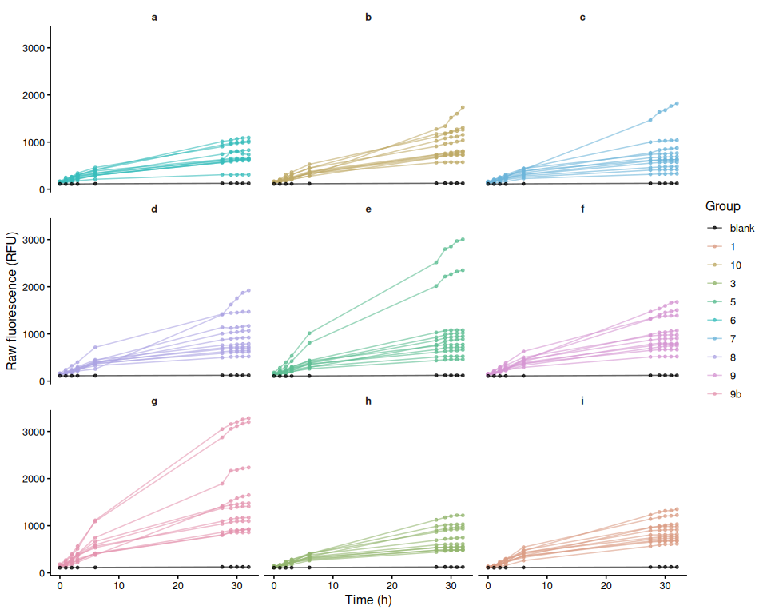
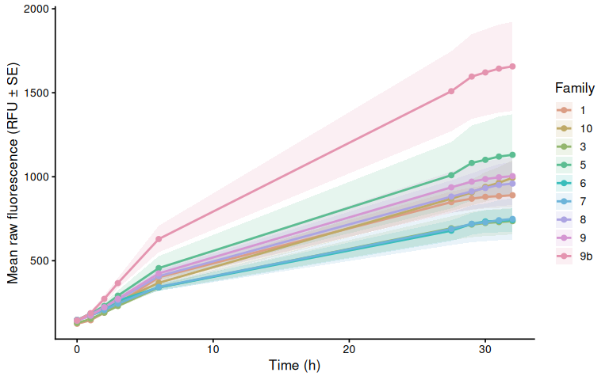
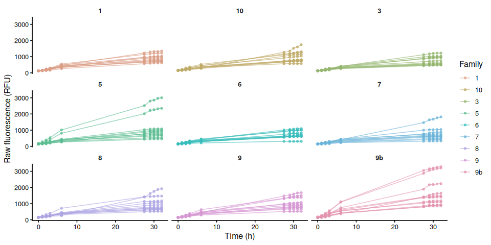
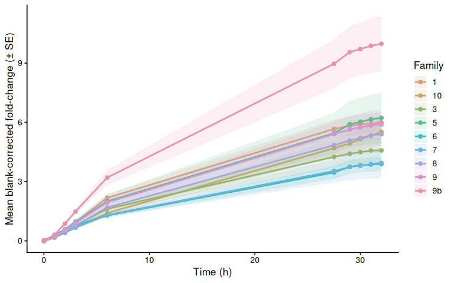
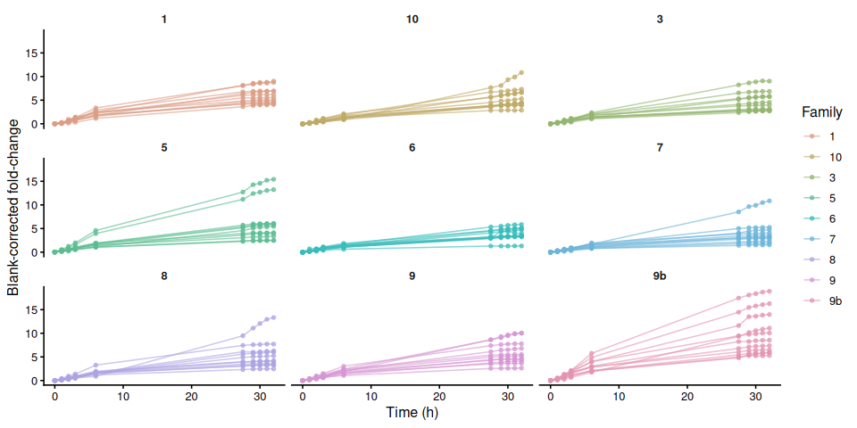
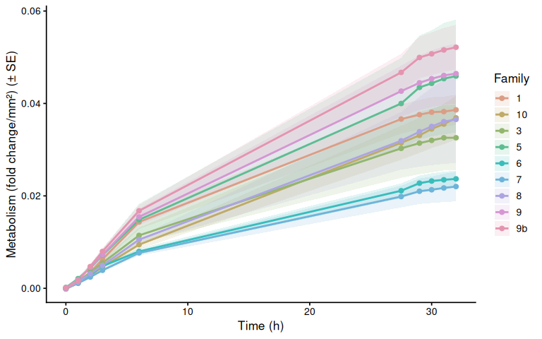
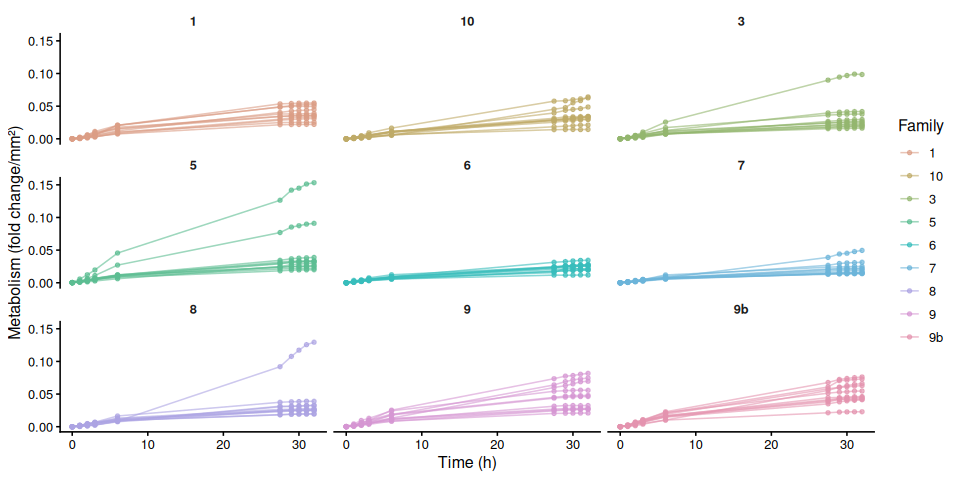
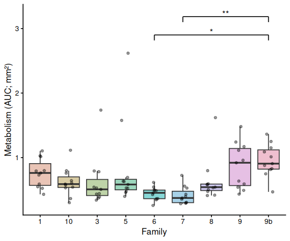

01.00-resazurin-20260429-freshwater_stress
================
Sam White
2026-04-29

- [1 Background](#1-background)
  - [1.1 Expected inputs](#11-expected-inputs)
  - [1.2 Expected outputs](#12-expected-outputs)
- [2 Setup](#2-setup)
  - [2.1 Knitr options](#21-knitr-options)
  - [2.2 Load libraries](#22-load-libraries)
- [3 Helper Functions](#3-helper-functions)
- [4 Load Data](#4-load-data)
  - [4.1 Plate export files](#41-plate-export-files)
  - [4.2 Plate consistency check](#42-plate-consistency-check)
  - [4.3 Layout file](#43-layout-file)
- [5 Merge Plate Data with Layout](#5-merge-plate-data-with-layout)
- [6 Raw Fluorescence](#6-raw-fluorescence)
  - [6.1 Data frame](#61-data-frame)
  - [6.2 Raw fluorescence by plate (including
    blanks)](#62-raw-fluorescence-by-plate-including-blanks)
  - [6.3 Mean raw fluorescence by
    family](#63-mean-raw-fluorescence-by-family)
  - [6.4 Individual raw fluorescence traces by
    family](#64-individual-raw-fluorescence-traces-by-family)
  - [6.5 Individual raw fluorescence traces by
    treatment](#65-individual-raw-fluorescence-traces-by-treatment)
  - [6.6 Excluded samples](#66-excluded-samples)
- [7 Blank Correction via Fold-Change
  Normalization](#7-blank-correction-via-fold-change-normalization)
  - [7.1 Step 1 – Identify T0 and compute per-sample
    fold-change](#71-step-1--identify-t0-and-compute-per-sample-fold-change)
  - [7.2 Step 2 – Blank fold-change reference per plate per
    timepoint](#72-step-2--blank-fold-change-reference-per-plate-per-timepoint)
  - [7.3 Step 3 – Subtract blank fold-change from sample
    fold-change](#73-step-3--subtract-blank-fold-change-from-sample-fold-change)
- [8 Blank-Corrected Fold-Change](#8-blank-corrected-fold-change)
  - [8.1 Mean by family](#81-mean-by-family)
  - [8.2 Individual traces by family](#82-individual-traces-by-family)
  - [8.3 Individual blank-corrected fold-change traces by
    treatment](#83-individual-blank-corrected-fold-change-traces-by-treatment)
- [9 Metabolism (Size-Normalised
  Fold-Change)](#9-metabolism-size-normalised-fold-change)
  - [9.1 Mean metabolism by family](#91-mean-metabolism-by-family)
  - [9.2 Individual metabolism traces by
    family](#92-individual-metabolism-traces-by-family)
- [10 Time-Series Statistical
  Analysis](#10-time-series-statistical-analysis)
  - [10.1 Results](#101-results)
    - [10.1.1 Metric:
      metabolism_per_area_mm2_measurement](#1011-metric-metabolism_per_area_mm2_measurement)
- [11 AUC Box Plots with Statistical
  Annotations](#11-auc-box-plots-with-statistical-annotations)
  - [11.1 Significance labels](#111-significance-labels)
  - [11.2 AUC Boxplots](#112-auc-boxplots)
- [12 Save Output Data](#12-save-output-data)

# 1 Background

*M. gigas* oysters from nine USDA families were placed individually in
clear 12-well plates and submerged in 4 mL of resazurin working solution
prepared with tap water to induce a freshwater stress response. Plates
were held at room temperature (~20°C) for the duration of the experiment
(~32 h). At each designated timepoint, plates were transferred to a
Synergy HTX (Agilent) plate reader and fluorescence was measured
directly in the 12-well plates using the Gen5 software (Agilent).

See `Resazurin/data/20260429-freshwater_stress/README.md` for full
experimental notes.

## 1.1 Expected inputs

| Path | Description |
|:---|:---|
| `Resazurin/data/20260429-freshwater_stress/plate-*-T*.txt` | Plate reader fluorescence exports (one file per plate per timepoint) |
| `Resazurin/data/20260429-freshwater_stress/layout.csv` | Well metadata: plate ID, well ID, blank flag, family groups, sample IDs, area measurements (mm², from ImageJ) |

## 1.2 Expected outputs

All outputs are written to
`Resazurin/outputs/01.00-resazurin-20260429-freshwater_stress/`.

| File | Description |
|:---|:---|
| `figures/` | All plots generated by this script |
| `auc_all_metrics.csv` | Per-individual AUC values for every active measurement metric |
| `auc_summary.csv` | Group-level AUC summary statistics (mean, SD, SE, median) |
| `metabolism.csv` | Full per-well per-timepoint metabolism data frame |
| `pairwise_stats.csv` | Tukey-adjusted pairwise comparisons from AUC linear models |

# 2 Setup

## 2.1 Knitr options

``` r
knitr::opts_chunk$set(
  echo = TRUE,         # Display code chunks
  eval = TRUE,        # Evaluate code chunks
  warning = FALSE,     # Hide warnings
  message = FALSE,     # Hide messages
  comment = "",         # Prevents appending '##' to beginning of lines in code output
  results = 'hold'     # Holds output so it's all printed together after code chunk
)
```

## 2.2 Load libraries

``` r
library(tidyverse)
library(pracma)       # trapz()
library(lme4)
library(lmerTest)
library(emmeans)
library(multcompView)
library(cowplot)
library(colorspace)   # qualitative_hcl() for large palettes
```

# 3 Helper Functions

``` r
normalize_well_id <- function(x) {
  x <- toupper(trimws(x))
  valid <- str_detect(x, "^[A-Z]+[0-9]+$")
  out <- rep(NA_character_, length(x))
  if (!any(valid)) return(out)
  m <- str_match(x[valid], "^([A-Z]+)([0-9]+)$")
  out[valid] <- paste0(m[, 2], as.integer(m[, 3]))
  out
}

parse_time_hr <- function(path) {
  hit <- str_match(basename(path),
                   "(?i)-T([0-9]+(?:\\.[0-9]+)?)\\.txt$")
  as.numeric(hit[, 2])
}

parse_plate_id <- function(path) {
  hit <- str_match(basename(path),
    "(?i)^plate-([A-Za-z0-9-]+)-T[0-9]+(?:\\.[0-9]+)?\\.txt$")
  id <- hit[, 2]
  ifelse(is.na(id), "unknown", id)
}

extract_results_block <- function(lines) {
  results_idx <- which(trimws(lines) == "Results")
  if (length(results_idx) == 0) stop("No Results section found")
  idx <- results_idx[1]
  header_tokens <- str_split(lines[idx + 1], "\\t")[[1]] |> trimws()
  col_ids <- header_tokens[
    header_tokens != "" & str_detect(header_tokens, "^[0-9]+$")]
  j <- idx + 2
  data_lines <- character()
  while (j <= length(lines)) {
    line <- lines[j]
    if (trimws(line) == "") break
    if (!str_detect(line, "^[A-Za-z]\\t")) break
    data_lines <- c(data_lines, line)
    j <- j + 1
  }
  list(col_ids = col_ids, data_lines = data_lines)
}

parse_plate_export <- function(path) {
  lines <- readLines(path, warn = FALSE)
  res <- extract_results_block(lines)

  map_dfr(res$data_lines, function(line) {
    tokens <- str_split(line, "\\t")[[1]] |> trimws()
    tokens <- tokens[tokens != ""]
    row_letter <- tokens[1]
    nums <- suppressWarnings(as.numeric(tokens[-1]))
    valid_idx <- which(!is.na(nums))
    if (length(valid_idx) == 0) return(tibble())
    vals <- nums[valid_idx]
    n <- min(length(vals), length(res$col_ids))
    tibble(
      row_id  = toupper(row_letter),
      col_id  = as.integer(res$col_ids[seq_len(n)]),
      well_id = normalize_well_id(
        paste0(toupper(row_letter), res$col_ids[seq_len(n)])),
      value   = vals[seq_len(n)]
    )
  }) %>%
    mutate(
      plate_id = str_to_lower(parse_plate_id(path)),
      time_hr  = parse_time_hr(path)
    )
}

trapezoid_auc <- function(time_hr, value) {
  ok <- is.finite(time_hr) & is.finite(value)
  t <- time_hr[ok]
  v <- value[ok]
  if (length(t) < 2) return(NA_real_)
  ord <- order(t)
  t <- t[ord]; v <- v[ord]
  sum(diff(t) * (head(v, -1) + tail(v, -1)) / 2)
}

# Shared helper: extract display unit string from a measurement column name.
# e.g. "area_mm2_measurement" -> "mm²", "weight_mg_measurement" -> "mg"
parse_meas_unit <- function(col_name) {
  unit_raw <- col_name |>
    str_remove("^metabolism_per_") |>
    str_remove("_measurement$") |>
    str_extract("[^_]+$")
  case_when(
    unit_raw == "mm2" ~ "mm²",
    unit_raw == "cm2" ~ "cm²",
    unit_raw == "mm3" ~ "mm³",
    unit_raw == "cm3" ~ "cm³",
    TRUE              ~ unit_raw
  )
}

# y-axis label for metabolism line plots: "fold change/mm²"
metabolism_y_label <- function(col_name) {
  paste0("Metabolism (fold change/", parse_meas_unit(col_name), ")")
}

# y-axis label for AUC box plots: "Metabolism (AUC; mm²)"
auc_y_label <- function(metric_name) {
  paste0("Metabolism (AUC; ", parse_meas_unit(metric_name), ")")
}
```

# 4 Load Data

## 4.1 Plate export files

``` r
proj_root <- rprojroot::find_rstudio_root_file()
data_dir  <- file.path(proj_root, "Resazurin", "data", "20260429-freshwater_stress")
out_dir   <- file.path(proj_root, "Resazurin", "outputs",
                        "01.00-resazurin-20260429-freshwater_stress")
fig_dir   <- file.path(out_dir, "figures")

dir.create(fig_dir, recursive = TRUE, showWarnings = FALSE)
dir.create(out_dir, recursive = TRUE, showWarnings = FALSE)

plate_files <- list.files(
  data_dir,
  pattern = "(?i)^plate-.*-T[0-9]+(?:\\.[0-9]+)?\\.txt$",
  full.names = TRUE
)

plate_raw <- map_dfr(plate_files, function(path) {
  tryCatch(parse_plate_export(path),
           error = function(e) {
             message("Parse error in ", basename(path), ": ", e$message)
             tibble()
           })
})

str(plate_raw)
```

    tibble [1,080 × 6] (S3: tbl_df/tbl/data.frame)
     $ row_id  : chr [1:1080] "A" "A" "A" "A" ...
     $ col_id  : int [1:1080] 1 2 3 4 1 2 3 4 1 2 ...
     $ well_id : chr [1:1080] "A1" "A2" "A3" "A4" ...
     $ value   : num [1:1080] 141 140 126 143 145 159 168 157 145 139 ...
     $ plate_id: chr [1:1080] "a" "a" "a" "a" ...
     $ time_hr : num [1:1080] 0 0 0 0 0 0 0 0 0 0 ...

## 4.2 Plate consistency check

Checks that every plate has the same number of wells at every timepoint.
The expected well count is the mode across all plate × timepoint reads.
Any plate with at least one deviating read is flagged and dropped
entirely before any further analysis — removing only the aberrant
timepoint would break the fold-change baseline calculation.

``` r
well_counts <- plate_raw %>%
  group_by(plate_id, time_hr) %>%
  summarise(n_wells = n_distinct(well_id), .groups = "drop")

expected_n_wells <- as.integer(
  names(which.max(table(well_counts$n_wells)))
)

inconsistent_reads <- well_counts %>%
  filter(n_wells != expected_n_wells) %>%
  arrange(plate_id, time_hr)

inconsistent_plate_ids <- unique(inconsistent_reads$plate_id)

if (nrow(inconsistent_reads) > 0) {
  cat("**Plate consistency check FAILED.**",
      "Expected", expected_n_wells, "wells per plate-timepoint read.",
      length(inconsistent_plate_ids),
      "plate(s) have at least one deviating read and are excluded",
      "from all analyses:\n\n")
  cat(knitr::kable(
    inconsistent_reads,
    col.names = c("Plate", "Time (h)", "Wells read"),
    caption   = paste("Expected:", expected_n_wells, "wells per read")
  ), sep = "\n")
  cat("\n")
  plate_raw <- plate_raw %>%
    filter(!plate_id %in% inconsistent_plate_ids)
  message(length(inconsistent_plate_ids),
          " plate(s) removed from plate_raw: ",
          paste(inconsistent_plate_ids, collapse = ", "))
} else {
  cat("Plate consistency check passed: all",
      n_distinct(well_counts$plate_id), "plates have",
      expected_n_wells, "wells at every timepoint.\n")
}
```

Plate consistency check passed: all 9 plates have 12 wells at every
timepoint.

## 4.3 Layout file

``` r
layout_path <- file.path(data_dir, "layout.csv")

layout_raw <- read_csv(layout_path,
                       col_types = cols(.default = "c"),
                       show_col_types = FALSE)

# Standardise column names to snake_case
names(layout_raw) <- names(layout_raw) |>
  str_to_lower() |>
  str_replace_all("[^a-z0-9]+", "_") |>
  str_replace_all("_+", "_") |>
  str_replace("_$", "")

# Normalise plate_id to match plate file ids (strip "plate-" prefix)
layout_clean <- layout_raw %>%
  mutate(
    plate_id = str_remove(str_to_lower(plate_id), "^plate-"),
    well_id  = normalize_well_id(plate_well),
    is_blank = if ("is_blank" %in% names(layout_raw))
      toupper(trimws(is_blank)) %in% c("TRUE", "T", "1", "YES", "Y")
    else
      FALSE
  )

found_exclude_col <- intersect(
  c("exclude_from_analysis", "exclude", "omit", "not_analyzed"),
  names(layout_clean)
)[1]
layout_clean <- layout_clean %>%
  mutate(
    exclude_from_analysis = if (!is.na(found_exclude_col))
      toupper(trimws(.data[[found_exclude_col]])) %in%
        c("TRUE", "T", "1", "YES", "Y")
    else
      FALSE
  )

# Identify measurement columns and group columns
measurement_cols <- names(layout_clean)[
  str_detect(names(layout_clean), "_measurement$")]
group_cols <- names(layout_clean)[
  str_detect(names(layout_clean), "_group$")]

# Cast measurement columns to numeric
layout_clean <- layout_clean %>%
  mutate(across(all_of(measurement_cols),
                ~ suppressWarnings(as.numeric(.x))))

# Determine which measurement columns actually contain finite data
active_meas_cols <- measurement_cols[
  sapply(measurement_cols, function(col)
    any(is.finite(layout_clean[[col]]), na.rm = TRUE))]

# Normalise group values to lowercase so they match colour scale definitions
layout_clean <- layout_clean %>%
  mutate(across(all_of(group_cols),
                ~ str_to_lower(trimws(as.character(.x)))))

message("Group columns: ", paste(group_cols, collapse = ", "))
message("Active measurement columns: ",
        paste(active_meas_cols, collapse = ", "))

str(layout_clean)
```

    tibble [108 × 14] (S3: tbl_df/tbl/data.frame)
     $ plate_id             : chr [1:108] "a" "a" "a" "a" ...
     $ plate_well           : chr [1:108] "A01" "A02" "A03" "A04" ...
     $ is_blank             : logi [1:108] FALSE FALSE FALSE FALSE FALSE FALSE ...
     $ family_id_group      : chr [1:108] "6" "6" "6" "6" ...
     $ sample_id_group      : chr [1:108] "1" "2" "3" "4" ...
     $ exclude_from_analysis: logi [1:108] FALSE FALSE FALSE FALSE FALSE FALSE ...
     $ exclude_reason       : chr [1:108] NA NA NA NA ...
     $ weight_g_measurement : num [1:108] NA NA NA NA NA NA NA NA NA NA ...
     $ width_mm_measurement : num [1:108] NA NA NA NA NA NA NA NA NA NA ...
     $ length_mm_measurement: num [1:108] NA NA NA NA NA NA NA NA NA NA ...
     $ treatment_group      : chr [1:108] NA NA NA NA ...
     $ area_mm2_measurement : num [1:108] 158 164 111 180 195 ...
     $ imagej_id            : chr [1:108] "2" "1" "3" "4" ...
     $ well_id              : chr [1:108] "A1" "A2" "A3" "A4" ...

# 5 Merge Plate Data with Layout

``` r
dat <- plate_raw %>%
  left_join(
    layout_clean %>%
      select(plate_id, well_id, is_blank, exclude_from_analysis,
             any_of("exclude_reason"),
             all_of(group_cols), all_of(measurement_cols)),
    by = c("plate_id", "well_id")
  ) %>%
  mutate(
    is_blank = replace_na(is_blank, FALSE),
    exclude_from_analysis = replace_na(exclude_from_analysis, FALSE)
  )

str(dat)
```

    tibble [1,080 × 16] (S3: tbl_df/tbl/data.frame)
     $ row_id               : chr [1:1080] "A" "A" "A" "A" ...
     $ col_id               : int [1:1080] 1 2 3 4 1 2 3 4 1 2 ...
     $ well_id              : chr [1:1080] "A1" "A2" "A3" "A4" ...
     $ value                : num [1:1080] 141 140 126 143 145 159 168 157 145 139 ...
     $ plate_id             : chr [1:1080] "a" "a" "a" "a" ...
     $ time_hr              : num [1:1080] 0 0 0 0 0 0 0 0 0 0 ...
     $ is_blank             : logi [1:1080] FALSE FALSE FALSE FALSE FALSE FALSE ...
     $ exclude_from_analysis: logi [1:1080] FALSE FALSE FALSE FALSE FALSE FALSE ...
     $ exclude_reason       : chr [1:1080] NA NA NA NA ...
     $ family_id_group      : chr [1:1080] "6" "6" "6" "6" ...
     $ sample_id_group      : chr [1:1080] "1" "2" "3" "4" ...
     $ treatment_group      : chr [1:1080] NA NA NA NA ...
     $ weight_g_measurement : num [1:1080] NA NA NA NA NA NA NA NA NA NA ...
     $ width_mm_measurement : num [1:1080] NA NA NA NA NA NA NA NA NA NA ...
     $ length_mm_measurement: num [1:1080] NA NA NA NA NA NA NA NA NA NA ...
     $ area_mm2_measurement : num [1:1080] 158 164 111 180 195 ...

# 6 Raw Fluorescence

## 6.1 Data frame

``` r
# Wells in the plate reader output that have no layout entry get all-NA group
# columns after the join. Keep only wells assigned to at least one group.
active_gc <- intersect(group_cols, names(dat))

raw_df <- dat %>%
  filter(
    !is_blank,
    if (length(active_gc) > 0)
      if_any(all_of(active_gc), ~ !is.na(.))
    else
      TRUE
  ) %>%
  mutate(
    trace_id = if_else(
      !is.na(sample_id_group) & trimws(as.character(sample_id_group)) != "",
      as.character(sample_id_group),
      paste(plate_id, well_id, sep = "_")
    )
  )

families   <- sort(unique(na.omit(raw_df$family_id_group)))
treatments <- sort(unique(na.omit(raw_df$treatment_group)))

n_fam <- length(families)
n_trt <- length(treatments)

# Palette strategy:
#   <= 7 groups : Okabe-Ito (gold standard for colorblind-safe figures).
#   >  7 groups : colorspace::qualitative_hcl("Dynamic") scales to any N
#                 using perceptually uniform HCL space — no colour collisions.
# Black (#000000) is excluded from both and reserved for blank wells.
okabe_ito_7 <- c(
  "#E69F00", "#56B4E9", "#009E73", "#F0E442",
  "#0072B2", "#D55E00", "#CC79A7"
)
make_palette <- function(n) {
  if (n == 0L) return(character(0))
  if (n <= length(okabe_ito_7)) return(okabe_ito_7[seq_len(n)])
  colorspace::qualitative_hcl(n, palette = "Dynamic")
}

all_colours   <- make_palette(n_fam + n_trt)
fam_colours   <- setNames(all_colours[seq_len(n_fam)], families)
trt_colours   <- setNames(all_colours[n_fam + seq_len(n_trt)], treatments)

lty_pool <- c("solid", "dashed", "dotted", "dotdash", "longdash")
trt_linetypes <- setNames(
  lty_pool[(seq_len(n_trt) - 1L) %% length(lty_pool) + 1L],
  treatments
)
plate_well_colours <- c(blank = "black", fam_colours)

has_trt <- n_trt > 0

str(raw_df)
```

    tibble [990 × 17] (S3: tbl_df/tbl/data.frame)
     $ row_id               : chr [1:990] "A" "A" "A" "A" ...
     $ col_id               : int [1:990] 1 2 3 4 1 2 3 4 1 2 ...
     $ well_id              : chr [1:990] "A1" "A2" "A3" "A4" ...
     $ value                : num [1:990] 141 140 126 143 145 159 168 157 145 139 ...
     $ plate_id             : chr [1:990] "a" "a" "a" "a" ...
     $ time_hr              : num [1:990] 0 0 0 0 0 0 0 0 0 0 ...
     $ is_blank             : logi [1:990] FALSE FALSE FALSE FALSE FALSE FALSE ...
     $ exclude_from_analysis: logi [1:990] FALSE FALSE FALSE FALSE FALSE FALSE ...
     $ exclude_reason       : chr [1:990] NA NA NA NA ...
     $ family_id_group      : chr [1:990] "6" "6" "6" "6" ...
     $ sample_id_group      : chr [1:990] "1" "2" "3" "4" ...
     $ treatment_group      : chr [1:990] NA NA NA NA ...
     $ weight_g_measurement : num [1:990] NA NA NA NA NA NA NA NA NA NA ...
     $ width_mm_measurement : num [1:990] NA NA NA NA NA NA NA NA NA NA ...
     $ length_mm_measurement: num [1:990] NA NA NA NA NA NA NA NA NA NA ...
     $ area_mm2_measurement : num [1:990] 158 164 111 180 195 ...
     $ trace_id             : chr [1:990] "1" "2" "3" "4" ...

## 6.2 Raw fluorescence by plate (including blanks)

``` r
p_raw_plates <- dat %>%
  filter(is.finite(time_hr), is.finite(value)) %>%
  mutate(
    colour_group = if_else(is_blank, "blank",
                           coalesce(family_id_group, "sample")),
    trace_id     = paste(plate_id, well_id, sep = "_")
  ) %>%
  ggplot(aes(x = time_hr, y = value,
             group = trace_id, colour = colour_group)) +
  geom_line(alpha = 0.6) +
  geom_point(size = 1, alpha = 0.7) +
  facet_wrap(~ plate_id) +
  scale_colour_manual(
    values   = plate_well_colours,
    name     = "Group",
    breaks   = names(plate_well_colours),
    na.value = "grey80"
  ) +
  labs(x = "Time (h)", y = "Raw fluorescence (RFU)") +
  theme_classic(base_size = 12) +
  theme(strip.background = element_blank(),
        strip.text       = element_text(face = "bold"))

p_raw_plates
```

<!-- -->

``` r
ggsave(file.path(fig_dir, "raw_fluor_by_plate.png"),
       p_raw_plates, width = 10, height = 8)
```

## 6.3 Mean raw fluorescence by family

``` r
raw_family_summary <- raw_df %>%
  filter(!is.na(family_id_group), !exclude_from_analysis) %>%
  group_by(family_id_group, treatment_group, time_hr) %>%
  summarise(
    mean_fluor = mean(value, na.rm = TRUE),
    se_fluor   = sd(value, na.rm = TRUE) /
      sqrt(sum(!is.na(value))),
    n          = sum(!is.na(value)),
    .groups    = "drop"
  ) %>%
  mutate(group_var = if (has_trt)
    paste(family_id_group, treatment_group, sep = ".")
  else
    family_id_group)

p_raw_mean <- ggplot(raw_family_summary,
    aes(x = time_hr, y = mean_fluor,
        colour = family_id_group,
        group = group_var)) +
  geom_ribbon(aes(ymin = mean_fluor - se_fluor,
                  ymax = mean_fluor + se_fluor,
                  fill = family_id_group),
              alpha = 0.15, colour = NA) +
  geom_line(
    mapping   = if (has_trt) aes(linetype = treatment_group) else NULL,
    linewidth = 1) +
  geom_point(size = 2) +
  scale_colour_manual(values = fam_colours, name = "Family") +
  scale_fill_manual(values = fam_colours, name = "Family") +
  labs(x = "Time (h)", y = "Mean raw fluorescence (RFU ± SE)") +
  theme_classic(base_size = 13) +
  if (has_trt) scale_linetype_manual(values = trt_linetypes, name = "Treatment") else NULL

p_raw_mean
```

<!-- -->

``` r
ggsave(file.path(fig_dir, "raw_mean_by_family.png"),
       p_raw_mean, width = 8, height = 5)
```

## 6.4 Individual raw fluorescence traces by family

``` r
p_raw_by_family <- raw_df %>%
  filter(!is.na(family_id_group)) %>%
  ggplot(aes(x = time_hr, y = value, group = trace_id,
             colour = .data[[if (has_trt) "treatment_group" else "family_id_group"]])) +
  geom_line(alpha = 0.6) +
  geom_point(size = 1.2, alpha = 0.7) +
  facet_wrap(~ family_id_group) +
  scale_colour_manual(
    values = if (has_trt) trt_colours else fam_colours,
    name   = if (has_trt) "Treatment" else "Family") +
  labs(x = "Time (h)", y = "Raw fluorescence (RFU)") +
  theme_classic(base_size = 12) +
  theme(strip.background = element_blank(),
        strip.text       = element_text(face = "bold"))

p_raw_by_family
```

<!-- -->

``` r
ggsave(file.path(fig_dir, "raw_individual_by_family.png"),
       p_raw_by_family, width = 10, height = 5)
```

## 6.5 Individual raw fluorescence traces by treatment

``` r
if (has_trt) {
  p_raw_by_treatment <- raw_df %>%
    ggplot(aes(x = time_hr, y = value,
               group = trace_id, colour = family_id_group)) +
    geom_line(alpha = 0.6) +
    geom_point(size = 1.2, alpha = 0.7) +
    facet_wrap(~ treatment_group) +
    scale_colour_manual(values = fam_colours, name = "Family") +
    labs(x = "Time (h)", y = "Raw fluorescence (RFU)") +
    theme_classic(base_size = 12) +
    theme(strip.background = element_blank(),
          strip.text       = element_text(face = "bold"))

  p_raw_by_treatment
  ggsave(file.path(fig_dir, "raw_individual_by_treatment.png"),
         p_raw_by_treatment, width = 10, height = 5)
}
```

## 6.6 Excluded samples

Wells flagged `exclude_from_analysis = TRUE` appear in the raw
fluorescence plots above but are omitted from all analyses that follow.

``` r
excluded_wells <- dat %>%
  filter(!is_blank, exclude_from_analysis) %>%
  mutate(
    sample = if_else(
      !is.na(sample_id_group) & trimws(as.character(sample_id_group)) != "",
      as.character(sample_id_group),
      paste(plate_id, well_id, sep = "_")
    )
  ) %>%
  select(plate_id, well_id, sample, family_id_group, treatment_group,
         any_of("exclude_reason")) %>%
  distinct() %>%
  arrange(plate_id, well_id)

if (nrow(excluded_wells) > 0) {
  col_names <- c("Plate", "Well", "Sample", "Family", "Treatment")
  if ("exclude_reason" %in% names(excluded_wells))
    col_names <- c(col_names, "Reason")
  cat(knitr::kable(excluded_wells, col.names = col_names), sep = "\n")
} else {
  cat("No wells are excluded from analysis.\n")
}
```

No wells are excluded from analysis.

# 7 Blank Correction via Fold-Change Normalization

T0 is the earliest timepoint present in the dataset (not necessarily 0
hr). Sample fold-change is expressed relative to each individual’s T0
reading, resolved by `sample_id_group` when that column is populated —
allowing the same animal to be tracked across plates — or by
`plate_id + well_id` when no sample IDs exist (backward-compatible with
single-plate, multi-timepoint designs). Blank fold-change is the
per-plate mean blank RFU at each timepoint divided by the pooled mean
blank RFU at T0. Subtracting blank fold-change from sample fold-change
removes background fluorescence drift; all samples start at exactly 0 at
T0 by construction.

## 7.1 Step 1 – Identify T0 and compute per-sample fold-change

``` r
# T0 = earliest timepoint present in the dataset
t0_time <- min(dat$time_hr[is.finite(dat$time_hr)], na.rm = TRUE)
message("T0 timepoint: ", t0_time, " hr")

# T0 reference value per individual.
# Resolved by sample_id_group (cross-plate tracking) when available;
# falls back to plate+well for layouts without explicit sample IDs.
t0_all <- dat %>%
  filter(time_hr == t0_time, !is_blank, is.finite(value)) %>%
  mutate(sample_key = if_else(
    !is.na(sample_id_group) & trimws(as.character(sample_id_group)) != "",
    as.character(sample_id_group),
    paste(plate_id, well_id, sep = "_")
  )) %>%
  group_by(sample_key) %>%
  summarise(value_t0 = mean(value, na.rm = TRUE), .groups = "drop")

dat_fc <- dat %>%
  mutate(sample_key = if_else(
    !is_blank &
      !is.na(sample_id_group) & trimws(as.character(sample_id_group)) != "",
    as.character(sample_id_group),
    paste(plate_id, well_id, sep = "_")
  )) %>%
  left_join(t0_all, by = "sample_key") %>%
  mutate(fold_change = if_else(
    !is_blank & is.finite(value_t0) & value_t0 > 0,
    value / value_t0,
    NA_real_
  ))

str(dat_fc)
```

    tibble [1,080 × 19] (S3: tbl_df/tbl/data.frame)
     $ row_id               : chr [1:1080] "A" "A" "A" "A" ...
     $ col_id               : int [1:1080] 1 2 3 4 1 2 3 4 1 2 ...
     $ well_id              : chr [1:1080] "A1" "A2" "A3" "A4" ...
     $ value                : num [1:1080] 141 140 126 143 145 159 168 157 145 139 ...
     $ plate_id             : chr [1:1080] "a" "a" "a" "a" ...
     $ time_hr              : num [1:1080] 0 0 0 0 0 0 0 0 0 0 ...
     $ is_blank             : logi [1:1080] FALSE FALSE FALSE FALSE FALSE FALSE ...
     $ exclude_from_analysis: logi [1:1080] FALSE FALSE FALSE FALSE FALSE FALSE ...
     $ exclude_reason       : chr [1:1080] NA NA NA NA ...
     $ family_id_group      : chr [1:1080] "6" "6" "6" "6" ...
     $ sample_id_group      : chr [1:1080] "1" "2" "3" "4" ...
     $ treatment_group      : chr [1:1080] NA NA NA NA ...
     $ weight_g_measurement : num [1:1080] NA NA NA NA NA NA NA NA NA NA ...
     $ width_mm_measurement : num [1:1080] NA NA NA NA NA NA NA NA NA NA ...
     $ length_mm_measurement: num [1:1080] NA NA NA NA NA NA NA NA NA NA ...
     $ area_mm2_measurement : num [1:1080] 158 164 111 180 195 ...
     $ sample_key           : chr [1:1080] "1" "2" "3" "4" ...
     $ value_t0             : num [1:1080] 141 140 126 143 145 159 168 157 145 139 ...
     $ fold_change          : num [1:1080] 1 1 1 1 1 1 1 1 1 1 ...

## 7.2 Step 2 – Blank fold-change reference per plate per timepoint

``` r
# Pooled mean blank RFU at T0 across all T0 plates
mean_blank_t0 <- dat %>%
  filter(is_blank, time_hr == t0_time, is.finite(value)) %>%
  pull(value) %>%
  mean(na.rm = TRUE)

if (!is.finite(mean_blank_t0))
  message("No blank readings found at T0 (", t0_time,
          " hr); blank correction will produce NA.")

# Per-plate per-timepoint mean blank expressed as fold-change relative to T0
blank_fc_ref <- dat %>%
  filter(is_blank, is.finite(value)) %>%
  group_by(plate_id, time_hr) %>%
  summarise(mean_blank_rfu = mean(value, na.rm = TRUE), .groups = "drop") %>%
  mutate(mean_blank_fc = mean_blank_rfu / mean_blank_t0)

str(blank_fc_ref)
```

    tibble [90 × 4] (S3: tbl_df/tbl/data.frame)
     $ plate_id      : chr [1:90] "a" "a" "a" "a" ...
     $ time_hr       : num [1:90] 0 1 2 3 6 27.5 29 30 31 32 ...
     $ mean_blank_rfu: num [1:90] 110 108 108 109 113 123 122 124 122 122 ...
     $ mean_blank_fc : num [1:90] 1.011 0.993 0.993 1.002 1.039 ...

## 7.3 Step 3 – Subtract blank fold-change from sample fold-change

``` r
samples <- dat_fc %>%
  filter(!is_blank, !exclude_from_analysis) %>%
  mutate(
    trace_id = if_else(
      !is.na(sample_id_group) & trimws(as.character(sample_id_group)) != "",
      as.character(sample_id_group),
      paste(plate_id, well_id, sep = "_")
    )
  ) %>%
  left_join(blank_fc_ref, by = c("plate_id", "time_hr")) %>%
  mutate(corrected_fc = fold_change - mean_blank_fc)

str(samples)
```

    tibble [990 × 23] (S3: tbl_df/tbl/data.frame)
     $ row_id               : chr [1:990] "A" "A" "A" "A" ...
     $ col_id               : int [1:990] 1 2 3 4 1 2 3 4 1 2 ...
     $ well_id              : chr [1:990] "A1" "A2" "A3" "A4" ...
     $ value                : num [1:990] 141 140 126 143 145 159 168 157 145 139 ...
     $ plate_id             : chr [1:990] "a" "a" "a" "a" ...
     $ time_hr              : num [1:990] 0 0 0 0 0 0 0 0 0 0 ...
     $ is_blank             : logi [1:990] FALSE FALSE FALSE FALSE FALSE FALSE ...
     $ exclude_from_analysis: logi [1:990] FALSE FALSE FALSE FALSE FALSE FALSE ...
     $ exclude_reason       : chr [1:990] NA NA NA NA ...
     $ family_id_group      : chr [1:990] "6" "6" "6" "6" ...
     $ sample_id_group      : chr [1:990] "1" "2" "3" "4" ...
     $ treatment_group      : chr [1:990] NA NA NA NA ...
     $ weight_g_measurement : num [1:990] NA NA NA NA NA NA NA NA NA NA ...
     $ width_mm_measurement : num [1:990] NA NA NA NA NA NA NA NA NA NA ...
     $ length_mm_measurement: num [1:990] NA NA NA NA NA NA NA NA NA NA ...
     $ area_mm2_measurement : num [1:990] 158 164 111 180 195 ...
     $ sample_key           : chr [1:990] "1" "2" "3" "4" ...
     $ value_t0             : num [1:990] 141 140 126 143 145 159 168 157 145 139 ...
     $ fold_change          : num [1:990] 1 1 1 1 1 1 1 1 1 1 ...
     $ trace_id             : chr [1:990] "1" "2" "3" "4" ...
     $ mean_blank_rfu       : num [1:990] 110 110 110 110 110 110 110 110 110 110 ...
     $ mean_blank_fc        : num [1:990] 1.01 1.01 1.01 1.01 1.01 ...
     $ corrected_fc         : num [1:990] -0.0112 -0.0112 -0.0112 -0.0112 -0.0112 ...

# 8 Blank-Corrected Fold-Change

## 8.1 Mean by family

``` r
bc_fc_summary <- samples %>%
  filter(!is.na(family_id_group), !exclude_from_analysis) %>%
  group_by(family_id_group, treatment_group, time_hr) %>%
  summarise(
    mean_val = mean(corrected_fc, na.rm = TRUE),
    se_val   = sd(corrected_fc, na.rm = TRUE) /
      sqrt(sum(!is.na(corrected_fc))),
    n        = sum(!is.na(corrected_fc)),
    .groups  = "drop"
  ) %>%
  mutate(group_var = if (has_trt)
    paste(family_id_group, treatment_group, sep = ".")
  else
    family_id_group)

p_bc_fc_mean <- ggplot(bc_fc_summary,
    aes(x = time_hr, y = mean_val,
        colour = family_id_group,
        group = group_var)) +
  geom_ribbon(aes(ymin = mean_val - se_val,
                  ymax = mean_val + se_val,
                  fill = family_id_group),
              alpha = 0.15, colour = NA) +
  geom_line(
    mapping   = if (has_trt) aes(linetype = treatment_group) else NULL,
    linewidth = 1) +
  geom_point(size = 2) +
  scale_colour_manual(values = fam_colours, name = "Family") +
  scale_fill_manual(values = fam_colours, name = "Family") +
  labs(x = "Time (h)",
       y = "Mean blank-corrected fold-change (± SE)") +
  theme_classic(base_size = 13) +
  if (has_trt) scale_linetype_manual(values = trt_linetypes, name = "Treatment") else NULL

p_bc_fc_mean
```

<!-- -->

``` r
ggsave(file.path(fig_dir, "blank_corrected_fc_mean_by_family.png"),
       p_bc_fc_mean, width = 8, height = 5)
```

## 8.2 Individual traces by family

``` r
p_bc_fc_by_family <- samples %>%
  filter(!is.na(family_id_group)) %>%
  ggplot(aes(x = time_hr, y = corrected_fc, group = trace_id,
             colour = .data[[if (has_trt) "treatment_group" else "family_id_group"]])) +
  geom_line(alpha = 0.6) +
  geom_point(size = 1.2, alpha = 0.7) +
  facet_wrap(~ family_id_group) +
  scale_colour_manual(
    values = if (has_trt) trt_colours else fam_colours,
    name   = if (has_trt) "Treatment" else "Family") +
  labs(x = "Time (h)", y = "Blank-corrected fold-change") +
  theme_classic(base_size = 12) +
  theme(strip.background = element_blank(),
        strip.text       = element_text(face = "bold"))

p_bc_fc_by_family
```

<!-- -->

``` r
ggsave(file.path(fig_dir, "blank_corrected_fc_by_family.png"),
       p_bc_fc_by_family, width = 10, height = 5)
```

## 8.3 Individual blank-corrected fold-change traces by treatment

``` r
if (has_trt) {
  p_bc_fc_by_treatment <- samples %>%
    ggplot(aes(x = time_hr, y = corrected_fc,
               group = trace_id, colour = family_id_group)) +
    geom_line(alpha = 0.6) +
    geom_point(size = 1.2, alpha = 0.7) +
    facet_wrap(~ treatment_group) +
    scale_colour_manual(values = fam_colours, name = "Family") +
    labs(x = "Time (h)", y = "Blank-corrected fold-change") +
    theme_classic(base_size = 12) +
    theme(strip.background = element_blank(),
          strip.text       = element_text(face = "bold"))

  p_bc_fc_by_treatment
  ggsave(file.path(fig_dir, "blank_corrected_fc_by_treatment.png"),
         p_bc_fc_by_treatment, width = 10, height = 5)
}
```

# 9 Metabolism (Size-Normalised Fold-Change)

Blank-corrected fold-change divided by each active measurement column.
This is “metabolism” as defined in Huffmyer et al.

``` r
if (length(active_meas_cols) == 0) {
  message("No active measurement columns: skipping metabolism calculation.")
  metabolism_df <- tibble()
} else {
  metabolism_df <- samples
  for (mc in active_meas_cols) {
    out_col <- paste0("metabolism_per_", mc)
    metabolism_df <- metabolism_df %>%
      mutate(!!out_col := if_else(
        is.finite(.data[[mc]]) & .data[[mc]] > 0 &
          is.finite(corrected_fc),
        corrected_fc / .data[[mc]],
        NA_real_
      ))
  }
}

str(metabolism_df)
```

    tibble [990 × 24] (S3: tbl_df/tbl/data.frame)
     $ row_id                             : chr [1:990] "A" "A" "A" "A" ...
     $ col_id                             : int [1:990] 1 2 3 4 1 2 3 4 1 2 ...
     $ well_id                            : chr [1:990] "A1" "A2" "A3" "A4" ...
     $ value                              : num [1:990] 141 140 126 143 145 159 168 157 145 139 ...
     $ plate_id                           : chr [1:990] "a" "a" "a" "a" ...
     $ time_hr                            : num [1:990] 0 0 0 0 0 0 0 0 0 0 ...
     $ is_blank                           : logi [1:990] FALSE FALSE FALSE FALSE FALSE FALSE ...
     $ exclude_from_analysis              : logi [1:990] FALSE FALSE FALSE FALSE FALSE FALSE ...
     $ exclude_reason                     : chr [1:990] NA NA NA NA ...
     $ family_id_group                    : chr [1:990] "6" "6" "6" "6" ...
     $ sample_id_group                    : chr [1:990] "1" "2" "3" "4" ...
     $ treatment_group                    : chr [1:990] NA NA NA NA ...
     $ weight_g_measurement               : num [1:990] NA NA NA NA NA NA NA NA NA NA ...
     $ width_mm_measurement               : num [1:990] NA NA NA NA NA NA NA NA NA NA ...
     $ length_mm_measurement              : num [1:990] NA NA NA NA NA NA NA NA NA NA ...
     $ area_mm2_measurement               : num [1:990] 158 164 111 180 195 ...
     $ sample_key                         : chr [1:990] "1" "2" "3" "4" ...
     $ value_t0                           : num [1:990] 141 140 126 143 145 159 168 157 145 139 ...
     $ fold_change                        : num [1:990] 1 1 1 1 1 1 1 1 1 1 ...
     $ trace_id                           : chr [1:990] "1" "2" "3" "4" ...
     $ mean_blank_rfu                     : num [1:990] 110 110 110 110 110 110 110 110 110 110 ...
     $ mean_blank_fc                      : num [1:990] 1.01 1.01 1.01 1.01 1.01 ...
     $ corrected_fc                       : num [1:990] -0.0112 -0.0112 -0.0112 -0.0112 -0.0112 ...
     $ metabolism_per_area_mm2_measurement: num [1:990] -7.12e-05 -6.84e-05 -1.01e-04 -6.25e-05 -5.77e-05 ...

## 9.1 Mean metabolism by family

``` r
if (nrow(metabolism_df) > 0) {

  metab_cols <- paste0("metabolism_per_", active_meas_cols)

  for (col in metab_cols) {
    if (!col %in% names(metabolism_df)) next
    mc_label <- str_remove(col, "^metabolism_per_")

    metab_summary <- metabolism_df %>%
      filter(!is.na(family_id_group), !exclude_from_analysis) %>%
      group_by(family_id_group, treatment_group, time_hr) %>%
      summarise(
        mean_val = mean(.data[[col]], na.rm = TRUE),
        se_val   = sd(.data[[col]], na.rm = TRUE) /
          sqrt(sum(!is.na(.data[[col]]))),
        .groups  = "drop"
      ) %>%
      mutate(group_var = if (has_trt)
        paste(family_id_group, treatment_group, sep = ".")
      else
        family_id_group)

    p_metab_mean <- ggplot(metab_summary,
        aes(x = time_hr, y = mean_val,
            colour = family_id_group,
            group = group_var)) +
      geom_ribbon(aes(ymin = mean_val - se_val,
                      ymax = mean_val + se_val,
                      fill = family_id_group),
                  alpha = 0.15, colour = NA) +
      geom_line(
        mapping   = if (has_trt) aes(linetype = treatment_group) else NULL,
        linewidth = 1) +
      geom_point(size = 2) +
      scale_colour_manual(values = fam_colours, name = "Family") +
      scale_fill_manual(values = fam_colours, name = "Family") +
      labs(x = "Time (h)",
           y = paste0(metabolism_y_label(col), " (± SE)")) +
      theme_classic(base_size = 13) +
      if (has_trt) scale_linetype_manual(values = trt_linetypes, name = "Treatment") else NULL

    print(p_metab_mean)
    ggsave(
      file.path(fig_dir,
                paste0("metabolism_mean_", mc_label, ".png")),
      p_metab_mean, width = 8, height = 5)
  }
}
```

<!-- -->

## 9.2 Individual metabolism traces by family

``` r
if (nrow(metabolism_df) > 0) {

  for (col in metab_cols) {
    if (!col %in% names(metabolism_df)) next
    mc_label <- str_remove(col, "^metabolism_per_")

    p_metab_by_family <- metabolism_df %>%
      filter(!is.na(family_id_group)) %>%
      ggplot(aes(x = time_hr, y = .data[[col]], group = trace_id,
                 colour = .data[[if (has_trt) "treatment_group" else "family_id_group"]])) +
      geom_line(alpha = 0.6) +
      geom_point(size = 1.2, alpha = 0.7) +
      facet_wrap(~ family_id_group) +
      scale_colour_manual(
        values = if (has_trt) trt_colours else fam_colours,
        name   = if (has_trt) "Treatment" else "Family") +
      labs(x = "Time (h)", y = metabolism_y_label(col)) +
      theme_classic(base_size = 12) +
      theme(strip.background = element_blank(),
            strip.text       = element_text(face = "bold"))

    print(p_metab_by_family)
    ggsave(
      file.path(fig_dir,
                paste0("metabolism_individual_", mc_label, "_by_family.png")),
      p_metab_by_family, width = 10, height = 5)

    if (has_trt) {
      p_metab_by_treatment <- ggplot(metabolism_df,
          aes(x = time_hr, y = .data[[col]],
              group = trace_id, colour = family_id_group)) +
        geom_line(alpha = 0.6) +
        geom_point(size = 1.2, alpha = 0.7) +
        facet_wrap(~ treatment_group) +
        scale_colour_manual(values = fam_colours, name = "Family") +
        labs(x = "Time (h)", y = metabolism_y_label(col)) +
        theme_classic(base_size = 12) +
        theme(strip.background = element_blank(),
              strip.text       = element_text(face = "bold"))

      print(p_metab_by_treatment)
      ggsave(
        file.path(fig_dir,
                  paste0("metabolism_individual_", mc_label, "_by_treatment.png")),
        p_metab_by_treatment, width = 10, height = 5)
    }
  }
}
```

<!-- -->

# 10 Time-Series Statistical Analysis

Linear mixed effects models test the effect of experimental variables on
metabolism over time. Individual (`sample_id_group`) is included as a
random intercept to account for repeated measures across timepoints.
Type III ANOVA with Satterthwaite’s approximation (lmerTest) assesses
significance; post-hoc pairwise comparisons use estimated marginal means
(emmeans, Tukey adjustment).

``` r
run_ts_stats <- function(df, value_col) {
  has_family    <- "family_id_group" %in% names(df) &&
    length(unique(na.omit(df$family_id_group))) > 1
  has_treatment <- "treatment_group" %in% names(df) &&
    length(unique(na.omit(df$treatment_group))) > 1

  if (!has_family && !has_treatment) return(NULL)

  df <- df %>%
    filter(is.finite(.data[[value_col]]), is.finite(time_hr)) %>%
    mutate(
      time_f     = factor(time_hr),
      individual = factor(trace_id)
    )

  if (nrow(df) == 0) return(NULL)

  if (has_family)    df <- df %>% mutate(family    = factor(family_id_group))
  if (has_treatment) df <- df %>% mutate(treatment = factor(treatment_group))

  if (has_family    && length(unique(na.omit(df$family)))    < 2) return(NULL)
  if (has_treatment && length(unique(na.omit(df$treatment))) < 2) return(NULL)

  fixed <- if (has_family && has_treatment) {
    paste0(value_col, " ~ time_f * family * treatment")
  } else if (has_family) {
    paste0(value_col, " ~ time_f * family")
  } else {
    paste0(value_col, " ~ time_f * treatment")
  }

  model <- lmer(
    as.formula(paste0(fixed, " + (1 | individual)")),
    data = df
  )

  anova_res <- anova(model, type = 3, ddf = "Satterthwaite")

  # Pairwise comparisons of group combinations at each timepoint
  emm_spec <- if (has_family && has_treatment) {
    ~ family * treatment | time_f
  } else if (has_family) {
    ~ family | time_f
  } else {
    ~ treatment | time_f
  }

  emm       <- emmeans(model, emm_spec)
  pairs_res <- as.data.frame(pairs(emm, adjust = "tukey"))

  # Main-effect marginal means (collapsed across time)
  emm_main <- if (has_family && has_treatment) {
    emmeans(model, ~ family * treatment)
  } else if (has_family) {
    emmeans(model, ~ family)
  } else {
    emmeans(model, ~ treatment)
  }

  pairs_main <- as.data.frame(pairs(emm_main, adjust = "tukey"))

  list(
    model         = model,
    anova         = anova_res,
    pairs_by_time = pairs_res,
    pairs_main    = pairs_main,
    has_family    = has_family,
    has_treatment = has_treatment
  )
}

ts_stats <- list()
if (nrow(metabolism_df) > 0) {
  for (mc in active_meas_cols) {
    col <- paste0("metabolism_per_", mc)
    if (col %in% names(metabolism_df))
      ts_stats[[col]] <- run_ts_stats(metabolism_df, col)
  }
}
```

## 10.1 Results

``` r
for (col in names(ts_stats)) {
  res <- ts_stats[[col]]
  if (is.null(res)) next

  cat("\n\n----\n### Metric:", col, "\n\n")

  cat("**Type III ANOVA (Satterthwaite approximation):**\n")
  print(res$anova)

  cat("\n**Marginal means – main effects (collapsed across time):**\n")
  print(res$pairs_main)

  cat("\n**Pairwise comparisons by timepoint (Tukey):**\n")
  print(res$pairs_by_time)
}
```

| \### Metric: metabolism_per_area_mm2_measurement |
|:---|
| Signif. codes: 0 ‘***’ 0.001 ’**’ 0.01 ’*’ 0.05 ‘.’ 0.1 ’ ’ 1 |
| **Marginal means – main effects (collapsed across time):** contrast estimate SE df t.ratio p.value 1 - 10 0.002510059 0.004631042 90 0.542 0.9998 1 - 3 0.003365508 0.004631042 90 0.727 0.9983 1 - 5 -0.003339523 0.004631042 90 -0.721 0.9984 1 - 6 0.008300089 0.004631042 90 1.792 0.6870 1 - 7 0.009338678 0.004631042 90 2.017 0.5362 1 - 8 0.002109590 0.004631042 90 0.456 0.9999 1 - 9 -0.003982867 0.004631042 90 -0.860 0.9944 1 - 9b -0.006784524 0.004631042 90 -1.465 0.8685 10 - 3 0.000855449 0.004631042 90 0.185 1.0000 10 - 5 -0.005849582 0.004631042 90 -1.263 0.9392 10 - 6 0.005790030 0.004631042 90 1.250 0.9426 10 - 7 0.006828619 0.004631042 90 1.475 0.8643 10 - 8 -0.000400469 0.004631042 90 -0.086 1.0000 10 - 9 -0.006492926 0.004631042 90 -1.402 0.8942 10 - 9b -0.009294583 0.004631042 90 -2.007 0.5427 3 - 5 -0.006705031 0.004631042 90 -1.448 0.8758 3 - 6 0.004934581 0.004631042 90 1.066 0.9776 3 - 7 0.005973171 0.004631042 90 1.290 0.9318 3 - 8 -0.001255918 0.004631042 90 -0.271 1.0000 3 - 9 -0.007348375 0.004631042 90 -1.587 0.8094 3 - 9b -0.010150032 0.004631042 90 -2.192 0.4199 5 - 6 0.011639612 0.004631042 90 2.513 0.2397 5 - 7 0.012678202 0.004631042 90 2.738 0.1497 5 - 8 0.005449113 0.004631042 90 1.177 0.9594 5 - 9 -0.000643344 0.004631042 90 -0.139 1.0000 5 - 9b -0.003445001 0.004631042 90 -0.744 0.9980 6 - 7 0.001038589 0.004631042 90 0.224 1.0000 6 - 8 -0.006190499 0.004631042 90 -1.337 0.9174 6 - 9 -0.012282956 0.004631042 90 -2.652 0.1804 6 - 9b -0.015084613 0.004631042 90 -3.257 0.0402 7 - 8 -0.007229088 0.004631042 90 -1.561 0.8229 7 - 9 -0.013321545 0.004631042 90 -2.877 0.1084 7 - 9b -0.016123202 0.004631042 90 -3.482 0.0210 8 - 9 -0.006092457 0.004631042 90 -1.316 0.9241 8 - 9b -0.008894114 0.004631042 90 -1.921 0.6016 9 - 9b -0.002801657 0.004631042 90 -0.605 0.9995 |
| Results are averaged over the levels of: time_f Degrees-of-freedom method: kenward-roger P value adjustment: tukey method for comparing a family of 9 estimates |
| **Pairwise comparisons by timepoint (Tukey):** time_f = 0: contrast estimate SE df t.ratio p.value 1 - 10 0.000125415 0.006213209 272.24 0.020 1.0000 1 - 3 -0.000063266 0.006213209 272.24 -0.010 1.0000 1 - 5 -0.000196357 0.006213209 272.24 -0.032 1.0000 1 - 6 0.000058531 0.006213209 272.24 0.009 1.0000 1 - 7 -0.000000964 0.006213209 272.24 0.000 1.0000 1 - 8 0.000119661 0.006213209 272.24 0.019 1.0000 1 - 9 -0.000143483 0.006213209 272.24 -0.023 1.0000 1 - 9b -0.000053756 0.006213209 272.24 -0.009 1.0000 10 - 3 -0.000188681 0.006213209 272.24 -0.030 1.0000 10 - 5 -0.000321772 0.006213209 272.24 -0.052 1.0000 10 - 6 -0.000066884 0.006213209 272.24 -0.011 1.0000 10 - 7 -0.000126379 0.006213209 272.24 -0.020 1.0000 10 - 8 -0.000005754 0.006213209 272.24 -0.001 1.0000 10 - 9 -0.000268899 0.006213209 272.24 -0.043 1.0000 10 - 9b -0.000179171 0.006213209 272.24 -0.029 1.0000 3 - 5 -0.000133091 0.006213209 272.24 -0.021 1.0000 3 - 6 0.000121797 0.006213209 272.24 0.020 1.0000 3 - 7 0.000062302 0.006213209 272.24 0.010 1.0000 3 - 8 0.000182927 0.006213209 272.24 0.029 1.0000 3 - 9 -0.000080218 0.006213209 272.24 -0.013 1.0000 3 - 9b 0.000009510 0.006213209 272.24 0.002 1.0000 5 - 6 0.000254888 0.006213209 272.24 0.041 1.0000 5 - 7 0.000195393 0.006213209 272.24 0.031 1.0000 5 - 8 0.000316018 0.006213209 272.24 0.051 1.0000 5 - 9 0.000052874 0.006213209 272.24 0.009 1.0000 5 - 9b 0.000142601 0.006213209 272.24 0.023 1.0000 6 - 7 -0.000059495 0.006213209 272.24 -0.010 1.0000 6 - 8 0.000061130 0.006213209 272.24 0.010 1.0000 6 - 9 -0.000202015 0.006213209 272.24 -0.033 1.0000 6 - 9b -0.000112288 0.006213209 272.24 -0.018 1.0000 7 - 8 0.000120625 0.006213209 272.24 0.019 1.0000 7 - 9 -0.000142520 0.006213209 272.24 -0.023 1.0000 7 - 9b -0.000052793 0.006213209 272.24 -0.008 1.0000 8 - 9 -0.000263145 0.006213209 272.24 -0.042 1.0000 8 - 9b -0.000173417 0.006213209 272.24 -0.028 1.0000 9 - 9b 0.000089727 0.006213209 272.24 0.014 1.0000 |
| time_f = 1: contrast estimate SE df t.ratio p.value 1 - 10 0.000012739 0.006213209 272.24 0.002 1.0000 1 - 3 -0.000362696 0.006213209 272.24 -0.058 1.0000 1 - 5 -0.000956152 0.006213209 272.24 -0.154 1.0000 1 - 6 -0.000361370 0.006213209 272.24 -0.058 1.0000 1 - 7 0.000024870 0.006213209 272.24 0.004 1.0000 1 - 8 -0.000234126 0.006213209 272.24 -0.038 1.0000 1 - 9 -0.000712041 0.006213209 272.24 -0.115 1.0000 1 - 9b -0.000498937 0.006213209 272.24 -0.080 1.0000 10 - 3 -0.000375435 0.006213209 272.24 -0.060 1.0000 10 - 5 -0.000968891 0.006213209 272.24 -0.156 1.0000 10 - 6 -0.000374110 0.006213209 272.24 -0.060 1.0000 10 - 7 0.000012131 0.006213209 272.24 0.002 1.0000 10 - 8 -0.000246865 0.006213209 272.24 -0.040 1.0000 10 - 9 -0.000724780 0.006213209 272.24 -0.117 1.0000 10 - 9b -0.000511676 0.006213209 272.24 -0.082 1.0000 3 - 5 -0.000593456 0.006213209 272.24 -0.096 1.0000 3 - 6 0.000001325 0.006213209 272.24 0.000 1.0000 3 - 7 0.000387566 0.006213209 272.24 0.062 1.0000 3 - 8 0.000128570 0.006213209 272.24 0.021 1.0000 3 - 9 -0.000349345 0.006213209 272.24 -0.056 1.0000 3 - 9b -0.000136241 0.006213209 272.24 -0.022 1.0000 5 - 6 0.000594782 0.006213209 272.24 0.096 1.0000 5 - 7 0.000981022 0.006213209 272.24 0.158 1.0000 5 - 8 0.000722026 0.006213209 272.24 0.116 1.0000 5 - 9 0.000244111 0.006213209 272.24 0.039 1.0000 5 - 9b 0.000457215 0.006213209 272.24 0.074 1.0000 6 - 7 0.000386241 0.006213209 272.24 0.062 1.0000 6 - 8 0.000127244 0.006213209 272.24 0.020 1.0000 6 - 9 -0.000350671 0.006213209 272.24 -0.056 1.0000 6 - 9b -0.000137567 0.006213209 272.24 -0.022 1.0000 7 - 8 -0.000258997 0.006213209 272.24 -0.042 1.0000 7 - 9 -0.000736912 0.006213209 272.24 -0.119 1.0000 7 - 9b -0.000523808 0.006213209 272.24 -0.084 1.0000 8 - 9 -0.000477915 0.006213209 272.24 -0.077 1.0000 8 - 9b -0.000264811 0.006213209 272.24 -0.043 1.0000 9 - 9b 0.000213104 0.006213209 272.24 0.034 1.0000 |
| time_f = 2: contrast estimate SE df t.ratio p.value 1 - 10 0.000758757 0.006213209 272.24 0.122 1.0000 1 - 3 0.000093929 0.006213209 272.24 0.015 1.0000 1 - 5 -0.000904294 0.006213209 272.24 -0.146 1.0000 1 - 6 0.000558726 0.006213209 272.24 0.090 1.0000 1 - 7 0.001059412 0.006213209 272.24 0.171 1.0000 1 - 8 0.000358137 0.006213209 272.24 0.058 1.0000 1 - 9 -0.001062989 0.006213209 272.24 -0.171 1.0000 1 - 9b -0.001201295 0.006213209 272.24 -0.193 1.0000 10 - 3 -0.000664828 0.006213209 272.24 -0.107 1.0000 10 - 5 -0.001663051 0.006213209 272.24 -0.268 1.0000 10 - 6 -0.000200032 0.006213209 272.24 -0.032 1.0000 10 - 7 0.000300654 0.006213209 272.24 0.048 1.0000 10 - 8 -0.000400620 0.006213209 272.24 -0.064 1.0000 10 - 9 -0.001821746 0.006213209 272.24 -0.293 1.0000 10 - 9b -0.001960053 0.006213209 272.24 -0.315 1.0000 3 - 5 -0.000998223 0.006213209 272.24 -0.161 1.0000 3 - 6 0.000464796 0.006213209 272.24 0.075 1.0000 3 - 7 0.000965482 0.006213209 272.24 0.155 1.0000 3 - 8 0.000264208 0.006213209 272.24 0.043 1.0000 3 - 9 -0.001156918 0.006213209 272.24 -0.186 1.0000 3 - 9b -0.001295224 0.006213209 272.24 -0.208 1.0000 5 - 6 0.001463019 0.006213209 272.24 0.235 1.0000 5 - 7 0.001963705 0.006213209 272.24 0.316 1.0000 5 - 8 0.001262431 0.006213209 272.24 0.203 1.0000 5 - 9 -0.000158695 0.006213209 272.24 -0.026 1.0000 5 - 9b -0.000297001 0.006213209 272.24 -0.048 1.0000 6 - 7 0.000500686 0.006213209 272.24 0.081 1.0000 6 - 8 -0.000200589 0.006213209 272.24 -0.032 1.0000 6 - 9 -0.001621714 0.006213209 272.24 -0.261 1.0000 6 - 9b -0.001760021 0.006213209 272.24 -0.283 1.0000 7 - 8 -0.000701274 0.006213209 272.24 -0.113 1.0000 7 - 9 -0.002122400 0.006213209 272.24 -0.342 1.0000 7 - 9b -0.002260707 0.006213209 272.24 -0.364 1.0000 8 - 9 -0.001421126 0.006213209 272.24 -0.229 1.0000 8 - 9b -0.001559432 0.006213209 272.24 -0.251 1.0000 9 - 9b -0.000138307 0.006213209 272.24 -0.022 1.0000 |
| time_f = 3: contrast estimate SE df t.ratio p.value 1 - 10 0.001630832 0.006213209 272.24 0.262 1.0000 1 - 3 0.000777791 0.006213209 272.24 0.125 1.0000 1 - 5 -0.000898001 0.006213209 272.24 -0.145 1.0000 1 - 6 0.001439780 0.006213209 272.24 0.232 1.0000 1 - 7 0.002371353 0.006213209 272.24 0.382 1.0000 1 - 8 0.001307569 0.006213209 272.24 0.210 1.0000 1 - 9 -0.000982644 0.006213209 272.24 -0.158 1.0000 1 - 9b -0.001703230 0.006213209 272.24 -0.274 1.0000 10 - 3 -0.000853041 0.006213209 272.24 -0.137 1.0000 10 - 5 -0.002528833 0.006213209 272.24 -0.407 1.0000 10 - 6 -0.000191052 0.006213209 272.24 -0.031 1.0000 10 - 7 0.000740521 0.006213209 272.24 0.119 1.0000 10 - 8 -0.000323264 0.006213209 272.24 -0.052 1.0000 10 - 9 -0.002613476 0.006213209 272.24 -0.421 1.0000 10 - 9b -0.003334062 0.006213209 272.24 -0.537 0.9998 3 - 5 -0.001675792 0.006213209 272.24 -0.270 1.0000 3 - 6 0.000661989 0.006213209 272.24 0.107 1.0000 3 - 7 0.001593562 0.006213209 272.24 0.256 1.0000 3 - 8 0.000529778 0.006213209 272.24 0.085 1.0000 3 - 9 -0.001760435 0.006213209 272.24 -0.283 1.0000 3 - 9b -0.002481021 0.006213209 272.24 -0.399 1.0000 5 - 6 0.002337781 0.006213209 272.24 0.376 1.0000 5 - 7 0.003269354 0.006213209 272.24 0.526 0.9998 5 - 8 0.002205570 0.006213209 272.24 0.355 1.0000 5 - 9 -0.000084643 0.006213209 272.24 -0.014 1.0000 5 - 9b -0.000805229 0.006213209 272.24 -0.130 1.0000 6 - 7 0.000931573 0.006213209 272.24 0.150 1.0000 6 - 8 -0.000132212 0.006213209 272.24 -0.021 1.0000 6 - 9 -0.002422424 0.006213209 272.24 -0.390 1.0000 6 - 9b -0.003143010 0.006213209 272.24 -0.506 0.9999 7 - 8 -0.001063785 0.006213209 272.24 -0.171 1.0000 7 - 9 -0.003353997 0.006213209 272.24 -0.540 0.9998 7 - 9b -0.004074583 0.006213209 272.24 -0.656 0.9992 8 - 9 -0.002290212 0.006213209 272.24 -0.369 1.0000 8 - 9b -0.003010798 0.006213209 272.24 -0.485 0.9999 9 - 9b -0.000720586 0.006213209 272.24 -0.116 1.0000 |
| time_f = 6: contrast estimate SE df t.ratio p.value 1 - 10 0.004912102 0.006213209 272.24 0.791 0.9971 1 - 3 0.002912166 0.006213209 272.24 0.469 0.9999 1 - 5 -0.000477061 0.006213209 272.24 -0.077 1.0000 1 - 6 0.006377776 0.006213209 272.24 1.026 0.9831 1 - 7 0.006697003 0.006213209 272.24 1.078 0.9770 1 - 8 0.003817112 0.006213209 272.24 0.614 0.9995 1 - 9 -0.001089403 0.006213209 272.24 -0.175 1.0000 1 - 9b -0.002413033 0.006213209 272.24 -0.388 1.0000 10 - 3 -0.001999936 0.006213209 272.24 -0.322 1.0000 10 - 5 -0.005389163 0.006213209 272.24 -0.867 0.9944 10 - 6 0.001465674 0.006213209 272.24 0.236 1.0000 10 - 7 0.001784901 0.006213209 272.24 0.287 1.0000 10 - 8 -0.001094990 0.006213209 272.24 -0.176 1.0000 10 - 9 -0.006001505 0.006213209 272.24 -0.966 0.9886 10 - 9b -0.007325135 0.006213209 272.24 -1.179 0.9603 3 - 5 -0.003389227 0.006213209 272.24 -0.545 0.9998 3 - 6 0.003465610 0.006213209 272.24 0.558 0.9998 3 - 7 0.003784837 0.006213209 272.24 0.609 0.9996 3 - 8 0.000904946 0.006213209 272.24 0.146 1.0000 3 - 9 -0.004001569 0.006213209 272.24 -0.644 0.9993 3 - 9b -0.005325199 0.006213209 272.24 -0.857 0.9949 5 - 6 0.006854837 0.006213209 272.24 1.103 0.9734 5 - 7 0.007174064 0.006213209 272.24 1.155 0.9650 5 - 8 0.004294173 0.006213209 272.24 0.691 0.9989 5 - 9 -0.000612342 0.006213209 272.24 -0.099 1.0000 5 - 9b -0.001935972 0.006213209 272.24 -0.312 1.0000 6 - 7 0.000319227 0.006213209 272.24 0.051 1.0000 6 - 8 -0.002560664 0.006213209 272.24 -0.412 1.0000 6 - 9 -0.007467179 0.006213209 272.24 -1.202 0.9556 6 - 9b -0.008790809 0.006213209 272.24 -1.415 0.8914 7 - 8 -0.002879891 0.006213209 272.24 -0.464 0.9999 7 - 9 -0.007786406 0.006213209 272.24 -1.253 0.9436 7 - 9b -0.009110036 0.006213209 272.24 -1.466 0.8701 8 - 9 -0.004906515 0.006213209 272.24 -0.790 0.9971 8 - 9b -0.006230145 0.006213209 272.24 -1.003 0.9854 9 - 9b -0.001323630 0.006213209 272.24 -0.213 1.0000 |
| time_f = 27.5: contrast estimate SE df t.ratio p.value 1 - 10 0.005130833 0.006213209 272.24 0.826 0.9960 1 - 3 0.006345944 0.006213209 272.24 1.021 0.9836 1 - 5 -0.003366663 0.006213209 272.24 -0.542 0.9998 1 - 6 0.015508388 0.006213209 272.24 2.496 0.2385 1 - 7 0.016769768 0.006213209 272.24 2.699 0.1530 1 - 8 0.004704734 0.006213209 272.24 0.757 0.9978 1 - 9 -0.006039113 0.006213209 272.24 -0.972 0.9881 1 - 9b -0.010091113 0.006213209 272.24 -1.624 0.7909 10 - 3 0.001215111 0.006213209 272.24 0.196 1.0000 10 - 5 -0.008497496 0.006213209 272.24 -1.368 0.9090 10 - 6 0.010377555 0.006213209 272.24 1.670 0.7641 10 - 7 0.011638935 0.006213209 272.24 1.873 0.6328 10 - 8 -0.000426100 0.006213209 272.24 -0.069 1.0000 10 - 9 -0.011169947 0.006213209 272.24 -1.798 0.6837 10 - 9b -0.015221946 0.006213209 272.24 -2.450 0.2616 3 - 5 -0.009712607 0.006213209 272.24 -1.563 0.8238 3 - 6 0.009162444 0.006213209 272.24 1.475 0.8664 3 - 7 0.010423824 0.006213209 272.24 1.678 0.7597 3 - 8 -0.001641210 0.006213209 272.24 -0.264 1.0000 3 - 9 -0.012385057 0.006213209 272.24 -1.993 0.5494 3 - 9b -0.016437057 0.006213209 272.24 -2.646 0.1730 5 - 6 0.018875051 0.006213209 272.24 3.038 0.0643 5 - 7 0.020136431 0.006213209 272.24 3.241 0.0357 5 - 8 0.008071397 0.006213209 272.24 1.299 0.9310 5 - 9 -0.002672450 0.006213209 272.24 -0.430 1.0000 5 - 9b -0.006724450 0.006213209 272.24 -1.082 0.9764 6 - 7 0.001261380 0.006213209 272.24 0.203 1.0000 6 - 8 -0.010803654 0.006213209 272.24 -1.739 0.7219 6 - 9 -0.021547501 0.006213209 272.24 -3.468 0.0174 6 - 9b -0.025599501 0.006213209 272.24 -4.120 0.0016 7 - 8 -0.012065034 0.006213209 272.24 -1.942 0.5853 7 - 9 -0.022808881 0.006213209 272.24 -3.671 0.0087 7 - 9b -0.026860881 0.006213209 272.24 -4.323 0.0007 8 - 9 -0.010743847 0.006213209 272.24 -1.729 0.7280 8 - 9b -0.014795846 0.006213209 272.24 -2.381 0.2985 9 - 9b -0.004051999 0.006213209 272.24 -0.652 0.9993 |
| time_f = 29: contrast estimate SE df t.ratio p.value 1 - 10 0.004477927 0.006213209 272.24 0.721 0.9985 1 - 3 0.006149087 0.006213209 272.24 0.990 0.9866 1 - 5 -0.005906038 0.006213209 272.24 -0.951 0.9897 1 - 6 0.014820943 0.006213209 272.24 2.385 0.2962 1 - 7 0.016563133 0.006213209 272.24 2.666 0.1652 1 - 8 0.003690036 0.006213209 272.24 0.594 0.9996 1 - 9 -0.006901706 0.006213209 272.24 -1.111 0.9723 1 - 9b -0.012376701 0.006213209 272.24 -1.992 0.5503 10 - 3 0.001671160 0.006213209 272.24 0.269 1.0000 10 - 5 -0.010383964 0.006213209 272.24 -1.671 0.7635 10 - 6 0.010343016 0.006213209 272.24 1.665 0.7674 10 - 7 0.012085206 0.006213209 272.24 1.945 0.5830 10 - 8 -0.000787891 0.006213209 272.24 -0.127 1.0000 10 - 9 -0.011379633 0.006213209 272.24 -1.832 0.6611 10 - 9b -0.016854628 0.006213209 272.24 -2.713 0.1482 3 - 5 -0.012055124 0.006213209 272.24 -1.940 0.5864 3 - 6 0.008671856 0.006213209 272.24 1.396 0.8988 3 - 7 0.010414047 0.006213209 272.24 1.676 0.7606 3 - 8 -0.002459050 0.006213209 272.24 -0.396 1.0000 3 - 9 -0.013050793 0.006213209 272.24 -2.100 0.4752 3 - 9b -0.018525787 0.006213209 272.24 -2.982 0.0751 5 - 6 0.020726981 0.006213209 272.24 3.336 0.0266 5 - 7 0.022469171 0.006213209 272.24 3.616 0.0106 5 - 8 0.009596074 0.006213209 272.24 1.544 0.8334 5 - 9 -0.000995668 0.006213209 272.24 -0.160 1.0000 5 - 9b -0.006470663 0.006213209 272.24 -1.041 0.9814 6 - 7 0.001742190 0.006213209 272.24 0.280 1.0000 6 - 8 -0.011130907 0.006213209 272.24 -1.791 0.6878 6 - 9 -0.021722649 0.006213209 272.24 -3.496 0.0159 6 - 9b -0.027197644 0.006213209 272.24 -4.377 0.0006 7 - 8 -0.012873097 0.006213209 272.24 -2.072 0.4948 7 - 9 -0.023464839 0.006213209 272.24 -3.777 0.0060 7 - 9b -0.028939834 0.006213209 272.24 -4.658 0.0002 8 - 9 -0.010591742 0.006213209 272.24 -1.705 0.7433 8 - 9b -0.016066737 0.006213209 272.24 -2.586 0.1974 9 - 9b -0.005474995 0.006213209 272.24 -0.881 0.9938 |
| time_f = 30: contrast estimate SE df t.ratio p.value 1 - 10 0.003620609 0.006213209 272.24 0.583 0.9997 1 - 3 0.006102409 0.006213209 272.24 0.982 0.9872 1 - 5 -0.006239070 0.006213209 272.24 -1.004 0.9853 1 - 6 0.014901766 0.006213209 272.24 2.398 0.2890 1 - 7 0.016788582 0.006213209 272.24 2.702 0.1520 1 - 8 0.003095684 0.006213209 272.24 0.498 0.9999 1 - 9 -0.007227712 0.006213209 272.24 -1.163 0.9634 1 - 9b -0.012625023 0.006213209 272.24 -2.032 0.5224 10 - 3 0.002481799 0.006213209 272.24 0.399 1.0000 10 - 5 -0.009859680 0.006213209 272.24 -1.587 0.8113 10 - 6 0.011281156 0.006213209 272.24 1.816 0.6718 10 - 7 0.013167972 0.006213209 272.24 2.119 0.4623 10 - 8 -0.000524925 0.006213209 272.24 -0.084 1.0000 10 - 9 -0.010848322 0.006213209 272.24 -1.746 0.7174 10 - 9b -0.016245632 0.006213209 272.24 -2.615 0.1853 3 - 5 -0.012341479 0.006213209 272.24 -1.986 0.5543 3 - 6 0.008799357 0.006213209 272.24 1.416 0.8909 3 - 7 0.010686173 0.006213209 272.24 1.720 0.7338 3 - 8 -0.003006725 0.006213209 272.24 -0.484 0.9999 3 - 9 -0.013330121 0.006213209 272.24 -2.145 0.4447 3 - 9b -0.018727432 0.006213209 272.24 -3.014 0.0687 5 - 6 0.021140836 0.006213209 272.24 3.403 0.0216 5 - 7 0.023027652 0.006213209 272.24 3.706 0.0077 5 - 8 0.009334755 0.006213209 272.24 1.502 0.8538 5 - 9 -0.000988642 0.006213209 272.24 -0.159 1.0000 5 - 9b -0.006385952 0.006213209 272.24 -1.028 0.9829 6 - 7 0.001886816 0.006213209 272.24 0.304 1.0000 6 - 8 -0.011806081 0.006213209 272.24 -1.900 0.6142 6 - 9 -0.022129478 0.006213209 272.24 -3.562 0.0127 6 - 9b -0.027526788 0.006213209 272.24 -4.430 0.0005 7 - 8 -0.013692897 0.006213209 272.24 -2.204 0.4061 7 - 9 -0.024016294 0.006213209 272.24 -3.865 0.0043 7 - 9b -0.029413604 0.006213209 272.24 -4.734 0.0001 8 - 9 -0.010323397 0.006213209 272.24 -1.662 0.7693 8 - 9b -0.015720707 0.006213209 272.24 -2.530 0.2223 9 - 9b -0.005397310 0.006213209 272.24 -0.869 0.9944 |
| time_f = 31: contrast estimate SE df t.ratio p.value 1 - 10 0.002694614 0.006213209 272.24 0.434 1.0000 1 - 3 0.005662175 0.006213209 272.24 0.911 0.9922 1 - 5 -0.007136653 0.006213209 272.24 -1.149 0.9660 1 - 6 0.014759235 0.006213209 272.24 2.375 0.3018 1 - 7 0.016521198 0.006213209 272.24 2.659 0.1678 1 - 8 0.002169717 0.006213209 272.24 0.349 1.0000 1 - 9 -0.007819777 0.006213209 272.24 -1.259 0.9422 1 - 9b -0.013338266 0.006213209 272.24 -2.147 0.4438 10 - 3 0.002967561 0.006213209 272.24 0.478 0.9999 10 - 5 -0.009831267 0.006213209 272.24 -1.582 0.8138 10 - 6 0.012064620 0.006213209 272.24 1.942 0.5854 10 - 7 0.013826584 0.006213209 272.24 2.225 0.3923 10 - 8 -0.000524898 0.006213209 272.24 -0.084 1.0000 10 - 9 -0.010514391 0.006213209 272.24 -1.692 0.7509 10 - 9b -0.016032880 0.006213209 272.24 -2.580 0.1998 3 - 5 -0.012798828 0.006213209 272.24 -2.060 0.5030 3 - 6 0.009097060 0.006213209 272.24 1.464 0.8710 3 - 7 0.010859023 0.006213209 272.24 1.748 0.7163 3 - 8 -0.003492458 0.006213209 272.24 -0.562 0.9998 3 - 9 -0.013481952 0.006213209 272.24 -2.170 0.4284 3 - 9b -0.019000441 0.006213209 272.24 -3.058 0.0608 5 - 6 0.021895887 0.006213209 272.24 3.524 0.0145 5 - 7 0.023657851 0.006213209 272.24 3.808 0.0054 5 - 8 0.009306370 0.006213209 272.24 1.498 0.8559 5 - 9 -0.000683124 0.006213209 272.24 -0.110 1.0000 5 - 9b -0.006201613 0.006213209 272.24 -0.998 0.9858 6 - 7 0.001761963 0.006213209 272.24 0.284 1.0000 6 - 8 -0.012589518 0.006213209 272.24 -2.026 0.5264 6 - 9 -0.022579011 0.006213209 272.24 -3.634 0.0099 6 - 9b -0.028097500 0.006213209 272.24 -4.522 0.0003 7 - 8 -0.014351481 0.006213209 272.24 -2.310 0.3399 7 - 9 -0.024340975 0.006213209 272.24 -3.918 0.0036 7 - 9b -0.029859464 0.006213209 272.24 -4.806 \<0.0001 8 - 9 -0.009989494 0.006213209 272.24 -1.608 0.8000 8 - 9b -0.015507983 0.006213209 272.24 -2.496 0.2386 9 - 9b -0.005518489 0.006213209 272.24 -0.888 0.9934 |
| time_f = 32: contrast estimate SE df t.ratio p.value 1 - 10 0.001736758 0.006213209 272.24 0.280 1.0000 1 - 3 0.006037537 0.006213209 272.24 0.972 0.9881 1 - 5 -0.007314946 0.006213209 272.24 -1.177 0.9607 1 - 6 0.014937114 0.006213209 272.24 2.404 0.2859 1 - 7 0.016592427 0.006213209 272.24 2.671 0.1635 1 - 8 0.002067376 0.006213209 272.24 0.333 1.0000 1 - 9 -0.007849803 0.006213209 272.24 -1.263 0.9409 1 - 9b -0.013543888 0.006213209 272.24 -2.180 0.4218 10 - 3 0.004300778 0.006213209 272.24 0.692 0.9989 10 - 5 -0.009051705 0.006213209 272.24 -1.457 0.8742 10 - 6 0.013200356 0.006213209 272.24 2.125 0.4588 10 - 7 0.014855669 0.006213209 272.24 2.391 0.2931 10 - 8 0.000330617 0.006213209 272.24 0.053 1.0000 10 - 9 -0.009586562 0.006213209 272.24 -1.543 0.8341 10 - 9b -0.015280647 0.006213209 272.24 -2.459 0.2568 3 - 5 -0.013352483 0.006213209 272.24 -2.149 0.4423 3 - 6 0.008899578 0.006213209 272.24 1.432 0.8844 3 - 7 0.010554891 0.006213209 272.24 1.699 0.7469 3 - 8 -0.003970161 0.006213209 272.24 -0.639 0.9994 3 - 9 -0.013887340 0.006213209 272.24 -2.235 0.3860 3 - 9b -0.019581425 0.006213209 272.24 -3.152 0.0465 5 - 6 0.022252061 0.006213209 272.24 3.581 0.0119 5 - 7 0.023907374 0.006213209 272.24 3.848 0.0046 5 - 8 0.009382322 0.006213209 272.24 1.510 0.8502 5 - 9 -0.000534857 0.006213209 272.24 -0.086 1.0000 5 - 9b -0.006228942 0.006213209 272.24 -1.003 0.9854 6 - 7 0.001655313 0.006213209 272.24 0.266 1.0000 6 - 8 -0.012869739 0.006213209 272.24 -2.071 0.4952 6 - 9 -0.022786918 0.006213209 272.24 -3.667 0.0089 6 - 9b -0.028481003 0.006213209 272.24 -4.584 0.0002 7 - 8 -0.014525052 0.006213209 272.24 -2.338 0.3234 7 - 9 -0.024442231 0.006213209 272.24 -3.934 0.0034 7 - 9b -0.030136316 0.006213209 272.24 -4.850 \<0.0001 8 - 9 -0.009917179 0.006213209 272.24 -1.596 0.8063 8 - 9b -0.015611264 0.006213209 272.24 -2.513 0.2306 9 - 9b -0.005694085 0.006213209 272.24 -0.916 0.9919 |
| Degrees-of-freedom method: kenward-roger P value adjustment: tukey method for comparing a family of 9 estimates |
| \# Area Under the Curve (AUC) |
| AUC computed per individual via the trapezoid rule across all timepoints. `metabolism_per_*` is the primary metric matching the paper; `corrected_fc` and `raw_fluorescence` are retained for reference. |
| \`\`\` r compute_auc \<- function(df, value_col, group_vars) { df %\>% filter(is.finite(time_hr), is.finite(.data$$\[value_col$$\])) %\>% group_by(across(all_of(group_vars))) %\>% summarise( AUC = trapezoid_auc(time_hr, .data$$\[value_col$$\]), n_timepoints = n(), .groups = “drop” ) %\>% filter(is.finite(AUC)) } |
| \# Only include grouping columns that are actually present in the data individual_vars \<- intersect( c(“trace_id”, “family_id_group”, “treatment_group”), names(metabolism_df) ) |
| auc_metab_list \<- list() if (nrow(metabolism_df) \> 0) { for (mc in active_meas_cols) { col \<- paste0(“metabolism_per\_”, mc) if (col %in% names(metabolism_df)) { auc_metab_list$$\[col$$\] \<- compute_auc(metabolism_df, col, individual_vars) %\>% mutate(metric = col) } } } |
| auc_all \<- bind_rows(auc_metab_list) |
| str(auc_all) \`\`\` |
| `tibble [99 × 6] (S3: tbl_df/tbl/data.frame) $ trace_id       : chr [1:99] "1" "10" "100" "101" ... $ family_id_group: chr [1:99] "6" "6" "1" "1" ... $ treatment_group: chr [1:99] NA NA NA NA ... $ AUC            : num [1:99] 0.428 0.489 1.016 0.431 0.73 ... $ n_timepoints   : int [1:99] 10 10 10 10 10 10 10 10 10 10 ... $ metric         : chr [1:99] "metabolism_per_area_mm2_measurement" "metabolism_per_area_mm2_measurement" "metabolism_per_area_mm2_measurement" "metabolism_per_area_mm2_measurement" ...` |
| \## AUC summary tables |
| \`\`\` r sum_vars \<- intersect( c(“metric”, “family_id_group”, “treatment_group”), names(auc_all) ) auc_summary \<- auc_all %\>% group_by(across(all_of(sum_vars))) %\>% summarise( n = n(), mean = mean(AUC, na.rm = TRUE), sd = sd(AUC, na.rm = TRUE), se = sd / sqrt(n), median = median(AUC, na.rm = TRUE), .groups = “drop” ) |
| print(auc_summary) \`\`\` |
| `# A tibble: 9 × 8 metric         family_id_group treatment_group     n  mean    sd     se median <chr>          <chr>           <chr>           <int> <dbl> <dbl>  <dbl>  <dbl> 1 metabolism_pe… 1               <NA>               11 0.757 0.223 0.0672  0.762 2 metabolism_pe… 10              <NA>               11 0.621 0.219 0.0659  0.589 3 metabolism_pe… 3               <NA>               11 0.624 0.399 0.120   0.508 4 metabolism_pe… 5               <NA>               11 0.829 0.674 0.203   0.583 5 metabolism_pe… 6               <NA>               11 0.442 0.102 0.0308  0.454 6 metabolism_pe… 7               <NA>               11 0.414 0.138 0.0417  0.374 7 metabolism_pe… 8               <NA>               11 0.642 0.341 0.103   0.542 8 metabolism_pe… 9               <NA>               11 0.871 0.353 0.106   0.920 9 metabolism_pe… 9b              <NA>               11 0.956 0.252 0.0760  0.907` |
| \# Statistical Analysis |
| Each individual oyster (`sample_id_group`) is the observational unit. The model is built from whichever grouping factors are present: both family and treatment (with interaction) when both exist, or a one-way model when only one factor is available. Each plate maps to a unique family × treatment combination, so plate-level and group-level variance are confounded; interpret accordingly. |
| \`\`\` r run_auc_stats \<- function(auc_df) { empty \<- tibble() |
| has_family \<- “family_id_group” %in% names(auc_df) && length(unique(na.omit(auc_df$family_id_group))) > 1
has_treatment <- "treatment_group" %in% names(auc_df) &&
length(unique(na.omit(auc_df$treatment_group))) \> 1 |
| if (!has_family && !has_treatment) { return(list(model = NULL, anova = NULL, pairs_full = empty, pairs_family = empty, pairs_trt = empty, has_family = FALSE, has_treatment = FALSE)) } |
| if (has_family) auc_df \<- auc_df %\>% mutate(family = factor(family_id_group)) if (has_treatment) auc_df \<- auc_df %\>% mutate(treatment = factor(treatment_group)) |
| formula_str \<- if (has_family && has_treatment) { “AUC ~ family \* treatment” } else if (has_family) { “AUC ~ family” } else { “AUC ~ treatment” } model \<- lm(as.formula(formula_str), data = auc_df) anova_res \<- anova(model) |
| if (has_family && has_treatment) { pairs_full \<- as.data.frame(pairs(emmeans(model, ~ family \* treatment), adjust = “tukey”)) pairs_family \<- as.data.frame(pairs(emmeans(model, ~ family), adjust = “tukey”)) pairs_trt \<- as.data.frame(pairs(emmeans(model, ~ treatment), adjust = “tukey”)) } else if (has_family) { pairs_family \<- as.data.frame(pairs(emmeans(model, ~ family), adjust = “tukey”)) pairs_full \<- pairs_family pairs_trt \<- empty } else { pairs_trt \<- as.data.frame(pairs(emmeans(model, ~ treatment), adjust = “tukey”)) pairs_full \<- pairs_trt pairs_family \<- empty } |
| list( model = model, anova = anova_res, pairs_full = pairs_full, pairs_family = pairs_family, pairs_trt = pairs_trt, has_family = has_family, has_treatment = has_treatment ) } |
| metrics_to_test \<- unique(auc_all\$metric) stats_results \<- map( set_names(metrics_to_test), ~ run_auc_stats(auc_all %\>% filter(metric == .x)) ) \`\`\` |
| \## Results by metric |
| `r for (met in metrics_to_test) { stats <- stats_results[[met]] cat("\n\n----\n### Metric:", met, "\n\n") cat("**ANOVA:**\n") print(stats$anova) if (stats$has_family && stats$has_treatment) { cat("\n**Pairwise: family × treatment (Tukey):**\n") print(stats$pairs_full) cat("\n**Pairwise: family main effect:**\n") print(stats$pairs_family) cat("\n**Pairwise: treatment main effect:**\n") print(stats$pairs_trt) } else if (stats$has_family) { cat("\n**Pairwise: family (Tukey):**\n") print(stats$pairs_family) } else if (stats$has_treatment) { cat("\n**Pairwise: treatment (Tukey):**\n") print(stats$pairs_trt) } }` |

### 10.1.1 Metric: metabolism_per_area_mm2_measurement

**ANOVA:** Analysis of Variance Table

Response: AUC Df Sum Sq Mean Sq F value Pr(\>F)  
family 8 3.0403 0.38004 3.2754 0.002532 \*\* Residuals 90 10.4425
0.11603  
— Signif. codes: 0 ‘***’ 0.001 ’**’ 0.01 ’*’ 0.05 ‘.’ 0.1 ’ ’ 1

**Pairwise: family (Tukey):** contrast estimate SE df t.ratio p.value
1 - 10 0.1360547 0.1452442 90 0.937 0.9902 1 - 3 0.1323773 0.1452442 90
0.911 0.9918 1 - 5 -0.0727310 0.1452442 90 -0.501 0.9999 1 - 6 0.3152361
0.1452442 90 2.170 0.4337 1 - 7 0.3430270 0.1452442 90 2.362 0.3178 1 -
8 0.1145747 0.1452442 90 0.789 0.9969 1 - 9 -0.1142066 0.1452442 90
-0.786 0.9970 1 - 9b -0.1989471 0.1452442 90 -1.370 0.9061 10 - 3
-0.0036774 0.1452442 90 -0.025 1.0000 10 - 5 -0.2087857 0.1452442 90
-1.437 0.8801 10 - 6 0.1791814 0.1452442 90 1.234 0.9468 10 - 7
0.2069723 0.1452442 90 1.425 0.8852 10 - 8 -0.0214800 0.1452442 90
-0.148 1.0000 10 - 9 -0.2502613 0.1452442 90 -1.723 0.7309 10 - 9b
-0.3350018 0.1452442 90 -2.306 0.3495 3 - 5 -0.2051083 0.1452442 90
-1.412 0.8903 3 - 6 0.1828589 0.1452442 90 1.259 0.9403 3 - 7 0.2106498
0.1452442 90 1.450 0.8748 3 - 8 -0.0178026 0.1452442 90 -0.123 1.0000
3 - 9 -0.2465839 0.1452442 90 -1.698 0.7463 3 - 9b -0.3313244 0.1452442
90 -2.281 0.3645 5 - 6 0.3879671 0.1452442 90 2.671 0.1732 5 - 7
0.4157580 0.1452442 90 2.862 0.1122 5 - 8 0.1873057 0.1452442 90 1.290
0.9319 5 - 9 -0.0414756 0.1452442 90 -0.286 1.0000 5 - 9b -0.1262161
0.1452442 90 -0.869 0.9940 6 - 7 0.0277909 0.1452442 90 0.191 1.0000 6 -
8 -0.2006615 0.1452442 90 -1.382 0.9019 6 - 9 -0.4294427 0.1452442 90
-2.957 0.0892 6 - 9b -0.5141833 0.1452442 90 -3.540 0.0176 7 - 8
-0.2284524 0.1452442 90 -1.573 0.8167 7 - 9 -0.4572336 0.1452442 90
-3.148 0.0543 7 - 9b -0.5419742 0.1452442 90 -3.731 0.0096 8 - 9
-0.2287812 0.1452442 90 -1.575 0.8156 8 - 9b -0.3135218 0.1452442 90
-2.159 0.4413 9 - 9b -0.0847406 0.1452442 90 -0.583 0.9997

P value adjustment: tukey method for comparing a family of 9 estimates

# 11 AUC Box Plots with Statistical Annotations

## 11.1 Significance labels

Significance labels: `***` p \< 0.001, `**` p \< 0.01, `*` p \< 0.05.
Brackets are drawn only for significant pairs (p \< 0.05). Plots are
generated for whichever grouping factors are present: treatment-only,
family-only, all-groups, within-family, and within-treatment.

``` r
sig_label <- function(p) {
  case_when(p < 0.001 ~ "***", p < 0.01 ~ "**", p < 0.05 ~ "*",
            TRUE ~ "ns")
}

# Add significance brackets to an existing ggplot.
# pairs_df   : data frame with $contrast and $p.value columns
# group_levels: ordered character vector matching x-axis factor levels
# y_vals     : numeric vector of AUC values used to set bracket heights
add_sig_brackets <- function(p, pairs_df, group_levels, y_vals) {
  sig_pairs <- pairs_df %>%
    mutate(label = sig_label(p.value)) %>%
    filter(label != "ns")
  if (nrow(sig_pairs) == 0) return(p)

  y_max   <- max(y_vals, na.rm = TRUE)
  y_range <- diff(range(y_vals, na.rm = TRUE))
  step    <- y_range * 0.12

  for (i in seq_len(nrow(sig_pairs))) {
    parts <- str_split(as.character(sig_pairs$contrast[i]), " - ", 2)[[1]]
    g1 <- trimws(parts[1])
    g2 <- trimws(parts[2])
    x1 <- match(g1, group_levels)
    x2 <- match(g2, group_levels)
    if (is.na(x1) || is.na(x2)) next
    bar_y <- y_max + i * step
    p <- p +
      annotate("segment", x = x1, xend = x2,
               y = bar_y, yend = bar_y,
               colour = "black", linewidth = 0.6) +
      annotate("segment", x = x1, xend = x1,
               y = bar_y, yend = bar_y - step * 0.3,
               colour = "black", linewidth = 0.6) +
      annotate("segment", x = x2, xend = x2,
               y = bar_y, yend = bar_y - step * 0.3,
               colour = "black", linewidth = 0.6) +
      annotate("text", x = (x1 + x2) / 2,
               y = bar_y + step * 0.15,
               label = sig_pairs$label[i], size = 4.5)
  }
  p
}
```

## 11.2 AUC Boxplots

``` r
for (met in metrics_to_test) {
  df      <- auc_all %>% filter(metric == met)
  stats   <- stats_results[[met]]
  y_lab   <- auc_y_label(met)
  has_fam <- stats$has_family
  has_trt <- stats$has_treatment

  # ── Treatment main effect (x = treatment, tick = treatment name) ───────
  if (has_trt) {
    df_p <- df %>%
      mutate(x = factor(treatment_group, levels = sort(unique(treatment_group))))
    grps <- levels(df_p$x)
    p <- ggplot(df_p, aes(x = x, y = AUC, fill = x)) +
      geom_boxplot(alpha = 0.6, outlier.shape = NA) +
      geom_jitter(width = 0.15, alpha = 0.4, size = 1.5) +
      scale_fill_manual(values = trt_colours[grps], guide = "none") +
      labs(x = "Treatment", y = y_lab) +
      theme_classic(base_size = 13)
    p <- add_sig_brackets(p, stats$pairs_trt, grps, df_p$AUC)
    print(p)
    ggsave(file.path(fig_dir, paste0("auc_treatment_", met, ".png")),
           p, width = 5, height = 5)
  }

  # ── Family main effect (x = family, tick = family name) ───────────────
  if (has_fam) {
    df_p <- df %>%
      mutate(x = factor(family_id_group, levels = sort(unique(family_id_group))))
    grps <- levels(df_p$x)
    p <- ggplot(df_p, aes(x = x, y = AUC, fill = x)) +
      geom_boxplot(alpha = 0.6, outlier.shape = NA) +
      geom_jitter(width = 0.15, alpha = 0.4, size = 1.5) +
      scale_fill_manual(values = fam_colours[grps], guide = "none") +
      labs(x = "Family", y = y_lab) +
      theme_classic(base_size = 13)
    p <- add_sig_brackets(p, stats$pairs_family, grps, df_p$AUC)
    print(p)
    ggsave(file.path(fig_dir, paste0("auc_family_", met, ".png")),
           p, width = 5, height = 5)
  }

  # Remaining plots require both factors
  if (!has_fam || !has_trt) next

  # ── All family:treatment groups (x = family:treatment) ─────────────────
  # emmeans contrasts use spaces; convert to colon to match tick labels
  pairs_fc <- stats$pairs_full %>%
    mutate(contrast = str_replace_all(
      contrast,
      "([a-z]+) ([a-z]+)( - )([a-z]+) ([a-z]+)",
      "\\1:\\2\\3\\4:\\5"
    ))
  df_p <- df %>%
    mutate(x = factor(
      paste(family_id_group, treatment_group, sep = ":"),
      levels = sort(unique(paste(family_id_group, treatment_group, sep = ":")))
    ))
  grps     <- levels(df_p$x)
  fill_map <- setNames(make_palette(length(grps)), grps)
  p <- ggplot(df_p, aes(x = x, y = AUC, fill = x)) +
    geom_boxplot(alpha = 0.6, outlier.shape = NA) +
    geom_jitter(width = 0.15, alpha = 0.4, size = 1.5) +
    scale_fill_manual(values = fill_map, guide = "none") +
    labs(x = "Family : Treatment", y = y_lab) +
    theme_classic(base_size = 13) +
    theme(axis.text.x = element_text(angle = 20, hjust = 1))
  p <- add_sig_brackets(p, pairs_fc, grps, df_p$AUC)
  print(p)
  ggsave(file.path(fig_dir, paste0("auc_all_groups_", met, ".png")),
         p, width = 6, height = 5)

  # ── Within each family: treatment comparison (x = family:treatment) ────
  # Tick labels are family:treatment so these plots are visually distinct
  # from the treatment main-effect plot above.
  for (fam in sort(unique(df$family_id_group))) {
    df_p <- df %>%
      filter(family_id_group == fam) %>%
      mutate(x = factor(
        paste(family_id_group, treatment_group, sep = ":"),
        levels = sort(unique(paste(family_id_group, treatment_group, sep = ":")))
      ))
    grps     <- levels(df_p$x)
    pairs_sub <- pairs_fc %>%
      filter(str_count(contrast, paste0(fam, ":")) == 2)
    p <- ggplot(df_p, aes(x = x, y = AUC, fill = x)) +
      geom_boxplot(alpha = 0.6, outlier.shape = NA) +
      geom_jitter(width = 0.15, alpha = 0.4, size = 1.5) +
      scale_fill_manual(values = fill_map[grps], guide = "none") +
      labs(x = "Family : Treatment", y = y_lab) +
      theme_classic(base_size = 13)
    p <- add_sig_brackets(p, pairs_sub, grps, df_p$AUC)
    print(p)
    ggsave(file.path(fig_dir, paste0("auc_", fam, "_trt_", met, ".png")),
           p, width = 5, height = 5)
  }

  # ── Within each treatment: family comparison (x = family:treatment) ────
  # Tick labels are family:treatment so these plots are visually distinct
  # from the family main-effect plot above.
  for (trt in sort(unique(df$treatment_group))) {
    df_p <- df %>%
      filter(treatment_group == trt) %>%
      mutate(x = factor(
        paste(family_id_group, treatment_group, sep = ":"),
        levels = sort(unique(paste(family_id_group, treatment_group, sep = ":")))
      ))
    grps      <- levels(df_p$x)
    pairs_sub <- pairs_fc %>%
      filter(str_count(contrast, paste0(":", trt)) == 2)
    p <- ggplot(df_p, aes(x = x, y = AUC, fill = x)) +
      geom_boxplot(alpha = 0.6, outlier.shape = NA) +
      geom_jitter(width = 0.15, alpha = 0.4, size = 1.5) +
      scale_fill_manual(values = fill_map[grps], guide = "none") +
      labs(x = "Family : Treatment", y = y_lab) +
      theme_classic(base_size = 13)
    p <- add_sig_brackets(p, pairs_sub, grps, df_p$AUC)
    print(p)
    ggsave(file.path(fig_dir, paste0("auc_", trt, "_fam_", met, ".png")),
           p, width = 5, height = 5)
  }
}
```

<!-- -->

# 12 Save Output Data

``` r
write_csv(auc_all,      file.path(out_dir, "auc_all_metrics.csv"))
write_csv(auc_summary,  file.path(out_dir, "auc_summary.csv"))

if (nrow(metabolism_df) > 0)
  write_csv(metabolism_df,
            file.path(out_dir, "metabolism.csv"))

stats_compiled <- map_dfr(metrics_to_test, function(met) {
  bind_rows(
    stats_results[[met]]$pairs_full %>%
      mutate(comparison = "family:treatment"),
    stats_results[[met]]$pairs_family %>%
      mutate(comparison = "family"),
    stats_results[[met]]$pairs_trt %>%
      mutate(comparison = "treatment")
  ) %>% mutate(metric = met)
})

write_csv(stats_compiled,
          file.path(out_dir, "pairwise_stats.csv"))

message("Output files written to: ", out_dir)
```
