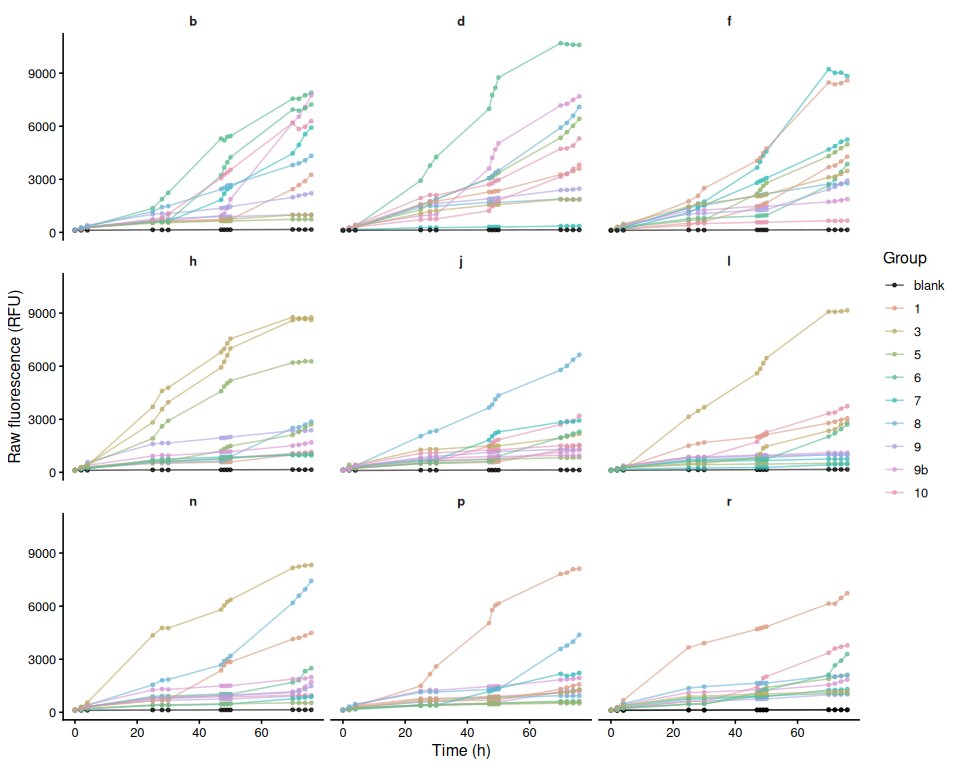
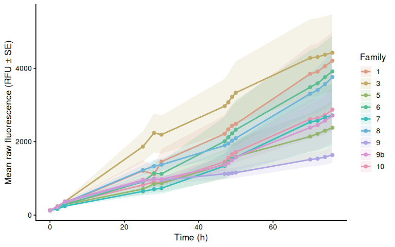
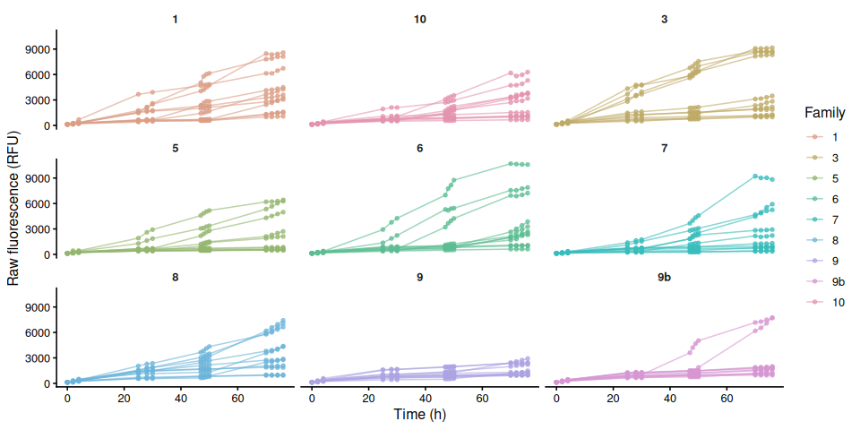
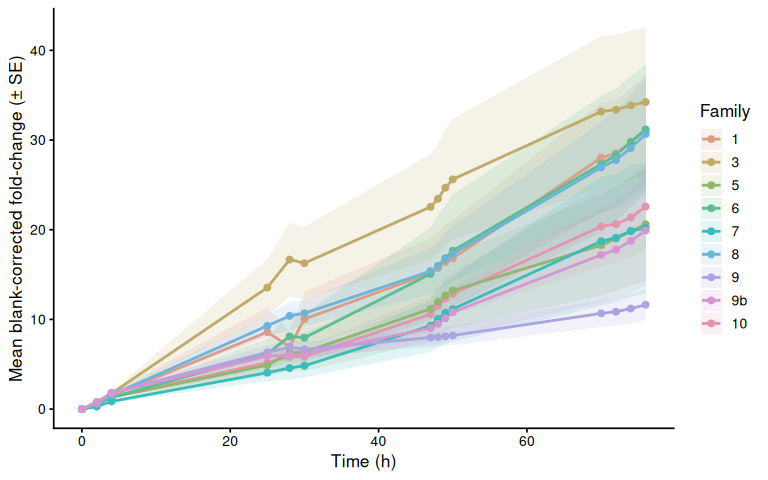
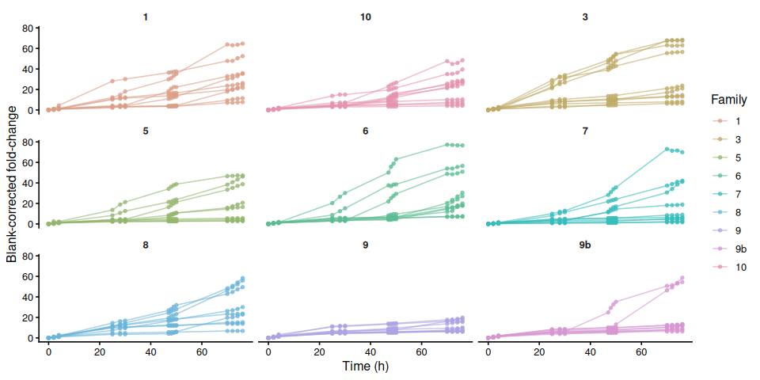
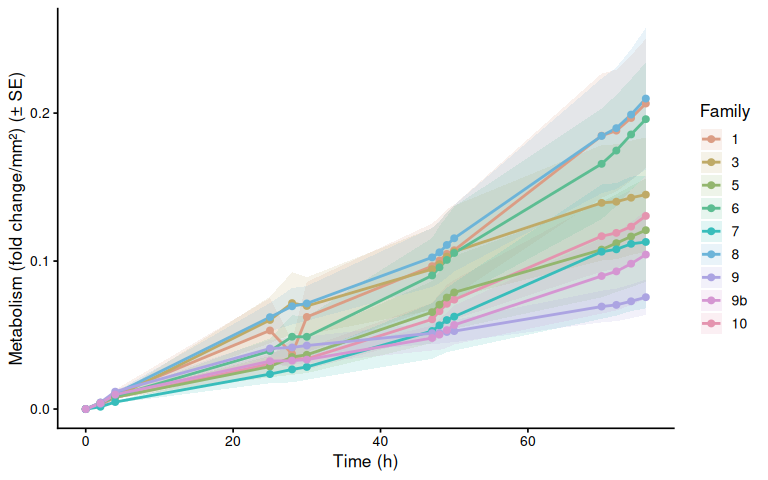
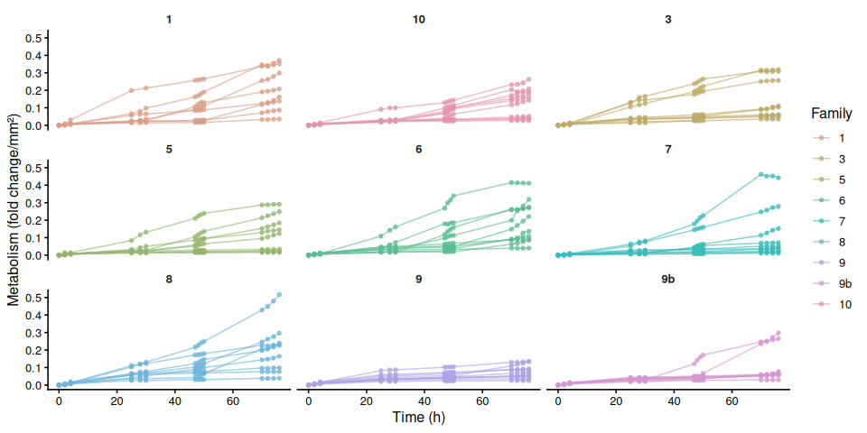
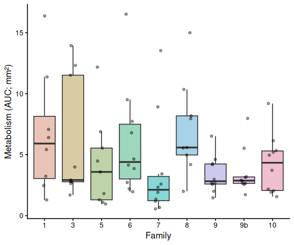

01.00-resazurin-20260511-mgig-freshwater-RT
================
Sam White
2026-05-11

- [1 Background](#1-background)
  - [1.1 Expected inputs](#11-expected-inputs)
  - [1.2 Expected outputs](#12-expected-outputs)
- [2 Setup](#2-setup)
  - [2.1 Knitr options](#21-knitr-options)
  - [2.2 Load libraries](#22-load-libraries)
- [3 Helper Functions](#3-helper-functions)
- [4 Load Data](#4-load-data)
  - [4.1 Plate export files](#41-plate-export-files)
  - [4.2 Plate consistency check](#42-plate-consistency-check)
  - [4.3 Layout file](#43-layout-file)
- [5 Merge Plate Data with Layout](#5-merge-plate-data-with-layout)
- [6 Raw Fluorescence](#6-raw-fluorescence)
  - [6.1 Data frame](#61-data-frame)
  - [6.2 Raw fluorescence by plate (including
    blanks)](#62-raw-fluorescence-by-plate-including-blanks)
  - [6.3 Mean raw fluorescence by
    family](#63-mean-raw-fluorescence-by-family)
  - [6.4 Individual raw fluorescence traces by
    family](#64-individual-raw-fluorescence-traces-by-family)
  - [6.5 Individual raw fluorescence traces by
    treatment](#65-individual-raw-fluorescence-traces-by-treatment)
  - [6.6 Excluded samples](#66-excluded-samples)
- [7 Blank Correction via Fold-Change
  Normalization](#7-blank-correction-via-fold-change-normalization)
  - [7.1 Step 1 – Identify T0 and compute per-sample
    fold-change](#71-step-1--identify-t0-and-compute-per-sample-fold-change)
  - [7.2 Step 2 – Blank fold-change reference per plate per
    timepoint](#72-step-2--blank-fold-change-reference-per-plate-per-timepoint)
  - [7.3 Step 3 – Subtract blank fold-change from sample
    fold-change](#73-step-3--subtract-blank-fold-change-from-sample-fold-change)
- [8 Blank-Corrected Fold-Change](#8-blank-corrected-fold-change)
  - [8.1 Mean by family](#81-mean-by-family)
  - [8.2 Individual traces by family](#82-individual-traces-by-family)
  - [8.3 Individual blank-corrected fold-change traces by
    treatment](#83-individual-blank-corrected-fold-change-traces-by-treatment)
- [9 Metabolism (Size-Normalised
  Fold-Change)](#9-metabolism-size-normalised-fold-change)
  - [9.1 Mean metabolism by family](#91-mean-metabolism-by-family)
  - [9.2 Individual metabolism traces by
    family](#92-individual-metabolism-traces-by-family)
- [10 Time-Series Statistical
  Analysis](#10-time-series-statistical-analysis)
  - [10.1 Results](#101-results)
    - [10.1.1 Metric:
      metabolism_per_area_mm2_measurement](#1011-metric-metabolism_per_area_mm2_measurement)
- [11 AUC Box Plots with Statistical
  Annotations](#11-auc-box-plots-with-statistical-annotations)
- [12 Save Output Data](#12-save-output-data)

# 1 Background

Juvenile oysters from nine USDA families were submerged in 4 mL of room
temperature resazurin working solution prepared with *TAPWATER* in
12-well plates and held at room temperature (~21C) for a total duration
of 76hrs. At each designated timepoints, fluorescence was measured using
a Synergy HTX (Agilent) plate reader.

See `Resazurin/data/20260511-mgig-freshwater-RT/README.md` for full
experimental notes.

## 1.1 Expected inputs

| Path | Description |
|:---|:---|
| `Resazurin/data/20260511-mgig-freshwater-RT/plate-*-T*.txt` | Plate reader fluorescence exports (one file per plate per timepoint) |
| `Resazurin/data/20260511-mgig-freshwater-RT/layout.csv` | Well metadata: plate ID, well ID, blank flag, family groups, sample IDs, area measurements (mm², from ImageJ) |

## 1.2 Expected outputs

All outputs are written to
`Resazurin/outputs/01.00-resazurin-20260511-mgig-freshwater-RT/`.

| File | Description |
|:---|:---|
| `figures/` | All plots generated by this script |
| `auc_all_metrics.csv` | Per-individual AUC values for every active measurement metric |
| `auc_summary.csv` | Group-level AUC summary statistics (mean, SD, SE, median) |
| `metabolism.csv` | Full per-well per-timepoint metabolism data frame |
| `pairwise_stats.csv` | Tukey-adjusted pairwise comparisons from AUC linear models |

# 2 Setup

## 2.1 Knitr options

``` r
knitr::opts_chunk$set(
  echo = TRUE,         # Display code chunks
  eval = TRUE,        # Evaluate code chunks
  warning = FALSE,     # Hide warnings
  message = FALSE,     # Hide messages
  comment = "",         # Prevents appending '##' to beginning of lines in code output
  results = 'hold'     # Holds output so it's all printed together after code chunk
)
```

## 2.2 Load libraries

``` r
library(tidyverse)
library(pracma)       # trapz()
library(lme4)
library(lmerTest)
library(emmeans)
library(multcompView)
library(cowplot)
library(colorspace)   # qualitative_hcl() for large palettes
```

# 3 Helper Functions

``` r
normalize_well_id <- function(x) {
  x <- toupper(trimws(x))
  valid <- str_detect(x, "^[A-Z]+[0-9]+$")
  out <- rep(NA_character_, length(x))
  if (!any(valid)) return(out)
  m <- str_match(x[valid], "^([A-Z]+)([0-9]+)$")
  out[valid] <- paste0(m[, 2], as.integer(m[, 3]))
  out
}

parse_time_hr <- function(path) {
  hit <- str_match(basename(path),
                   "(?i)-T([0-9]+(?:\\.[0-9]+)?)\\.txt$")
  as.numeric(hit[, 2])
}

parse_plate_id <- function(path) {
  hit <- str_match(basename(path),
    "(?i)^plate-([A-Za-z0-9-]+)-T[0-9]+(?:\\.[0-9]+)?\\.txt$")
  id <- hit[, 2]
  ifelse(is.na(id), "unknown", id)
}

extract_results_block <- function(lines) {
  results_idx <- which(trimws(lines) == "Results")
  if (length(results_idx) == 0) stop("No Results section found")
  idx <- results_idx[1]
  header_tokens <- str_split(lines[idx + 1], "\\t")[[1]] |> trimws()
  col_ids <- header_tokens[
    header_tokens != "" & str_detect(header_tokens, "^[0-9]+$")]
  j <- idx + 2
  data_lines <- character()
  while (j <= length(lines)) {
    line <- lines[j]
    if (trimws(line) == "") break
    if (!str_detect(line, "^[A-Za-z]\\t")) break
    data_lines <- c(data_lines, line)
    j <- j + 1
  }
  list(col_ids = col_ids, data_lines = data_lines)
}

parse_plate_export <- function(path) {
  lines <- readLines(path, warn = FALSE)
  res <- extract_results_block(lines)

  map_dfr(res$data_lines, function(line) {
    tokens <- str_split(line, "\\t")[[1]] |> trimws()
    tokens <- tokens[tokens != ""]
    row_letter <- tokens[1]
    nums <- suppressWarnings(as.numeric(tokens[-1]))
    valid_idx <- which(!is.na(nums))
    if (length(valid_idx) == 0) return(tibble())
    vals <- nums[valid_idx]
    n <- min(length(vals), length(res$col_ids))
    tibble(
      row_id  = toupper(row_letter),
      col_id  = as.integer(res$col_ids[seq_len(n)]),
      well_id = normalize_well_id(
        paste0(toupper(row_letter), res$col_ids[seq_len(n)])),
      value   = vals[seq_len(n)]
    )
  }) %>%
    mutate(
      plate_id = str_to_lower(parse_plate_id(path)),
      time_hr  = parse_time_hr(path)
    )
}

trapezoid_auc <- function(time_hr, value) {
  ok <- is.finite(time_hr) & is.finite(value)
  t <- time_hr[ok]
  v <- value[ok]
  if (length(t) < 2) return(NA_real_)
  ord <- order(t)
  t <- t[ord]; v <- v[ord]
  sum(diff(t) * (head(v, -1) + tail(v, -1)) / 2)
}

# Shared helper: extract display unit string from a measurement column name.
# e.g. "area_mm2_measurement" -> "mm²", "weight_mg_measurement" -> "mg"
parse_meas_unit <- function(col_name) {
  unit_raw <- col_name |>
    str_remove("^metabolism_per_") |>
    str_remove("_measurement$") |>
    str_extract("[^_]+$")
  case_when(
    unit_raw == "mm2" ~ "mm²",
    unit_raw == "cm2" ~ "cm²",
    unit_raw == "mm3" ~ "mm³",
    unit_raw == "cm3" ~ "cm³",
    TRUE              ~ unit_raw
  )
}

# y-axis label for metabolism line plots: "fold change/mm²"
metabolism_y_label <- function(col_name) {
  paste0("Metabolism (fold change/", parse_meas_unit(col_name), ")")
}

# y-axis label for AUC box plots: "Metabolism (AUC; mm²)"
auc_y_label <- function(metric_name) {
  paste0("Metabolism (AUC; ", parse_meas_unit(metric_name), ")")
}
```

# 4 Load Data

## 4.1 Plate export files

``` r
proj_root <- rprojroot::find_rstudio_root_file()
data_dir  <- file.path(proj_root, "Resazurin", "data", "20260511-mgig-freshwater-RT")
out_dir   <- file.path(proj_root, "Resazurin", "outputs",
                        "01.00-resazurin-20260511-mgig-freshwater-RT")
fig_dir   <- file.path(out_dir, "figures")

dir.create(fig_dir, recursive = TRUE, showWarnings = FALSE)
dir.create(out_dir, recursive = TRUE, showWarnings = FALSE)

plate_files <- list.files(
  data_dir,
  pattern = "(?i)^plate-.*-T[0-9]+(?:\\.[0-9]+)?\\.txt$",
  full.names = TRUE
)

plate_raw <- map_dfr(plate_files, function(path) {
  tryCatch(parse_plate_export(path),
           error = function(e) {
             message("Parse error in ", basename(path), ": ", e$message)
             tibble()
           })
})

str(plate_raw)
```

    tibble [1,500 × 6] (S3: tbl_df/tbl/data.frame)
     $ row_id  : chr [1:1500] "A" "A" "A" "A" ...
     $ col_id  : int [1:1500] 1 2 3 4 1 2 3 4 1 2 ...
     $ well_id : chr [1:1500] "A1" "A2" "A3" "A4" ...
     $ value   : num [1:1500] 136 126 129 126 129 130 139 126 138 112 ...
     $ plate_id: chr [1:1500] "b" "b" "b" "b" ...
     $ time_hr : num [1:1500] 0 0 0 0 0 0 0 0 0 0 ...

## 4.2 Plate consistency check

Checks that every plate has the same number of wells at every timepoint.
The expected well count is the mode across all plate × timepoint reads.
Any plate with at least one deviating read is flagged and dropped
entirely before any further analysis — removing only the aberrant
timepoint would break the fold-change baseline calculation.

``` r
well_counts <- plate_raw %>%
  group_by(plate_id, time_hr) %>%
  summarise(n_wells = n_distinct(well_id), .groups = "drop")

expected_n_wells <- as.integer(
  names(which.max(table(well_counts$n_wells)))
)

inconsistent_reads <- well_counts %>%
  filter(n_wells != expected_n_wells) %>%
  arrange(plate_id, time_hr)

inconsistent_plate_ids <- unique(inconsistent_reads$plate_id)

if (nrow(inconsistent_reads) > 0) {
  cat("**Plate consistency check FAILED.**",
      "Expected", expected_n_wells, "wells per plate-timepoint read.",
      length(inconsistent_plate_ids),
      "plate(s) have at least one deviating read and are excluded",
      "from all analyses:\n\n")
  cat(knitr::kable(
    inconsistent_reads,
    col.names = c("Plate", "Time (h)", "Wells read"),
    caption   = paste("Expected:", expected_n_wells, "wells per read")
  ), sep = "\n")
  cat("\n")
  plate_raw <- plate_raw %>%
    filter(!plate_id %in% inconsistent_plate_ids)
  message(length(inconsistent_plate_ids),
          " plate(s) removed from plate_raw: ",
          paste(inconsistent_plate_ids, collapse = ", "))
} else {
  cat("Plate consistency check passed: all",
      n_distinct(well_counts$plate_id), "plates have",
      expected_n_wells, "wells at every timepoint.\n")
}
```

Plate consistency check passed: all 9 plates have 12 wells at every
timepoint.

## 4.3 Layout file

``` r
layout_path <- file.path(data_dir, "layout.csv")

layout_raw <- read_csv(layout_path,
                       col_types = cols(.default = "c"),
                       show_col_types = FALSE)

# Standardise column names to snake_case
names(layout_raw) <- names(layout_raw) |>
  str_to_lower() |>
  str_replace_all("[^a-z0-9]+", "_") |>
  str_replace_all("_+", "_") |>
  str_replace("_$", "")

# Normalise plate_id to match plate file ids (strip "plate-" prefix)
layout_clean <- layout_raw %>%
  mutate(
    plate_id = str_remove(str_to_lower(plate_id), "^plate-"),
    well_id  = normalize_well_id(plate_well),
    is_blank = if ("is_blank" %in% names(layout_raw))
      toupper(trimws(is_blank)) %in% c("TRUE", "T", "1", "YES", "Y")
    else
      FALSE
  )

found_exclude_col <- intersect(
  c("exclude_from_analysis", "exclude", "omit", "not_analyzed"),
  names(layout_clean)
)[1]
layout_clean <- layout_clean %>%
  mutate(
    exclude_from_analysis = if (!is.na(found_exclude_col))
      toupper(trimws(.data[[found_exclude_col]])) %in%
        c("TRUE", "T", "1", "YES", "Y")
    else
      FALSE
  )

# Identify measurement columns and group columns
measurement_cols <- names(layout_clean)[
  str_detect(names(layout_clean), "_measurement$")]
group_cols <- names(layout_clean)[
  str_detect(names(layout_clean), "_group$")]

# Cast measurement columns to numeric
layout_clean <- layout_clean %>%
  mutate(across(all_of(measurement_cols),
                ~ suppressWarnings(as.numeric(.x))))

# Determine which measurement columns actually contain finite data
active_meas_cols <- measurement_cols[
  sapply(measurement_cols, function(col)
    any(is.finite(layout_clean[[col]]), na.rm = TRUE))]

# Normalise group values to lowercase so they match colour scale definitions
layout_clean <- layout_clean %>%
  mutate(across(all_of(group_cols),
                ~ str_to_lower(trimws(as.character(.x)))))

message("Group columns: ", paste(group_cols, collapse = ", "))
message("Active measurement columns: ",
        paste(active_meas_cols, collapse = ", "))

str(layout_clean)
```

    tibble [108 × 13] (S3: tbl_df/tbl/data.frame)
     $ plate_id             : chr [1:108] "b" "b" "b" "b" ...
     $ plate_well           : chr [1:108] "A01" "A02" "A03" "A04" ...
     $ is_blank             : logi [1:108] FALSE FALSE FALSE FALSE FALSE FALSE ...
     $ family_id_group      : chr [1:108] "6" "5" "9b" "1" ...
     $ sample_id_group      : chr [1:108] "1" "56" "67" "78" ...
     $ treatment_group      : chr [1:108] NA NA NA NA ...
     $ width_mm_measurement : num [1:108] NA NA NA NA NA NA NA NA NA NA ...
     $ length_mm_measurement: num [1:108] NA NA NA NA NA NA NA NA NA NA ...
     $ weight_mg_measurement: num [1:108] NA NA NA NA NA NA NA NA NA NA ...
     $ area_mm2_measurement : num [1:108] 209 180 197 151 171 ...
     $ imagej_id            : chr [1:108] "2" "3" "5" "5" ...
     $ well_id              : chr [1:108] "A1" "A2" "A3" "A4" ...
     $ exclude_from_analysis: logi [1:108] FALSE FALSE FALSE FALSE FALSE FALSE ...

# 5 Merge Plate Data with Layout

``` r
dat <- plate_raw %>%
  left_join(
    layout_clean %>%
      select(plate_id, well_id, is_blank, exclude_from_analysis,
             any_of("exclude_reason"),
             all_of(group_cols), all_of(measurement_cols)),
    by = c("plate_id", "well_id")
  ) %>%
  mutate(
    is_blank = replace_na(is_blank, FALSE),
    exclude_from_analysis = replace_na(exclude_from_analysis, FALSE)
  )

str(dat)
```

    tibble [1,500 × 15] (S3: tbl_df/tbl/data.frame)
     $ row_id               : chr [1:1500] "A" "A" "A" "A" ...
     $ col_id               : int [1:1500] 1 2 3 4 1 2 3 4 1 2 ...
     $ well_id              : chr [1:1500] "A1" "A2" "A3" "A4" ...
     $ value                : num [1:1500] 136 126 129 126 129 130 139 126 138 112 ...
     $ plate_id             : chr [1:1500] "b" "b" "b" "b" ...
     $ time_hr              : num [1:1500] 0 0 0 0 0 0 0 0 0 0 ...
     $ is_blank             : logi [1:1500] FALSE FALSE FALSE FALSE FALSE FALSE ...
     $ exclude_from_analysis: logi [1:1500] FALSE FALSE FALSE FALSE FALSE FALSE ...
     $ family_id_group      : chr [1:1500] "6" "5" "9b" "1" ...
     $ sample_id_group      : chr [1:1500] "1" "56" "67" "78" ...
     $ treatment_group      : chr [1:1500] NA NA NA NA ...
     $ width_mm_measurement : num [1:1500] NA NA NA NA NA NA NA NA NA NA ...
     $ length_mm_measurement: num [1:1500] NA NA NA NA NA NA NA NA NA NA ...
     $ weight_mg_measurement: num [1:1500] NA NA NA NA NA NA NA NA NA NA ...
     $ area_mm2_measurement : num [1:1500] 209 180 197 151 171 ...

# 6 Raw Fluorescence

## 6.1 Data frame

``` r
# Wells in the plate reader output that have no layout entry get all-NA group
# columns after the join. Keep only wells assigned to at least one group.
active_gc <- intersect(group_cols, names(dat))

raw_df <- dat %>%
  filter(
    !is_blank,
    if (length(active_gc) > 0)
      if_any(all_of(active_gc), ~ !is.na(.))
    else
      TRUE
  ) %>%
  mutate(
    trace_id = if_else(
      !is.na(sample_id_group) & trimws(as.character(sample_id_group)) != "",
      as.character(sample_id_group),
      paste(plate_id, well_id, sep = "_")
    )
  )

families   <- str_sort(unique(na.omit(raw_df$family_id_group)), numeric = TRUE)
treatments <- sort(unique(na.omit(raw_df$treatment_group)))

n_fam <- length(families)
n_trt <- length(treatments)

# Palette strategy:
#   <= 7 groups : Okabe-Ito (gold standard for colorblind-safe figures).
#   >  7 groups : colorspace::qualitative_hcl("Dynamic") scales to any N
#                 using perceptually uniform HCL space — no colour collisions.
# Black (#000000) is excluded from both and reserved for blank wells.
okabe_ito_7 <- c(
  "#E69F00", "#56B4E9", "#009E73", "#F0E442",
  "#0072B2", "#D55E00", "#CC79A7"
)
make_palette <- function(n) {
  if (n == 0L) return(character(0))
  if (n <= length(okabe_ito_7)) return(okabe_ito_7[seq_len(n)])
  colorspace::qualitative_hcl(n, palette = "Dynamic")
}

all_colours   <- make_palette(n_fam + n_trt)
fam_colours   <- setNames(all_colours[seq_len(n_fam)], families)
trt_colours   <- setNames(all_colours[n_fam + seq_len(n_trt)], treatments)

lty_pool <- c("solid", "dashed", "dotted", "dotdash", "longdash")
trt_linetypes <- setNames(
  lty_pool[(seq_len(n_trt) - 1L) %% length(lty_pool) + 1L],
  treatments
)
plate_well_colours <- c(blank = "black", fam_colours)

has_trt <- n_trt > 0

str(raw_df)
```

    tibble [1,376 × 16] (S3: tbl_df/tbl/data.frame)
     $ row_id               : chr [1:1376] "A" "A" "A" "A" ...
     $ col_id               : int [1:1376] 1 2 3 4 1 2 3 4 1 3 ...
     $ well_id              : chr [1:1376] "A1" "A2" "A3" "A4" ...
     $ value                : num [1:1376] 136 126 129 126 129 130 139 126 138 126 ...
     $ plate_id             : chr [1:1376] "b" "b" "b" "b" ...
     $ time_hr              : num [1:1376] 0 0 0 0 0 0 0 0 0 0 ...
     $ is_blank             : logi [1:1376] FALSE FALSE FALSE FALSE FALSE FALSE ...
     $ exclude_from_analysis: logi [1:1376] FALSE FALSE FALSE FALSE FALSE FALSE ...
     $ family_id_group      : chr [1:1376] "6" "5" "9b" "1" ...
     $ sample_id_group      : chr [1:1376] "1" "56" "67" "78" ...
     $ treatment_group      : chr [1:1376] NA NA NA NA ...
     $ width_mm_measurement : num [1:1376] NA NA NA NA NA NA NA NA NA NA ...
     $ length_mm_measurement: num [1:1376] NA NA NA NA NA NA NA NA NA NA ...
     $ weight_mg_measurement: num [1:1376] NA NA NA NA NA NA NA NA NA NA ...
     $ area_mm2_measurement : num [1:1376] 209 180 197 151 171 ...
     $ trace_id             : chr [1:1376] "1" "56" "67" "78" ...

## 6.2 Raw fluorescence by plate (including blanks)

``` r
p_raw_plates <- dat %>%
  filter(is.finite(time_hr), is.finite(value)) %>%
  mutate(
    colour_group = if_else(is_blank, "blank",
                           coalesce(family_id_group, "sample")),
    trace_id     = paste(plate_id, well_id, sep = "_")
  ) %>%
  ggplot(aes(x = time_hr, y = value,
             group = trace_id, colour = colour_group)) +
  geom_line(alpha = 0.6) +
  geom_point(size = 1, alpha = 0.7) +
  facet_wrap(~ plate_id) +
  scale_colour_manual(
    values   = plate_well_colours,
    name     = "Group",
    breaks   = names(plate_well_colours),
    na.value = "grey80"
  ) +
  labs(x = "Time (h)", y = "Raw fluorescence (RFU)") +
  theme_classic(base_size = 12) +
  theme(strip.background = element_blank(),
        strip.text       = element_text(face = "bold"))

p_raw_plates
```

<!-- -->

``` r
ggsave(file.path(fig_dir, "raw_fluor_by_plate.png"),
       p_raw_plates, width = 10, height = 8)
```

## 6.3 Mean raw fluorescence by family

``` r
raw_family_summary <- raw_df %>%
  filter(!is.na(family_id_group), !exclude_from_analysis) %>%
  group_by(family_id_group, treatment_group, time_hr) %>%
  summarise(
    mean_fluor = mean(value, na.rm = TRUE),
    se_fluor   = sd(value, na.rm = TRUE) /
      sqrt(sum(!is.na(value))),
    n          = sum(!is.na(value)),
    .groups    = "drop"
  ) %>%
  mutate(group_var = if (has_trt)
    paste(family_id_group, treatment_group, sep = ".")
  else
    family_id_group)

p_raw_mean <- ggplot(raw_family_summary,
    aes(x = time_hr, y = mean_fluor,
        colour = family_id_group,
        group = group_var)) +
  geom_ribbon(aes(ymin = mean_fluor - se_fluor,
                  ymax = mean_fluor + se_fluor,
                  fill = family_id_group),
              alpha = 0.15, colour = NA) +
  geom_line(
    mapping   = if (has_trt) aes(linetype = treatment_group) else NULL,
    linewidth = 1) +
  geom_point(size = 2) +
  scale_colour_manual(values = fam_colours, name = "Family",
                      breaks = families) +
  scale_fill_manual(values = fam_colours, name = "Family",
                    breaks = families) +
  labs(x = "Time (h)", y = "Mean raw fluorescence (RFU ± SE)") +
  theme_classic(base_size = 13) +
  if (has_trt) scale_linetype_manual(values = trt_linetypes, name = "Treatment") else NULL

p_raw_mean
```

<!-- -->

``` r
ggsave(file.path(fig_dir, "raw_mean_by_family.png"),
       p_raw_mean, width = 8, height = 5)
```

## 6.4 Individual raw fluorescence traces by family

``` r
p_raw_by_family <- raw_df %>%
  filter(!is.na(family_id_group)) %>%
  ggplot(aes(x = time_hr, y = value, group = trace_id,
             colour = .data[[if (has_trt) "treatment_group" else "family_id_group"]])) +
  geom_line(alpha = 0.6) +
  geom_point(size = 1.2, alpha = 0.7) +
  facet_wrap(~ family_id_group) +
  scale_colour_manual(
    values = if (has_trt) trt_colours else fam_colours,
    name   = if (has_trt) "Treatment" else "Family",
    breaks = if (has_trt) treatments else families) +
  labs(x = "Time (h)", y = "Raw fluorescence (RFU)") +
  theme_classic(base_size = 12) +
  theme(strip.background = element_blank(),
        strip.text       = element_text(face = "bold"))

p_raw_by_family
```

<!-- -->

``` r
ggsave(file.path(fig_dir, "raw_individual_by_family.png"),
       p_raw_by_family, width = 10, height = 5)
```

## 6.5 Individual raw fluorescence traces by treatment

``` r
if (has_trt) {
  p_raw_by_treatment <- raw_df %>%
    ggplot(aes(x = time_hr, y = value,
               group = trace_id, colour = family_id_group)) +
    geom_line(alpha = 0.6) +
    geom_point(size = 1.2, alpha = 0.7) +
    facet_wrap(~ treatment_group) +
    scale_colour_manual(values = fam_colours, name = "Family",
                        breaks = families) +
    labs(x = "Time (h)", y = "Raw fluorescence (RFU)") +
    theme_classic(base_size = 12) +
    theme(strip.background = element_blank(),
          strip.text       = element_text(face = "bold"))

  p_raw_by_treatment
  ggsave(file.path(fig_dir, "raw_individual_by_treatment.png"),
         p_raw_by_treatment, width = 10, height = 5)
}
```

## 6.6 Excluded samples

Wells flagged `exclude_from_analysis = TRUE` appear in the raw
fluorescence plots above but are omitted from all analyses that follow.

``` r
excluded_wells <- dat %>%
  filter(!is_blank, exclude_from_analysis) %>%
  mutate(
    sample = if_else(
      !is.na(sample_id_group) & trimws(as.character(sample_id_group)) != "",
      as.character(sample_id_group),
      paste(plate_id, well_id, sep = "_")
    )
  ) %>%
  select(plate_id, well_id, sample, family_id_group, treatment_group,
         any_of("exclude_reason")) %>%
  distinct() %>%
  arrange(plate_id, well_id)

if (nrow(excluded_wells) > 0) {
  col_names <- c("Plate", "Well", "Sample", "Family", "Treatment")
  if ("exclude_reason" %in% names(excluded_wells))
    col_names <- c(col_names, "Reason")
  cat(knitr::kable(excluded_wells, col.names = col_names), sep = "\n")
} else {
  cat("No wells are excluded from analysis.\n")
}
```

No wells are excluded from analysis.

# 7 Blank Correction via Fold-Change Normalization

T0 is the earliest timepoint present in the dataset (not necessarily 0
hr). Sample fold-change is expressed relative to each individual’s T0
reading, resolved by `sample_id_group` when that column is populated —
allowing the same animal to be tracked across plates — or by
`plate_id + well_id` when no sample IDs exist (backward-compatible with
single-plate, multi-timepoint designs). Blank fold-change is the
per-plate mean blank RFU at each timepoint divided by the pooled mean
blank RFU at T0. Subtracting blank fold-change from sample fold-change
removes background fluorescence drift; all samples start at exactly 0 at
T0 by construction.

## 7.1 Step 1 – Identify T0 and compute per-sample fold-change

``` r
# T0 = earliest timepoint present in the dataset
t0_time <- min(dat$time_hr[is.finite(dat$time_hr)], na.rm = TRUE)
message("T0 timepoint: ", t0_time, " hr")

# T0 reference value per individual.
# Resolved by sample_id_group (cross-plate tracking) when available;
# falls back to plate+well for layouts without explicit sample IDs.
t0_all <- dat %>%
  filter(time_hr == t0_time, !is_blank, is.finite(value)) %>%
  mutate(sample_key = if_else(
    !is.na(sample_id_group) & trimws(as.character(sample_id_group)) != "",
    as.character(sample_id_group),
    paste(plate_id, well_id, sep = "_")
  )) %>%
  group_by(sample_key) %>%
  summarise(value_t0 = mean(value, na.rm = TRUE), .groups = "drop")

dat_fc <- dat %>%
  mutate(sample_key = if_else(
    !is_blank &
      !is.na(sample_id_group) & trimws(as.character(sample_id_group)) != "",
    as.character(sample_id_group),
    paste(plate_id, well_id, sep = "_")
  )) %>%
  left_join(t0_all, by = "sample_key") %>%
  mutate(fold_change = if_else(
    !is_blank & is.finite(value_t0) & value_t0 > 0,
    value / value_t0,
    NA_real_
  ))

str(dat_fc)
```

    tibble [1,500 × 18] (S3: tbl_df/tbl/data.frame)
     $ row_id               : chr [1:1500] "A" "A" "A" "A" ...
     $ col_id               : int [1:1500] 1 2 3 4 1 2 3 4 1 2 ...
     $ well_id              : chr [1:1500] "A1" "A2" "A3" "A4" ...
     $ value                : num [1:1500] 136 126 129 126 129 130 139 126 138 112 ...
     $ plate_id             : chr [1:1500] "b" "b" "b" "b" ...
     $ time_hr              : num [1:1500] 0 0 0 0 0 0 0 0 0 0 ...
     $ is_blank             : logi [1:1500] FALSE FALSE FALSE FALSE FALSE FALSE ...
     $ exclude_from_analysis: logi [1:1500] FALSE FALSE FALSE FALSE FALSE FALSE ...
     $ family_id_group      : chr [1:1500] "6" "5" "9b" "1" ...
     $ sample_id_group      : chr [1:1500] "1" "56" "67" "78" ...
     $ treatment_group      : chr [1:1500] NA NA NA NA ...
     $ width_mm_measurement : num [1:1500] NA NA NA NA NA NA NA NA NA NA ...
     $ length_mm_measurement: num [1:1500] NA NA NA NA NA NA NA NA NA NA ...
     $ weight_mg_measurement: num [1:1500] NA NA NA NA NA NA NA NA NA NA ...
     $ area_mm2_measurement : num [1:1500] 209 180 197 151 171 ...
     $ sample_key           : chr [1:1500] "1" "56" "67" "78" ...
     $ value_t0             : num [1:1500] 136 126 129 126 129 130 139 126 138 NA ...
     $ fold_change          : num [1:1500] 1 1 1 1 1 1 1 1 1 NA ...

## 7.2 Step 2 – Blank fold-change reference per plate per timepoint

``` r
# Pooled mean blank RFU at T0 across all T0 plates
mean_blank_t0 <- dat %>%
  filter(is_blank, time_hr == t0_time, is.finite(value)) %>%
  pull(value) %>%
  mean(na.rm = TRUE)

if (!is.finite(mean_blank_t0))
  message("No blank readings found at T0 (", t0_time,
          " hr); blank correction will produce NA.")

# Per-plate per-timepoint mean blank expressed as fold-change relative to T0
blank_fc_ref <- dat %>%
  filter(is_blank, is.finite(value)) %>%
  group_by(plate_id, time_hr) %>%
  summarise(mean_blank_rfu = mean(value, na.rm = TRUE), .groups = "drop") %>%
  mutate(mean_blank_fc = mean_blank_rfu / mean_blank_t0)

str(blank_fc_ref)
```

    tibble [111 × 4] (S3: tbl_df/tbl/data.frame)
     $ plate_id      : chr [1:111] "b" "b" "b" "b" ...
     $ time_hr       : num [1:111] 0 2 4 25 28 30 47 48 49 50 ...
     $ mean_blank_rfu: num [1:111] 112 117 118 144 143 139 153 150 151 151 ...
     $ mean_blank_fc : num [1:111] 1.03 1.07 1.08 1.32 1.31 ...

## 7.3 Step 3 – Subtract blank fold-change from sample fold-change

``` r
samples <- dat_fc %>%
  filter(!is_blank, !exclude_from_analysis) %>%
  mutate(
    trace_id = if_else(
      !is.na(sample_id_group) & trimws(as.character(sample_id_group)) != "",
      as.character(sample_id_group),
      paste(plate_id, well_id, sep = "_")
    )
  ) %>%
  left_join(blank_fc_ref, by = c("plate_id", "time_hr")) %>%
  mutate(corrected_fc = fold_change - mean_blank_fc)

str(samples)
```

    tibble [1,376 × 22] (S3: tbl_df/tbl/data.frame)
     $ row_id               : chr [1:1376] "A" "A" "A" "A" ...
     $ col_id               : int [1:1376] 1 2 3 4 1 2 3 4 1 3 ...
     $ well_id              : chr [1:1376] "A1" "A2" "A3" "A4" ...
     $ value                : num [1:1376] 136 126 129 126 129 130 139 126 138 126 ...
     $ plate_id             : chr [1:1376] "b" "b" "b" "b" ...
     $ time_hr              : num [1:1376] 0 0 0 0 0 0 0 0 0 0 ...
     $ is_blank             : logi [1:1376] FALSE FALSE FALSE FALSE FALSE FALSE ...
     $ exclude_from_analysis: logi [1:1376] FALSE FALSE FALSE FALSE FALSE FALSE ...
     $ family_id_group      : chr [1:1376] "6" "5" "9b" "1" ...
     $ sample_id_group      : chr [1:1376] "1" "56" "67" "78" ...
     $ treatment_group      : chr [1:1376] NA NA NA NA ...
     $ width_mm_measurement : num [1:1376] NA NA NA NA NA NA NA NA NA NA ...
     $ length_mm_measurement: num [1:1376] NA NA NA NA NA NA NA NA NA NA ...
     $ weight_mg_measurement: num [1:1376] NA NA NA NA NA NA NA NA NA NA ...
     $ area_mm2_measurement : num [1:1376] 209 180 197 151 171 ...
     $ sample_key           : chr [1:1376] "1" "56" "67" "78" ...
     $ value_t0             : num [1:1376] 136 126 129 126 129 130 139 126 138 126 ...
     $ fold_change          : num [1:1376] 1 1 1 1 1 1 1 1 1 1 ...
     $ trace_id             : chr [1:1376] "1" "56" "67" "78" ...
     $ mean_blank_rfu       : num [1:1376] 112 112 112 112 112 112 112 112 112 112 ...
     $ mean_blank_fc        : num [1:1376] 1.03 1.03 1.03 1.03 1.03 ...
     $ corrected_fc         : num [1:1376] -0.0286 -0.0286 -0.0286 -0.0286 -0.0286 ...

# 8 Blank-Corrected Fold-Change

## 8.1 Mean by family

``` r
bc_fc_summary <- samples %>%
  filter(!is.na(family_id_group), !exclude_from_analysis) %>%
  group_by(family_id_group, treatment_group, time_hr) %>%
  summarise(
    mean_val = mean(corrected_fc, na.rm = TRUE),
    se_val   = sd(corrected_fc, na.rm = TRUE) /
      sqrt(sum(!is.na(corrected_fc))),
    n        = sum(!is.na(corrected_fc)),
    .groups  = "drop"
  ) %>%
  mutate(group_var = if (has_trt)
    paste(family_id_group, treatment_group, sep = ".")
  else
    family_id_group)

p_bc_fc_mean <- ggplot(bc_fc_summary,
    aes(x = time_hr, y = mean_val,
        colour = family_id_group,
        group = group_var)) +
  geom_ribbon(aes(ymin = mean_val - se_val,
                  ymax = mean_val + se_val,
                  fill = family_id_group),
              alpha = 0.15, colour = NA) +
  geom_line(
    mapping   = if (has_trt) aes(linetype = treatment_group) else NULL,
    linewidth = 1) +
  geom_point(size = 2) +
  scale_colour_manual(values = fam_colours, name = "Family",
                      breaks = families) +
  scale_fill_manual(values = fam_colours, name = "Family",
                    breaks = families) +
  labs(x = "Time (h)",
       y = "Mean blank-corrected fold-change (± SE)") +
  theme_classic(base_size = 13) +
  if (has_trt) scale_linetype_manual(values = trt_linetypes, name = "Treatment") else NULL

p_bc_fc_mean
```

<!-- -->

``` r
ggsave(file.path(fig_dir, "blank_corrected_fc_mean_by_family.png"),
       p_bc_fc_mean, width = 8, height = 5)
```

## 8.2 Individual traces by family

``` r
p_bc_fc_by_family <- samples %>%
  filter(!is.na(family_id_group)) %>%
  ggplot(aes(x = time_hr, y = corrected_fc, group = trace_id,
             colour = .data[[if (has_trt) "treatment_group" else "family_id_group"]])) +
  geom_line(alpha = 0.6) +
  geom_point(size = 1.2, alpha = 0.7) +
  facet_wrap(~ family_id_group) +
  scale_colour_manual(
    values = if (has_trt) trt_colours else fam_colours,
    name   = if (has_trt) "Treatment" else "Family",
    breaks = if (has_trt) treatments else families) +
  labs(x = "Time (h)", y = "Blank-corrected fold-change") +
  theme_classic(base_size = 12) +
  theme(strip.background = element_blank(),
        strip.text       = element_text(face = "bold"))

p_bc_fc_by_family
```

<!-- -->

``` r
ggsave(file.path(fig_dir, "blank_corrected_fc_by_family.png"),
       p_bc_fc_by_family, width = 10, height = 5)
```

## 8.3 Individual blank-corrected fold-change traces by treatment

``` r
if (has_trt) {
  p_bc_fc_by_treatment <- samples %>%
    ggplot(aes(x = time_hr, y = corrected_fc,
               group = trace_id, colour = family_id_group)) +
    geom_line(alpha = 0.6) +
    geom_point(size = 1.2, alpha = 0.7) +
    facet_wrap(~ treatment_group) +
    scale_colour_manual(values = fam_colours, name = "Family",
                        breaks = families) +
    labs(x = "Time (h)", y = "Blank-corrected fold-change") +
    theme_classic(base_size = 12) +
    theme(strip.background = element_blank(),
          strip.text       = element_text(face = "bold"))

  p_bc_fc_by_treatment
  ggsave(file.path(fig_dir, "blank_corrected_fc_by_treatment.png"),
         p_bc_fc_by_treatment, width = 10, height = 5)
}
```

# 9 Metabolism (Size-Normalised Fold-Change)

Blank-corrected fold-change divided by each active measurement column.
This is “metabolism” as defined in Huffmyer et al.

``` r
if (length(active_meas_cols) == 0) {
  message("No active measurement columns: skipping metabolism calculation.")
  metabolism_df <- tibble()
} else {
  metabolism_df <- samples
  for (mc in active_meas_cols) {
    out_col <- paste0("metabolism_per_", mc)
    metabolism_df <- metabolism_df %>%
      mutate(!!out_col := if_else(
        is.finite(.data[[mc]]) & .data[[mc]] > 0 &
          is.finite(corrected_fc),
        corrected_fc / .data[[mc]],
        NA_real_
      ))
  }
}

str(metabolism_df)
```

    tibble [1,376 × 23] (S3: tbl_df/tbl/data.frame)
     $ row_id                             : chr [1:1376] "A" "A" "A" "A" ...
     $ col_id                             : int [1:1376] 1 2 3 4 1 2 3 4 1 3 ...
     $ well_id                            : chr [1:1376] "A1" "A2" "A3" "A4" ...
     $ value                              : num [1:1376] 136 126 129 126 129 130 139 126 138 126 ...
     $ plate_id                           : chr [1:1376] "b" "b" "b" "b" ...
     $ time_hr                            : num [1:1376] 0 0 0 0 0 0 0 0 0 0 ...
     $ is_blank                           : logi [1:1376] FALSE FALSE FALSE FALSE FALSE FALSE ...
     $ exclude_from_analysis              : logi [1:1376] FALSE FALSE FALSE FALSE FALSE FALSE ...
     $ family_id_group                    : chr [1:1376] "6" "5" "9b" "1" ...
     $ sample_id_group                    : chr [1:1376] "1" "56" "67" "78" ...
     $ treatment_group                    : chr [1:1376] NA NA NA NA ...
     $ width_mm_measurement               : num [1:1376] NA NA NA NA NA NA NA NA NA NA ...
     $ length_mm_measurement              : num [1:1376] NA NA NA NA NA NA NA NA NA NA ...
     $ weight_mg_measurement              : num [1:1376] NA NA NA NA NA NA NA NA NA NA ...
     $ area_mm2_measurement               : num [1:1376] 209 180 197 151 171 ...
     $ sample_key                         : chr [1:1376] "1" "56" "67" "78" ...
     $ value_t0                           : num [1:1376] 136 126 129 126 129 130 139 126 138 126 ...
     $ fold_change                        : num [1:1376] 1 1 1 1 1 1 1 1 1 1 ...
     $ trace_id                           : chr [1:1376] "1" "56" "67" "78" ...
     $ mean_blank_rfu                     : num [1:1376] 112 112 112 112 112 112 112 112 112 112 ...
     $ mean_blank_fc                      : num [1:1376] 1.03 1.03 1.03 1.03 1.03 ...
     $ corrected_fc                       : num [1:1376] -0.0286 -0.0286 -0.0286 -0.0286 -0.0286 ...
     $ metabolism_per_area_mm2_measurement: num [1:1376] -0.000137 -0.000159 -0.000145 -0.000189 -0.000167 ...

## 9.1 Mean metabolism by family

``` r
if (nrow(metabolism_df) > 0) {

  metab_cols <- paste0("metabolism_per_", active_meas_cols)

  for (col in metab_cols) {
    if (!col %in% names(metabolism_df)) next
    mc_label <- str_remove(col, "^metabolism_per_")

    metab_summary <- metabolism_df %>%
      filter(!is.na(family_id_group), !exclude_from_analysis) %>%
      group_by(family_id_group, treatment_group, time_hr) %>%
      summarise(
        mean_val = mean(.data[[col]], na.rm = TRUE),
        se_val   = sd(.data[[col]], na.rm = TRUE) /
          sqrt(sum(!is.na(.data[[col]]))),
        .groups  = "drop"
      ) %>%
      mutate(group_var = if (has_trt)
        paste(family_id_group, treatment_group, sep = ".")
      else
        family_id_group)

    p_metab_mean <- ggplot(metab_summary,
        aes(x = time_hr, y = mean_val,
            colour = family_id_group,
            group = group_var)) +
      geom_ribbon(aes(ymin = mean_val - se_val,
                      ymax = mean_val + se_val,
                      fill = family_id_group),
                  alpha = 0.15, colour = NA) +
      geom_line(
        mapping   = if (has_trt) aes(linetype = treatment_group) else NULL,
        linewidth = 1) +
      geom_point(size = 2) +
      scale_colour_manual(values = fam_colours, name = "Family",
                          breaks = families) +
      scale_fill_manual(values = fam_colours, name = "Family",
                        breaks = families) +
      labs(x = "Time (h)",
           y = paste0(metabolism_y_label(col), " (± SE)")) +
      theme_classic(base_size = 13) +
      if (has_trt) scale_linetype_manual(values = trt_linetypes, name = "Treatment") else NULL

    print(p_metab_mean)
    ggsave(
      file.path(fig_dir,
                paste0("metabolism_mean_", mc_label, ".png")),
      p_metab_mean, width = 8, height = 5)
  }
}
```

<!-- -->

## 9.2 Individual metabolism traces by family

``` r
if (nrow(metabolism_df) > 0) {

  for (col in metab_cols) {
    if (!col %in% names(metabolism_df)) next
    mc_label <- str_remove(col, "^metabolism_per_")

    p_metab_by_family <- metabolism_df %>%
      filter(!is.na(family_id_group)) %>%
      ggplot(aes(x = time_hr, y = .data[[col]], group = trace_id,
                 colour = .data[[if (has_trt) "treatment_group" else "family_id_group"]])) +
      geom_line(alpha = 0.6) +
      geom_point(size = 1.2, alpha = 0.7) +
      facet_wrap(~ family_id_group) +
      scale_colour_manual(
        values = if (has_trt) trt_colours else fam_colours,
        name   = if (has_trt) "Treatment" else "Family",
        breaks = if (has_trt) treatments else families) +
      labs(x = "Time (h)", y = metabolism_y_label(col)) +
      theme_classic(base_size = 12) +
      theme(strip.background = element_blank(),
            strip.text       = element_text(face = "bold"))

    print(p_metab_by_family)
    ggsave(
      file.path(fig_dir,
                paste0("metabolism_individual_", mc_label, "_by_family.png")),
      p_metab_by_family, width = 10, height = 5)

    if (has_trt) {
      p_metab_by_treatment <- ggplot(metabolism_df,
          aes(x = time_hr, y = .data[[col]],
              group = trace_id, colour = family_id_group)) +
        geom_line(alpha = 0.6) +
        geom_point(size = 1.2, alpha = 0.7) +
        facet_wrap(~ treatment_group) +
        scale_colour_manual(values = fam_colours, name = "Family",
                            breaks = families) +
        labs(x = "Time (h)", y = metabolism_y_label(col)) +
        theme_classic(base_size = 12) +
        theme(strip.background = element_blank(),
              strip.text       = element_text(face = "bold"))

      print(p_metab_by_treatment)
      ggsave(
        file.path(fig_dir,
                  paste0("metabolism_individual_", mc_label, "_by_treatment.png")),
        p_metab_by_treatment, width = 10, height = 5)
    }
  }
}
```

<!-- -->

# 10 Time-Series Statistical Analysis

Linear mixed effects models test the effect of experimental variables on
metabolism over time. Individual (`sample_id_group`) is included as a
random intercept to account for repeated measures across timepoints.
Type III ANOVA with Satterthwaite’s approximation (lmerTest) assesses
significance; post-hoc pairwise comparisons use estimated marginal means
(emmeans, Tukey adjustment).

``` r
run_ts_stats <- function(df, value_col) {
  has_family    <- "family_id_group" %in% names(df) &&
    length(unique(na.omit(df$family_id_group))) > 1
  has_treatment <- "treatment_group" %in% names(df) &&
    length(unique(na.omit(df$treatment_group))) > 1

  if (!has_family && !has_treatment) return(NULL)

  df <- df %>%
    filter(is.finite(.data[[value_col]]), is.finite(time_hr)) %>%
    mutate(
      time_f     = factor(time_hr),
      individual = factor(trace_id)
    )

  if (nrow(df) == 0) return(NULL)

  if (has_family)    df <- df %>% mutate(family    = factor(family_id_group))
  if (has_treatment) df <- df %>% mutate(treatment = factor(treatment_group))

  if (has_family    && length(unique(na.omit(df$family)))    < 2) return(NULL)
  if (has_treatment && length(unique(na.omit(df$treatment))) < 2) return(NULL)

  fixed <- if (has_family && has_treatment) {
    paste0(value_col, " ~ time_f * family * treatment")
  } else if (has_family) {
    paste0(value_col, " ~ time_f * family")
  } else {
    paste0(value_col, " ~ time_f * treatment")
  }

  model <- lmer(
    as.formula(paste0(fixed, " + (1 | individual)")),
    data = df
  )

  anova_res <- anova(model, type = 3, ddf = "Satterthwaite")

  # Pairwise comparisons of group combinations at each timepoint
  emm_spec <- if (has_family && has_treatment) {
    ~ family * treatment | time_f
  } else if (has_family) {
    ~ family | time_f
  } else {
    ~ treatment | time_f
  }

  emm       <- emmeans(model, emm_spec)
  pairs_res <- as.data.frame(pairs(emm, adjust = "tukey"))

  # Main-effect marginal means (collapsed across time)
  emm_main <- if (has_family && has_treatment) {
    emmeans(model, ~ family * treatment)
  } else if (has_family) {
    emmeans(model, ~ family)
  } else {
    emmeans(model, ~ treatment)
  }

  pairs_main <- as.data.frame(pairs(emm_main, adjust = "tukey"))

  list(
    model         = model,
    anova         = anova_res,
    pairs_by_time = pairs_res,
    pairs_main    = pairs_main,
    has_family    = has_family,
    has_treatment = has_treatment
  )
}

ts_stats <- list()
if (nrow(metabolism_df) > 0) {
  for (mc in active_meas_cols) {
    col <- paste0("metabolism_per_", mc)
    if (col %in% names(metabolism_df))
      ts_stats[[col]] <- run_ts_stats(metabolism_df, col)
  }
}
```

## 10.1 Results

``` r
for (col in names(ts_stats)) {
  res <- ts_stats[[col]]
  if (is.null(res)) next

  cat("\n\n----\n### Metric:", col, "\n\n")

  cat("**Type III ANOVA (Satterthwaite approximation):**\n")
  print(res$anova)

  cat("\n**Marginal means – main effects (collapsed across time):**\n")
  print(res$pairs_main)

  cat("\n**Pairwise comparisons by timepoint (Tukey):**\n")
  print(res$pairs_by_time)
}
```

| \### Metric: metabolism_per_area_mm2_measurement |
|:---|
| Signif. codes: 0 ‘***’ 0.001 ’**’ 0.01 ’*’ 0.05 ‘.’ 0.1 ’ ’ 1 |
| **Marginal means – main effects (collapsed across time):** contrast estimate SE df t.ratio p.value 1 - 10 0.03532719 0.02563264 76.00 1.378 0.9025 1 - 3 0.01363661 0.02625820 76.00 0.519 0.9999 1 - 5 0.03617335 0.02625820 76.00 1.378 0.9028 1 - 6 0.00771268 0.02563561 76.03 0.301 1.0000 1 - 7 0.04386998 0.02563264 76.00 1.711 0.7377 1 - 8 -0.00445347 0.02625820 76.00 -0.170 1.0000 1 - 9 0.05207486 0.02563264 76.00 2.032 0.5269 1 - 9b 0.04733486 0.02563264 76.00 1.847 0.6514 10 - 3 -0.02169059 0.02482843 75.99 -0.874 0.9937 10 - 5 0.00084615 0.02482843 75.99 0.034 1.0000 10 - 6 -0.02761452 0.02416904 76.03 -1.143 0.9655 10 - 7 0.00854278 0.02416589 75.99 0.354 1.0000 10 - 8 -0.03978066 0.02482843 75.99 -1.602 0.8006 10 - 9 0.01674767 0.02416589 75.99 0.693 0.9987 10 - 9b 0.01200767 0.02416589 75.99 0.497 0.9999 3 - 5 0.02253674 0.02547375 76.00 0.885 0.9932 3 - 6 -0.00592393 0.02483150 76.03 -0.239 1.0000 3 - 7 0.03023337 0.02482843 75.99 1.218 0.9501 3 - 8 -0.01809008 0.02547375 76.00 -0.710 0.9985 3 - 9 0.03843826 0.02482843 75.99 1.548 0.8289 3 - 9b 0.03369825 0.02482843 75.99 1.357 0.9100 5 - 6 -0.02846067 0.02483150 76.03 -1.146 0.9649 5 - 7 0.00769663 0.02482843 75.99 0.310 1.0000 5 - 8 -0.04062682 0.02547375 76.00 -1.595 0.8046 5 - 9 0.01590151 0.02482843 75.99 0.640 0.9993 5 - 9b 0.01116151 0.02482843 75.99 0.450 1.0000 6 - 7 0.03615730 0.02416904 76.03 1.496 0.8540 6 - 8 -0.01216615 0.02483150 76.03 -0.490 0.9999 6 - 9 0.04436219 0.02416904 76.03 1.835 0.6588 6 - 9b 0.03962218 0.02416904 76.03 1.639 0.7801 7 - 8 -0.04832345 0.02482843 75.99 -1.946 0.5846 7 - 9 0.00820488 0.02416589 75.99 0.340 1.0000 7 - 9b 0.00346488 0.02416589 75.99 0.143 1.0000 8 - 9 0.05652833 0.02482843 75.99 2.277 0.3690 8 - 9b 0.05178833 0.02482843 75.99 2.086 0.4905 9 - 9b -0.00474000 0.02416589 75.99 -0.196 1.0000 |
| Results are averaged over the levels of: time_f Degrees-of-freedom method: kenward-roger P value adjustment: tukey method for comparing a family of 9 estimates |
| **Pairwise comparisons by timepoint (Tukey):** time_f = 0: contrast estimate SE df t.ratio p.value 1 - 10 0.00001527 0.03278759 197.25 0.000 1.0000 1 - 3 -0.00000053 0.03358741 197.25 0.000 1.0000 1 - 5 -0.00001105 0.03358741 197.25 0.000 1.0000 1 - 6 -0.00002522 0.03278759 197.25 -0.001 1.0000 1 - 7 0.00000484 0.03278759 197.25 0.000 1.0000 1 - 8 0.00003456 0.03358741 197.25 0.001 1.0000 1 - 9 -0.00002859 0.03278759 197.25 -0.001 1.0000 1 - 9b -0.00001783 0.03278759 197.25 -0.001 1.0000 10 - 3 -0.00001579 0.03175951 197.25 0.000 1.0000 10 - 5 -0.00002631 0.03175951 197.25 -0.001 1.0000 10 - 6 -0.00004049 0.03091244 197.25 -0.001 1.0000 10 - 7 -0.00001043 0.03091244 197.25 0.000 1.0000 10 - 8 0.00001929 0.03175951 197.25 0.001 1.0000 10 - 9 -0.00004386 0.03091244 197.25 -0.001 1.0000 10 - 9b -0.00003310 0.03091244 197.25 -0.001 1.0000 3 - 5 -0.00001052 0.03258457 197.25 0.000 1.0000 3 - 6 -0.00002469 0.03175951 197.25 -0.001 1.0000 3 - 7 0.00000537 0.03175951 197.25 0.000 1.0000 3 - 8 0.00003509 0.03258457 197.25 0.001 1.0000 3 - 9 -0.00002807 0.03175951 197.25 -0.001 1.0000 3 - 9b -0.00001730 0.03175951 197.25 -0.001 1.0000 5 - 6 -0.00001418 0.03175951 197.25 0.000 1.0000 5 - 7 0.00001588 0.03175951 197.25 0.000 1.0000 5 - 8 0.00004561 0.03258457 197.25 0.001 1.0000 5 - 9 -0.00001755 0.03175951 197.25 -0.001 1.0000 5 - 9b -0.00000678 0.03175951 197.25 0.000 1.0000 6 - 7 0.00003006 0.03091244 197.25 0.001 1.0000 6 - 8 0.00005978 0.03175951 197.25 0.002 1.0000 6 - 9 -0.00000337 0.03091244 197.25 0.000 1.0000 6 - 9b 0.00000739 0.03091244 197.25 0.000 1.0000 7 - 8 0.00002972 0.03175951 197.25 0.001 1.0000 7 - 9 -0.00003343 0.03091244 197.25 -0.001 1.0000 7 - 9b -0.00002267 0.03091244 197.25 -0.001 1.0000 8 - 9 -0.00006316 0.03175951 197.25 -0.002 1.0000 8 - 9b -0.00005239 0.03175951 197.25 -0.002 1.0000 9 - 9b 0.00001077 0.03091244 197.25 0.000 1.0000 |
| time_f = 2: contrast estimate SE df t.ratio p.value 1 - 10 0.00057182 0.03278759 197.25 0.017 1.0000 1 - 3 -0.00044432 0.03358741 197.25 -0.013 1.0000 1 - 5 -0.00085421 0.03358741 197.25 -0.025 1.0000 1 - 6 -0.00095467 0.03278759 197.25 -0.029 1.0000 1 - 7 0.00179460 0.03278759 197.25 0.055 1.0000 1 - 8 -0.00012822 0.03358741 197.25 -0.004 1.0000 1 - 9 -0.00112413 0.03278759 197.25 -0.034 1.0000 1 - 9b -0.00051264 0.03278759 197.25 -0.016 1.0000 10 - 3 -0.00101614 0.03175951 197.25 -0.032 1.0000 10 - 5 -0.00142604 0.03175951 197.25 -0.045 1.0000 10 - 6 -0.00152650 0.03091244 197.25 -0.049 1.0000 10 - 7 0.00122277 0.03091244 197.25 0.040 1.0000 10 - 8 -0.00070004 0.03175951 197.25 -0.022 1.0000 10 - 9 -0.00169595 0.03091244 197.25 -0.055 1.0000 10 - 9b -0.00108446 0.03091244 197.25 -0.035 1.0000 3 - 5 -0.00040990 0.03258457 197.25 -0.013 1.0000 3 - 6 -0.00051036 0.03175951 197.25 -0.016 1.0000 3 - 7 0.00223891 0.03175951 197.25 0.070 1.0000 3 - 8 0.00031610 0.03258457 197.25 0.010 1.0000 3 - 9 -0.00067981 0.03175951 197.25 -0.021 1.0000 3 - 9b -0.00006832 0.03175951 197.25 -0.002 1.0000 5 - 6 -0.00010046 0.03175951 197.25 -0.003 1.0000 5 - 7 0.00264881 0.03175951 197.25 0.083 1.0000 5 - 8 0.00072599 0.03258457 197.25 0.022 1.0000 5 - 9 -0.00026992 0.03175951 197.25 -0.008 1.0000 5 - 9b 0.00034158 0.03175951 197.25 0.011 1.0000 6 - 7 0.00274927 0.03091244 197.25 0.089 1.0000 6 - 8 0.00082645 0.03175951 197.25 0.026 1.0000 6 - 9 -0.00016946 0.03091244 197.25 -0.005 1.0000 6 - 9b 0.00044203 0.03091244 197.25 0.014 1.0000 7 - 8 -0.00192282 0.03175951 197.25 -0.061 1.0000 7 - 9 -0.00291873 0.03091244 197.25 -0.094 1.0000 7 - 9b -0.00230724 0.03091244 197.25 -0.075 1.0000 8 - 9 -0.00099591 0.03175951 197.25 -0.031 1.0000 8 - 9b -0.00038442 0.03175951 197.25 -0.012 1.0000 9 - 9b 0.00061149 0.03091244 197.25 0.020 1.0000 |
| time_f = 4: contrast estimate SE df t.ratio p.value 1 - 10 0.00223249 0.03278759 197.25 0.068 1.0000 1 - 3 0.00190934 0.03358741 197.25 0.057 1.0000 1 - 5 0.00208667 0.03358741 197.25 0.062 1.0000 1 - 6 0.00133478 0.03278759 197.25 0.041 1.0000 1 - 7 0.00529548 0.03278759 197.25 0.162 1.0000 1 - 8 -0.00026695 0.03358741 197.25 -0.008 1.0000 1 - 9 -0.00171738 0.03278759 197.25 -0.052 1.0000 1 - 9b 0.00030383 0.03278759 197.25 0.009 1.0000 10 - 3 -0.00032315 0.03175951 197.25 -0.010 1.0000 10 - 5 -0.00014582 0.03175951 197.25 -0.005 1.0000 10 - 6 -0.00089772 0.03091244 197.25 -0.029 1.0000 10 - 7 0.00306298 0.03091244 197.25 0.099 1.0000 10 - 8 -0.00249944 0.03175951 197.25 -0.079 1.0000 10 - 9 -0.00394987 0.03091244 197.25 -0.128 1.0000 10 - 9b -0.00192866 0.03091244 197.25 -0.062 1.0000 3 - 5 0.00017733 0.03258457 197.25 0.005 1.0000 3 - 6 -0.00057456 0.03175951 197.25 -0.018 1.0000 3 - 7 0.00338614 0.03175951 197.25 0.107 1.0000 3 - 8 -0.00217629 0.03258457 197.25 -0.067 1.0000 3 - 9 -0.00362672 0.03175951 197.25 -0.114 1.0000 3 - 9b -0.00160551 0.03175951 197.25 -0.051 1.0000 5 - 6 -0.00075190 0.03175951 197.25 -0.024 1.0000 5 - 7 0.00320880 0.03175951 197.25 0.101 1.0000 5 - 8 -0.00235362 0.03258457 197.25 -0.072 1.0000 5 - 9 -0.00380406 0.03175951 197.25 -0.120 1.0000 5 - 9b -0.00178284 0.03175951 197.25 -0.056 1.0000 6 - 7 0.00396070 0.03091244 197.25 0.128 1.0000 6 - 8 -0.00160172 0.03175951 197.25 -0.050 1.0000 6 - 9 -0.00305216 0.03091244 197.25 -0.099 1.0000 6 - 9b -0.00103095 0.03091244 197.25 -0.033 1.0000 7 - 8 -0.00556242 0.03175951 197.25 -0.175 1.0000 7 - 9 -0.00701286 0.03091244 197.25 -0.227 1.0000 7 - 9b -0.00499165 0.03091244 197.25 -0.161 1.0000 8 - 9 -0.00145044 0.03175951 197.25 -0.046 1.0000 8 - 9b 0.00057078 0.03175951 197.25 0.018 1.0000 9 - 9b 0.00202121 0.03091244 197.25 0.065 1.0000 |
| time_f = 25: contrast estimate SE df t.ratio p.value 1 - 10 0.02258053 0.03278759 197.25 0.689 0.9989 1 - 3 -0.00708162 0.03358741 197.25 -0.211 1.0000 1 - 5 0.02440331 0.03358741 197.25 0.727 0.9984 1 - 6 0.01390546 0.03278759 197.25 0.424 1.0000 1 - 7 0.02949012 0.03278759 197.25 0.899 0.9928 1 - 8 -0.00897729 0.03358741 197.25 -0.267 1.0000 1 - 9 0.01220911 0.03278759 197.25 0.372 1.0000 1 - 9b 0.02074767 0.03278759 197.25 0.633 0.9994 10 - 3 -0.02966215 0.03175951 197.25 -0.934 0.9907 10 - 5 0.00182278 0.03175951 197.25 0.057 1.0000 10 - 6 -0.00867508 0.03091244 197.25 -0.281 1.0000 10 - 7 0.00690959 0.03091244 197.25 0.224 1.0000 10 - 8 -0.03155783 0.03175951 197.25 -0.994 0.9861 10 - 9 -0.01037143 0.03091244 197.25 -0.336 1.0000 10 - 9b -0.00183287 0.03091244 197.25 -0.059 1.0000 3 - 5 0.03148493 0.03258457 197.25 0.966 0.9884 3 - 6 0.02098708 0.03175951 197.25 0.661 0.9992 3 - 7 0.03657174 0.03175951 197.25 1.152 0.9653 3 - 8 -0.00189567 0.03258457 197.25 -0.058 1.0000 3 - 9 0.01929072 0.03175951 197.25 0.607 0.9996 3 - 9b 0.02782928 0.03175951 197.25 0.876 0.9940 5 - 6 -0.01049786 0.03175951 197.25 -0.331 1.0000 5 - 7 0.00508681 0.03175951 197.25 0.160 1.0000 5 - 8 -0.03338061 0.03258457 197.25 -1.024 0.9831 5 - 9 -0.01219421 0.03175951 197.25 -0.384 1.0000 5 - 9b -0.00365565 0.03175951 197.25 -0.115 1.0000 6 - 7 0.01558466 0.03091244 197.25 0.504 0.9999 6 - 8 -0.02288275 0.03175951 197.25 -0.721 0.9985 6 - 9 -0.00169635 0.03091244 197.25 -0.055 1.0000 6 - 9b 0.00684221 0.03091244 197.25 0.221 1.0000 7 - 8 -0.03846741 0.03175951 197.25 -1.211 0.9533 7 - 9 -0.01728101 0.03091244 197.25 -0.559 0.9998 7 - 9b -0.00874245 0.03091244 197.25 -0.283 1.0000 8 - 9 0.02118640 0.03175951 197.25 0.667 0.9991 8 - 9b 0.02972496 0.03175951 197.25 0.936 0.9906 9 - 9b 0.00853856 0.03091244 197.25 0.276 1.0000 |
| time_f = 28: contrast estimate SE df t.ratio p.value 1 - 10 0.01728684 0.03372337 218.47 0.513 0.9999 1 - 3 -0.01202667 0.03458788 219.43 -0.348 1.0000 1 - 5 0.01762056 0.03458788 219.43 0.509 0.9999 1 - 6 0.00936464 0.03416294 228.85 0.274 1.0000 1 - 7 0.02949339 0.03372337 218.47 0.875 0.9941 1 - 8 -0.01105982 0.03458788 219.43 -0.320 1.0000 1 - 9 0.01086469 0.03372337 218.47 0.322 1.0000 1 - 9b 0.02229261 0.03372337 218.47 0.661 0.9992 10 - 3 -0.02931350 0.03259417 216.75 -0.899 0.9928 10 - 5 0.00033372 0.03259417 216.75 0.010 1.0000 10 - 6 -0.00792220 0.03214289 227.17 -0.246 1.0000 10 - 7 0.01220655 0.03167529 215.53 0.385 1.0000 10 - 8 -0.02834666 0.03259417 216.75 -0.870 0.9943 10 - 9 -0.00642215 0.03167529 215.53 -0.203 1.0000 10 - 9b 0.00500578 0.03167529 215.53 0.158 1.0000 3 - 5 0.02964723 0.03348785 217.85 0.885 0.9935 3 - 6 0.02139131 0.03304877 227.79 0.647 0.9993 3 - 7 0.04152005 0.03259417 216.75 1.274 0.9379 3 - 8 0.00096685 0.03348785 217.85 0.029 1.0000 3 - 9 0.02289136 0.03259417 216.75 0.702 0.9987 3 - 9b 0.03431928 0.03259417 216.75 1.053 0.9800 5 - 6 -0.00825592 0.03304877 227.79 -0.250 1.0000 5 - 7 0.01187282 0.03259417 216.75 0.364 1.0000 5 - 8 -0.02868038 0.03348785 217.85 -0.856 0.9948 5 - 9 -0.00675587 0.03259417 216.75 -0.207 1.0000 5 - 9b 0.00467205 0.03259417 216.75 0.143 1.0000 6 - 7 0.02012874 0.03214289 227.17 0.626 0.9994 6 - 8 -0.02042446 0.03304877 227.79 -0.618 0.9995 6 - 9 0.00150005 0.03214289 227.17 0.047 1.0000 6 - 9b 0.01292797 0.03214289 227.17 0.402 1.0000 7 - 8 -0.04055320 0.03259417 216.75 -1.244 0.9456 7 - 9 -0.01862869 0.03167529 215.53 -0.588 0.9997 7 - 9b -0.00720077 0.03167529 215.53 -0.227 1.0000 8 - 9 0.02192451 0.03259417 216.75 0.673 0.9991 8 - 9b 0.03335243 0.03259417 216.75 1.023 0.9833 9 - 9b 0.01142792 0.03167529 215.53 0.361 1.0000 |
| time_f = 30: contrast estimate SE df t.ratio p.value 1 - 10 0.02826538 0.03278759 197.25 0.862 0.9946 1 - 3 -0.00742120 0.03358741 197.25 -0.221 1.0000 1 - 5 0.02557004 0.03358741 197.25 0.761 0.9977 1 - 6 0.01340913 0.03278759 197.25 0.409 1.0000 1 - 7 0.03378569 0.03278759 197.25 1.030 0.9825 1 - 8 -0.00913466 0.03358741 197.25 -0.272 1.0000 1 - 9 0.01930065 0.03278759 197.25 0.589 0.9996 1 - 9b 0.02884813 0.03278759 197.25 0.880 0.9938 10 - 3 -0.03568658 0.03175951 197.25 -1.124 0.9700 10 - 5 -0.00269534 0.03175951 197.25 -0.085 1.0000 10 - 6 -0.01485625 0.03091244 197.25 -0.481 0.9999 10 - 7 0.00552031 0.03091244 197.25 0.179 1.0000 10 - 8 -0.03740004 0.03175951 197.25 -1.178 0.9603 10 - 9 -0.00896474 0.03091244 197.25 -0.290 1.0000 10 - 9b 0.00058275 0.03091244 197.25 0.019 1.0000 3 - 5 0.03299124 0.03258457 197.25 1.012 0.9843 3 - 6 0.02083033 0.03175951 197.25 0.656 0.9992 3 - 7 0.04120689 0.03175951 197.25 1.297 0.9311 3 - 8 -0.00171346 0.03258457 197.25 -0.053 1.0000 3 - 9 0.02672185 0.03175951 197.25 0.841 0.9954 3 - 9b 0.03626933 0.03175951 197.25 1.142 0.9670 5 - 6 -0.01216091 0.03175951 197.25 -0.383 1.0000 5 - 7 0.00821565 0.03175951 197.25 0.259 1.0000 5 - 8 -0.03470470 0.03258457 197.25 -1.065 0.9784 5 - 9 -0.00626939 0.03175951 197.25 -0.197 1.0000 5 - 9b 0.00327809 0.03175951 197.25 0.103 1.0000 6 - 7 0.02037656 0.03091244 197.25 0.659 0.9992 6 - 8 -0.02254379 0.03175951 197.25 -0.710 0.9986 6 - 9 0.00589151 0.03091244 197.25 0.191 1.0000 6 - 9b 0.01543900 0.03091244 197.25 0.499 0.9999 7 - 8 -0.04292035 0.03175951 197.25 -1.351 0.9142 7 - 9 -0.01448505 0.03091244 197.25 -0.469 0.9999 7 - 9b -0.00493756 0.03091244 197.25 -0.160 1.0000 8 - 9 0.02843531 0.03175951 197.25 0.895 0.9930 8 - 9b 0.03798279 0.03175951 197.25 1.196 0.9566 9 - 9b 0.00954748 0.03091244 197.25 0.309 1.0000 |
| time_f = 47: contrast estimate SE df t.ratio p.value 1 - 10 0.03592938 0.03278759 197.25 1.096 0.9743 1 - 3 0.00202235 0.03358741 197.25 0.060 1.0000 1 - 5 0.03109733 0.03358741 197.25 0.926 0.9913 1 - 6 0.00629983 0.03278759 197.25 0.192 1.0000 1 - 7 0.04381018 0.03278759 197.25 1.336 0.9192 1 - 8 -0.00592137 0.03358741 197.25 -0.176 1.0000 1 - 9 0.04530431 0.03278759 197.25 1.382 0.9035 1 - 9b 0.04854759 0.03278759 197.25 1.481 0.8633 10 - 3 -0.03390703 0.03175951 197.25 -1.068 0.9781 10 - 5 -0.00483205 0.03175951 197.25 -0.152 1.0000 10 - 6 -0.02962955 0.03091244 197.25 -0.958 0.9890 10 - 7 0.00788080 0.03091244 197.25 0.255 1.0000 10 - 8 -0.04185075 0.03175951 197.25 -1.318 0.9250 10 - 9 0.00937493 0.03091244 197.25 0.303 1.0000 10 - 9b 0.01261821 0.03091244 197.25 0.408 1.0000 3 - 5 0.02907498 0.03258457 197.25 0.892 0.9932 3 - 6 0.00427748 0.03175951 197.25 0.135 1.0000 3 - 7 0.04178783 0.03175951 197.25 1.316 0.9256 3 - 8 -0.00794372 0.03258457 197.25 -0.244 1.0000 3 - 9 0.04328196 0.03175951 197.25 1.363 0.9103 3 - 9b 0.04652524 0.03175951 197.25 1.465 0.8703 5 - 6 -0.02479750 0.03175951 197.25 -0.781 0.9973 5 - 7 0.01271285 0.03175951 197.25 0.400 1.0000 5 - 8 -0.03701870 0.03258457 197.25 -1.136 0.9680 5 - 9 0.01420698 0.03175951 197.25 0.447 1.0000 5 - 9b 0.01745025 0.03175951 197.25 0.549 0.9998 6 - 7 0.03751035 0.03091244 197.25 1.213 0.9528 6 - 8 -0.01222120 0.03175951 197.25 -0.385 1.0000 6 - 9 0.03900448 0.03091244 197.25 1.262 0.9410 6 - 9b 0.04224776 0.03091244 197.25 1.367 0.9089 7 - 8 -0.04973155 0.03175951 197.25 -1.566 0.8220 7 - 9 0.00149413 0.03091244 197.25 0.048 1.0000 7 - 9b 0.00473741 0.03091244 197.25 0.153 1.0000 8 - 9 0.05122568 0.03175951 197.25 1.613 0.7968 8 - 9b 0.05446895 0.03175951 197.25 1.715 0.7367 9 - 9b 0.00324328 0.03091244 197.25 0.105 1.0000 |
| time_f = 48: contrast estimate SE df t.ratio p.value 1 - 10 0.03421648 0.03278759 197.25 1.044 0.9810 1 - 3 0.00238079 0.03358741 197.25 0.071 1.0000 1 - 5 0.02983099 0.03358741 197.25 0.888 0.9934 1 - 6 0.00456640 0.03278759 197.25 0.139 1.0000 1 - 7 0.04376769 0.03278759 197.25 1.335 0.9196 1 - 8 -0.00558470 0.03358741 197.25 -0.166 1.0000 1 - 9 0.04886712 0.03278759 197.25 1.490 0.8589 1 - 9b 0.05003674 0.03278759 197.25 1.526 0.8420 10 - 3 -0.03183569 0.03175951 197.25 -1.002 0.9853 10 - 5 -0.00438548 0.03175951 197.25 -0.138 1.0000 10 - 6 -0.02965007 0.03091244 197.25 -0.959 0.9890 10 - 7 0.00955121 0.03091244 197.25 0.309 1.0000 10 - 8 -0.03980117 0.03175951 197.25 -1.253 0.9432 10 - 9 0.01465064 0.03091244 197.25 0.474 0.9999 10 - 9b 0.01582027 0.03091244 197.25 0.512 0.9999 3 - 5 0.02745020 0.03258457 197.25 0.842 0.9954 3 - 6 0.00218561 0.03175951 197.25 0.069 1.0000 3 - 7 0.04138690 0.03175951 197.25 1.303 0.9295 3 - 8 -0.00796549 0.03258457 197.25 -0.244 1.0000 3 - 9 0.04648633 0.03175951 197.25 1.464 0.8708 3 - 9b 0.04765595 0.03175951 197.25 1.501 0.8542 5 - 6 -0.02526459 0.03175951 197.25 -0.795 0.9969 5 - 7 0.01393670 0.03175951 197.25 0.439 1.0000 5 - 8 -0.03541569 0.03258457 197.25 -1.087 0.9755 5 - 9 0.01903613 0.03175951 197.25 0.599 0.9996 5 - 9b 0.02020575 0.03175951 197.25 0.636 0.9994 6 - 7 0.03920129 0.03091244 197.25 1.268 0.9393 6 - 8 -0.01015110 0.03175951 197.25 -0.320 1.0000 6 - 9 0.04430072 0.03091244 197.25 1.433 0.8837 6 - 9b 0.04547034 0.03091244 197.25 1.471 0.8676 7 - 8 -0.04935239 0.03175951 197.25 -1.554 0.8282 7 - 9 0.00509943 0.03091244 197.25 0.165 1.0000 7 - 9b 0.00626905 0.03091244 197.25 0.203 1.0000 8 - 9 0.05445182 0.03175951 197.25 1.715 0.7370 8 - 9b 0.05562144 0.03175951 197.25 1.751 0.7138 9 - 9b 0.00116962 0.03091244 197.25 0.038 1.0000 |
| time_f = 49: contrast estimate SE df t.ratio p.value 1 - 10 0.03372546 0.03278759 197.25 1.029 0.9827 1 - 3 0.00178159 0.03358741 197.25 0.053 1.0000 1 - 5 0.02950183 0.03358741 197.25 0.878 0.9939 1 - 6 0.00406324 0.03278759 197.25 0.124 1.0000 1 - 7 0.04469446 0.03278759 197.25 1.363 0.9101 1 - 8 -0.00604261 0.03358741 197.25 -0.180 1.0000 1 - 9 0.05276528 0.03278759 197.25 1.609 0.7988 1 - 9b 0.05148552 0.03278759 197.25 1.570 0.8197 10 - 3 -0.03194387 0.03175951 197.25 -1.006 0.9850 10 - 5 -0.00422362 0.03175951 197.25 -0.133 1.0000 10 - 6 -0.02966222 0.03091244 197.25 -0.960 0.9889 10 - 7 0.01096900 0.03091244 197.25 0.355 1.0000 10 - 8 -0.03976807 0.03175951 197.25 -1.252 0.9435 10 - 9 0.01903982 0.03091244 197.25 0.616 0.9995 10 - 9b 0.01776006 0.03091244 197.25 0.575 0.9997 3 - 5 0.02772025 0.03258457 197.25 0.851 0.9951 3 - 6 0.00228166 0.03175951 197.25 0.072 1.0000 3 - 7 0.04291287 0.03175951 197.25 1.351 0.9142 3 - 8 -0.00782419 0.03258457 197.25 -0.240 1.0000 3 - 9 0.05098369 0.03175951 197.25 1.605 0.8010 3 - 9b 0.04970394 0.03175951 197.25 1.565 0.8225 5 - 6 -0.02543859 0.03175951 197.25 -0.801 0.9967 5 - 7 0.01519262 0.03175951 197.25 0.478 0.9999 5 - 8 -0.03554444 0.03258457 197.25 -1.091 0.9750 5 - 9 0.02326344 0.03175951 197.25 0.732 0.9983 5 - 9b 0.02198369 0.03175951 197.25 0.692 0.9988 6 - 7 0.04063121 0.03091244 197.25 1.314 0.9261 6 - 8 -0.01010585 0.03175951 197.25 -0.318 1.0000 6 - 9 0.04870203 0.03091244 197.25 1.575 0.8170 6 - 9b 0.04742228 0.03091244 197.25 1.534 0.8381 7 - 8 -0.05073706 0.03175951 197.25 -1.598 0.8052 7 - 9 0.00807082 0.03091244 197.25 0.261 1.0000 7 - 9b 0.00679107 0.03091244 197.25 0.220 1.0000 8 - 9 0.05880789 0.03175951 197.25 1.852 0.6476 8 - 9b 0.05752813 0.03175951 197.25 1.811 0.6746 9 - 9b -0.00127975 0.03091244 197.25 -0.041 1.0000 |
| time_f = 50: contrast estimate SE df t.ratio p.value 1 - 10 0.03339165 0.03278759 197.25 1.018 0.9837 1 - 3 0.00094434 0.03358741 197.25 0.028 1.0000 1 - 5 0.02852207 0.03358741 197.25 0.849 0.9951 1 - 6 0.00186852 0.03278759 197.25 0.057 1.0000 1 - 7 0.04487919 0.03278759 197.25 1.369 0.9082 1 - 8 -0.00807513 0.03358741 197.25 -0.240 1.0000 1 - 9 0.05466207 0.03278759 197.25 1.667 0.7657 1 - 9b 0.05049901 0.03278759 197.25 1.540 0.8351 10 - 3 -0.03244731 0.03175951 197.25 -1.022 0.9834 10 - 5 -0.00486958 0.03175951 197.25 -0.153 1.0000 10 - 6 -0.03152313 0.03091244 197.25 -1.020 0.9836 10 - 7 0.01148753 0.03091244 197.25 0.372 1.0000 10 - 8 -0.04146678 0.03175951 197.25 -1.306 0.9287 10 - 9 0.02127042 0.03091244 197.25 0.688 0.9989 10 - 9b 0.01710736 0.03091244 197.25 0.553 0.9998 3 - 5 0.02757773 0.03258457 197.25 0.846 0.9952 3 - 6 0.00092418 0.03175951 197.25 0.029 1.0000 3 - 7 0.04393485 0.03175951 197.25 1.383 0.9029 3 - 8 -0.00901947 0.03258457 197.25 -0.277 1.0000 3 - 9 0.05371773 0.03175951 197.25 1.691 0.7512 3 - 9b 0.04955467 0.03175951 197.25 1.560 0.8249 5 - 6 -0.02665355 0.03175951 197.25 -0.839 0.9955 5 - 7 0.01635711 0.03175951 197.25 0.515 0.9999 5 - 8 -0.03659721 0.03258457 197.25 -1.123 0.9701 5 - 9 0.02614000 0.03175951 197.25 0.823 0.9961 5 - 9b 0.02197694 0.03175951 197.25 0.692 0.9988 6 - 7 0.04301066 0.03091244 197.25 1.391 0.9000 6 - 8 -0.00994365 0.03175951 197.25 -0.313 1.0000 6 - 9 0.05279355 0.03091244 197.25 1.708 0.7411 6 - 9b 0.04863049 0.03091244 197.25 1.573 0.8182 7 - 8 -0.05295432 0.03175951 197.25 -1.667 0.7656 7 - 9 0.00978289 0.03091244 197.25 0.316 1.0000 7 - 9b 0.00561983 0.03091244 197.25 0.182 1.0000 8 - 9 0.06273720 0.03175951 197.25 1.975 0.5624 8 - 9b 0.05857414 0.03175951 197.25 1.844 0.6526 9 - 9b -0.00416306 0.03091244 197.25 -0.135 1.0000 |
| time_f = 70: contrast estimate SE df t.ratio p.value 1 - 10 0.06792870 0.03278759 197.25 2.072 0.4956 1 - 3 0.04538190 0.03358741 197.25 1.351 0.9142 1 - 5 0.07696498 0.03358741 197.25 2.291 0.3524 1 - 6 0.01902637 0.03278759 197.25 0.580 0.9997 1 - 7 0.07838746 0.03278759 197.25 2.391 0.2949 1 - 8 0.00016973 0.03358741 197.25 0.005 1.0000 1 - 9 0.11546403 0.03278759 197.25 3.522 0.0153 1 - 9b 0.09482778 0.03278759 197.25 2.892 0.0969 10 - 3 -0.02254681 0.03175951 197.25 -0.710 0.9986 10 - 5 0.00903627 0.03175951 197.25 0.285 1.0000 10 - 6 -0.04890233 0.03091244 197.25 -1.582 0.8136 10 - 7 0.01045876 0.03091244 197.25 0.338 1.0000 10 - 8 -0.06775897 0.03175951 197.25 -2.134 0.4537 10 - 9 0.04753533 0.03091244 197.25 1.538 0.8363 10 - 9b 0.02689908 0.03091244 197.25 0.870 0.9942 3 - 5 0.03158308 0.03258457 197.25 0.969 0.9882 3 - 6 -0.02635553 0.03175951 197.25 -0.830 0.9958 3 - 7 0.03300556 0.03175951 197.25 1.039 0.9815 3 - 8 -0.04521217 0.03258457 197.25 -1.388 0.9014 3 - 9 0.07008213 0.03175951 197.25 2.207 0.4055 3 - 9b 0.04944589 0.03175951 197.25 1.557 0.8267 5 - 6 -0.05793861 0.03175951 197.25 -1.824 0.6660 5 - 7 0.00142248 0.03175951 197.25 0.045 1.0000 5 - 8 -0.07679524 0.03258457 197.25 -2.357 0.3139 5 - 9 0.03849905 0.03175951 197.25 1.212 0.9530 5 - 9b 0.01786281 0.03175951 197.25 0.562 0.9997 6 - 7 0.05936109 0.03091244 197.25 1.920 0.6006 6 - 8 -0.01885664 0.03175951 197.25 -0.594 0.9996 6 - 9 0.09643766 0.03091244 197.25 3.120 0.0525 6 - 9b 0.07580141 0.03091244 197.25 2.452 0.2623 7 - 8 -0.07821773 0.03175951 197.25 -2.463 0.2568 7 - 9 0.03707657 0.03091244 197.25 1.199 0.9558 7 - 9b 0.01644032 0.03091244 197.25 0.532 0.9998 8 - 9 0.11529430 0.03175951 197.25 3.630 0.0107 8 - 9b 0.09465805 0.03175951 197.25 2.980 0.0770 9 - 9b -0.02063625 0.03091244 197.25 -0.668 0.9991 |
| time_f = 72: contrast estimate SE df t.ratio p.value 1 - 10 0.06907807 0.03278759 197.25 2.107 0.4717 1 - 3 0.04802709 0.03358741 197.25 1.430 0.8850 1 - 5 0.07601733 0.03358741 197.25 2.263 0.3697 1 - 6 0.01344441 0.03278759 197.25 0.410 1.0000 1 - 7 0.08019722 0.03278759 197.25 2.446 0.2654 1 - 8 -0.00169226 0.03358741 197.25 -0.050 1.0000 1 - 9 0.11774390 0.03278759 197.25 3.591 0.0122 1 - 9b 0.09509254 0.03278759 197.25 2.900 0.0949 10 - 3 -0.02105097 0.03175951 197.25 -0.663 0.9992 10 - 5 0.00693926 0.03175951 197.25 0.218 1.0000 10 - 6 -0.05563365 0.03091244 197.25 -1.800 0.6824 10 - 7 0.01111915 0.03091244 197.25 0.360 1.0000 10 - 8 -0.07077033 0.03175951 197.25 -2.228 0.3916 10 - 9 0.04866583 0.03091244 197.25 1.574 0.8176 10 - 9b 0.02601447 0.03091244 197.25 0.842 0.9954 3 - 5 0.02799023 0.03258457 197.25 0.859 0.9947 3 - 6 -0.03458268 0.03175951 197.25 -1.089 0.9753 3 - 7 0.03217012 0.03175951 197.25 1.013 0.9843 3 - 8 -0.04971936 0.03258457 197.25 -1.526 0.8422 3 - 9 0.06971680 0.03175951 197.25 2.195 0.4129 3 - 9b 0.04706544 0.03175951 197.25 1.482 0.8627 5 - 6 -0.06257291 0.03175951 197.25 -1.970 0.5660 5 - 7 0.00417989 0.03175951 197.25 0.132 1.0000 5 - 8 -0.07770959 0.03258457 197.25 -2.385 0.2982 5 - 9 0.04172657 0.03175951 197.25 1.314 0.9262 5 - 9b 0.01907521 0.03175951 197.25 0.601 0.9996 6 - 7 0.06675280 0.03091244 197.25 2.159 0.4364 6 - 8 -0.01513668 0.03175951 197.25 -0.477 0.9999 6 - 9 0.10429948 0.03091244 197.25 3.374 0.0246 6 - 9b 0.08164812 0.03091244 197.25 2.641 0.1766 7 - 8 -0.08188948 0.03175951 197.25 -2.578 0.2025 7 - 9 0.03754668 0.03091244 197.25 1.215 0.9525 7 - 9b 0.01489532 0.03091244 197.25 0.482 0.9999 8 - 9 0.11943616 0.03175951 197.25 3.761 0.0068 8 - 9b 0.09678480 0.03175951 197.25 3.047 0.0642 9 - 9b -0.02265136 0.03091244 197.25 -0.733 0.9983 |
| time_f = 74: contrast estimate SE df t.ratio p.value 1 - 10 0.07341328 0.03278759 197.25 2.239 0.3848 1 - 3 0.05388628 0.03358741 197.25 1.604 0.8015 1 - 5 0.08009902 0.03358741 197.25 2.385 0.2982 1 - 6 0.01112015 0.03278759 197.25 0.339 1.0000 1 - 7 0.08504616 0.03278759 197.25 2.594 0.1959 1 - 8 -0.00229658 0.03358741 197.25 -0.068 1.0000 1 - 9 0.12388277 0.03278759 197.25 3.778 0.0064 1 - 9b 0.09847842 0.03278759 197.25 3.004 0.0723 10 - 3 -0.01952700 0.03175951 197.25 -0.615 0.9995 10 - 5 0.00668573 0.03175951 197.25 0.211 1.0000 10 - 6 -0.06229313 0.03091244 197.25 -2.015 0.5347 10 - 7 0.01163288 0.03091244 197.25 0.376 1.0000 10 - 8 -0.07570987 0.03175951 197.25 -2.384 0.2987 10 - 9 0.05046948 0.03091244 197.25 1.633 0.7857 10 - 9b 0.02506513 0.03091244 197.25 0.811 0.9965 3 - 5 0.02621273 0.03258457 197.25 0.804 0.9966 3 - 6 -0.04276613 0.03175951 197.25 -1.347 0.9158 3 - 7 0.03115988 0.03175951 197.25 0.981 0.9872 3 - 8 -0.05618287 0.03258457 197.25 -1.724 0.7310 3 - 9 0.06999648 0.03175951 197.25 2.204 0.4072 3 - 9b 0.04459213 0.03175951 197.25 1.404 0.8952 5 - 6 -0.06897887 0.03175951 197.25 -2.172 0.4281 5 - 7 0.00494715 0.03175951 197.25 0.156 1.0000 5 - 8 -0.08239560 0.03258457 197.25 -2.529 0.2248 5 - 9 0.04378375 0.03175951 197.25 1.379 0.9047 5 - 9b 0.01837940 0.03175951 197.25 0.579 0.9997 6 - 7 0.07392601 0.03091244 197.25 2.391 0.2945 6 - 8 -0.01341673 0.03175951 197.25 -0.422 1.0000 6 - 9 0.11276262 0.03091244 197.25 3.648 0.0100 6 - 9b 0.08735827 0.03091244 197.25 2.826 0.1144 7 - 8 -0.08734275 0.03175951 197.25 -2.750 0.1375 7 - 9 0.03883660 0.03091244 197.25 1.256 0.9424 7 - 9b 0.01343225 0.03091244 197.25 0.435 1.0000 8 - 9 0.12617935 0.03175951 197.25 3.973 0.0031 8 - 9b 0.10077500 0.03175951 197.25 3.173 0.0450 9 - 9b -0.02540435 0.03091244 197.25 -0.822 0.9961 |
| time_f = 76: contrast estimate SE df t.ratio p.value 1 - 10 0.07594535 0.03278759 197.25 2.316 0.3375 1 - 3 0.06155313 0.03358741 197.25 1.833 0.6604 1 - 5 0.08557798 0.03358741 197.25 2.548 0.2160 1 - 6 0.01055443 0.03278759 197.25 0.322 1.0000 1 - 7 0.09353324 0.03278759 197.25 2.853 0.1071 1 - 8 -0.00337329 0.03358741 197.25 -0.100 1.0000 1 - 9 0.13085426 0.03278759 197.25 3.991 0.0029 1 - 9b 0.10205866 0.03278759 197.25 3.113 0.0535 10 - 3 -0.01439222 0.03175951 197.25 -0.453 1.0000 10 - 5 0.00963262 0.03175951 197.25 0.303 1.0000 10 - 6 -0.06539092 0.03091244 197.25 -2.115 0.4659 10 - 7 0.01758788 0.03091244 197.25 0.569 0.9997 10 - 8 -0.07931864 0.03175951 197.25 -2.497 0.2396 10 - 9 0.05490891 0.03091244 197.25 1.776 0.6977 10 - 9b 0.02611330 0.03091244 197.25 0.845 0.9953 3 - 5 0.02402485 0.03258457 197.25 0.737 0.9982 3 - 6 -0.05099870 0.03175951 197.25 -1.606 0.8007 3 - 7 0.03198011 0.03175951 197.25 1.007 0.9849 3 - 8 -0.06492642 0.03258457 197.25 -1.993 0.5504 3 - 9 0.06930113 0.03175951 197.25 2.182 0.4215 3 - 9b 0.04050552 0.03175951 197.25 1.275 0.9374 5 - 6 -0.07502355 0.03175951 197.25 -2.362 0.3108 5 - 7 0.00795526 0.03175951 197.25 0.250 1.0000 5 - 8 -0.08895127 0.03258457 197.25 -2.730 0.1442 5 - 9 0.04527629 0.03175951 197.25 1.426 0.8867 5 - 9b 0.01648068 0.03175951 197.25 0.519 0.9999 6 - 7 0.08297881 0.03091244 197.25 2.684 0.1603 6 - 8 -0.01392772 0.03175951 197.25 -0.439 1.0000 6 - 9 0.12029983 0.03091244 197.25 3.892 0.0042 6 - 9b 0.09150423 0.03091244 197.25 2.960 0.0812 7 - 8 -0.09690653 0.03175951 197.25 -3.051 0.0635 7 - 9 0.03732103 0.03091244 197.25 1.207 0.9541 7 - 9b 0.00852542 0.03091244 197.25 0.276 1.0000 8 - 9 0.13422755 0.03175951 197.25 4.226 0.0012 8 - 9b 0.10543194 0.03175951 197.25 3.320 0.0291 9 - 9b -0.02879561 0.03091244 197.25 -0.932 0.9909 |
| Degrees-of-freedom method: kenward-roger P value adjustment: tukey method for comparing a family of 9 estimates |
| \# Area Under the Curve (AUC) |
| AUC computed per individual via the trapezoid rule across all timepoints. `metabolism_per_*` is the primary metric matching the paper; `corrected_fc` and `raw_fluorescence` are retained for reference. |
| \`\`\` r compute_auc \<- function(df, value_col, group_vars) { df %\>% filter(is.finite(time_hr), is.finite(.data$$\[value_col$$\])) %\>% group_by(across(all_of(group_vars))) %\>% summarise( AUC = trapezoid_auc(time_hr, .data$$\[value_col$$\]), n_timepoints = n(), .groups = “drop” ) %\>% filter(is.finite(AUC)) } |
| \# Only include grouping columns that are actually present in the data individual_vars \<- intersect( c(“trace_id”, “family_id_group”, “treatment_group”), names(metabolism_df) ) |
| auc_metab_list \<- list() if (nrow(metabolism_df) \> 0) { for (mc in active_meas_cols) { col \<- paste0(“metabolism_per\_”, mc) if (col %in% names(metabolism_df)) { auc_metab_list$$\[col$$\] \<- compute_auc(metabolism_df, col, individual_vars) %\>% mutate(metric = col) } } } |
| auc_all \<- bind_rows(auc_metab_list) |
| str(auc_all) \`\`\` |
| `tibble [85 × 6] (S3: tbl_df/tbl/data.frame) $ trace_id       : chr [1:85] "1" "10" "11" "12" ... $ family_id_group: chr [1:85] "6" "6" "6" "9" ... $ treatment_group: chr [1:85] NA NA NA NA ... $ AUC            : num [1:85] 9.51 6.8 2.2 2 2.98 ... $ n_timepoints   : int [1:85] 14 13 13 14 14 14 14 14 14 14 ... $ metric         : chr [1:85] "metabolism_per_area_mm2_measurement" "metabolism_per_area_mm2_measurement" "metabolism_per_area_mm2_measurement" "metabolism_per_area_mm2_measurement" ...` |
| \## AUC summary tables |
| \`\`\` r sum_vars \<- intersect( c(“metric”, “family_id_group”, “treatment_group”), names(auc_all) ) auc_summary \<- auc_all %\>% group_by(across(all_of(sum_vars))) %\>% summarise( n = n(), mean = mean(AUC, na.rm = TRUE), sd = sd(AUC, na.rm = TRUE), se = sd / sqrt(n), median = median(AUC, na.rm = TRUE), .groups = “drop” ) |
| print(auc_summary) \`\`\` |
| `# A tibble: 9 × 8 metric          family_id_group treatment_group     n  mean    sd    se median <chr>           <chr>           <chr>           <int> <dbl> <dbl> <dbl>  <dbl> 1 metabolism_per… 1               <NA>                8  6.71  5.02 1.78    5.91 2 metabolism_per… 10              <NA>               10  4.23  2.42 0.766   4.34 3 metabolism_per… 3               <NA>                9  6.07  4.97 1.66    2.92 4 metabolism_per… 5               <NA>                9  4.20  3.67 1.22    3.59 5 metabolism_per… 6               <NA>               10  6.01  4.45 1.41    4.40 6 metabolism_per… 7               <NA>               10  3.65  4.23 1.34    2.12 7 metabolism_per… 8               <NA>                9  7.09  3.85 1.28    5.59 8 metabolism_per… 9               <NA>               10  3.39  1.50 0.474   2.82 9 metabolism_per… 9b              <NA>               10  3.52  1.84 0.583   2.87` |
| \# Statistical Analysis |
| Each individual oyster (`sample_id_group`) is the observational unit. The model is built from whichever grouping factors are present: both family and treatment (with interaction) when both exist, or a one-way model when only one factor is available. Each plate maps to a unique family × treatment combination, so plate-level and group-level variance are confounded; interpret accordingly. |
| \`\`\` r run_auc_stats \<- function(auc_df) { empty \<- tibble() |
| has_family \<- “family_id_group” %in% names(auc_df) && length(unique(na.omit(auc_df$family_id_group))) > 1
has_treatment <- "treatment_group" %in% names(auc_df) &&
length(unique(na.omit(auc_df$treatment_group))) \> 1 |
| if (!has_family && !has_treatment) { return(list(model = NULL, anova = NULL, pairs_full = empty, pairs_family = empty, pairs_trt = empty, has_family = FALSE, has_treatment = FALSE)) } |
| if (has_family) auc_df \<- auc_df %\>% mutate(family = factor(family_id_group)) if (has_treatment) auc_df \<- auc_df %\>% mutate(treatment = factor(treatment_group)) |
| formula_str \<- if (has_family && has_treatment) { “AUC ~ family \* treatment” } else if (has_family) { “AUC ~ family” } else { “AUC ~ treatment” } model \<- lm(as.formula(formula_str), data = auc_df) anova_res \<- anova(model) |
| if (has_family && has_treatment) { pairs_full \<- as.data.frame(pairs(emmeans(model, ~ family \* treatment), adjust = “tukey”)) pairs_family \<- as.data.frame(pairs(emmeans(model, ~ family), adjust = “tukey”)) pairs_trt \<- as.data.frame(pairs(emmeans(model, ~ treatment), adjust = “tukey”)) } else if (has_family) { pairs_family \<- as.data.frame(pairs(emmeans(model, ~ family), adjust = “tukey”)) pairs_full \<- pairs_family pairs_trt \<- empty } else { pairs_trt \<- as.data.frame(pairs(emmeans(model, ~ treatment), adjust = “tukey”)) pairs_full \<- pairs_trt pairs_family \<- empty } |
| list( model = model, anova = anova_res, pairs_full = pairs_full, pairs_family = pairs_family, pairs_trt = pairs_trt, has_family = has_family, has_treatment = has_treatment ) } |
| metrics_to_test \<- unique(auc_all\$metric) stats_results \<- map( set_names(metrics_to_test), ~ run_auc_stats(auc_all %\>% filter(metric == .x)) ) \`\`\` |
| \## Results by metric |
| `r for (met in metrics_to_test) { stats <- stats_results[[met]] cat("\n\n----\n### Metric:", met, "\n\n") cat("**ANOVA:**\n") print(stats$anova) if (stats$has_family && stats$has_treatment) { cat("\n**Pairwise: family × treatment (Tukey):**\n") print(stats$pairs_full) cat("\n**Pairwise: family main effect:**\n") print(stats$pairs_family) cat("\n**Pairwise: treatment main effect:**\n") print(stats$pairs_trt) } else if (stats$has_family) { cat("\n**Pairwise: family (Tukey):**\n") print(stats$pairs_family) } else if (stats$has_treatment) { cat("\n**Pairwise: treatment (Tukey):**\n") print(stats$pairs_trt) } }` |

### 10.1.1 Metric: metabolism_per_area_mm2_measurement

**ANOVA:** Analysis of Variance Table

Response: AUC Df Sum Sq Mean Sq F value Pr(\>F) family 8 160.32 20.04
1.4595 0.1863 Residuals 76 1043.48 13.73

**Pairwise: family (Tukey):** contrast estimate SE df t.ratio p.value
1 - 10 2.479809 1.757628 76 1.411 0.8902 1 - 3 0.638953 1.800503 76
0.355 1.0000 1 - 5 2.502042 1.800503 76 1.390 0.8983 1 - 6 0.694205
1.757628 76 0.395 1.0000 1 - 7 3.058387 1.757628 76 1.740 0.7201 1 - 8
-0.383330 1.800503 76 -0.213 1.0000 1 - 9 3.314793 1.757628 76 1.886
0.6253 1 - 9b 3.189360 1.757628 76 1.815 0.6725 10 - 3 -1.840855
1.702516 76 -1.081 0.9753 10 - 5 0.022233 1.702516 76 0.013 1.0000 10 -
6 -1.785603 1.657107 76 -1.078 0.9758 10 - 7 0.578578 1.657107 76 0.349
1.0000 10 - 8 -2.863139 1.702516 76 -1.682 0.7555 10 - 9 0.834985
1.657107 76 0.504 0.9999 10 - 9b 0.709551 1.657107 76 0.428 1.0000 3 - 5
1.863088 1.746745 76 1.067 0.9772 3 - 6 0.055252 1.702516 76 0.032
1.0000 3 - 7 2.419434 1.702516 76 1.421 0.8862 3 - 8 -1.022283 1.746745
76 -0.585 0.9996 3 - 9 2.675840 1.702516 76 1.572 0.8168 3 - 9b 2.550407
1.702516 76 1.498 0.8530 5 - 6 -1.807836 1.702516 76 -1.062 0.9779 5 - 7
0.556346 1.702516 76 0.327 1.0000 5 - 8 -2.885372 1.746745 76 -1.652
0.7729 5 - 9 0.812752 1.702516 76 0.477 0.9999 5 - 9b 0.687319 1.702516
76 0.404 1.0000 6 - 7 2.364182 1.657107 76 1.427 0.8840 6 - 8 -1.077535
1.702516 76 -0.633 0.9994 6 - 9 2.620588 1.657107 76 1.581 0.8117 6 - 9b
2.495155 1.657107 76 1.506 0.8495 7 - 8 -3.441717 1.702516 76 -2.022
0.5336 7 - 9 0.256406 1.657107 76 0.155 1.0000 7 - 9b 0.130973 1.657107
76 0.079 1.0000 8 - 9 3.698123 1.702516 76 2.172 0.4340 8 - 9b 3.572690
1.702516 76 2.098 0.4821 9 - 9b -0.125433 1.657107 76 -0.076 1.0000

P value adjustment: tukey method for comparing a family of 9 estimates

# 11 AUC Box Plots with Statistical Annotations

Significance labels: `***` p \< 0.001, `**` p \< 0.01, `*` p \< 0.05.
Brackets are drawn only for significant pairs (p \< 0.05). Plots are
generated for whichever grouping factors are present: treatment-only,
family-only, all-groups, within-family, and within-treatment.

``` r
sig_label <- function(p) {
  case_when(p < 0.001 ~ "***", p < 0.01 ~ "**", p < 0.05 ~ "*",
            TRUE ~ "ns")
}

# Add significance brackets to an existing ggplot.
# pairs_df   : data frame with $contrast and $p.value columns
# group_levels: ordered character vector matching x-axis factor levels
# y_vals     : numeric vector of AUC values used to set bracket heights
add_sig_brackets <- function(p, pairs_df, group_levels, y_vals) {
  sig_pairs <- pairs_df %>%
    mutate(label = sig_label(p.value)) %>%
    filter(label != "ns")
  if (nrow(sig_pairs) == 0) return(p)

  y_max   <- max(y_vals, na.rm = TRUE)
  y_range <- diff(range(y_vals, na.rm = TRUE))
  step    <- y_range * 0.12

  for (i in seq_len(nrow(sig_pairs))) {
    parts <- str_split(as.character(sig_pairs$contrast[i]), " - ", 2)[[1]]
    g1 <- trimws(parts[1])
    g2 <- trimws(parts[2])
    x1 <- match(g1, group_levels)
    x2 <- match(g2, group_levels)
    if (is.na(x1) || is.na(x2)) next
    bar_y <- y_max + i * step
    p <- p +
      annotate("segment", x = x1, xend = x2,
               y = bar_y, yend = bar_y,
               colour = "black", linewidth = 0.6) +
      annotate("segment", x = x1, xend = x1,
               y = bar_y, yend = bar_y - step * 0.3,
               colour = "black", linewidth = 0.6) +
      annotate("segment", x = x2, xend = x2,
               y = bar_y, yend = bar_y - step * 0.3,
               colour = "black", linewidth = 0.6) +
      annotate("text", x = (x1 + x2) / 2,
               y = bar_y + step * 0.15,
               label = sig_pairs$label[i], size = 4.5)
  }
  p
}
```

``` r
for (met in metrics_to_test) {
  df      <- auc_all %>% filter(metric == met)
  stats   <- stats_results[[met]]
  y_lab   <- auc_y_label(met)
  has_fam <- stats$has_family
  has_trt <- stats$has_treatment

  # ── Treatment main effect (x = treatment, tick = treatment name) ───────
  if (has_trt) {
    df_p <- df %>%
      mutate(x = factor(treatment_group, levels = sort(unique(treatment_group))))
    grps <- levels(df_p$x)
    p <- ggplot(df_p, aes(x = x, y = AUC, fill = x)) +
      geom_boxplot(alpha = 0.6, outlier.shape = NA) +
      geom_jitter(width = 0.15, alpha = 0.4, size = 1.5) +
      scale_fill_manual(values = trt_colours[grps], guide = "none") +
      labs(x = "Treatment", y = y_lab) +
      theme_classic(base_size = 13)
    p <- add_sig_brackets(p, stats$pairs_trt, grps, df_p$AUC)
    print(p)
    ggsave(file.path(fig_dir, paste0("auc_treatment_", met, ".png")),
           p, width = 5, height = 5)
  }

  # ── Family main effect (x = family, tick = family name) ───────────────
  if (has_fam) {
    df_p <- df %>%
      mutate(x = factor(family_id_group,
                        levels = str_sort(unique(family_id_group), numeric = TRUE)))
    grps <- levels(df_p$x)
    p <- ggplot(df_p, aes(x = x, y = AUC, fill = x)) +
      geom_boxplot(alpha = 0.6, outlier.shape = NA) +
      geom_jitter(width = 0.15, alpha = 0.4, size = 1.5) +
      scale_fill_manual(values = fam_colours[grps], guide = "none") +
      labs(x = "Family", y = y_lab) +
      theme_classic(base_size = 13)
    p <- add_sig_brackets(p, stats$pairs_family, grps, df_p$AUC)
    print(p)
    ggsave(file.path(fig_dir, paste0("auc_family_", met, ".png")),
           p, width = 5, height = 5)
  }

  # Remaining plots require both factors
  if (!has_fam || !has_trt) next

  # ── All family:treatment groups (x = family:treatment) ─────────────────
  # emmeans contrasts use spaces; convert to colon to match tick labels
  pairs_fc <- stats$pairs_full %>%
    mutate(contrast = str_replace_all(
      contrast,
      "([a-z]+) ([a-z]+)( - )([a-z]+) ([a-z]+)",
      "\\1:\\2\\3\\4:\\5"
    ))
  df_p <- df %>%
    mutate(x = factor(
      paste(family_id_group, treatment_group, sep = ":"),
      levels = str_sort(unique(paste(family_id_group, treatment_group, sep = ":")),
                        numeric = TRUE)
    ))
  grps     <- levels(df_p$x)
  fill_map <- setNames(make_palette(length(grps)), grps)
  p <- ggplot(df_p, aes(x = x, y = AUC, fill = x)) +
    geom_boxplot(alpha = 0.6, outlier.shape = NA) +
    geom_jitter(width = 0.15, alpha = 0.4, size = 1.5) +
    scale_fill_manual(values = fill_map, guide = "none") +
    labs(x = "Family : Treatment", y = y_lab) +
    theme_classic(base_size = 13) +
    theme(axis.text.x = element_text(angle = 20, hjust = 1))
  p <- add_sig_brackets(p, pairs_fc, grps, df_p$AUC)
  print(p)
  ggsave(file.path(fig_dir, paste0("auc_all_groups_", met, ".png")),
         p, width = 6, height = 5)

  # ── Within each family: treatment comparison (x = family:treatment) ────
  # Tick labels are family:treatment so these plots are visually distinct
  # from the treatment main-effect plot above.
  for (fam in str_sort(unique(df$family_id_group), numeric = TRUE)) {
    df_p <- df %>%
      filter(family_id_group == fam) %>%
      mutate(x = factor(
        paste(family_id_group, treatment_group, sep = ":"),
        levels = str_sort(unique(paste(family_id_group, treatment_group, sep = ":")),
                          numeric = TRUE)
      ))
    grps     <- levels(df_p$x)
    pairs_sub <- pairs_fc %>%
      filter(str_count(contrast, paste0(fam, ":")) == 2)
    p <- ggplot(df_p, aes(x = x, y = AUC, fill = x)) +
      geom_boxplot(alpha = 0.6, outlier.shape = NA) +
      geom_jitter(width = 0.15, alpha = 0.4, size = 1.5) +
      scale_fill_manual(values = fill_map[grps], guide = "none") +
      labs(x = "Family : Treatment", y = y_lab) +
      theme_classic(base_size = 13)
    p <- add_sig_brackets(p, pairs_sub, grps, df_p$AUC)
    print(p)
    ggsave(file.path(fig_dir, paste0("auc_", fam, "_trt_", met, ".png")),
           p, width = 5, height = 5)
  }

  # ── Within each treatment: family comparison (x = family:treatment) ────
  # Tick labels are family:treatment so these plots are visually distinct
  # from the family main-effect plot above.
  for (trt in sort(unique(df$treatment_group))) {
    df_p <- df %>%
      filter(treatment_group == trt) %>%
      mutate(x = factor(
        paste(family_id_group, treatment_group, sep = ":"),
        levels = str_sort(unique(paste(family_id_group, treatment_group, sep = ":")),
                          numeric = TRUE)
      ))
    grps      <- levels(df_p$x)
    pairs_sub <- pairs_fc %>%
      filter(str_count(contrast, paste0(":", trt)) == 2)
    p <- ggplot(df_p, aes(x = x, y = AUC, fill = x)) +
      geom_boxplot(alpha = 0.6, outlier.shape = NA) +
      geom_jitter(width = 0.15, alpha = 0.4, size = 1.5) +
      scale_fill_manual(values = fill_map[grps], guide = "none") +
      labs(x = "Family : Treatment", y = y_lab) +
      theme_classic(base_size = 13)
    p <- add_sig_brackets(p, pairs_sub, grps, df_p$AUC)
    print(p)
    ggsave(file.path(fig_dir, paste0("auc_", trt, "_fam_", met, ".png")),
           p, width = 5, height = 5)
  }
}
```

<!-- -->

# 12 Save Output Data

``` r
write_csv(auc_all,      file.path(out_dir, "auc_all_metrics.csv"))
write_csv(auc_summary,  file.path(out_dir, "auc_summary.csv"))

if (nrow(metabolism_df) > 0)
  write_csv(metabolism_df,
            file.path(out_dir, "metabolism.csv"))

stats_compiled <- map_dfr(metrics_to_test, function(met) {
  bind_rows(
    stats_results[[met]]$pairs_full %>%
      mutate(comparison = "family:treatment"),
    stats_results[[met]]$pairs_family %>%
      mutate(comparison = "family"),
    stats_results[[met]]$pairs_trt %>%
      mutate(comparison = "treatment")
  ) %>% mutate(metric = met)
})

write_csv(stats_compiled,
          file.path(out_dir, "pairwise_stats.csv"))

message("Output files written to: ", out_dir)
```
