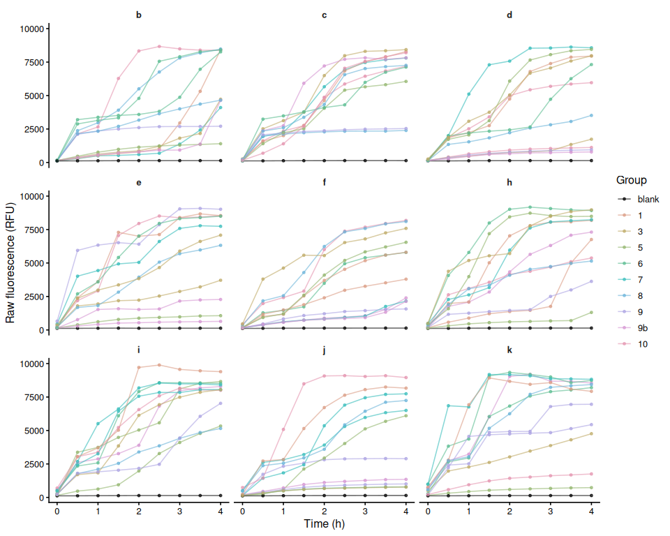
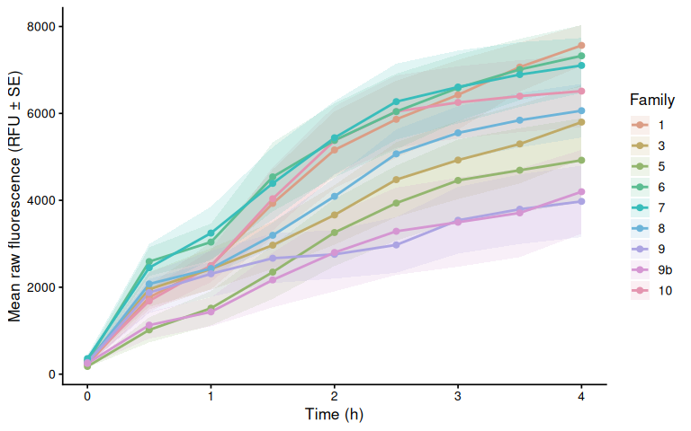
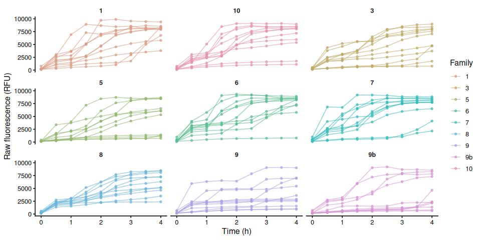
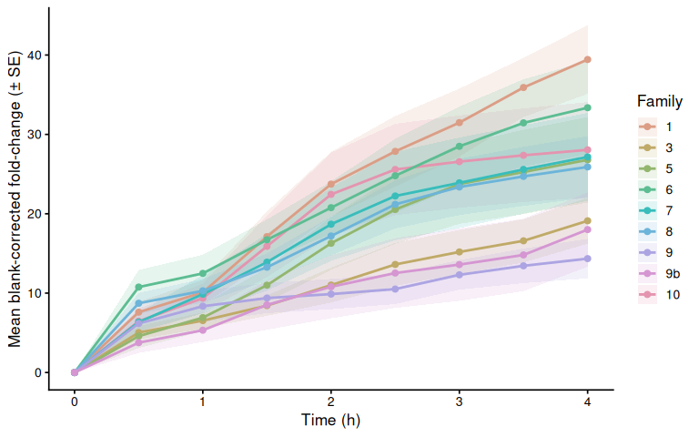
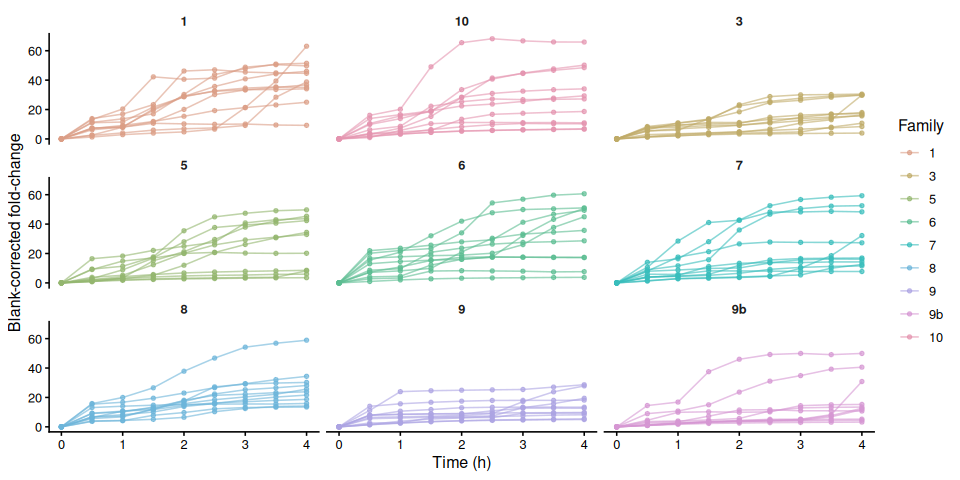
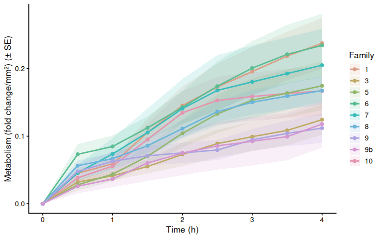
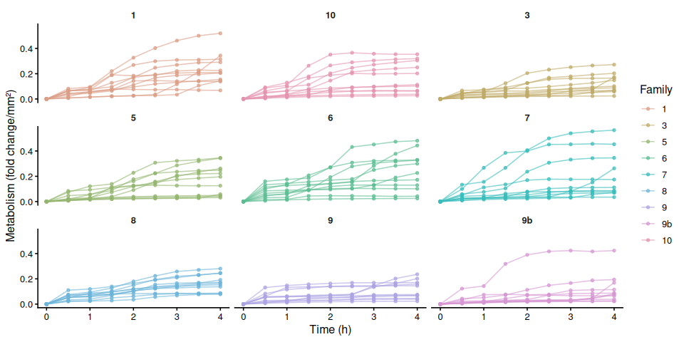
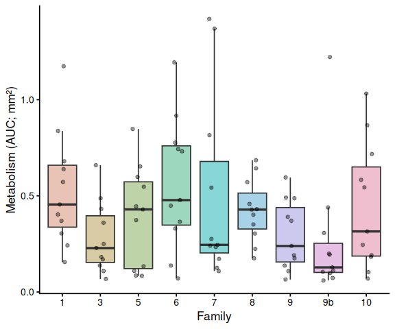

01.00-resazurin-20260602-mgig-36C
================
Sam White
2026-06-02

- [1 Background](#1-background)
  - [1.1 Expected inputs](#11-expected-inputs)
  - [1.2 Expected outputs](#12-expected-outputs)
- [2 Setup](#2-setup)
  - [2.1 Knitr options](#21-knitr-options)
  - [2.2 Load libraries](#22-load-libraries)
- [3 Helper Functions](#3-helper-functions)
- [4 Load Data](#4-load-data)
  - [4.1 Plate export files](#41-plate-export-files)
  - [4.2 Plate consistency check](#42-plate-consistency-check)
  - [4.3 Layout file](#43-layout-file)
- [5 Merge Plate Data with Layout](#5-merge-plate-data-with-layout)
- [6 Raw Fluorescence](#6-raw-fluorescence)
  - [6.1 Data frame](#61-data-frame)
  - [6.2 Raw fluorescence by plate (including
    blanks)](#62-raw-fluorescence-by-plate-including-blanks)
  - [6.3 Mean raw fluorescence by
    family](#63-mean-raw-fluorescence-by-family)
  - [6.4 Individual raw fluorescence traces by
    family](#64-individual-raw-fluorescence-traces-by-family)
  - [6.5 Individual raw fluorescence traces by
    treatment](#65-individual-raw-fluorescence-traces-by-treatment)
  - [6.6 Excluded samples](#66-excluded-samples)
- [7 Blank Correction via Fold-Change
  Normalization](#7-blank-correction-via-fold-change-normalization)
  - [7.1 Step 1 – Identify T0 and compute per-sample
    fold-change](#71-step-1--identify-t0-and-compute-per-sample-fold-change)
  - [7.2 Step 2 – Blank fold-change reference per plate per
    timepoint](#72-step-2--blank-fold-change-reference-per-plate-per-timepoint)
  - [7.3 Step 3 – Subtract blank fold-change from sample
    fold-change](#73-step-3--subtract-blank-fold-change-from-sample-fold-change)
- [8 Blank-Corrected Fold-Change](#8-blank-corrected-fold-change)
  - [8.1 Mean by family](#81-mean-by-family)
  - [8.2 Individual traces by family](#82-individual-traces-by-family)
  - [8.3 Individual blank-corrected fold-change traces by
    treatment](#83-individual-blank-corrected-fold-change-traces-by-treatment)
- [9 Metabolism (Size-Normalised
  Fold-Change)](#9-metabolism-size-normalised-fold-change)
  - [9.1 Mean metabolism by family](#91-mean-metabolism-by-family)
  - [9.2 Individual metabolism traces by
    family](#92-individual-metabolism-traces-by-family)
- [10 Time-Series Statistical
  Analysis](#10-time-series-statistical-analysis)
  - [10.1 Results](#101-results)
    - [10.1.1 Metric:
      metabolism_per_area_mm2_measurement](#1011-metric-metabolism_per_area_mm2_measurement)
- [11 Area Under the Curve (AUC)](#11-area-under-the-curve-auc)
  - [11.1 AUC summary tables](#111-auc-summary-tables)
- [12 Statistical Analysis](#12-statistical-analysis)
  - [12.1 Results by metric](#121-results-by-metric)
    - [12.1.1 Metric:
      metabolism_per_area_mm2_measurement](#1211-metric-metabolism_per_area_mm2_measurement)
- [13 AUC Box Plots with Statistical
  Annotations](#13-auc-box-plots-with-statistical-annotations)
- [14 Save Output Data](#14-save-output-data)

# 1 Background

Juvenile oysters from nine USDA families were submerged in 4 mL of room
temperature resazurin working solution in 12-well plates and held at
36°C. At each designated timepoint, fluorescence was measured using a
Synergy HTX (Agilent) plate reader.

See `Resazurin/data/20260602-mgig-36C/README.md` for full experimental
notes.

## 1.1 Expected inputs

| Path | Description |
|:---|:---|
| `Resazurin/data/20260602-mgig-36C/plate-*-T*.txt` | Plate reader fluorescence exports (one file per plate per timepoint) |
| `Resazurin/data/20260602-mgig-36C/layout.csv` | Well metadata: plate ID, well ID, blank flag, family groups, sample IDs, area measurements (mm², from ImageJ) |

## 1.2 Expected outputs

All outputs are written to
`Resazurin/outputs/01.00-resazurin-20260602-mgig-36C/`.

| File | Description |
|:---|:---|
| `figures/` | All plots generated by this script |
| `auc_all_metrics.csv` | Per-individual AUC values for every active measurement metric |
| `auc_summary.csv` | Group-level AUC summary statistics (mean, SD, SE, median) |
| `metabolism.csv` | Full per-well per-timepoint metabolism data frame |
| `pairwise_stats.csv` | Tukey-adjusted pairwise comparisons from AUC linear models |

# 2 Setup

## 2.1 Knitr options

``` r
knitr::opts_chunk$set(
  echo = TRUE,         # Display code chunks
  eval = TRUE,        # Evaluate code chunks
  warning = FALSE,     # Hide warnings
  message = FALSE,     # Hide messages
  comment = "",         # Prevents appending '##' to beginning of lines in code output
  results = 'hold'     # Holds output so it's all printed together after code chunk
)
```

## 2.2 Load libraries

``` r
library(tidyverse)
library(pracma)       # trapz()
library(lme4)
library(lmerTest)
library(emmeans)
library(multcompView)
library(cowplot)
library(colorspace)   # qualitative_hcl() for large palettes
```

# 3 Helper Functions

``` r
normalize_well_id <- function(x) {
  x <- toupper(trimws(x))
  valid <- str_detect(x, "^[A-Z]+[0-9]+$")
  out <- rep(NA_character_, length(x))
  if (!any(valid)) return(out)
  m <- str_match(x[valid], "^([A-Z]+)([0-9]+)$")
  out[valid] <- paste0(m[, 2], as.integer(m[, 3]))
  out
}

parse_time_hr <- function(path) {
  hit <- str_match(basename(path),
                   "(?i)-T([0-9]+(?:\\.[0-9]+)?)\\.txt$")
  as.numeric(hit[, 2])
}

parse_plate_id <- function(path) {
  hit <- str_match(basename(path),
    "(?i)^plate-([A-Za-z0-9-]+)-T[0-9]+(?:\\.[0-9]+)?\\.txt$")
  id <- hit[, 2]
  ifelse(is.na(id), "unknown", id)
}

extract_results_block <- function(lines) {
  results_idx <- which(trimws(lines) == "Results")
  if (length(results_idx) == 0) stop("No Results section found")
  idx <- results_idx[1]
  header_tokens <- str_split(lines[idx + 1], "\\t")[[1]] |> trimws()
  col_ids <- header_tokens[
    header_tokens != "" & str_detect(header_tokens, "^[0-9]+$")]
  j <- idx + 2
  data_lines <- character()
  while (j <= length(lines)) {
    line <- lines[j]
    if (trimws(line) == "") break
    if (!str_detect(line, "^[A-Za-z]\\t")) break
    data_lines <- c(data_lines, line)
    j <- j + 1
  }
  list(col_ids = col_ids, data_lines = data_lines)
}

parse_plate_export <- function(path) {
  lines <- readLines(path, warn = FALSE)
  res <- extract_results_block(lines)

  map_dfr(res$data_lines, function(line) {
    tokens <- str_split(line, "\\t")[[1]] |> trimws()
    tokens <- tokens[tokens != ""]
    row_letter <- tokens[1]
    nums <- suppressWarnings(as.numeric(tokens[-1]))
    valid_idx <- which(!is.na(nums))
    if (length(valid_idx) == 0) return(tibble())
    vals <- nums[valid_idx]
    n <- min(length(vals), length(res$col_ids))
    tibble(
      row_id  = toupper(row_letter),
      col_id  = as.integer(res$col_ids[seq_len(n)]),
      well_id = normalize_well_id(
        paste0(toupper(row_letter), res$col_ids[seq_len(n)])),
      value   = vals[seq_len(n)]
    )
  }) %>%
    mutate(
      plate_id = str_to_lower(parse_plate_id(path)),
      time_hr  = parse_time_hr(path)
    )
}

trapezoid_auc <- function(time_hr, value) {
  ok <- is.finite(time_hr) & is.finite(value)
  t <- time_hr[ok]
  v <- value[ok]
  if (length(t) < 2) return(NA_real_)
  ord <- order(t)
  t <- t[ord]; v <- v[ord]
  sum(diff(t) * (head(v, -1) + tail(v, -1)) / 2)
}

# Shared helper: extract display unit string from a measurement column name.
# e.g. "area_mm2_measurement" -> "mm²", "weight_mg_measurement" -> "mg"
parse_meas_unit <- function(col_name) {
  unit_raw <- col_name |>
    str_remove("^metabolism_per_") |>
    str_remove("_measurement$") |>
    str_extract("[^_]+$")
  case_when(
    unit_raw == "mm2" ~ "mm²",
    unit_raw == "cm2" ~ "cm²",
    unit_raw == "mm3" ~ "mm³",
    unit_raw == "cm3" ~ "cm³",
    TRUE              ~ unit_raw
  )
}

# y-axis label for metabolism line plots: "fold change/mm²"
metabolism_y_label <- function(col_name) {
  paste0("Metabolism (fold change/", parse_meas_unit(col_name), ")")
}

# y-axis label for AUC box plots: "Metabolism (AUC; mm²)"
auc_y_label <- function(metric_name) {
  paste0("Metabolism (AUC; ", parse_meas_unit(metric_name), ")")
}
```

# 4 Load Data

## 4.1 Plate export files

``` r
proj_root <- rprojroot::find_rstudio_root_file()
data_dir  <- file.path(proj_root, "Resazurin", "data", "20260602-mgig-36C")
out_dir   <- file.path(proj_root, "Resazurin", "outputs",
                        "01.00-resazurin-20260602-mgig-36C")
fig_dir   <- file.path(out_dir, "figures")

dir.create(fig_dir, recursive = TRUE, showWarnings = FALSE)
dir.create(out_dir, recursive = TRUE, showWarnings = FALSE)

plate_files <- list.files(
  data_dir,
  pattern = "(?i)^plate-.*-T[0-9]+(?:\\.[0-9]+)?\\.txt$",
  full.names = TRUE
)

plate_raw <- map_dfr(plate_files, function(path) {
  tryCatch(parse_plate_export(path),
           error = function(e) {
             message("Parse error in ", basename(path), ": ", e$message)
             tibble()
           })
})

str(plate_raw)
```

    tibble [972 × 6] (S3: tbl_df/tbl/data.frame)
     $ row_id  : chr [1:972] "A" "A" "A" "A" ...
     $ col_id  : int [1:972] 1 2 3 4 1 2 3 4 1 2 ...
     $ well_id : chr [1:972] "A1" "A2" "A3" "A4" ...
     $ value   : num [1:972] 125 123 131 141 152 140 144 145 179 131 ...
     $ plate_id: chr [1:972] "b" "b" "b" "b" ...
     $ time_hr : num [1:972] 0 0 0 0 0 0 0 0 0 0 ...

## 4.2 Plate consistency check

Checks that every plate has the same number of wells at every timepoint.
The expected well count is the mode across all plate × timepoint reads.
Any plate with at least one deviating read is flagged and dropped
entirely before any further analysis — removing only the aberrant
timepoint would break the fold-change baseline calculation.

``` r
well_counts <- plate_raw %>%
  group_by(plate_id, time_hr) %>%
  summarise(n_wells = n_distinct(well_id), .groups = "drop")

expected_n_wells <- as.integer(
  names(which.max(table(well_counts$n_wells)))
)

inconsistent_reads <- well_counts %>%
  filter(n_wells != expected_n_wells) %>%
  arrange(plate_id, time_hr)

inconsistent_plate_ids <- unique(inconsistent_reads$plate_id)

if (nrow(inconsistent_reads) > 0) {
  cat("**Plate consistency check FAILED.**",
      "Expected", expected_n_wells, "wells per plate-timepoint read.",
      length(inconsistent_plate_ids),
      "plate(s) have at least one deviating read and are excluded",
      "from all analyses:\n\n")
  cat(knitr::kable(
    inconsistent_reads,
    col.names = c("Plate", "Time (h)", "Wells read"),
    caption   = paste("Expected:", expected_n_wells, "wells per read")
  ), sep = "\n")
  cat("\n")
  plate_raw <- plate_raw %>%
    filter(!plate_id %in% inconsistent_plate_ids)
  message(length(inconsistent_plate_ids),
          " plate(s) removed from plate_raw: ",
          paste(inconsistent_plate_ids, collapse = ", "))
} else {
  cat("Plate consistency check passed: all",
      n_distinct(well_counts$plate_id), "plates have",
      expected_n_wells, "wells at every timepoint.\n")
}
```

Plate consistency check passed: all 9 plates have 12 wells at every
timepoint.

## 4.3 Layout file

``` r
layout_path <- file.path(data_dir, "layout.csv")

layout_raw <- read_csv(layout_path,
                       col_types = cols(.default = "c"),
                       show_col_types = FALSE)

# Standardise column names to snake_case
names(layout_raw) <- names(layout_raw) |>
  str_to_lower() |>
  str_replace_all("[^a-z0-9]+", "_") |>
  str_replace_all("_+", "_") |>
  str_replace("_$", "")

# Normalise plate_id to match plate file ids (strip "plate-" prefix)
layout_clean <- layout_raw %>%
  mutate(
    plate_id = str_remove(str_to_lower(plate_id), "^plate-"),
    well_id  = normalize_well_id(plate_well),
    is_blank = if ("is_blank" %in% names(layout_raw))
      toupper(trimws(is_blank)) %in% c("TRUE", "T", "1", "YES", "Y")
    else
      FALSE
  )

found_exclude_col <- intersect(
  c("exclude_from_analysis", "exclude", "omit", "not_analyzed"),
  names(layout_clean)
)[1]
layout_clean <- layout_clean %>%
  mutate(
    exclude_from_analysis = if (!is.na(found_exclude_col))
      toupper(trimws(.data[[found_exclude_col]])) %in%
        c("TRUE", "T", "1", "YES", "Y")
    else
      FALSE
  )

# Identify measurement columns and group columns
measurement_cols <- names(layout_clean)[
  str_detect(names(layout_clean), "_measurement$")]
group_cols <- names(layout_clean)[
  str_detect(names(layout_clean), "_group$")]

# Cast measurement columns to numeric
layout_clean <- layout_clean %>%
  mutate(across(all_of(measurement_cols),
                ~ suppressWarnings(as.numeric(.x))))

# Determine which measurement columns actually contain finite data
active_meas_cols <- measurement_cols[
  sapply(measurement_cols, function(col)
    any(is.finite(layout_clean[[col]]), na.rm = TRUE))]

# Normalise group values to lowercase so they match colour scale definitions
layout_clean <- layout_clean %>%
  mutate(across(all_of(group_cols),
                ~ str_to_lower(trimws(as.character(.x)))))

message("Group columns: ", paste(group_cols, collapse = ", "))
message("Active measurement columns: ",
        paste(active_meas_cols, collapse = ", "))

str(layout_clean)
```

    tibble [108 × 14] (S3: tbl_df/tbl/data.frame)
     $ plate_id             : chr [1:108] "b" "b" "b" "b" ...
     $ plate_well           : chr [1:108] "A01" "A02" "A03" "A04" ...
     $ is_blank             : logi [1:108] FALSE FALSE FALSE FALSE FALSE FALSE ...
     $ family_id_group      : chr [1:108] "10" "7" "1" "8" ...
     $ sample_id_group      : chr [1:108] "1" "2" "3" "4" ...
     $ exclude_from_analysis: logi [1:108] FALSE FALSE FALSE FALSE FALSE FALSE ...
     $ exclude_reason       : chr [1:108] NA NA NA NA ...
     $ weight_g_measurement : num [1:108] NA NA NA NA NA NA NA NA NA NA ...
     $ width_mm_measurement : num [1:108] NA NA NA NA NA NA NA NA NA NA ...
     $ length_mm_measurement: num [1:108] NA NA NA NA NA NA NA NA NA NA ...
     $ treatment_group      : chr [1:108] NA NA NA NA ...
     $ area_mm2_measurement : num [1:108] 186 122 184 210 173 ...
     $ imagej_id            : chr [1:108] "3" "1" "4" "2" ...
     $ well_id              : chr [1:108] "A1" "A2" "A3" "A4" ...

# 5 Merge Plate Data with Layout

``` r
dat <- plate_raw %>%
  left_join(
    layout_clean %>%
      select(plate_id, well_id, is_blank, exclude_from_analysis,
             any_of("exclude_reason"),
             all_of(group_cols), all_of(measurement_cols)),
    by = c("plate_id", "well_id")
  ) %>%
  mutate(
    is_blank = replace_na(is_blank, FALSE),
    exclude_from_analysis = replace_na(exclude_from_analysis, FALSE)
  )

str(dat)
```

    tibble [972 × 16] (S3: tbl_df/tbl/data.frame)
     $ row_id               : chr [1:972] "A" "A" "A" "A" ...
     $ col_id               : int [1:972] 1 2 3 4 1 2 3 4 1 2 ...
     $ well_id              : chr [1:972] "A1" "A2" "A3" "A4" ...
     $ value                : num [1:972] 125 123 131 141 152 140 144 145 179 131 ...
     $ plate_id             : chr [1:972] "b" "b" "b" "b" ...
     $ time_hr              : num [1:972] 0 0 0 0 0 0 0 0 0 0 ...
     $ is_blank             : logi [1:972] FALSE FALSE FALSE FALSE FALSE FALSE ...
     $ exclude_from_analysis: logi [1:972] FALSE FALSE FALSE FALSE FALSE FALSE ...
     $ exclude_reason       : chr [1:972] NA NA NA NA ...
     $ family_id_group      : chr [1:972] "10" "7" "1" "8" ...
     $ sample_id_group      : chr [1:972] "1" "2" "3" "4" ...
     $ treatment_group      : chr [1:972] NA NA NA NA ...
     $ weight_g_measurement : num [1:972] NA NA NA NA NA NA NA NA NA NA ...
     $ width_mm_measurement : num [1:972] NA NA NA NA NA NA NA NA NA NA ...
     $ length_mm_measurement: num [1:972] NA NA NA NA NA NA NA NA NA NA ...
     $ area_mm2_measurement : num [1:972] 186 122 184 210 173 ...

# 6 Raw Fluorescence

## 6.1 Data frame

``` r
# Wells in the plate reader output that have no layout entry get all-NA group
# columns after the join. Keep only wells assigned to at least one group.
active_gc <- intersect(group_cols, names(dat))

raw_df <- dat %>%
  filter(
    !is_blank,
    if (length(active_gc) > 0)
      if_any(all_of(active_gc), ~ !is.na(.))
    else
      TRUE
  ) %>%
  mutate(
    trace_id = if_else(
      !is.na(sample_id_group) & trimws(as.character(sample_id_group)) != "",
      as.character(sample_id_group),
      paste(plate_id, well_id, sep = "_")
    )
  )

families   <- str_sort(unique(na.omit(raw_df$family_id_group)), numeric = TRUE)
treatments <- sort(unique(na.omit(raw_df$treatment_group)))

n_fam <- length(families)
n_trt <- length(treatments)

# Palette strategy:
#   <= 7 groups : Okabe-Ito (gold standard for colorblind-safe figures).
#   >  7 groups : colorspace::qualitative_hcl("Dynamic") scales to any N
#                 using perceptually uniform HCL space — no colour collisions.
# Black (#000000) is excluded from both and reserved for blank wells.
okabe_ito_7 <- c(
  "#E69F00", "#56B4E9", "#009E73", "#F0E442",
  "#0072B2", "#D55E00", "#CC79A7"
)
make_palette <- function(n) {
  if (n == 0L) return(character(0))
  if (n <= length(okabe_ito_7)) return(okabe_ito_7[seq_len(n)])
  colorspace::qualitative_hcl(n, palette = "Dynamic")
}

all_colours   <- make_palette(n_fam + n_trt)
fam_colours   <- setNames(all_colours[seq_len(n_fam)], families)
trt_colours   <- setNames(all_colours[n_fam + seq_len(n_trt)], treatments)

lty_pool <- c("solid", "dashed", "dotted", "dotdash", "longdash")
trt_linetypes <- setNames(
  lty_pool[(seq_len(n_trt) - 1L) %% length(lty_pool) + 1L],
  treatments
)
plate_well_colours <- c(blank = "black", fam_colours)

has_trt <- n_trt > 0

str(raw_df)
```

    tibble [891 × 17] (S3: tbl_df/tbl/data.frame)
     $ row_id               : chr [1:891] "A" "A" "A" "A" ...
     $ col_id               : int [1:891] 1 2 3 4 1 2 3 4 1 2 ...
     $ well_id              : chr [1:891] "A1" "A2" "A3" "A4" ...
     $ value                : num [1:891] 125 123 131 141 152 140 144 145 179 131 ...
     $ plate_id             : chr [1:891] "b" "b" "b" "b" ...
     $ time_hr              : num [1:891] 0 0 0 0 0 0 0 0 0 0 ...
     $ is_blank             : logi [1:891] FALSE FALSE FALSE FALSE FALSE FALSE ...
     $ exclude_from_analysis: logi [1:891] FALSE FALSE FALSE FALSE FALSE FALSE ...
     $ exclude_reason       : chr [1:891] NA NA NA NA ...
     $ family_id_group      : chr [1:891] "10" "7" "1" "8" ...
     $ sample_id_group      : chr [1:891] "1" "2" "3" "4" ...
     $ treatment_group      : chr [1:891] NA NA NA NA ...
     $ weight_g_measurement : num [1:891] NA NA NA NA NA NA NA NA NA NA ...
     $ width_mm_measurement : num [1:891] NA NA NA NA NA NA NA NA NA NA ...
     $ length_mm_measurement: num [1:891] NA NA NA NA NA NA NA NA NA NA ...
     $ area_mm2_measurement : num [1:891] 186 122 184 210 173 ...
     $ trace_id             : chr [1:891] "1" "2" "3" "4" ...

## 6.2 Raw fluorescence by plate (including blanks)

``` r
p_raw_plates <- dat %>%
  filter(is.finite(time_hr), is.finite(value)) %>%
  mutate(
    colour_group = if_else(is_blank, "blank",
                           coalesce(family_id_group, "sample")),
    trace_id     = paste(plate_id, well_id, sep = "_")
  ) %>%
  ggplot(aes(x = time_hr, y = value,
             group = trace_id, colour = colour_group)) +
  geom_line(alpha = 0.6) +
  geom_point(size = 1, alpha = 0.7) +
  facet_wrap(~ plate_id) +
  scale_colour_manual(
    values   = plate_well_colours,
    name     = "Group",
    breaks   = names(plate_well_colours),
    na.value = "grey80"
  ) +
  labs(x = "Time (h)", y = "Raw fluorescence (RFU)") +
  theme_classic(base_size = 12) +
  theme(strip.background = element_blank(),
        strip.text       = element_text(face = "bold"))

p_raw_plates
```

<!-- -->

``` r
ggsave(file.path(fig_dir, "raw_fluor_by_plate.png"),
       p_raw_plates, width = 10, height = 8)
```

## 6.3 Mean raw fluorescence by family

``` r
raw_family_summary <- raw_df %>%
  filter(!is.na(family_id_group), !exclude_from_analysis) %>%
  group_by(family_id_group, treatment_group, time_hr) %>%
  summarise(
    mean_fluor = mean(value, na.rm = TRUE),
    se_fluor   = sd(value, na.rm = TRUE) /
      sqrt(sum(!is.na(value))),
    n          = sum(!is.na(value)),
    .groups    = "drop"
  ) %>%
  mutate(group_var = if (has_trt)
    paste(family_id_group, treatment_group, sep = ".")
  else
    family_id_group)

p_raw_mean <- ggplot(raw_family_summary,
    aes(x = time_hr, y = mean_fluor,
        colour = family_id_group,
        group = group_var)) +
  geom_ribbon(aes(ymin = mean_fluor - se_fluor,
                  ymax = mean_fluor + se_fluor,
                  fill = family_id_group),
              alpha = 0.15, colour = NA) +
  geom_line(
    mapping   = if (has_trt) aes(linetype = treatment_group) else NULL,
    linewidth = 1) +
  geom_point(size = 2) +
  scale_colour_manual(values = fam_colours, name = "Family",
                      breaks = families) +
  scale_fill_manual(values = fam_colours, name = "Family",
                    breaks = families) +
  labs(x = "Time (h)", y = "Mean raw fluorescence (RFU ± SE)") +
  theme_classic(base_size = 13) +
  if (has_trt) scale_linetype_manual(values = trt_linetypes, name = "Treatment") else NULL

p_raw_mean
```

<!-- -->

``` r
ggsave(file.path(fig_dir, "raw_mean_by_family.png"),
       p_raw_mean, width = 8, height = 5)
```

## 6.4 Individual raw fluorescence traces by family

``` r
p_raw_by_family <- raw_df %>%
  filter(!is.na(family_id_group)) %>%
  ggplot(aes(x = time_hr, y = value, group = trace_id,
             colour = .data[[if (has_trt) "treatment_group" else "family_id_group"]])) +
  geom_line(alpha = 0.6) +
  geom_point(size = 1.2, alpha = 0.7) +
  facet_wrap(~ family_id_group) +
  scale_colour_manual(
    values = if (has_trt) trt_colours else fam_colours,
    name   = if (has_trt) "Treatment" else "Family",
    breaks = if (has_trt) treatments else families) +
  labs(x = "Time (h)", y = "Raw fluorescence (RFU)") +
  theme_classic(base_size = 12) +
  theme(strip.background = element_blank(),
        strip.text       = element_text(face = "bold"))

p_raw_by_family
```

<!-- -->

``` r
ggsave(file.path(fig_dir, "raw_individual_by_family.png"),
       p_raw_by_family, width = 10, height = 5)
```

## 6.5 Individual raw fluorescence traces by treatment

``` r
if (has_trt) {
  p_raw_by_treatment <- raw_df %>%
    ggplot(aes(x = time_hr, y = value,
               group = trace_id, colour = family_id_group)) +
    geom_line(alpha = 0.6) +
    geom_point(size = 1.2, alpha = 0.7) +
    facet_wrap(~ treatment_group) +
    scale_colour_manual(values = fam_colours, name = "Family",
                        breaks = families) +
    labs(x = "Time (h)", y = "Raw fluorescence (RFU)") +
    theme_classic(base_size = 12) +
    theme(strip.background = element_blank(),
          strip.text       = element_text(face = "bold"))

  p_raw_by_treatment
  ggsave(file.path(fig_dir, "raw_individual_by_treatment.png"),
         p_raw_by_treatment, width = 10, height = 5)
}
```

## 6.6 Excluded samples

Wells flagged `exclude_from_analysis = TRUE` appear in the raw
fluorescence plots above but are omitted from all analyses that follow.

``` r
excluded_wells <- dat %>%
  filter(!is_blank, exclude_from_analysis) %>%
  mutate(
    sample = if_else(
      !is.na(sample_id_group) & trimws(as.character(sample_id_group)) != "",
      as.character(sample_id_group),
      paste(plate_id, well_id, sep = "_")
    )
  ) %>%
  select(plate_id, well_id, sample, family_id_group, treatment_group,
         any_of("exclude_reason")) %>%
  distinct() %>%
  arrange(plate_id, well_id)

if (nrow(excluded_wells) > 0) {
  col_names <- c("Plate", "Well", "Sample", "Family", "Treatment")
  if ("exclude_reason" %in% names(excluded_wells))
    col_names <- c(col_names, "Reason")
  cat(knitr::kable(excluded_wells, col.names = col_names), sep = "\n")
} else {
  cat("No wells are excluded from analysis.\n")
}
```

No wells are excluded from analysis.

# 7 Blank Correction via Fold-Change Normalization

T0 is the earliest timepoint present in the dataset (not necessarily 0
hr). Sample fold-change is expressed relative to each individual’s T0
reading, resolved by `sample_id_group` when that column is populated —
allowing the same animal to be tracked across plates — or by
`plate_id + well_id` when no sample IDs exist (backward-compatible with
single-plate, multi-timepoint designs). Blank fold-change is the
per-plate mean blank RFU at each timepoint divided by the pooled mean
blank RFU at T0. Subtracting blank fold-change from sample fold-change
removes background fluorescence drift; all samples start at exactly 0 at
T0 by construction.

## 7.1 Step 1 – Identify T0 and compute per-sample fold-change

``` r
# T0 = earliest timepoint present in the dataset
t0_time <- min(dat$time_hr[is.finite(dat$time_hr)], na.rm = TRUE)
message("T0 timepoint: ", t0_time, " hr")

# T0 reference value per individual.
# Resolved by sample_id_group (cross-plate tracking) when available;
# falls back to plate+well for layouts without explicit sample IDs.
t0_all <- dat %>%
  filter(time_hr == t0_time, !is_blank, is.finite(value)) %>%
  mutate(sample_key = if_else(
    !is.na(sample_id_group) & trimws(as.character(sample_id_group)) != "",
    as.character(sample_id_group),
    paste(plate_id, well_id, sep = "_")
  )) %>%
  group_by(sample_key) %>%
  summarise(value_t0 = mean(value, na.rm = TRUE), .groups = "drop")

dat_fc <- dat %>%
  mutate(sample_key = if_else(
    !is_blank &
      !is.na(sample_id_group) & trimws(as.character(sample_id_group)) != "",
    as.character(sample_id_group),
    paste(plate_id, well_id, sep = "_")
  )) %>%
  left_join(t0_all, by = "sample_key") %>%
  mutate(fold_change = if_else(
    !is_blank & is.finite(value_t0) & value_t0 > 0,
    value / value_t0,
    NA_real_
  ))

str(dat_fc)
```

    tibble [972 × 19] (S3: tbl_df/tbl/data.frame)
     $ row_id               : chr [1:972] "A" "A" "A" "A" ...
     $ col_id               : int [1:972] 1 2 3 4 1 2 3 4 1 2 ...
     $ well_id              : chr [1:972] "A1" "A2" "A3" "A4" ...
     $ value                : num [1:972] 125 123 131 141 152 140 144 145 179 131 ...
     $ plate_id             : chr [1:972] "b" "b" "b" "b" ...
     $ time_hr              : num [1:972] 0 0 0 0 0 0 0 0 0 0 ...
     $ is_blank             : logi [1:972] FALSE FALSE FALSE FALSE FALSE FALSE ...
     $ exclude_from_analysis: logi [1:972] FALSE FALSE FALSE FALSE FALSE FALSE ...
     $ exclude_reason       : chr [1:972] NA NA NA NA ...
     $ family_id_group      : chr [1:972] "10" "7" "1" "8" ...
     $ sample_id_group      : chr [1:972] "1" "2" "3" "4" ...
     $ treatment_group      : chr [1:972] NA NA NA NA ...
     $ weight_g_measurement : num [1:972] NA NA NA NA NA NA NA NA NA NA ...
     $ width_mm_measurement : num [1:972] NA NA NA NA NA NA NA NA NA NA ...
     $ length_mm_measurement: num [1:972] NA NA NA NA NA NA NA NA NA NA ...
     $ area_mm2_measurement : num [1:972] 186 122 184 210 173 ...
     $ sample_key           : chr [1:972] "1" "2" "3" "4" ...
     $ value_t0             : num [1:972] 125 123 131 141 152 140 144 145 179 131 ...
     $ fold_change          : num [1:972] 1 1 1 1 1 1 1 1 1 1 ...

## 7.2 Step 2 – Blank fold-change reference per plate per timepoint

``` r
# Pooled mean blank RFU at T0 across all T0 plates
mean_blank_t0 <- dat %>%
  filter(is_blank, time_hr == t0_time, is.finite(value)) %>%
  pull(value) %>%
  mean(na.rm = TRUE)

if (!is.finite(mean_blank_t0))
  message("No blank readings found at T0 (", t0_time,
          " hr); blank correction will produce NA.")

# Per-plate per-timepoint mean blank expressed as fold-change relative to T0
blank_fc_ref <- dat %>%
  filter(is_blank, is.finite(value)) %>%
  group_by(plate_id, time_hr) %>%
  summarise(mean_blank_rfu = mean(value, na.rm = TRUE), .groups = "drop") %>%
  mutate(mean_blank_fc = mean_blank_rfu / mean_blank_t0)

str(blank_fc_ref)
```

    tibble [81 × 4] (S3: tbl_df/tbl/data.frame)
     $ plate_id      : chr [1:81] "b" "b" "b" "b" ...
     $ time_hr       : num [1:81] 0 0.5 1 1.5 2 2.5 3 3.5 4 0 ...
     $ mean_blank_rfu: num [1:81] 116 120 127 133 136 137 137 137 137 117 ...
     $ mean_blank_fc : num [1:81] 0.999 1.033 1.094 1.145 1.171 ...

## 7.3 Step 3 – Subtract blank fold-change from sample fold-change

``` r
samples <- dat_fc %>%
  filter(!is_blank, !exclude_from_analysis) %>%
  mutate(
    trace_id = if_else(
      !is.na(sample_id_group) & trimws(as.character(sample_id_group)) != "",
      as.character(sample_id_group),
      paste(plate_id, well_id, sep = "_")
    )
  ) %>%
  left_join(blank_fc_ref, by = c("plate_id", "time_hr")) %>%
  mutate(corrected_fc = fold_change - mean_blank_fc)

str(samples)
```

    tibble [891 × 23] (S3: tbl_df/tbl/data.frame)
     $ row_id               : chr [1:891] "A" "A" "A" "A" ...
     $ col_id               : int [1:891] 1 2 3 4 1 2 3 4 1 2 ...
     $ well_id              : chr [1:891] "A1" "A2" "A3" "A4" ...
     $ value                : num [1:891] 125 123 131 141 152 140 144 145 179 131 ...
     $ plate_id             : chr [1:891] "b" "b" "b" "b" ...
     $ time_hr              : num [1:891] 0 0 0 0 0 0 0 0 0 0 ...
     $ is_blank             : logi [1:891] FALSE FALSE FALSE FALSE FALSE FALSE ...
     $ exclude_from_analysis: logi [1:891] FALSE FALSE FALSE FALSE FALSE FALSE ...
     $ exclude_reason       : chr [1:891] NA NA NA NA ...
     $ family_id_group      : chr [1:891] "10" "7" "1" "8" ...
     $ sample_id_group      : chr [1:891] "1" "2" "3" "4" ...
     $ treatment_group      : chr [1:891] NA NA NA NA ...
     $ weight_g_measurement : num [1:891] NA NA NA NA NA NA NA NA NA NA ...
     $ width_mm_measurement : num [1:891] NA NA NA NA NA NA NA NA NA NA ...
     $ length_mm_measurement: num [1:891] NA NA NA NA NA NA NA NA NA NA ...
     $ area_mm2_measurement : num [1:891] 186 122 184 210 173 ...
     $ sample_key           : chr [1:891] "1" "2" "3" "4" ...
     $ value_t0             : num [1:891] 125 123 131 141 152 140 144 145 179 131 ...
     $ fold_change          : num [1:891] 1 1 1 1 1 1 1 1 1 1 ...
     $ trace_id             : chr [1:891] "1" "2" "3" "4" ...
     $ mean_blank_rfu       : num [1:891] 116 116 116 116 116 116 116 116 116 116 ...
     $ mean_blank_fc        : num [1:891] 0.999 0.999 0.999 0.999 0.999 ...
     $ corrected_fc         : num [1:891] 0.000957 0.000957 0.000957 0.000957 0.000957 ...

# 8 Blank-Corrected Fold-Change

## 8.1 Mean by family

``` r
bc_fc_summary <- samples %>%
  filter(!is.na(family_id_group), !exclude_from_analysis) %>%
  group_by(family_id_group, treatment_group, time_hr) %>%
  summarise(
    mean_val = mean(corrected_fc, na.rm = TRUE),
    se_val   = sd(corrected_fc, na.rm = TRUE) /
      sqrt(sum(!is.na(corrected_fc))),
    n        = sum(!is.na(corrected_fc)),
    .groups  = "drop"
  ) %>%
  mutate(group_var = if (has_trt)
    paste(family_id_group, treatment_group, sep = ".")
  else
    family_id_group)

p_bc_fc_mean <- ggplot(bc_fc_summary,
    aes(x = time_hr, y = mean_val,
        colour = family_id_group,
        group = group_var)) +
  geom_ribbon(aes(ymin = mean_val - se_val,
                  ymax = mean_val + se_val,
                  fill = family_id_group),
              alpha = 0.15, colour = NA) +
  geom_line(
    mapping   = if (has_trt) aes(linetype = treatment_group) else NULL,
    linewidth = 1) +
  geom_point(size = 2) +
  scale_colour_manual(values = fam_colours, name = "Family",
                      breaks = families) +
  scale_fill_manual(values = fam_colours, name = "Family",
                    breaks = families) +
  labs(x = "Time (h)",
       y = "Mean blank-corrected fold-change (± SE)") +
  theme_classic(base_size = 13) +
  if (has_trt) scale_linetype_manual(values = trt_linetypes, name = "Treatment") else NULL

p_bc_fc_mean
```

<!-- -->

``` r
ggsave(file.path(fig_dir, "blank_corrected_fc_mean_by_family.png"),
       p_bc_fc_mean, width = 8, height = 5)
```

## 8.2 Individual traces by family

``` r
p_bc_fc_by_family <- samples %>%
  filter(!is.na(family_id_group)) %>%
  ggplot(aes(x = time_hr, y = corrected_fc, group = trace_id,
             colour = .data[[if (has_trt) "treatment_group" else "family_id_group"]])) +
  geom_line(alpha = 0.6) +
  geom_point(size = 1.2, alpha = 0.7) +
  facet_wrap(~ family_id_group) +
  scale_colour_manual(
    values = if (has_trt) trt_colours else fam_colours,
    name   = if (has_trt) "Treatment" else "Family",
    breaks = if (has_trt) treatments else families) +
  labs(x = "Time (h)", y = "Blank-corrected fold-change") +
  theme_classic(base_size = 12) +
  theme(strip.background = element_blank(),
        strip.text       = element_text(face = "bold"))

p_bc_fc_by_family
```

<!-- -->

``` r
ggsave(file.path(fig_dir, "blank_corrected_fc_by_family.png"),
       p_bc_fc_by_family, width = 10, height = 5)
```

## 8.3 Individual blank-corrected fold-change traces by treatment

``` r
if (has_trt) {
  p_bc_fc_by_treatment <- samples %>%
    ggplot(aes(x = time_hr, y = corrected_fc,
               group = trace_id, colour = family_id_group)) +
    geom_line(alpha = 0.6) +
    geom_point(size = 1.2, alpha = 0.7) +
    facet_wrap(~ treatment_group) +
    scale_colour_manual(values = fam_colours, name = "Family",
                        breaks = families) +
    labs(x = "Time (h)", y = "Blank-corrected fold-change") +
    theme_classic(base_size = 12) +
    theme(strip.background = element_blank(),
          strip.text       = element_text(face = "bold"))

  p_bc_fc_by_treatment
  ggsave(file.path(fig_dir, "blank_corrected_fc_by_treatment.png"),
         p_bc_fc_by_treatment, width = 10, height = 5)
}
```

# 9 Metabolism (Size-Normalised Fold-Change)

Blank-corrected fold-change divided by each active measurement column.
This is “metabolism” as defined in Huffmyer et al.

``` r
if (length(active_meas_cols) == 0) {
  message("No active measurement columns: skipping metabolism calculation.")
  metabolism_df <- tibble()
} else {
  metabolism_df <- samples
  for (mc in active_meas_cols) {
    out_col <- paste0("metabolism_per_", mc)
    metabolism_df <- metabolism_df %>%
      mutate(!!out_col := if_else(
        is.finite(.data[[mc]]) & .data[[mc]] > 0 &
          is.finite(corrected_fc),
        corrected_fc / .data[[mc]],
        NA_real_
      ))
  }
}

str(metabolism_df)
```

    tibble [891 × 24] (S3: tbl_df/tbl/data.frame)
     $ row_id                             : chr [1:891] "A" "A" "A" "A" ...
     $ col_id                             : int [1:891] 1 2 3 4 1 2 3 4 1 2 ...
     $ well_id                            : chr [1:891] "A1" "A2" "A3" "A4" ...
     $ value                              : num [1:891] 125 123 131 141 152 140 144 145 179 131 ...
     $ plate_id                           : chr [1:891] "b" "b" "b" "b" ...
     $ time_hr                            : num [1:891] 0 0 0 0 0 0 0 0 0 0 ...
     $ is_blank                           : logi [1:891] FALSE FALSE FALSE FALSE FALSE FALSE ...
     $ exclude_from_analysis              : logi [1:891] FALSE FALSE FALSE FALSE FALSE FALSE ...
     $ exclude_reason                     : chr [1:891] NA NA NA NA ...
     $ family_id_group                    : chr [1:891] "10" "7" "1" "8" ...
     $ sample_id_group                    : chr [1:891] "1" "2" "3" "4" ...
     $ treatment_group                    : chr [1:891] NA NA NA NA ...
     $ weight_g_measurement               : num [1:891] NA NA NA NA NA NA NA NA NA NA ...
     $ width_mm_measurement               : num [1:891] NA NA NA NA NA NA NA NA NA NA ...
     $ length_mm_measurement              : num [1:891] NA NA NA NA NA NA NA NA NA NA ...
     $ area_mm2_measurement               : num [1:891] 186 122 184 210 173 ...
     $ sample_key                         : chr [1:891] "1" "2" "3" "4" ...
     $ value_t0                           : num [1:891] 125 123 131 141 152 140 144 145 179 131 ...
     $ fold_change                        : num [1:891] 1 1 1 1 1 1 1 1 1 1 ...
     $ trace_id                           : chr [1:891] "1" "2" "3" "4" ...
     $ mean_blank_rfu                     : num [1:891] 116 116 116 116 116 116 116 116 116 116 ...
     $ mean_blank_fc                      : num [1:891] 0.999 0.999 0.999 0.999 0.999 ...
     $ corrected_fc                       : num [1:891] 0.000957 0.000957 0.000957 0.000957 0.000957 ...
     $ metabolism_per_area_mm2_measurement: num [1:891] 5.14e-06 7.81e-06 5.21e-06 4.56e-06 5.54e-06 ...

## 9.1 Mean metabolism by family

``` r
if (nrow(metabolism_df) > 0) {

  metab_cols <- paste0("metabolism_per_", active_meas_cols)

  for (col in metab_cols) {
    if (!col %in% names(metabolism_df)) next
    mc_label <- str_remove(col, "^metabolism_per_")

    metab_summary <- metabolism_df %>%
      filter(!is.na(family_id_group), !exclude_from_analysis) %>%
      group_by(family_id_group, treatment_group, time_hr) %>%
      summarise(
        mean_val = mean(.data[[col]], na.rm = TRUE),
        se_val   = sd(.data[[col]], na.rm = TRUE) /
          sqrt(sum(!is.na(.data[[col]]))),
        .groups  = "drop"
      ) %>%
      mutate(group_var = if (has_trt)
        paste(family_id_group, treatment_group, sep = ".")
      else
        family_id_group)

    p_metab_mean <- ggplot(metab_summary,
        aes(x = time_hr, y = mean_val,
            colour = family_id_group,
            group = group_var)) +
      geom_ribbon(aes(ymin = mean_val - se_val,
                      ymax = mean_val + se_val,
                      fill = family_id_group),
                  alpha = 0.15, colour = NA) +
      geom_line(
        mapping   = if (has_trt) aes(linetype = treatment_group) else NULL,
        linewidth = 1) +
      geom_point(size = 2) +
      scale_colour_manual(values = fam_colours, name = "Family",
                          breaks = families) +
      scale_fill_manual(values = fam_colours, name = "Family",
                        breaks = families) +
      labs(x = "Time (h)",
           y = paste0(metabolism_y_label(col), " (± SE)")) +
      theme_classic(base_size = 13) +
      if (has_trt) scale_linetype_manual(values = trt_linetypes, name = "Treatment") else NULL

    print(p_metab_mean)
    ggsave(
      file.path(fig_dir,
                paste0("metabolism_mean_", mc_label, ".png")),
      p_metab_mean, width = 8, height = 5)
  }
}
```

<!-- -->

## 9.2 Individual metabolism traces by family

``` r
if (nrow(metabolism_df) > 0) {

  for (col in metab_cols) {
    if (!col %in% names(metabolism_df)) next
    mc_label <- str_remove(col, "^metabolism_per_")

    p_metab_by_family <- metabolism_df %>%
      filter(!is.na(family_id_group)) %>%
      ggplot(aes(x = time_hr, y = .data[[col]], group = trace_id,
                 colour = .data[[if (has_trt) "treatment_group" else "family_id_group"]])) +
      geom_line(alpha = 0.6) +
      geom_point(size = 1.2, alpha = 0.7) +
      facet_wrap(~ family_id_group) +
      scale_colour_manual(
        values = if (has_trt) trt_colours else fam_colours,
        name   = if (has_trt) "Treatment" else "Family",
        breaks = if (has_trt) treatments else families) +
      labs(x = "Time (h)", y = metabolism_y_label(col)) +
      theme_classic(base_size = 12) +
      theme(strip.background = element_blank(),
            strip.text       = element_text(face = "bold"))

    print(p_metab_by_family)
    ggsave(
      file.path(fig_dir,
                paste0("metabolism_individual_", mc_label, "_by_family.png")),
      p_metab_by_family, width = 10, height = 5)

    if (has_trt) {
      p_metab_by_treatment <- ggplot(metabolism_df,
          aes(x = time_hr, y = .data[[col]],
              group = trace_id, colour = family_id_group)) +
        geom_line(alpha = 0.6) +
        geom_point(size = 1.2, alpha = 0.7) +
        facet_wrap(~ treatment_group) +
        scale_colour_manual(values = fam_colours, name = "Family",
                            breaks = families) +
        labs(x = "Time (h)", y = metabolism_y_label(col)) +
        theme_classic(base_size = 12) +
        theme(strip.background = element_blank(),
              strip.text       = element_text(face = "bold"))

      print(p_metab_by_treatment)
      ggsave(
        file.path(fig_dir,
                  paste0("metabolism_individual_", mc_label, "_by_treatment.png")),
        p_metab_by_treatment, width = 10, height = 5)
    }
  }
}
```

<!-- -->

# 10 Time-Series Statistical Analysis

Linear mixed effects models test the effect of experimental variables on
metabolism over time. Individual (`sample_id_group`) is included as a
random intercept to account for repeated measures across timepoints.
Type III ANOVA with Satterthwaite’s approximation (lmerTest) assesses
significance; post-hoc pairwise comparisons use estimated marginal means
(emmeans, Tukey adjustment).

``` r
run_ts_stats <- function(df, value_col) {
  has_family    <- "family_id_group" %in% names(df) &&
    length(unique(na.omit(df$family_id_group))) > 1
  has_treatment <- "treatment_group" %in% names(df) &&
    length(unique(na.omit(df$treatment_group))) > 1

  if (!has_family && !has_treatment) return(NULL)

  df <- df %>%
    filter(is.finite(.data[[value_col]]), is.finite(time_hr)) %>%
    mutate(
      time_f     = factor(time_hr),
      individual = factor(trace_id)
    )

  if (nrow(df) == 0) return(NULL)

  if (has_family)    df <- df %>% mutate(family    = factor(family_id_group))
  if (has_treatment) df <- df %>% mutate(treatment = factor(treatment_group))

  if (has_family    && length(unique(na.omit(df$family)))    < 2) return(NULL)
  if (has_treatment && length(unique(na.omit(df$treatment))) < 2) return(NULL)

  fixed <- if (has_family && has_treatment) {
    paste0(value_col, " ~ time_f * family * treatment")
  } else if (has_family) {
    paste0(value_col, " ~ time_f * family")
  } else {
    paste0(value_col, " ~ time_f * treatment")
  }

  model <- lmer(
    as.formula(paste0(fixed, " + (1 | individual)")),
    data = df
  )

  anova_res <- anova(model, type = 3, ddf = "Satterthwaite")

  # Pairwise comparisons of group combinations at each timepoint
  emm_spec <- if (has_family && has_treatment) {
    ~ family * treatment | time_f
  } else if (has_family) {
    ~ family | time_f
  } else {
    ~ treatment | time_f
  }

  emm       <- emmeans(model, emm_spec)
  pairs_res <- as.data.frame(pairs(emm, adjust = "tukey"))

  # Main-effect marginal means (collapsed across time)
  emm_main <- if (has_family && has_treatment) {
    emmeans(model, ~ family * treatment)
  } else if (has_family) {
    emmeans(model, ~ family)
  } else {
    emmeans(model, ~ treatment)
  }

  pairs_main <- as.data.frame(pairs(emm_main, adjust = "tukey"))

  list(
    model         = model,
    anova         = anova_res,
    pairs_by_time = pairs_res,
    pairs_main    = pairs_main,
    has_family    = has_family,
    has_treatment = has_treatment
  )
}

ts_stats <- list()
if (nrow(metabolism_df) > 0) {
  for (mc in active_meas_cols) {
    col <- paste0("metabolism_per_", mc)
    if (col %in% names(metabolism_df))
      ts_stats[[col]] <- run_ts_stats(metabolism_df, col)
  }
}
```

## 10.1 Results

``` r
for (col in names(ts_stats)) {
  res <- ts_stats[[col]]
  if (is.null(res)) next

  cat("\n\n### Metric:", col, "\n\n")

  cat("**Type III ANOVA (Satterthwaite approximation):**\n\n")
  cat(knitr::kable(as.data.frame(res$anova), digits = 4, format = "pipe"), sep = "\n")
  cat("\n")

  cat("**Marginal means – main effects (collapsed across time):**\n\n")
  cat(knitr::kable(as.data.frame(res$pairs_main), digits = 4, format = "pipe"), sep = "\n")
  cat("\n")

  cat("**Pairwise comparisons by timepoint (Tukey):**\n\n")
  cat(knitr::kable(as.data.frame(res$pairs_by_time), digits = 4, format = "pipe"), sep = "\n")
  cat("\n")
}
```

### 10.1.1 Metric: metabolism_per_area_mm2_measurement

**Type III ANOVA (Satterthwaite approximation):**

|               | Sum Sq | Mean Sq | NumDF | DenDF |  F value | Pr(\>F) |
|---------------|-------:|--------:|------:|------:|---------:|--------:|
| time_f        | 2.6831 |  0.3354 |     8 |   720 | 137.6680 |  0.0000 |
| family        | 0.0296 |  0.0037 |     8 |    90 |   1.5204 |  0.1612 |
| time_f:family | 0.2629 |  0.0041 |    64 |   720 |   1.6860 |  0.0010 |

**Marginal means – main effects (collapsed across time):**

| contrast | estimate |     SE |  df | t.ratio | p.value |
|:---------|---------:|-------:|----:|--------:|--------:|
| 1 - 10   |   0.0238 | 0.0313 |  90 |  0.7605 |  0.9976 |
| 1 - 3    |   0.0619 | 0.0313 |  90 |  1.9784 |  0.5622 |
| 1 - 5    |   0.0343 | 0.0313 |  90 |  1.0982 |  0.9731 |
| 1 - 6    |  -0.0071 | 0.0313 |  90 | -0.2270 |  1.0000 |
| 1 - 7    |   0.0076 | 0.0313 |  90 |  0.2416 |  1.0000 |
| 1 - 8    |   0.0273 | 0.0313 |  90 |  0.8746 |  0.9938 |
| 1 - 9    |   0.0592 | 0.0313 |  90 |  1.8922 |  0.6208 |
| 1 - 9b   |   0.0652 | 0.0313 |  90 |  2.0840 |  0.4906 |
| 10 - 3   |   0.0381 | 0.0313 |  90 |  1.2179 |  0.9505 |
| 10 - 5   |   0.0106 | 0.0313 |  90 |  0.3378 |  1.0000 |
| 10 - 6   |  -0.0309 | 0.0313 |  90 | -0.9874 |  0.9862 |
| 10 - 7   |  -0.0162 | 0.0313 |  90 | -0.5188 |  0.9999 |
| 10 - 8   |   0.0036 | 0.0313 |  90 |  0.1142 |  1.0000 |
| 10 - 9   |   0.0354 | 0.0313 |  90 |  1.1317 |  0.9677 |
| 10 - 9b  |   0.0414 | 0.0313 |  90 |  1.3236 |  0.9216 |
| 3 - 5    |  -0.0275 | 0.0313 |  90 | -0.8801 |  0.9935 |
| 3 - 6    |  -0.0689 | 0.0313 |  90 | -2.2053 |  0.4113 |
| 3 - 7    |  -0.0543 | 0.0313 |  90 | -1.7367 |  0.7224 |
| 3 - 8    |  -0.0345 | 0.0313 |  90 | -1.1038 |  0.9723 |
| 3 - 9    |  -0.0027 | 0.0313 |  90 | -0.0862 |  1.0000 |
| 3 - 9b   |   0.0033 | 0.0313 |  90 |  0.1057 |  1.0000 |
| 5 - 6    |  -0.0414 | 0.0313 |  90 | -1.3252 |  0.9211 |
| 5 - 7    |  -0.0268 | 0.0313 |  90 | -0.8566 |  0.9946 |
| 5 - 8    |  -0.0070 | 0.0313 |  90 | -0.2236 |  1.0000 |
| 5 - 9    |   0.0248 | 0.0313 |  90 |  0.7939 |  0.9968 |
| 5 - 9b   |   0.0308 | 0.0313 |  90 |  0.9858 |  0.9863 |
| 6 - 7    |   0.0147 | 0.0313 |  90 |  0.4686 |  0.9999 |
| 6 - 8    |   0.0344 | 0.0313 |  90 |  1.1016 |  0.9726 |
| 6 - 9    |   0.0663 | 0.0313 |  90 |  2.1191 |  0.4672 |
| 6 - 9b   |   0.0723 | 0.0313 |  90 |  2.3110 |  0.3468 |
| 7 - 8    |   0.0198 | 0.0313 |  90 |  0.6330 |  0.9994 |
| 7 - 9    |   0.0516 | 0.0313 |  90 |  1.6505 |  0.7741 |
| 7 - 9b   |   0.0576 | 0.0313 |  90 |  1.8424 |  0.6542 |
| 8 - 9    |   0.0318 | 0.0313 |  90 |  1.0175 |  0.9832 |
| 8 - 9b   |   0.0378 | 0.0313 |  90 |  1.2094 |  0.9524 |
| 9 - 9b   |   0.0060 | 0.0313 |  90 |  0.1919 |  1.0000 |

**Pairwise comparisons by timepoint (Tukey):**

| contrast | time_f | estimate |    SE |       df | t.ratio | p.value |
|:---------|:-------|---------:|------:|---------:|--------:|--------:|
| 1 - 10   | 0      |   0.0000 | 0.037 | 173.5871 |  0.0006 |  1.0000 |
| 1 - 3    | 0      |   0.0000 | 0.037 | 173.5871 |  0.0006 |  1.0000 |
| 1 - 5    | 0      |   0.0000 | 0.037 | 173.5871 |  0.0005 |  1.0000 |
| 1 - 6    | 0      |   0.0000 | 0.037 | 173.5871 |  0.0005 |  1.0000 |
| 1 - 7    | 0      |   0.0000 | 0.037 | 173.5871 |  0.0006 |  1.0000 |
| 1 - 8    | 0      |   0.0000 | 0.037 | 173.5871 |  0.0005 |  1.0000 |
| 1 - 9    | 0      |   0.0000 | 0.037 | 173.5871 |  0.0005 |  1.0000 |
| 1 - 9b   | 0      |   0.0000 | 0.037 | 173.5871 |  0.0004 |  1.0000 |
| 10 - 3   | 0      |   0.0000 | 0.037 | 173.5871 |  0.0000 |  1.0000 |
| 10 - 5   | 0      |   0.0000 | 0.037 | 173.5871 | -0.0001 |  1.0000 |
| 10 - 6   | 0      |   0.0000 | 0.037 | 173.5871 | -0.0001 |  1.0000 |
| 10 - 7   | 0      |   0.0000 | 0.037 | 173.5871 |  0.0000 |  1.0000 |
| 10 - 8   | 0      |   0.0000 | 0.037 | 173.5871 |  0.0000 |  1.0000 |
| 10 - 9   | 0      |   0.0000 | 0.037 | 173.5871 | -0.0001 |  1.0000 |
| 10 - 9b  | 0      |   0.0000 | 0.037 | 173.5871 | -0.0002 |  1.0000 |
| 3 - 5    | 0      |   0.0000 | 0.037 | 173.5871 |  0.0000 |  1.0000 |
| 3 - 6    | 0      |   0.0000 | 0.037 | 173.5871 | -0.0001 |  1.0000 |
| 3 - 7    | 0      |   0.0000 | 0.037 | 173.5871 |  0.0000 |  1.0000 |
| 3 - 8    | 0      |   0.0000 | 0.037 | 173.5871 |  0.0000 |  1.0000 |
| 3 - 9    | 0      |   0.0000 | 0.037 | 173.5871 | -0.0001 |  1.0000 |
| 3 - 9b   | 0      |   0.0000 | 0.037 | 173.5871 | -0.0002 |  1.0000 |
| 5 - 6    | 0      |   0.0000 | 0.037 | 173.5871 |  0.0000 |  1.0000 |
| 5 - 7    | 0      |   0.0000 | 0.037 | 173.5871 |  0.0001 |  1.0000 |
| 5 - 8    | 0      |   0.0000 | 0.037 | 173.5871 |  0.0000 |  1.0000 |
| 5 - 9    | 0      |   0.0000 | 0.037 | 173.5871 |  0.0000 |  1.0000 |
| 5 - 9b   | 0      |   0.0000 | 0.037 | 173.5871 | -0.0001 |  1.0000 |
| 6 - 7    | 0      |   0.0000 | 0.037 | 173.5871 |  0.0001 |  1.0000 |
| 6 - 8    | 0      |   0.0000 | 0.037 | 173.5871 |  0.0000 |  1.0000 |
| 6 - 9    | 0      |   0.0000 | 0.037 | 173.5871 |  0.0000 |  1.0000 |
| 6 - 9b   | 0      |   0.0000 | 0.037 | 173.5871 | -0.0001 |  1.0000 |
| 7 - 8    | 0      |   0.0000 | 0.037 | 173.5871 | -0.0001 |  1.0000 |
| 7 - 9    | 0      |   0.0000 | 0.037 | 173.5871 | -0.0001 |  1.0000 |
| 7 - 9b   | 0      |   0.0000 | 0.037 | 173.5871 | -0.0002 |  1.0000 |
| 8 - 9    | 0      |   0.0000 | 0.037 | 173.5871 |  0.0000 |  1.0000 |
| 8 - 9b   | 0      |   0.0000 | 0.037 | 173.5871 | -0.0002 |  1.0000 |
| 9 - 9b   | 0      |   0.0000 | 0.037 | 173.5871 | -0.0001 |  1.0000 |
| 1 - 10   | 0.5    |   0.0068 | 0.037 | 173.5871 |  0.1833 |  1.0000 |
| 1 - 3    | 0.5    |   0.0130 | 0.037 | 173.5871 |  0.3501 |  1.0000 |
| 1 - 5    | 0.5    |   0.0172 | 0.037 | 173.5871 |  0.4632 |  0.9999 |
| 1 - 6    | 0.5    |  -0.0281 | 0.037 | 173.5871 | -0.7582 |  0.9978 |
| 1 - 7    | 0.5    |  -0.0005 | 0.037 | 173.5871 | -0.0147 |  1.0000 |
| 1 - 8    | 0.5    |  -0.0112 | 0.037 | 173.5871 | -0.3026 |  1.0000 |
| 1 - 9    | 0.5    |  -0.0027 | 0.037 | 173.5871 | -0.0724 |  1.0000 |
| 1 - 9b   | 0.5    |   0.0192 | 0.037 | 173.5871 |  0.5191 |  0.9999 |
| 10 - 3   | 0.5    |   0.0062 | 0.037 | 173.5871 |  0.1668 |  1.0000 |
| 10 - 5   | 0.5    |   0.0104 | 0.037 | 173.5871 |  0.2799 |  1.0000 |
| 10 - 6   | 0.5    |  -0.0349 | 0.037 | 173.5871 | -0.9415 |  0.9902 |
| 10 - 7   | 0.5    |  -0.0073 | 0.037 | 173.5871 | -0.1980 |  1.0000 |
| 10 - 8   | 0.5    |  -0.0180 | 0.037 | 173.5871 | -0.4859 |  0.9999 |
| 10 - 9   | 0.5    |  -0.0095 | 0.037 | 173.5871 | -0.2557 |  1.0000 |
| 10 - 9b  | 0.5    |   0.0124 | 0.037 | 173.5871 |  0.3358 |  1.0000 |
| 3 - 5    | 0.5    |   0.0042 | 0.037 | 173.5871 |  0.1131 |  1.0000 |
| 3 - 6    | 0.5    |  -0.0410 | 0.037 | 173.5871 | -1.1083 |  0.9723 |
| 3 - 7    | 0.5    |  -0.0135 | 0.037 | 173.5871 | -0.3648 |  1.0000 |
| 3 - 8    | 0.5    |  -0.0242 | 0.037 | 173.5871 | -0.6527 |  0.9992 |
| 3 - 9    | 0.5    |  -0.0156 | 0.037 | 173.5871 | -0.4224 |  1.0000 |
| 3 - 9b   | 0.5    |   0.0063 | 0.037 | 173.5871 |  0.1690 |  1.0000 |
| 5 - 6    | 0.5    |  -0.0452 | 0.037 | 173.5871 | -1.2214 |  0.9508 |
| 5 - 7    | 0.5    |  -0.0177 | 0.037 | 173.5871 | -0.4779 |  0.9999 |
| 5 - 8    | 0.5    |  -0.0284 | 0.037 | 173.5871 | -0.7658 |  0.9976 |
| 5 - 9    | 0.5    |  -0.0198 | 0.037 | 173.5871 | -0.5355 |  0.9998 |
| 5 - 9b   | 0.5    |   0.0021 | 0.037 | 173.5871 |  0.0559 |  1.0000 |
| 6 - 7    | 0.5    |   0.0275 | 0.037 | 173.5871 |  0.7435 |  0.9981 |
| 6 - 8    | 0.5    |   0.0169 | 0.037 | 173.5871 |  0.4556 |  0.9999 |
| 6 - 9    | 0.5    |   0.0254 | 0.037 | 173.5871 |  0.6858 |  0.9989 |
| 6 - 9b   | 0.5    |   0.0473 | 0.037 | 173.5871 |  1.2773 |  0.9367 |
| 7 - 8    | 0.5    |  -0.0107 | 0.037 | 173.5871 | -0.2879 |  1.0000 |
| 7 - 9    | 0.5    |  -0.0021 | 0.037 | 173.5871 | -0.0577 |  1.0000 |
| 7 - 9b   | 0.5    |   0.0198 | 0.037 | 173.5871 |  0.5338 |  0.9998 |
| 8 - 9    | 0.5    |   0.0085 | 0.037 | 173.5871 |  0.2302 |  1.0000 |
| 8 - 9b   | 0.5    |   0.0304 | 0.037 | 173.5871 |  0.8217 |  0.9961 |
| 9 - 9b   | 0.5    |   0.0219 | 0.037 | 173.5871 |  0.5914 |  0.9996 |
| 1 - 10   | 1      |   0.0034 | 0.037 | 173.5871 |  0.0913 |  1.0000 |
| 1 - 3    | 1      |   0.0177 | 0.037 | 173.5871 |  0.4783 |  0.9999 |
| 1 - 5    | 1      |   0.0154 | 0.037 | 173.5871 |  0.4152 |  1.0000 |
| 1 - 6    | 1      |  -0.0257 | 0.037 | 173.5871 | -0.6935 |  0.9988 |
| 1 - 7    | 1      |  -0.0146 | 0.037 | 173.5871 | -0.3955 |  1.0000 |
| 1 - 8    | 1      |  -0.0077 | 0.037 | 173.5871 | -0.2073 |  1.0000 |
| 1 - 9    | 1      |  -0.0037 | 0.037 | 173.5871 | -0.1006 |  1.0000 |
| 1 - 9b   | 1      |   0.0224 | 0.037 | 173.5871 |  0.6057 |  0.9996 |
| 10 - 3   | 1      |   0.0143 | 0.037 | 173.5871 |  0.3869 |  1.0000 |
| 10 - 5   | 1      |   0.0120 | 0.037 | 173.5871 |  0.3239 |  1.0000 |
| 10 - 6   | 1      |  -0.0291 | 0.037 | 173.5871 | -0.7848 |  0.9972 |
| 10 - 7   | 1      |  -0.0180 | 0.037 | 173.5871 | -0.4868 |  0.9999 |
| 10 - 8   | 1      |  -0.0111 | 0.037 | 173.5871 | -0.2987 |  1.0000 |
| 10 - 9   | 1      |  -0.0071 | 0.037 | 173.5871 | -0.1920 |  1.0000 |
| 10 - 9b  | 1      |   0.0190 | 0.037 | 173.5871 |  0.5143 |  0.9999 |
| 3 - 5    | 1      |  -0.0023 | 0.037 | 173.5871 | -0.0630 |  1.0000 |
| 3 - 6    | 1      |  -0.0434 | 0.037 | 173.5871 | -1.1717 |  0.9614 |
| 3 - 7    | 1      |  -0.0324 | 0.037 | 173.5871 | -0.8738 |  0.9940 |
| 3 - 8    | 1      |  -0.0254 | 0.037 | 173.5871 | -0.6856 |  0.9989 |
| 3 - 9    | 1      |  -0.0214 | 0.037 | 173.5871 | -0.5789 |  0.9997 |
| 3 - 9b   | 1      |   0.0047 | 0.037 | 173.5871 |  0.1274 |  1.0000 |
| 5 - 6    | 1      |  -0.0411 | 0.037 | 173.5871 | -1.1087 |  0.9723 |
| 5 - 7    | 1      |  -0.0300 | 0.037 | 173.5871 | -0.8107 |  0.9964 |
| 5 - 8    | 1      |  -0.0231 | 0.037 | 173.5871 | -0.6226 |  0.9995 |
| 5 - 9    | 1      |  -0.0191 | 0.037 | 173.5871 | -0.5159 |  0.9999 |
| 5 - 9b   | 1      |   0.0071 | 0.037 | 173.5871 |  0.1904 |  1.0000 |
| 6 - 7    | 1      |   0.0110 | 0.037 | 173.5871 |  0.2980 |  1.0000 |
| 6 - 8    | 1      |   0.0180 | 0.037 | 173.5871 |  0.4861 |  0.9999 |
| 6 - 9    | 1      |   0.0220 | 0.037 | 173.5871 |  0.5928 |  0.9996 |
| 6 - 9b   | 1      |   0.0481 | 0.037 | 173.5871 |  1.2991 |  0.9305 |
| 7 - 8    | 1      |   0.0070 | 0.037 | 173.5871 |  0.1882 |  1.0000 |
| 7 - 9    | 1      |   0.0109 | 0.037 | 173.5871 |  0.2949 |  1.0000 |
| 7 - 9b   | 1      |   0.0371 | 0.037 | 173.5871 |  1.0012 |  0.9854 |
| 8 - 9    | 1      |   0.0040 | 0.037 | 173.5871 |  0.1067 |  1.0000 |
| 8 - 9b   | 1      |   0.0301 | 0.037 | 173.5871 |  0.8130 |  0.9964 |
| 9 - 9b   | 1      |   0.0262 | 0.037 | 173.5871 |  0.7063 |  0.9987 |
| 1 - 10   | 1.5    |   0.0102 | 0.037 | 173.5871 |  0.2749 |  1.0000 |
| 1 - 3    | 1.5    |   0.0502 | 0.037 | 173.5871 |  1.3563 |  0.9123 |
| 1 - 5    | 1.5    |   0.0352 | 0.037 | 173.5871 |  0.9513 |  0.9895 |
| 1 - 6    | 1.5    |  -0.0070 | 0.037 | 173.5871 | -0.1899 |  1.0000 |
| 1 - 7    | 1.5    |  -0.0001 | 0.037 | 173.5871 | -0.0024 |  1.0000 |
| 1 - 8    | 1.5    |   0.0194 | 0.037 | 173.5871 |  0.5248 |  0.9998 |
| 1 - 9    | 1.5    |   0.0343 | 0.037 | 173.5871 |  0.9267 |  0.9912 |
| 1 - 9b   | 1.5    |   0.0450 | 0.037 | 173.5871 |  1.2159 |  0.9521 |
| 10 - 3   | 1.5    |   0.0400 | 0.037 | 173.5871 |  1.0814 |  0.9762 |
| 10 - 5   | 1.5    |   0.0250 | 0.037 | 173.5871 |  0.6764 |  0.9990 |
| 10 - 6   | 1.5    |  -0.0172 | 0.037 | 173.5871 | -0.4648 |  0.9999 |
| 10 - 7   | 1.5    |  -0.0103 | 0.037 | 173.5871 | -0.2773 |  1.0000 |
| 10 - 8   | 1.5    |   0.0093 | 0.037 | 173.5871 |  0.2499 |  1.0000 |
| 10 - 9   | 1.5    |   0.0241 | 0.037 | 173.5871 |  0.6517 |  0.9992 |
| 10 - 9b  | 1.5    |   0.0348 | 0.037 | 173.5871 |  0.9410 |  0.9902 |
| 3 - 5    | 1.5    |  -0.0150 | 0.037 | 173.5871 | -0.4050 |  1.0000 |
| 3 - 6    | 1.5    |  -0.0573 | 0.037 | 173.5871 | -1.5462 |  0.8319 |
| 3 - 7    | 1.5    |  -0.0503 | 0.037 | 173.5871 | -1.3587 |  0.9115 |
| 3 - 8    | 1.5    |  -0.0308 | 0.037 | 173.5871 | -0.8315 |  0.9958 |
| 3 - 9    | 1.5    |  -0.0159 | 0.037 | 173.5871 | -0.4297 |  1.0000 |
| 3 - 9b   | 1.5    |  -0.0052 | 0.037 | 173.5871 | -0.1404 |  1.0000 |
| 5 - 6    | 1.5    |  -0.0423 | 0.037 | 173.5871 | -1.1412 |  0.9670 |
| 5 - 7    | 1.5    |  -0.0353 | 0.037 | 173.5871 | -0.9536 |  0.9893 |
| 5 - 8    | 1.5    |  -0.0158 | 0.037 | 173.5871 | -0.4265 |  1.0000 |
| 5 - 9    | 1.5    |  -0.0009 | 0.037 | 173.5871 | -0.0246 |  1.0000 |
| 5 - 9b   | 1.5    |   0.0098 | 0.037 | 173.5871 |  0.2646 |  1.0000 |
| 6 - 7    | 1.5    |   0.0069 | 0.037 | 173.5871 |  0.1875 |  1.0000 |
| 6 - 8    | 1.5    |   0.0265 | 0.037 | 173.5871 |  0.7147 |  0.9985 |
| 6 - 9    | 1.5    |   0.0413 | 0.037 | 173.5871 |  1.1165 |  0.9711 |
| 6 - 9b   | 1.5    |   0.0521 | 0.037 | 173.5871 |  1.4058 |  0.8943 |
| 7 - 8    | 1.5    |   0.0195 | 0.037 | 173.5871 |  0.5271 |  0.9998 |
| 7 - 9    | 1.5    |   0.0344 | 0.037 | 173.5871 |  0.9290 |  0.9910 |
| 7 - 9b   | 1.5    |   0.0451 | 0.037 | 173.5871 |  1.2183 |  0.9515 |
| 8 - 9    | 1.5    |   0.0149 | 0.037 | 173.5871 |  0.4019 |  1.0000 |
| 8 - 9b   | 1.5    |   0.0256 | 0.037 | 173.5871 |  0.6911 |  0.9988 |
| 9 - 9b   | 1.5    |   0.0107 | 0.037 | 173.5871 |  0.2893 |  1.0000 |
| 1 - 10   | 2      |   0.0107 | 0.037 | 173.5871 |  0.2877 |  1.0000 |
| 1 - 3    | 2      |   0.0723 | 0.037 | 173.5871 |  1.9528 |  0.5782 |
| 1 - 5    | 2      |   0.0411 | 0.037 | 173.5871 |  1.1110 |  0.9719 |
| 1 - 6    | 2      |   0.0025 | 0.037 | 173.5871 |  0.0667 |  1.0000 |
| 1 - 7    | 2      |   0.0044 | 0.037 | 173.5871 |  0.1186 |  1.0000 |
| 1 - 8    | 2      |   0.0341 | 0.037 | 173.5871 |  0.9210 |  0.9915 |
| 1 - 9    | 2      |   0.0700 | 0.037 | 173.5871 |  1.8904 |  0.6212 |
| 1 - 9b   | 2      |   0.0703 | 0.037 | 173.5871 |  1.8980 |  0.6161 |
| 10 - 3   | 2      |   0.0617 | 0.037 | 173.5871 |  1.6651 |  0.7667 |
| 10 - 5   | 2      |   0.0305 | 0.037 | 173.5871 |  0.8233 |  0.9960 |
| 10 - 6   | 2      |  -0.0082 | 0.037 | 173.5871 | -0.2210 |  1.0000 |
| 10 - 7   | 2      |  -0.0063 | 0.037 | 173.5871 | -0.1691 |  1.0000 |
| 10 - 8   | 2      |   0.0235 | 0.037 | 173.5871 |  0.6334 |  0.9994 |
| 10 - 9   | 2      |   0.0594 | 0.037 | 173.5871 |  1.6028 |  0.8022 |
| 10 - 9b  | 2      |   0.0596 | 0.037 | 173.5871 |  1.6103 |  0.7980 |
| 3 - 5    | 2      |  -0.0312 | 0.037 | 173.5871 | -0.8418 |  0.9954 |
| 3 - 6    | 2      |  -0.0698 | 0.037 | 173.5871 | -1.8861 |  0.6242 |
| 3 - 7    | 2      |  -0.0679 | 0.037 | 173.5871 | -1.8342 |  0.6594 |
| 3 - 8    | 2      |  -0.0382 | 0.037 | 173.5871 | -1.0317 |  0.9823 |
| 3 - 9    | 2      |  -0.0023 | 0.037 | 173.5871 | -0.0623 |  1.0000 |
| 3 - 9b   | 2      |  -0.0020 | 0.037 | 173.5871 | -0.0548 |  1.0000 |
| 5 - 6    | 2      |  -0.0387 | 0.037 | 173.5871 | -1.0443 |  0.9809 |
| 5 - 7    | 2      |  -0.0367 | 0.037 | 173.5871 | -0.9924 |  0.9862 |
| 5 - 8    | 2      |  -0.0070 | 0.037 | 173.5871 | -0.1899 |  1.0000 |
| 5 - 9    | 2      |   0.0289 | 0.037 | 173.5871 |  0.7795 |  0.9973 |
| 5 - 9b   | 2      |   0.0291 | 0.037 | 173.5871 |  0.7870 |  0.9971 |
| 6 - 7    | 2      |   0.0019 | 0.037 | 173.5871 |  0.0519 |  1.0000 |
| 6 - 8    | 2      |   0.0316 | 0.037 | 173.5871 |  0.8544 |  0.9949 |
| 6 - 9    | 2      |   0.0675 | 0.037 | 173.5871 |  1.8238 |  0.6664 |
| 6 - 9b   | 2      |   0.0678 | 0.037 | 173.5871 |  1.8313 |  0.6613 |
| 7 - 8    | 2      |   0.0297 | 0.037 | 173.5871 |  0.8024 |  0.9967 |
| 7 - 9    | 2      |   0.0656 | 0.037 | 173.5871 |  1.7718 |  0.7006 |
| 7 - 9b   | 2      |   0.0659 | 0.037 | 173.5871 |  1.7794 |  0.6957 |
| 8 - 9    | 2      |   0.0359 | 0.037 | 173.5871 |  0.9694 |  0.9881 |
| 8 - 9b   | 2      |   0.0362 | 0.037 | 173.5871 |  0.9769 |  0.9875 |
| 9 - 9b   | 2      |   0.0003 | 0.037 | 173.5871 |  0.0075 |  1.0000 |
| 1 - 10   | 2.5    |   0.0200 | 0.037 | 173.5871 |  0.5402 |  0.9998 |
| 1 - 3    | 2.5    |   0.0839 | 0.037 | 173.5871 |  2.2648 |  0.3694 |
| 1 - 5    | 2.5    |   0.0399 | 0.037 | 173.5871 |  1.0777 |  0.9767 |
| 1 - 6    | 2.5    |  -0.0010 | 0.037 | 173.5871 | -0.0269 |  1.0000 |
| 1 - 7    | 2.5    |   0.0051 | 0.037 | 173.5871 |  0.1389 |  1.0000 |
| 1 - 8    | 2.5    |   0.0366 | 0.037 | 173.5871 |  0.9887 |  0.9865 |
| 1 - 9    | 2.5    |   0.0934 | 0.037 | 173.5871 |  2.5227 |  0.2285 |
| 1 - 9b   | 2.5    |   0.0873 | 0.037 | 173.5871 |  2.3572 |  0.3145 |
| 10 - 3   | 2.5    |   0.0639 | 0.037 | 173.5871 |  1.7246 |  0.7306 |
| 10 - 5   | 2.5    |   0.0199 | 0.037 | 173.5871 |  0.5375 |  0.9998 |
| 10 - 6   | 2.5    |  -0.0210 | 0.037 | 173.5871 | -0.5671 |  0.9997 |
| 10 - 7   | 2.5    |  -0.0149 | 0.037 | 173.5871 | -0.4013 |  1.0000 |
| 10 - 8   | 2.5    |   0.0166 | 0.037 | 173.5871 |  0.4485 |  1.0000 |
| 10 - 9   | 2.5    |   0.0734 | 0.037 | 173.5871 |  1.9826 |  0.5576 |
| 10 - 9b  | 2.5    |   0.0673 | 0.037 | 173.5871 |  1.8170 |  0.6709 |
| 3 - 5    | 2.5    |  -0.0440 | 0.037 | 173.5871 | -1.1871 |  0.9583 |
| 3 - 6    | 2.5    |  -0.0849 | 0.037 | 173.5871 | -2.2917 |  0.3529 |
| 3 - 7    | 2.5    |  -0.0787 | 0.037 | 173.5871 | -2.1259 |  0.4592 |
| 3 - 8    | 2.5    |  -0.0473 | 0.037 | 173.5871 | -1.2761 |  0.9370 |
| 3 - 9    | 2.5    |   0.0096 | 0.037 | 173.5871 |  0.2579 |  1.0000 |
| 3 - 9b   | 2.5    |   0.0034 | 0.037 | 173.5871 |  0.0924 |  1.0000 |
| 5 - 6    | 2.5    |  -0.0409 | 0.037 | 173.5871 | -1.1046 |  0.9729 |
| 5 - 7    | 2.5    |  -0.0348 | 0.037 | 173.5871 | -0.9388 |  0.9904 |
| 5 - 8    | 2.5    |  -0.0033 | 0.037 | 173.5871 | -0.0890 |  1.0000 |
| 5 - 9    | 2.5    |   0.0535 | 0.037 | 173.5871 |  1.4450 |  0.8786 |
| 5 - 9b   | 2.5    |   0.0474 | 0.037 | 173.5871 |  1.2795 |  0.9361 |
| 6 - 7    | 2.5    |   0.0061 | 0.037 | 173.5871 |  0.1657 |  1.0000 |
| 6 - 8    | 2.5    |   0.0376 | 0.037 | 173.5871 |  1.0156 |  0.9840 |
| 6 - 9    | 2.5    |   0.0944 | 0.037 | 173.5871 |  2.5496 |  0.2162 |
| 6 - 9b   | 2.5    |   0.0883 | 0.037 | 173.5871 |  2.3841 |  0.2994 |
| 7 - 8    | 2.5    |   0.0315 | 0.037 | 173.5871 |  0.8499 |  0.9951 |
| 7 - 9    | 2.5    |   0.0883 | 0.037 | 173.5871 |  2.3839 |  0.2995 |
| 7 - 9b   | 2.5    |   0.0821 | 0.037 | 173.5871 |  2.2184 |  0.3986 |
| 8 - 9    | 2.5    |   0.0568 | 0.037 | 173.5871 |  1.5340 |  0.8380 |
| 8 - 9b   | 2.5    |   0.0507 | 0.037 | 173.5871 |  1.3685 |  0.9081 |
| 9 - 9b   | 2.5    |  -0.0061 | 0.037 | 173.5871 | -0.1655 |  1.0000 |
| 1 - 10   | 3      |   0.0369 | 0.037 | 173.5871 |  0.9968 |  0.9858 |
| 1 - 3    | 3      |   0.0964 | 0.037 | 173.5871 |  2.6028 |  0.1931 |
| 1 - 5    | 3      |   0.0423 | 0.037 | 173.5871 |  1.1413 |  0.9670 |
| 1 - 6    | 3      |  -0.0052 | 0.037 | 173.5871 | -0.1401 |  1.0000 |
| 1 - 7    | 3      |   0.0153 | 0.037 | 173.5871 |  0.4123 |  1.0000 |
| 1 - 8    | 3      |   0.0454 | 0.037 | 173.5871 |  1.2248 |  0.9500 |
| 1 - 9    | 3      |   0.1010 | 0.037 | 173.5871 |  2.7272 |  0.1461 |
| 1 - 9b   | 3      |   0.1032 | 0.037 | 173.5871 |  2.7857 |  0.1272 |
| 10 - 3   | 3      |   0.0595 | 0.037 | 173.5871 |  1.6060 |  0.8004 |
| 10 - 5   | 3      |   0.0053 | 0.037 | 173.5871 |  0.1444 |  1.0000 |
| 10 - 6   | 3      |  -0.0421 | 0.037 | 173.5871 | -1.1369 |  0.9677 |
| 10 - 7   | 3      |  -0.0216 | 0.037 | 173.5871 | -0.5845 |  0.9997 |
| 10 - 8   | 3      |   0.0084 | 0.037 | 173.5871 |  0.2280 |  1.0000 |
| 10 - 9   | 3      |   0.0641 | 0.037 | 173.5871 |  1.7304 |  0.7270 |
| 10 - 9b  | 3      |   0.0662 | 0.037 | 173.5871 |  1.7888 |  0.6895 |
| 3 - 5    | 3      |  -0.0541 | 0.037 | 173.5871 | -1.4616 |  0.8715 |
| 3 - 6    | 3      |  -0.1016 | 0.037 | 173.5871 | -2.7429 |  0.1408 |
| 3 - 7    | 3      |  -0.0811 | 0.037 | 173.5871 | -2.1905 |  0.4165 |
| 3 - 8    | 3      |  -0.0510 | 0.037 | 173.5871 | -1.3780 |  0.9047 |
| 3 - 9    | 3      |   0.0046 | 0.037 | 173.5871 |  0.1244 |  1.0000 |
| 3 - 9b   | 3      |   0.0068 | 0.037 | 173.5871 |  0.1828 |  1.0000 |
| 5 - 6    | 3      |  -0.0474 | 0.037 | 173.5871 | -1.2814 |  0.9355 |
| 5 - 7    | 3      |  -0.0270 | 0.037 | 173.5871 | -0.7290 |  0.9983 |
| 5 - 8    | 3      |   0.0031 | 0.037 | 173.5871 |  0.0836 |  1.0000 |
| 5 - 9    | 3      |   0.0587 | 0.037 | 173.5871 |  1.5859 |  0.8113 |
| 5 - 9b   | 3      |   0.0609 | 0.037 | 173.5871 |  1.6444 |  0.7788 |
| 6 - 7    | 3      |   0.0205 | 0.037 | 173.5871 |  0.5524 |  0.9998 |
| 6 - 8    | 3      |   0.0505 | 0.037 | 173.5871 |  1.3649 |  0.9093 |
| 6 - 9    | 3      |   0.1062 | 0.037 | 173.5871 |  2.8673 |  0.1041 |
| 6 - 9b   | 3      |   0.1083 | 0.037 | 173.5871 |  2.9258 |  0.0897 |
| 7 - 8    | 3      |   0.0301 | 0.037 | 173.5871 |  0.8125 |  0.9964 |
| 7 - 9    | 3      |   0.0857 | 0.037 | 173.5871 |  2.3149 |  0.3390 |
| 7 - 9b   | 3      |   0.0879 | 0.037 | 173.5871 |  2.3734 |  0.3054 |
| 8 - 9    | 3      |   0.0556 | 0.037 | 173.5871 |  1.5024 |  0.8532 |
| 8 - 9b   | 3      |   0.0578 | 0.037 | 173.5871 |  1.5608 |  0.8244 |
| 9 - 9b   | 3      |   0.0022 | 0.037 | 173.5871 |  0.0585 |  1.0000 |
| 1 - 10   | 3.5    |   0.0555 | 0.037 | 173.5871 |  1.4986 |  0.8549 |
| 1 - 3    | 3.5    |   0.1101 | 0.037 | 173.5871 |  2.9729 |  0.0793 |
| 1 - 5    | 3.5    |   0.0550 | 0.037 | 173.5871 |  1.4846 |  0.8613 |
| 1 - 6    | 3.5    |  -0.0025 | 0.037 | 173.5871 | -0.0673 |  1.0000 |
| 1 - 7    | 3.5    |   0.0260 | 0.037 | 173.5871 |  0.7008 |  0.9987 |
| 1 - 8    | 3.5    |   0.0594 | 0.037 | 173.5871 |  1.6053 |  0.8008 |
| 1 - 9    | 3.5    |   0.1145 | 0.037 | 173.5871 |  3.0928 |  0.0573 |
| 1 - 9b   | 3.5    |   0.1194 | 0.037 | 173.5871 |  3.2242 |  0.0394 |
| 10 - 3   | 3.5    |   0.0546 | 0.037 | 173.5871 |  1.4743 |  0.8659 |
| 10 - 5   | 3.5    |  -0.0005 | 0.037 | 173.5871 | -0.0140 |  1.0000 |
| 10 - 6   | 3.5    |  -0.0580 | 0.037 | 173.5871 | -1.5659 |  0.8218 |
| 10 - 7   | 3.5    |  -0.0295 | 0.037 | 173.5871 | -0.7978 |  0.9968 |
| 10 - 8   | 3.5    |   0.0040 | 0.037 | 173.5871 |  0.1067 |  1.0000 |
| 10 - 9   | 3.5    |   0.0590 | 0.037 | 173.5871 |  1.5942 |  0.8068 |
| 10 - 9b  | 3.5    |   0.0639 | 0.037 | 173.5871 |  1.7256 |  0.7300 |
| 3 - 5    | 3.5    |  -0.0551 | 0.037 | 173.5871 | -1.4883 |  0.8596 |
| 3 - 6    | 3.5    |  -0.1126 | 0.037 | 173.5871 | -3.0403 |  0.0662 |
| 3 - 7    | 3.5    |  -0.0841 | 0.037 | 173.5871 | -2.2721 |  0.3649 |
| 3 - 8    | 3.5    |  -0.0506 | 0.037 | 173.5871 | -1.3676 |  0.9084 |
| 3 - 9    | 3.5    |   0.0044 | 0.037 | 173.5871 |  0.1199 |  1.0000 |
| 3 - 9b   | 3.5    |   0.0093 | 0.037 | 173.5871 |  0.2513 |  1.0000 |
| 5 - 6    | 3.5    |  -0.0575 | 0.037 | 173.5871 | -1.5519 |  0.8290 |
| 5 - 7    | 3.5    |  -0.0290 | 0.037 | 173.5871 | -0.7838 |  0.9972 |
| 5 - 8    | 3.5    |   0.0045 | 0.037 | 173.5871 |  0.1207 |  1.0000 |
| 5 - 9    | 3.5    |   0.0596 | 0.037 | 173.5871 |  1.6082 |  0.7992 |
| 5 - 9b   | 3.5    |   0.0644 | 0.037 | 173.5871 |  1.7396 |  0.7212 |
| 6 - 7    | 3.5    |   0.0284 | 0.037 | 173.5871 |  0.7682 |  0.9976 |
| 6 - 8    | 3.5    |   0.0619 | 0.037 | 173.5871 |  1.6727 |  0.7623 |
| 6 - 9    | 3.5    |   0.1170 | 0.037 | 173.5871 |  3.1602 |  0.0474 |
| 6 - 9b   | 3.5    |   0.1219 | 0.037 | 173.5871 |  3.2916 |  0.0322 |
| 7 - 8    | 3.5    |   0.0335 | 0.037 | 173.5871 |  0.9045 |  0.9925 |
| 7 - 9    | 3.5    |   0.0886 | 0.037 | 173.5871 |  2.3920 |  0.2950 |
| 7 - 9b   | 3.5    |   0.0934 | 0.037 | 173.5871 |  2.5234 |  0.2282 |
| 8 - 9    | 3.5    |   0.0551 | 0.037 | 173.5871 |  1.4875 |  0.8600 |
| 8 - 9b   | 3.5    |   0.0599 | 0.037 | 173.5871 |  1.6189 |  0.7933 |
| 9 - 9b   | 3.5    |   0.0049 | 0.037 | 173.5871 |  0.1314 |  1.0000 |
| 1 - 10   | 4      |   0.0705 | 0.037 | 173.5871 |  1.9051 |  0.6111 |
| 1 - 3    | 4      |   0.1131 | 0.037 | 173.5871 |  3.0546 |  0.0637 |
| 1 - 5    | 4      |   0.0630 | 0.037 | 173.5871 |  1.7005 |  0.7455 |
| 1 - 6    | 4      |   0.0031 | 0.037 | 173.5871 |  0.0841 |  1.0000 |
| 1 - 7    | 4      |   0.0325 | 0.037 | 173.5871 |  0.8775 |  0.9939 |
| 1 - 8    | 4      |   0.0700 | 0.037 | 173.5871 |  1.8907 |  0.6211 |
| 1 - 9    | 4      |   0.1256 | 0.037 | 173.5871 |  3.3907 |  0.0238 |
| 1 - 9b   | 4      |   0.1196 | 0.037 | 173.5871 |  3.2300 |  0.0387 |
| 10 - 3   | 4      |   0.0426 | 0.037 | 173.5871 |  1.1494 |  0.9655 |
| 10 - 5   | 4      |  -0.0076 | 0.037 | 173.5871 | -0.2046 |  1.0000 |
| 10 - 6   | 4      |  -0.0674 | 0.037 | 173.5871 | -1.8210 |  0.6682 |
| 10 - 7   | 4      |  -0.0381 | 0.037 | 173.5871 | -1.0276 |  0.9827 |
| 10 - 8   | 4      |  -0.0005 | 0.037 | 173.5871 | -0.0145 |  1.0000 |
| 10 - 9   | 4      |   0.0550 | 0.037 | 173.5871 |  1.4856 |  0.8609 |
| 10 - 9b  | 4      |   0.0491 | 0.037 | 173.5871 |  1.3249 |  0.9226 |
| 3 - 5    | 4      |  -0.0501 | 0.037 | 173.5871 | -1.3540 |  0.9131 |
| 3 - 6    | 4      |  -0.1100 | 0.037 | 173.5871 | -2.9705 |  0.0798 |
| 3 - 7    | 4      |  -0.0806 | 0.037 | 173.5871 | -2.1771 |  0.4253 |
| 3 - 8    | 4      |  -0.0431 | 0.037 | 173.5871 | -1.1639 |  0.9629 |
| 3 - 9    | 4      |   0.0124 | 0.037 | 173.5871 |  0.3361 |  1.0000 |
| 3 - 9b   | 4      |   0.0065 | 0.037 | 173.5871 |  0.1754 |  1.0000 |
| 5 - 6    | 4      |  -0.0599 | 0.037 | 173.5871 | -1.6164 |  0.7947 |
| 5 - 7    | 4      |  -0.0305 | 0.037 | 173.5871 | -0.8231 |  0.9960 |
| 5 - 8    | 4      |   0.0070 | 0.037 | 173.5871 |  0.1901 |  1.0000 |
| 5 - 9    | 4      |   0.0626 | 0.037 | 173.5871 |  1.6902 |  0.7518 |
| 5 - 9b   | 4      |   0.0566 | 0.037 | 173.5871 |  1.5295 |  0.8402 |
| 6 - 7    | 4      |   0.0294 | 0.037 | 173.5871 |  0.7934 |  0.9969 |
| 6 - 8    | 4      |   0.0669 | 0.037 | 173.5871 |  1.8065 |  0.6778 |
| 6 - 9    | 4      |   0.1224 | 0.037 | 173.5871 |  3.3066 |  0.0308 |
| 6 - 9b   | 4      |   0.1165 | 0.037 | 173.5871 |  3.1459 |  0.0494 |
| 7 - 8    | 4      |   0.0375 | 0.037 | 173.5871 |  1.0132 |  0.9842 |
| 7 - 9    | 4      |   0.0931 | 0.037 | 173.5871 |  2.5132 |  0.2330 |
| 7 - 9b   | 4      |   0.0871 | 0.037 | 173.5871 |  2.3525 |  0.3171 |
| 8 - 9    | 4      |   0.0555 | 0.037 | 173.5871 |  1.5000 |  0.8542 |
| 8 - 9b   | 4      |   0.0496 | 0.037 | 173.5871 |  1.3394 |  0.9180 |
| 9 - 9b   | 4      |  -0.0060 | 0.037 | 173.5871 | -0.1607 |  1.0000 |

# 11 Area Under the Curve (AUC)

AUC computed per individual via the trapezoid rule across all
timepoints. `metabolism_per_*` is the primary metric matching the paper;
`corrected_fc` and `raw_fluorescence` are retained for reference.

``` r
compute_auc <- function(df, value_col, group_vars) {
  df %>%
    filter(is.finite(time_hr), is.finite(.data[[value_col]])) %>%
    group_by(across(all_of(group_vars))) %>%
    summarise(
      AUC          = trapezoid_auc(time_hr, .data[[value_col]]),
      n_timepoints = n(),
      .groups      = "drop"
    ) %>%
    filter(is.finite(AUC))
}

# Only include grouping columns that are actually present in the data
individual_vars <- intersect(
  c("trace_id", "family_id_group", "treatment_group"),
  names(metabolism_df)
)

auc_metab_list <- list()
if (nrow(metabolism_df) > 0) {
  for (mc in active_meas_cols) {
    col <- paste0("metabolism_per_", mc)
    if (col %in% names(metabolism_df)) {
      auc_metab_list[[col]] <-
        compute_auc(metabolism_df, col, individual_vars) %>%
        mutate(metric = col)
    }
  }
}

auc_all <- bind_rows(auc_metab_list)

str(auc_all)
```

    tibble [99 × 6] (S3: tbl_df/tbl/data.frame)
     $ trace_id       : chr [1:99] "1" "10" "11" "12" ...
     $ family_id_group: chr [1:99] "10" "8" "6" "10" ...
     $ treatment_group: chr [1:99] NA NA NA NA ...
     $ AUC            : num [1:99] 1.032 0.643 1.195 0.718 1.42 ...
     $ n_timepoints   : int [1:99] 9 9 9 9 9 9 9 9 9 9 ...
     $ metric         : chr [1:99] "metabolism_per_area_mm2_measurement" "metabolism_per_area_mm2_measurement" "metabolism_per_area_mm2_measurement" "metabolism_per_area_mm2_measurement" ...

## 11.1 AUC summary tables

``` r
sum_vars <- intersect(
  c("metric", "family_id_group", "treatment_group"),
  names(auc_all)
)
auc_summary <- auc_all %>%
  group_by(across(all_of(sum_vars))) %>%
  summarise(
    n      = n(),
    mean   = mean(AUC, na.rm = TRUE),
    sd     = sd(AUC, na.rm = TRUE),
    se     = sd / sqrt(n),
    median = median(AUC, na.rm = TRUE),
    .groups = "drop"
  )

print(auc_summary)
```

    # A tibble: 9 × 8
      metric         family_id_group treatment_group     n  mean    sd     se median
      <chr>          <chr>           <chr>           <int> <dbl> <dbl>  <dbl>  <dbl>
    1 metabolism_pe… 1               <NA>               11 0.530 0.294 0.0888  0.455
    2 metabolism_pe… 10              <NA>               11 0.441 0.328 0.0988  0.315
    3 metabolism_pe… 3               <NA>               11 0.280 0.184 0.0553  0.228
    4 metabolism_pe… 5               <NA>               11 0.392 0.261 0.0788  0.429
    5 metabolism_pe… 6               <NA>               11 0.563 0.342 0.103   0.478
    6 metabolism_pe… 7               <NA>               11 0.505 0.486 0.146   0.245
    7 metabolism_pe… 8               <NA>               11 0.425 0.162 0.0488  0.428
    8 metabolism_pe… 9               <NA>               11 0.296 0.179 0.0541  0.239
    9 metabolism_pe… 9b              <NA>               11 0.267 0.336 0.101   0.128

# 12 Statistical Analysis

Each individual oyster (`sample_id_group`) is the observational unit.
The model is built from whichever grouping factors are present: both
family and treatment (with interaction) when both exist, or a one-way
model when only one factor is available. Each plate maps to a unique
family × treatment combination, so plate-level and group-level variance
are confounded; interpret accordingly.

``` r
run_auc_stats <- function(auc_df) {
  empty <- tibble()

  has_family    <- "family_id_group" %in% names(auc_df) &&
    length(unique(na.omit(auc_df$family_id_group))) > 1
  has_treatment <- "treatment_group" %in% names(auc_df) &&
    length(unique(na.omit(auc_df$treatment_group))) > 1

  if (!has_family && !has_treatment) {
    return(list(model = NULL, anova = NULL,
                pairs_full = empty, pairs_family = empty,
                pairs_trt = empty,
                has_family = FALSE, has_treatment = FALSE))
  }

  if (has_family)    auc_df <- auc_df %>% mutate(family    = factor(family_id_group))
  if (has_treatment) auc_df <- auc_df %>% mutate(treatment = factor(treatment_group))

  formula_str <- if (has_family && has_treatment) {
    "AUC ~ family * treatment"
  } else if (has_family) {
    "AUC ~ family"
  } else {
    "AUC ~ treatment"
  }
  model     <- lm(as.formula(formula_str), data = auc_df)
  anova_res <- anova(model)

  if (has_family && has_treatment) {
    pairs_full   <- as.data.frame(pairs(emmeans(model, ~ family * treatment),
                                        adjust = "tukey"))
    pairs_family <- as.data.frame(pairs(emmeans(model, ~ family),
                                        adjust = "tukey"))
    pairs_trt    <- as.data.frame(pairs(emmeans(model, ~ treatment),
                                        adjust = "tukey"))
  } else if (has_family) {
    pairs_family <- as.data.frame(pairs(emmeans(model, ~ family),
                                        adjust = "tukey"))
    pairs_full   <- pairs_family
    pairs_trt    <- empty
  } else {
    pairs_trt    <- as.data.frame(pairs(emmeans(model, ~ treatment),
                                        adjust = "tukey"))
    pairs_full   <- pairs_trt
    pairs_family <- empty
  }

  list(
    model         = model,
    anova         = anova_res,
    pairs_full    = pairs_full,
    pairs_family  = pairs_family,
    pairs_trt     = pairs_trt,
    has_family    = has_family,
    has_treatment = has_treatment
  )
}

metrics_to_test <- unique(auc_all$metric)
stats_results   <- map(
  set_names(metrics_to_test),
  ~ run_auc_stats(auc_all %>% filter(metric == .x))
)
```

## 12.1 Results by metric

``` r
for (met in metrics_to_test) {
  stats <- stats_results[[met]]
  cat("\n\n### Metric:", met, "\n\n")
  cat("**ANOVA:**\n\n")
  cat(knitr::kable(as.data.frame(stats$anova), digits = 4, format = "pipe"), sep = "\n")
  cat("\n")
  if (stats$has_family && stats$has_treatment) {
    cat("**Pairwise: family × treatment (Tukey):**\n\n")
    cat(knitr::kable(as.data.frame(stats$pairs_full), digits = 4, format = "pipe"), sep = "\n")
  cat("\n")
    cat("**Pairwise: family main effect:**\n\n")
    cat(knitr::kable(as.data.frame(stats$pairs_family), digits = 4, format = "pipe"), sep = "\n")
  cat("\n")
    cat("**Pairwise: treatment main effect:**\n\n")
    cat(knitr::kable(as.data.frame(stats$pairs_trt), digits = 4, format = "pipe"), sep = "\n")
  cat("\n")
  } else if (stats$has_family) {
    cat("**Pairwise: family (Tukey):**\n\n")
    cat(knitr::kable(as.data.frame(stats$pairs_family), digits = 4, format = "pipe"), sep = "\n")
  cat("\n")
  } else if (stats$has_treatment) {
    cat("**Pairwise: treatment (Tukey):**\n\n")
    cat(knitr::kable(as.data.frame(stats$pairs_trt), digits = 4, format = "pipe"), sep = "\n")
  cat("\n")
  }
}
```

### 12.1.1 Metric: metabolism_per_area_mm2_measurement

**ANOVA:**

|           |  Df | Sum Sq | Mean Sq | F value | Pr(\>F) |
|-----------|----:|-------:|--------:|--------:|--------:|
| family    |   8 | 1.0858 |  0.1357 |  1.4893 |  0.1722 |
| Residuals |  90 | 8.2022 |  0.0911 |      NA |      NA |

**Pairwise: family (Tukey):**

| contrast | estimate |     SE |  df | t.ratio | p.value |
|:---------|---------:|-------:|----:|--------:|--------:|
| 1 - 10   |   0.0893 | 0.1287 |  90 |  0.6941 |  0.9988 |
| 1 - 3    |   0.2501 | 0.1287 |  90 |  1.9425 |  0.5866 |
| 1 - 5    |   0.1388 | 0.1287 |  90 |  1.0780 |  0.9760 |
| 1 - 6    |  -0.0327 | 0.1287 |  90 | -0.2541 |  1.0000 |
| 1 - 7    |   0.0259 | 0.1287 |  90 |  0.2009 |  1.0000 |
| 1 - 8    |   0.1055 | 0.1287 |  90 |  0.8199 |  0.9960 |
| 1 - 9    |   0.2348 | 0.1287 |  90 |  1.8242 |  0.6662 |
| 1 - 9b   |   0.2633 | 0.1287 |  90 |  2.0454 |  0.5166 |
| 10 - 3   |   0.1607 | 0.1287 |  90 |  1.2484 |  0.9431 |
| 10 - 5   |   0.0494 | 0.1287 |  90 |  0.3839 |  1.0000 |
| 10 - 6   |  -0.1221 | 0.1287 |  90 | -0.9482 |  0.9893 |
| 10 - 7   |  -0.0635 | 0.1287 |  90 | -0.4931 |  0.9999 |
| 10 - 8   |   0.0162 | 0.1287 |  90 |  0.1258 |  1.0000 |
| 10 - 9   |   0.1455 | 0.1287 |  90 |  1.1301 |  0.9680 |
| 10 - 9b  |   0.1740 | 0.1287 |  90 |  1.3513 |  0.9125 |
| 3 - 5    |  -0.1113 | 0.1287 |  90 | -0.8645 |  0.9942 |
| 3 - 6    |  -0.2828 | 0.1287 |  90 | -2.1967 |  0.4168 |
| 3 - 7    |  -0.2242 | 0.1287 |  90 | -1.7416 |  0.7193 |
| 3 - 8    |  -0.1445 | 0.1287 |  90 | -1.1226 |  0.9693 |
| 3 - 9    |  -0.0152 | 0.1287 |  90 | -0.1184 |  1.0000 |
| 3 - 9b   |   0.0132 | 0.1287 |  90 |  0.1029 |  1.0000 |
| 5 - 6    |  -0.1715 | 0.1287 |  90 | -1.3321 |  0.9189 |
| 5 - 7    |  -0.1129 | 0.1287 |  90 | -0.8770 |  0.9936 |
| 5 - 8    |  -0.0332 | 0.1287 |  90 | -0.2581 |  1.0000 |
| 5 - 9    |   0.0961 | 0.1287 |  90 |  0.7462 |  0.9979 |
| 5 - 9b   |   0.1245 | 0.1287 |  90 |  0.9674 |  0.9879 |
| 6 - 7    |   0.0586 | 0.1287 |  90 |  0.4551 |  0.9999 |
| 6 - 8    |   0.1383 | 0.1287 |  90 |  1.0740 |  0.9765 |
| 6 - 9    |   0.2675 | 0.1287 |  90 |  2.0783 |  0.4945 |
| 6 - 9b   |   0.2960 | 0.1287 |  90 |  2.2996 |  0.3535 |
| 7 - 8    |   0.0797 | 0.1287 |  90 |  0.6190 |  0.9995 |
| 7 - 9    |   0.2089 | 0.1287 |  90 |  1.6232 |  0.7896 |
| 7 - 9b   |   0.2374 | 0.1287 |  90 |  1.8445 |  0.6528 |
| 8 - 9    |   0.1293 | 0.1287 |  90 |  1.0043 |  0.9846 |
| 8 - 9b   |   0.1578 | 0.1287 |  90 |  1.2255 |  0.9487 |
| 9 - 9b   |   0.0285 | 0.1287 |  90 |  0.2213 |  1.0000 |

# 13 AUC Box Plots with Statistical Annotations

Significance labels: `***` p \< 0.001, `**` p \< 0.01, `*` p \< 0.05.
Brackets are drawn only for significant pairs (p \< 0.05). Plots are
generated for whichever grouping factors are present: treatment-only,
family-only, all-groups, within-family, and within-treatment.

``` r
sig_label <- function(p) {
  case_when(p < 0.001 ~ "***", p < 0.01 ~ "**", p < 0.05 ~ "*",
            TRUE ~ "ns")
}

# Add significance brackets to an existing ggplot.
# pairs_df   : data frame with $contrast and $p.value columns
# group_levels: ordered character vector matching x-axis factor levels
# y_vals     : numeric vector of AUC values used to set bracket heights
add_sig_brackets <- function(p, pairs_df, group_levels, y_vals) {
  sig_pairs <- pairs_df %>%
    mutate(label = sig_label(p.value)) %>%
    filter(label != "ns")
  if (nrow(sig_pairs) == 0) return(p)

  y_max   <- max(y_vals, na.rm = TRUE)
  y_range <- diff(range(y_vals, na.rm = TRUE))
  step    <- y_range * 0.12

  for (i in seq_len(nrow(sig_pairs))) {
    parts <- str_split(as.character(sig_pairs$contrast[i]), " - ", 2)[[1]]
    g1 <- trimws(parts[1])
    g2 <- trimws(parts[2])
    x1 <- match(g1, group_levels)
    x2 <- match(g2, group_levels)
    if (is.na(x1) || is.na(x2)) next
    bar_y <- y_max + i * step
    p <- p +
      annotate("segment", x = x1, xend = x2,
               y = bar_y, yend = bar_y,
               colour = "black", linewidth = 0.6) +
      annotate("segment", x = x1, xend = x1,
               y = bar_y, yend = bar_y - step * 0.3,
               colour = "black", linewidth = 0.6) +
      annotate("segment", x = x2, xend = x2,
               y = bar_y, yend = bar_y - step * 0.3,
               colour = "black", linewidth = 0.6) +
      annotate("text", x = (x1 + x2) / 2,
               y = bar_y + step * 0.15,
               label = sig_pairs$label[i], size = 4.5)
  }
  p
}
```

``` r
for (met in metrics_to_test) {
  df      <- auc_all %>% filter(metric == met)
  stats   <- stats_results[[met]]
  y_lab   <- auc_y_label(met)
  has_fam <- stats$has_family
  has_trt <- stats$has_treatment

  # ── Treatment main effect (x = treatment, tick = treatment name) ───────
  if (has_trt) {
    df_p <- df %>%
      mutate(x = factor(treatment_group, levels = sort(unique(treatment_group))))
    grps <- levels(df_p$x)
    p <- ggplot(df_p, aes(x = x, y = AUC, fill = x)) +
      geom_boxplot(alpha = 0.6, outlier.shape = NA) +
      geom_jitter(width = 0.15, alpha = 0.4, size = 1.5) +
      scale_fill_manual(values = trt_colours[grps], guide = "none") +
      labs(x = "Treatment", y = y_lab) +
      theme_classic(base_size = 13)
    p <- add_sig_brackets(p, stats$pairs_trt, grps, df_p$AUC)
    print(p)
    ggsave(file.path(fig_dir, paste0("auc_treatment_", met, ".png")),
           p, width = 5, height = 5)
  }

  # ── Family main effect (x = family, tick = family name) ───────────────
  if (has_fam) {
    df_p <- df %>%
      mutate(x = factor(family_id_group,
                        levels = str_sort(unique(family_id_group), numeric = TRUE)))
    grps <- levels(df_p$x)
    p <- ggplot(df_p, aes(x = x, y = AUC, fill = x)) +
      geom_boxplot(alpha = 0.6, outlier.shape = NA) +
      geom_jitter(width = 0.15, alpha = 0.4, size = 1.5) +
      scale_fill_manual(values = fam_colours[grps], guide = "none") +
      labs(x = "Family", y = y_lab) +
      theme_classic(base_size = 13)
    p <- add_sig_brackets(p, stats$pairs_family, grps, df_p$AUC)
    print(p)
    ggsave(file.path(fig_dir, paste0("auc_family_", met, ".png")),
           p, width = 5, height = 5)
  }

  # Remaining plots require both factors
  if (!has_fam || !has_trt) next

  # ── All family:treatment groups (x = family:treatment) ─────────────────
  # emmeans contrasts use spaces; convert to colon to match tick labels
  pairs_fc <- stats$pairs_full %>%
    mutate(contrast = str_replace_all(
      contrast,
      "([a-z]+) ([a-z]+)( - )([a-z]+) ([a-z]+)",
      "\\1:\\2\\3\\4:\\5"
    ))
  df_p <- df %>%
    mutate(x = factor(
      paste(family_id_group, treatment_group, sep = ":"),
      levels = str_sort(unique(paste(family_id_group, treatment_group, sep = ":")),
                        numeric = TRUE)
    ))
  grps     <- levels(df_p$x)
  fill_map <- setNames(make_palette(length(grps)), grps)
  p <- ggplot(df_p, aes(x = x, y = AUC, fill = x)) +
    geom_boxplot(alpha = 0.6, outlier.shape = NA) +
    geom_jitter(width = 0.15, alpha = 0.4, size = 1.5) +
    scale_fill_manual(values = fill_map, guide = "none") +
    labs(x = "Family : Treatment", y = y_lab) +
    theme_classic(base_size = 13) +
    theme(axis.text.x = element_text(angle = 20, hjust = 1))
  p <- add_sig_brackets(p, pairs_fc, grps, df_p$AUC)
  print(p)
  ggsave(file.path(fig_dir, paste0("auc_all_groups_", met, ".png")),
         p, width = 6, height = 5)

  # ── Within each family: treatment comparison (x = family:treatment) ────
  # Tick labels are family:treatment so these plots are visually distinct
  # from the treatment main-effect plot above.
  for (fam in str_sort(unique(df$family_id_group), numeric = TRUE)) {
    df_p <- df %>%
      filter(family_id_group == fam) %>%
      mutate(x = factor(
        paste(family_id_group, treatment_group, sep = ":"),
        levels = str_sort(unique(paste(family_id_group, treatment_group, sep = ":")),
                          numeric = TRUE)
      ))
    grps     <- levels(df_p$x)
    pairs_sub <- pairs_fc %>%
      filter(str_count(contrast, paste0(fam, ":")) == 2)
    p <- ggplot(df_p, aes(x = x, y = AUC, fill = x)) +
      geom_boxplot(alpha = 0.6, outlier.shape = NA) +
      geom_jitter(width = 0.15, alpha = 0.4, size = 1.5) +
      scale_fill_manual(values = fill_map[grps], guide = "none") +
      labs(x = "Family : Treatment", y = y_lab) +
      theme_classic(base_size = 13)
    p <- add_sig_brackets(p, pairs_sub, grps, df_p$AUC)
    print(p)
    ggsave(file.path(fig_dir, paste0("auc_", fam, "_trt_", met, ".png")),
           p, width = 5, height = 5)
  }

  # ── Within each treatment: family comparison (x = family:treatment) ────
  # Tick labels are family:treatment so these plots are visually distinct
  # from the family main-effect plot above.
  for (trt in sort(unique(df$treatment_group))) {
    df_p <- df %>%
      filter(treatment_group == trt) %>%
      mutate(x = factor(
        paste(family_id_group, treatment_group, sep = ":"),
        levels = str_sort(unique(paste(family_id_group, treatment_group, sep = ":")),
                          numeric = TRUE)
      ))
    grps      <- levels(df_p$x)
    pairs_sub <- pairs_fc %>%
      filter(str_count(contrast, paste0(":", trt)) == 2)
    p <- ggplot(df_p, aes(x = x, y = AUC, fill = x)) +
      geom_boxplot(alpha = 0.6, outlier.shape = NA) +
      geom_jitter(width = 0.15, alpha = 0.4, size = 1.5) +
      scale_fill_manual(values = fill_map[grps], guide = "none") +
      labs(x = "Family : Treatment", y = y_lab) +
      theme_classic(base_size = 13)
    p <- add_sig_brackets(p, pairs_sub, grps, df_p$AUC)
    print(p)
    ggsave(file.path(fig_dir, paste0("auc_", trt, "_fam_", met, ".png")),
           p, width = 5, height = 5)
  }
}
```

<!-- -->

# 14 Save Output Data

``` r
write_csv(auc_all,      file.path(out_dir, "auc_all_metrics.csv"))
write_csv(auc_summary,  file.path(out_dir, "auc_summary.csv"))

if (nrow(metabolism_df) > 0)
  write_csv(metabolism_df,
            file.path(out_dir, "metabolism.csv"))

stats_compiled <- map_dfr(metrics_to_test, function(met) {
  bind_rows(
    stats_results[[met]]$pairs_full %>%
      mutate(comparison = "family:treatment"),
    stats_results[[met]]$pairs_family %>%
      mutate(comparison = "family"),
    stats_results[[met]]$pairs_trt %>%
      mutate(comparison = "treatment")
  ) %>% mutate(metric = met)
})

write_csv(stats_compiled,
          file.path(out_dir, "pairwise_stats.csv"))

message("Output files written to: ", out_dir)
```
