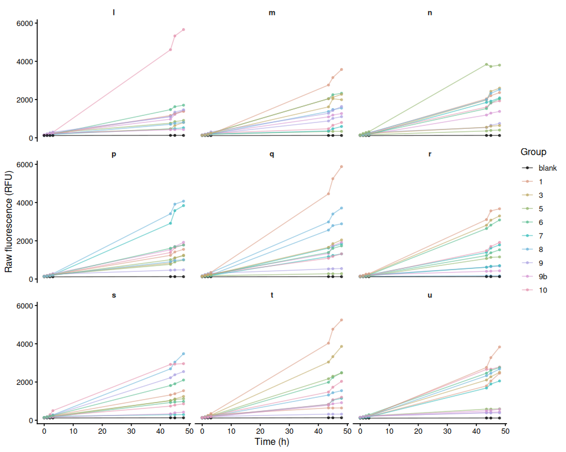
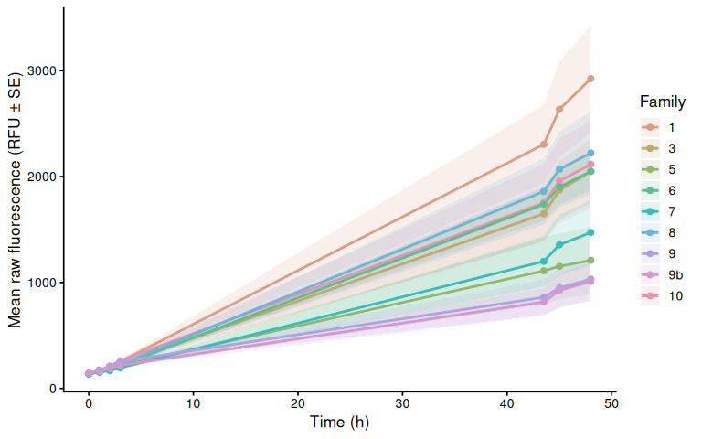
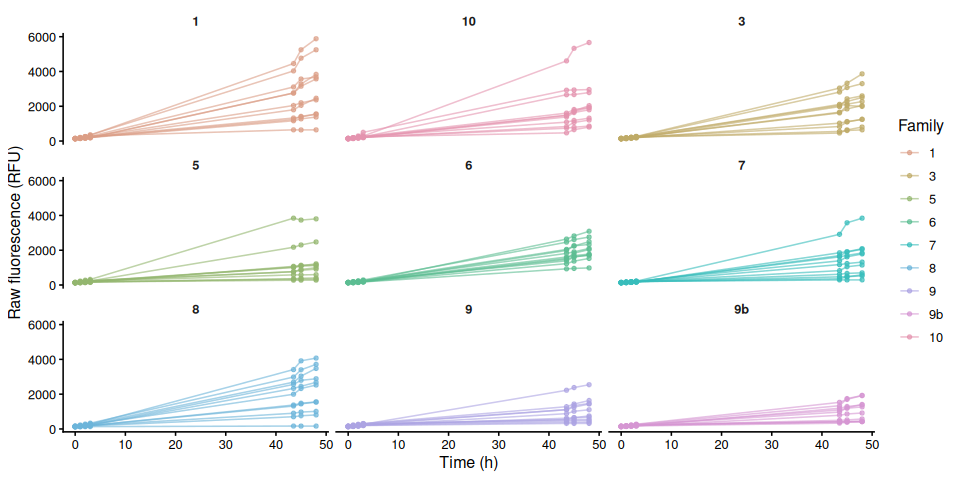
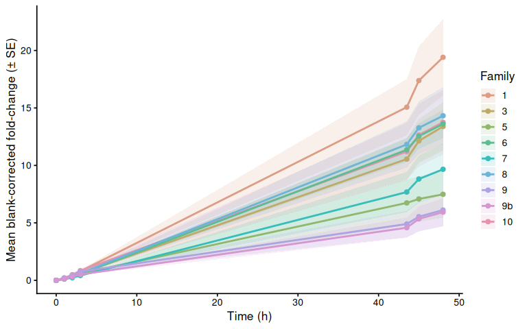
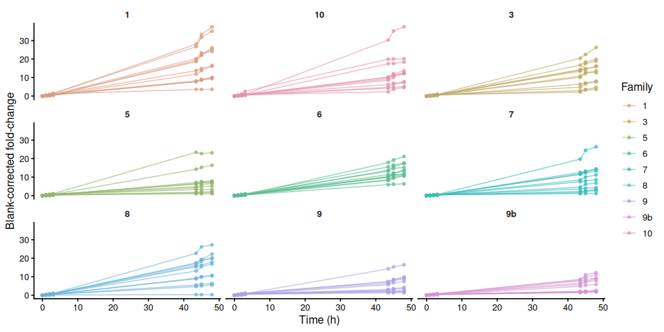
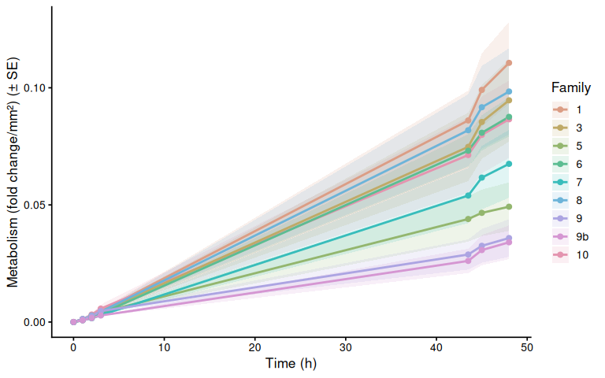
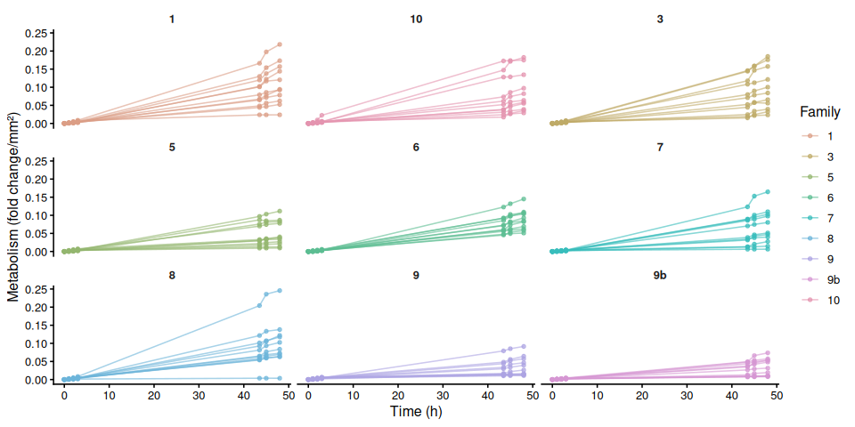
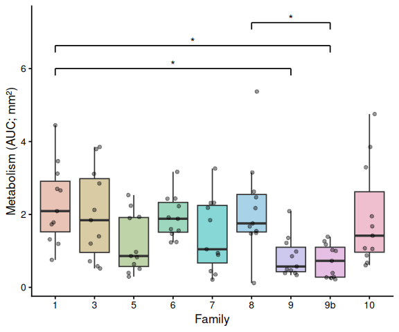

01.00-resazurin-20260602-mgig-freshwater-RT
================
Sam White
2026-06-02

- [1 Background](#1-background)
  - [1.1 Expected inputs](#11-expected-inputs)
  - [1.2 Expected outputs](#12-expected-outputs)
- [2 Setup](#2-setup)
  - [2.1 Knitr options](#21-knitr-options)
  - [2.2 Load libraries](#22-load-libraries)
- [3 Helper Functions](#3-helper-functions)
- [4 Load Data](#4-load-data)
  - [4.1 Plate export files](#41-plate-export-files)
  - [4.2 Plate consistency check](#42-plate-consistency-check)
  - [4.3 Layout file](#43-layout-file)
- [5 Merge Plate Data with Layout](#5-merge-plate-data-with-layout)
- [6 Raw Fluorescence](#6-raw-fluorescence)
  - [6.1 Data frame](#61-data-frame)
  - [6.2 Raw fluorescence by plate (including
    blanks)](#62-raw-fluorescence-by-plate-including-blanks)
  - [6.3 Mean raw fluorescence by
    family](#63-mean-raw-fluorescence-by-family)
  - [6.4 Individual raw fluorescence traces by
    family](#64-individual-raw-fluorescence-traces-by-family)
  - [6.5 Individual raw fluorescence traces by
    treatment](#65-individual-raw-fluorescence-traces-by-treatment)
  - [6.6 Excluded samples](#66-excluded-samples)
- [7 Blank Correction via Fold-Change
  Normalization](#7-blank-correction-via-fold-change-normalization)
  - [7.1 Step 1 – Identify T0 and compute per-sample
    fold-change](#71-step-1--identify-t0-and-compute-per-sample-fold-change)
  - [7.2 Step 2 – Blank fold-change reference per plate per
    timepoint](#72-step-2--blank-fold-change-reference-per-plate-per-timepoint)
  - [7.3 Step 3 – Subtract blank fold-change from sample
    fold-change](#73-step-3--subtract-blank-fold-change-from-sample-fold-change)
- [8 Blank-Corrected Fold-Change](#8-blank-corrected-fold-change)
  - [8.1 Mean by family](#81-mean-by-family)
  - [8.2 Individual traces by family](#82-individual-traces-by-family)
  - [8.3 Individual blank-corrected fold-change traces by
    treatment](#83-individual-blank-corrected-fold-change-traces-by-treatment)
- [9 Metabolism (Size-Normalised
  Fold-Change)](#9-metabolism-size-normalised-fold-change)
  - [9.1 Mean metabolism by family](#91-mean-metabolism-by-family)
  - [9.2 Individual metabolism traces by
    family](#92-individual-metabolism-traces-by-family)
- [10 Time-Series Statistical
  Analysis](#10-time-series-statistical-analysis)
  - [10.1 Results](#101-results)
    - [10.1.1 Metric:
      metabolism_per_area_mm2_measurement](#1011-metric-metabolism_per_area_mm2_measurement)
- [11 AUC Box Plots with Statistical
  Annotations](#11-auc-box-plots-with-statistical-annotations)
- [12 Save Output Data](#12-save-output-data)

# 1 Background

Juvenile oysters from nine USDA families were submerged in 4 mL of room
temperature resazurin working solution prepared with *TAPWATER* in
12-well plates and held at room temperature (~21C). At each designated
timepoint, fluorescence was measured using a Synergy HTX (Agilent) plate
reader.

See `Resazurin/data/20260602-mgig-freshwater-RT/README.md` for full
experimental notes.

## 1.1 Expected inputs

| Path | Description |
|:---|:---|
| `Resazurin/data/20260602-mgig-freshwater-RT/plate-*-T*.txt` | Plate reader fluorescence exports (one file per plate per timepoint) |
| `Resazurin/data/20260602-mgig-freshwater-RT/layout.csv` | Well metadata: plate ID, well ID, blank flag, family groups, sample IDs, area measurements (mm², from ImageJ) |

## 1.2 Expected outputs

All outputs are written to
`Resazurin/outputs/01.00-resazurin-20260602-mgig-freshwater-RT/`.

| File | Description |
|:---|:---|
| `figures/` | All plots generated by this script |
| `auc_all_metrics.csv` | Per-individual AUC values for every active measurement metric |
| `auc_summary.csv` | Group-level AUC summary statistics (mean, SD, SE, median) |
| `metabolism.csv` | Full per-well per-timepoint metabolism data frame |
| `pairwise_stats.csv` | Tukey-adjusted pairwise comparisons from AUC linear models |

# 2 Setup

## 2.1 Knitr options

``` r
knitr::opts_chunk$set(
  echo = TRUE,         # Display code chunks
  eval = TRUE,        # Evaluate code chunks
  warning = FALSE,     # Hide warnings
  message = FALSE,     # Hide messages
  comment = "",         # Prevents appending '##' to beginning of lines in code output
  results = 'hold'     # Holds output so it's all printed together after code chunk
)
```

## 2.2 Load libraries

``` r
library(tidyverse)
library(pracma)       # trapz()
library(lme4)
library(lmerTest)
library(emmeans)
library(multcompView)
library(cowplot)
library(colorspace)   # qualitative_hcl() for large palettes
```

# 3 Helper Functions

``` r
normalize_well_id <- function(x) {
  x <- toupper(trimws(x))
  valid <- str_detect(x, "^[A-Z]+[0-9]+$")
  out <- rep(NA_character_, length(x))
  if (!any(valid)) return(out)
  m <- str_match(x[valid], "^([A-Z]+)([0-9]+)$")
  out[valid] <- paste0(m[, 2], as.integer(m[, 3]))
  out
}

parse_time_hr <- function(path) {
  hit <- str_match(basename(path),
                   "(?i)-T([0-9]+(?:\\.[0-9]+)?)\\.txt$")
  as.numeric(hit[, 2])
}

parse_plate_id <- function(path) {
  hit <- str_match(basename(path),
    "(?i)^plate-([A-Za-z0-9-]+)-T[0-9]+(?:\\.[0-9]+)?\\.txt$")
  id <- hit[, 2]
  ifelse(is.na(id), "unknown", id)
}

extract_results_block <- function(lines) {
  results_idx <- which(trimws(lines) == "Results")
  if (length(results_idx) == 0) stop("No Results section found")
  idx <- results_idx[1]
  header_tokens <- str_split(lines[idx + 1], "\\t")[[1]] |> trimws()
  col_ids <- header_tokens[
    header_tokens != "" & str_detect(header_tokens, "^[0-9]+$")]
  j <- idx + 2
  data_lines <- character()
  while (j <= length(lines)) {
    line <- lines[j]
    if (trimws(line) == "") break
    if (!str_detect(line, "^[A-Za-z]\\t")) break
    data_lines <- c(data_lines, line)
    j <- j + 1
  }
  list(col_ids = col_ids, data_lines = data_lines)
}

parse_plate_export <- function(path) {
  lines <- readLines(path, warn = FALSE)
  res <- extract_results_block(lines)

  map_dfr(res$data_lines, function(line) {
    tokens <- str_split(line, "\\t")[[1]] |> trimws()
    tokens <- tokens[tokens != ""]
    row_letter <- tokens[1]
    nums <- suppressWarnings(as.numeric(tokens[-1]))
    valid_idx <- which(!is.na(nums))
    if (length(valid_idx) == 0) return(tibble())
    vals <- nums[valid_idx]
    n <- min(length(vals), length(res$col_ids))
    tibble(
      row_id  = toupper(row_letter),
      col_id  = as.integer(res$col_ids[seq_len(n)]),
      well_id = normalize_well_id(
        paste0(toupper(row_letter), res$col_ids[seq_len(n)])),
      value   = vals[seq_len(n)]
    )
  }) %>%
    mutate(
      plate_id = str_to_lower(parse_plate_id(path)),
      time_hr  = parse_time_hr(path)
    )
}

trapezoid_auc <- function(time_hr, value) {
  ok <- is.finite(time_hr) & is.finite(value)
  t <- time_hr[ok]
  v <- value[ok]
  if (length(t) < 2) return(NA_real_)
  ord <- order(t)
  t <- t[ord]; v <- v[ord]
  sum(diff(t) * (head(v, -1) + tail(v, -1)) / 2)
}

# Shared helper: extract display unit string from a measurement column name.
# e.g. "area_mm2_measurement" -> "mm²", "weight_mg_measurement" -> "mg"
parse_meas_unit <- function(col_name) {
  unit_raw <- col_name |>
    str_remove("^metabolism_per_") |>
    str_remove("_measurement$") |>
    str_extract("[^_]+$")
  case_when(
    unit_raw == "mm2" ~ "mm²",
    unit_raw == "cm2" ~ "cm²",
    unit_raw == "mm3" ~ "mm³",
    unit_raw == "cm3" ~ "cm³",
    TRUE              ~ unit_raw
  )
}

# y-axis label for metabolism line plots: "fold change/mm²"
metabolism_y_label <- function(col_name) {
  paste0("Metabolism (fold change/", parse_meas_unit(col_name), ")")
}

# y-axis label for AUC box plots: "Metabolism (AUC; mm²)"
auc_y_label <- function(metric_name) {
  paste0("Metabolism (AUC; ", parse_meas_unit(metric_name), ")")
}
```

# 4 Load Data

## 4.1 Plate export files

``` r
proj_root <- rprojroot::find_rstudio_root_file()
data_dir  <- file.path(proj_root, "Resazurin", "data", "20260602-mgig-freshwater-RT")
out_dir   <- file.path(proj_root, "Resazurin", "outputs",
                        "01.00-resazurin-20260602-mgig-freshwater-RT")
fig_dir   <- file.path(out_dir, "figures")

dir.create(fig_dir, recursive = TRUE, showWarnings = FALSE)
dir.create(out_dir, recursive = TRUE, showWarnings = FALSE)

plate_files <- list.files(
  data_dir,
  pattern = "(?i)^plate-.*-T[0-9]+(?:\\.[0-9]+)?\\.txt$",
  full.names = TRUE
)

plate_raw <- map_dfr(plate_files, function(path) {
  tryCatch(parse_plate_export(path),
           error = function(e) {
             message("Parse error in ", basename(path), ": ", e$message)
             tibble()
           })
})

str(plate_raw)
```

    tibble [756 × 6] (S3: tbl_df/tbl/data.frame)
     $ row_id  : chr [1:756] "A" "A" "A" "A" ...
     $ col_id  : int [1:756] 1 2 3 4 1 2 3 4 1 2 ...
     $ well_id : chr [1:756] "A1" "A2" "A3" "A4" ...
     $ value   : num [1:756] 132 145 141 142 147 133 132 141 123 149 ...
     $ plate_id: chr [1:756] "l" "l" "l" "l" ...
     $ time_hr : num [1:756] 0 0 0 0 0 0 0 0 0 0 ...

## 4.2 Plate consistency check

Checks that every plate has the same number of wells at every timepoint.
The expected well count is the mode across all plate × timepoint reads.
Any plate with at least one deviating read is flagged and dropped
entirely before any further analysis — removing only the aberrant
timepoint would break the fold-change baseline calculation.

``` r
well_counts <- plate_raw %>%
  group_by(plate_id, time_hr) %>%
  summarise(n_wells = n_distinct(well_id), .groups = "drop")

expected_n_wells <- as.integer(
  names(which.max(table(well_counts$n_wells)))
)

inconsistent_reads <- well_counts %>%
  filter(n_wells != expected_n_wells) %>%
  arrange(plate_id, time_hr)

inconsistent_plate_ids <- unique(inconsistent_reads$plate_id)

if (nrow(inconsistent_reads) > 0) {
  cat("**Plate consistency check FAILED.**",
      "Expected", expected_n_wells, "wells per plate-timepoint read.",
      length(inconsistent_plate_ids),
      "plate(s) have at least one deviating read and are excluded",
      "from all analyses:\n\n")
  cat(knitr::kable(
    inconsistent_reads,
    col.names = c("Plate", "Time (h)", "Wells read"),
    caption   = paste("Expected:", expected_n_wells, "wells per read")
  ), sep = "\n")
  cat("\n")
  plate_raw <- plate_raw %>%
    filter(!plate_id %in% inconsistent_plate_ids)
  message(length(inconsistent_plate_ids),
          " plate(s) removed from plate_raw: ",
          paste(inconsistent_plate_ids, collapse = ", "))
} else {
  cat("Plate consistency check passed: all",
      n_distinct(well_counts$plate_id), "plates have",
      expected_n_wells, "wells at every timepoint.\n")
}
```

Plate consistency check passed: all 9 plates have 12 wells at every
timepoint.

## 4.3 Layout file

``` r
layout_path <- file.path(data_dir, "layout.csv")

layout_raw <- read_csv(layout_path,
                       col_types = cols(.default = "c"),
                       show_col_types = FALSE)

# Standardise column names to snake_case
names(layout_raw) <- names(layout_raw) |>
  str_to_lower() |>
  str_replace_all("[^a-z0-9]+", "_") |>
  str_replace_all("_+", "_") |>
  str_replace("_$", "")

# Normalise plate_id to match plate file ids (strip "plate-" prefix)
layout_clean <- layout_raw %>%
  mutate(
    plate_id = str_remove(str_to_lower(plate_id), "^plate-"),
    well_id  = normalize_well_id(plate_well),
    is_blank = if ("is_blank" %in% names(layout_raw))
      toupper(trimws(is_blank)) %in% c("TRUE", "T", "1", "YES", "Y")
    else
      FALSE
  )

found_exclude_col <- intersect(
  c("exclude_from_analysis", "exclude", "omit", "not_analyzed"),
  names(layout_clean)
)[1]
layout_clean <- layout_clean %>%
  mutate(
    exclude_from_analysis = if (!is.na(found_exclude_col))
      toupper(trimws(.data[[found_exclude_col]])) %in%
        c("TRUE", "T", "1", "YES", "Y")
    else
      FALSE
  )

# Identify measurement columns and group columns
measurement_cols <- names(layout_clean)[
  str_detect(names(layout_clean), "_measurement$")]
group_cols <- names(layout_clean)[
  str_detect(names(layout_clean), "_group$")]

# Cast measurement columns to numeric
layout_clean <- layout_clean %>%
  mutate(across(all_of(measurement_cols),
                ~ suppressWarnings(as.numeric(.x))))

# Determine which measurement columns actually contain finite data
active_meas_cols <- measurement_cols[
  sapply(measurement_cols, function(col)
    any(is.finite(layout_clean[[col]]), na.rm = TRUE))]

# Normalise group values to lowercase so they match colour scale definitions
layout_clean <- layout_clean %>%
  mutate(across(all_of(group_cols),
                ~ str_to_lower(trimws(as.character(.x)))))

message("Group columns: ", paste(group_cols, collapse = ", "))
message("Active measurement columns: ",
        paste(active_meas_cols, collapse = ", "))

str(layout_clean)
```

    tibble [108 × 14] (S3: tbl_df/tbl/data.frame)
     $ plate_id             : chr [1:108] "l" "l" "l" "l" ...
     $ plate_well           : chr [1:108] "A01" "A02" "A03" "A04" ...
     $ is_blank             : logi [1:108] FALSE FALSE FALSE FALSE FALSE FALSE ...
     $ family_id_group      : chr [1:108] "9" "5" "7" "9b" ...
     $ sample_id_group      : chr [1:108] "1" "2" "3" "4" ...
     $ exclude_from_analysis: logi [1:108] FALSE FALSE FALSE FALSE FALSE FALSE ...
     $ exclude_reason       : chr [1:108] NA NA NA NA ...
     $ weight_g_measurement : num [1:108] NA NA NA NA NA NA NA NA NA NA ...
     $ width_mm_measurement : num [1:108] NA NA NA NA NA NA NA NA NA NA ...
     $ length_mm_measurement: num [1:108] NA NA NA NA NA NA NA NA NA NA ...
     $ treatment_group      : chr [1:108] NA NA NA NA ...
     $ area_mm2_measurement : num [1:108] 152 194 179 165 205 ...
     $ imagej_id            : chr [1:108] "2" "3" "1" "4" ...
     $ well_id              : chr [1:108] "A1" "A2" "A3" "A4" ...

# 5 Merge Plate Data with Layout

``` r
dat <- plate_raw %>%
  left_join(
    layout_clean %>%
      select(plate_id, well_id, is_blank, exclude_from_analysis,
             any_of("exclude_reason"),
             all_of(group_cols), all_of(measurement_cols)),
    by = c("plate_id", "well_id")
  ) %>%
  mutate(
    is_blank = replace_na(is_blank, FALSE),
    exclude_from_analysis = replace_na(exclude_from_analysis, FALSE)
  )

str(dat)
```

    tibble [756 × 16] (S3: tbl_df/tbl/data.frame)
     $ row_id               : chr [1:756] "A" "A" "A" "A" ...
     $ col_id               : int [1:756] 1 2 3 4 1 2 3 4 1 2 ...
     $ well_id              : chr [1:756] "A1" "A2" "A3" "A4" ...
     $ value                : num [1:756] 132 145 141 142 147 133 132 141 123 149 ...
     $ plate_id             : chr [1:756] "l" "l" "l" "l" ...
     $ time_hr              : num [1:756] 0 0 0 0 0 0 0 0 0 0 ...
     $ is_blank             : logi [1:756] FALSE FALSE FALSE FALSE FALSE FALSE ...
     $ exclude_from_analysis: logi [1:756] FALSE FALSE FALSE FALSE FALSE FALSE ...
     $ exclude_reason       : chr [1:756] NA NA NA NA ...
     $ family_id_group      : chr [1:756] "9" "5" "7" "9b" ...
     $ sample_id_group      : chr [1:756] "1" "2" "3" "4" ...
     $ treatment_group      : chr [1:756] NA NA NA NA ...
     $ weight_g_measurement : num [1:756] NA NA NA NA NA NA NA NA NA NA ...
     $ width_mm_measurement : num [1:756] NA NA NA NA NA NA NA NA NA NA ...
     $ length_mm_measurement: num [1:756] NA NA NA NA NA NA NA NA NA NA ...
     $ area_mm2_measurement : num [1:756] 152 194 179 165 205 ...

# 6 Raw Fluorescence

## 6.1 Data frame

``` r
# Wells in the plate reader output that have no layout entry get all-NA group
# columns after the join. Keep only wells assigned to at least one group.
active_gc <- intersect(group_cols, names(dat))

raw_df <- dat %>%
  filter(
    !is_blank,
    if (length(active_gc) > 0)
      if_any(all_of(active_gc), ~ !is.na(.))
    else
      TRUE
  ) %>%
  mutate(
    trace_id = if_else(
      !is.na(sample_id_group) & trimws(as.character(sample_id_group)) != "",
      as.character(sample_id_group),
      paste(plate_id, well_id, sep = "_")
    )
  )

families   <- str_sort(unique(na.omit(raw_df$family_id_group)), numeric = TRUE)
treatments <- sort(unique(na.omit(raw_df$treatment_group)))

n_fam <- length(families)
n_trt <- length(treatments)

# Palette strategy:
#   <= 7 groups : Okabe-Ito (gold standard for colorblind-safe figures).
#   >  7 groups : colorspace::qualitative_hcl("Dynamic") scales to any N
#                 using perceptually uniform HCL space — no colour collisions.
# Black (#000000) is excluded from both and reserved for blank wells.
okabe_ito_7 <- c(
  "#E69F00", "#56B4E9", "#009E73", "#F0E442",
  "#0072B2", "#D55E00", "#CC79A7"
)
make_palette <- function(n) {
  if (n == 0L) return(character(0))
  if (n <= length(okabe_ito_7)) return(okabe_ito_7[seq_len(n)])
  colorspace::qualitative_hcl(n, palette = "Dynamic")
}

all_colours   <- make_palette(n_fam + n_trt)
fam_colours   <- setNames(all_colours[seq_len(n_fam)], families)
trt_colours   <- setNames(all_colours[n_fam + seq_len(n_trt)], treatments)

lty_pool <- c("solid", "dashed", "dotted", "dotdash", "longdash")
trt_linetypes <- setNames(
  lty_pool[(seq_len(n_trt) - 1L) %% length(lty_pool) + 1L],
  treatments
)
plate_well_colours <- c(blank = "black", fam_colours)

has_trt <- n_trt > 0

str(raw_df)
```

    tibble [693 × 17] (S3: tbl_df/tbl/data.frame)
     $ row_id               : chr [1:693] "A" "A" "A" "A" ...
     $ col_id               : int [1:693] 1 2 3 4 1 2 3 4 1 2 ...
     $ well_id              : chr [1:693] "A1" "A2" "A3" "A4" ...
     $ value                : num [1:693] 132 145 141 142 147 133 132 141 123 149 ...
     $ plate_id             : chr [1:693] "l" "l" "l" "l" ...
     $ time_hr              : num [1:693] 0 0 0 0 0 0 0 0 0 0 ...
     $ is_blank             : logi [1:693] FALSE FALSE FALSE FALSE FALSE FALSE ...
     $ exclude_from_analysis: logi [1:693] FALSE FALSE FALSE FALSE FALSE FALSE ...
     $ exclude_reason       : chr [1:693] NA NA NA NA ...
     $ family_id_group      : chr [1:693] "9" "5" "7" "9b" ...
     $ sample_id_group      : chr [1:693] "1" "2" "3" "4" ...
     $ treatment_group      : chr [1:693] NA NA NA NA ...
     $ weight_g_measurement : num [1:693] NA NA NA NA NA NA NA NA NA NA ...
     $ width_mm_measurement : num [1:693] NA NA NA NA NA NA NA NA NA NA ...
     $ length_mm_measurement: num [1:693] NA NA NA NA NA NA NA NA NA NA ...
     $ area_mm2_measurement : num [1:693] 152 194 179 165 205 ...
     $ trace_id             : chr [1:693] "1" "2" "3" "4" ...

## 6.2 Raw fluorescence by plate (including blanks)

``` r
p_raw_plates <- dat %>%
  filter(is.finite(time_hr), is.finite(value)) %>%
  mutate(
    colour_group = if_else(is_blank, "blank",
                           coalesce(family_id_group, "sample")),
    trace_id     = paste(plate_id, well_id, sep = "_")
  ) %>%
  ggplot(aes(x = time_hr, y = value,
             group = trace_id, colour = colour_group)) +
  geom_line(alpha = 0.6) +
  geom_point(size = 1, alpha = 0.7) +
  facet_wrap(~ plate_id) +
  scale_colour_manual(
    values   = plate_well_colours,
    name     = "Group",
    breaks   = names(plate_well_colours),
    na.value = "grey80"
  ) +
  labs(x = "Time (h)", y = "Raw fluorescence (RFU)") +
  theme_classic(base_size = 12) +
  theme(strip.background = element_blank(),
        strip.text       = element_text(face = "bold"))

p_raw_plates
```

<!-- -->

``` r
ggsave(file.path(fig_dir, "raw_fluor_by_plate.png"),
       p_raw_plates, width = 10, height = 8)
```

## 6.3 Mean raw fluorescence by family

``` r
raw_family_summary <- raw_df %>%
  filter(!is.na(family_id_group), !exclude_from_analysis) %>%
  group_by(family_id_group, treatment_group, time_hr) %>%
  summarise(
    mean_fluor = mean(value, na.rm = TRUE),
    se_fluor   = sd(value, na.rm = TRUE) /
      sqrt(sum(!is.na(value))),
    n          = sum(!is.na(value)),
    .groups    = "drop"
  ) %>%
  mutate(group_var = if (has_trt)
    paste(family_id_group, treatment_group, sep = ".")
  else
    family_id_group)

p_raw_mean <- ggplot(raw_family_summary,
    aes(x = time_hr, y = mean_fluor,
        colour = family_id_group,
        group = group_var)) +
  geom_ribbon(aes(ymin = mean_fluor - se_fluor,
                  ymax = mean_fluor + se_fluor,
                  fill = family_id_group),
              alpha = 0.15, colour = NA) +
  geom_line(
    mapping   = if (has_trt) aes(linetype = treatment_group) else NULL,
    linewidth = 1) +
  geom_point(size = 2) +
  scale_colour_manual(values = fam_colours, name = "Family",
                      breaks = families) +
  scale_fill_manual(values = fam_colours, name = "Family",
                    breaks = families) +
  labs(x = "Time (h)", y = "Mean raw fluorescence (RFU ± SE)") +
  theme_classic(base_size = 13) +
  if (has_trt) scale_linetype_manual(values = trt_linetypes, name = "Treatment") else NULL

p_raw_mean
```

<!-- -->

``` r
ggsave(file.path(fig_dir, "raw_mean_by_family.png"),
       p_raw_mean, width = 8, height = 5)
```

## 6.4 Individual raw fluorescence traces by family

``` r
p_raw_by_family <- raw_df %>%
  filter(!is.na(family_id_group)) %>%
  ggplot(aes(x = time_hr, y = value, group = trace_id,
             colour = .data[[if (has_trt) "treatment_group" else "family_id_group"]])) +
  geom_line(alpha = 0.6) +
  geom_point(size = 1.2, alpha = 0.7) +
  facet_wrap(~ family_id_group) +
  scale_colour_manual(
    values = if (has_trt) trt_colours else fam_colours,
    name   = if (has_trt) "Treatment" else "Family",
    breaks = if (has_trt) treatments else families) +
  labs(x = "Time (h)", y = "Raw fluorescence (RFU)") +
  theme_classic(base_size = 12) +
  theme(strip.background = element_blank(),
        strip.text       = element_text(face = "bold"))

p_raw_by_family
```

<!-- -->

``` r
ggsave(file.path(fig_dir, "raw_individual_by_family.png"),
       p_raw_by_family, width = 10, height = 5)
```

## 6.5 Individual raw fluorescence traces by treatment

``` r
if (has_trt) {
  p_raw_by_treatment <- raw_df %>%
    ggplot(aes(x = time_hr, y = value,
               group = trace_id, colour = family_id_group)) +
    geom_line(alpha = 0.6) +
    geom_point(size = 1.2, alpha = 0.7) +
    facet_wrap(~ treatment_group) +
    scale_colour_manual(values = fam_colours, name = "Family",
                        breaks = families) +
    labs(x = "Time (h)", y = "Raw fluorescence (RFU)") +
    theme_classic(base_size = 12) +
    theme(strip.background = element_blank(),
          strip.text       = element_text(face = "bold"))

  p_raw_by_treatment
  ggsave(file.path(fig_dir, "raw_individual_by_treatment.png"),
         p_raw_by_treatment, width = 10, height = 5)
}
```

## 6.6 Excluded samples

Wells flagged `exclude_from_analysis = TRUE` appear in the raw
fluorescence plots above but are omitted from all analyses that follow.

``` r
excluded_wells <- dat %>%
  filter(!is_blank, exclude_from_analysis) %>%
  mutate(
    sample = if_else(
      !is.na(sample_id_group) & trimws(as.character(sample_id_group)) != "",
      as.character(sample_id_group),
      paste(plate_id, well_id, sep = "_")
    )
  ) %>%
  select(plate_id, well_id, sample, family_id_group, treatment_group,
         any_of("exclude_reason")) %>%
  distinct() %>%
  arrange(plate_id, well_id)

if (nrow(excluded_wells) > 0) {
  col_names <- c("Plate", "Well", "Sample", "Family", "Treatment")
  if ("exclude_reason" %in% names(excluded_wells))
    col_names <- c(col_names, "Reason")
  cat(knitr::kable(excluded_wells, col.names = col_names), sep = "\n")
} else {
  cat("No wells are excluded from analysis.\n")
}
```

No wells are excluded from analysis.

# 7 Blank Correction via Fold-Change Normalization

T0 is the earliest timepoint present in the dataset (not necessarily 0
hr). Sample fold-change is expressed relative to each individual’s T0
reading, resolved by `sample_id_group` when that column is populated —
allowing the same animal to be tracked across plates — or by
`plate_id + well_id` when no sample IDs exist (backward-compatible with
single-plate, multi-timepoint designs). Blank fold-change is the
per-plate mean blank RFU at each timepoint divided by the pooled mean
blank RFU at T0. Subtracting blank fold-change from sample fold-change
removes background fluorescence drift; all samples start at exactly 0 at
T0 by construction.

## 7.1 Step 1 – Identify T0 and compute per-sample fold-change

``` r
# T0 = earliest timepoint present in the dataset
t0_time <- min(dat$time_hr[is.finite(dat$time_hr)], na.rm = TRUE)
message("T0 timepoint: ", t0_time, " hr")

# T0 reference value per individual.
# Resolved by sample_id_group (cross-plate tracking) when available;
# falls back to plate+well for layouts without explicit sample IDs.
t0_all <- dat %>%
  filter(time_hr == t0_time, !is_blank, is.finite(value)) %>%
  mutate(sample_key = if_else(
    !is.na(sample_id_group) & trimws(as.character(sample_id_group)) != "",
    as.character(sample_id_group),
    paste(plate_id, well_id, sep = "_")
  )) %>%
  group_by(sample_key) %>%
  summarise(value_t0 = mean(value, na.rm = TRUE), .groups = "drop")

dat_fc <- dat %>%
  mutate(sample_key = if_else(
    !is_blank &
      !is.na(sample_id_group) & trimws(as.character(sample_id_group)) != "",
    as.character(sample_id_group),
    paste(plate_id, well_id, sep = "_")
  )) %>%
  left_join(t0_all, by = "sample_key") %>%
  mutate(fold_change = if_else(
    !is_blank & is.finite(value_t0) & value_t0 > 0,
    value / value_t0,
    NA_real_
  ))

str(dat_fc)
```

    tibble [756 × 19] (S3: tbl_df/tbl/data.frame)
     $ row_id               : chr [1:756] "A" "A" "A" "A" ...
     $ col_id               : int [1:756] 1 2 3 4 1 2 3 4 1 2 ...
     $ well_id              : chr [1:756] "A1" "A2" "A3" "A4" ...
     $ value                : num [1:756] 132 145 141 142 147 133 132 141 123 149 ...
     $ plate_id             : chr [1:756] "l" "l" "l" "l" ...
     $ time_hr              : num [1:756] 0 0 0 0 0 0 0 0 0 0 ...
     $ is_blank             : logi [1:756] FALSE FALSE FALSE FALSE FALSE FALSE ...
     $ exclude_from_analysis: logi [1:756] FALSE FALSE FALSE FALSE FALSE FALSE ...
     $ exclude_reason       : chr [1:756] NA NA NA NA ...
     $ family_id_group      : chr [1:756] "9" "5" "7" "9b" ...
     $ sample_id_group      : chr [1:756] "1" "2" "3" "4" ...
     $ treatment_group      : chr [1:756] NA NA NA NA ...
     $ weight_g_measurement : num [1:756] NA NA NA NA NA NA NA NA NA NA ...
     $ width_mm_measurement : num [1:756] NA NA NA NA NA NA NA NA NA NA ...
     $ length_mm_measurement: num [1:756] NA NA NA NA NA NA NA NA NA NA ...
     $ area_mm2_measurement : num [1:756] 152 194 179 165 205 ...
     $ sample_key           : chr [1:756] "1" "2" "3" "4" ...
     $ value_t0             : num [1:756] 132 145 141 142 147 133 132 141 123 149 ...
     $ fold_change          : num [1:756] 1 1 1 1 1 1 1 1 1 1 ...

## 7.2 Step 2 – Blank fold-change reference per plate per timepoint

``` r
# Pooled mean blank RFU at T0 across all T0 plates
mean_blank_t0 <- dat %>%
  filter(is_blank, time_hr == t0_time, is.finite(value)) %>%
  pull(value) %>%
  mean(na.rm = TRUE)

if (!is.finite(mean_blank_t0))
  message("No blank readings found at T0 (", t0_time,
          " hr); blank correction will produce NA.")

# Per-plate per-timepoint mean blank expressed as fold-change relative to T0
blank_fc_ref <- dat %>%
  filter(is_blank, is.finite(value)) %>%
  group_by(plate_id, time_hr) %>%
  summarise(mean_blank_rfu = mean(value, na.rm = TRUE), .groups = "drop") %>%
  mutate(mean_blank_fc = mean_blank_rfu / mean_blank_t0)

str(blank_fc_ref)
```

    tibble [63 × 4] (S3: tbl_df/tbl/data.frame)
     $ plate_id      : chr [1:63] "l" "l" "l" "l" ...
     $ time_hr       : num [1:63] 0 1 2 3 43.5 45 48 0 1 2 ...
     $ mean_blank_rfu: num [1:63] 119 120 118 119 128 127 126 117 117 117 ...
     $ mean_blank_fc : num [1:63] 1.01 1.02 1 1.01 1.09 ...

## 7.3 Step 3 – Subtract blank fold-change from sample fold-change

``` r
samples <- dat_fc %>%
  filter(!is_blank, !exclude_from_analysis) %>%
  mutate(
    trace_id = if_else(
      !is.na(sample_id_group) & trimws(as.character(sample_id_group)) != "",
      as.character(sample_id_group),
      paste(plate_id, well_id, sep = "_")
    )
  ) %>%
  left_join(blank_fc_ref, by = c("plate_id", "time_hr")) %>%
  mutate(corrected_fc = fold_change - mean_blank_fc)

str(samples)
```

    tibble [693 × 23] (S3: tbl_df/tbl/data.frame)
     $ row_id               : chr [1:693] "A" "A" "A" "A" ...
     $ col_id               : int [1:693] 1 2 3 4 1 2 3 4 1 2 ...
     $ well_id              : chr [1:693] "A1" "A2" "A3" "A4" ...
     $ value                : num [1:693] 132 145 141 142 147 133 132 141 123 149 ...
     $ plate_id             : chr [1:693] "l" "l" "l" "l" ...
     $ time_hr              : num [1:693] 0 0 0 0 0 0 0 0 0 0 ...
     $ is_blank             : logi [1:693] FALSE FALSE FALSE FALSE FALSE FALSE ...
     $ exclude_from_analysis: logi [1:693] FALSE FALSE FALSE FALSE FALSE FALSE ...
     $ exclude_reason       : chr [1:693] NA NA NA NA ...
     $ family_id_group      : chr [1:693] "9" "5" "7" "9b" ...
     $ sample_id_group      : chr [1:693] "1" "2" "3" "4" ...
     $ treatment_group      : chr [1:693] NA NA NA NA ...
     $ weight_g_measurement : num [1:693] NA NA NA NA NA NA NA NA NA NA ...
     $ width_mm_measurement : num [1:693] NA NA NA NA NA NA NA NA NA NA ...
     $ length_mm_measurement: num [1:693] NA NA NA NA NA NA NA NA NA NA ...
     $ area_mm2_measurement : num [1:693] 152 194 179 165 205 ...
     $ sample_key           : chr [1:693] "1" "2" "3" "4" ...
     $ value_t0             : num [1:693] 132 145 141 142 147 133 132 141 123 149 ...
     $ fold_change          : num [1:693] 1 1 1 1 1 1 1 1 1 1 ...
     $ trace_id             : chr [1:693] "1" "2" "3" "4" ...
     $ mean_blank_rfu       : num [1:693] 119 119 119 119 119 119 119 119 119 119 ...
     $ mean_blank_fc        : num [1:693] 1.01 1.01 1.01 1.01 1.01 ...
     $ corrected_fc         : num [1:693] -0.0123 -0.0123 -0.0123 -0.0123 -0.0123 ...

# 8 Blank-Corrected Fold-Change

## 8.1 Mean by family

``` r
bc_fc_summary <- samples %>%
  filter(!is.na(family_id_group), !exclude_from_analysis) %>%
  group_by(family_id_group, treatment_group, time_hr) %>%
  summarise(
    mean_val = mean(corrected_fc, na.rm = TRUE),
    se_val   = sd(corrected_fc, na.rm = TRUE) /
      sqrt(sum(!is.na(corrected_fc))),
    n        = sum(!is.na(corrected_fc)),
    .groups  = "drop"
  ) %>%
  mutate(group_var = if (has_trt)
    paste(family_id_group, treatment_group, sep = ".")
  else
    family_id_group)

p_bc_fc_mean <- ggplot(bc_fc_summary,
    aes(x = time_hr, y = mean_val,
        colour = family_id_group,
        group = group_var)) +
  geom_ribbon(aes(ymin = mean_val - se_val,
                  ymax = mean_val + se_val,
                  fill = family_id_group),
              alpha = 0.15, colour = NA) +
  geom_line(
    mapping   = if (has_trt) aes(linetype = treatment_group) else NULL,
    linewidth = 1) +
  geom_point(size = 2) +
  scale_colour_manual(values = fam_colours, name = "Family",
                      breaks = families) +
  scale_fill_manual(values = fam_colours, name = "Family",
                    breaks = families) +
  labs(x = "Time (h)",
       y = "Mean blank-corrected fold-change (± SE)") +
  theme_classic(base_size = 13) +
  if (has_trt) scale_linetype_manual(values = trt_linetypes, name = "Treatment") else NULL

p_bc_fc_mean
```

<!-- -->

``` r
ggsave(file.path(fig_dir, "blank_corrected_fc_mean_by_family.png"),
       p_bc_fc_mean, width = 8, height = 5)
```

## 8.2 Individual traces by family

``` r
p_bc_fc_by_family <- samples %>%
  filter(!is.na(family_id_group)) %>%
  ggplot(aes(x = time_hr, y = corrected_fc, group = trace_id,
             colour = .data[[if (has_trt) "treatment_group" else "family_id_group"]])) +
  geom_line(alpha = 0.6) +
  geom_point(size = 1.2, alpha = 0.7) +
  facet_wrap(~ family_id_group) +
  scale_colour_manual(
    values = if (has_trt) trt_colours else fam_colours,
    name   = if (has_trt) "Treatment" else "Family",
    breaks = if (has_trt) treatments else families) +
  labs(x = "Time (h)", y = "Blank-corrected fold-change") +
  theme_classic(base_size = 12) +
  theme(strip.background = element_blank(),
        strip.text       = element_text(face = "bold"))

p_bc_fc_by_family
```

<!-- -->

``` r
ggsave(file.path(fig_dir, "blank_corrected_fc_by_family.png"),
       p_bc_fc_by_family, width = 10, height = 5)
```

## 8.3 Individual blank-corrected fold-change traces by treatment

``` r
if (has_trt) {
  p_bc_fc_by_treatment <- samples %>%
    ggplot(aes(x = time_hr, y = corrected_fc,
               group = trace_id, colour = family_id_group)) +
    geom_line(alpha = 0.6) +
    geom_point(size = 1.2, alpha = 0.7) +
    facet_wrap(~ treatment_group) +
    scale_colour_manual(values = fam_colours, name = "Family",
                        breaks = families) +
    labs(x = "Time (h)", y = "Blank-corrected fold-change") +
    theme_classic(base_size = 12) +
    theme(strip.background = element_blank(),
          strip.text       = element_text(face = "bold"))

  p_bc_fc_by_treatment
  ggsave(file.path(fig_dir, "blank_corrected_fc_by_treatment.png"),
         p_bc_fc_by_treatment, width = 10, height = 5)
}
```

# 9 Metabolism (Size-Normalised Fold-Change)

Blank-corrected fold-change divided by each active measurement column.
This is “metabolism” as defined in Huffmyer et al.

``` r
if (length(active_meas_cols) == 0) {
  message("No active measurement columns: skipping metabolism calculation.")
  metabolism_df <- tibble()
} else {
  metabolism_df <- samples
  for (mc in active_meas_cols) {
    out_col <- paste0("metabolism_per_", mc)
    metabolism_df <- metabolism_df %>%
      mutate(!!out_col := if_else(
        is.finite(.data[[mc]]) & .data[[mc]] > 0 &
          is.finite(corrected_fc),
        corrected_fc / .data[[mc]],
        NA_real_
      ))
  }
}

str(metabolism_df)
```

    tibble [693 × 24] (S3: tbl_df/tbl/data.frame)
     $ row_id                             : chr [1:693] "A" "A" "A" "A" ...
     $ col_id                             : int [1:693] 1 2 3 4 1 2 3 4 1 2 ...
     $ well_id                            : chr [1:693] "A1" "A2" "A3" "A4" ...
     $ value                              : num [1:693] 132 145 141 142 147 133 132 141 123 149 ...
     $ plate_id                           : chr [1:693] "l" "l" "l" "l" ...
     $ time_hr                            : num [1:693] 0 0 0 0 0 0 0 0 0 0 ...
     $ is_blank                           : logi [1:693] FALSE FALSE FALSE FALSE FALSE FALSE ...
     $ exclude_from_analysis              : logi [1:693] FALSE FALSE FALSE FALSE FALSE FALSE ...
     $ exclude_reason                     : chr [1:693] NA NA NA NA ...
     $ family_id_group                    : chr [1:693] "9" "5" "7" "9b" ...
     $ sample_id_group                    : chr [1:693] "1" "2" "3" "4" ...
     $ treatment_group                    : chr [1:693] NA NA NA NA ...
     $ weight_g_measurement               : num [1:693] NA NA NA NA NA NA NA NA NA NA ...
     $ width_mm_measurement               : num [1:693] NA NA NA NA NA NA NA NA NA NA ...
     $ length_mm_measurement              : num [1:693] NA NA NA NA NA NA NA NA NA NA ...
     $ area_mm2_measurement               : num [1:693] 152 194 179 165 205 ...
     $ sample_key                         : chr [1:693] "1" "2" "3" "4" ...
     $ value_t0                           : num [1:693] 132 145 141 142 147 133 132 141 123 149 ...
     $ fold_change                        : num [1:693] 1 1 1 1 1 1 1 1 1 1 ...
     $ trace_id                           : chr [1:693] "1" "2" "3" "4" ...
     $ mean_blank_rfu                     : num [1:693] 119 119 119 119 119 119 119 119 119 119 ...
     $ mean_blank_fc                      : num [1:693] 1.01 1.01 1.01 1.01 1.01 ...
     $ corrected_fc                       : num [1:693] -0.0123 -0.0123 -0.0123 -0.0123 -0.0123 ...
     $ metabolism_per_area_mm2_measurement: num [1:693] -8.08e-05 -6.35e-05 -6.88e-05 -7.45e-05 -5.98e-05 ...

## 9.1 Mean metabolism by family

``` r
if (nrow(metabolism_df) > 0) {

  metab_cols <- paste0("metabolism_per_", active_meas_cols)

  for (col in metab_cols) {
    if (!col %in% names(metabolism_df)) next
    mc_label <- str_remove(col, "^metabolism_per_")

    metab_summary <- metabolism_df %>%
      filter(!is.na(family_id_group), !exclude_from_analysis) %>%
      group_by(family_id_group, treatment_group, time_hr) %>%
      summarise(
        mean_val = mean(.data[[col]], na.rm = TRUE),
        se_val   = sd(.data[[col]], na.rm = TRUE) /
          sqrt(sum(!is.na(.data[[col]]))),
        .groups  = "drop"
      ) %>%
      mutate(group_var = if (has_trt)
        paste(family_id_group, treatment_group, sep = ".")
      else
        family_id_group)

    p_metab_mean <- ggplot(metab_summary,
        aes(x = time_hr, y = mean_val,
            colour = family_id_group,
            group = group_var)) +
      geom_ribbon(aes(ymin = mean_val - se_val,
                      ymax = mean_val + se_val,
                      fill = family_id_group),
                  alpha = 0.15, colour = NA) +
      geom_line(
        mapping   = if (has_trt) aes(linetype = treatment_group) else NULL,
        linewidth = 1) +
      geom_point(size = 2) +
      scale_colour_manual(values = fam_colours, name = "Family",
                          breaks = families) +
      scale_fill_manual(values = fam_colours, name = "Family",
                        breaks = families) +
      labs(x = "Time (h)",
           y = paste0(metabolism_y_label(col), " (± SE)")) +
      theme_classic(base_size = 13) +
      if (has_trt) scale_linetype_manual(values = trt_linetypes, name = "Treatment") else NULL

    print(p_metab_mean)
    ggsave(
      file.path(fig_dir,
                paste0("metabolism_mean_", mc_label, ".png")),
      p_metab_mean, width = 8, height = 5)
  }
}
```

<!-- -->

## 9.2 Individual metabolism traces by family

``` r
if (nrow(metabolism_df) > 0) {

  for (col in metab_cols) {
    if (!col %in% names(metabolism_df)) next
    mc_label <- str_remove(col, "^metabolism_per_")

    p_metab_by_family <- metabolism_df %>%
      filter(!is.na(family_id_group)) %>%
      ggplot(aes(x = time_hr, y = .data[[col]], group = trace_id,
                 colour = .data[[if (has_trt) "treatment_group" else "family_id_group"]])) +
      geom_line(alpha = 0.6) +
      geom_point(size = 1.2, alpha = 0.7) +
      facet_wrap(~ family_id_group) +
      scale_colour_manual(
        values = if (has_trt) trt_colours else fam_colours,
        name   = if (has_trt) "Treatment" else "Family",
        breaks = if (has_trt) treatments else families) +
      labs(x = "Time (h)", y = metabolism_y_label(col)) +
      theme_classic(base_size = 12) +
      theme(strip.background = element_blank(),
            strip.text       = element_text(face = "bold"))

    print(p_metab_by_family)
    ggsave(
      file.path(fig_dir,
                paste0("metabolism_individual_", mc_label, "_by_family.png")),
      p_metab_by_family, width = 10, height = 5)

    if (has_trt) {
      p_metab_by_treatment <- ggplot(metabolism_df,
          aes(x = time_hr, y = .data[[col]],
              group = trace_id, colour = family_id_group)) +
        geom_line(alpha = 0.6) +
        geom_point(size = 1.2, alpha = 0.7) +
        facet_wrap(~ treatment_group) +
        scale_colour_manual(values = fam_colours, name = "Family",
                            breaks = families) +
        labs(x = "Time (h)", y = metabolism_y_label(col)) +
        theme_classic(base_size = 12) +
        theme(strip.background = element_blank(),
              strip.text       = element_text(face = "bold"))

      print(p_metab_by_treatment)
      ggsave(
        file.path(fig_dir,
                  paste0("metabolism_individual_", mc_label, "_by_treatment.png")),
        p_metab_by_treatment, width = 10, height = 5)
    }
  }
}
```

<!-- -->

# 10 Time-Series Statistical Analysis

Linear mixed effects models test the effect of experimental variables on
metabolism over time. Individual (`sample_id_group`) is included as a
random intercept to account for repeated measures across timepoints.
Type III ANOVA with Satterthwaite’s approximation (lmerTest) assesses
significance; post-hoc pairwise comparisons use estimated marginal means
(emmeans, Tukey adjustment).

``` r
run_ts_stats <- function(df, value_col) {
  has_family    <- "family_id_group" %in% names(df) &&
    length(unique(na.omit(df$family_id_group))) > 1
  has_treatment <- "treatment_group" %in% names(df) &&
    length(unique(na.omit(df$treatment_group))) > 1

  if (!has_family && !has_treatment) return(NULL)

  df <- df %>%
    filter(is.finite(.data[[value_col]]), is.finite(time_hr)) %>%
    mutate(
      time_f     = factor(time_hr),
      individual = factor(trace_id)
    )

  if (nrow(df) == 0) return(NULL)

  if (has_family)    df <- df %>% mutate(family    = factor(family_id_group))
  if (has_treatment) df <- df %>% mutate(treatment = factor(treatment_group))

  if (has_family    && length(unique(na.omit(df$family)))    < 2) return(NULL)
  if (has_treatment && length(unique(na.omit(df$treatment))) < 2) return(NULL)

  fixed <- if (has_family && has_treatment) {
    paste0(value_col, " ~ time_f * family * treatment")
  } else if (has_family) {
    paste0(value_col, " ~ time_f * family")
  } else {
    paste0(value_col, " ~ time_f * treatment")
  }

  model <- lmer(
    as.formula(paste0(fixed, " + (1 | individual)")),
    data = df
  )

  anova_res <- anova(model, type = 3, ddf = "Satterthwaite")

  # Pairwise comparisons of group combinations at each timepoint
  emm_spec <- if (has_family && has_treatment) {
    ~ family * treatment | time_f
  } else if (has_family) {
    ~ family | time_f
  } else {
    ~ treatment | time_f
  }

  emm       <- emmeans(model, emm_spec)
  pairs_res <- as.data.frame(pairs(emm, adjust = "tukey"))

  # Main-effect marginal means (collapsed across time)
  emm_main <- if (has_family && has_treatment) {
    emmeans(model, ~ family * treatment)
  } else if (has_family) {
    emmeans(model, ~ family)
  } else {
    emmeans(model, ~ treatment)
  }

  pairs_main <- as.data.frame(pairs(emm_main, adjust = "tukey"))

  list(
    model         = model,
    anova         = anova_res,
    pairs_by_time = pairs_res,
    pairs_main    = pairs_main,
    has_family    = has_family,
    has_treatment = has_treatment
  )
}

ts_stats <- list()
if (nrow(metabolism_df) > 0) {
  for (mc in active_meas_cols) {
    col <- paste0("metabolism_per_", mc)
    if (col %in% names(metabolism_df))
      ts_stats[[col]] <- run_ts_stats(metabolism_df, col)
  }
}
```

## 10.1 Results

``` r
for (col in names(ts_stats)) {
  res <- ts_stats[[col]]
  if (is.null(res)) next

  cat("\n\n----\n### Metric:", col, "\n\n")

  cat("**Type III ANOVA (Satterthwaite approximation):**\n")
  print(res$anova)

  cat("\n**Marginal means – main effects (collapsed across time):**\n")
  print(res$pairs_main)

  cat("\n**Pairwise comparisons by timepoint (Tukey):**\n")
  print(res$pairs_by_time)
}
```

| \### Metric: metabolism_per_area_mm2_measurement |
|:---|
| Signif. codes: 0 ‘***’ 0.001 ’**’ 0.01 ’*’ 0.05 ‘.’ 0.1 ’ ’ 1 |
| **Marginal means – main effects (collapsed across time):** contrast estimate SE df t.ratio p.value 1 - 10 0.008076965 0.0078488 90 1.029 0.9820 1 - 3 0.005941507 0.0078488 90 0.757 0.9977 1 - 5 0.022411481 0.0078488 90 2.855 0.1141 1 - 6 0.008093258 0.0078488 90 1.031 0.9818 1 - 7 0.016560387 0.0078488 90 2.110 0.4733 1 - 8 0.003445548 0.0078488 90 0.439 1.0000 1 - 9 0.028389427 0.0078488 90 3.617 0.0139 1 - 9b 0.029771772 0.0078488 90 3.793 0.0079 10 - 3 -0.002135459 0.0078488 90 -0.272 1.0000 10 - 5 0.014334516 0.0078488 90 1.826 0.6648 10 - 6 0.000016293 0.0078488 90 0.002 1.0000 10 - 7 0.008483422 0.0078488 90 1.081 0.9756 10 - 8 -0.004631417 0.0078488 90 -0.590 0.9996 10 - 9 0.020312462 0.0078488 90 2.588 0.2064 10 - 9b 0.021694807 0.0078488 90 2.764 0.1410 3 - 5 0.016469975 0.0078488 90 2.098 0.4810 3 - 6 0.002151752 0.0078488 90 0.274 1.0000 3 - 7 0.010618880 0.0078488 90 1.353 0.9120 3 - 8 -0.002495958 0.0078488 90 -0.318 1.0000 3 - 9 0.022447920 0.0078488 90 2.860 0.1128 3 - 9b 0.023830266 0.0078488 90 3.036 0.0729 5 - 6 -0.014318223 0.0078488 90 -1.824 0.6662 5 - 7 -0.005851095 0.0078488 90 -0.745 0.9979 5 - 8 -0.018965933 0.0078488 90 -2.416 0.2881 5 - 9 0.005977945 0.0078488 90 0.762 0.9976 5 - 9b 0.007360291 0.0078488 90 0.938 0.9901 6 - 7 0.008467128 0.0078488 90 1.079 0.9759 6 - 8 -0.004647710 0.0078488 90 -0.592 0.9996 6 - 9 0.020296168 0.0078488 90 2.586 0.2073 6 - 9b 0.021678514 0.0078488 90 2.762 0.1417 7 - 8 -0.013114839 0.0078488 90 -1.671 0.7623 7 - 9 0.011829040 0.0078488 90 1.507 0.8494 7 - 9b 0.013211386 0.0078488 90 1.683 0.7550 8 - 9 0.024943879 0.0078488 90 3.178 0.0501 8 - 9b 0.026326224 0.0078488 90 3.354 0.0305 9 - 9b 0.001382346 0.0078488 90 0.176 1.0000 |
| Results are averaged over the levels of: time_f Degrees-of-freedom method: kenward-roger P value adjustment: tukey method for comparing a family of 9 estimates |
| **Pairwise comparisons by timepoint (Tukey):** time_f = 0: contrast estimate SE df t.ratio p.value 1 - 10 0.00002766 0.01190162 371.34 0.002 1.0000 1 - 3 0.00000282 0.01190162 371.34 0.000 1.0000 1 - 5 0.00002968 0.01190162 371.34 0.002 1.0000 1 - 6 0.00006561 0.01190162 371.34 0.006 1.0000 1 - 7 0.00004174 0.01190162 371.34 0.004 1.0000 1 - 8 0.00005309 0.01190162 371.34 0.004 1.0000 1 - 9 0.00001587 0.01190162 371.34 0.001 1.0000 1 - 9b 0.00001349 0.01190162 371.34 0.001 1.0000 10 - 3 -0.00002485 0.01190162 371.34 -0.002 1.0000 10 - 5 0.00000202 0.01190162 371.34 0.000 1.0000 10 - 6 0.00003795 0.01190162 371.34 0.003 1.0000 10 - 7 0.00001408 0.01190162 371.34 0.001 1.0000 10 - 8 0.00002543 0.01190162 371.34 0.002 1.0000 10 - 9 -0.00001180 0.01190162 371.34 -0.001 1.0000 10 - 9b -0.00001417 0.01190162 371.34 -0.001 1.0000 3 - 5 0.00002687 0.01190162 371.34 0.002 1.0000 3 - 6 0.00006280 0.01190162 371.34 0.005 1.0000 3 - 7 0.00003892 0.01190162 371.34 0.003 1.0000 3 - 8 0.00005027 0.01190162 371.34 0.004 1.0000 3 - 9 0.00001305 0.01190162 371.34 0.001 1.0000 3 - 9b 0.00001068 0.01190162 371.34 0.001 1.0000 5 - 6 0.00003593 0.01190162 371.34 0.003 1.0000 5 - 7 0.00001206 0.01190162 371.34 0.001 1.0000 5 - 8 0.00002341 0.01190162 371.34 0.002 1.0000 5 - 9 -0.00001381 0.01190162 371.34 -0.001 1.0000 5 - 9b -0.00001619 0.01190162 371.34 -0.001 1.0000 6 - 7 -0.00002387 0.01190162 371.34 -0.002 1.0000 6 - 8 -0.00001252 0.01190162 371.34 -0.001 1.0000 6 - 9 -0.00004974 0.01190162 371.34 -0.004 1.0000 6 - 9b -0.00005212 0.01190162 371.34 -0.004 1.0000 7 - 8 0.00001135 0.01190162 371.34 0.001 1.0000 7 - 9 -0.00002587 0.01190162 371.34 -0.002 1.0000 7 - 9b -0.00002825 0.01190162 371.34 -0.002 1.0000 8 - 9 -0.00003722 0.01190162 371.34 -0.003 1.0000 8 - 9b -0.00003960 0.01190162 371.34 -0.003 1.0000 9 - 9b -0.00000237 0.01190162 371.34 0.000 1.0000 |
| time_f = 1: contrast estimate SE df t.ratio p.value 1 - 10 -0.00001916 0.01190162 371.34 -0.002 1.0000 1 - 3 0.00017301 0.01190162 371.34 0.015 1.0000 1 - 5 0.00002130 0.01190162 371.34 0.002 1.0000 1 - 6 0.00046549 0.01190162 371.34 0.039 1.0000 1 - 7 0.00042760 0.01190162 371.34 0.036 1.0000 1 - 8 -0.00001296 0.01190162 371.34 -0.001 1.0000 1 - 9 -0.00005027 0.01190162 371.34 -0.004 1.0000 1 - 9b 0.00053069 0.01190162 371.34 0.045 1.0000 10 - 3 0.00019217 0.01190162 371.34 0.016 1.0000 10 - 5 0.00004047 0.01190162 371.34 0.003 1.0000 10 - 6 0.00048466 0.01190162 371.34 0.041 1.0000 10 - 7 0.00044677 0.01190162 371.34 0.038 1.0000 10 - 8 0.00000620 0.01190162 371.34 0.001 1.0000 10 - 9 -0.00003111 0.01190162 371.34 -0.003 1.0000 10 - 9b 0.00054985 0.01190162 371.34 0.046 1.0000 3 - 5 -0.00015170 0.01190162 371.34 -0.013 1.0000 3 - 6 0.00029249 0.01190162 371.34 0.025 1.0000 3 - 7 0.00025460 0.01190162 371.34 0.021 1.0000 3 - 8 -0.00018597 0.01190162 371.34 -0.016 1.0000 3 - 9 -0.00022328 0.01190162 371.34 -0.019 1.0000 3 - 9b 0.00035768 0.01190162 371.34 0.030 1.0000 5 - 6 0.00044419 0.01190162 371.34 0.037 1.0000 5 - 7 0.00040630 0.01190162 371.34 0.034 1.0000 5 - 8 -0.00003427 0.01190162 371.34 -0.003 1.0000 5 - 9 -0.00007157 0.01190162 371.34 -0.006 1.0000 5 - 9b 0.00050938 0.01190162 371.34 0.043 1.0000 6 - 7 -0.00003789 0.01190162 371.34 -0.003 1.0000 6 - 8 -0.00047845 0.01190162 371.34 -0.040 1.0000 6 - 9 -0.00051576 0.01190162 371.34 -0.043 1.0000 6 - 9b 0.00006520 0.01190162 371.34 0.005 1.0000 7 - 8 -0.00044057 0.01190162 371.34 -0.037 1.0000 7 - 9 -0.00047787 0.01190162 371.34 -0.040 1.0000 7 - 9b 0.00010309 0.01190162 371.34 0.009 1.0000 8 - 9 -0.00003731 0.01190162 371.34 -0.003 1.0000 8 - 9b 0.00054365 0.01190162 371.34 0.046 1.0000 9 - 9b 0.00058096 0.01190162 371.34 0.049 1.0000 |
| time_f = 2: contrast estimate SE df t.ratio p.value 1 - 10 -0.00042311 0.01190162 371.34 -0.036 1.0000 1 - 3 0.00021173 0.01190162 371.34 0.018 1.0000 1 - 5 0.00032898 0.01190162 371.34 0.028 1.0000 1 - 6 0.00075030 0.01190162 371.34 0.063 1.0000 1 - 7 0.00116499 0.01190162 371.34 0.098 1.0000 1 - 8 0.00003048 0.01190162 371.34 0.003 1.0000 1 - 9 0.00024487 0.01190162 371.34 0.021 1.0000 1 - 9b 0.00110391 0.01190162 371.34 0.093 1.0000 10 - 3 0.00063484 0.01190162 371.34 0.053 1.0000 10 - 5 0.00075208 0.01190162 371.34 0.063 1.0000 10 - 6 0.00117341 0.01190162 371.34 0.099 1.0000 10 - 7 0.00158809 0.01190162 371.34 0.133 1.0000 10 - 8 0.00045358 0.01190162 371.34 0.038 1.0000 10 - 9 0.00066798 0.01190162 371.34 0.056 1.0000 10 - 9b 0.00152702 0.01190162 371.34 0.128 1.0000 3 - 5 0.00011724 0.01190162 371.34 0.010 1.0000 3 - 6 0.00053857 0.01190162 371.34 0.045 1.0000 3 - 7 0.00095325 0.01190162 371.34 0.080 1.0000 3 - 8 -0.00018126 0.01190162 371.34 -0.015 1.0000 3 - 9 0.00003314 0.01190162 371.34 0.003 1.0000 3 - 9b 0.00089218 0.01190162 371.34 0.075 1.0000 5 - 6 0.00042133 0.01190162 371.34 0.035 1.0000 5 - 7 0.00083601 0.01190162 371.34 0.070 1.0000 5 - 8 -0.00029850 0.01190162 371.34 -0.025 1.0000 5 - 9 -0.00008410 0.01190162 371.34 -0.007 1.0000 5 - 9b 0.00077494 0.01190162 371.34 0.065 1.0000 6 - 7 0.00041468 0.01190162 371.34 0.035 1.0000 6 - 8 -0.00071983 0.01190162 371.34 -0.060 1.0000 6 - 9 -0.00050543 0.01190162 371.34 -0.042 1.0000 6 - 9b 0.00035361 0.01190162 371.34 0.030 1.0000 7 - 8 -0.00113451 0.01190162 371.34 -0.095 1.0000 7 - 9 -0.00092011 0.01190162 371.34 -0.077 1.0000 7 - 9b -0.00006107 0.01190162 371.34 -0.005 1.0000 8 - 9 0.00021440 0.01190162 371.34 0.018 1.0000 8 - 9b 0.00107344 0.01190162 371.34 0.090 1.0000 9 - 9b 0.00085904 0.01190162 371.34 0.072 1.0000 |
| time_f = 3: contrast estimate SE df t.ratio p.value 1 - 10 -0.00109896 0.01190162 371.34 -0.092 1.0000 1 - 3 0.00025121 0.01190162 371.34 0.021 1.0000 1 - 5 0.00053536 0.01190162 371.34 0.045 1.0000 1 - 6 0.00109644 0.01190162 371.34 0.092 1.0000 1 - 7 0.00168014 0.01190162 371.34 0.141 1.0000 1 - 8 0.00024485 0.01190162 371.34 0.021 1.0000 1 - 9 -0.00004740 0.01190162 371.34 -0.004 1.0000 1 - 9b 0.00182651 0.01190162 371.34 0.153 1.0000 10 - 3 0.00135017 0.01190162 371.34 0.113 1.0000 10 - 5 0.00163432 0.01190162 371.34 0.137 1.0000 10 - 6 0.00219539 0.01190162 371.34 0.184 1.0000 10 - 7 0.00277909 0.01190162 371.34 0.234 1.0000 10 - 8 0.00134381 0.01190162 371.34 0.113 1.0000 10 - 9 0.00105155 0.01190162 371.34 0.088 1.0000 10 - 9b 0.00292547 0.01190162 371.34 0.246 1.0000 3 - 5 0.00028415 0.01190162 371.34 0.024 1.0000 3 - 6 0.00084522 0.01190162 371.34 0.071 1.0000 3 - 7 0.00142892 0.01190162 371.34 0.120 1.0000 3 - 8 -0.00000636 0.01190162 371.34 -0.001 1.0000 3 - 9 -0.00029862 0.01190162 371.34 -0.025 1.0000 3 - 9b 0.00157530 0.01190162 371.34 0.132 1.0000 5 - 6 0.00056107 0.01190162 371.34 0.047 1.0000 5 - 7 0.00114477 0.01190162 371.34 0.096 1.0000 5 - 8 -0.00029051 0.01190162 371.34 -0.024 1.0000 5 - 9 -0.00058277 0.01190162 371.34 -0.049 1.0000 5 - 9b 0.00129115 0.01190162 371.34 0.108 1.0000 6 - 7 0.00058370 0.01190162 371.34 0.049 1.0000 6 - 8 -0.00085158 0.01190162 371.34 -0.072 1.0000 6 - 9 -0.00114384 0.01190162 371.34 -0.096 1.0000 6 - 9b 0.00073007 0.01190162 371.34 0.061 1.0000 7 - 8 -0.00143528 0.01190162 371.34 -0.121 1.0000 7 - 9 -0.00172754 0.01190162 371.34 -0.145 1.0000 7 - 9b 0.00014637 0.01190162 371.34 0.012 1.0000 8 - 9 -0.00029226 0.01190162 371.34 -0.025 1.0000 8 - 9b 0.00158166 0.01190162 371.34 0.133 1.0000 9 - 9b 0.00187391 0.01190162 371.34 0.157 1.0000 |
| time_f = 43.5: contrast estimate SE df t.ratio p.value 1 - 10 0.01476764 0.01190162 371.34 1.241 0.9469 1 - 3 0.01127310 0.01190162 371.34 0.947 0.9900 1 - 5 0.04207166 0.01190162 371.34 3.535 0.0135 1 - 6 0.01293393 0.01190162 371.34 1.087 0.9759 1 - 7 0.03205686 0.01190162 371.34 2.693 0.1537 1 - 8 0.00417375 0.01190162 371.34 0.351 1.0000 1 - 9 0.05722750 0.01190162 371.34 4.808 \<0.0001 1 - 9b 0.05995898 0.01190162 371.34 5.038 \<0.0001 10 - 3 -0.00349454 0.01190162 371.34 -0.294 1.0000 10 - 5 0.02730402 0.01190162 371.34 2.294 0.3483 10 - 6 -0.00183371 0.01190162 371.34 -0.154 1.0000 10 - 7 0.01728922 0.01190162 371.34 1.453 0.8763 10 - 8 -0.01059389 0.01190162 371.34 -0.890 0.9934 10 - 9 0.04245986 0.01190162 371.34 3.568 0.0120 10 - 9b 0.04519134 0.01190162 371.34 3.797 0.0053 3 - 5 0.03079856 0.01190162 371.34 2.588 0.1953 3 - 6 0.00166083 0.01190162 371.34 0.140 1.0000 3 - 7 0.02078376 0.01190162 371.34 1.746 0.7173 3 - 8 -0.00709935 0.01190162 371.34 -0.597 0.9996 3 - 9 0.04595440 0.01190162 371.34 3.861 0.0042 3 - 9b 0.04868588 0.01190162 371.34 4.091 0.0017 5 - 6 -0.02913773 0.01190162 371.34 -2.448 0.2613 5 - 7 -0.01001480 0.01190162 371.34 -0.841 0.9955 5 - 8 -0.03789792 0.01190162 371.34 -3.184 0.0414 5 - 9 0.01515584 0.01190162 371.34 1.273 0.9385 5 - 9b 0.01788732 0.01190162 371.34 1.503 0.8538 6 - 7 0.01912293 0.01190162 371.34 1.607 0.8008 6 - 8 -0.00876018 0.01190162 371.34 -0.736 0.9982 6 - 9 0.04429357 0.01190162 371.34 3.722 0.0070 6 - 9b 0.04702505 0.01190162 371.34 3.951 0.0030 7 - 8 -0.02788312 0.01190162 371.34 -2.343 0.3193 7 - 9 0.02517064 0.01190162 371.34 2.115 0.4647 7 - 9b 0.02790212 0.01190162 371.34 2.344 0.3184 8 - 9 0.05305376 0.01190162 371.34 4.458 0.0004 8 - 9b 0.05578523 0.01190162 371.34 4.687 0.0001 9 - 9b 0.00273148 0.01190162 371.34 0.230 1.0000 |
| time_f = 45: contrast estimate SE df t.ratio p.value 1 - 10 0.01920178 0.01190162 371.34 1.613 0.7971 1 - 3 0.01369257 0.01190162 371.34 1.150 0.9659 1 - 5 0.05248754 0.01190162 371.34 4.410 0.0005 1 - 6 0.01828885 0.01190162 371.34 1.537 0.8375 1 - 7 0.03744101 0.01190162 371.34 3.146 0.0464 1 - 8 0.00739577 0.01190162 371.34 0.621 0.9995 1 - 9 0.06655196 0.01190162 371.34 5.592 \<0.0001 1 - 9b 0.06837570 0.01190162 371.34 5.745 \<0.0001 10 - 3 -0.00550921 0.01190162 371.34 -0.463 0.9999 10 - 5 0.03328576 0.01190162 371.34 2.797 0.1198 10 - 6 -0.00091293 0.01190162 371.34 -0.077 1.0000 10 - 7 0.01823923 0.01190162 371.34 1.532 0.8396 10 - 8 -0.01180601 0.01190162 371.34 -0.992 0.9865 10 - 9 0.04735017 0.01190162 371.34 3.978 0.0027 10 - 9b 0.04917392 0.01190162 371.34 4.132 0.0015 3 - 5 0.03879497 0.01190162 371.34 3.260 0.0329 3 - 6 0.00459628 0.01190162 371.34 0.386 1.0000 3 - 7 0.02374844 0.01190162 371.34 1.995 0.5476 3 - 8 -0.00629680 0.01190162 371.34 -0.529 0.9998 3 - 9 0.05285938 0.01190162 371.34 4.441 0.0004 3 - 9b 0.05468313 0.01190162 371.34 4.595 0.0002 5 - 6 -0.03419869 0.01190162 371.34 -2.873 0.0986 5 - 7 -0.01504653 0.01190162 371.34 -1.264 0.9409 5 - 8 -0.04509177 0.01190162 371.34 -3.789 0.0055 5 - 9 0.01406441 0.01190162 371.34 1.182 0.9600 5 - 9b 0.01588816 0.01190162 371.34 1.335 0.9202 6 - 7 0.01915216 0.01190162 371.34 1.609 0.7994 6 - 8 -0.01089307 0.01190162 371.34 -0.915 0.9920 6 - 9 0.04826311 0.01190162 371.34 4.055 0.0020 6 - 9b 0.05008685 0.01190162 371.34 4.208 0.0011 7 - 8 -0.03004523 0.01190162 371.34 -2.524 0.2236 7 - 9 0.02911095 0.01190162 371.34 2.446 0.2625 7 - 9b 0.03093469 0.01190162 371.34 2.599 0.1904 8 - 9 0.05915618 0.01190162 371.34 4.970 \<0.0001 8 - 9b 0.06097993 0.01190162 371.34 5.124 \<0.0001 9 - 9b 0.00182374 0.01190162 371.34 0.153 1.0000 |
| time_f = 48: contrast estimate SE df t.ratio p.value 1 - 10 0.02408289 0.01190162 371.34 2.023 0.5279 1 - 3 0.01598610 0.01190162 371.34 1.343 0.9176 1 - 5 0.06140584 0.01190162 371.34 5.159 \<0.0001 1 - 6 0.02305219 0.01190162 371.34 1.937 0.5885 1 - 7 0.04311037 0.01190162 371.34 3.622 0.0100 1 - 8 0.01223386 0.01190162 371.34 1.028 0.9830 1 - 9 0.07478346 0.01190162 371.34 6.283 \<0.0001 1 - 9b 0.07659312 0.01190162 371.34 6.436 \<0.0001 10 - 3 -0.00809679 0.01190162 371.34 -0.680 0.9990 10 - 5 0.03732294 0.01190162 371.34 3.136 0.0478 10 - 6 -0.00103071 0.01190162 371.34 -0.087 1.0000 10 - 7 0.01902747 0.01190162 371.34 1.599 0.8052 10 - 8 -0.01184903 0.01190162 371.34 -0.996 0.9862 10 - 9 0.05070057 0.01190162 371.34 4.260 0.0009 10 - 9b 0.05251023 0.01190162 371.34 4.412 0.0005 3 - 5 0.04541973 0.01190162 371.34 3.816 0.0049 3 - 6 0.00706608 0.01190162 371.34 0.594 0.9996 3 - 7 0.02712426 0.01190162 371.34 2.279 0.3576 3 - 8 -0.00375224 0.01190162 371.34 -0.315 1.0000 3 - 9 0.05879736 0.01190162 371.34 4.940 \<0.0001 3 - 9b 0.06060702 0.01190162 371.34 5.092 \<0.0001 5 - 6 -0.03835365 0.01190162 371.34 -3.223 0.0369 5 - 7 -0.01829547 0.01190162 371.34 -1.537 0.8373 5 - 8 -0.04917198 0.01190162 371.34 -4.132 0.0015 5 - 9 0.01337762 0.01190162 371.34 1.124 0.9703 5 - 9b 0.01518728 0.01190162 371.34 1.276 0.9378 6 - 7 0.02005818 0.01190162 371.34 1.685 0.7553 6 - 8 -0.01081833 0.01190162 371.34 -0.909 0.9924 6 - 9 0.05173127 0.01190162 371.34 4.347 0.0006 6 - 9b 0.05354093 0.01190162 371.34 4.499 0.0003 7 - 8 -0.03087651 0.01190162 371.34 -2.594 0.1925 7 - 9 0.03167309 0.01190162 371.34 2.661 0.1656 7 - 9b 0.03348275 0.01190162 371.34 2.813 0.1149 8 - 9 0.06254960 0.01190162 371.34 5.256 \<0.0001 8 - 9b 0.06435926 0.01190162 371.34 5.408 \<0.0001 9 - 9b 0.00180966 0.01190162 371.34 0.152 1.0000 |
| Degrees-of-freedom method: kenward-roger P value adjustment: tukey method for comparing a family of 9 estimates |
| \# Area Under the Curve (AUC) |
| AUC computed per individual via the trapezoid rule across all timepoints. `metabolism_per_*` is the primary metric matching the paper; `corrected_fc` and `raw_fluorescence` are retained for reference. |
| \`\`\` r compute_auc \<- function(df, value_col, group_vars) { df %\>% filter(is.finite(time_hr), is.finite(.data$$\[value_col$$\])) %\>% group_by(across(all_of(group_vars))) %\>% summarise( AUC = trapezoid_auc(time_hr, .data$$\[value_col$$\]), n_timepoints = n(), .groups = “drop” ) %\>% filter(is.finite(AUC)) } |
| \# Only include grouping columns that are actually present in the data individual_vars \<- intersect( c(“trace_id”, “family_id_group”, “treatment_group”), names(metabolism_df) ) |
| auc_metab_list \<- list() if (nrow(metabolism_df) \> 0) { for (mc in active_meas_cols) { col \<- paste0(“metabolism_per\_”, mc) if (col %in% names(metabolism_df)) { auc_metab_list$$\[col$$\] \<- compute_auc(metabolism_df, col, individual_vars) %\>% mutate(metric = col) } } } |
| auc_all \<- bind_rows(auc_metab_list) |
| str(auc_all) \`\`\` |
| `tibble [99 × 6] (S3: tbl_df/tbl/data.frame) $ trace_id       : chr [1:99] "1" "10" "11" "12" ... $ family_id_group: chr [1:99] "9" "9" "9b" "9" ... $ treatment_group: chr [1:99] NA NA NA NA ... $ AUC            : num [1:99] 1.357 0.983 0.274 1.219 0.397 ... $ n_timepoints   : int [1:99] 7 7 7 7 7 7 7 7 7 7 ... $ metric         : chr [1:99] "metabolism_per_area_mm2_measurement" "metabolism_per_area_mm2_measurement" "metabolism_per_area_mm2_measurement" "metabolism_per_area_mm2_measurement" ...` |
| \## AUC summary tables |
| \`\`\` r sum_vars \<- intersect( c(“metric”, “family_id_group”, “treatment_group”), names(auc_all) ) auc_summary \<- auc_all %\>% group_by(across(all_of(sum_vars))) %\>% summarise( n = n(), mean = mean(AUC, na.rm = TRUE), sd = sd(AUC, na.rm = TRUE), se = sd / sqrt(n), median = median(AUC, na.rm = TRUE), .groups = “drop” ) |
| print(auc_summary) \`\`\` |
| `# A tibble: 9 × 8 metric          family_id_group treatment_group     n  mean    sd    se median <chr>           <chr>           <chr>           <int> <dbl> <dbl> <dbl>  <dbl> 1 metabolism_per… 1               <NA>               11 2.30  1.10  0.332  2.09 2 metabolism_per… 10              <NA>               11 1.93  1.41  0.424  1.42 3 metabolism_per… 3               <NA>               11 2.00  1.25  0.375  1.84 4 metabolism_per… 5               <NA>               11 1.19  0.803 0.242  0.860 5 metabolism_per… 6               <NA>               11 1.92  0.596 0.180  1.88 6 metabolism_per… 7               <NA>               11 1.44  0.997 0.301  1.05 7 metabolism_per… 8               <NA>               11 2.17  1.32  0.399  1.76 8 metabolism_per… 9               <NA>               11 0.833 0.546 0.164  0.572 9 metabolism_per… 9b              <NA>               11 0.729 0.456 0.138  0.728` |
| \# Statistical Analysis |
| Each individual oyster (`sample_id_group`) is the observational unit. The model is built from whichever grouping factors are present: both family and treatment (with interaction) when both exist, or a one-way model when only one factor is available. Each plate maps to a unique family × treatment combination, so plate-level and group-level variance are confounded; interpret accordingly. |
| \`\`\` r run_auc_stats \<- function(auc_df) { empty \<- tibble() |
| has_family \<- “family_id_group” %in% names(auc_df) && length(unique(na.omit(auc_df$family_id_group))) > 1
has_treatment <- "treatment_group" %in% names(auc_df) &&
length(unique(na.omit(auc_df$treatment_group))) \> 1 |
| if (!has_family && !has_treatment) { return(list(model = NULL, anova = NULL, pairs_full = empty, pairs_family = empty, pairs_trt = empty, has_family = FALSE, has_treatment = FALSE)) } |
| if (has_family) auc_df \<- auc_df %\>% mutate(family = factor(family_id_group)) if (has_treatment) auc_df \<- auc_df %\>% mutate(treatment = factor(treatment_group)) |
| formula_str \<- if (has_family && has_treatment) { “AUC ~ family \* treatment” } else if (has_family) { “AUC ~ family” } else { “AUC ~ treatment” } model \<- lm(as.formula(formula_str), data = auc_df) anova_res \<- anova(model) |
| if (has_family && has_treatment) { pairs_full \<- as.data.frame(pairs(emmeans(model, ~ family \* treatment), adjust = “tukey”)) pairs_family \<- as.data.frame(pairs(emmeans(model, ~ family), adjust = “tukey”)) pairs_trt \<- as.data.frame(pairs(emmeans(model, ~ treatment), adjust = “tukey”)) } else if (has_family) { pairs_family \<- as.data.frame(pairs(emmeans(model, ~ family), adjust = “tukey”)) pairs_full \<- pairs_family pairs_trt \<- empty } else { pairs_trt \<- as.data.frame(pairs(emmeans(model, ~ treatment), adjust = “tukey”)) pairs_full \<- pairs_trt pairs_family \<- empty } |
| list( model = model, anova = anova_res, pairs_full = pairs_full, pairs_family = pairs_family, pairs_trt = pairs_trt, has_family = has_family, has_treatment = has_treatment ) } |
| metrics_to_test \<- unique(auc_all\$metric) stats_results \<- map( set_names(metrics_to_test), ~ run_auc_stats(auc_all %\>% filter(metric == .x)) ) \`\`\` |
| \## Results by metric |
| `r for (met in metrics_to_test) { stats <- stats_results[[met]] cat("\n\n----\n### Metric:", met, "\n\n") cat("**ANOVA:**\n") print(stats$anova) if (stats$has_family && stats$has_treatment) { cat("\n**Pairwise: family × treatment (Tukey):**\n") print(stats$pairs_full) cat("\n**Pairwise: family main effect:**\n") print(stats$pairs_family) cat("\n**Pairwise: treatment main effect:**\n") print(stats$pairs_trt) } else if (stats$has_family) { cat("\n**Pairwise: family (Tukey):**\n") print(stats$pairs_family) } else if (stats$has_treatment) { cat("\n**Pairwise: treatment (Tukey):**\n") print(stats$pairs_trt) } }` |

### 10.1.1 Metric: metabolism_per_area_mm2_measurement

**ANOVA:** Analysis of Variance Table

Response: AUC Df Sum Sq Mean Sq F value Pr(\>F)  
family 8 29.927 3.7409 3.7441 0.0007998 \*\*\* Residuals 90 89.924
0.9992  
— Signif. codes: 0 ‘***’ 0.001 ’**’ 0.01 ’*’ 0.05 ‘.’ 0.1 ’ ’ 1

**Pairwise: family (Tukey):** contrast estimate SE df t.ratio p.value
1 - 10 0.3662170 0.4262218 90 0.859 0.9945 1 - 3 0.2971214 0.4262218 90
0.697 0.9987 1 - 5 1.1051846 0.4262218 90 2.593 0.2043 1 - 6 0.3713404
0.4262218 90 0.871 0.9939 1 - 7 0.8585783 0.4262218 90 2.014 0.5377 1 -
8 0.1277647 0.4262218 90 0.300 1.0000 1 - 9 1.4629135 0.4262218 90 3.432
0.0243 1 - 9b 1.5674150 0.4262218 90 3.677 0.0115 10 - 3 -0.0690957
0.4262218 90 -0.162 1.0000 10 - 5 0.7389676 0.4262218 90 1.734 0.7242
10 - 6 0.0051233 0.4262218 90 0.012 1.0000 10 - 7 0.4923612 0.4262218 90
1.155 0.9636 10 - 8 -0.2384523 0.4262218 90 -0.559 0.9997 10 - 9
1.0966965 0.4262218 90 2.573 0.2128 10 - 9b 1.2011980 0.4262218 90 2.818
0.1245 3 - 5 0.8080632 0.4262218 90 1.896 0.6183 3 - 6 0.0742190
0.4262218 90 0.174 1.0000 3 - 7 0.5614569 0.4262218 90 1.317 0.9236 3 -
8 -0.1693566 0.4262218 90 -0.397 1.0000 3 - 9 1.1657922 0.4262218 90
2.735 0.1505 3 - 9b 1.2702936 0.4262218 90 2.980 0.0840 5 - 6 -0.7338442
0.4262218 90 -1.722 0.7317 5 - 7 -0.2466063 0.4262218 90 -0.579 0.9997
5 - 8 -0.9774199 0.4262218 90 -2.293 0.3573 5 - 9 0.3577289 0.4262218 90
0.839 0.9953 5 - 9b 0.4622304 0.4262218 90 1.084 0.9751 6 - 7 0.4872379
0.4262218 90 1.143 0.9658 6 - 8 -0.2435756 0.4262218 90 -0.571 0.9997
6 - 9 1.0915732 0.4262218 90 2.561 0.2180 6 - 9b 1.1960746 0.4262218 90
2.806 0.1280 7 - 8 -0.7308135 0.4262218 90 -1.715 0.7360 7 - 9 0.6043353
0.4262218 90 1.418 0.8881 7 - 9b 0.7088367 0.4262218 90 1.663 0.7669 8 -
9 1.3351488 0.4262218 90 3.133 0.0566 8 - 9b 1.4396503 0.4262218 90
3.378 0.0285 9 - 9b 0.1045014 0.4262218 90 0.245 1.0000

P value adjustment: tukey method for comparing a family of 9 estimates

# 11 AUC Box Plots with Statistical Annotations

Significance labels: `***` p \< 0.001, `**` p \< 0.01, `*` p \< 0.05.
Brackets are drawn only for significant pairs (p \< 0.05). Plots are
generated for whichever grouping factors are present: treatment-only,
family-only, all-groups, within-family, and within-treatment.

``` r
sig_label <- function(p) {
  case_when(p < 0.001 ~ "***", p < 0.01 ~ "**", p < 0.05 ~ "*",
            TRUE ~ "ns")
}

# Add significance brackets to an existing ggplot.
# pairs_df   : data frame with $contrast and $p.value columns
# group_levels: ordered character vector matching x-axis factor levels
# y_vals     : numeric vector of AUC values used to set bracket heights
add_sig_brackets <- function(p, pairs_df, group_levels, y_vals) {
  sig_pairs <- pairs_df %>%
    mutate(label = sig_label(p.value)) %>%
    filter(label != "ns")
  if (nrow(sig_pairs) == 0) return(p)

  y_max   <- max(y_vals, na.rm = TRUE)
  y_range <- diff(range(y_vals, na.rm = TRUE))
  step    <- y_range * 0.12

  for (i in seq_len(nrow(sig_pairs))) {
    parts <- str_split(as.character(sig_pairs$contrast[i]), " - ", 2)[[1]]
    g1 <- trimws(parts[1])
    g2 <- trimws(parts[2])
    x1 <- match(g1, group_levels)
    x2 <- match(g2, group_levels)
    if (is.na(x1) || is.na(x2)) next
    bar_y <- y_max + i * step
    p <- p +
      annotate("segment", x = x1, xend = x2,
               y = bar_y, yend = bar_y,
               colour = "black", linewidth = 0.6) +
      annotate("segment", x = x1, xend = x1,
               y = bar_y, yend = bar_y - step * 0.3,
               colour = "black", linewidth = 0.6) +
      annotate("segment", x = x2, xend = x2,
               y = bar_y, yend = bar_y - step * 0.3,
               colour = "black", linewidth = 0.6) +
      annotate("text", x = (x1 + x2) / 2,
               y = bar_y + step * 0.15,
               label = sig_pairs$label[i], size = 4.5)
  }
  p
}
```

``` r
for (met in metrics_to_test) {
  df      <- auc_all %>% filter(metric == met)
  stats   <- stats_results[[met]]
  y_lab   <- auc_y_label(met)
  has_fam <- stats$has_family
  has_trt <- stats$has_treatment

  # ── Treatment main effect (x = treatment, tick = treatment name) ───────
  if (has_trt) {
    df_p <- df %>%
      mutate(x = factor(treatment_group, levels = sort(unique(treatment_group))))
    grps <- levels(df_p$x)
    p <- ggplot(df_p, aes(x = x, y = AUC, fill = x)) +
      geom_boxplot(alpha = 0.6, outlier.shape = NA) +
      geom_jitter(width = 0.15, alpha = 0.4, size = 1.5) +
      scale_fill_manual(values = trt_colours[grps], guide = "none") +
      labs(x = "Treatment", y = y_lab) +
      theme_classic(base_size = 13)
    p <- add_sig_brackets(p, stats$pairs_trt, grps, df_p$AUC)
    print(p)
    ggsave(file.path(fig_dir, paste0("auc_treatment_", met, ".png")),
           p, width = 5, height = 5)
  }

  # ── Family main effect (x = family, tick = family name) ───────────────
  if (has_fam) {
    df_p <- df %>%
      mutate(x = factor(family_id_group,
                        levels = str_sort(unique(family_id_group), numeric = TRUE)))
    grps <- levels(df_p$x)
    p <- ggplot(df_p, aes(x = x, y = AUC, fill = x)) +
      geom_boxplot(alpha = 0.6, outlier.shape = NA) +
      geom_jitter(width = 0.15, alpha = 0.4, size = 1.5) +
      scale_fill_manual(values = fam_colours[grps], guide = "none") +
      labs(x = "Family", y = y_lab) +
      theme_classic(base_size = 13)
    p <- add_sig_brackets(p, stats$pairs_family, grps, df_p$AUC)
    print(p)
    ggsave(file.path(fig_dir, paste0("auc_family_", met, ".png")),
           p, width = 5, height = 5)
  }

  # Remaining plots require both factors
  if (!has_fam || !has_trt) next

  # ── All family:treatment groups (x = family:treatment) ─────────────────
  # emmeans contrasts use spaces; convert to colon to match tick labels
  pairs_fc <- stats$pairs_full %>%
    mutate(contrast = str_replace_all(
      contrast,
      "([a-z]+) ([a-z]+)( - )([a-z]+) ([a-z]+)",
      "\\1:\\2\\3\\4:\\5"
    ))
  df_p <- df %>%
    mutate(x = factor(
      paste(family_id_group, treatment_group, sep = ":"),
      levels = str_sort(unique(paste(family_id_group, treatment_group, sep = ":")),
                        numeric = TRUE)
    ))
  grps     <- levels(df_p$x)
  fill_map <- setNames(make_palette(length(grps)), grps)
  p <- ggplot(df_p, aes(x = x, y = AUC, fill = x)) +
    geom_boxplot(alpha = 0.6, outlier.shape = NA) +
    geom_jitter(width = 0.15, alpha = 0.4, size = 1.5) +
    scale_fill_manual(values = fill_map, guide = "none") +
    labs(x = "Family : Treatment", y = y_lab) +
    theme_classic(base_size = 13) +
    theme(axis.text.x = element_text(angle = 20, hjust = 1))
  p <- add_sig_brackets(p, pairs_fc, grps, df_p$AUC)
  print(p)
  ggsave(file.path(fig_dir, paste0("auc_all_groups_", met, ".png")),
         p, width = 6, height = 5)

  # ── Within each family: treatment comparison (x = family:treatment) ────
  # Tick labels are family:treatment so these plots are visually distinct
  # from the treatment main-effect plot above.
  for (fam in str_sort(unique(df$family_id_group), numeric = TRUE)) {
    df_p <- df %>%
      filter(family_id_group == fam) %>%
      mutate(x = factor(
        paste(family_id_group, treatment_group, sep = ":"),
        levels = str_sort(unique(paste(family_id_group, treatment_group, sep = ":")),
                          numeric = TRUE)
      ))
    grps     <- levels(df_p$x)
    pairs_sub <- pairs_fc %>%
      filter(str_count(contrast, paste0(fam, ":")) == 2)
    p <- ggplot(df_p, aes(x = x, y = AUC, fill = x)) +
      geom_boxplot(alpha = 0.6, outlier.shape = NA) +
      geom_jitter(width = 0.15, alpha = 0.4, size = 1.5) +
      scale_fill_manual(values = fill_map[grps], guide = "none") +
      labs(x = "Family : Treatment", y = y_lab) +
      theme_classic(base_size = 13)
    p <- add_sig_brackets(p, pairs_sub, grps, df_p$AUC)
    print(p)
    ggsave(file.path(fig_dir, paste0("auc_", fam, "_trt_", met, ".png")),
           p, width = 5, height = 5)
  }

  # ── Within each treatment: family comparison (x = family:treatment) ────
  # Tick labels are family:treatment so these plots are visually distinct
  # from the family main-effect plot above.
  for (trt in sort(unique(df$treatment_group))) {
    df_p <- df %>%
      filter(treatment_group == trt) %>%
      mutate(x = factor(
        paste(family_id_group, treatment_group, sep = ":"),
        levels = str_sort(unique(paste(family_id_group, treatment_group, sep = ":")),
                          numeric = TRUE)
      ))
    grps      <- levels(df_p$x)
    pairs_sub <- pairs_fc %>%
      filter(str_count(contrast, paste0(":", trt)) == 2)
    p <- ggplot(df_p, aes(x = x, y = AUC, fill = x)) +
      geom_boxplot(alpha = 0.6, outlier.shape = NA) +
      geom_jitter(width = 0.15, alpha = 0.4, size = 1.5) +
      scale_fill_manual(values = fill_map[grps], guide = "none") +
      labs(x = "Family : Treatment", y = y_lab) +
      theme_classic(base_size = 13)
    p <- add_sig_brackets(p, pairs_sub, grps, df_p$AUC)
    print(p)
    ggsave(file.path(fig_dir, paste0("auc_", trt, "_fam_", met, ".png")),
           p, width = 5, height = 5)
  }
}
```

<!-- -->

# 12 Save Output Data

``` r
write_csv(auc_all,      file.path(out_dir, "auc_all_metrics.csv"))
write_csv(auc_summary,  file.path(out_dir, "auc_summary.csv"))

if (nrow(metabolism_df) > 0)
  write_csv(metabolism_df,
            file.path(out_dir, "metabolism.csv"))

stats_compiled <- map_dfr(metrics_to_test, function(met) {
  bind_rows(
    stats_results[[met]]$pairs_full %>%
      mutate(comparison = "family:treatment"),
    stats_results[[met]]$pairs_family %>%
      mutate(comparison = "family"),
    stats_results[[met]]$pairs_trt %>%
      mutate(comparison = "treatment")
  ) %>% mutate(metric = met)
})

write_csv(stats_compiled,
          file.path(out_dir, "pairwise_stats.csv"))

message("Output files written to: ", out_dir)
```
