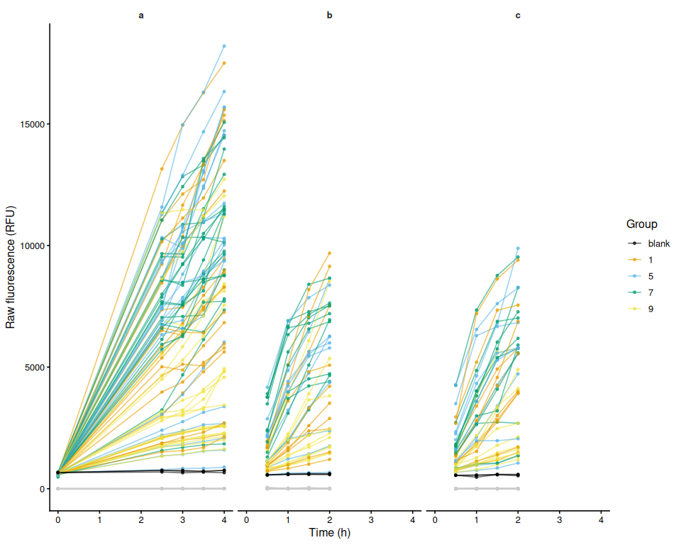
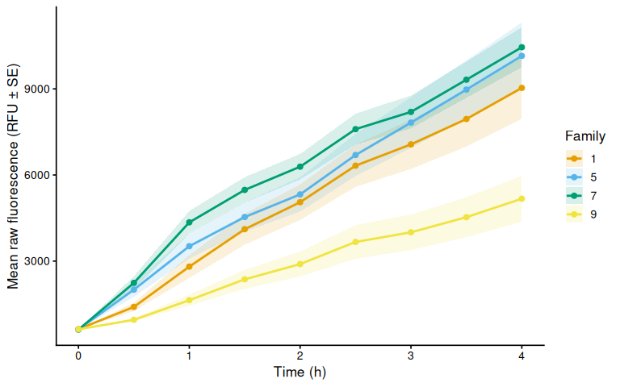
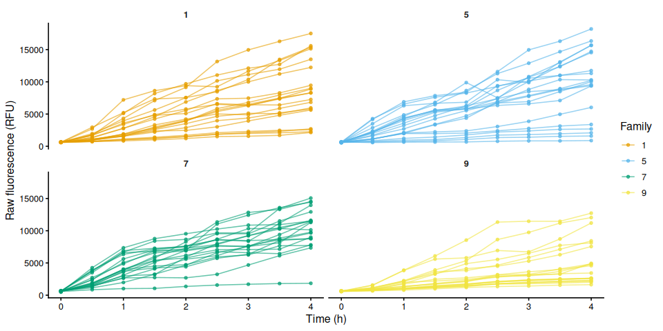
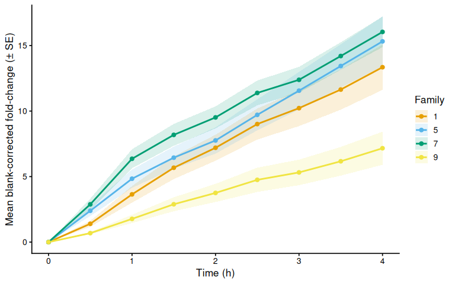
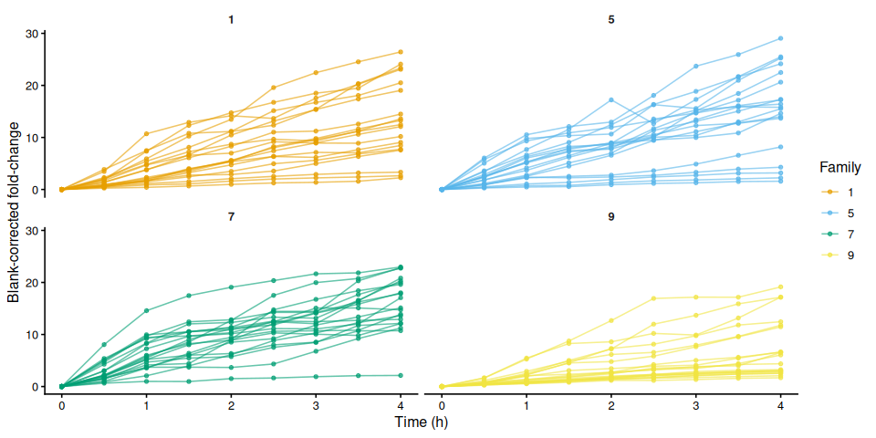
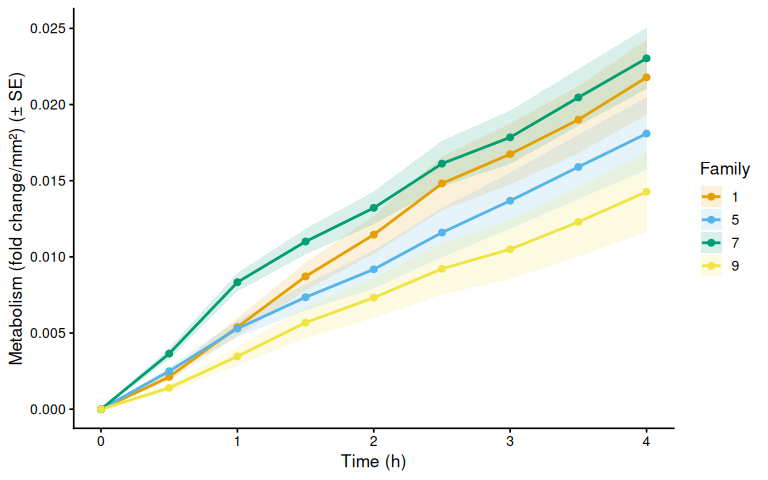
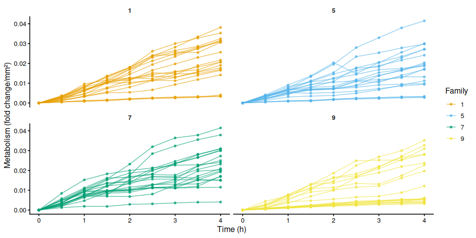
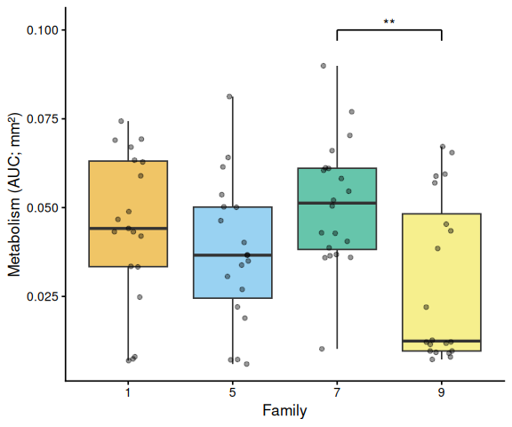

01.00-resazurin-20260713-mgig-36C
================
Sam White
2026-07-13

- [1 Background](#1-background)
  - [1.1 Expected inputs](#11-expected-inputs)
  - [1.2 Expected outputs](#12-expected-outputs)
- [2 Setup](#2-setup)
  - [2.1 Knitr options](#21-knitr-options)
  - [2.2 Load libraries](#22-load-libraries)
- [3 Helper Functions](#3-helper-functions)
- [4 Load Data](#4-load-data)
  - [4.1 Plate export files](#41-plate-export-files)
  - [4.2 Plate consistency check](#42-plate-consistency-check)
  - [4.3 Layout file](#43-layout-file)
- [5 Merge Plate Data with Layout](#5-merge-plate-data-with-layout)
- [6 Raw Fluorescence](#6-raw-fluorescence)
  - [6.1 Data frame](#61-data-frame)
  - [6.2 Raw fluorescence by plate (including
    blanks)](#62-raw-fluorescence-by-plate-including-blanks)
  - [6.3 Mean raw fluorescence by
    family](#63-mean-raw-fluorescence-by-family)
  - [6.4 Individual raw fluorescence traces by
    family](#64-individual-raw-fluorescence-traces-by-family)
  - [6.5 Individual raw fluorescence traces by
    treatment](#65-individual-raw-fluorescence-traces-by-treatment)
  - [6.6 Excluded samples](#66-excluded-samples)
- [7 Blank Correction via Fold-Change
  Normalization](#7-blank-correction-via-fold-change-normalization)
  - [7.1 Step 1 – Identify T0 and compute per-sample
    fold-change](#71-step-1--identify-t0-and-compute-per-sample-fold-change)
  - [7.2 Step 2 – Blank fold-change reference per plate per
    timepoint](#72-step-2--blank-fold-change-reference-per-plate-per-timepoint)
  - [7.3 Step 3 – Subtract blank fold-change from sample
    fold-change](#73-step-3--subtract-blank-fold-change-from-sample-fold-change)
- [8 Blank-Corrected Fold-Change](#8-blank-corrected-fold-change)
  - [8.1 Mean by family](#81-mean-by-family)
  - [8.2 Individual traces by family](#82-individual-traces-by-family)
  - [8.3 Individual blank-corrected fold-change traces by
    treatment](#83-individual-blank-corrected-fold-change-traces-by-treatment)
- [9 Metabolism (Size-Normalised
  Fold-Change)](#9-metabolism-size-normalised-fold-change)
  - [9.1 Mean metabolism by family](#91-mean-metabolism-by-family)
  - [9.2 Individual metabolism traces by
    family](#92-individual-metabolism-traces-by-family)
- [10 Time-Series Statistical
  Analysis](#10-time-series-statistical-analysis)
  - [10.1 Results](#101-results)
    - [10.1.1 Metric:
      metabolism_per_area_mm2_measurement](#1011-metric-metabolism_per_area_mm2_measurement)
- [11 Area Under the Curve (AUC)](#11-area-under-the-curve-auc)
  - [11.1 AUC summary tables](#111-auc-summary-tables)
- [12 Statistical Analysis](#12-statistical-analysis)
  - [12.1 Results by metric](#121-results-by-metric)
    - [12.1.1 Metric:
      metabolism_per_area_mm2_measurement](#1211-metric-metabolism_per_area_mm2_measurement)
- [13 AUC Box Plots with Statistical
  Annotations](#13-auc-box-plots-with-statistical-annotations)
- [14 Save Output Data](#14-save-output-data)

# 1 Background

To speed up sampling and reduce the amount of time cups were out of the
incubator, sampling was periodcially divided between two people and two
plates (i.e. half the samples collected into plate B, the other half
into plate C).

> $$!NOTE$$ Based on our experience with resazurin fluorescence
> stability and the sheer number of samples being handled, resazurin
> fluorescence was *not* measured immediately. Plates were measured when
> time was available, however, no plates sat for longer than 30 minutes
> at room temperature.

Resazurin temperatures were measured with an infrared thermometer over
the course of the experiment:

| Timepoint (hrs) | Temp_range (C) |
|:----------------|:---------------|
| 0               | 18             |
| 0.5             | 23-29          |
| 1               | 27-29          |
| 1.5             | 29-31          |
| 2               | 30-32          |
| 2.5             | 31.5-32.5      |
| 3               | 31.5-32.5      |
| 3.5             | 31-32.5        |
| 4               | 31.5-33        |

See `Resazurin/data/20260713-mgig-36C/README.md` for full experimental
notes.

## 1.1 Expected inputs

| Path | Description |
|:---|:---|
| `Resazurin/data/20260713-mgig-36C/plate-*-T*.txt` | Plate reader fluorescence exports (one file per plate per timepoint) |
| `Resazurin/data/20260713-mgig-36C/layout.csv` | Well metadata: plate ID, well ID, blank flag, family groups, sample IDs, area measurements (mm², from ImageJ) |

## 1.2 Expected outputs

All outputs are written to
`Resazurin/outputs/01.00-resazurin-20260713-mgig-36C/`.

| File | Description |
|:---|:---|
| `figures/` | All plots generated by this script |
| `auc_all_metrics.csv` | Per-individual AUC values for every active measurement metric |
| `auc_summary.csv` | Group-level AUC summary statistics (mean, SD, SE, median) |
| `metabolism.csv` | Full per-well per-timepoint metabolism data frame |
| `pairwise_stats.csv` | Tukey-adjusted pairwise comparisons from AUC linear models |

# 2 Setup

## 2.1 Knitr options

``` r
knitr::opts_chunk$set(
  echo = TRUE,         # Display code chunks
  eval = TRUE,        # Evaluate code chunks
  warning = FALSE,     # Hide warnings
  message = FALSE,     # Hide messages
  comment = "",         # Prevents appending '##' to beginning of lines in code output
  results = 'hold'     # Holds output so it's all printed together after code chunk
)
```

## 2.2 Load libraries

``` r
library(tidyverse)
library(pracma)       # trapz()
library(lme4)
library(lmerTest)
library(emmeans)
library(multcompView)
library(cowplot)
library(colorspace)   # qualitative_hcl() for large palettes
```

# 3 Helper Functions

``` r
normalize_well_id <- function(x) {
  x <- toupper(trimws(x))
  valid <- str_detect(x, "^[A-Z]+[0-9]+$")
  out <- rep(NA_character_, length(x))
  if (!any(valid)) return(out)
  m <- str_match(x[valid], "^([A-Z]+)([0-9]+)$")
  out[valid] <- paste0(m[, 2], as.integer(m[, 3]))
  out
}

parse_time_hr <- function(path) {
  hit <- str_match(basename(path),
                   "(?i)-T([0-9]+(?:\\.[0-9]+)?)\\.txt$")
  as.numeric(hit[, 2])
}

parse_plate_id <- function(path) {
  hit <- str_match(basename(path),
    "(?i)^plate-([A-Za-z0-9-]+)-T[0-9]+(?:\\.[0-9]+)?\\.txt$")
  id <- hit[, 2]
  ifelse(is.na(id), "unknown", id)
}

extract_results_block <- function(lines) {
  results_idx <- which(trimws(lines) == "Results")
  if (length(results_idx) == 0) stop("No Results section found")
  idx <- results_idx[1]
  header_tokens <- str_split(lines[idx + 1], "\\t")[[1]] |> trimws()
  col_ids <- header_tokens[
    header_tokens != "" & str_detect(header_tokens, "^[0-9]+$")]
  j <- idx + 2
  data_lines <- character()
  while (j <= length(lines)) {
    line <- lines[j]
    if (trimws(line) == "") break
    if (!str_detect(line, "^[A-Za-z]\\t")) break
    data_lines <- c(data_lines, line)
    j <- j + 1
  }
  list(col_ids = col_ids, data_lines = data_lines)
}

parse_plate_export <- function(path) {
  lines <- readLines(path, warn = FALSE)
  res <- extract_results_block(lines)

  map_dfr(res$data_lines, function(line) {
    tokens <- str_split(line, "\\t")[[1]] |> trimws()
    tokens <- tokens[tokens != ""]
    row_letter <- tokens[1]
    nums <- suppressWarnings(as.numeric(tokens[-1]))
    valid_idx <- which(!is.na(nums))
    if (length(valid_idx) == 0) return(tibble())
    vals <- nums[valid_idx]
    n <- min(length(vals), length(res$col_ids))
    tibble(
      row_id  = toupper(row_letter),
      col_id  = as.integer(res$col_ids[seq_len(n)]),
      well_id = normalize_well_id(
        paste0(toupper(row_letter), res$col_ids[seq_len(n)])),
      value   = vals[seq_len(n)]
    )
  }) %>%
    mutate(
      plate_id = str_to_lower(parse_plate_id(path)),
      time_hr  = parse_time_hr(path)
    )
}

trapezoid_auc <- function(time_hr, value) {
  ok <- is.finite(time_hr) & is.finite(value)
  t <- time_hr[ok]
  v <- value[ok]
  if (length(t) < 2) return(NA_real_)
  ord <- order(t)
  t <- t[ord]; v <- v[ord]
  sum(diff(t) * (head(v, -1) + tail(v, -1)) / 2)
}

# Shared helper: extract display unit string from a measurement column name.
# e.g. "area_mm2_measurement" -> "mm²", "weight_mg_measurement" -> "mg"
parse_meas_unit <- function(col_name) {
  unit_raw <- col_name |>
    str_remove("^metabolism_per_") |>
    str_remove("_measurement$") |>
    str_extract("[^_]+$")
  case_when(
    unit_raw == "mm2" ~ "mm²",
    unit_raw == "cm2" ~ "cm²",
    unit_raw == "mm3" ~ "mm³",
    unit_raw == "cm3" ~ "cm³",
    TRUE              ~ unit_raw
  )
}

# y-axis label for metabolism line plots: "fold change/mm²"
metabolism_y_label <- function(col_name) {
  paste0("Metabolism (fold change/", parse_meas_unit(col_name), ")")
}

# y-axis label for AUC box plots: "Metabolism (AUC; mm²)"
auc_y_label <- function(metric_name) {
  paste0("Metabolism (AUC; ", parse_meas_unit(metric_name), ")")
}
```

# 4 Load Data

## 4.1 Plate export files

``` r
proj_root <- rprojroot::find_rstudio_root_file()
data_dir  <- file.path(proj_root, "Resazurin", "data", "20260713-mgig-36C")
out_dir   <- file.path(proj_root, "Resazurin", "outputs",
                        "01.00-resazurin-20260713-mgig-36C")
fig_dir   <- file.path(out_dir, "figures")

dir.create(fig_dir, recursive = TRUE, showWarnings = FALSE)
dir.create(out_dir, recursive = TRUE, showWarnings = FALSE)

plate_files <- list.files(
  data_dir,
  pattern = "(?i)^plate-.*-T[0-9]+(?:\\.[0-9]+)?\\.txt$",
  full.names = TRUE
)

plate_raw <- map_dfr(plate_files, function(path) {
  tryCatch(parse_plate_export(path),
           error = function(e) {
             message("Parse error in ", basename(path), ": ", e$message)
             tibble()
           })
})

str(plate_raw)
```

    tibble [1,248 × 6] (S3: tbl_df/tbl/data.frame)
     $ row_id  : chr [1:1248] "A" "A" "A" "A" ...
     $ col_id  : int [1:1248] 1 2 3 4 5 6 7 8 9 10 ...
     $ well_id : chr [1:1248] "A1" "A2" "A3" "A4" ...
     $ value   : num [1:1248] 596 597 605 613 601 626 626 626 610 636 ...
     $ plate_id: chr [1:1248] "a" "a" "a" "a" ...
     $ time_hr : num [1:1248] 0 0 0 0 0 0 0 0 0 0 ...

## 4.2 Plate consistency check

Checks that every plate has the same number of wells at every timepoint.
The expected well count is the mode across all plate × timepoint reads.
Any plate with at least one deviating read is flagged and dropped
entirely before any further analysis — removing only the aberrant
timepoint would break the fold-change baseline calculation.

``` r
well_counts <- plate_raw %>%
  group_by(plate_id, time_hr) %>%
  summarise(n_wells = n_distinct(well_id), .groups = "drop")

expected_n_wells <- as.integer(
  names(which.max(table(well_counts$n_wells)))
)

inconsistent_reads <- well_counts %>%
  filter(n_wells != expected_n_wells) %>%
  arrange(plate_id, time_hr)

inconsistent_plate_ids <- unique(inconsistent_reads$plate_id)

if (nrow(inconsistent_reads) > 0) {
  cat("**Plate consistency check FAILED.**",
      "Expected", expected_n_wells, "wells per plate-timepoint read.",
      length(inconsistent_plate_ids),
      "plate(s) have at least one deviating read and are excluded",
      "from all analyses:\n\n")
  cat(knitr::kable(
    inconsistent_reads,
    col.names = c("Plate", "Time (h)", "Wells read"),
    caption   = paste("Expected:", expected_n_wells, "wells per read")
  ), sep = "\n")
  cat("\n")
  plate_raw <- plate_raw %>%
    filter(!plate_id %in% inconsistent_plate_ids)
  message(length(inconsistent_plate_ids),
          " plate(s) removed from plate_raw: ",
          paste(inconsistent_plate_ids, collapse = ", "))
} else {
  cat("Plate consistency check passed: all",
      n_distinct(well_counts$plate_id), "plates have",
      expected_n_wells, "wells at every timepoint.\n")
}
```

Plate consistency check passed: all 3 plates have 96 wells at every
timepoint.

## 4.3 Layout file

``` r
layout_path <- file.path(data_dir, "layout.csv")

layout_raw <- read_csv(layout_path,
                       col_types = cols(.default = "c"),
                       show_col_types = FALSE)

# Standardise column names to snake_case
names(layout_raw) <- names(layout_raw) |>
  str_to_lower() |>
  str_replace_all("[^a-z0-9]+", "_") |>
  str_replace_all("_+", "_") |>
  str_replace("_$", "")

# Normalise plate_id to match plate file ids (strip "plate-" prefix)
layout_clean <- layout_raw %>%
  mutate(
    plate_id = str_remove(str_to_lower(plate_id), "^plate-"),
    well_id  = normalize_well_id(plate_well),
    is_blank = if ("is_blank" %in% names(layout_raw))
      toupper(trimws(is_blank)) %in% c("TRUE", "T", "1", "YES", "Y")
    else
      FALSE
  )

found_exclude_col <- intersect(
  c("exclude_from_analysis", "exclude", "omit", "not_analyzed"),
  names(layout_clean)
)[1]
layout_clean <- layout_clean %>%
  mutate(
    exclude_from_analysis = if (!is.na(found_exclude_col))
      toupper(trimws(.data[[found_exclude_col]])) %in%
        c("TRUE", "T", "1", "YES", "Y")
    else
      FALSE
  )

# Identify measurement columns and group columns
measurement_cols <- names(layout_clean)[
  str_detect(names(layout_clean), "_measurement$")]
group_cols <- names(layout_clean)[
  str_detect(names(layout_clean), "_group$")]

# Cast measurement columns to numeric
layout_clean <- layout_clean %>%
  mutate(across(all_of(measurement_cols),
                ~ suppressWarnings(as.numeric(.x))))

# Determine which measurement columns actually contain finite data
active_meas_cols <- measurement_cols[
  sapply(measurement_cols, function(col)
    any(is.finite(layout_clean[[col]]), na.rm = TRUE))]

# Normalise group values to lowercase so they match colour scale definitions
layout_clean <- layout_clean %>%
  mutate(across(all_of(group_cols),
                ~ str_to_lower(trimws(as.character(.x)))))

message("Group columns: ", paste(group_cols, collapse = ", "))
message("Active measurement columns: ",
        paste(active_meas_cols, collapse = ", "))

str(layout_clean)
```

    tibble [235 × 14] (S3: tbl_df/tbl/data.frame)
     $ plate_id             : chr [1:235] "a" "a" "a" "a" ...
     $ plate_well           : chr [1:235] "A01" "A02" "A03" "A04" ...
     $ is_blank             : logi [1:235] FALSE FALSE FALSE FALSE FALSE FALSE ...
     $ family_id_group      : chr [1:235] "7" "5" "1" "9" ...
     $ sample_id_group      : chr [1:235] "1" "2" "3" "4" ...
     $ treatment_group      : chr [1:235] NA NA NA NA ...
     $ exclude_from_analysis: logi [1:235] FALSE FALSE FALSE FALSE FALSE FALSE ...
     $ exclude_reason       : chr [1:235] NA NA NA NA ...
     $ width_mm_measurement : num [1:235] NA NA NA NA NA NA NA NA NA NA ...
     $ length_mm_measurement: num [1:235] NA NA NA NA NA NA NA NA NA NA ...
     $ weight_mg_measurement: num [1:235] NA NA NA NA NA NA NA NA NA NA ...
     $ area_mm2_measurement : num [1:235] 538 586 713 757 823 ...
     $ imagej_id            : chr [1:235] "2" "4" "1" "1" ...
     $ well_id              : chr [1:235] "A1" "A2" "A3" "A4" ...

# 5 Merge Plate Data with Layout

``` r
dat <- plate_raw %>%
  left_join(
    layout_clean %>%
      select(plate_id, well_id, is_blank, exclude_from_analysis,
             any_of("exclude_reason"),
             all_of(group_cols), all_of(measurement_cols)),
    by = c("plate_id", "well_id")
  ) %>%
  mutate(
    is_blank = replace_na(is_blank, FALSE),
    exclude_from_analysis = replace_na(exclude_from_analysis, FALSE)
  )

str(dat)
```

    tibble [1,248 × 16] (S3: tbl_df/tbl/data.frame)
     $ row_id               : chr [1:1248] "A" "A" "A" "A" ...
     $ col_id               : int [1:1248] 1 2 3 4 5 6 7 8 9 10 ...
     $ well_id              : chr [1:1248] "A1" "A2" "A3" "A4" ...
     $ value                : num [1:1248] 596 597 605 613 601 626 626 626 610 636 ...
     $ plate_id             : chr [1:1248] "a" "a" "a" "a" ...
     $ time_hr              : num [1:1248] 0 0 0 0 0 0 0 0 0 0 ...
     $ is_blank             : logi [1:1248] FALSE FALSE FALSE FALSE FALSE FALSE ...
     $ exclude_from_analysis: logi [1:1248] FALSE FALSE FALSE FALSE FALSE FALSE ...
     $ exclude_reason       : chr [1:1248] NA NA NA NA ...
     $ family_id_group      : chr [1:1248] "7" "5" "1" "9" ...
     $ sample_id_group      : chr [1:1248] "1" "2" "3" "4" ...
     $ treatment_group      : chr [1:1248] NA NA NA NA ...
     $ width_mm_measurement : num [1:1248] NA NA NA NA NA NA NA NA NA NA ...
     $ length_mm_measurement: num [1:1248] NA NA NA NA NA NA NA NA NA NA ...
     $ weight_mg_measurement: num [1:1248] NA NA NA NA NA NA NA NA NA NA ...
     $ area_mm2_measurement : num [1:1248] 538 586 713 757 823 ...

# 6 Raw Fluorescence

## 6.1 Data frame

``` r
# Wells in the plate reader output that have no layout entry get all-NA group
# columns after the join. Keep only wells assigned to at least one group.
active_gc <- intersect(group_cols, names(dat))

raw_df <- dat %>%
  filter(
    !is_blank,
    if (length(active_gc) > 0)
      if_any(all_of(active_gc), ~ !is.na(.))
    else
      TRUE
  ) %>%
  mutate(
    trace_id = if_else(
      !is.na(sample_id_group) & trimws(as.character(sample_id_group)) != "",
      as.character(sample_id_group),
      paste(plate_id, well_id, sep = "_")
    )
  )

families   <- str_sort(unique(na.omit(raw_df$family_id_group)), numeric = TRUE)
treatments <- sort(unique(na.omit(raw_df$treatment_group)))

n_fam <- length(families)
n_trt <- length(treatments)

# Palette strategy:
#   <= 7 groups : Okabe-Ito (gold standard for colorblind-safe figures).
#   >  7 groups : colorspace::qualitative_hcl("Dynamic") scales to any N
#                 using perceptually uniform HCL space — no colour collisions.
# Black (#000000) is excluded from both and reserved for blank wells.
okabe_ito_7 <- c(
  "#E69F00", "#56B4E9", "#009E73", "#F0E442",
  "#0072B2", "#D55E00", "#CC79A7"
)
make_palette <- function(n) {
  if (n == 0L) return(character(0))
  if (n <= length(okabe_ito_7)) return(okabe_ito_7[seq_len(n)])
  colorspace::qualitative_hcl(n, palette = "Dynamic")
}

all_colours   <- make_palette(n_fam + n_trt)
fam_colours   <- setNames(all_colours[seq_len(n_fam)], families)
trt_colours   <- setNames(all_colours[n_fam + seq_len(n_trt)], treatments)

lty_pool <- c("solid", "dashed", "dotted", "dotdash", "longdash")
trt_linetypes <- setNames(
  lty_pool[(seq_len(n_trt) - 1L) %% length(lty_pool) + 1L],
  treatments
)
plate_well_colours <- c(blank = "black", fam_colours)

has_trt <- n_trt > 0

str(raw_df)
```

    tibble [720 × 17] (S3: tbl_df/tbl/data.frame)
     $ row_id               : chr [1:720] "A" "A" "A" "A" ...
     $ col_id               : int [1:720] 1 2 3 4 5 6 7 8 9 10 ...
     $ well_id              : chr [1:720] "A1" "A2" "A3" "A4" ...
     $ value                : num [1:720] 596 597 605 613 601 626 626 626 610 636 ...
     $ plate_id             : chr [1:720] "a" "a" "a" "a" ...
     $ time_hr              : num [1:720] 0 0 0 0 0 0 0 0 0 0 ...
     $ is_blank             : logi [1:720] FALSE FALSE FALSE FALSE FALSE FALSE ...
     $ exclude_from_analysis: logi [1:720] FALSE FALSE FALSE FALSE FALSE FALSE ...
     $ exclude_reason       : chr [1:720] NA NA NA NA ...
     $ family_id_group      : chr [1:720] "7" "5" "1" "9" ...
     $ sample_id_group      : chr [1:720] "1" "2" "3" "4" ...
     $ treatment_group      : chr [1:720] NA NA NA NA ...
     $ width_mm_measurement : num [1:720] NA NA NA NA NA NA NA NA NA NA ...
     $ length_mm_measurement: num [1:720] NA NA NA NA NA NA NA NA NA NA ...
     $ weight_mg_measurement: num [1:720] NA NA NA NA NA NA NA NA NA NA ...
     $ area_mm2_measurement : num [1:720] 538 586 713 757 823 ...
     $ trace_id             : chr [1:720] "1" "2" "3" "4" ...

## 6.2 Raw fluorescence by plate (including blanks)

``` r
p_raw_plates <- dat %>%
  filter(is.finite(time_hr), is.finite(value)) %>%
  mutate(
    colour_group = if_else(is_blank, "blank",
                           coalesce(family_id_group, "sample")),
    trace_id     = paste(plate_id, well_id, sep = "_")
  ) %>%
  ggplot(aes(x = time_hr, y = value,
             group = trace_id, colour = colour_group)) +
  geom_line(alpha = 0.6) +
  geom_point(size = 1, alpha = 0.7) +
  facet_wrap(~ plate_id) +
  scale_colour_manual(
    values   = plate_well_colours,
    name     = "Group",
    breaks   = names(plate_well_colours),
    na.value = "grey80"
  ) +
  labs(x = "Time (h)", y = "Raw fluorescence (RFU)") +
  theme_classic(base_size = 12) +
  theme(strip.background = element_blank(),
        strip.text       = element_text(face = "bold"))

p_raw_plates
```

<!-- -->

``` r
ggsave(file.path(fig_dir, "raw_fluor_by_plate.png"),
       p_raw_plates, width = 10, height = 8)
```

## 6.3 Mean raw fluorescence by family

``` r
raw_family_summary <- raw_df %>%
  filter(!is.na(family_id_group), !exclude_from_analysis) %>%
  group_by(family_id_group, treatment_group, time_hr) %>%
  summarise(
    mean_fluor = mean(value, na.rm = TRUE),
    se_fluor   = sd(value, na.rm = TRUE) /
      sqrt(sum(!is.na(value))),
    n          = sum(!is.na(value)),
    .groups    = "drop"
  ) %>%
  mutate(group_var = if (has_trt)
    paste(family_id_group, treatment_group, sep = ".")
  else
    family_id_group)

p_raw_mean <- ggplot(raw_family_summary,
    aes(x = time_hr, y = mean_fluor,
        colour = family_id_group,
        group = group_var)) +
  geom_ribbon(aes(ymin = mean_fluor - se_fluor,
                  ymax = mean_fluor + se_fluor,
                  fill = family_id_group),
              alpha = 0.15, colour = NA) +
  geom_line(
    mapping   = if (has_trt) aes(linetype = treatment_group) else NULL,
    linewidth = 1) +
  geom_point(size = 2) +
  scale_colour_manual(values = fam_colours, name = "Family",
                      breaks = families) +
  scale_fill_manual(values = fam_colours, name = "Family",
                    breaks = families) +
  labs(x = "Time (h)", y = "Mean raw fluorescence (RFU ± SE)") +
  theme_classic(base_size = 13) +
  if (has_trt) scale_linetype_manual(values = trt_linetypes, name = "Treatment") else NULL

p_raw_mean
```

<!-- -->

``` r
ggsave(file.path(fig_dir, "raw_mean_by_family.png"),
       p_raw_mean, width = 8, height = 5)
```

## 6.4 Individual raw fluorescence traces by family

``` r
p_raw_by_family <- raw_df %>%
  filter(!is.na(family_id_group)) %>%
  ggplot(aes(x = time_hr, y = value, group = trace_id,
             colour = .data[[if (has_trt) "treatment_group" else "family_id_group"]])) +
  geom_line(alpha = 0.6) +
  geom_point(size = 1.2, alpha = 0.7) +
  facet_wrap(~ family_id_group) +
  scale_colour_manual(
    values = if (has_trt) trt_colours else fam_colours,
    name   = if (has_trt) "Treatment" else "Family",
    breaks = if (has_trt) treatments else families) +
  labs(x = "Time (h)", y = "Raw fluorescence (RFU)") +
  theme_classic(base_size = 12) +
  theme(strip.background = element_blank(),
        strip.text       = element_text(face = "bold"))

p_raw_by_family
```

<!-- -->

``` r
ggsave(file.path(fig_dir, "raw_individual_by_family.png"),
       p_raw_by_family, width = 10, height = 5)
```

## 6.5 Individual raw fluorescence traces by treatment

``` r
if (has_trt) {
  p_raw_by_treatment <- raw_df %>%
    ggplot(aes(x = time_hr, y = value,
               group = trace_id, colour = family_id_group)) +
    geom_line(alpha = 0.6) +
    geom_point(size = 1.2, alpha = 0.7) +
    facet_wrap(~ treatment_group) +
    scale_colour_manual(values = fam_colours, name = "Family",
                        breaks = families) +
    labs(x = "Time (h)", y = "Raw fluorescence (RFU)") +
    theme_classic(base_size = 12) +
    theme(strip.background = element_blank(),
          strip.text       = element_text(face = "bold"))

  p_raw_by_treatment
  ggsave(file.path(fig_dir, "raw_individual_by_treatment.png"),
         p_raw_by_treatment, width = 10, height = 5)
}
```

## 6.6 Excluded samples

Wells flagged `exclude_from_analysis = TRUE` appear in the raw
fluorescence plots above but are omitted from all analyses that follow.

``` r
excluded_wells <- dat %>%
  filter(!is_blank, exclude_from_analysis) %>%
  mutate(
    sample = if_else(
      !is.na(sample_id_group) & trimws(as.character(sample_id_group)) != "",
      as.character(sample_id_group),
      paste(plate_id, well_id, sep = "_")
    )
  ) %>%
  select(plate_id, well_id, sample, family_id_group, treatment_group,
         any_of("exclude_reason")) %>%
  distinct() %>%
  arrange(plate_id, well_id)

if (nrow(excluded_wells) > 0) {
  col_names <- c("Plate", "Well", "Sample", "Family", "Treatment")
  if ("exclude_reason" %in% names(excluded_wells))
    col_names <- c(col_names, "Reason")
  cat(knitr::kable(excluded_wells, col.names = col_names), sep = "\n")
} else {
  cat("No wells are excluded from analysis.\n")
}
```

| Plate | Well | Sample | Family | Treatment | Reason |
|:---|:---|:---|:---|:---|:---|
| a | F10 | 70 | 5 | NA | missing oyster - probably second oyster in 71 |
| a | F11 | 71 | 1 | NA | two oysters - probably the missing one from 70 |
| b | C6 | 70 | 5 | NA | missing oyster - probably second oyster in 71 |
| b | C7 | 71 | 1 | NA | two oysters - probably the missing one from 70 |

# 7 Blank Correction via Fold-Change Normalization

T0 is the earliest timepoint present in the dataset (not necessarily 0
hr). Sample fold-change is expressed relative to each individual’s T0
reading, resolved by `sample_id_group` when that column is populated —
allowing the same animal to be tracked across plates — or by
`plate_id + well_id` when no sample IDs exist (backward-compatible with
single-plate, multi-timepoint designs). Blank fold-change is the
per-plate mean blank RFU at each timepoint divided by the pooled mean
blank RFU at T0. Subtracting blank fold-change from sample fold-change
removes background fluorescence drift; all samples start at exactly 0 at
T0 by construction.

## 7.1 Step 1 – Identify T0 and compute per-sample fold-change

``` r
# T0 = earliest timepoint present in the dataset
t0_time <- min(dat$time_hr[is.finite(dat$time_hr)], na.rm = TRUE)
message("T0 timepoint: ", t0_time, " hr")

# T0 reference value per individual.
# Resolved by sample_id_group (cross-plate tracking) when available;
# falls back to plate+well for layouts without explicit sample IDs.
t0_all <- dat %>%
  filter(time_hr == t0_time, !is_blank, is.finite(value)) %>%
  mutate(sample_key = if_else(
    !is.na(sample_id_group) & trimws(as.character(sample_id_group)) != "",
    as.character(sample_id_group),
    paste(plate_id, well_id, sep = "_")
  )) %>%
  group_by(sample_key) %>%
  summarise(value_t0 = mean(value, na.rm = TRUE), .groups = "drop")

dat_fc <- dat %>%
  mutate(sample_key = if_else(
    !is_blank &
      !is.na(sample_id_group) & trimws(as.character(sample_id_group)) != "",
    as.character(sample_id_group),
    paste(plate_id, well_id, sep = "_")
  )) %>%
  left_join(t0_all, by = "sample_key") %>%
  mutate(fold_change = if_else(
    !is_blank & is.finite(value_t0) & value_t0 > 0,
    value / value_t0,
    NA_real_
  ))

str(dat_fc)
```

    tibble [1,248 × 19] (S3: tbl_df/tbl/data.frame)
     $ row_id               : chr [1:1248] "A" "A" "A" "A" ...
     $ col_id               : int [1:1248] 1 2 3 4 5 6 7 8 9 10 ...
     $ well_id              : chr [1:1248] "A1" "A2" "A3" "A4" ...
     $ value                : num [1:1248] 596 597 605 613 601 626 626 626 610 636 ...
     $ plate_id             : chr [1:1248] "a" "a" "a" "a" ...
     $ time_hr              : num [1:1248] 0 0 0 0 0 0 0 0 0 0 ...
     $ is_blank             : logi [1:1248] FALSE FALSE FALSE FALSE FALSE FALSE ...
     $ exclude_from_analysis: logi [1:1248] FALSE FALSE FALSE FALSE FALSE FALSE ...
     $ exclude_reason       : chr [1:1248] NA NA NA NA ...
     $ family_id_group      : chr [1:1248] "7" "5" "1" "9" ...
     $ sample_id_group      : chr [1:1248] "1" "2" "3" "4" ...
     $ treatment_group      : chr [1:1248] NA NA NA NA ...
     $ width_mm_measurement : num [1:1248] NA NA NA NA NA NA NA NA NA NA ...
     $ length_mm_measurement: num [1:1248] NA NA NA NA NA NA NA NA NA NA ...
     $ weight_mg_measurement: num [1:1248] NA NA NA NA NA NA NA NA NA NA ...
     $ area_mm2_measurement : num [1:1248] 538 586 713 757 823 ...
     $ sample_key           : chr [1:1248] "1" "2" "3" "4" ...
     $ value_t0             : num [1:1248] 596 597 605 613 601 626 626 626 610 636 ...
     $ fold_change          : num [1:1248] 1 1 1 1 1 1 1 1 1 1 ...

## 7.2 Step 2 – Blank fold-change reference per plate per timepoint

``` r
# Pooled mean blank RFU at T0 across all T0 plates
mean_blank_t0 <- dat %>%
  filter(is_blank, time_hr == t0_time, is.finite(value)) %>%
  pull(value) %>%
  mean(na.rm = TRUE)

if (!is.finite(mean_blank_t0))
  message("No blank readings found at T0 (", t0_time,
          " hr); blank correction will produce NA.")

# Per-plate per-timepoint mean blank expressed as fold-change relative to T0
blank_fc_ref <- dat %>%
  filter(is_blank, is.finite(value)) %>%
  group_by(plate_id, time_hr) %>%
  summarise(mean_blank_rfu = mean(value, na.rm = TRUE), .groups = "drop") %>%
  mutate(mean_blank_fc = mean_blank_rfu / mean_blank_t0)

str(blank_fc_ref)
```

    tibble [13 × 4] (S3: tbl_df/tbl/data.frame)
     $ plate_id      : chr [1:13] "a" "a" "a" "a" ...
     $ time_hr       : num [1:13] 0 2.5 3 3.5 4 0.5 1 1.5 2 0.5 ...
     $ mean_blank_rfu: num [1:13] 663 731 711 704 722 ...
     $ mean_blank_fc : num [1:13] 1 1.1 1.07 1.06 1.09 ...

## 7.3 Step 3 – Subtract blank fold-change from sample fold-change

``` r
samples <- dat_fc %>%
  filter(!is_blank, !exclude_from_analysis) %>%
  mutate(
    trace_id = if_else(
      !is.na(sample_id_group) & trimws(as.character(sample_id_group)) != "",
      as.character(sample_id_group),
      paste(plate_id, well_id, sep = "_")
    )
  ) %>%
  left_join(blank_fc_ref, by = c("plate_id", "time_hr")) %>%
  mutate(corrected_fc = fold_change - mean_blank_fc)

str(samples)
```

    tibble [1,191 × 23] (S3: tbl_df/tbl/data.frame)
     $ row_id               : chr [1:1191] "A" "A" "A" "A" ...
     $ col_id               : int [1:1191] 1 2 3 4 5 6 7 8 9 10 ...
     $ well_id              : chr [1:1191] "A1" "A2" "A3" "A4" ...
     $ value                : num [1:1191] 596 597 605 613 601 626 626 626 610 636 ...
     $ plate_id             : chr [1:1191] "a" "a" "a" "a" ...
     $ time_hr              : num [1:1191] 0 0 0 0 0 0 0 0 0 0 ...
     $ is_blank             : logi [1:1191] FALSE FALSE FALSE FALSE FALSE FALSE ...
     $ exclude_from_analysis: logi [1:1191] FALSE FALSE FALSE FALSE FALSE FALSE ...
     $ exclude_reason       : chr [1:1191] NA NA NA NA ...
     $ family_id_group      : chr [1:1191] "7" "5" "1" "9" ...
     $ sample_id_group      : chr [1:1191] "1" "2" "3" "4" ...
     $ treatment_group      : chr [1:1191] NA NA NA NA ...
     $ width_mm_measurement : num [1:1191] NA NA NA NA NA NA NA NA NA NA ...
     $ length_mm_measurement: num [1:1191] NA NA NA NA NA NA NA NA NA NA ...
     $ weight_mg_measurement: num [1:1191] NA NA NA NA NA NA NA NA NA NA ...
     $ area_mm2_measurement : num [1:1191] 538 586 713 757 823 ...
     $ sample_key           : chr [1:1191] "1" "2" "3" "4" ...
     $ value_t0             : num [1:1191] 596 597 605 613 601 626 626 626 610 636 ...
     $ fold_change          : num [1:1191] 1 1 1 1 1 1 1 1 1 1 ...
     $ trace_id             : chr [1:1191] "1" "2" "3" "4" ...
     $ mean_blank_rfu       : num [1:1191] 663 663 663 663 663 ...
     $ mean_blank_fc        : num [1:1191] 1 1 1 1 1 1 1 1 1 1 ...
     $ corrected_fc         : num [1:1191] 0 0 0 0 0 0 0 0 0 0 ...

# 8 Blank-Corrected Fold-Change

## 8.1 Mean by family

``` r
bc_fc_summary <- samples %>%
  filter(!is.na(family_id_group), !exclude_from_analysis) %>%
  group_by(family_id_group, treatment_group, time_hr) %>%
  summarise(
    mean_val = mean(corrected_fc, na.rm = TRUE),
    se_val   = sd(corrected_fc, na.rm = TRUE) /
      sqrt(sum(!is.na(corrected_fc))),
    n        = sum(!is.na(corrected_fc)),
    .groups  = "drop"
  ) %>%
  mutate(group_var = if (has_trt)
    paste(family_id_group, treatment_group, sep = ".")
  else
    family_id_group)

p_bc_fc_mean <- ggplot(bc_fc_summary,
    aes(x = time_hr, y = mean_val,
        colour = family_id_group,
        group = group_var)) +
  geom_ribbon(aes(ymin = mean_val - se_val,
                  ymax = mean_val + se_val,
                  fill = family_id_group),
              alpha = 0.15, colour = NA) +
  geom_line(
    mapping   = if (has_trt) aes(linetype = treatment_group) else NULL,
    linewidth = 1) +
  geom_point(size = 2) +
  scale_colour_manual(values = fam_colours, name = "Family",
                      breaks = families) +
  scale_fill_manual(values = fam_colours, name = "Family",
                    breaks = families) +
  labs(x = "Time (h)",
       y = "Mean blank-corrected fold-change (± SE)") +
  theme_classic(base_size = 13) +
  if (has_trt) scale_linetype_manual(values = trt_linetypes, name = "Treatment") else NULL

p_bc_fc_mean
```

<!-- -->

``` r
ggsave(file.path(fig_dir, "blank_corrected_fc_mean_by_family.png"),
       p_bc_fc_mean, width = 8, height = 5)
```

## 8.2 Individual traces by family

``` r
p_bc_fc_by_family <- samples %>%
  filter(!is.na(family_id_group)) %>%
  ggplot(aes(x = time_hr, y = corrected_fc, group = trace_id,
             colour = .data[[if (has_trt) "treatment_group" else "family_id_group"]])) +
  geom_line(alpha = 0.6) +
  geom_point(size = 1.2, alpha = 0.7) +
  facet_wrap(~ family_id_group) +
  scale_colour_manual(
    values = if (has_trt) trt_colours else fam_colours,
    name   = if (has_trt) "Treatment" else "Family",
    breaks = if (has_trt) treatments else families) +
  labs(x = "Time (h)", y = "Blank-corrected fold-change") +
  theme_classic(base_size = 12) +
  theme(strip.background = element_blank(),
        strip.text       = element_text(face = "bold"))

p_bc_fc_by_family
```

<!-- -->

``` r
ggsave(file.path(fig_dir, "blank_corrected_fc_by_family.png"),
       p_bc_fc_by_family, width = 10, height = 5)
```

## 8.3 Individual blank-corrected fold-change traces by treatment

``` r
if (has_trt) {
  p_bc_fc_by_treatment <- samples %>%
    ggplot(aes(x = time_hr, y = corrected_fc,
               group = trace_id, colour = family_id_group)) +
    geom_line(alpha = 0.6) +
    geom_point(size = 1.2, alpha = 0.7) +
    facet_wrap(~ treatment_group) +
    scale_colour_manual(values = fam_colours, name = "Family",
                        breaks = families) +
    labs(x = "Time (h)", y = "Blank-corrected fold-change") +
    theme_classic(base_size = 12) +
    theme(strip.background = element_blank(),
          strip.text       = element_text(face = "bold"))

  p_bc_fc_by_treatment
  ggsave(file.path(fig_dir, "blank_corrected_fc_by_treatment.png"),
         p_bc_fc_by_treatment, width = 10, height = 5)
}
```

# 9 Metabolism (Size-Normalised Fold-Change)

Blank-corrected fold-change divided by each active measurement column.
This is “metabolism” as defined in Huffmyer et al.

``` r
if (length(active_meas_cols) == 0) {
  message("No active measurement columns: skipping metabolism calculation.")
  metabolism_df <- tibble()
} else {
  metabolism_df <- samples
  for (mc in active_meas_cols) {
    out_col <- paste0("metabolism_per_", mc)
    metabolism_df <- metabolism_df %>%
      mutate(!!out_col := if_else(
        is.finite(.data[[mc]]) & .data[[mc]] > 0 &
          is.finite(corrected_fc),
        corrected_fc / .data[[mc]],
        NA_real_
      ))
  }
}

str(metabolism_df)
```

    tibble [1,191 × 24] (S3: tbl_df/tbl/data.frame)
     $ row_id                             : chr [1:1191] "A" "A" "A" "A" ...
     $ col_id                             : int [1:1191] 1 2 3 4 5 6 7 8 9 10 ...
     $ well_id                            : chr [1:1191] "A1" "A2" "A3" "A4" ...
     $ value                              : num [1:1191] 596 597 605 613 601 626 626 626 610 636 ...
     $ plate_id                           : chr [1:1191] "a" "a" "a" "a" ...
     $ time_hr                            : num [1:1191] 0 0 0 0 0 0 0 0 0 0 ...
     $ is_blank                           : logi [1:1191] FALSE FALSE FALSE FALSE FALSE FALSE ...
     $ exclude_from_analysis              : logi [1:1191] FALSE FALSE FALSE FALSE FALSE FALSE ...
     $ exclude_reason                     : chr [1:1191] NA NA NA NA ...
     $ family_id_group                    : chr [1:1191] "7" "5" "1" "9" ...
     $ sample_id_group                    : chr [1:1191] "1" "2" "3" "4" ...
     $ treatment_group                    : chr [1:1191] NA NA NA NA ...
     $ width_mm_measurement               : num [1:1191] NA NA NA NA NA NA NA NA NA NA ...
     $ length_mm_measurement              : num [1:1191] NA NA NA NA NA NA NA NA NA NA ...
     $ weight_mg_measurement              : num [1:1191] NA NA NA NA NA NA NA NA NA NA ...
     $ area_mm2_measurement               : num [1:1191] 538 586 713 757 823 ...
     $ sample_key                         : chr [1:1191] "1" "2" "3" "4" ...
     $ value_t0                           : num [1:1191] 596 597 605 613 601 626 626 626 610 636 ...
     $ fold_change                        : num [1:1191] 1 1 1 1 1 1 1 1 1 1 ...
     $ trace_id                           : chr [1:1191] "1" "2" "3" "4" ...
     $ mean_blank_rfu                     : num [1:1191] 663 663 663 663 663 ...
     $ mean_blank_fc                      : num [1:1191] 1 1 1 1 1 1 1 1 1 1 ...
     $ corrected_fc                       : num [1:1191] 0 0 0 0 0 0 0 0 0 0 ...
     $ metabolism_per_area_mm2_measurement: num [1:1191] 0 0 0 0 0 0 0 0 0 0 ...

## 9.1 Mean metabolism by family

``` r
if (nrow(metabolism_df) > 0) {

  metab_cols <- paste0("metabolism_per_", active_meas_cols)

  for (col in metab_cols) {
    if (!col %in% names(metabolism_df)) next
    mc_label <- str_remove(col, "^metabolism_per_")

    metab_summary <- metabolism_df %>%
      filter(!is.na(family_id_group), !exclude_from_analysis) %>%
      group_by(family_id_group, treatment_group, time_hr) %>%
      summarise(
        mean_val = mean(.data[[col]], na.rm = TRUE),
        se_val   = sd(.data[[col]], na.rm = TRUE) /
          sqrt(sum(!is.na(.data[[col]]))),
        .groups  = "drop"
      ) %>%
      mutate(group_var = if (has_trt)
        paste(family_id_group, treatment_group, sep = ".")
      else
        family_id_group)

    p_metab_mean <- ggplot(metab_summary,
        aes(x = time_hr, y = mean_val,
            colour = family_id_group,
            group = group_var)) +
      geom_ribbon(aes(ymin = mean_val - se_val,
                      ymax = mean_val + se_val,
                      fill = family_id_group),
                  alpha = 0.15, colour = NA) +
      geom_line(
        mapping   = if (has_trt) aes(linetype = treatment_group) else NULL,
        linewidth = 1) +
      geom_point(size = 2) +
      scale_colour_manual(values = fam_colours, name = "Family",
                          breaks = families) +
      scale_fill_manual(values = fam_colours, name = "Family",
                        breaks = families) +
      labs(x = "Time (h)",
           y = paste0(metabolism_y_label(col), " (± SE)")) +
      theme_classic(base_size = 13) +
      if (has_trt) scale_linetype_manual(values = trt_linetypes, name = "Treatment") else NULL

    print(p_metab_mean)
    ggsave(
      file.path(fig_dir,
                paste0("metabolism_mean_", mc_label, ".png")),
      p_metab_mean, width = 8, height = 5)
  }
}
```

<!-- -->

## 9.2 Individual metabolism traces by family

``` r
if (nrow(metabolism_df) > 0) {

  for (col in metab_cols) {
    if (!col %in% names(metabolism_df)) next
    mc_label <- str_remove(col, "^metabolism_per_")

    p_metab_by_family <- metabolism_df %>%
      filter(!is.na(family_id_group)) %>%
      ggplot(aes(x = time_hr, y = .data[[col]], group = trace_id,
                 colour = .data[[if (has_trt) "treatment_group" else "family_id_group"]])) +
      geom_line(alpha = 0.6) +
      geom_point(size = 1.2, alpha = 0.7) +
      facet_wrap(~ family_id_group) +
      scale_colour_manual(
        values = if (has_trt) trt_colours else fam_colours,
        name   = if (has_trt) "Treatment" else "Family",
        breaks = if (has_trt) treatments else families) +
      labs(x = "Time (h)", y = metabolism_y_label(col)) +
      theme_classic(base_size = 12) +
      theme(strip.background = element_blank(),
            strip.text       = element_text(face = "bold"))

    print(p_metab_by_family)
    ggsave(
      file.path(fig_dir,
                paste0("metabolism_individual_", mc_label, "_by_family.png")),
      p_metab_by_family, width = 10, height = 5)

    if (has_trt) {
      p_metab_by_treatment <- ggplot(metabolism_df,
          aes(x = time_hr, y = .data[[col]],
              group = trace_id, colour = family_id_group)) +
        geom_line(alpha = 0.6) +
        geom_point(size = 1.2, alpha = 0.7) +
        facet_wrap(~ treatment_group) +
        scale_colour_manual(values = fam_colours, name = "Family",
                            breaks = families) +
        labs(x = "Time (h)", y = metabolism_y_label(col)) +
        theme_classic(base_size = 12) +
        theme(strip.background = element_blank(),
              strip.text       = element_text(face = "bold"))

      print(p_metab_by_treatment)
      ggsave(
        file.path(fig_dir,
                  paste0("metabolism_individual_", mc_label, "_by_treatment.png")),
        p_metab_by_treatment, width = 10, height = 5)
    }
  }
}
```

<!-- -->

# 10 Time-Series Statistical Analysis

Linear mixed effects models test the effect of experimental variables on
metabolism over time. Individual (`sample_id_group`) is included as a
random intercept to account for repeated measures across timepoints.
Type III ANOVA with Satterthwaite’s approximation (lmerTest) assesses
significance; post-hoc pairwise comparisons use estimated marginal means
(emmeans, Tukey adjustment).

``` r
run_ts_stats <- function(df, value_col) {
  has_family    <- "family_id_group" %in% names(df) &&
    length(unique(na.omit(df$family_id_group))) > 1
  has_treatment <- "treatment_group" %in% names(df) &&
    length(unique(na.omit(df$treatment_group))) > 1

  if (!has_family && !has_treatment) return(NULL)

  df <- df %>%
    filter(is.finite(.data[[value_col]]), is.finite(time_hr)) %>%
    mutate(
      time_f     = factor(time_hr),
      individual = factor(trace_id)
    )

  if (nrow(df) == 0) return(NULL)

  if (has_family)    df <- df %>% mutate(family    = factor(family_id_group))
  if (has_treatment) df <- df %>% mutate(treatment = factor(treatment_group))

  if (has_family    && length(unique(na.omit(df$family)))    < 2) return(NULL)
  if (has_treatment && length(unique(na.omit(df$treatment))) < 2) return(NULL)

  fixed <- if (has_family && has_treatment) {
    paste0(value_col, " ~ time_f * family * treatment")
  } else if (has_family) {
    paste0(value_col, " ~ time_f * family")
  } else {
    paste0(value_col, " ~ time_f * treatment")
  }

  model <- lmer(
    as.formula(paste0(fixed, " + (1 | individual)")),
    data = df
  )

  anova_res <- anova(model, type = 3, ddf = "Satterthwaite")

  # Pairwise comparisons of group combinations at each timepoint
  emm_spec <- if (has_family && has_treatment) {
    ~ family * treatment | time_f
  } else if (has_family) {
    ~ family | time_f
  } else {
    ~ treatment | time_f
  }

  emm       <- emmeans(model, emm_spec)
  pairs_res <- as.data.frame(pairs(emm, adjust = "tukey"))

  # Main-effect marginal means (collapsed across time)
  emm_main <- if (has_family && has_treatment) {
    emmeans(model, ~ family * treatment)
  } else if (has_family) {
    emmeans(model, ~ family)
  } else {
    emmeans(model, ~ treatment)
  }

  pairs_main <- as.data.frame(pairs(emm_main, adjust = "tukey"))

  list(
    model         = model,
    anova         = anova_res,
    pairs_by_time = pairs_res,
    pairs_main    = pairs_main,
    has_family    = has_family,
    has_treatment = has_treatment
  )
}

ts_stats <- list()
if (nrow(metabolism_df) > 0) {
  for (mc in active_meas_cols) {
    col <- paste0("metabolism_per_", mc)
    if (col %in% names(metabolism_df))
      ts_stats[[col]] <- run_ts_stats(metabolism_df, col)
  }
}
```

## 10.1 Results

``` r
for (col in names(ts_stats)) {
  res <- ts_stats[[col]]
  if (is.null(res)) next

  cat("\n\n### Metric:", col, "\n\n")

  cat("**Type III ANOVA (Satterthwaite approximation):**\n\n")
  cat(knitr::kable(as.data.frame(res$anova), digits = 4, format = "pipe"), sep = "\n")
  cat("\n")

  cat("**Marginal means – main effects (collapsed across time):**\n\n")
  cat(knitr::kable(as.data.frame(res$pairs_main), digits = 4, format = "pipe"), sep = "\n")
  cat("\n")

  cat("**Pairwise comparisons by timepoint (Tukey):**\n\n")
  cat(knitr::kable(as.data.frame(res$pairs_by_time), digits = 4, format = "pipe"), sep = "\n")
  cat("\n")
}
```

### 10.1.1 Metric: metabolism_per_area_mm2_measurement

**Type III ANOVA (Satterthwaite approximation):**

|               | Sum Sq | Mean Sq | NumDF | DenDF |  F value | Pr(\>F) |
|---------------|-------:|--------:|------:|------:|---------:|--------:|
| time_f        | 0.0269 |  0.0034 |     8 |   592 | 201.3951 |  0.0000 |
| family        | 0.0002 |  0.0001 |     3 |    74 |   4.1895 |  0.0085 |
| time_f:family | 0.0009 |  0.0000 |    24 |   592 |   2.2689 |  0.0006 |

**Marginal means – main effects (collapsed across time):**

| contrast          | estimate |     SE |  df | t.ratio | p.value |
|:------------------|---------:|-------:|----:|--------:|--------:|
| family1 - family5 |   0.0018 | 0.0017 |  74 |  1.0878 |  0.6980 |
| family1 - family7 |  -0.0015 | 0.0017 |  74 | -0.9143 |  0.7973 |
| family1 - family9 |   0.0040 | 0.0017 |  74 |  2.4052 |  0.0849 |
| family5 - family7 |  -0.0033 | 0.0017 |  74 | -2.0160 |  0.1914 |
| family5 - family9 |   0.0022 | 0.0017 |  74 |  1.3035 |  0.5636 |
| family7 - family9 |   0.0055 | 0.0016 |  74 |  3.3629 |  0.0066 |

**Pairwise comparisons by timepoint (Tukey):**

| contrast          | time_f | estimate |     SE |       df | t.ratio | p.value |
|:------------------|:-------|---------:|-------:|---------:|--------:|--------:|
| family1 - family5 | 0      |   0.0000 | 0.0021 | 172.1828 |  0.0000 |  1.0000 |
| family1 - family7 | 0      |   0.0000 | 0.0021 | 172.1828 |  0.0000 |  1.0000 |
| family1 - family9 | 0      |   0.0000 | 0.0021 | 172.1828 |  0.0000 |  1.0000 |
| family5 - family7 | 0      |   0.0000 | 0.0021 | 172.1828 |  0.0000 |  1.0000 |
| family5 - family9 | 0      |   0.0000 | 0.0021 | 172.1828 |  0.0000 |  1.0000 |
| family7 - family9 | 0      |   0.0000 | 0.0020 | 172.1828 |  0.0000 |  1.0000 |
| family1 - family5 | 0.5    |  -0.0004 | 0.0021 | 172.1828 | -0.1799 |  0.9979 |
| family1 - family7 | 0.5    |  -0.0015 | 0.0021 | 172.1828 | -0.7412 |  0.8803 |
| family1 - family9 | 0.5    |   0.0007 | 0.0021 | 172.1828 |  0.3484 |  0.9854 |
| family5 - family7 | 0.5    |  -0.0012 | 0.0021 | 172.1828 | -0.5591 |  0.9440 |
| family5 - family9 | 0.5    |   0.0011 | 0.0021 | 172.1828 |  0.5306 |  0.9515 |
| family7 - family9 | 0.5    |   0.0023 | 0.0020 | 172.1828 |  1.1039 |  0.6876 |
| family1 - family5 | 1      |   0.0001 | 0.0021 | 172.1828 |  0.0474 |  1.0000 |
| family1 - family7 | 1      |  -0.0029 | 0.0021 | 172.1828 | -1.4243 |  0.4860 |
| family1 - family9 | 1      |   0.0019 | 0.0021 | 172.1828 |  0.9313 |  0.7881 |
| family5 - family7 | 1      |  -0.0030 | 0.0021 | 172.1828 | -1.4723 |  0.4565 |
| family5 - family9 | 1      |   0.0018 | 0.0021 | 172.1828 |  0.8833 |  0.8135 |
| family7 - family9 | 1      |   0.0049 | 0.0020 | 172.1828 |  2.3864 |  0.0835 |
| family1 - family5 | 1.5    |   0.0014 | 0.0021 | 172.1828 |  0.6526 |  0.9145 |
| family1 - family7 | 1.5    |  -0.0023 | 0.0021 | 172.1828 | -1.1083 |  0.6849 |
| family1 - family9 | 1.5    |   0.0030 | 0.0021 | 172.1828 |  1.4675 |  0.4594 |
| family5 - family7 | 1.5    |  -0.0037 | 0.0021 | 172.1828 | -1.7692 |  0.2917 |
| family5 - family9 | 1.5    |   0.0017 | 0.0021 | 172.1828 |  0.8066 |  0.8512 |
| family7 - family9 | 1.5    |   0.0053 | 0.0020 | 172.1828 |  2.6095 |  0.0481 |
| family1 - family5 | 2      |   0.0023 | 0.0021 | 172.1828 |  1.0860 |  0.6985 |
| family1 - family7 | 2      |  -0.0018 | 0.0021 | 172.1828 | -0.8513 |  0.8297 |
| family1 - family9 | 2      |   0.0041 | 0.0021 | 172.1828 |  1.9992 |  0.1923 |
| family5 - family7 | 2      |  -0.0040 | 0.0021 | 172.1828 | -1.9512 |  0.2108 |
| family5 - family9 | 2      |   0.0019 | 0.0021 | 172.1828 |  0.8994 |  0.8052 |
| family7 - family9 | 2      |   0.0059 | 0.0020 | 172.1828 |  2.8878 |  0.0225 |
| family1 - family5 | 2.5    |   0.0032 | 0.0021 | 172.1828 |  1.5385 |  0.4168 |
| family1 - family7 | 2.5    |  -0.0013 | 0.0021 | 172.1828 | -0.6306 |  0.9221 |
| family1 - family9 | 2.5    |   0.0056 | 0.0021 | 172.1828 |  2.7107 |  0.0368 |
| family5 - family7 | 2.5    |  -0.0045 | 0.0021 | 172.1828 | -2.1887 |  0.1305 |
| family5 - family9 | 2.5    |   0.0024 | 0.0021 | 172.1828 |  1.1526 |  0.6575 |
| family7 - family9 | 2.5    |   0.0069 | 0.0020 | 172.1828 |  3.3850 |  0.0048 |
| family1 - family5 | 3      |   0.0031 | 0.0021 | 172.1828 |  1.4628 |  0.4623 |
| family1 - family7 | 3      |  -0.0011 | 0.0021 | 172.1828 | -0.5329 |  0.9510 |
| family1 - family9 | 3      |   0.0062 | 0.0021 | 172.1828 |  3.0222 |  0.0152 |
| family5 - family7 | 3      |  -0.0042 | 0.0021 | 172.1828 | -2.0143 |  0.1867 |
| family5 - family9 | 3      |   0.0032 | 0.0021 | 172.1828 |  1.5408 |  0.4155 |
| family7 - family9 | 3      |   0.0073 | 0.0020 | 172.1828 |  3.6016 |  0.0023 |
| family1 - family5 | 3.5    |   0.0031 | 0.0021 | 172.1828 |  1.4823 |  0.4504 |
| family1 - family7 | 3.5    |  -0.0015 | 0.0021 | 172.1828 | -0.7074 |  0.8940 |
| family1 - family9 | 3.5    |   0.0067 | 0.0021 | 172.1828 |  3.2489 |  0.0075 |
| family5 - family7 | 3.5    |  -0.0046 | 0.0021 | 172.1828 | -2.2086 |  0.1250 |
| family5 - family9 | 3.5    |   0.0036 | 0.0021 | 172.1828 |  1.7477 |  0.3024 |
| family7 - family9 | 3.5    |   0.0082 | 0.0020 | 172.1828 |  4.0080 |  0.0005 |
| family1 - family5 | 4      |   0.0037 | 0.0021 | 172.1828 |  1.7631 |  0.2948 |
| family1 - family7 | 4      |  -0.0012 | 0.0021 | 172.1828 | -0.6040 |  0.9307 |
| family1 - family9 | 4      |   0.0075 | 0.0021 | 172.1828 |  3.6345 |  0.0021 |
| family5 - family7 | 4      |  -0.0049 | 0.0021 | 172.1828 | -2.3895 |  0.0829 |
| family5 - family9 | 4      |   0.0038 | 0.0021 | 172.1828 |  1.8489 |  0.2542 |
| family7 - family9 | 4      |   0.0088 | 0.0020 | 172.1828 |  4.2938 |  0.0002 |

# 11 Area Under the Curve (AUC)

AUC computed per individual via the trapezoid rule across all
timepoints. `metabolism_per_*` is the primary metric matching the paper;
`corrected_fc` and `raw_fluorescence` are retained for reference.

``` r
compute_auc <- function(df, value_col, group_vars) {
  df %>%
    filter(is.finite(time_hr), is.finite(.data[[value_col]])) %>%
    group_by(across(all_of(group_vars))) %>%
    summarise(
      AUC          = trapezoid_auc(time_hr, .data[[value_col]]),
      n_timepoints = n(),
      .groups      = "drop"
    ) %>%
    filter(is.finite(AUC))
}

# Only include grouping columns that are actually present in the data
individual_vars <- intersect(
  c("trace_id", "family_id_group", "treatment_group"),
  names(metabolism_df)
)

auc_metab_list <- list()
if (nrow(metabolism_df) > 0) {
  for (mc in active_meas_cols) {
    col <- paste0("metabolism_per_", mc)
    if (col %in% names(metabolism_df)) {
      auc_metab_list[[col]] <-
        compute_auc(metabolism_df, col, individual_vars) %>%
        mutate(metric = col)
    }
  }
}

auc_all <- bind_rows(auc_metab_list)

str(auc_all)
```

    tibble [78 × 6] (S3: tbl_df/tbl/data.frame)
     $ trace_id       : chr [1:78] "1" "10" "11" "12" ...
     $ family_id_group: chr [1:78] "7" "5" "1" "9" ...
     $ treatment_group: chr [1:78] NA NA NA NA ...
     $ AUC            : num [1:78] 0.0359 0.0813 0.0489 0.0122 0.0505 ...
     $ n_timepoints   : int [1:78] 9 9 9 9 9 9 9 9 9 9 ...
     $ metric         : chr [1:78] "metabolism_per_area_mm2_measurement" "metabolism_per_area_mm2_measurement" "metabolism_per_area_mm2_measurement" "metabolism_per_area_mm2_measurement" ...

## 11.1 AUC summary tables

``` r
sum_vars <- intersect(
  c("metric", "family_id_group", "treatment_group"),
  names(auc_all)
)
auc_summary <- auc_all %>%
  group_by(across(all_of(sum_vars))) %>%
  summarise(
    n      = n(),
    mean   = mean(AUC, na.rm = TRUE),
    sd     = sd(AUC, na.rm = TRUE),
    se     = sd / sqrt(n),
    median = median(AUC, na.rm = TRUE),
    .groups = "drop"
  )

print(auc_summary)
```

    # A tibble: 4 × 8
      metric      family_id_group treatment_group     n   mean     sd      se median
      <chr>       <chr>           <chr>           <int>  <dbl>  <dbl>   <dbl>  <dbl>
    1 metabolism… 1               <NA>               19 0.0446 0.0215 0.00493 0.0441
    2 metabolism… 5               <NA>               19 0.0373 0.0204 0.00467 0.0366
    3 metabolism… 7               <NA>               20 0.0511 0.0179 0.00400 0.0513
    4 metabolism… 9               <NA>               20 0.0285 0.0228 0.00510 0.0124

# 12 Statistical Analysis

Each individual oyster (`sample_id_group`) is the observational unit.
The model is built from whichever grouping factors are present: both
family and treatment (with interaction) when both exist, or a one-way
model when only one factor is available. Each plate maps to a unique
family × treatment combination, so plate-level and group-level variance
are confounded; interpret accordingly.

``` r
run_auc_stats <- function(auc_df) {
  empty <- tibble()

  has_family    <- "family_id_group" %in% names(auc_df) &&
    length(unique(na.omit(auc_df$family_id_group))) > 1
  has_treatment <- "treatment_group" %in% names(auc_df) &&
    length(unique(na.omit(auc_df$treatment_group))) > 1

  if (!has_family && !has_treatment) {
    return(list(model = NULL, anova = NULL,
                pairs_full = empty, pairs_family = empty,
                pairs_trt = empty,
                has_family = FALSE, has_treatment = FALSE))
  }

  if (has_family)    auc_df <- auc_df %>% mutate(family    = factor(family_id_group))
  if (has_treatment) auc_df <- auc_df %>% mutate(treatment = factor(treatment_group))

  formula_str <- if (has_family && has_treatment) {
    "AUC ~ family * treatment"
  } else if (has_family) {
    "AUC ~ family"
  } else {
    "AUC ~ treatment"
  }
  model     <- lm(as.formula(formula_str), data = auc_df)
  anova_res <- anova(model)

  if (has_family && has_treatment) {
    pairs_full   <- as.data.frame(pairs(emmeans(model, ~ family * treatment),
                                        adjust = "tukey"))
    pairs_family <- as.data.frame(pairs(emmeans(model, ~ family),
                                        adjust = "tukey"))
    pairs_trt    <- as.data.frame(pairs(emmeans(model, ~ treatment),
                                        adjust = "tukey"))
  } else if (has_family) {
    pairs_family <- as.data.frame(pairs(emmeans(model, ~ family),
                                        adjust = "tukey"))
    pairs_full   <- pairs_family
    pairs_trt    <- empty
  } else {
    pairs_trt    <- as.data.frame(pairs(emmeans(model, ~ treatment),
                                        adjust = "tukey"))
    pairs_full   <- pairs_trt
    pairs_family <- empty
  }

  list(
    model         = model,
    anova         = anova_res,
    pairs_full    = pairs_full,
    pairs_family  = pairs_family,
    pairs_trt     = pairs_trt,
    has_family    = has_family,
    has_treatment = has_treatment
  )
}

metrics_to_test <- unique(auc_all$metric)
stats_results   <- map(
  set_names(metrics_to_test),
  ~ run_auc_stats(auc_all %>% filter(metric == .x))
)
```

## 12.1 Results by metric

``` r
for (met in metrics_to_test) {
  stats <- stats_results[[met]]
  cat("\n\n### Metric:", met, "\n\n")
  cat("**ANOVA:**\n\n")
  cat(knitr::kable(as.data.frame(stats$anova), digits = 4, format = "pipe"), sep = "\n")
  cat("\n")
  if (stats$has_family && stats$has_treatment) {
    cat("**Pairwise: family × treatment (Tukey):**\n\n")
    cat(knitr::kable(as.data.frame(stats$pairs_full), digits = 4, format = "pipe"), sep = "\n")
  cat("\n")
    cat("**Pairwise: family main effect:**\n\n")
    cat(knitr::kable(as.data.frame(stats$pairs_family), digits = 4, format = "pipe"), sep = "\n")
  cat("\n")
    cat("**Pairwise: treatment main effect:**\n\n")
    cat(knitr::kable(as.data.frame(stats$pairs_trt), digits = 4, format = "pipe"), sep = "\n")
  cat("\n")
  } else if (stats$has_family) {
    cat("**Pairwise: family (Tukey):**\n\n")
    cat(knitr::kable(as.data.frame(stats$pairs_family), digits = 4, format = "pipe"), sep = "\n")
  cat("\n")
  } else if (stats$has_treatment) {
    cat("**Pairwise: treatment (Tukey):**\n\n")
    cat(knitr::kable(as.data.frame(stats$pairs_trt), digits = 4, format = "pipe"), sep = "\n")
  cat("\n")
  }
}
```

### 12.1.1 Metric: metabolism_per_area_mm2_measurement

**ANOVA:**

|           |  Df | Sum Sq | Mean Sq | F value | Pr(\>F) |
|-----------|----:|-------:|--------:|--------:|--------:|
| family    |   3 | 0.0056 |  0.0019 |  4.3721 |  0.0069 |
| Residuals |  74 | 0.0317 |  0.0004 |      NA |      NA |

**Pairwise: family (Tukey):**

| contrast          | estimate |     SE |  df | t.ratio | p.value |
|:------------------|---------:|-------:|----:|--------:|--------:|
| family1 - family5 |   0.0073 | 0.0067 |  74 |  1.0858 |  0.6993 |
| family1 - family7 |  -0.0065 | 0.0066 |  74 | -0.9809 |  0.7607 |
| family1 - family9 |   0.0161 | 0.0066 |  74 |  2.4212 |  0.0819 |
| family5 - family7 |  -0.0138 | 0.0066 |  74 | -2.0806 |  0.1690 |
| family5 - family9 |   0.0088 | 0.0066 |  74 |  1.3216 |  0.5523 |
| family7 - family9 |   0.0226 | 0.0065 |  74 |  3.4467 |  0.0051 |

# 13 AUC Box Plots with Statistical Annotations

Significance labels: `***` p \< 0.001, `**` p \< 0.01, `*` p \< 0.05.
Brackets are drawn only for significant pairs (p \< 0.05). Plots are
generated for whichever grouping factors are present: treatment-only,
family-only, all-groups, within-family, and within-treatment.

``` r
sig_label <- function(p) {
  case_when(p < 0.001 ~ "***", p < 0.01 ~ "**", p < 0.05 ~ "*",
            TRUE ~ "ns")
}

# Add significance brackets to an existing ggplot.
# pairs_df   : data frame with $contrast and $p.value columns
# group_levels: ordered character vector matching x-axis factor levels
# y_vals     : numeric vector of AUC values used to set bracket heights
add_sig_brackets <- function(p, pairs_df, group_levels, y_vals) {
  sig_pairs <- pairs_df %>%
    mutate(label = sig_label(p.value)) %>%
    filter(label != "ns")
  if (nrow(sig_pairs) == 0) return(p)

  y_max   <- max(y_vals, na.rm = TRUE)
  y_range <- diff(range(y_vals, na.rm = TRUE))
  step    <- y_range * 0.12

  # emmeans prefixes factor levels with the variable name (e.g. "family7");
  # resolve back to the bare level used on the x-axis.
  resolve_level <- function(x, lvls) {
    x <- trimws(x)
    if (x %in% lvls) return(x)
    lvls_sorted <- lvls[order(nchar(as.character(lvls)), decreasing = TRUE)]
    for (lvl in lvls_sorted) {
      lvl_str <- as.character(lvl)
      if (endsWith(x, lvl_str) && nchar(x) > nchar(lvl_str)) return(lvl_str)
    }
    NA_character_
  }

  for (i in seq_len(nrow(sig_pairs))) {
    parts <- str_split(as.character(sig_pairs$contrast[i]), " - ", 2)[[1]]
    g1 <- resolve_level(parts[1], group_levels)
    g2 <- resolve_level(parts[2], group_levels)
    x1 <- match(g1, group_levels)
    x2 <- match(g2, group_levels)
    if (is.na(x1) || is.na(x2)) next
    bar_y <- y_max + i * step
    p <- p +
      annotate("segment", x = x1, xend = x2,
               y = bar_y, yend = bar_y,
               colour = "black", linewidth = 0.6) +
      annotate("segment", x = x1, xend = x1,
               y = bar_y, yend = bar_y - step * 0.3,
               colour = "black", linewidth = 0.6) +
      annotate("segment", x = x2, xend = x2,
               y = bar_y, yend = bar_y - step * 0.3,
               colour = "black", linewidth = 0.6) +
      annotate("text", x = (x1 + x2) / 2,
               y = bar_y + step * 0.15,
               label = sig_pairs$label[i], size = 4.5)
  }
  p
}
```

``` r
for (met in metrics_to_test) {
  df      <- auc_all %>% filter(metric == met)
  stats   <- stats_results[[met]]
  y_lab   <- auc_y_label(met)
  has_fam <- stats$has_family
  has_trt <- stats$has_treatment

  # ── Treatment main effect (x = treatment, tick = treatment name) ───────
  if (has_trt) {
    df_p <- df %>%
      mutate(x = factor(treatment_group, levels = sort(unique(treatment_group))))
    grps <- levels(df_p$x)
    p <- ggplot(df_p, aes(x = x, y = AUC, fill = x)) +
      geom_boxplot(alpha = 0.6, outlier.shape = NA) +
      geom_jitter(width = 0.15, alpha = 0.4, size = 1.5) +
      scale_fill_manual(values = trt_colours[grps], guide = "none") +
      labs(x = "Treatment", y = y_lab) +
      theme_classic(base_size = 13)
    p <- add_sig_brackets(p, stats$pairs_trt, grps, df_p$AUC)
    print(p)
    ggsave(file.path(fig_dir, paste0("auc_treatment_", met, ".png")),
           p, width = 5, height = 5)
  }

  # ── Family main effect (x = family, tick = family name) ───────────────
  if (has_fam) {
    df_p <- df %>%
      mutate(x = factor(family_id_group,
                        levels = str_sort(unique(family_id_group), numeric = TRUE)))
    grps <- levels(df_p$x)
    p <- ggplot(df_p, aes(x = x, y = AUC, fill = x)) +
      geom_boxplot(alpha = 0.6, outlier.shape = NA) +
      geom_jitter(width = 0.15, alpha = 0.4, size = 1.5) +
      scale_fill_manual(values = fam_colours[grps], guide = "none") +
      labs(x = "Family", y = y_lab) +
      theme_classic(base_size = 13)
    p <- add_sig_brackets(p, stats$pairs_family, grps, df_p$AUC)
    print(p)
    ggsave(file.path(fig_dir, paste0("auc_family_", met, ".png")),
           p, width = 5, height = 5)
  }

  # Remaining plots require both factors
  if (!has_fam || !has_trt) next

  # ── All family:treatment groups (x = family:treatment) ─────────────────
  # emmeans contrasts use spaces; convert to colon to match tick labels
  pairs_fc <- stats$pairs_full %>%
    mutate(contrast = str_replace_all(
      contrast,
      "([a-z]+) ([a-z]+)( - )([a-z]+) ([a-z]+)",
      "\\1:\\2\\3\\4:\\5"
    ))
  df_p <- df %>%
    mutate(x = factor(
      paste(family_id_group, treatment_group, sep = ":"),
      levels = str_sort(unique(paste(family_id_group, treatment_group, sep = ":")),
                        numeric = TRUE)
    ))
  grps     <- levels(df_p$x)
  fill_map <- setNames(make_palette(length(grps)), grps)
  p <- ggplot(df_p, aes(x = x, y = AUC, fill = x)) +
    geom_boxplot(alpha = 0.6, outlier.shape = NA) +
    geom_jitter(width = 0.15, alpha = 0.4, size = 1.5) +
    scale_fill_manual(values = fill_map, guide = "none") +
    labs(x = "Family : Treatment", y = y_lab) +
    theme_classic(base_size = 13) +
    theme(axis.text.x = element_text(angle = 20, hjust = 1))
  p <- add_sig_brackets(p, pairs_fc, grps, df_p$AUC)
  print(p)
  ggsave(file.path(fig_dir, paste0("auc_all_groups_", met, ".png")),
         p, width = 6, height = 5)

  # ── Within each family: treatment comparison (x = family:treatment) ────
  # Tick labels are family:treatment so these plots are visually distinct
  # from the treatment main-effect plot above.
  for (fam in str_sort(unique(df$family_id_group), numeric = TRUE)) {
    df_p <- df %>%
      filter(family_id_group == fam) %>%
      mutate(x = factor(
        paste(family_id_group, treatment_group, sep = ":"),
        levels = str_sort(unique(paste(family_id_group, treatment_group, sep = ":")),
                          numeric = TRUE)
      ))
    grps     <- levels(df_p$x)
    pairs_sub <- pairs_fc %>%
      filter(str_count(contrast, paste0(fam, ":")) == 2)
    p <- ggplot(df_p, aes(x = x, y = AUC, fill = x)) +
      geom_boxplot(alpha = 0.6, outlier.shape = NA) +
      geom_jitter(width = 0.15, alpha = 0.4, size = 1.5) +
      scale_fill_manual(values = fill_map[grps], guide = "none") +
      labs(x = "Family : Treatment", y = y_lab) +
      theme_classic(base_size = 13)
    p <- add_sig_brackets(p, pairs_sub, grps, df_p$AUC)
    print(p)
    ggsave(file.path(fig_dir, paste0("auc_", fam, "_trt_", met, ".png")),
           p, width = 5, height = 5)
  }

  # ── Within each treatment: family comparison (x = family:treatment) ────
  # Tick labels are family:treatment so these plots are visually distinct
  # from the family main-effect plot above.
  for (trt in sort(unique(df$treatment_group))) {
    df_p <- df %>%
      filter(treatment_group == trt) %>%
      mutate(x = factor(
        paste(family_id_group, treatment_group, sep = ":"),
        levels = str_sort(unique(paste(family_id_group, treatment_group, sep = ":")),
                          numeric = TRUE)
      ))
    grps      <- levels(df_p$x)
    pairs_sub <- pairs_fc %>%
      filter(str_count(contrast, paste0(":", trt)) == 2)
    p <- ggplot(df_p, aes(x = x, y = AUC, fill = x)) +
      geom_boxplot(alpha = 0.6, outlier.shape = NA) +
      geom_jitter(width = 0.15, alpha = 0.4, size = 1.5) +
      scale_fill_manual(values = fill_map[grps], guide = "none") +
      labs(x = "Family : Treatment", y = y_lab) +
      theme_classic(base_size = 13)
    p <- add_sig_brackets(p, pairs_sub, grps, df_p$AUC)
    print(p)
    ggsave(file.path(fig_dir, paste0("auc_", trt, "_fam_", met, ".png")),
           p, width = 5, height = 5)
  }
}
```

<!-- -->

# 14 Save Output Data

``` r
write_csv(auc_all,      file.path(out_dir, "auc_all_metrics.csv"))
write_csv(auc_summary,  file.path(out_dir, "auc_summary.csv"))

if (nrow(metabolism_df) > 0)
  write_csv(metabolism_df,
            file.path(out_dir, "metabolism.csv"))

stats_compiled <- map_dfr(metrics_to_test, function(met) {
  bind_rows(
    stats_results[[met]]$pairs_full %>%
      mutate(comparison = "family:treatment"),
    stats_results[[met]]$pairs_family %>%
      mutate(comparison = "family"),
    stats_results[[met]]$pairs_trt %>%
      mutate(comparison = "treatment")
  ) %>% mutate(metric = met)
})

write_csv(stats_compiled,
          file.path(out_dir, "pairwise_stats.csv"))

message("Output files written to: ", out_dir)
```
