01.00-resazurin-20260921-mgig-multi_stress
================
Sam White
2026-09-21

- [1 Background](#1-background)
  - [1.1 Where the timepoint comes
    from](#11-where-the-timepoint-comes-from)
  - [1.2 Blank wells](#12-blank-wells)
  - [1.3 Expected inputs](#13-expected-inputs)
  - [1.4 Expected outputs](#14-expected-outputs)
- [2 Setup](#2-setup)
  - [2.1 Knitr options](#21-knitr-options)
  - [2.2 Load libraries](#22-load-libraries)
- [3 Helper Functions](#3-helper-functions)
- [4 Load Data](#4-load-data)
  - [4.1 Plate export files](#41-plate-export-files)
  - [4.2 Layout file](#42-layout-file)
- [5 Merge Plate Data with Layout](#5-merge-plate-data-with-layout)
  - [5.1 Plate consistency check](#51-plate-consistency-check)
- [6 Raw Fluorescence](#6-raw-fluorescence)
  - [6.1 Data frame](#61-data-frame)
  - [6.2 Raw fluorescence, all wells (including
    blanks)](#62-raw-fluorescence-all-wells-including-blanks)
  - [6.3 Mean raw fluorescence by
    group](#63-mean-raw-fluorescence-by-group)
  - [6.4 Individual raw fluorescence
    traces](#64-individual-raw-fluorescence-traces)
  - [6.5 Excluded samples](#65-excluded-samples)
- [7 Blank Correction via Fold-Change
  Normalization](#7-blank-correction-via-fold-change-normalization)
  - [7.1 Step 1 – Identify T0 and compute per-sample
    fold-change](#71-step-1--identify-t0-and-compute-per-sample-fold-change)
  - [7.2 Step 2 – Blank fold-change reference per plate per
    timepoint](#72-step-2--blank-fold-change-reference-per-plate-per-timepoint)
  - [7.3 Step 3 – Subtract blank fold-change from sample
    fold-change](#73-step-3--subtract-blank-fold-change-from-sample-fold-change)
- [8 Blank-Corrected Fold-Change](#8-blank-corrected-fold-change)
  - [8.1 Mean by group](#81-mean-by-group)
  - [8.2 Individual traces](#82-individual-traces)
- [9 Metabolism (Size-Normalised
  Fold-Change)](#9-metabolism-size-normalised-fold-change)
  - [9.1 Mean metabolism by group](#91-mean-metabolism-by-group)
  - [9.2 Individual metabolism traces](#92-individual-metabolism-traces)
- [10 Time-Series Statistical
  Analysis](#10-time-series-statistical-analysis)
  - [10.1 Results](#101-results)
    - [10.1.1 Metric:
      metabolism_per_area_mm2_measurement](#1011-metric-metabolism_per_area_mm2_measurement)
- [11 Area Under the Curve (AUC)](#11-area-under-the-curve-auc)
  - [11.1 AUC summary tables](#111-auc-summary-tables)
- [12 Statistical Analysis](#12-statistical-analysis)
  - [12.1 Results by metric](#121-results-by-metric)
    - [12.1.1 Metric:
      metabolism_per_area_mm2_measurement](#1211-metric-metabolism_per_area_mm2_measurement)
- [13 AUC Box Plots with Statistical
  Annotations](#13-auc-box-plots-with-statistical-annotations)
- [14 Plate Effects](#14-plate-effects)
  - [14.1 Results by metric](#141-results-by-metric)
    - [14.1.1 Metric:
      metabolism_per_area_mm2_measurement](#1411-metric-metabolism_per_area_mm2_measurement)
  - [14.2 AUC box plots by plate](#142-auc-box-plots-by-plate)
- [15 Save Output Data](#15-save-output-data)

# 1 Background

On 20260921, juvenile *Magallana gigas* from a single family were
assigned to six distinct stress conditions, one 12-well plate per stress
(plates `C`, `R`, `S`, `T`, `U`, `V`; 12 oysters per plate, one per
well, 72 total). Oysters were submerged in resazurin working solution
and fluorescence was read in a Synergy HTX (Agilent) plate reader at 0,
0.25, 0.5, 0.75, 1, 2 and 18.75 hrs. There is no control plate and no
blank wells were included. `treatment.group` in `layout.csv` is
currently the plate letter (one stress per plate) and will be replaced
with stress names when available.

Shell surface areas (mm²) were measured from plate photos and are used
to size-normalize metabolism.

See `Resazurin/data/20260921-mgig-sormi-multi_stress/README.md` for full
experimental notes.

## 1.1 Where the timepoint comes from

Two layouts are supported, and the script auto-detects which one
applies:

| Design | Timepoint source | Example |
|:---|:---|:---|
| One file per plate **per timepoint** | Plate export **filename**, e.g. `<plate>-T<hr>.txt` | `plate-C-T0.25.txt` |
| One file per plate, **several timepoints per plate** | A `timepoint` column in **`layout.csv`** | `plate-D.txt` + `timepoint` = `T0`/`T1` |

This experiment uses the first design: each plate has one export per
timepoint (`plate-C-T0.0.txt`, `plate-C-T0.25.txt`, …,
`plate-C-T18.75.0.txt`), so the same well is re-read at every timepoint.
Filename timepoints may be decimals (`T0.25`) and may carry a trailing
`.0` (`T0.0`, `T18.75.0`). When timepoints come from the layout instead,
`sample_ID.group` is **required** — it is the only thing linking the
same animal across timepoints — and the script stops with an explanatory
error if it is missing. Layout timepoint labels may be bare numbers
(`0`, `1.5`), `T`-prefixed (`T0`, `T3`) or unit-suffixed (`4h`,
`90min`).

## 1.2 Blank wells

If the layout flags blank wells, sample fold-change is corrected for the
blank fold-change at each timepoint. If it flags none (as here), no
background correction is possible: the blank fold-change is taken to be
0 and `corrected_fc` equals each well’s raw fold-change relative to its
own T0 read.

## 1.3 Expected inputs

| Path | Description |
|:---|:---|
| `<data_dir>/*.txt` | Plate reader fluorescence exports (files without a `Results` block are reported and skipped) |
| `<data_dir>/layout.csv` | Well metadata: plate ID, well ID, blank flag, optional `timepoint`, any number of `*.group` columns (e.g. `family_ID.group`, `treatment.group`, `sample_ID.group`) and any number of `*.measurement` columns (e.g. `area_mm2.measurement`, from ImageJ) |

`data_dir` and `out_dir` are set in the configuration block at the top
of `Load Data`; in normal use those two paths are the only lines that
need editing between experiments.

## 1.4 Expected outputs

All outputs are written to `out_dir`
(`Resazurin/outputs/01.00-resazurin-20260921-mgig-multi_stress/`).

| File | Description |
|:---|:---|
| `figures/` | All plots generated by this script |
| `auc_all_metrics.csv` | Per-individual AUC values for every active measurement metric |
| `auc_summary.csv` | Group-level AUC summary statistics (mean, SD, SE, median) |
| `metabolism.csv` | Full per-well per-timepoint metabolism data frame |
| `pairwise_stats.csv` | Tukey-adjusted pairwise comparisons from AUC linear models |
| `plate_auc_summary.csv` | Per-plate AUC summary statistics (mean, SD, SE, median) |
| `plate_pairwise_stats.csv` | Tukey-adjusted plate comparisons, across all plates and within each treatment |

# 2 Setup

## 2.1 Knitr options

``` r
knitr::opts_chunk$set(
  echo = TRUE,         # Display code chunks
  eval = TRUE,        # Evaluate code chunks
  warning = FALSE,     # Hide warnings
  message = FALSE,     # Hide messages
  comment = "",         # Prevents appending '##' to beginning of lines in code output
  results = 'hold'     # Holds output so it's all printed together after code chunk
)
```

## 2.2 Load libraries

``` r
library(tidyverse)
library(pracma)       # trapz()
library(lme4)
library(lmerTest)
library(emmeans)
library(multcompView)
library(cowplot)
library(colorspace)   # qualitative_hcl() for large palettes
```

# 3 Helper Functions

``` r
normalize_well_id <- function(x) {
  x <- toupper(trimws(x))
  valid <- str_detect(x, "^[A-Z]+[0-9]+$")
  out <- rep(NA_character_, length(x))
  if (!any(valid)) return(out)
  m <- str_match(x[valid], "^([A-Z]+)([0-9]+)$")
  out[valid] <- paste0(m[, 2], as.integer(m[, 3]))
  out
}

# Timepoint encoded in the plate export FILENAME, e.g. "..._T3.txt" -> 3.
# A trailing ".0" is tolerated: "..._T0.0.txt" -> 0, "..._T18.75.0.txt" -> 18.75.
# Returns NA when the filename carries no timepoint token, in which case the
# timepoint is taken from the layout file instead (see `timepoint_source`).
parse_time_hr <- function(path) {
  hit <- str_match(basename(path),
                   "(?i)[_-]T([0-9]+(?:\\.[0-9]+)?)(?:\\.0)?\\.[^.]+$")
  as.numeric(hit[, 2])
}

# Plate ID from the plate export FILENAME. Must resolve to the same value as
# `plate_id` in layout.csv, which is lower-cased and has any "plate-"/"plate_"
# prefix stripped. Handles both file naming conventions:
#   "20260624_round1_T3.txt" -> "round1"  (date_plate_timepoint)
#   "plate-D.txt"            -> "d"       (one file per plate)
#   "plate-C-T0.25.txt"      -> "c"       (plate_timepoint)
parse_plate_id <- function(path) {
  base     <- str_remove(basename(path), "\\.[^.]+$")
  has_time <- !is.na(parse_time_hr(path))
  dated    <- str_match(
    base, "(?i)^[0-9]{8}[_-](.+?)[_-]T[0-9]+(?:\\.[0-9]+)*$")[, 2]
  id <- if (!is.na(dated)) {
    dated
  } else if (has_time) {
    str_remove(base, "(?i)[_-]T[0-9]+(?:\\.[0-9]+)*$")
  } else {
    base
  }
  id <- str_remove(str_to_lower(trimws(id)), "^plate[_-]")
  if (is.na(id) || id == "") "unknown" else id
}

# Timepoint encoded in the LAYOUT, converted to numeric hours. Accepts bare
# numbers ("0", "1.5"), T-prefixed labels ("T0", "t3") and unit suffixes
# ("4h", "90min" -> 1.5). Returns NA when no number can be recovered.
parse_timepoint_hr <- function(x) {
  x      <- trimws(as.character(x))
  num    <- suppressWarnings(as.numeric(str_extract(x, "[0-9]+(?:\\.[0-9]+)?")))
  is_min <- str_detect(str_to_lower(replace_na(x, "")), "min")
  if_else(is_min & !is.na(num), num / 60, num)
}

extract_results_block <- function(lines) {
  results_idx <- which(trimws(lines) == "Results")
  if (length(results_idx) == 0) stop("No Results section found")
  idx <- results_idx[1]
  header_tokens <- str_split(lines[idx + 1], "\\t")[[1]] |> trimws()
  col_ids <- header_tokens[
    header_tokens != "" & str_detect(header_tokens, "^[0-9]+$")]
  j <- idx + 2
  data_lines <- character()
  while (j <= length(lines)) {
    line <- lines[j]
    if (trimws(line) == "") break
    if (!str_detect(line, "^[A-Za-z]\\t")) break
    data_lines <- c(data_lines, line)
    j <- j + 1
  }
  list(col_ids = col_ids, data_lines = data_lines)
}

parse_plate_export <- function(path) {
  lines <- readLines(path, warn = FALSE)
  res <- extract_results_block(lines)

  map_dfr(res$data_lines, function(line) {
    tokens <- str_split(line, "\\t")[[1]] |> trimws()
    tokens <- tokens[tokens != ""]
    row_letter <- tokens[1]
    nums <- suppressWarnings(as.numeric(tokens[-1]))
    valid_idx <- which(!is.na(nums))
    if (length(valid_idx) == 0) return(tibble())
    vals <- nums[valid_idx]
    n <- min(length(vals), length(res$col_ids))
    tibble(
      row_id  = toupper(row_letter),
      col_id  = as.integer(res$col_ids[seq_len(n)]),
      well_id = normalize_well_id(
        paste0(toupper(row_letter), res$col_ids[seq_len(n)])),
      value   = vals[seq_len(n)]
    )
  }) %>%
    mutate(
      plate_id = str_to_lower(parse_plate_id(path)),
      time_hr  = parse_time_hr(path)
    )
}

# Stable identity of one individual across timepoints. Used for line traces,
# fold-change baselines, repeated-measures random effects and AUC grouping.
#
# The correct fallback depends on where the timepoint comes from:
#   * FILENAME - the same well is re-read at every timepoint, so plate + well
#     already identifies the individual.
#   * LAYOUT   - a well holds a single read, so plate + well cannot span time
#     and `sample_ID.group` is required (validated when the layout is loaded).
# Blanks are keyed separately so they never merge with sample traces.
trace_key <- function(df, timepoint_source = "filename") {
  well_key <- paste(df$plate_id, df$well_id, sep = "_")
  fallback <- if (identical(timepoint_source, "layout")) df$plate_id else well_key

  sid <- if ("sample_id_group" %in% names(df))
    as.character(df$sample_id_group) else rep(NA_character_, nrow(df))
  has_sid <- !is.na(sid) & trimws(sid) != ""

  blank <- if ("is_blank" %in% names(df))
    replace_na(df$is_blank, FALSE) else rep(FALSE, nrow(df))

  if_else(blank,
          paste0("blank_", fallback),
          if_else(has_sid, sid, fallback))
}

# Distinct non-empty values of a column, or character(0) if it is absent.
# Keeps figure code from failing on layouts that omit a grouping column.
col_values <- function(df, col) {
  if (!col %in% names(df)) return(character(0))
  v <- as.character(df[[col]])
  unique(v[!is.na(v) & trimws(v) != ""])
}

trapezoid_auc <- function(time_hr, value) {
  ok <- is.finite(time_hr) & is.finite(value)
  t <- time_hr[ok]
  v <- value[ok]
  if (length(t) < 2) return(NA_real_)
  ord <- order(t)
  t <- t[ord]; v <- v[ord]
  sum(diff(t) * (head(v, -1) + tail(v, -1)) / 2)
}

# Shared helper: extract display unit string from a measurement column name.
# e.g. "area_mm2_measurement" -> "mm²", "weight_mg_measurement" -> "mg"
parse_meas_unit <- function(col_name) {
  unit_raw <- col_name |>
    str_remove("^metabolism_per_") |>
    str_remove("_measurement$") |>
    str_extract("[^_]+$")
  case_when(
    unit_raw == "mm2" ~ "mm²",
    unit_raw == "cm2" ~ "cm²",
    unit_raw == "mm3" ~ "mm³",
    unit_raw == "cm3" ~ "cm³",
    TRUE              ~ unit_raw
  )
}

# y-axis label for metabolism line plots: "fold change/mm²"
metabolism_y_label <- function(col_name) {
  paste0("Metabolism (fold change/", parse_meas_unit(col_name), ")")
}

# y-axis label for AUC box plots: "Metabolism (AUC; mm²)"
auc_y_label <- function(metric_name) {
  paste0("Metabolism (AUC; ", parse_meas_unit(metric_name), ")")
}

# Mean ± SE time series of `value_col`, one coloured line per level of
# `colour_col`, optionally split into linetypes by a second grouping column.
mean_ts_plot <- function(df, value_col, colour_col, colours, legend_name,
                         y_lab, linetype_col = NULL, linetypes = NULL) {
  if (!is.null(linetype_col) && !linetype_col %in% names(df))
    linetype_col <- NULL

  grp <- c(colour_col, linetype_col, "time_hr")
  summ <- df %>%
    filter(!is.na(.data[[colour_col]]), !exclude_from_analysis) %>%
    group_by(across(all_of(grp))) %>%
    summarise(
      mean_val = mean(.data[[value_col]], na.rm = TRUE),
      se_val   = sd(.data[[value_col]], na.rm = TRUE) /
                 sqrt(sum(!is.na(.data[[value_col]]))),
      n        = sum(!is.na(.data[[value_col]])),
      .groups  = "drop"
    ) %>%
    mutate(group_var = if (is.null(linetype_col))
      as.character(.data[[colour_col]])
    else
      paste(.data[[colour_col]], .data[[linetype_col]], sep = "."))

  p <- ggplot(summ, aes(x = time_hr, y = mean_val,
                        colour = .data[[colour_col]], group = group_var)) +
    geom_ribbon(aes(ymin = mean_val - se_val, ymax = mean_val + se_val,
                    fill = .data[[colour_col]]),
                alpha = 0.15, colour = NA) +
    geom_line(mapping = if (!is.null(linetype_col))
                aes(linetype = .data[[linetype_col]]) else NULL,
              linewidth = 1) +
    geom_point(size = 2) +
    scale_colour_manual(values = colours, name = legend_name,
                        breaks = names(colours)) +
    scale_fill_manual(values = colours, name = legend_name,
                      breaks = names(colours)) +
    labs(x = "Time (h)", y = y_lab) +
    theme_classic(base_size = 13)

  if (!is.null(linetype_col))
    p <- p + scale_linetype_manual(values = linetypes, name = "Treatment")
  p
}

# One line per individual (`trace_id`), faceted by `facet_col` and coloured
# by `colour_col`.
individual_ts_plot <- function(df, value_col, facet_col, colour_col,
                               colours, legend_name, y_lab) {
  df %>%
    filter(!is.na(.data[[facet_col]])) %>%
    ggplot(aes(x = time_hr, y = .data[[value_col]], group = trace_id,
               colour = .data[[colour_col]])) +
    geom_line(alpha = 0.6) +
    geom_point(size = 1.2, alpha = 0.7) +
    facet_wrap(vars(.data[[facet_col]])) +
    scale_colour_manual(values = colours, name = legend_name,
                        breaks = names(colours)) +
    labs(x = "Time (h)", y = y_lab) +
    theme_classic(base_size = 12) +
    theme(strip.background = element_blank(),
          strip.text       = element_text(face = "bold"))
}
```

# 4 Load Data

## 4.1 Plate export files

``` r
# ---------------------------------------------------------------------------
# CONFIGURATION - normally the only lines that change between experiments.
# ---------------------------------------------------------------------------
proj_root <- rprojroot::find_rstudio_root_file()
data_dir  <- file.path(proj_root, "Resazurin", "data",
                       "20260921-mgig-sormi-multi_stress")
out_dir   <- file.path(proj_root, "Resazurin", "outputs",
                       "01.00-resazurin-20260921-mgig-multi_stress")

# Which files in `data_dir` are plate reader exports. The default accepts any
# .txt; anything without a "Results" block is reported and skipped.
plate_file_pattern <- "(?i)\\.txt$"
# ---------------------------------------------------------------------------

fig_dir <- file.path(out_dir, "figures")

dir.create(fig_dir, recursive = TRUE, showWarnings = FALSE)
dir.create(out_dir, recursive = TRUE, showWarnings = FALSE)

plate_files <- list.files(data_dir, pattern = plate_file_pattern,
                          full.names = TRUE)

if (length(plate_files) == 0)
  stop("No files matching '", plate_file_pattern, "' found in ", data_dir)

plate_raw <- map_dfr(plate_files, function(path) {
  tryCatch(parse_plate_export(path),
           error = function(e) {
             message("Parse error in ", basename(path), ": ", e$message)
             tibble()
           })
})

str(plate_raw)
```

    tibble [504 × 6] (S3: tbl_df/tbl/data.frame)
     $ row_id  : chr [1:504] "A" "A" "A" "A" ...
     $ col_id  : int [1:504] 1 2 3 4 1 2 3 4 1 2 ...
     $ well_id : chr [1:504] "A1" "A2" "A3" "A4" ...
     $ value   : num [1:504] 260 278 260 281 277 313 264 267 272 281 ...
     $ plate_id: chr [1:504] "c" "c" "c" "c" ...
     $ time_hr : num [1:504] 0 0 0 0 0 0 0 0 0 0 ...

## 4.2 Layout file

``` r
layout_path <- file.path(data_dir, "layout.csv")

layout_raw <- read_csv(layout_path,
                       col_types = cols(.default = "c"),
                       show_col_types = FALSE)

# Standardise column names to snake_case
names(layout_raw) <- names(layout_raw) |>
  str_to_lower() |>
  str_replace_all("[^a-z0-9]+", "_") |>
  str_replace_all("_+", "_") |>
  str_replace("_$", "")

# Normalise plate_id to match plate file ids (strip "plate-" prefix)
layout_clean <- layout_raw %>%
  mutate(
    plate_id = str_remove(str_to_lower(plate_id), "^plate-"),
    well_id  = normalize_well_id(plate_well),
    is_blank = if ("is_blank" %in% names(layout_raw))
      toupper(trimws(is_blank)) %in% c("TRUE", "T", "1", "YES", "Y")
    else
      FALSE
  )

# Trailing blank rows are common in hand-edited layout CSVs; drop anything
# without a resolvable plate + well.
layout_clean <- layout_clean %>%
  filter(!is.na(plate_id), plate_id != "", !is.na(well_id))

found_exclude_col <- intersect(
  c("exclude_from_analysis", "exclude", "omit", "not_analyzed"),
  names(layout_clean)
)[1]
layout_clean <- layout_clean %>%
  mutate(
    exclude_from_analysis = if (!is.na(found_exclude_col))
      toupper(trimws(.data[[found_exclude_col]])) %in%
        c("TRUE", "T", "1", "YES", "Y")
    else
      FALSE
  )

# Identify measurement columns and group columns
measurement_cols <- names(layout_clean)[
  str_detect(names(layout_clean), "_measurement$")]
group_cols <- names(layout_clean)[
  str_detect(names(layout_clean), "_group$")]

# Cast measurement columns to numeric
layout_clean <- layout_clean %>%
  mutate(across(all_of(measurement_cols),
                ~ suppressWarnings(as.numeric(.x))))

# Determine which measurement columns actually contain finite data
active_meas_cols <- measurement_cols[
  sapply(measurement_cols, function(col)
    any(is.finite(layout_clean[[col]]), na.rm = TRUE))]

# Normalise group values to lowercase so they match colour scale definitions
layout_clean <- layout_clean %>%
  mutate(across(all_of(group_cols),
                ~ str_to_lower(trimws(as.character(.x)))))

# --- Timepoint source ------------------------------------------------------
# Prefer a timepoint column in the layout (per-well, so one plate file may hold
# several timepoints); fall back to the timepoint parsed from the filename.
timepoint_col <- intersect(
  c("timepoint", "time_point", "timepoint_hr", "time_hr", "time_hrs",
    "time_h", "hours", "hour", "time"),
  names(layout_clean)
)[1]

layout_time_ok <- !is.na(timepoint_col) &&
  any(is.finite(parse_timepoint_hr(layout_clean[[timepoint_col]])))
filename_time_ok <- any(is.finite(plate_raw$time_hr))

timepoint_source <- if (layout_time_ok) "layout" else
  if (filename_time_ok) "filename" else NA_character_

if (is.na(timepoint_source))
  stop("Could not determine a timepoint for any read. Either name plate export ",
       "files '<...>_T<hr>.txt' or add a `timepoint` column to layout.csv.")

if (layout_time_ok && filename_time_ok)
  message("Timepoints found in both the layout and the filenames; ",
          "the layout column `", timepoint_col, "` takes precedence.")

if (timepoint_source == "layout") {
  layout_clean <- layout_clean %>%
    mutate(
      timepoint_label = as.character(.data[[timepoint_col]]),
      time_hr         = parse_timepoint_hr(.data[[timepoint_col]])
    )

  # With layout-supplied timepoints a well is read once, so plate + well cannot
  # follow an individual through the time series - sample IDs are the only link.
  sample_ids_present <- "sample_id_group" %in% names(layout_clean) &&
    any(!is.na(layout_clean$sample_id_group) &
        trimws(layout_clean$sample_id_group) != "")
  if (!sample_ids_present)
    stop("Timepoints come from layout.csv, so each well holds a single read ",
         "and plate + well cannot identify an individual across timepoints. ",
         "Populate a `sample_ID.group` column in layout.csv.")
}

message("Timepoint source: ", timepoint_source,
        if (timepoint_source == "layout")
          paste0(" (layout column `", timepoint_col, "`)") else "")
message("Group columns: ", paste(group_cols, collapse = ", "))
message("Active measurement columns: ",
        paste(active_meas_cols, collapse = ", "))

str(layout_clean)
```

    tibble [72 × 15] (S3: tbl_df/tbl/data.frame)
     $ plate_id             : chr [1:72] "c" "c" "c" "c" ...
     $ plate_well           : chr [1:72] "A01" "A02" "A03" "A04" ...
     $ is_blank             : logi [1:72] FALSE FALSE FALSE FALSE FALSE FALSE ...
     $ family_id_group      : chr [1:72] NA NA NA NA ...
     $ sample_id_group      : chr [1:72] "c-a01" "c-a02" "c-a03" "c-a04" ...
     $ treatment_group      : chr [1:72] "heat_stress_only" "heat_stress_only" "heat_stress_only" "heat_stress_only" ...
     $ exclude_from_analysis: logi [1:72] FALSE FALSE FALSE FALSE FALSE FALSE ...
     $ exclude_reason       : chr [1:72] NA NA NA NA ...
     $ width_mm_measurement : num [1:72] NA NA NA NA NA NA NA NA NA NA ...
     $ length_mm_measurement: num [1:72] NA NA NA NA NA NA NA NA NA NA ...
     $ weight_mg_measurement: num [1:72] NA NA NA NA NA NA NA NA NA NA ...
     $ area_mm2_measurement : num [1:72] 93.7 180.7 114 178.6 145.4 ...
     $ area_note            : chr [1:72] NA NA NA NA ...
     $ _14                  : chr [1:72] NA NA NA NA ...
     $ well_id              : chr [1:72] "A1" "A2" "A3" "A4" ...

# 5 Merge Plate Data with Layout

``` r
dat <- plate_raw %>%
  # When the layout supplies the timepoint, drop the (all-NA) filename-derived
  # column so the layout is the single source of truth for `time_hr`.
  select(-any_of(if (timepoint_source == "layout") "time_hr" else character(0))) %>%
  left_join(
    layout_clean %>%
      select(plate_id, well_id, is_blank, exclude_from_analysis,
             any_of(c("exclude_reason", "timepoint_label", "time_hr")),
             all_of(group_cols), all_of(measurement_cols)),
    by = c("plate_id", "well_id")
  ) %>%
  mutate(
    is_blank              = replace_na(is_blank, FALSE),
    exclude_from_analysis = replace_na(exclude_from_analysis, FALSE)
  )

# Wells present in the plate export but with no usable timepoint cannot be
# placed in the time series: unused wells, or wells missing from layout.csv.
unassigned <- dat %>% filter(!is.finite(time_hr))
if (nrow(unassigned) > 0) {
  message(nrow(unassigned), " well read(s) dropped for having no layout ",
          "timepoint (e.g. ",
          paste(head(paste(unassigned$plate_id, unassigned$well_id, sep = ":"), 5),
                collapse = ", "), ")")
  dat <- dat %>% filter(is.finite(time_hr))
}

# Single definition of individual identity, reused downstream for line traces,
# fold-change baselines, repeated-measures random effects and AUC grouping.
dat$trace_id <- trace_key(dat, timepoint_source)

time_levels <- sort(unique(dat$time_hr))
message("Timepoints (h): ", paste(time_levels, collapse = ", "))

str(dat)
```

    tibble [504 × 17] (S3: tbl_df/tbl/data.frame)
     $ row_id               : chr [1:504] "A" "A" "A" "A" ...
     $ col_id               : int [1:504] 1 2 3 4 1 2 3 4 1 2 ...
     $ well_id              : chr [1:504] "A1" "A2" "A3" "A4" ...
     $ value                : num [1:504] 260 278 260 281 277 313 264 267 272 281 ...
     $ plate_id             : chr [1:504] "c" "c" "c" "c" ...
     $ time_hr              : num [1:504] 0 0 0 0 0 0 0 0 0 0 ...
     $ is_blank             : logi [1:504] FALSE FALSE FALSE FALSE FALSE FALSE ...
     $ exclude_from_analysis: logi [1:504] FALSE FALSE FALSE FALSE FALSE FALSE ...
     $ exclude_reason       : chr [1:504] NA NA NA NA ...
     $ family_id_group      : chr [1:504] NA NA NA NA ...
     $ sample_id_group      : chr [1:504] "c-a01" "c-a02" "c-a03" "c-a04" ...
     $ treatment_group      : chr [1:504] "heat_stress_only" "heat_stress_only" "heat_stress_only" "heat_stress_only" ...
     $ width_mm_measurement : num [1:504] NA NA NA NA NA NA NA NA NA NA ...
     $ length_mm_measurement: num [1:504] NA NA NA NA NA NA NA NA NA NA ...
     $ weight_mg_measurement: num [1:504] NA NA NA NA NA NA NA NA NA NA ...
     $ area_mm2_measurement : num [1:504] 93.7 180.7 114 178.6 145.4 ...
     $ trace_id             : chr [1:504] "c-a01" "c-a02" "c-a03" "c-a04" ...

## 5.1 Plate consistency check

Checks that every plate x timepoint read covers the same number of
wells. The expected well count is the mode across all reads. Any plate
with at least one deviating read is flagged and dropped entirely before
any further analysis — removing only the aberrant read would break the
fold-change baseline calculation.

``` r
well_counts <- dat %>%
  group_by(plate_id, time_hr) %>%
  summarise(n_wells = n_distinct(well_id), .groups = "drop")

expected_n_wells <- as.integer(names(which.max(table(well_counts$n_wells))))

inconsistent_reads <- well_counts %>%
  filter(n_wells != expected_n_wells) %>%
  arrange(plate_id, time_hr)

inconsistent_plate_ids <- unique(inconsistent_reads$plate_id)

if (nrow(inconsistent_reads) > 0) {
  cat("**Plate consistency check FAILED.**",
      "Expected", expected_n_wells, "wells per plate-timepoint read.",
      length(inconsistent_plate_ids),
      "plate(s) have at least one deviating read and are excluded",
      "from all analyses:\n\n")
  cat(knitr::kable(
    inconsistent_reads,
    col.names = c("Plate", "Time (h)", "Wells read"),
    caption   = paste("Expected:", expected_n_wells, "wells per read")
  ), sep = "\n")
  cat("\n")
  dat <- dat %>% filter(!plate_id %in% inconsistent_plate_ids)
  message(length(inconsistent_plate_ids), " plate(s) removed from `dat`: ",
          paste(inconsistent_plate_ids, collapse = ", "))
} else {
  cat("Plate consistency check passed: all",
      n_distinct(well_counts$plate_id), "plate(s) read",
      expected_n_wells, "wells at every timepoint.\n")
}
```

Plate consistency check passed: all 6 plate(s) read 12 wells at every
timepoint.

# 6 Raw Fluorescence

## 6.1 Data frame

``` r
# Wells in the plate reader output that have no layout entry get all-NA group
# columns after the join. Keep only wells assigned to at least one group.
active_gc <- intersect(group_cols, names(dat))

raw_df <- dat %>%
  filter(
    !is_blank,
    if (length(active_gc) > 0)
      if_any(all_of(active_gc), ~ !is.na(.))
    else
      TRUE
  )

families   <- str_sort(col_values(raw_df, "family_id_group"), numeric = TRUE)
treatments <- sort(col_values(raw_df, "treatment_group"))

n_fam <- length(families)
n_trt <- length(treatments)

# Not every layout populates every grouping column — this experiment, for
# instance, has a treatment assignment but no family assignment. Figures and
# models keyed on a grouping column are skipped when that column is empty.
has_fam <- n_fam > 0
has_trt <- n_trt > 0

# Palette strategy:
#   <= 7 groups : Okabe-Ito (gold standard for colorblind-safe figures).
#   >  7 groups : colorspace::qualitative_hcl("Dynamic") scales to any N
#                 using perceptually uniform HCL space — no colour collisions.
# Black (#000000) is excluded from both and reserved for blank wells.
okabe_ito_7 <- c(
  "#E69F00", "#56B4E9", "#009E73", "#F0E442",
  "#0072B2", "#D55E00", "#CC79A7"
)
make_palette <- function(n) {
  if (n == 0L) return(character(0))
  if (n <= length(okabe_ito_7)) return(okabe_ito_7[seq_len(n)])
  colorspace::qualitative_hcl(n, palette = "Dynamic")
}

all_colours   <- make_palette(n_fam + n_trt)
fam_colours   <- setNames(all_colours[seq_len(n_fam)], families)
trt_colours   <- setNames(all_colours[n_fam + seq_len(n_trt)], treatments)

lty_pool <- c("solid", "dashed", "dotted", "dotdash", "longdash")
trt_linetypes <- setNames(
  lty_pool[(seq_len(n_trt) - 1L) %% length(lty_pool) + 1L],
  treatments
)

# QC plot colours: whichever grouping column is populated, plus black blanks.
plate_well_colours <- c(
  blank = "black",
  if (has_fam) fam_colours else if (has_trt) trt_colours else c(sample = "grey40")
)

str(raw_df)
```

    tibble [504 × 17] (S3: tbl_df/tbl/data.frame)
     $ row_id               : chr [1:504] "A" "A" "A" "A" ...
     $ col_id               : int [1:504] 1 2 3 4 1 2 3 4 1 2 ...
     $ well_id              : chr [1:504] "A1" "A2" "A3" "A4" ...
     $ value                : num [1:504] 260 278 260 281 277 313 264 267 272 281 ...
     $ plate_id             : chr [1:504] "c" "c" "c" "c" ...
     $ time_hr              : num [1:504] 0 0 0 0 0 0 0 0 0 0 ...
     $ is_blank             : logi [1:504] FALSE FALSE FALSE FALSE FALSE FALSE ...
     $ exclude_from_analysis: logi [1:504] FALSE FALSE FALSE FALSE FALSE FALSE ...
     $ exclude_reason       : chr [1:504] NA NA NA NA ...
     $ family_id_group      : chr [1:504] NA NA NA NA ...
     $ sample_id_group      : chr [1:504] "c-a01" "c-a02" "c-a03" "c-a04" ...
     $ treatment_group      : chr [1:504] "heat_stress_only" "heat_stress_only" "heat_stress_only" "heat_stress_only" ...
     $ width_mm_measurement : num [1:504] NA NA NA NA NA NA NA NA NA NA ...
     $ length_mm_measurement: num [1:504] NA NA NA NA NA NA NA NA NA NA ...
     $ weight_mg_measurement: num [1:504] NA NA NA NA NA NA NA NA NA NA ...
     $ area_mm2_measurement : num [1:504] 93.7 180.7 114 178.6 145.4 ...
     $ trace_id             : chr [1:504] "c-a01" "c-a02" "c-a03" "c-a04" ...

## 6.2 Raw fluorescence, all wells (including blanks)

Faceted by plate when every plate spans the whole time series; when the
layout assigns timepoints a plate may cover only part of it, so the
panels are dropped and all traces are drawn together.

``` r
# Facet by plate only when every plate spans the whole time series. When the
# layout assigns timepoints, one plate may hold only part of the series and
# faceting would chop each individual's trace across panels.
plate_time_counts <- dat %>%
  group_by(plate_id) %>%
  summarise(n_times = n_distinct(time_hr), .groups = "drop")
plates_span_time <- nrow(plate_time_counts) > 0 &&
  all(plate_time_counts$n_times == length(time_levels))

p_raw_plates <- dat %>%
  filter(is.finite(time_hr), is.finite(value)) %>%
  mutate(colour_group = if_else(
    is_blank,
    "blank",
    if (has_fam) family_id_group else if (has_trt) treatment_group else "sample"
  )) %>%
  ggplot(aes(x = time_hr, y = value,
             group = trace_id, colour = colour_group)) +
  geom_line(alpha = 0.6) +
  geom_point(size = 1, alpha = 0.7) +
  scale_colour_manual(
    values   = plate_well_colours,
    name     = "Group",
    breaks   = names(plate_well_colours),
    na.value = "grey80"
  ) +
  labs(x = "Time (h)", y = "Raw fluorescence (RFU)") +
  theme_classic(base_size = 12) +
  theme(strip.background = element_blank(),
        strip.text       = element_text(face = "bold"))

if (plates_span_time) p_raw_plates <- p_raw_plates + facet_wrap(~ plate_id)

p_raw_plates
```

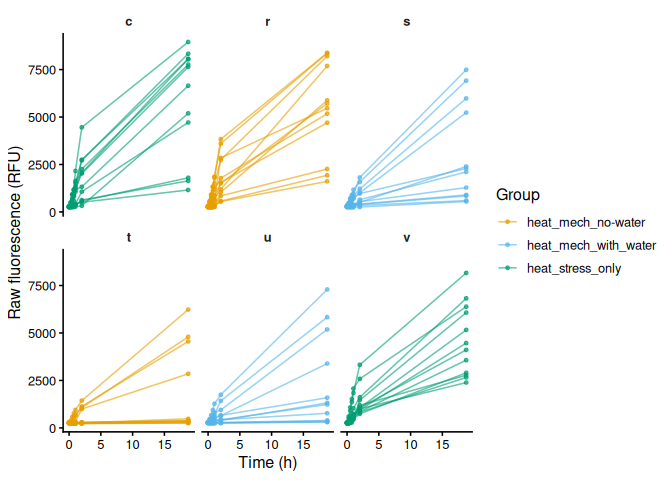<!-- -->

``` r
ggsave(file.path(fig_dir, "raw_fluor_by_plate.png"),
       p_raw_plates, width = 10, height = 8)
```

## 6.3 Mean raw fluorescence by group

``` r
if (has_fam) {
  p <- mean_ts_plot(raw_df, "value", "family_id_group", fam_colours, "Family",
                    "Mean raw fluorescence (RFU ± SE)",
                    linetype_col = if (has_trt) "treatment_group" else NULL,
                    linetypes    = trt_linetypes)
  print(p)
  ggsave(file.path(fig_dir, "raw_mean_by_family.png"), p, width = 8, height = 5)
}

if (has_trt) {
  p <- mean_ts_plot(raw_df, "value", "treatment_group", trt_colours, "Treatment",
                    "Mean raw fluorescence (RFU ± SE)")
  print(p)
  ggsave(file.path(fig_dir, "raw_mean_by_treatment.png"), p, width = 8, height = 5)
}
```

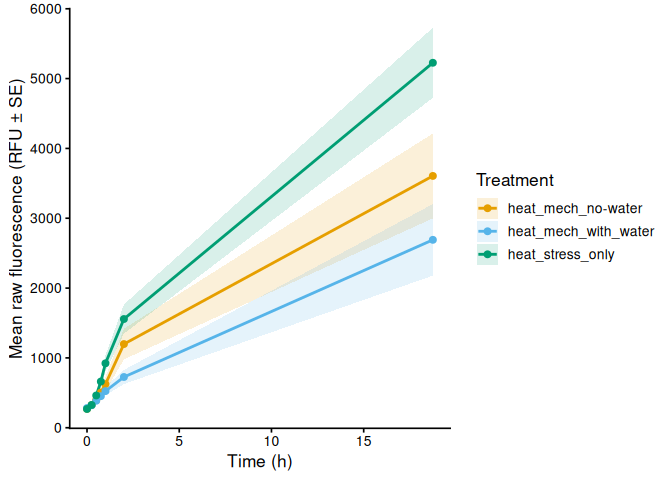<!-- -->

## 6.4 Individual raw fluorescence traces

``` r
if (has_fam) {
  p <- individual_ts_plot(
    raw_df, "value", facet_col = "family_id_group",
    colour_col = if (has_trt) "treatment_group" else "family_id_group",
    colours    = if (has_trt) trt_colours else fam_colours,
    legend_name = if (has_trt) "Treatment" else "Family",
    y_lab = "Raw fluorescence (RFU)")
  print(p)
  ggsave(file.path(fig_dir, "raw_individual_by_family.png"),
         p, width = 10, height = 5)
}

if (has_trt) {
  p <- individual_ts_plot(
    raw_df, "value", facet_col = "treatment_group",
    colour_col = if (has_fam) "family_id_group" else "treatment_group",
    colours    = if (has_fam) fam_colours else trt_colours,
    legend_name = if (has_fam) "Family" else "Treatment",
    y_lab = "Raw fluorescence (RFU)")
  print(p)
  ggsave(file.path(fig_dir, "raw_individual_by_treatment.png"),
         p, width = 10, height = 5)
}
```

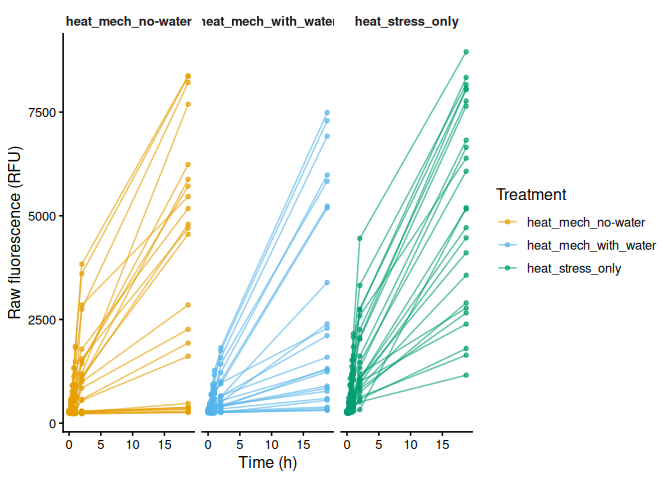<!-- -->

## 6.5 Excluded samples

Wells flagged `exclude_from_analysis = TRUE` appear in the raw
fluorescence plots above but are omitted from all analyses that follow.

``` r
excluded_wells <- dat %>%
  filter(!is_blank, exclude_from_analysis) %>%
  select(plate_id, well_id, sample = trace_id,
         any_of(c("family_id_group", "treatment_group", "exclude_reason"))) %>%
  distinct() %>%
  arrange(plate_id, well_id)

if (nrow(excluded_wells) > 0) {
  cat(knitr::kable(excluded_wells), sep = "\n")
} else {
  cat("No wells are excluded from analysis.\n")
}
```

No wells are excluded from analysis.

# 7 Blank Correction via Fold-Change Normalization

T0 is the earliest timepoint present in the dataset (not necessarily 0
hr). Sample fold-change is expressed relative to each individual’s T0
reading, where the individual is identified by `trace_id` (see
`trace_key()`): the `sample_ID.group` column when populated — allowing
the same animal to be tracked across plates and across wells — or
`plate_id + well_id` for single-plate designs where a well is re-read at
every timepoint. Blank fold-change is the per-plate mean blank RFU at
each timepoint divided by the pooled mean blank RFU at T0. Subtracting
blank fold-change from sample fold-change removes background
fluorescence drift; all samples start at exactly 0 at T0 by
construction.

When the layout contains no blank wells, the blank fold-change is set to
0 (no correction), so `corrected_fc` is simply the fold-change relative
to T0 and samples start at 1 rather than 0.

## 7.1 Step 1 – Identify T0 and compute per-sample fold-change

``` r
# T0 = earliest timepoint present in the dataset
t0_time <- min(dat$time_hr[is.finite(dat$time_hr)], na.rm = TRUE)
message("T0 timepoint: ", t0_time, " hr")

# T0 reference value per individual.
t0_all <- dat %>%
  filter(time_hr == t0_time, !is_blank, is.finite(value)) %>%
  group_by(trace_id) %>%
  summarise(value_t0 = mean(value, na.rm = TRUE), .groups = "drop")

n_missing_t0 <- dat %>%
  filter(!is_blank, !trace_id %in% t0_all$trace_id) %>%
  pull(trace_id) %>%
  n_distinct()
if (n_missing_t0 > 0)
  message(n_missing_t0, " individual(s) have no T0 reading; ",
          "their fold-change will be NA.")

dat_fc <- dat %>%
  left_join(t0_all, by = "trace_id") %>%
  mutate(fold_change = if_else(
    !is_blank & is.finite(value_t0) & value_t0 > 0,
    value / value_t0,
    NA_real_
  ))

str(dat_fc)
```

    tibble [504 × 19] (S3: tbl_df/tbl/data.frame)
     $ row_id               : chr [1:504] "A" "A" "A" "A" ...
     $ col_id               : int [1:504] 1 2 3 4 1 2 3 4 1 2 ...
     $ well_id              : chr [1:504] "A1" "A2" "A3" "A4" ...
     $ value                : num [1:504] 260 278 260 281 277 313 264 267 272 281 ...
     $ plate_id             : chr [1:504] "c" "c" "c" "c" ...
     $ time_hr              : num [1:504] 0 0 0 0 0 0 0 0 0 0 ...
     $ is_blank             : logi [1:504] FALSE FALSE FALSE FALSE FALSE FALSE ...
     $ exclude_from_analysis: logi [1:504] FALSE FALSE FALSE FALSE FALSE FALSE ...
     $ exclude_reason       : chr [1:504] NA NA NA NA ...
     $ family_id_group      : chr [1:504] NA NA NA NA ...
     $ sample_id_group      : chr [1:504] "c-a01" "c-a02" "c-a03" "c-a04" ...
     $ treatment_group      : chr [1:504] "heat_stress_only" "heat_stress_only" "heat_stress_only" "heat_stress_only" ...
     $ width_mm_measurement : num [1:504] NA NA NA NA NA NA NA NA NA NA ...
     $ length_mm_measurement: num [1:504] NA NA NA NA NA NA NA NA NA NA ...
     $ weight_mg_measurement: num [1:504] NA NA NA NA NA NA NA NA NA NA ...
     $ area_mm2_measurement : num [1:504] 93.7 180.7 114 178.6 145.4 ...
     $ trace_id             : chr [1:504] "c-a01" "c-a02" "c-a03" "c-a04" ...
     $ value_t0             : num [1:504] 260 278 260 281 277 313 264 267 272 281 ...
     $ fold_change          : num [1:504] 1 1 1 1 1 1 1 1 1 1 ...

## 7.2 Step 2 – Blank fold-change reference per plate per timepoint

``` r
# Pooled mean blank RFU at T0 across all T0 plates
mean_blank_t0 <- dat %>%
  filter(is_blank, time_hr == t0_time, is.finite(value)) %>%
  pull(value) %>%
  mean(na.rm = TRUE)

has_blanks <- any(dat$is_blank & is.finite(dat$value))

if (has_blanks && !is.finite(mean_blank_t0))
  message("No blank readings found at T0 (", t0_time,
          " hr); blank correction will produce NA.")

# Per-plate per-timepoint mean blank expressed as fold-change relative to T0.
# With no blank wells at all (e.g. the multi-stress run) there is no background
# to remove, so the blank fold-change is 0 and corrected_fc == fold_change.
blank_fc_ref <- if (has_blanks) {
  dat %>%
    filter(is_blank, is.finite(value)) %>%
    group_by(plate_id, time_hr) %>%
    summarise(mean_blank_rfu = mean(value, na.rm = TRUE), .groups = "drop") %>%
    mutate(mean_blank_fc = mean_blank_rfu / mean_blank_t0)
} else {
  message("No blank wells in this experiment; skipping blank correction.")
  dat %>%
    distinct(plate_id, time_hr) %>%
    mutate(mean_blank_rfu = NA_real_, mean_blank_fc = 0)
}

str(blank_fc_ref)
```

    tibble [42 × 4] (S3: tbl_df/tbl/data.frame)
     $ plate_id      : chr [1:42] "c" "c" "c" "c" ...
     $ time_hr       : num [1:42] 0 0.25 0.5 0.75 1 ...
     $ mean_blank_rfu: num [1:42] NA NA NA NA NA NA NA NA NA NA ...
     $ mean_blank_fc : num [1:42] 0 0 0 0 0 0 0 0 0 0 ...

## 7.3 Step 3 – Subtract blank fold-change from sample fold-change

``` r
samples <- dat_fc %>%
  filter(!is_blank, !exclude_from_analysis) %>%
  left_join(blank_fc_ref, by = c("plate_id", "time_hr")) %>%
  mutate(corrected_fc = fold_change - mean_blank_fc)

str(samples)
```

    tibble [504 × 22] (S3: tbl_df/tbl/data.frame)
     $ row_id               : chr [1:504] "A" "A" "A" "A" ...
     $ col_id               : int [1:504] 1 2 3 4 1 2 3 4 1 2 ...
     $ well_id              : chr [1:504] "A1" "A2" "A3" "A4" ...
     $ value                : num [1:504] 260 278 260 281 277 313 264 267 272 281 ...
     $ plate_id             : chr [1:504] "c" "c" "c" "c" ...
     $ time_hr              : num [1:504] 0 0 0 0 0 0 0 0 0 0 ...
     $ is_blank             : logi [1:504] FALSE FALSE FALSE FALSE FALSE FALSE ...
     $ exclude_from_analysis: logi [1:504] FALSE FALSE FALSE FALSE FALSE FALSE ...
     $ exclude_reason       : chr [1:504] NA NA NA NA ...
     $ family_id_group      : chr [1:504] NA NA NA NA ...
     $ sample_id_group      : chr [1:504] "c-a01" "c-a02" "c-a03" "c-a04" ...
     $ treatment_group      : chr [1:504] "heat_stress_only" "heat_stress_only" "heat_stress_only" "heat_stress_only" ...
     $ width_mm_measurement : num [1:504] NA NA NA NA NA NA NA NA NA NA ...
     $ length_mm_measurement: num [1:504] NA NA NA NA NA NA NA NA NA NA ...
     $ weight_mg_measurement: num [1:504] NA NA NA NA NA NA NA NA NA NA ...
     $ area_mm2_measurement : num [1:504] 93.7 180.7 114 178.6 145.4 ...
     $ trace_id             : chr [1:504] "c-a01" "c-a02" "c-a03" "c-a04" ...
     $ value_t0             : num [1:504] 260 278 260 281 277 313 264 267 272 281 ...
     $ fold_change          : num [1:504] 1 1 1 1 1 1 1 1 1 1 ...
     $ mean_blank_rfu       : num [1:504] NA NA NA NA NA NA NA NA NA NA ...
     $ mean_blank_fc        : num [1:504] 0 0 0 0 0 0 0 0 0 0 ...
     $ corrected_fc         : num [1:504] 1 1 1 1 1 1 1 1 1 1 ...

# 8 Blank-Corrected Fold-Change

## 8.1 Mean by group

``` r
if (has_fam) {
  p <- mean_ts_plot(samples, "corrected_fc", "family_id_group", fam_colours,
                    "Family", "Mean blank-corrected fold-change (± SE)",
                    linetype_col = if (has_trt) "treatment_group" else NULL,
                    linetypes    = trt_linetypes)
  print(p)
  ggsave(file.path(fig_dir, "blank_corrected_fc_mean_by_family.png"),
         p, width = 8, height = 5)
}

if (has_trt) {
  p <- mean_ts_plot(samples, "corrected_fc", "treatment_group", trt_colours,
                    "Treatment", "Mean blank-corrected fold-change (± SE)")
  print(p)
  ggsave(file.path(fig_dir, "blank_corrected_fc_mean_by_treatment.png"),
         p, width = 8, height = 5)
}
```

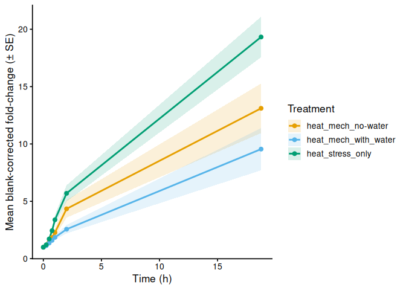<!-- -->

## 8.2 Individual traces

``` r
if (has_fam) {
  p <- individual_ts_plot(
    samples, "corrected_fc", facet_col = "family_id_group",
    colour_col = if (has_trt) "treatment_group" else "family_id_group",
    colours    = if (has_trt) trt_colours else fam_colours,
    legend_name = if (has_trt) "Treatment" else "Family",
    y_lab = "Blank-corrected fold-change")
  print(p)
  ggsave(file.path(fig_dir, "blank_corrected_fc_by_family.png"),
         p, width = 10, height = 5)
}

if (has_trt) {
  p <- individual_ts_plot(
    samples, "corrected_fc", facet_col = "treatment_group",
    colour_col = if (has_fam) "family_id_group" else "treatment_group",
    colours    = if (has_fam) fam_colours else trt_colours,
    legend_name = if (has_fam) "Family" else "Treatment",
    y_lab = "Blank-corrected fold-change")
  print(p)
  ggsave(file.path(fig_dir, "blank_corrected_fc_by_treatment.png"),
         p, width = 10, height = 5)
}
```

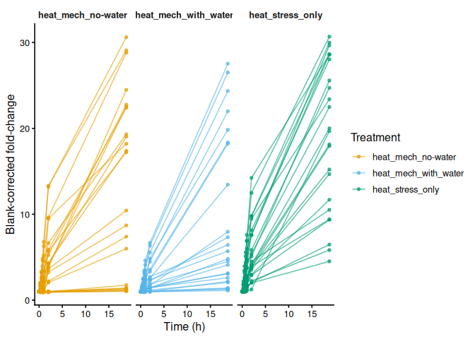<!-- -->

# 9 Metabolism (Size-Normalised Fold-Change)

Blank-corrected fold-change divided by each active measurement column.
This is “metabolism” as defined in Huffmyer et al.

``` r
metab_cols <- paste0("metabolism_per_", active_meas_cols)

if (length(active_meas_cols) == 0) {
  message("No active measurement columns: skipping metabolism calculation.")
  metabolism_df <- tibble()
} else {
  metabolism_df <- samples
  for (mc in active_meas_cols) {
    out_col <- paste0("metabolism_per_", mc)
    metabolism_df <- metabolism_df %>%
      mutate(!!out_col := if_else(
        is.finite(.data[[mc]]) & .data[[mc]] > 0 &
          is.finite(corrected_fc),
        corrected_fc / .data[[mc]],
        NA_real_
      ))
  }
}

str(metabolism_df)
```

    tibble [504 × 23] (S3: tbl_df/tbl/data.frame)
     $ row_id                             : chr [1:504] "A" "A" "A" "A" ...
     $ col_id                             : int [1:504] 1 2 3 4 1 2 3 4 1 2 ...
     $ well_id                            : chr [1:504] "A1" "A2" "A3" "A4" ...
     $ value                              : num [1:504] 260 278 260 281 277 313 264 267 272 281 ...
     $ plate_id                           : chr [1:504] "c" "c" "c" "c" ...
     $ time_hr                            : num [1:504] 0 0 0 0 0 0 0 0 0 0 ...
     $ is_blank                           : logi [1:504] FALSE FALSE FALSE FALSE FALSE FALSE ...
     $ exclude_from_analysis              : logi [1:504] FALSE FALSE FALSE FALSE FALSE FALSE ...
     $ exclude_reason                     : chr [1:504] NA NA NA NA ...
     $ family_id_group                    : chr [1:504] NA NA NA NA ...
     $ sample_id_group                    : chr [1:504] "c-a01" "c-a02" "c-a03" "c-a04" ...
     $ treatment_group                    : chr [1:504] "heat_stress_only" "heat_stress_only" "heat_stress_only" "heat_stress_only" ...
     $ width_mm_measurement               : num [1:504] NA NA NA NA NA NA NA NA NA NA ...
     $ length_mm_measurement              : num [1:504] NA NA NA NA NA NA NA NA NA NA ...
     $ weight_mg_measurement              : num [1:504] NA NA NA NA NA NA NA NA NA NA ...
     $ area_mm2_measurement               : num [1:504] 93.7 180.7 114 178.6 145.4 ...
     $ trace_id                           : chr [1:504] "c-a01" "c-a02" "c-a03" "c-a04" ...
     $ value_t0                           : num [1:504] 260 278 260 281 277 313 264 267 272 281 ...
     $ fold_change                        : num [1:504] 1 1 1 1 1 1 1 1 1 1 ...
     $ mean_blank_rfu                     : num [1:504] NA NA NA NA NA NA NA NA NA NA ...
     $ mean_blank_fc                      : num [1:504] 0 0 0 0 0 0 0 0 0 0 ...
     $ corrected_fc                       : num [1:504] 1 1 1 1 1 1 1 1 1 1 ...
     $ metabolism_per_area_mm2_measurement: num [1:504] 0.01067 0.00553 0.00877 0.0056 0.00688 ...

## 9.1 Mean metabolism by group

``` r
if (nrow(metabolism_df) > 0) {
  for (col in metab_cols) {
    if (!col %in% names(metabolism_df)) next
    mc_label <- str_remove(col, "^metabolism_per_")
    y_lab    <- paste0(metabolism_y_label(col), " (± SE)")

    if (has_fam) {
      p <- mean_ts_plot(metabolism_df, col, "family_id_group", fam_colours,
                        "Family", y_lab,
                        linetype_col = if (has_trt) "treatment_group" else NULL,
                        linetypes    = trt_linetypes)
      print(p)
      ggsave(file.path(fig_dir,
                       paste0("metabolism_mean_", mc_label, "_by_family.png")),
             p, width = 8, height = 5)
    }

    if (has_trt) {
      p <- mean_ts_plot(metabolism_df, col, "treatment_group", trt_colours,
                        "Treatment", y_lab)
      print(p)
      ggsave(file.path(fig_dir,
                       paste0("metabolism_mean_", mc_label, "_by_treatment.png")),
             p, width = 8, height = 5)
    }
  }
}
```

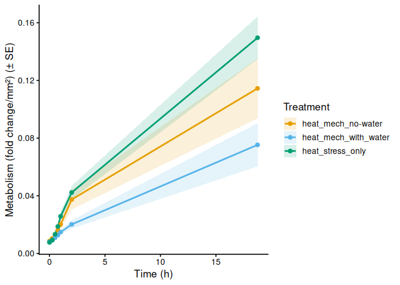<!-- -->

## 9.2 Individual metabolism traces

``` r
if (nrow(metabolism_df) > 0) {
  for (col in metab_cols) {
    if (!col %in% names(metabolism_df)) next
    mc_label <- str_remove(col, "^metabolism_per_")

    if (has_fam) {
      p <- individual_ts_plot(
        metabolism_df, col, facet_col = "family_id_group",
        colour_col = if (has_trt) "treatment_group" else "family_id_group",
        colours    = if (has_trt) trt_colours else fam_colours,
        legend_name = if (has_trt) "Treatment" else "Family",
        y_lab = metabolism_y_label(col))
      print(p)
      ggsave(file.path(fig_dir,
                       paste0("metabolism_individual_", mc_label, "_by_family.png")),
             p, width = 10, height = 5)
    }

    if (has_trt) {
      p <- individual_ts_plot(
        metabolism_df, col, facet_col = "treatment_group",
        colour_col = if (has_fam) "family_id_group" else "treatment_group",
        colours    = if (has_fam) fam_colours else trt_colours,
        legend_name = if (has_fam) "Family" else "Treatment",
        y_lab = metabolism_y_label(col))
      print(p)
      ggsave(file.path(fig_dir,
                       paste0("metabolism_individual_", mc_label, "_by_treatment.png")),
             p, width = 10, height = 5)
    }
  }
}
```

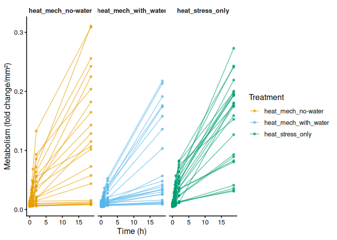<!-- -->

# 10 Time-Series Statistical Analysis

Linear mixed effects models test the effect of experimental variables on
metabolism over time. Individual (`sample_id_group`) is included as a
random intercept to account for repeated measures across timepoints.
Type III ANOVA with Satterthwaite’s approximation (lmerTest) assesses
significance; post-hoc pairwise comparisons use estimated marginal means
(emmeans, Tukey adjustment).

``` r
run_ts_stats <- function(df, value_col) {
  has_family    <- "family_id_group" %in% names(df) &&
    length(unique(na.omit(df$family_id_group))) > 1
  has_treatment <- "treatment_group" %in% names(df) &&
    length(unique(na.omit(df$treatment_group))) > 1

  if (!has_family && !has_treatment) return(NULL)

  df <- df %>%
    filter(is.finite(.data[[value_col]]), is.finite(time_hr)) %>%
    mutate(
      time_f     = factor(time_hr),
      individual = factor(trace_id)
    )

  if (nrow(df) == 0) return(NULL)

  if (has_family)    df <- df %>% mutate(family    = factor(family_id_group))
  if (has_treatment) df <- df %>% mutate(treatment = factor(treatment_group))

  if (has_family    && length(unique(na.omit(df$family)))    < 2) return(NULL)
  if (has_treatment && length(unique(na.omit(df$treatment))) < 2) return(NULL)

  fixed <- if (has_family && has_treatment) {
    paste0(value_col, " ~ time_f * family * treatment")
  } else if (has_family) {
    paste0(value_col, " ~ time_f * family")
  } else {
    paste0(value_col, " ~ time_f * treatment")
  }

  model <- lmer(
    as.formula(paste0(fixed, " + (1 | individual)")),
    data = df
  )

  anova_res <- anova(model, type = 3, ddf = "Satterthwaite")

  # Pairwise comparisons of group combinations at each timepoint
  emm_spec <- if (has_family && has_treatment) {
    ~ family * treatment | time_f
  } else if (has_family) {
    ~ family | time_f
  } else {
    ~ treatment | time_f
  }

  emm       <- emmeans(model, emm_spec)
  pairs_res <- as.data.frame(pairs(emm, adjust = "tukey"))

  # Main-effect marginal means (collapsed across time)
  emm_main <- if (has_family && has_treatment) {
    emmeans(model, ~ family * treatment)
  } else if (has_family) {
    emmeans(model, ~ family)
  } else {
    emmeans(model, ~ treatment)
  }

  pairs_main <- as.data.frame(pairs(emm_main, adjust = "tukey"))

  list(
    model         = model,
    anova         = anova_res,
    pairs_by_time = pairs_res,
    pairs_main    = pairs_main,
    has_family    = has_family,
    has_treatment = has_treatment
  )
}

ts_stats <- list()
if (nrow(metabolism_df) > 0) {
  for (mc in active_meas_cols) {
    col <- paste0("metabolism_per_", mc)
    if (col %in% names(metabolism_df))
      ts_stats[[col]] <- run_ts_stats(metabolism_df, col)
  }
}
```

## 10.1 Results

``` r
for (col in names(ts_stats)) {
  res <- ts_stats[[col]]
  if (is.null(res)) next

  cat("\n\n### Metric:", col, "\n\n")

  cat("**Type III ANOVA (Satterthwaite approximation):**\n\n")
  cat(knitr::kable(as.data.frame(res$anova), digits = 4, format = "pipe"), sep = "\n")
  cat("\n")

  cat("**Marginal means – main effects (collapsed across time):**\n\n")
  cat(knitr::kable(as.data.frame(res$pairs_main), digits = 4, format = "pipe"), sep = "\n")
  cat("\n")

  cat("**Pairwise comparisons by timepoint (Tukey):**\n\n")
  cat(knitr::kable(as.data.frame(res$pairs_by_time), digits = 4, format = "pipe"), sep = "\n")
  cat("\n")
}
```

### 10.1.1 Metric: metabolism_per_area_mm2_measurement

**Type III ANOVA (Satterthwaite approximation):**

|                  | Sum Sq | Mean Sq | NumDF | DenDF |  F value | Pr(\>F) |
|------------------|-------:|--------:|------:|------:|---------:|--------:|
| time_f           | 0.6065 |  0.1011 |     6 |   414 | 114.3723 |  0.0000 |
| treatment        | 0.0077 |  0.0038 |     2 |    69 |   4.3531 |  0.0166 |
| time_f:treatment | 0.0517 |  0.0043 |    12 |   414 |   4.8703 |  0.0000 |

**Marginal means – main effects (collapsed across time):**

| contrast | estimate | SE | df | t.ratio | p.value |
|:---|---:|---:|---:|---:|---:|
| (heat_mech_no-water) - heat_mech_with_water | 0.0099 | 0.0056 | 69 | 1.7523 | 0.1935 |
| (heat_mech_no-water) - heat_stress_only | -0.0066 | 0.0056 | 69 | -1.1798 | 0.4692 |
| heat_mech_with_water - heat_stress_only | -0.0165 | 0.0056 | 69 | -2.9321 | 0.0125 |

**Pairwise comparisons by timepoint (Tukey):**

| contrast | time_f | estimate | SE | df | t.ratio | p.value |
|:---|:---|---:|---:|---:|---:|---:|
| (heat_mech_no-water) - heat_mech_with_water | 0 | 0.0006 | 0.0097 | 372.1799 | 0.0577 | 0.9982 |
| (heat_mech_no-water) - heat_stress_only | 0 | 0.0010 | 0.0097 | 372.1799 | 0.1026 | 0.9942 |
| heat_mech_with_water - heat_stress_only | 0 | 0.0004 | 0.0097 | 372.1799 | 0.0449 | 0.9989 |
| (heat_mech_no-water) - heat_mech_with_water | 0.25 | 0.0013 | 0.0097 | 372.1799 | 0.1308 | 0.9906 |
| (heat_mech_no-water) - heat_stress_only | 0.25 | 0.0011 | 0.0097 | 372.1799 | 0.1150 | 0.9927 |
| heat_mech_with_water - heat_stress_only | 0.25 | -0.0002 | 0.0097 | 372.1799 | -0.0158 | 0.9999 |
| (heat_mech_no-water) - heat_mech_with_water | 0.5 | 0.0019 | 0.0097 | 372.1799 | 0.1923 | 0.9798 |
| (heat_mech_no-water) - heat_stress_only | 0.5 | -0.0005 | 0.0097 | 372.1799 | -0.0515 | 0.9985 |
| heat_mech_with_water - heat_stress_only | 0.5 | -0.0024 | 0.0097 | 372.1799 | -0.2438 | 0.9678 |
| (heat_mech_no-water) - heat_mech_with_water | 0.75 | 0.0035 | 0.0097 | 372.1799 | 0.3638 | 0.9297 |
| (heat_mech_no-water) - heat_stress_only | 0.75 | -0.0024 | 0.0097 | 372.1799 | -0.2486 | 0.9665 |
| heat_mech_with_water - heat_stress_only | 0.75 | -0.0060 | 0.0097 | 372.1799 | -0.6123 | 0.8135 |
| (heat_mech_no-water) - heat_mech_with_water | 1 | 0.0053 | 0.0097 | 372.1799 | 0.5463 | 0.8484 |
| (heat_mech_no-water) - heat_stress_only | 1 | -0.0056 | 0.0097 | 372.1799 | -0.5783 | 0.8318 |
| heat_mech_with_water - heat_stress_only | 1 | -0.0109 | 0.0097 | 372.1799 | -1.1246 | 0.4995 |
| (heat_mech_no-water) - heat_mech_with_water | 2 | 0.0172 | 0.0097 | 372.1799 | 1.7719 | 0.1805 |
| (heat_mech_no-water) - heat_stress_only | 2 | -0.0049 | 0.0097 | 372.1799 | -0.5017 | 0.8705 |
| heat_mech_with_water - heat_stress_only | 2 | -0.0221 | 0.0097 | 372.1799 | -2.2736 | 0.0608 |
| (heat_mech_no-water) - heat_mech_with_water | 18.75 | 0.0392 | 0.0097 | 372.1799 | 4.0239 | 0.0002 |
| (heat_mech_no-water) - heat_stress_only | 18.75 | -0.0351 | 0.0097 | 372.1799 | -3.6089 | 0.0010 |
| heat_mech_with_water - heat_stress_only | 18.75 | -0.0743 | 0.0097 | 372.1799 | -7.6329 | 0.0000 |

# 11 Area Under the Curve (AUC)

AUC computed per individual via the trapezoid rule across all
timepoints. `metabolism_per_*` is the primary metric matching the paper;
`corrected_fc` and `raw_fluorescence` are retained for reference.

``` r
compute_auc <- function(df, value_col, group_vars) {
  df %>%
    filter(is.finite(time_hr), is.finite(.data[[value_col]])) %>%
    group_by(across(all_of(group_vars))) %>%
    summarise(
      AUC          = trapezoid_auc(time_hr, .data[[value_col]]),
      n_timepoints = n(),
      .groups      = "drop"
    ) %>%
    filter(is.finite(AUC))
}

# Only include grouping columns that are actually present in the data
individual_vars <- intersect(
  c("trace_id", "plate_id", "family_id_group", "treatment_group"),
  names(metabolism_df)
)

auc_metab_list <- list()
if (nrow(metabolism_df) > 0) {
  for (mc in active_meas_cols) {
    col <- paste0("metabolism_per_", mc)
    if (col %in% names(metabolism_df)) {
      auc_metab_list[[col]] <-
        compute_auc(metabolism_df, col, individual_vars) %>%
        mutate(metric = col)
    }
  }
}

auc_all <- bind_rows(auc_metab_list)

str(auc_all)
```

    tibble [72 × 7] (S3: tbl_df/tbl/data.frame)
     $ trace_id       : chr [1:72] "c-a01" "c-a02" "c-a03" "c-a04" ...
     $ plate_id       : chr [1:72] "c" "c" "c" "c" ...
     $ family_id_group: chr [1:72] NA NA NA NA ...
     $ treatment_group: chr [1:72] "heat_stress_only" "heat_stress_only" "heat_stress_only" "heat_stress_only" ...
     $ AUC            : num [1:72] 2.819 0.412 1.669 0.394 2.136 ...
     $ n_timepoints   : int [1:72] 7 7 7 7 7 7 7 7 7 7 ...
     $ metric         : chr [1:72] "metabolism_per_area_mm2_measurement" "metabolism_per_area_mm2_measurement" "metabolism_per_area_mm2_measurement" "metabolism_per_area_mm2_measurement" ...

## 11.1 AUC summary tables

``` r
sum_vars <- intersect(
  c("metric", "family_id_group", "treatment_group"),
  names(auc_all)
)
auc_summary <- auc_all %>%
  group_by(across(all_of(sum_vars))) %>%
  summarise(
    n      = n(),
    mean   = mean(AUC, na.rm = TRUE),
    sd     = sd(AUC, na.rm = TRUE),
    se     = sd / sqrt(n),
    median = median(AUC, na.rm = TRUE),
    .groups = "drop"
  )

print(auc_summary)
```

    # A tibble: 3 × 8
      metric          family_id_group treatment_group     n  mean    sd    se median
      <chr>           <chr>           <chr>           <int> <dbl> <dbl> <dbl>  <dbl>
    1 metabolism_per… <NA>            heat_mech_no-w…    24 1.31  1.14  0.232  1.17 
    2 metabolism_per… <NA>            heat_mech_with…    24 0.828 0.745 0.152  0.461
    3 metabolism_per… <NA>            heat_stress_on…    24 1.66  0.780 0.159  1.86 

# 12 Statistical Analysis

Each individual oyster (`sample_id_group`) is the observational unit.
The model is built from whichever grouping factors are present: both
family and treatment (with interaction) when both exist, or a one-way
model when only one factor is available. Each plate maps to a unique
family × treatment combination, so plate-level and group-level variance
are confounded; interpret accordingly.

``` r
run_auc_stats <- function(auc_df) {
  empty <- tibble()

  has_family    <- "family_id_group" %in% names(auc_df) &&
    length(unique(na.omit(auc_df$family_id_group))) > 1
  has_treatment <- "treatment_group" %in% names(auc_df) &&
    length(unique(na.omit(auc_df$treatment_group))) > 1

  if (!has_family && !has_treatment) {
    return(list(model = NULL, anova = NULL,
                pairs_full = empty, pairs_family = empty,
                pairs_trt = empty,
                has_family = FALSE, has_treatment = FALSE))
  }

  if (has_family)    auc_df <- auc_df %>% mutate(family    = factor(family_id_group))
  if (has_treatment) auc_df <- auc_df %>% mutate(treatment = factor(treatment_group))

  formula_str <- if (has_family && has_treatment) {
    "AUC ~ family * treatment"
  } else if (has_family) {
    "AUC ~ family"
  } else {
    "AUC ~ treatment"
  }
  model     <- lm(as.formula(formula_str), data = auc_df)
  anova_res <- anova(model)

  if (has_family && has_treatment) {
    pairs_full   <- as.data.frame(pairs(emmeans(model, ~ family * treatment),
                                        adjust = "tukey"))
    pairs_family <- as.data.frame(pairs(emmeans(model, ~ family),
                                        adjust = "tukey"))
    pairs_trt    <- as.data.frame(pairs(emmeans(model, ~ treatment),
                                        adjust = "tukey"))
  } else if (has_family) {
    pairs_family <- as.data.frame(pairs(emmeans(model, ~ family),
                                        adjust = "tukey"))
    pairs_full   <- pairs_family
    pairs_trt    <- empty
  } else {
    pairs_trt    <- as.data.frame(pairs(emmeans(model, ~ treatment),
                                        adjust = "tukey"))
    pairs_full   <- pairs_trt
    pairs_family <- empty
  }

  list(
    model         = model,
    anova         = anova_res,
    pairs_full    = pairs_full,
    pairs_family  = pairs_family,
    pairs_trt     = pairs_trt,
    has_family    = has_family,
    has_treatment = has_treatment
  )
}

metrics_to_test <- unique(auc_all$metric)
stats_results   <- map(
  set_names(metrics_to_test),
  ~ run_auc_stats(auc_all %>% filter(metric == .x))
)
```

## 12.1 Results by metric

``` r
for (met in metrics_to_test) {
  stats <- stats_results[[met]]
  cat("\n\n### Metric:", met, "\n\n")
  cat("**ANOVA:**\n\n")
  cat(knitr::kable(as.data.frame(stats$anova), digits = 4, format = "pipe"), sep = "\n")
  cat("\n")
  if (stats$has_family && stats$has_treatment) {
    cat("**Pairwise: family × treatment (Tukey):**\n\n")
    cat(knitr::kable(as.data.frame(stats$pairs_full), digits = 4, format = "pipe"), sep = "\n")
  cat("\n")
    cat("**Pairwise: family main effect:**\n\n")
    cat(knitr::kable(as.data.frame(stats$pairs_family), digits = 4, format = "pipe"), sep = "\n")
  cat("\n")
    cat("**Pairwise: treatment main effect:**\n\n")
    cat(knitr::kable(as.data.frame(stats$pairs_trt), digits = 4, format = "pipe"), sep = "\n")
  cat("\n")
  } else if (stats$has_family) {
    cat("**Pairwise: family (Tukey):**\n\n")
    cat(knitr::kable(as.data.frame(stats$pairs_family), digits = 4, format = "pipe"), sep = "\n")
  cat("\n")
  } else if (stats$has_treatment) {
    cat("**Pairwise: treatment (Tukey):**\n\n")
    cat(knitr::kable(as.data.frame(stats$pairs_trt), digits = 4, format = "pipe"), sep = "\n")
  cat("\n")
  }
}
```

### 12.1.1 Metric: metabolism_per_area_mm2_measurement

**ANOVA:**

|           |  Df |  Sum Sq | Mean Sq | F value | Pr(\>F) |
|-----------|----:|--------:|--------:|--------:|--------:|
| treatment |   2 |  8.3029 |  4.1514 |  5.0652 |  0.0089 |
| Residuals |  69 | 56.5525 |  0.8196 |      NA |      NA |

**Pairwise: treatment (Tukey):**

| contrast | estimate | SE | df | t.ratio | p.value |
|:---|---:|---:|---:|---:|---:|
| (heat_mech_no-water) - heat_mech_with_water | 0.4862 | 0.2613 | 69 | 1.8604 | 0.1580 |
| (heat_mech_no-water) - heat_stress_only | -0.3414 | 0.2613 | 69 | -1.3063 | 0.3965 |
| heat_mech_with_water - heat_stress_only | -0.8276 | 0.2613 | 69 | -3.1667 | 0.0064 |

# 13 AUC Box Plots with Statistical Annotations

Significance labels: `***` p \< 0.001, `**` p \< 0.01, `*` p \< 0.05.
Brackets are drawn only for significant pairs (p \< 0.05). Plots are
generated for whichever grouping factors are present: treatment-only,
family-only, all-groups, within-family, and within-treatment.

``` r
sig_label <- function(p) {
  case_when(p < 0.001 ~ "***", p < 0.01 ~ "**", p < 0.05 ~ "*",
            TRUE ~ "ns")
}

# Add significance brackets to an existing ggplot.
# pairs_df   : data frame with $contrast and $p.value columns
# group_levels: ordered character vector matching x-axis factor levels
# y_vals     : numeric vector of AUC values used to set bracket heights
add_sig_brackets <- function(p, pairs_df, group_levels, y_vals) {
  sig_pairs <- pairs_df %>%
    mutate(label = sig_label(p.value)) %>%
    filter(label != "ns")
  if (nrow(sig_pairs) == 0) return(p)

  y_max   <- max(y_vals, na.rm = TRUE)
  y_range <- diff(range(y_vals, na.rm = TRUE))
  step    <- y_range * 0.12

  for (i in seq_len(nrow(sig_pairs))) {
    parts <- str_split(as.character(sig_pairs$contrast[i]), " - ", 2)[[1]]
    # emmeans wraps level names containing "-" in parentheses, e.g.
    # "(heat_mech_no-water)"; strip them so labels match the x-axis levels.
    g1 <- str_remove_all(trimws(parts[1]), "^\\(|\\)$")
    g2 <- str_remove_all(trimws(parts[2]), "^\\(|\\)$")
    x1 <- match(g1, group_levels)
    x2 <- match(g2, group_levels)
    if (is.na(x1) || is.na(x2)) next
    bar_y <- y_max + i * step
    p <- p +
      annotate("segment", x = x1, xend = x2,
               y = bar_y, yend = bar_y,
               colour = "black", linewidth = 0.6) +
      annotate("segment", x = x1, xend = x1,
               y = bar_y, yend = bar_y - step * 0.3,
               colour = "black", linewidth = 0.6) +
      annotate("segment", x = x2, xend = x2,
               y = bar_y, yend = bar_y - step * 0.3,
               colour = "black", linewidth = 0.6) +
      annotate("text", x = (x1 + x2) / 2,
               y = bar_y + step * 0.15,
               label = sig_pairs$label[i], size = 4.5)
  }
  p
}
```

``` r
for (met in metrics_to_test) {
  df      <- auc_all %>% filter(metric == met)
  stats   <- stats_results[[met]]
  y_lab   <- auc_y_label(met)
  has_fam <- stats$has_family
  has_trt <- stats$has_treatment

  # ── Treatment main effect (x = treatment, tick = treatment name) ───────
  if (has_trt) {
    df_p <- df %>%
      mutate(x = factor(treatment_group, levels = sort(unique(treatment_group))))
    grps <- levels(df_p$x)
    # Point shape shows the plate each oyster was on, so plate effects within
    # a treatment are visible at a glance (see "Plate Effects" below).
    df_p <- df_p %>% mutate(plate = toupper(plate_id))
    p <- ggplot(df_p, aes(x = x, y = AUC, fill = x)) +
      geom_boxplot(alpha = 0.6, outlier.shape = NA) +
      geom_jitter(aes(shape = plate), width = 0.15, alpha = 0.6, size = 1.8) +
      scale_fill_manual(values = trt_colours[grps], guide = "none") +
      scale_shape_manual(values = seq_along(unique(df_p$plate)) + 14,
                         name = "Plate") +
      labs(x = "Treatment", y = y_lab) +
      theme_classic(base_size = 13) +
      theme(axis.text.x = element_text(angle = 20, hjust = 1))
    p <- add_sig_brackets(p, stats$pairs_trt, grps, df_p$AUC)
    print(p)
    ggsave(file.path(fig_dir, paste0("auc_treatment_", met, ".png")),
           p, width = 6, height = 5.5)
  }

  # ── Family main effect (x = family, tick = family name) ───────────────
  if (has_fam) {
    df_p <- df %>%
      mutate(x = factor(family_id_group,
                        levels = str_sort(unique(family_id_group), numeric = TRUE)))
    grps <- levels(df_p$x)
    p <- ggplot(df_p, aes(x = x, y = AUC, fill = x)) +
      geom_boxplot(alpha = 0.6, outlier.shape = NA) +
      geom_jitter(width = 0.15, alpha = 0.4, size = 1.5) +
      scale_fill_manual(values = fam_colours[grps], guide = "none") +
      labs(x = "Family", y = y_lab) +
      theme_classic(base_size = 13)
    p <- add_sig_brackets(p, stats$pairs_family, grps, df_p$AUC)
    print(p)
    ggsave(file.path(fig_dir, paste0("auc_family_", met, ".png")),
           p, width = 5, height = 5)
  }

  # Remaining plots require both factors
  if (!has_fam || !has_trt) next

  # ── All family:treatment groups (x = family:treatment) ─────────────────
  # emmeans contrasts use spaces; convert to colon to match tick labels
  pairs_fc <- stats$pairs_full %>%
    mutate(contrast = str_replace_all(
      contrast,
      "([a-z]+) ([a-z]+)( - )([a-z]+) ([a-z]+)",
      "\\1:\\2\\3\\4:\\5"
    ))
  df_p <- df %>%
    mutate(x = factor(
      paste(family_id_group, treatment_group, sep = ":"),
      levels = str_sort(unique(paste(family_id_group, treatment_group, sep = ":")),
                        numeric = TRUE)
    ))
  grps     <- levels(df_p$x)
  fill_map <- setNames(make_palette(length(grps)), grps)
  p <- ggplot(df_p, aes(x = x, y = AUC, fill = x)) +
    geom_boxplot(alpha = 0.6, outlier.shape = NA) +
    geom_jitter(width = 0.15, alpha = 0.4, size = 1.5) +
    scale_fill_manual(values = fill_map, guide = "none") +
    labs(x = "Family : Treatment", y = y_lab) +
    theme_classic(base_size = 13) +
    theme(axis.text.x = element_text(angle = 20, hjust = 1))
  p <- add_sig_brackets(p, pairs_fc, grps, df_p$AUC)
  print(p)
  ggsave(file.path(fig_dir, paste0("auc_all_groups_", met, ".png")),
         p, width = 6, height = 5)

  # ── Within each family: treatment comparison (x = family:treatment) ────
  # Tick labels are family:treatment so these plots are visually distinct
  # from the treatment main-effect plot above.
  for (fam in str_sort(unique(df$family_id_group), numeric = TRUE)) {
    df_p <- df %>%
      filter(family_id_group == fam) %>%
      mutate(x = factor(
        paste(family_id_group, treatment_group, sep = ":"),
        levels = str_sort(unique(paste(family_id_group, treatment_group, sep = ":")),
                          numeric = TRUE)
      ))
    grps     <- levels(df_p$x)
    pairs_sub <- pairs_fc %>%
      filter(str_count(contrast, paste0(fam, ":")) == 2)
    p <- ggplot(df_p, aes(x = x, y = AUC, fill = x)) +
      geom_boxplot(alpha = 0.6, outlier.shape = NA) +
      geom_jitter(width = 0.15, alpha = 0.4, size = 1.5) +
      scale_fill_manual(values = fill_map[grps], guide = "none") +
      labs(x = "Family : Treatment", y = y_lab) +
      theme_classic(base_size = 13)
    p <- add_sig_brackets(p, pairs_sub, grps, df_p$AUC)
    print(p)
    ggsave(file.path(fig_dir, paste0("auc_", fam, "_trt_", met, ".png")),
           p, width = 5, height = 5)
  }

  # ── Within each treatment: family comparison (x = family:treatment) ────
  # Tick labels are family:treatment so these plots are visually distinct
  # from the family main-effect plot above.
  for (trt in sort(unique(df$treatment_group))) {
    df_p <- df %>%
      filter(treatment_group == trt) %>%
      mutate(x = factor(
        paste(family_id_group, treatment_group, sep = ":"),
        levels = str_sort(unique(paste(family_id_group, treatment_group, sep = ":")),
                          numeric = TRUE)
      ))
    grps      <- levels(df_p$x)
    pairs_sub <- pairs_fc %>%
      filter(str_count(contrast, paste0(":", trt)) == 2)
    p <- ggplot(df_p, aes(x = x, y = AUC, fill = x)) +
      geom_boxplot(alpha = 0.6, outlier.shape = NA) +
      geom_jitter(width = 0.15, alpha = 0.4, size = 1.5) +
      scale_fill_manual(values = fill_map[grps], guide = "none") +
      labs(x = "Family : Treatment", y = y_lab) +
      theme_classic(base_size = 13)
    p <- add_sig_brackets(p, pairs_sub, grps, df_p$AUC)
    print(p)
    ggsave(file.path(fig_dir, paste0("auc_", trt, "_fam_", met, ".png")),
           p, width = 5, height = 5)
  }
}
```

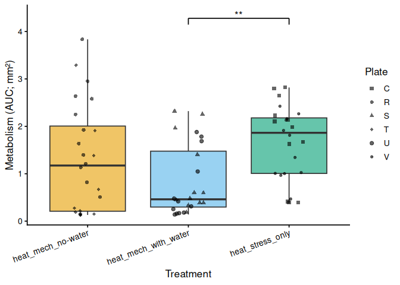<!-- -->

# 14 Plate Effects

Each plate is one 12-well read of one treatment, so a plate difference
within the same treatment cannot be caused by the treatment. Two plates
per treatment are available here, which lets us ask whether plate (read
batch, positioning, handling order, etc.) explains variation in AUC.
Three views are provided, all using per-oyster AUC:

1.  **All plates**: one-way ANOVA on plate with Tukey pairwise
    contrasts.
2.  **Within each treatment**: plate comparison among the plates that
    carry the same treatment. A significant difference here is a plate
    effect.
3.  **Plate nested in treatment** (`AUC ~ treatment / plate`): the
    `treatment:plate` row tests plate-within-treatment variation
    overall. The `treatment` row in that table uses the oyster-level
    residual as its error term, which ignores plate. Because plates are
    the experimental units for treatment, the treatment test is repeated
    with the plate-within-treatment mean square as the error term
    (**treatment tested against plates**); with only two plates per
    treatment it has very few denominator df and low power.

``` r
run_plate_stats <- function(auc_df) {
  auc_df <- auc_df %>% mutate(plate = factor(toupper(plate_id)))
  if (nlevels(droplevels(auc_df$plate)) < 2) return(NULL)

  has_trt <- "treatment_group" %in% names(auc_df) &&
    any(!is.na(auc_df$treatment_group))
  if (has_trt) auc_df <- auc_df %>% mutate(treatment = factor(treatment_group))

  # 1. All plates
  m_all <- lm(AUC ~ plate, data = auc_df)
  out <- list(
    anova_all = anova(m_all),
    pairs_all = as.data.frame(pairs(emmeans(m_all, ~ plate), adjust = "tukey")),
    within    = list(),
    nested    = NULL,
    trt_vs_plates = NULL
  )
  if (!has_trt) return(out)

  # 2. Plates within each treatment (only treatments with >= 2 plates)
  for (trt in sort(unique(as.character(auc_df$treatment)))) {
    d <- auc_df %>% filter(treatment == trt) %>% mutate(plate = droplevels(plate))
    if (nlevels(d$plate) < 2) next
    m <- lm(AUC ~ plate, data = d)
    out$within[[trt]] <- list(
      anova = anova(m),
      pairs = as.data.frame(pairs(emmeans(m, ~ plate), adjust = "tukey"))
    )
  }

  # 3. Plate nested in treatment; treatment tested against plate-within-treatment
  plates_per_trt <- auc_df %>% distinct(treatment, plate) %>% count(treatment)
  if (nrow(auc_df) > 0 && any(plates_per_trt$n > 1)) {
    m_nest <- lm(AUC ~ treatment / plate, data = auc_df)
    an <- anova(m_nest)
    out$nested <- an
    if ("treatment:plate" %in% rownames(an) && an["treatment:plate", "Df"] > 0) {
      f <- an["treatment", "Mean Sq"] / an["treatment:plate", "Mean Sq"]
      out$trt_vs_plates <- tibble(
        term  = "treatment (error = plate within treatment)",
        NumDF = an["treatment", "Df"],
        DenDF = an["treatment:plate", "Df"],
        F     = f,
        p     = pf(f, an["treatment", "Df"], an["treatment:plate", "Df"],
                   lower.tail = FALSE)
      )
    }
  }
  out
}

plate_stats <- map(
  set_names(metrics_to_test),
  ~ run_plate_stats(auc_all %>% filter(metric == .x))
)

# Per-plate AUC summary
plate_summary <- auc_all %>%
  mutate(plate = toupper(plate_id)) %>%
  group_by(across(any_of(c("metric", "treatment_group", "plate")))) %>%
  summarise(
    n      = n(),
    mean   = mean(AUC, na.rm = TRUE),
    sd     = sd(AUC, na.rm = TRUE),
    se     = sd / sqrt(n),
    median = median(AUC, na.rm = TRUE),
    .groups = "drop"
  )
```

## 14.1 Results by metric

``` r
for (met in metrics_to_test) {
  res <- plate_stats[[met]]
  if (is.null(res)) next
  cat("\n\n### Metric:", met, "\n\n")

  cat("**AUC by plate:**\n\n")
  cat(knitr::kable(plate_summary %>% filter(metric == met) %>% select(-metric),
                   digits = 4, format = "pipe"), sep = "\n")
  cat("\n\n**All plates: ANOVA:**\n\n")
  cat(knitr::kable(as.data.frame(res$anova_all), digits = 4, format = "pipe"),
      sep = "\n")
  cat("\n\n**All plates: pairwise (Tukey):**\n\n")
  cat(knitr::kable(res$pairs_all, digits = 4, format = "pipe"), sep = "\n")

  for (trt in names(res$within)) {
    cat("\n\n**Within", trt, "- plate ANOVA:**\n\n")
    cat(knitr::kable(as.data.frame(res$within[[trt]]$anova), digits = 4,
                     format = "pipe"), sep = "\n")
    cat("\n\n**Within", trt, "- plate pairwise (Tukey):**\n\n")
    cat(knitr::kable(res$within[[trt]]$pairs, digits = 4, format = "pipe"),
        sep = "\n")
  }

  if (!is.null(res$nested)) {
    cat("\n\n**Plate nested in treatment (`AUC ~ treatment / plate`):**\n\n")
    cat(knitr::kable(as.data.frame(res$nested), digits = 4, format = "pipe"),
        sep = "\n")
  }
  if (!is.null(res$trt_vs_plates)) {
    cat("\n\n**Treatment tested against plate-within-treatment:**\n\n")
    cat(knitr::kable(res$trt_vs_plates, digits = 4, format = "pipe"), sep = "\n")
  }
  cat("\n")
}
```

### 14.1.1 Metric: metabolism_per_area_mm2_measurement

**AUC by plate:**

| treatment_group      | plate |   n |   mean |     sd |     se | median |
|:---------------------|:------|----:|-------:|-------:|-------:|-------:|
| heat_mech_no-water   | R     |  12 | 1.9075 | 0.9751 | 0.2815 | 1.7805 |
| heat_mech_no-water   | T     |  12 | 0.7212 | 0.9941 | 0.2870 | 0.2039 |
| heat_mech_with_water | S     |  12 | 0.9473 | 0.8051 | 0.2324 | 0.5373 |
| heat_mech_with_water | U     |  12 | 0.7089 | 0.6939 | 0.2003 | 0.3649 |
| heat_stress_only     | C     |  12 | 1.7680 | 0.9093 | 0.2625 | 2.0440 |
| heat_stress_only     | V     |  12 | 1.5434 | 0.6476 | 0.1869 | 1.5780 |

**All plates: ANOVA:**

|           |  Df |  Sum Sq | Mean Sq | F value | Pr(\>F) |
|-----------|----:|--------:|--------:|--------:|--------:|
| plate     |   5 | 17.3902 |  3.4780 |  4.8362 |   8e-04 |
| Residuals |  66 | 47.4651 |  0.7192 |      NA |      NA |

**All plates: pairwise (Tukey):**

| contrast | estimate |     SE |  df | t.ratio | p.value |
|:---------|---------:|-------:|----:|--------:|--------:|
| C - R    |  -0.1394 | 0.3462 |  66 | -0.4027 |  0.9986 |
| C - S    |   0.8207 | 0.3462 |  66 |  2.3706 |  0.1817 |
| C - T    |   1.0469 | 0.3462 |  66 |  3.0238 |  0.0397 |
| C - U    |   1.0591 | 0.3462 |  66 |  3.0591 |  0.0362 |
| C - V    |   0.2246 | 0.3462 |  66 |  0.6488 |  0.9867 |
| R - S    |   0.9602 | 0.3462 |  66 |  2.7734 |  0.0747 |
| R - T    |   1.1863 | 0.3462 |  66 |  3.4265 |  0.0130 |
| R - U    |   1.1985 | 0.3462 |  66 |  3.4618 |  0.0117 |
| R - V    |   0.3640 | 0.3462 |  66 |  1.0515 |  0.8984 |
| S - T    |   0.2261 | 0.3462 |  66 |  0.6532 |  0.9863 |
| S - U    |   0.2383 | 0.3462 |  66 |  0.6885 |  0.9826 |
| S - V    |  -0.5961 | 0.3462 |  66 | -1.7218 |  0.5226 |
| T - U    |   0.0122 | 0.3462 |  66 |  0.0353 |  1.0000 |
| T - V    |  -0.8222 | 0.3462 |  66 | -2.3750 |  0.1802 |
| U - V    |  -0.8345 | 0.3462 |  66 | -2.4103 |  0.1677 |

**Within heat_mech_no-water - plate ANOVA:**

|           |  Df |  Sum Sq | Mean Sq | F value | Pr(\>F) |
|-----------|----:|--------:|--------:|--------:|--------:|
| plate     |   1 |  8.4438 |  8.4438 |  8.7089 |  0.0074 |
| Residuals |  22 | 21.3302 |  0.9696 |      NA |      NA |

**Within heat_mech_no-water - plate pairwise (Tukey):**

| contrast | estimate |    SE |  df | t.ratio | p.value |
|:---------|---------:|------:|----:|--------:|--------:|
| R - T    |   1.1863 | 0.402 |  22 |  2.9511 |  0.0074 |

**Within heat_mech_with_water - plate ANOVA:**

|           |  Df |  Sum Sq | Mean Sq | F value | Pr(\>F) |
|-----------|----:|--------:|--------:|--------:|--------:|
| plate     |   1 |  0.3409 |  0.3409 |  0.6035 |  0.4455 |
| Residuals |  22 | 12.4267 |  0.5648 |      NA |      NA |

**Within heat_mech_with_water - plate pairwise (Tukey):**

| contrast | estimate |     SE |  df | t.ratio | p.value |
|:---------|---------:|-------:|----:|--------:|--------:|
| S - U    |   0.2383 | 0.3068 |  22 |  0.7768 |  0.4455 |

**Within heat_stress_only - plate ANOVA:**

|           |  Df |  Sum Sq | Mean Sq | F value | Pr(\>F) |
|-----------|----:|--------:|--------:|--------:|--------:|
| plate     |   1 |  0.3027 |  0.3027 |  0.4858 |  0.4931 |
| Residuals |  22 | 13.7083 |  0.6231 |      NA |      NA |

**Within heat_stress_only - plate pairwise (Tukey):**

| contrast | estimate |     SE |  df | t.ratio | p.value |
|:---------|---------:|-------:|----:|--------:|--------:|
| C - V    |   0.2246 | 0.3223 |  22 |   0.697 |  0.4931 |

**Plate nested in treatment (`AUC ~ treatment / plate`):**

|                 |  Df |  Sum Sq | Mean Sq | F value | Pr(\>F) |
|-----------------|----:|--------:|--------:|--------:|--------:|
| treatment       |   2 |  8.3029 |  4.1514 |  5.7726 |  0.0049 |
| treatment:plate |   3 |  9.0873 |  3.0291 |  4.2120 |  0.0087 |
| Residuals       |  66 | 47.4651 |  0.7192 |      NA |      NA |

**Treatment tested against plate-within-treatment:**

| term                                       | NumDF | DenDF |      F |      p |
|:-------------------------------------------|------:|------:|-------:|-------:|
| treatment (error = plate within treatment) |     2 |     3 | 1.3705 | 0.3777 |

## 14.2 AUC box plots by plate

Brackets are drawn only for significant (p \< 0.05) Tukey contrasts.
Boxes are ordered by treatment then plate and coloured by treatment, so
plates that received the same treatment sit side by side.

``` r
for (met in metrics_to_test) {
  res <- plate_stats[[met]]
  if (is.null(res)) next
  y_lab <- auc_y_label(met)

  df <- auc_all %>%
    filter(metric == met) %>%
    mutate(plate = toupper(plate_id),
           trt   = if ("treatment_group" %in% names(.)) treatment_group
                   else NA_character_)

  plate_levels <- df %>% distinct(trt, plate) %>% arrange(trt, plate) %>% pull(plate)
  df <- df %>% mutate(x = factor(plate, levels = plate_levels))
  use_trt <- any(!is.na(df$trt))

  fill_aes <- if (use_trt) aes(fill = trt) else aes(fill = x)
  fill_scale <- if (use_trt) {
    scale_fill_manual(values = trt_colours, name = "Treatment")
  } else {
    scale_fill_manual(values = setNames(make_palette(length(plate_levels)),
                                        plate_levels), guide = "none")
  }

  # ── All plates ─────────────────────────────────────────────────────────
  p <- ggplot(df, aes(x = x, y = AUC)) +
    geom_boxplot(fill_aes, alpha = 0.6, outlier.shape = NA) +
    geom_jitter(width = 0.15, alpha = 0.5, size = 1.5) +
    fill_scale +
    labs(x = "Plate", y = y_lab) +
    theme_classic(base_size = 13)
  p <- add_sig_brackets(p, res$pairs_all, plate_levels, df$AUC)
  print(p)
  ggsave(file.path(fig_dir, paste0("auc_plate_", met, ".png")),
         p, width = 7, height = 5.5)

  # ── Plates within each treatment ───────────────────────────────────────
  for (trt in names(res$within)) {
    d <- df %>% filter(trt == !!trt) %>% mutate(x = droplevels(x))
    grps <- levels(d$x)
    p <- ggplot(d, aes(x = x, y = AUC)) +
      geom_boxplot(fill = trt_colours[[trt]], alpha = 0.6, outlier.shape = NA) +
      geom_jitter(width = 0.15, alpha = 0.5, size = 1.5) +
      labs(x = paste("Plate (", trt, ")"), y = y_lab) +
      theme_classic(base_size = 13)
    p <- add_sig_brackets(p, res$within[[trt]]$pairs, grps, d$AUC)
    print(p)
    ggsave(file.path(fig_dir, paste0("auc_plate_within_", trt, "_", met, ".png")),
           p, width = 4, height = 5)
  }
}
```

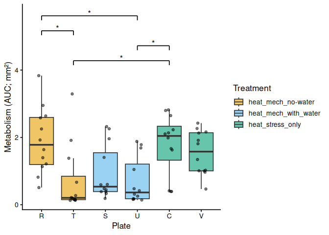<!-- -->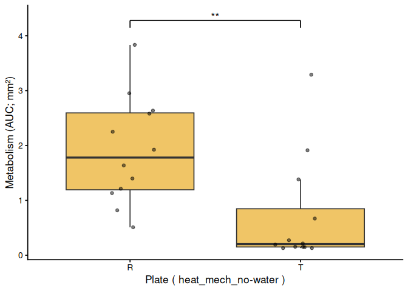<!-- -->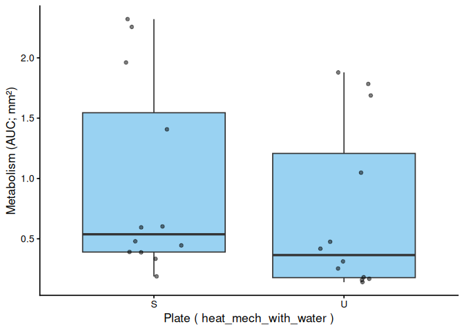<!-- -->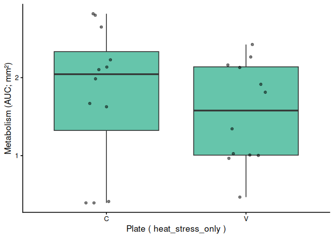<!-- -->

# 15 Save Output Data

``` r
write_csv(auc_all,      file.path(out_dir, "auc_all_metrics.csv"))
write_csv(auc_summary,  file.path(out_dir, "auc_summary.csv"))

if (nrow(metabolism_df) > 0)
  write_csv(metabolism_df,
            file.path(out_dir, "metabolism.csv"))

stats_compiled <- map_dfr(metrics_to_test, function(met) {
  bind_rows(
    stats_results[[met]]$pairs_full %>%
      mutate(comparison = "family:treatment"),
    stats_results[[met]]$pairs_family %>%
      mutate(comparison = "family"),
    stats_results[[met]]$pairs_trt %>%
      mutate(comparison = "treatment")
  ) %>% mutate(metric = met)
})

write_csv(stats_compiled,
          file.path(out_dir, "pairwise_stats.csv"))

write_csv(plate_summary, file.path(out_dir, "plate_auc_summary.csv"))

plate_pairwise <- map_dfr(metrics_to_test, function(met) {
  res <- plate_stats[[met]]
  if (is.null(res)) return(tibble())
  bind_rows(
    res$pairs_all %>% mutate(comparison = "all plates"),
    map_dfr(names(res$within), function(trt)
      res$within[[trt]]$pairs %>% mutate(comparison = paste("within", trt)))
  ) %>% mutate(metric = met)
})
write_csv(plate_pairwise, file.path(out_dir, "plate_pairwise_stats.csv"))

message("Output files written to: ", out_dir)
```
