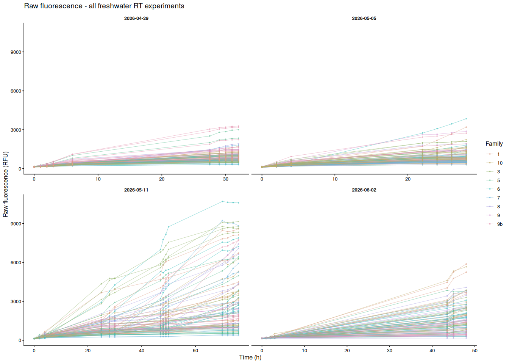
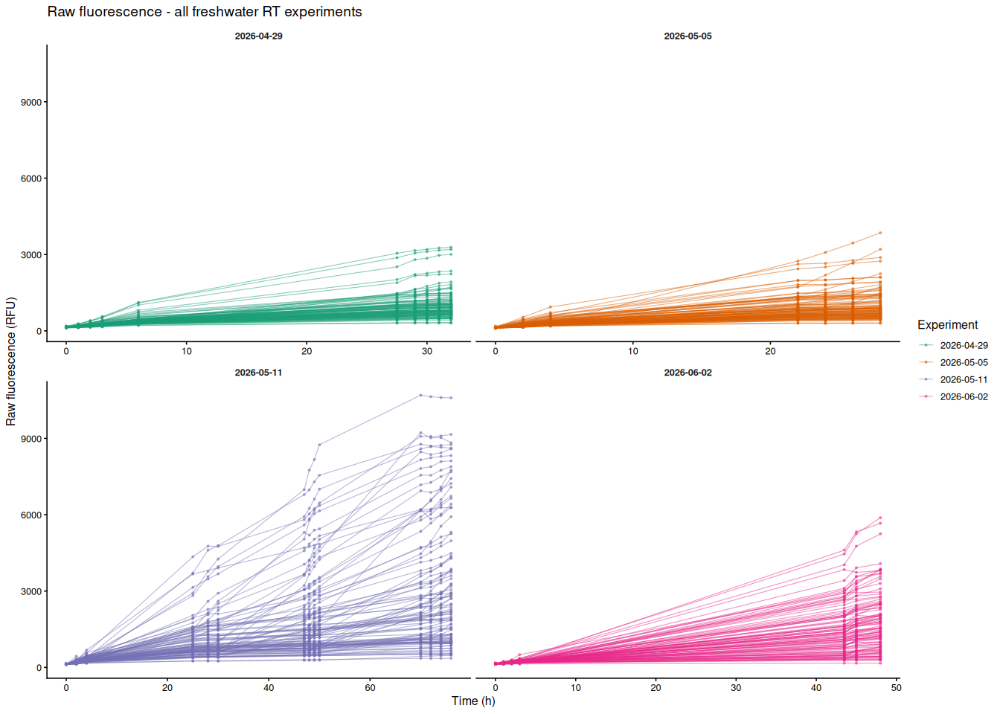
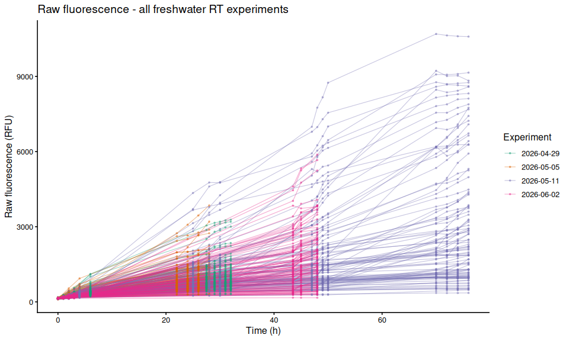

02.00-resazurin-raw-all-freshwater-RT-experiments
================
Sam White
2026-06-06

- [1 Background](#1-background)
- [2 Setup](#2-setup)
  - [2.1 Knitr options](#21-knitr-options)
  - [2.2 Load libraries](#22-load-libraries)
- [3 Helper Functions](#3-helper-functions)
- [4 Experiment Registry](#4-experiment-registry)
- [5 Load Data](#5-load-data)
  - [5.1 Plate fluorescence files](#51-plate-fluorescence-files)
  - [5.2 Layout files](#52-layout-files)
  - [5.3 Merge plate data with layout](#53-merge-plate-data-with-layout)
- [6 Filter Samples](#6-filter-samples)
  - [6.1 Write plot_df to CSV](#61-write-plot_df-to-csv)
- [7 Color Palettes](#7-color-palettes)
- [8 Raw Fluorescence Plots](#8-raw-fluorescence-plots)
  - [8.1 Colored by family](#81-colored-by-family)
  - [8.2 Colored by experiment](#82-colored-by-experiment)
  - [8.3 All individuals colored by experiment (single
    panel)](#83-all-individuals-colored-by-experiment-single-panel)
  - [8.4 Save figures](#84-save-figures)

# 1 Background

Combines raw fluorescence data from all freshwater room-temperature (RT)
resazurin assay experiments and produces a single per-individual
fluorescence trace plot across all runs. Individuals that share the same
`sample_ID.group` value in different experiments are **not** the same
animal; a globally-unique ID is constructed from the experiment date and
the within-experiment sample ID.

Blank wells and samples flagged `exclude_from_analysis = TRUE` in any
layout file are excluded from the plot.

| Experiment | Data directory              | Time range |
|:-----------|:----------------------------|:-----------|
| 2026-04-29 | 20260429-freshwater_stress  | T0 - T32 h |
| 2026-05-05 | 20260505-mgig-freshwater-RT | T0 - T28 h |
| 2026-05-11 | 20260511-mgig-freshwater-RT | T0 - T76 h |
| 2026-06-02 | 20260602-mgig-freshwater-RT | T0 - T48 h |

# 2 Setup

## 2.1 Knitr options

``` r
knitr::opts_chunk$set(
  echo = TRUE,         # Display code chunks
  eval = TRUE,        # Evaluate code chunks
  warning = FALSE,     # Hide warnings
  message = FALSE,     # Hide messages
  comment = "",         # Prevents appending '##' to beginning of lines in code output
  results = 'hold'     # Holds output so it's all printed together after code chunk
)
```

## 2.2 Load libraries

``` r
library(tidyverse)
library(colorspace)
library(rprojroot)
```

# 3 Helper Functions

``` r
normalize_well_id <- function(x) {
  x <- toupper(trimws(x))
  valid <- str_detect(x, "^[A-Z]+[0-9]+$")
  out <- rep(NA_character_, length(x))
  if (!any(valid)) return(out)
  m <- str_match(x[valid], "^([A-Z]+)([0-9]+)$")
  out[valid] <- paste0(m[, 2], as.integer(m[, 3]))
  out
}

parse_time_hr <- function(path) {
  hit <- str_match(basename(path), "(?i)-T([0-9]+(?:\\.[0-9]+)?)\\.txt$")
  as.numeric(hit[, 2])
}

parse_plate_id <- function(path) {
  hit <- str_match(basename(path),
    "(?i)^plate-([A-Za-z0-9-]+)-T[0-9]+(?:\\.[0-9]+)?\\.txt$")
  id <- hit[, 2]
  ifelse(is.na(id), "unknown", id)
}

extract_results_block <- function(lines) {
  results_idx <- which(trimws(lines) == "Results")
  if (length(results_idx) == 0) stop("No Results section found")
  idx <- results_idx[1]
  header_tokens <- str_split(lines[idx + 1], "\\t")[[1]] |> trimws()
  col_ids <- header_tokens[
    header_tokens != "" & str_detect(header_tokens, "^[0-9]+$")]
  j <- idx + 2
  data_lines <- character()
  while (j <= length(lines)) {
    line <- lines[j]
    if (trimws(line) == "") break
    if (!str_detect(line, "^[A-Za-z]\\t")) break
    data_lines <- c(data_lines, line)
    j <- j + 1
  }
  list(col_ids = col_ids, data_lines = data_lines)
}

parse_plate_export <- function(path) {
  lines <- readLines(path, warn = FALSE)
  res   <- extract_results_block(lines)
  map_dfr(res$data_lines, function(line) {
    tokens <- str_split(line, "\\t")[[1]] |> trimws()
    tokens <- tokens[tokens != ""]
    row_letter <- tokens[1]
    nums <- suppressWarnings(as.numeric(tokens[-1]))
    valid_idx <- which(!is.na(nums))
    if (length(valid_idx) == 0) return(tibble())
    vals <- nums[valid_idx]
    n <- min(length(vals), length(res$col_ids))
    tibble(
      row_id  = toupper(row_letter),
      col_id  = as.integer(res$col_ids[seq_len(n)]),
      well_id = normalize_well_id(
        paste0(toupper(row_letter), res$col_ids[seq_len(n)])),
      value   = vals[seq_len(n)]
    )
  }) %>%
    mutate(
      plate_id = str_to_lower(parse_plate_id(path)),
      time_hr  = parse_time_hr(path)
    )
}

standardize_names <- function(nms) {
  nms |>
    str_to_lower() |>
    str_replace_all("[^a-z0-9]+", "_") |>
    str_replace_all("_+", "_") |>
    str_replace("_$", "")
}

okabe_ito_7 <- c(
  "#E69F00", "#56B4E9", "#009E73", "#F0E442",
  "#0072B2", "#D55E00", "#CC79A7"
)

make_palette <- function(n) {
  if (n == 0L) return(character(0))
  if (n <= length(okabe_ito_7)) return(okabe_ito_7[seq_len(n)])
  qualitative_hcl(n, palette = "Dynamic")
}
```

# 4 Experiment Registry

``` r
proj_root <- find_rstudio_root_file()

experiments <- tibble(
  exp_id   = c("20260429", "20260505", "20260511", "20260602"),
  data_dir = c(
    "20260429-freshwater_stress",
    "20260505-mgig-freshwater-RT",
    "20260511-mgig-freshwater-RT",
    "20260602-mgig-freshwater-RT"
  )
)

str(experiments)
```

    tibble [4 × 2] (S3: tbl_df/tbl/data.frame)
     $ exp_id  : chr [1:4] "20260429" "20260505" "20260511" "20260602"
     $ data_dir: chr [1:4] "20260429-freshwater_stress" "20260505-mgig-freshwater-RT" "20260511-mgig-freshwater-RT" "20260602-mgig-freshwater-RT"

# 5 Load Data

## 5.1 Plate fluorescence files

``` r
plates_raw <- map_dfr(seq_len(nrow(experiments)), function(i) {
  dir   <- file.path(proj_root, "Resazurin", "data", experiments$data_dir[i])
  files <- list.files(
    dir,
    pattern    = "(?i)^plate-.*-T[0-9]+(?:\\.[0-9]+)?\\.txt$",
    full.names = TRUE
  )
  map_dfr(files, ~ tryCatch(parse_plate_export(.x),
                             error = function(e) tibble())) %>%
    mutate(exp_id = experiments$exp_id[i])
})

str(plates_raw)
```

    tibble [4,092 × 7] (S3: tbl_df/tbl/data.frame)
     $ row_id  : chr [1:4092] "A" "A" "A" "A" ...
     $ col_id  : int [1:4092] 1 2 3 4 1 2 3 4 1 2 ...
     $ well_id : chr [1:4092] "A1" "A2" "A3" "A4" ...
     $ value   : num [1:4092] 141 140 126 143 145 159 168 157 145 139 ...
     $ plate_id: chr [1:4092] "a" "a" "a" "a" ...
     $ time_hr : num [1:4092] 0 0 0 0 0 0 0 0 0 0 ...
     $ exp_id  : chr [1:4092] "20260429" "20260429" "20260429" "20260429" ...

## 5.2 Layout files

``` r
layouts_raw <- map_dfr(seq_len(nrow(experiments)), function(i) {
  path <- file.path(proj_root, "Resazurin", "data",
                    experiments$data_dir[i], "layout.csv")
  raw  <- read_csv(path, col_types = cols(.default = "c"),
                   show_col_types = FALSE)
  names(raw) <- standardize_names(names(raw))
  raw %>%
    mutate(
      plate_id = str_remove(str_to_lower(plate_id), "^plate-"),
      well_id  = normalize_well_id(plate_well),
      is_blank = toupper(trimws(is_blank)) %in%
                   c("TRUE", "T", "1", "YES", "Y"),
      exclude_from_analysis =
        if ("exclude_from_analysis" %in% names(raw))
          toupper(trimws(exclude_from_analysis)) %in%
            c("TRUE", "T", "1", "YES", "Y")
        else
          FALSE,
      family_id_group = str_to_lower(trimws(family_id_group)),
      exp_id = experiments$exp_id[i]
    ) %>%
    select(exp_id, plate_id, well_id,
           is_blank, exclude_from_analysis,
           family_id_group, sample_id_group)
})

str(layouts_raw)
```

    tibble [432 × 7] (S3: tbl_df/tbl/data.frame)
     $ exp_id               : chr [1:432] "20260429" "20260429" "20260429" "20260429" ...
     $ plate_id             : chr [1:432] "a" "a" "a" "a" ...
     $ well_id              : chr [1:432] "A1" "A2" "A3" "A4" ...
     $ is_blank             : logi [1:432] FALSE FALSE FALSE FALSE FALSE FALSE ...
     $ exclude_from_analysis: logi [1:432] FALSE FALSE FALSE FALSE FALSE FALSE ...
     $ family_id_group      : chr [1:432] "6" "6" "6" "6" ...
     $ sample_id_group      : chr [1:432] "1" "2" "3" "4" ...

## 5.3 Merge plate data with layout

``` r
all_dat <- plates_raw %>%
  left_join(layouts_raw,
            by = c("exp_id", "plate_id", "well_id")) %>%
  mutate(
    is_blank              = replace_na(is_blank, FALSE),
    exclude_from_analysis = replace_na(exclude_from_analysis, FALSE)
  )

str(all_dat)
```

    tibble [4,092 × 11] (S3: tbl_df/tbl/data.frame)
     $ row_id               : chr [1:4092] "A" "A" "A" "A" ...
     $ col_id               : int [1:4092] 1 2 3 4 1 2 3 4 1 2 ...
     $ well_id              : chr [1:4092] "A1" "A2" "A3" "A4" ...
     $ value                : num [1:4092] 141 140 126 143 145 159 168 157 145 139 ...
     $ plate_id             : chr [1:4092] "a" "a" "a" "a" ...
     $ time_hr              : num [1:4092] 0 0 0 0 0 0 0 0 0 0 ...
     $ exp_id               : chr [1:4092] "20260429" "20260429" "20260429" "20260429" ...
     $ is_blank             : logi [1:4092] FALSE FALSE FALSE FALSE FALSE FALSE ...
     $ exclude_from_analysis: logi [1:4092] FALSE FALSE FALSE FALSE FALSE FALSE ...
     $ family_id_group      : chr [1:4092] "6" "6" "6" "6" ...
     $ sample_id_group      : chr [1:4092] "1" "2" "3" "4" ...

# 6 Filter Samples

Remove blank wells, excluded samples, and any wells without layout
metadata. Create a globally-unique individual identifier so
same-numbered samples from different experiments are treated as distinct
animals.

``` r
plot_df <- all_dat %>%
  filter(
    !is_blank,
    !exclude_from_analysis,
    !is.na(family_id_group),
    !is.na(sample_id_group),
    is.finite(time_hr),
    is.finite(value)
  ) %>%
  mutate(
    unique_id  = paste(exp_id, sample_id_group, sep = "_"),
    family     = factor(family_id_group,
                        levels = sort(unique(family_id_group))),
    experiment = factor(exp_id)
  )

str(plot_df)
```

    tibble [3,752 × 14] (S3: tbl_df/tbl/data.frame)
     $ row_id               : chr [1:3752] "A" "A" "A" "A" ...
     $ col_id               : int [1:3752] 1 2 3 4 1 2 3 4 1 2 ...
     $ well_id              : chr [1:3752] "A1" "A2" "A3" "A4" ...
     $ value                : num [1:3752] 141 140 126 143 145 159 168 157 145 139 ...
     $ plate_id             : chr [1:3752] "a" "a" "a" "a" ...
     $ time_hr              : num [1:3752] 0 0 0 0 0 0 0 0 0 0 ...
     $ exp_id               : chr [1:3752] "20260429" "20260429" "20260429" "20260429" ...
     $ is_blank             : logi [1:3752] FALSE FALSE FALSE FALSE FALSE FALSE ...
     $ exclude_from_analysis: logi [1:3752] FALSE FALSE FALSE FALSE FALSE FALSE ...
     $ family_id_group      : chr [1:3752] "6" "6" "6" "6" ...
     $ sample_id_group      : chr [1:3752] "1" "2" "3" "4" ...
     $ unique_id            : chr [1:3752] "20260429_1" "20260429_2" "20260429_3" "20260429_4" ...
     $ family               : Factor w/ 9 levels "1","10","3","5",..: 5 5 5 5 5 5 5 5 5 5 ...
     $ experiment           : Factor w/ 4 levels "20260429","20260505",..: 1 1 1 1 1 1 1 1 1 1 ...

## 6.1 Write plot_df to CSV

``` r
out_dir <- file.path(proj_root, "Resazurin", "outputs",
                     "02.00-resazurin-raw-all-freshwater-RT-experiments")

dir.create(out_dir, recursive = TRUE, showWarnings = FALSE)

write_csv(plot_df, file.path(out_dir, "plot_df.csv"))

message("plot_df written to: ", out_dir)
```

# 7 Color Palettes

``` r
fam_palette <- setNames(
  make_palette(nlevels(plot_df$family)),
  levels(plot_df$family)
)

str(fam_palette)
```

     Named chr [1:9] "#DB9D85" "#BFAA67" "#93B66E" "#5CBD92" "#38BDBB" ...
     - attr(*, "names")= chr [1:9] "1" "10" "3" "5" ...

``` r
exp_palette <- setNames(
  c("#1B9E77", "#D95F02", "#7570B3", "#E7298A"),
  levels(plot_df$experiment)
)

str(exp_palette)
```

     Named chr [1:4] "#1B9E77" "#D95F02" "#7570B3" "#E7298A"
     - attr(*, "names")= chr [1:4] "20260429" "20260505" "20260511" "20260602"

# 8 Raw Fluorescence Plots

## 8.1 Colored by family

Each line is one individual oyster; color indicates USDA family. Panels
separate experiments (x-axes are free since time ranges differ).

``` r
p_by_family <- ggplot(
    plot_df,
    aes(x      = time_hr,
        y      = value,
        group  = unique_id,
        colour = family)
  ) +
  geom_line(alpha = 0.5, linewidth = 0.4) +
  geom_point(size = 0.7, alpha = 0.5) +
  facet_wrap(
    ~ exp_id,
    scales   = "free_x",
    labeller = labeller(exp_id = c(
      "20260429" = "2026-04-29",
      "20260505" = "2026-05-05",
      "20260511" = "2026-05-11",
      "20260602" = "2026-06-02"
    ))
  ) +
  scale_colour_manual(values = fam_palette, name = "Family") +
  labs(
    title = "Raw fluorescence - all freshwater RT experiments",
    x     = "Time (h)",
    y     = "Raw fluorescence (RFU)"
  ) +
  theme_classic(base_size = 12) +
  theme(
    strip.background = element_blank(),
    strip.text       = element_text(face = "bold"),
    legend.position  = "right"
  )

p_by_family
```

<!-- -->

## 8.2 Colored by experiment

Each line is one individual oyster; color indicates experiment date.
Panels separate experiments (x-axes are free since time ranges differ).

``` r
p_by_experiment <- ggplot(
    plot_df,
    aes(x      = time_hr,
        y      = value,
        group  = unique_id,
        colour = experiment)
  ) +
  geom_line(alpha = 0.5, linewidth = 0.4) +
  geom_point(size = 0.7, alpha = 0.5) +
  facet_wrap(
    ~ exp_id,
    scales   = "free_x",
    labeller = labeller(exp_id = c(
      "20260429" = "2026-04-29",
      "20260505" = "2026-05-05",
      "20260511" = "2026-05-11",
      "20260602" = "2026-06-02"
    ))
  ) +
  scale_colour_manual(
    values = exp_palette,
    name   = "Experiment",
    labels = c(
      "20260429" = "2026-04-29",
      "20260505" = "2026-05-05",
      "20260511" = "2026-05-11",
      "20260602" = "2026-06-02"
    )
  ) +
  labs(
    title = "Raw fluorescence - all freshwater RT experiments",
    x     = "Time (h)",
    y     = "Raw fluorescence (RFU)"
  ) +
  theme_classic(base_size = 12) +
  theme(
    strip.background = element_blank(),
    strip.text       = element_text(face = "bold"),
    legend.position  = "right"
  )

p_by_experiment
```

<!-- -->

## 8.3 All individuals colored by experiment (single panel)

Each line is one individual oyster; color indicates experiment date.

``` r
p_all_by_experiment <- ggplot(
    plot_df,
    aes(x      = time_hr,
        y      = value,
        group  = unique_id,
        colour = experiment)
  ) +
  geom_line(alpha = 0.4, linewidth = 0.4) +
  geom_point(size = 0.6, alpha = 0.4) +
  scale_colour_manual(
    values = exp_palette,
    name   = "Experiment",
    labels = c(
      "20260429" = "2026-04-29",
      "20260505" = "2026-05-05",
      "20260511" = "2026-05-11",
      "20260602" = "2026-06-02"
    )
  ) +
  labs(
    title = "Raw fluorescence - all freshwater RT experiments",
    x     = "Time (h)",
    y     = "Raw fluorescence (RFU)"
  ) +
  theme_classic(base_size = 12) +
  theme(legend.position = "right")

p_all_by_experiment
```

<!-- -->

## 8.4 Save figures

``` r
out_dir <- file.path(proj_root, "Resazurin", "outputs",
                     "02.00-resazurin-raw-all-freshwater-RT-experiments",
                     "figures")

dir.create(out_dir, recursive = TRUE, showWarnings = FALSE)

ggsave(file.path(out_dir, "raw_fluor_all_freshwater_RT_by_family.png"),
       p_by_family, width = 14, height = 10)

ggsave(file.path(out_dir, "raw_fluor_all_freshwater_RT_by_experiment.png"),
       p_by_experiment, width = 14, height = 10)

ggsave(
  file.path(out_dir, "raw_fluor_all_freshwater_RT_single_by_experiment.png"),
  p_all_by_experiment, width = 10, height = 6
)

message("Figures saved to: ", out_dir)
```
