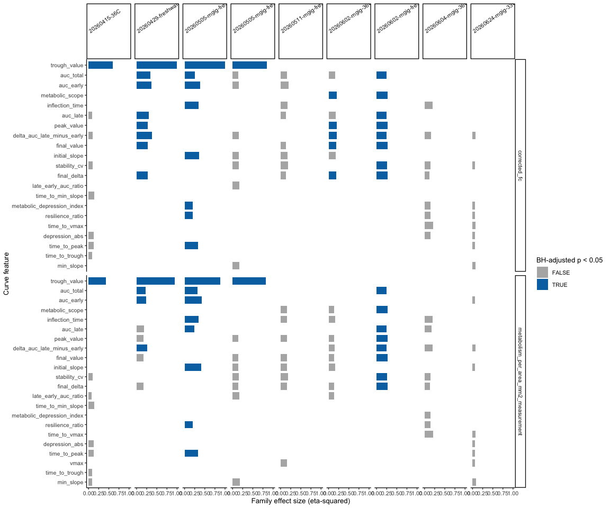
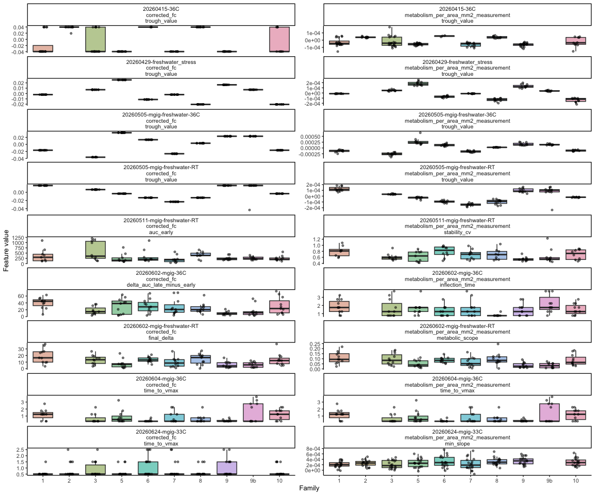
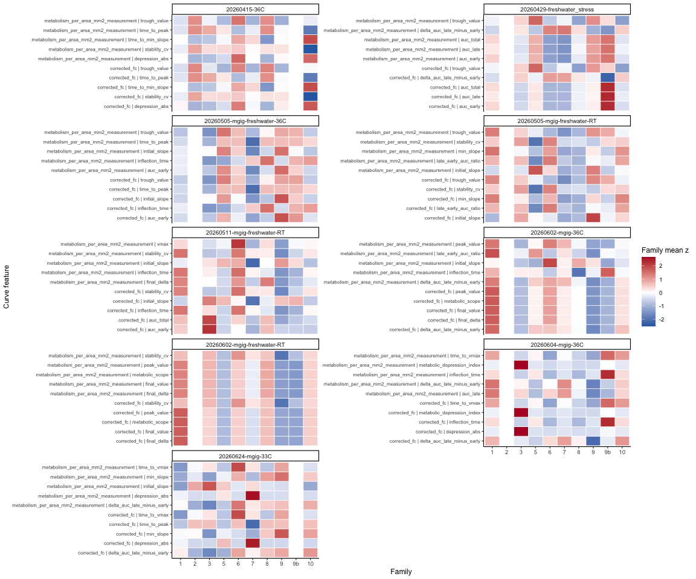
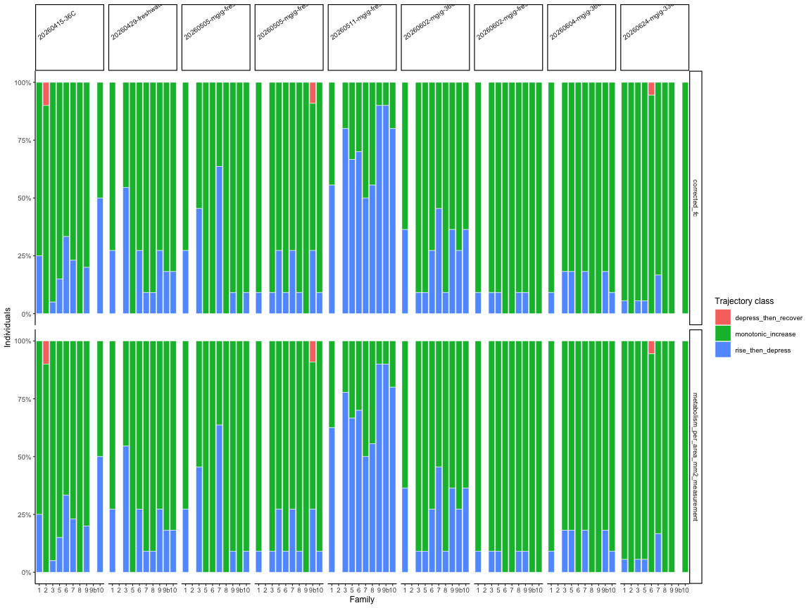

03.5-resazurin-curve-features-all-experiments
================
Sam White
2026-07-04

-   [1 Background](#1-background)
    -   [1.1 Expected inputs](#11-expected-inputs)
    -   [1.2 Expected outputs](#12-expected-outputs)
-   [2 Setup](#2-setup)
-   [3 Helper Functions](#3-helper-functions)
-   [4 Load Experiment Outputs](#4-load-experiment-outputs)
-   [5 Curve Feature Extraction](#5-curve-feature-extraction)
-   [6 Family Summaries](#6-family-summaries)
-   [7 Rank Family-Discriminating
    Features](#7-rank-family-discriminating-features)
-   [8 Most Distinguishing Aspects](#8-most-distinguishing-aspects)
    -   [8.1 Best curve feature per experiment and
        metric](#81-best-curve-feature-per-experiment-and-metric)
    -   [8.2 Top five curve features per experiment and
        metric](#82-top-five-curve-features-per-experiment-and-metric)
-   [9 Save Outputs](#9-save-outputs)

# 1 Background

This notebook applies the curve-feature comparison approach across all
resazurin experiment-level analyses in `Resazurin/code`. It uses the
existing `metabolism.csv` outputs produced by the `01.00-resazurin-*`
notebooks, so plate parsing and blank correction remain defined by each
original analysis.

## 1.1 Expected inputs

| Path                                                 | Description                                                                |
|:-----------------------------------------------------|:---------------------------------------------------------------------------|
| `Resazurin/code/01.00-resazurin-*.Rmd`               | Experiment-level resazurin notebooks                                       |
| `Resazurin/outputs/01.00-resazurin-*/metabolism.csv` | Per-well per-timepoint blank-corrected and size-normalized metabolism data |

## 1.2 Expected outputs

All outputs are written to
`Resazurin/outputs/03.5-resazurin-curve-features-all-experiments/`.

| File                                   | Description                                                           |
|:---------------------------------------|:----------------------------------------------------------------------|
| `curve_features.csv`                   | Per-individual curve traits for every included experiment             |
| `curve_feature_family_summary.csv`     | Family-level summaries for each curve trait                           |
| `curve_feature_family_stats.csv`       | Per-experiment feature ranking by family separation                   |
| `curve_feature_pairwise_stats.csv`     | Tukey-adjusted family comparisons for top-ranked curve traits         |
| `curve_feature_trajectory_classes.csv` | Trajectory-class counts and proportions by experiment and family      |
| `included_experiments.csv`             | Experiment output folders included in the analysis                    |
| `figures/`                             | Cross-experiment ranking, heatmap, best-feature, and trajectory plots |

# 2 Setup

``` r
knitr::opts_chunk$set(
  echo = TRUE,
  eval = TRUE,
  warning = FALSE,
  message = FALSE,
  comment = "",
  results = "hold"
)
```

``` r
library(tidyverse)
library(colorspace)
```

# 3 Helper Functions

``` r
safe_divide <- function(num, den) {
  if_else(is.finite(num) & is.finite(den) & abs(den) > .Machine$double.eps,
          num / den, NA_real_)
}

trapezoid_auc <- function(time_hr, value) {
  ok <- is.finite(time_hr) & is.finite(value)
  t <- time_hr[ok]
  v <- value[ok]
  if (length(t) < 2) return(NA_real_)
  ord <- order(t)
  t <- t[ord]
  v <- v[ord]
  sum(diff(t) * (head(v, -1) + tail(v, -1)) / 2)
}

segment_auc <- function(time_hr, value) {
  ok <- is.finite(time_hr) & is.finite(value)
  t <- time_hr[ok]
  v <- value[ok]
  if (length(t) < 2) {
    return(tibble(t_start = numeric(), t_end = numeric(),
                  t_mid = numeric(), auc = numeric()))
  }
  ord <- order(t)
  t <- t[ord]
  v <- v[ord]
  tibble(
    t_start = head(t, -1),
    t_end   = tail(t, -1),
    t_mid   = (head(t, -1) + tail(t, -1)) / 2,
    auc     = diff(t) * (head(v, -1) + tail(v, -1)) / 2
  )
}

classify_trajectory <- function(slopes, slope_tol = 1e-12) {
  if (length(slopes) == 0 || all(!is.finite(slopes))) return(NA_character_)
  s <- slopes[is.finite(slopes)]
  signs <- case_when(
    s >  slope_tol ~  1L,
    s < -slope_tol ~ -1L,
    TRUE           ~  0L
  )
  nonzero <- signs[signs != 0L]
  if (length(nonzero) == 0) return("stable")
  if (all(nonzero > 0)) return("monotonic_increase")
  if (all(nonzero < 0)) return("monotonic_decrease")
  if (any(nonzero > 0) && any(nonzero < 0)) {
    first_neg <- which(nonzero < 0)[1]
    first_pos <- which(nonzero > 0)[1]
    if (first_pos < first_neg) return("rise_then_depress")
    if (first_neg < first_pos) return("depress_then_recover")
  }
  "complex"
}

extract_curve_features_one <- function(df, value_col, metric_label) {
  df <- df %>%
    filter(is.finite(time_hr), is.finite(.data[[value_col]])) %>%
    arrange(time_hr)

  if (nrow(df) < 2) return(tibble())

  t <- df$time_hr
  v <- df[[value_col]]
  dt <- diff(t)
  dv <- diff(v)
  valid_slope <- is.finite(dt) & dt > 0 & is.finite(dv)
  slopes <- dv[valid_slope] / dt[valid_slope]
  slope_midpoints <- (head(t, -1) + tail(t, -1)) / 2
  slope_midpoints <- slope_midpoints[valid_slope]
  seg_auc <- segment_auc(t, v)
  split_time <- median(seg_auc$t_mid, na.rm = TRUE)
  early_auc <- seg_auc %>%
    filter(t_mid <= split_time) %>%
    summarise(x = sum(auc, na.rm = TRUE), .groups = "drop") %>%
    pull(x)
  late_auc <- seg_auc %>%
    filter(t_mid > split_time) %>%
    summarise(x = sum(auc, na.rm = TRUE), .groups = "drop") %>%
    pull(x)

  if (length(early_auc) == 0) early_auc <- NA_real_
  if (length(late_auc) == 0) late_auc <- NA_real_

  baseline_value <- v[1]
  final_value <- v[length(v)]
  peak_idx <- which.max(v)
  trough_idx <- which.min(v)
  peak_value <- v[peak_idx]
  trough_value <- v[trough_idx]
  peak_after_baseline <- peak_value - baseline_value
  depression_abs <- if (peak_idx < length(v)) {
    max(peak_value - final_value, 0, na.rm = TRUE)
  } else {
    0
  }

  vmax_idx <- if (length(slopes) > 0) which.max(slopes) else NA_integer_
  min_slope_idx <- if (length(slopes) > 0) which.min(slopes) else NA_integer_
  curvature <- diff(slopes)
  inflection_idx <- if (length(curvature) > 0) {
    which.max(abs(curvature)) + 1L
  } else {
    NA_integer_
  }

  tibble(
    value_metric = metric_label,
    baseline_value = baseline_value,
    final_value = final_value,
    peak_value = peak_value,
    trough_value = trough_value,
    time_to_peak = t[peak_idx],
    time_to_trough = t[trough_idx],
    auc_total = trapezoid_auc(t, v),
    auc_early = early_auc,
    auc_late = late_auc,
    delta_auc_late_minus_early = late_auc - early_auc,
    late_early_auc_ratio = safe_divide(late_auc, early_auc),
    initial_slope = slopes[1],
    vmax = if (length(slopes) > 0) max(slopes, na.rm = TRUE) else NA_real_,
    time_to_vmax = if (!is.na(vmax_idx)) slope_midpoints[vmax_idx] else NA_real_,
    min_slope = if (length(slopes) > 0) min(slopes, na.rm = TRUE) else NA_real_,
    time_to_min_slope = if (!is.na(min_slope_idx)) {
      slope_midpoints[min_slope_idx]
    } else {
      NA_real_
    },
    inflection_time = if (!is.na(inflection_idx)) {
      slope_midpoints[inflection_idx]
    } else {
      NA_real_
    },
    metabolic_scope = peak_after_baseline,
    final_delta = final_value - baseline_value,
    depression_abs = depression_abs,
    metabolic_depression_index = safe_divide(depression_abs,
                                             abs(peak_after_baseline)),
    resilience_ratio = safe_divide(final_value, peak_value),
    stability_cv = safe_divide(sd(v, na.rm = TRUE), abs(mean(v, na.rm = TRUE))),
    trajectory_class = classify_trajectory(slopes),
    n_timepoints = nrow(df)
  )
}

compute_curve_features <- function(df, value_col, metric_label) {
  id_vars <- intersect(
    c("experiment", "trace_id", "family_id_group", "treatment_group",
      "round_group", "cup_id_group", "sample_id_group"),
    names(df)
  )

  df %>%
    filter(!is.na(family_id_group), is.finite(.data[[value_col]])) %>%
    group_by(across(all_of(id_vars))) %>%
    group_modify(~ extract_curve_features_one(.x, value_col, metric_label)) %>%
    ungroup()
}

tidy_tukey <- function(model, term) {
  tk <- tryCatch(TukeyHSD(aov(model), which = term)[[term]],
                 error = function(e) NULL)
  if (is.null(tk)) return(tibble())
  as_tibble(tk, rownames = "contrast") %>%
    rename(
      estimate = diff,
      p.value = `p adj`
    ) %>%
    mutate(SE = NA_real_, df = NA_real_, t.ratio = NA_real_) %>%
    select(contrast, estimate, SE, df, t.ratio, p.value)
}

run_feature_family_stats <- function(df) {
  df <- df %>%
    filter(is.finite(feature_value), !is.na(family_id_group)) %>%
    mutate(family = factor(family_id_group))

  if (nrow(df) < 3 || n_distinct(df$family) < 2) return(tibble())

  model <- lm(feature_value ~ family, data = df)
  aov_tab <- anova(model)

  ss_family <- aov_tab["family", "Sum Sq"]
  df_family <- aov_tab["family", "Df"]
  ms_error <- aov_tab["Residuals", "Mean Sq"]
  ss_total <- sum(aov_tab$`Sum Sq`, na.rm = TRUE)
  eta_sq <- ss_family / ss_total
  omega_sq <- (ss_family - df_family * ms_error) / (ss_total + ms_error)

  fam_means <- df %>%
    group_by(family) %>%
    summarise(mean = mean(feature_value), .groups = "drop")

  pair_grid <- tidyr::crossing(fam1 = fam_means$family,
                               fam2 = fam_means$family) %>%
    filter(as.character(fam1) < as.character(fam2)) %>%
    left_join(fam_means, by = c("fam1" = "family")) %>%
    rename(mean1 = mean) %>%
    left_join(fam_means, by = c("fam2" = "family")) %>%
    rename(mean2 = mean) %>%
    mutate(abs_d = abs(mean1 - mean2) / sqrt(ms_error))

  kw <- kruskal.test(feature_value ~ family, data = df)

  tibble(
    n = nrow(df),
    n_family = n_distinct(df$family),
    f_statistic = aov_tab["family", "F value"],
    p_value = aov_tab["family", "Pr(>F)"],
    kruskal_p_value = kw$p.value,
    eta_sq = eta_sq,
    omega_sq = max(omega_sq, 0, na.rm = TRUE),
    max_abs_pairwise_d = max(pair_grid$abs_d, na.rm = TRUE)
  )
}

run_feature_pairwise <- function(df) {
  df <- df %>%
    filter(is.finite(feature_value), !is.na(family_id_group)) %>%
    mutate(family = factor(family_id_group))

  if (nrow(df) < 3 || n_distinct(df$family) < 2) return(tibble())

  model <- lm(feature_value ~ family, data = df)
  tidy_tukey(model, "family")
}

make_palette <- function(n) {
  okabe_ito_7 <- c(
    "#E69F00", "#56B4E9", "#009E73", "#F0E442",
    "#0072B2", "#D55E00", "#CC79A7"
  )
  if (n == 0L) return(character(0))
  if (n <= length(okabe_ito_7)) return(okabe_ito_7[seq_len(n)])
  colorspace::qualitative_hcl(n, palette = "Dynamic")
}
```

# 4 Load Experiment Outputs

``` r
proj_root <- rprojroot::find_rstudio_root_file()
code_dir <- file.path(proj_root, "Resazurin", "code")
outputs_dir <- file.path(proj_root, "Resazurin", "outputs")
out_dir <- file.path(
  outputs_dir,
  "03.5-resazurin-curve-features-all-experiments"
)
fig_dir <- file.path(out_dir, "figures")

dir.create(out_dir, recursive = TRUE, showWarnings = FALSE)
dir.create(fig_dir, recursive = TRUE, showWarnings = FALSE)

included_experiments <- tibble(
  rmd_path = list.files(
    code_dir,
    pattern = "^01\\.00-resazurin-.*\\.Rmd$",
    full.names = TRUE
  )
) %>%
  mutate(
    experiment = tools::file_path_sans_ext(basename(rmd_path)),
    output_dir = file.path(outputs_dir, experiment),
    metabolism_path = file.path(output_dir, "metabolism.csv")
  ) %>%
  filter(file.exists(metabolism_path)) %>%
  arrange(experiment)

included_experiments
```

    # A tibble: 9 x 4
      rmd_path                                 experiment output_dir metabolism_path
      <chr>                                    <chr>      <chr>      <chr>          
    1 /Users/sr320/Documents/GitHub/sormi-ass~ 01.00-res~ /Users/sr~ /Users/sr320/D~
    2 /Users/sr320/Documents/GitHub/sormi-ass~ 01.00-res~ /Users/sr~ /Users/sr320/D~
    3 /Users/sr320/Documents/GitHub/sormi-ass~ 01.00-res~ /Users/sr~ /Users/sr320/D~
    4 /Users/sr320/Documents/GitHub/sormi-ass~ 01.00-res~ /Users/sr~ /Users/sr320/D~
    5 /Users/sr320/Documents/GitHub/sormi-ass~ 01.00-res~ /Users/sr~ /Users/sr320/D~
    6 /Users/sr320/Documents/GitHub/sormi-ass~ 01.00-res~ /Users/sr~ /Users/sr320/D~
    7 /Users/sr320/Documents/GitHub/sormi-ass~ 01.00-res~ /Users/sr~ /Users/sr320/D~
    8 /Users/sr320/Documents/GitHub/sormi-ass~ 01.00-res~ /Users/sr~ /Users/sr320/D~
    9 /Users/sr320/Documents/GitHub/sormi-ass~ 01.00-res~ /Users/sr~ /Users/sr320/D~

``` r
metabolism_all <- included_experiments %>%
  mutate(data = map2(metabolism_path, experiment, function(path, experiment_id) {
    read_csv(path, col_types = cols(.default = "c"),
             show_col_types = FALSE) %>%
      mutate(
        experiment = experiment_id,
        family_id_group = as.character(family_id_group),
        treatment_group = as.character(treatment_group),
        across(
          c(
            any_of(c(
            "value", "time_hr", "value_t0", "fold_change",
            "mean_blank_rfu", "mean_blank_fc", "corrected_fc"
            )),
            matches("_measurement$"),
            matches("^metabolism_per_")
          ),
          ~ suppressWarnings(as.numeric(.x))
        ),
        trace_id = if_else(
          !is.na(trace_id) & trimws(as.character(trace_id)) != "",
          as.character(trace_id),
          paste(plate_id, well_id, sep = "_")
        )
      )
  })) %>%
  select(data) %>%
  unnest(data)

metabolism_all <- metabolism_all %>%
  mutate(
    experiment_label = str_remove(experiment, "^01\\.00-resazurin-"),
    family_id_group = str_to_lower(trimws(family_id_group)),
    treatment_group = str_to_lower(trimws(treatment_group))
  )

experiment_overview <- metabolism_all %>%
  group_by(experiment, experiment_label) %>%
  summarise(
    n_rows = n(),
    n_individuals = n_distinct(trace_id),
    n_families = n_distinct(family_id_group, na.rm = TRUE),
    n_treatments = n_distinct(treatment_group, na.rm = TRUE),
    min_time_hr = min(time_hr, na.rm = TRUE),
    max_time_hr = max(time_hr, na.rm = TRUE),
    n_timepoints = n_distinct(time_hr),
    .groups = "drop"
  )

print(experiment_overview)
```

    # A tibble: 9 x 9
      experiment       experiment_label n_rows n_individuals n_families n_treatments
      <chr>            <chr>             <int>         <int>      <int>        <int>
    1 01.00-resazurin~ 20260415-36C        879           376          9            0
    2 01.00-resazurin~ 20260429-freshw~    990            99          9            0
    3 01.00-resazurin~ 20260505-mgig-f~    495            99          9            0
    4 01.00-resazurin~ 20260505-mgig-f~    693            99          9            0
    5 01.00-resazurin~ 20260511-mgig-f~   1376            99          9            0
    6 01.00-resazurin~ 20260602-mgig-3~    891            99          9            0
    7 01.00-resazurin~ 20260602-mgig-f~    693            99          9            0
    8 01.00-resazurin~ 20260604-mgig-3~    869            99          9            0
    9 01.00-resazurin~ 20260624-mgig-3~   1080           270          9            0
    # i 3 more variables: min_time_hr <dbl>, max_time_hr <dbl>, n_timepoints <int>

# 5 Curve Feature Extraction

``` r
value_metric_cols <- c(
  corrected_fc = "corrected_fc",
  setNames(
    names(metabolism_all)[str_detect(names(metabolism_all),
                                     "^metabolism_per_")],
    names(metabolism_all)[str_detect(names(metabolism_all),
                                     "^metabolism_per_")]
  )
)
value_metric_cols <- value_metric_cols[value_metric_cols %in% names(metabolism_all)]

curve_features <- imap_dfr(
  value_metric_cols,
  ~ compute_curve_features(metabolism_all, .x, .y)
)

numeric_feature_cols <- curve_features %>%
  select(where(is.numeric)) %>%
  select(-any_of("n_timepoints")) %>%
  names()

curve_feature_long <- curve_features %>%
  pivot_longer(
    cols = all_of(numeric_feature_cols),
    names_to = "feature",
    values_to = "feature_value"
  ) %>%
  filter(is.finite(feature_value))

trajectory_features <- curve_features %>%
  count(experiment, value_metric, family_id_group, trajectory_class, name = "n") %>%
  group_by(experiment, value_metric, family_id_group) %>%
  mutate(prop = n / sum(n)) %>%
  ungroup()

str(curve_features)
```

    tibble [1,936 x 33] (S3: tbl_df/tbl/data.frame)
     $ experiment                : chr [1:1936] "01.00-resazurin-20260415-36C" "01.00-resazurin-20260415-36C" "01.00-resazurin-20260415-36C" "01.00-resazurin-20260415-36C" ...
     $ trace_id                  : chr [1:1936] "1" "100" "101" "102" ...
     $ family_id_group           : chr [1:1936] "9" "7" "3" "1" ...
     $ treatment_group           : chr [1:1936] NA NA NA NA ...
     $ round_group               : chr [1:1936] NA NA NA NA ...
     $ cup_id_group              : chr [1:1936] NA NA NA NA ...
     $ sample_id_group           : chr [1:1936] "1" "100" "101" "102" ...
     $ value_metric              : chr [1:1936] "corrected_fc" "corrected_fc" "corrected_fc" "corrected_fc" ...
     $ baseline_value            : num [1:1936] -0.0396 -0.0396 0.0396 -0.0396 -0.0396 ...
     $ final_value               : num [1:1936] 1.31 20.6 15.98 5.99 12.57 ...
     $ peak_value                : num [1:1936] 1.31 20.6 15.98 5.99 12.57 ...
     $ trough_value              : num [1:1936] -0.0396 -0.0396 0.0396 -0.0396 -0.0396 ...
     $ time_to_peak              : num [1:1936] 7 7 7 7 7 7 7 7 7 5 ...
     $ time_to_trough            : num [1:1936] 1 1 1 1 1 1 1 1 1 1 ...
     $ auc_total                 : num [1:1936] 3.23 58.82 44.97 15.84 41.08 ...
     $ auc_early                 : num [1:1936] 0.331 7.445 4.756 2.114 2.733 ...
     $ auc_late                  : num [1:1936] 2.9 51.4 40.2 13.7 38.3 ...
     $ delta_auc_late_minus_early: num [1:1936] 2.57 43.93 35.46 11.61 35.61 ...
     $ late_early_auc_ratio      : num [1:1936] 8.76 6.9 8.46 6.49 14.03 ...
     $ initial_slope             : num [1:1936] 0.183 3.524 2.111 1.103 0.228 ...
     $ vmax                      : num [1:1936] 0.363 4.596 3.226 1.596 4.941 ...
     $ time_to_vmax              : num [1:1936] 6 6 6 6 2.5 2.5 2.5 2.5 2.5 2.5 ...
     $ min_slope                 : num [1:1936] 0.0857 1.7235 2.1108 0.3283 0.2278 ...
     $ time_to_min_slope         : num [1:1936] 4 4 1.5 4 1.5 4 1.5 4 6 6 ...
     $ inflection_time           : num [1:1936] 6 6 6 6 2.5 4 2.5 4 4 6 ...
     $ metabolic_scope           : num [1:1936] 1.35 20.64 15.94 6.03 12.61 ...
     $ final_delta               : num [1:1936] 1.35 20.64 15.94 6.03 12.61 ...
     $ depression_abs            : num [1:1936] 0 0 0 0 0 ...
     $ metabolic_depression_index: num [1:1936] 0 0 0 0 0 ...
     $ resilience_ratio          : num [1:1936] 1 1 1 1 1 ...
     $ stability_cv              : num [1:1936] 1.081 0.916 0.966 0.955 1.02 ...
     $ trajectory_class          : chr [1:1936] "monotonic_increase" "monotonic_increase" "monotonic_increase" "monotonic_increase" ...
     $ n_timepoints              : int [1:1936] 5 5 5 5 5 5 5 5 5 5 ...

# 6 Family Summaries

``` r
curve_feature_family_summary <- curve_feature_long %>%
  group_by(experiment, value_metric, feature, family_id_group) %>%
  summarise(
    n = n(),
    mean = mean(feature_value, na.rm = TRUE),
    sd = sd(feature_value, na.rm = TRUE),
    se = sd / sqrt(n),
    median = median(feature_value, na.rm = TRUE),
    iqr = IQR(feature_value, na.rm = TRUE),
    .groups = "drop"
  )

print(curve_feature_family_summary)
```

    # A tibble: 3,726 x 10
       experiment       value_metric feature family_id_group     n  mean    sd    se
       <chr>            <chr>        <chr>   <chr>           <int> <dbl> <dbl> <dbl>
     1 01.00-resazurin~ corrected_fc auc_ea~ 1                  20  2.54  2.23 0.499
     2 01.00-resazurin~ corrected_fc auc_ea~ 10                 10  3.42  3.62 1.14 
     3 01.00-resazurin~ corrected_fc auc_ea~ 2                  10  2.90  2.98 0.944
     4 01.00-resazurin~ corrected_fc auc_ea~ 3                  20  2.63  2.15 0.480
     5 01.00-resazurin~ corrected_fc auc_ea~ 5                  20  2.70  2.63 0.587
     6 01.00-resazurin~ corrected_fc auc_ea~ 6                   3  1.30  1.11 0.639
     7 01.00-resazurin~ corrected_fc auc_ea~ 7                  13  3.89  4.60 1.27 
     8 01.00-resazurin~ corrected_fc auc_ea~ 8                  10  4.28  4.20 1.33 
     9 01.00-resazurin~ corrected_fc auc_ea~ 9                  20  3.15  6.63 1.48 
    10 01.00-resazurin~ corrected_fc auc_la~ 1                  20 22.7  17.8  3.97 
    # i 3,716 more rows
    # i 2 more variables: median <dbl>, iqr <dbl>

# 7 Rank Family-Discriminating Features

For each experiment and numeric feature, the model
`feature_value ~ family_id_group` is fit with individual oysters as
observational units. Features are ranked by a combined score favoring
stronger family effect size (`eta_sq`) and lower BH-adjusted p-value.
This is intended as a screening/ranking analysis rather than a single
confirmatory model. `baseline_value` is retained in the full feature
table but excluded from the ranking because the goal here is to compare
curve shape, capacity, responsiveness, and depression-like behavior
rather than the normalized starting reference.

``` r
curve_feature_family_stats <- curve_feature_long %>%
  filter(feature != "baseline_value") %>%
  group_by(experiment, value_metric, feature) %>%
  group_modify(~ run_feature_family_stats(.x)) %>%
  ungroup() %>%
  group_by(experiment, value_metric) %>%
  mutate(
    p_adj_bh = p.adjust(p_value, method = "BH"),
    rank_within_metric = min_rank(p_adj_bh),
    rank_score = dense_rank(desc(eta_sq)) + dense_rank(p_adj_bh)
  ) %>%
  ungroup() %>%
  arrange(experiment, p_adj_bh, desc(eta_sq), desc(max_abs_pairwise_d))

best_curve_features <- curve_feature_family_stats %>%
  group_by(experiment, value_metric) %>%
  slice_min(order_by = rank_score, n = 1, with_ties = FALSE) %>%
  ungroup() %>%
  arrange(experiment, value_metric)

top_curve_features <- curve_feature_family_stats %>%
  group_by(experiment, value_metric) %>%
  slice_min(order_by = rank_score, n = 5, with_ties = FALSE) %>%
  ungroup() %>%
  arrange(experiment, value_metric, rank_score)

print(best_curve_features)
```

    # A tibble: 18 x 14
       experiment           value_metric feature     n n_family f_statistic  p_value
       <chr>                <chr>        <chr>   <int>    <int>       <dbl>    <dbl>
     1 01.00-resazurin-202~ corrected_fc trough~   126        9     2.22e 1 2.68e-20
     2 01.00-resazurin-202~ metabolism_~ trough~   126        9     1.11e 1 1.48e-11
     3 01.00-resazurin-202~ corrected_fc trough~    99        9     6.66e30 0       
     4 01.00-resazurin-202~ metabolism_~ trough~    99        9     2.07e 2 1.77e-54
     5 01.00-resazurin-202~ corrected_fc trough~    99        9     1.11e31 0       
     6 01.00-resazurin-202~ metabolism_~ trough~    99        9     8.92e 1 2.03e-39
     7 01.00-resazurin-202~ corrected_fc trough~    99        9     6.13e 1 3.88e-33
     8 01.00-resazurin-202~ metabolism_~ trough~    99        9     5.09e 1 3.70e-30
     9 01.00-resazurin-202~ corrected_fc auc_ea~    87        9     2.39e 0 2.33e- 2
    10 01.00-resazurin-202~ metabolism_~ stabil~    85        9     2.24e 0 3.36e- 2
    11 01.00-resazurin-202~ corrected_fc delta_~    99        9     2.90e 0 6.32e- 3
    12 01.00-resazurin-202~ metabolism_~ inflec~    99        9     2.29e 0 2.82e- 2
    13 01.00-resazurin-202~ corrected_fc final_~    99        9     4.20e 0 2.61e- 4
    14 01.00-resazurin-202~ metabolism_~ metabo~    99        9     4.18e 0 2.75e- 4
    15 01.00-resazurin-202~ corrected_fc time_t~    99        9     2.93e 0 5.94e- 3
    16 01.00-resazurin-202~ metabolism_~ time_t~    99        9     2.93e 0 5.94e- 3
    17 01.00-resazurin-202~ corrected_fc time_t~   162        9     1.60e 0 1.28e- 1
    18 01.00-resazurin-202~ metabolism_~ min_sl~   162        9     1.92e 0 6.10e- 2
    # i 7 more variables: kruskal_p_value <dbl>, eta_sq <dbl>, omega_sq <dbl>,
    #   max_abs_pairwise_d <dbl>, p_adj_bh <dbl>, rank_within_metric <int>,
    #   rank_score <int>

``` r
curve_feature_pairwise_stats <- curve_feature_long %>%
  semi_join(top_curve_features, by = c("experiment", "value_metric", "feature")) %>%
  group_by(experiment, value_metric, feature) %>%
  group_modify(~ run_feature_pairwise(.x)) %>%
  ungroup()

print(curve_feature_pairwise_stats)
```

    # A tibble: 3,240 x 9
       experiment value_metric feature contrast estimate    SE    df t.ratio p.value
       <chr>      <chr>        <chr>   <chr>       <dbl> <dbl> <dbl>   <dbl>   <dbl>
     1 01.00-res~ corrected_fc depres~ 10-1      0.0916     NA    NA      NA  0.438 
     2 01.00-res~ corrected_fc depres~ 2-1      -0.0589     NA    NA      NA  0.900 
     3 01.00-res~ corrected_fc depres~ 3-1      -0.0510     NA    NA      NA  0.866 
     4 01.00-res~ corrected_fc depres~ 5-1      -0.0267     NA    NA      NA  0.997 
     5 01.00-res~ corrected_fc depres~ 6-1       0.0689     NA    NA      NA  0.984 
     6 01.00-res~ corrected_fc depres~ 7-1      -0.00931    NA    NA      NA  1.00  
     7 01.00-res~ corrected_fc depres~ 8-1      -0.0589     NA    NA      NA  0.900 
     8 01.00-res~ corrected_fc depres~ 9-1       0.00574    NA    NA      NA  1.00  
     9 01.00-res~ corrected_fc depres~ 2-10     -0.150      NA    NA      NA  0.0633
    10 01.00-res~ corrected_fc depres~ 3-10     -0.143      NA    NA      NA  0.0279
    # i 3,230 more rows

# 8 Most Distinguishing Aspects

``` r
cat("## Best curve feature per experiment and metric\n\n")
```

## 8.1 Best curve feature per experiment and metric

``` r
cat(knitr::kable(best_curve_features, digits = 5, format = "pipe"), sep = "\n")
```

| experiment                                   | value\_metric                           | feature                        |   n | n\_family | f\_statistic | p\_value | kruskal\_p\_value | eta\_sq | omega\_sq | max\_abs\_pairwise\_d | p\_adj\_bh | rank\_within\_metric | rank\_score |
|:---------------------------------------------|:----------------------------------------|:-------------------------------|----:|----------:|-------------:|---------:|------------------:|--------:|----------:|----------------------:|-----------:|---------------------:|------------:|
| 01.00-resazurin-20260415-36C                 | corrected\_fc                           | trough\_value                  | 126 |         9 | 2.224985e+01 |  0.00000 |           0.00000 | 0.60339 |   0.57432 |          3.352570e+00 |    0.00000 |                    1 |           2 |
| 01.00-resazurin-20260415-36C                 | metabolism\_per\_area\_mm2\_measurement | trough\_value                  | 126 |         9 | 1.108283e+01 |  0.00000 |           0.00000 | 0.43111 |   0.39031 |          2.712550e+00 |    0.00000 |                    1 |           2 |
| 01.00-resazurin-20260429-freshwater\_stress  | corrected\_fc                           | trough\_value                  |  99 |         9 | 6.657517e+30 |  0.00000 |           0.00000 | 1.00000 |   1.00000 |          2.266878e+15 |    0.00000 |                    1 |           2 |
| 01.00-resazurin-20260429-freshwater\_stress  | metabolism\_per\_area\_mm2\_measurement | trough\_value                  |  99 |         9 | 2.066912e+02 |  0.00000 |           0.00000 | 0.94838 |   0.94325 |          1.267559e+01 |    0.00000 |                    1 |           2 |
| 01.00-resazurin-20260505-mgig-freshwater-36C | corrected\_fc                           | trough\_value                  |  99 |         9 | 1.114940e+31 |  0.00000 |           0.00000 | 1.00000 |   1.00000 |          2.818950e+15 |    0.00000 |                    1 |           2 |
| 01.00-resazurin-20260505-mgig-freshwater-36C | metabolism\_per\_area\_mm2\_measurement | trough\_value                  |  99 |         9 | 8.917100e+01 |  0.00000 |           0.00000 | 0.88797 |   0.87692 |          8.448730e+00 |    0.00000 |                    1 |           2 |
| 01.00-resazurin-20260505-mgig-freshwater-RT  | corrected\_fc                           | trough\_value                  |  99 |         9 | 6.132967e+01 |  0.00000 |           0.00000 | 0.84500 |   0.82979 |          6.589070e+00 |    0.00000 |                    1 |           2 |
| 01.00-resazurin-20260505-mgig-freshwater-RT  | metabolism\_per\_area\_mm2\_measurement | trough\_value                  |  99 |         9 | 5.094339e+01 |  0.00000 |           0.00000 | 0.81911 |   0.80142 |          6.089050e+00 |    0.00000 |                    1 |           2 |
| 01.00-resazurin-20260511-mgig-freshwater-RT  | corrected\_fc                           | auc\_early                     |  87 |         9 | 2.388620e+00 |  0.02334 |           0.14028 | 0.19678 |   0.11323 |          1.579810e+00 |    0.29476 |                    1 |           2 |
| 01.00-resazurin-20260511-mgig-freshwater-RT  | metabolism\_per\_area\_mm2\_measurement | stability\_cv                  |  85 |         9 | 2.236160e+00 |  0.03360 |           0.02616 | 0.19054 |   0.10422 |          1.506430e+00 |    0.26766 |                    1 |           2 |
| 01.00-resazurin-20260602-mgig-36C            | corrected\_fc                           | delta\_auc\_late\_minus\_early |  99 |         9 | 2.902800e+00 |  0.00632 |           0.00745 | 0.20510 |   0.13327 |          1.671030e+00 |    0.04044 |                    1 |           2 |
| 01.00-resazurin-20260602-mgig-36C            | metabolism\_per\_area\_mm2\_measurement | inflection\_time               |  99 |         9 | 2.285660e+00 |  0.02821 |           0.00842 | 0.16886 |   0.09411 |          1.682970e+00 |    0.26979 |                    1 |           2 |
| 01.00-resazurin-20260602-mgig-freshwater-RT  | corrected\_fc                           | final\_delta                   |  99 |         9 | 4.201290e+00 |  0.00026 |           0.00046 | 0.27191 |   0.20552 |          1.844860e+00 |    0.00140 |                    1 |           2 |
| 01.00-resazurin-20260602-mgig-freshwater-RT  | metabolism\_per\_area\_mm2\_measurement | metabolic\_scope               |  99 |         9 | 4.179990e+00 |  0.00028 |           0.00020 | 0.27090 |   0.20444 |          1.666930e+00 |    0.00147 |                    1 |           2 |
| 01.00-resazurin-20260604-mgig-36C            | corrected\_fc                           | time\_to\_vmax                 |  99 |         9 | 2.928270e+00 |  0.00594 |           0.02396 | 0.20653 |   0.13481 |          1.460110e+00 |    0.09201 |                    1 |           2 |
| 01.00-resazurin-20260604-mgig-36C            | metabolism\_per\_area\_mm2\_measurement | time\_to\_vmax                 |  99 |         9 | 2.928270e+00 |  0.00594 |           0.02396 | 0.20653 |   0.13481 |          1.460110e+00 |    0.06896 |                    1 |           2 |
| 01.00-resazurin-20260624-mgig-33C            | corrected\_fc                           | time\_to\_vmax                 | 162 |         9 | 1.604340e+00 |  0.12778 |           0.21753 | 0.07739 |   0.02898 |          9.982400e-01 |    0.80687 |                    1 |           2 |
| 01.00-resazurin-20260624-mgig-33C            | metabolism\_per\_area\_mm2\_measurement | min\_slope                     | 162 |         9 | 1.918150e+00 |  0.06099 |           0.05920 | 0.09115 |   0.04337 |          9.134400e-01 |    0.68435 |                    1 |           2 |

``` r
cat("\n\n## Top five curve features per experiment and metric\n\n")
```

## 8.2 Top five curve features per experiment and metric

``` r
cat(knitr::kable(top_curve_features, digits = 5, format = "pipe"), sep = "\n")
```

| experiment                                   | value\_metric                           | feature                        |   n | n\_family | f\_statistic | p\_value | kruskal\_p\_value | eta\_sq | omega\_sq | max\_abs\_pairwise\_d | p\_adj\_bh | rank\_within\_metric | rank\_score |
|:---------------------------------------------|:----------------------------------------|:-------------------------------|----:|----------:|-------------:|---------:|------------------:|--------:|----------:|----------------------:|-----------:|---------------------:|------------:|
| 01.00-resazurin-20260415-36C                 | corrected\_fc                           | trough\_value                  | 126 |         9 | 2.224985e+01 |  0.00000 |           0.00000 | 0.60339 |   0.57432 |          3.352570e+00 |    0.00000 |                    1 |           2 |
| 01.00-resazurin-20260415-36C                 | corrected\_fc                           | time\_to\_min\_slope           | 126 |         9 | 2.509700e+00 |  0.01489 |           0.01927 | 0.14647 |   0.08747 |          1.686720e+00 |    0.16374 |                    2 |           4 |
| 01.00-resazurin-20260415-36C                 | corrected\_fc                           | depression\_abs                | 126 |         9 | 2.241740e+00 |  0.02903 |           0.04689 | 0.13291 |   0.07308 |          1.374940e+00 |    0.21290 |                    3 |           6 |
| 01.00-resazurin-20260415-36C                 | corrected\_fc                           | time\_to\_peak                 | 126 |         9 | 2.052060e+00 |  0.04611 |           0.05215 | 0.12305 |   0.06261 |          1.355290e+00 |    0.25363 |                    4 |           8 |
| 01.00-resazurin-20260415-36C                 | corrected\_fc                           | stability\_cv                  | 126 |         9 | 1.747190e+00 |  0.09467 |           0.03681 | 0.10672 |   0.04529 |          1.421710e+00 |    0.41655 |                    5 |          10 |
| 01.00-resazurin-20260415-36C                 | metabolism\_per\_area\_mm2\_measurement | trough\_value                  | 126 |         9 | 1.108283e+01 |  0.00000 |           0.00000 | 0.43111 |   0.39031 |          2.712550e+00 |    0.00000 |                    1 |           2 |
| 01.00-resazurin-20260415-36C                 | metabolism\_per\_area\_mm2\_measurement | time\_to\_min\_slope           | 126 |         9 | 2.509700e+00 |  0.01489 |           0.01927 | 0.14647 |   0.08747 |          1.686720e+00 |    0.16374 |                    2 |           4 |
| 01.00-resazurin-20260415-36C                 | metabolism\_per\_area\_mm2\_measurement | depression\_abs                | 126 |         9 | 2.070360e+00 |  0.04412 |           0.04759 | 0.12401 |   0.06363 |          1.291280e+00 |    0.25363 |                    3 |           6 |
| 01.00-resazurin-20260415-36C                 | metabolism\_per\_area\_mm2\_measurement | time\_to\_peak                 | 126 |         9 | 2.052060e+00 |  0.04611 |           0.05215 | 0.12305 |   0.06261 |          1.355290e+00 |    0.25363 |                    3 |           7 |
| 01.00-resazurin-20260415-36C                 | metabolism\_per\_area\_mm2\_measurement | stability\_cv                  | 126 |         9 | 1.747190e+00 |  0.09467 |           0.03681 | 0.10672 |   0.04529 |          1.421710e+00 |    0.41655 |                    5 |           9 |
| 01.00-resazurin-20260429-freshwater\_stress  | corrected\_fc                           | trough\_value                  |  99 |         9 | 6.657517e+30 |  0.00000 |           0.00000 | 1.00000 |   1.00000 |          2.266878e+15 |    0.00000 |                    1 |           2 |
| 01.00-resazurin-20260429-freshwater\_stress  | corrected\_fc                           | delta\_auc\_late\_minus\_early |  99 |         9 | 7.029420e+00 |  0.00000 |           0.00002 | 0.38455 |   0.32761 |          2.634540e+00 |    0.00000 |                    2 |           4 |
| 01.00-resazurin-20260429-freshwater\_stress  | corrected\_fc                           | auc\_early                     |  99 |         9 | 6.375800e+00 |  0.00000 |           0.00005 | 0.36173 |   0.30285 |          2.524150e+00 |    0.00001 |                    3 |           6 |
| 01.00-resazurin-20260429-freshwater\_stress  | corrected\_fc                           | auc\_total                     |  99 |         9 | 5.993540e+00 |  0.00000 |           0.00006 | 0.34758 |   0.28750 |          2.453010e+00 |    0.00002 |                    4 |           8 |
| 01.00-resazurin-20260429-freshwater\_stress  | corrected\_fc                           | auc\_late                      |  99 |         9 | 4.769970e+00 |  0.00007 |           0.00040 | 0.29775 |   0.23351 |          2.196040e+00 |    0.00028 |                    5 |          10 |
| 01.00-resazurin-20260429-freshwater\_stress  | metabolism\_per\_area\_mm2\_measurement | trough\_value                  |  99 |         9 | 2.066912e+02 |  0.00000 |           0.00000 | 0.94838 |   0.94325 |          1.267559e+01 |    0.00000 |                    1 |           2 |
| 01.00-resazurin-20260429-freshwater\_stress  | metabolism\_per\_area\_mm2\_measurement | delta\_auc\_late\_minus\_early |  99 |         9 | 3.977260e+00 |  0.00045 |           0.00001 | 0.26119 |   0.19393 |          1.704550e+00 |    0.00474 |                    2 |           4 |
| 01.00-resazurin-20260429-freshwater\_stress  | metabolism\_per\_area\_mm2\_measurement | auc\_early                     |  99 |         9 | 3.520730e+00 |  0.00138 |           0.00001 | 0.23836 |   0.16922 |          1.635300e+00 |    0.00969 |                    3 |           6 |
| 01.00-resazurin-20260429-freshwater\_stress  | metabolism\_per\_area\_mm2\_measurement | auc\_total                     |  99 |         9 | 3.275410e+00 |  0.00253 |           0.00001 | 0.22550 |   0.15531 |          1.591100e+00 |    0.01329 |                    4 |           8 |
| 01.00-resazurin-20260429-freshwater\_stress  | metabolism\_per\_area\_mm2\_measurement | auc\_late                      |  99 |         9 | 2.552250e+00 |  0.01486 |           0.00002 | 0.18492 |   0.11145 |          1.433740e+00 |    0.06243 |                    5 |          10 |
| 01.00-resazurin-20260505-mgig-freshwater-36C | corrected\_fc                           | trough\_value                  |  99 |         9 | 1.114940e+31 |  0.00000 |           0.00000 | 1.00000 |   1.00000 |          2.818950e+15 |    0.00000 |                    1 |           2 |
| 01.00-resazurin-20260505-mgig-freshwater-36C | corrected\_fc                           | auc\_early                     |  99 |         9 | 7.230300e+00 |  0.00000 |           0.00001 | 0.39124 |   0.33487 |          2.497420e+00 |    0.00000 |                    2 |           4 |
| 01.00-resazurin-20260505-mgig-freshwater-36C | corrected\_fc                           | initial\_slope                 |  99 |         9 | 6.366950e+00 |  0.00000 |           0.00006 | 0.36141 |   0.30250 |          2.498260e+00 |    0.00001 |                    3 |           6 |
| 01.00-resazurin-20260505-mgig-freshwater-36C | corrected\_fc                           | inflection\_time               |  99 |         9 | 5.791980e+00 |  0.00001 |           0.00002 | 0.33987 |   0.27914 |          2.120580e+00 |    0.00003 |                    4 |           8 |
| 01.00-resazurin-20260505-mgig-freshwater-36C | corrected\_fc                           | time\_to\_peak                 |  99 |         9 | 5.571430e+00 |  0.00001 |           0.00007 | 0.33121 |   0.26976 |          1.973860e+00 |    0.00004 |                    5 |          10 |
| 01.00-resazurin-20260505-mgig-freshwater-36C | metabolism\_per\_area\_mm2\_measurement | trough\_value                  |  99 |         9 | 8.917100e+01 |  0.00000 |           0.00000 | 0.88797 |   0.87692 |          8.448730e+00 |    0.00000 |                    1 |           2 |
| 01.00-resazurin-20260505-mgig-freshwater-36C | metabolism\_per\_area\_mm2\_measurement | auc\_early                     |  99 |         9 | 8.403710e+00 |  0.00000 |           0.00000 | 0.42759 |   0.37433 |          2.794660e+00 |    0.00000 |                    2 |           4 |
| 01.00-resazurin-20260505-mgig-freshwater-36C | metabolism\_per\_area\_mm2\_measurement | initial\_slope                 |  99 |         9 | 7.712460e+00 |  0.00000 |           0.00000 | 0.40672 |   0.35167 |          2.687540e+00 |    0.00000 |                    3 |           6 |
| 01.00-resazurin-20260505-mgig-freshwater-36C | metabolism\_per\_area\_mm2\_measurement | inflection\_time               |  99 |         9 | 5.791980e+00 |  0.00001 |           0.00002 | 0.33987 |   0.27914 |          2.120580e+00 |    0.00003 |                    4 |           8 |
| 01.00-resazurin-20260505-mgig-freshwater-36C | metabolism\_per\_area\_mm2\_measurement | time\_to\_peak                 |  99 |         9 | 5.571430e+00 |  0.00001 |           0.00007 | 0.33121 |   0.26976 |          1.973860e+00 |    0.00004 |                    5 |          10 |
| 01.00-resazurin-20260505-mgig-freshwater-RT  | corrected\_fc                           | trough\_value                  |  99 |         9 | 6.132967e+01 |  0.00000 |           0.00000 | 0.84500 |   0.82979 |          6.589070e+00 |    0.00000 |                    1 |           2 |
| 01.00-resazurin-20260505-mgig-freshwater-RT  | corrected\_fc                           | min\_slope                     |  99 |         9 | 2.272400e+00 |  0.02912 |           0.00408 | 0.16805 |   0.09323 |          1.195810e+00 |    0.12998 |                    2 |           4 |
| 01.00-resazurin-20260505-mgig-freshwater-RT  | corrected\_fc                           | late\_early\_auc\_ratio        |  99 |         9 | 2.157830e+00 |  0.03820 |           0.02756 | 0.16094 |   0.08556 |          1.342750e+00 |    0.12998 |                    2 |           5 |
| 01.00-resazurin-20260505-mgig-freshwater-RT  | corrected\_fc                           | stability\_cv                  |  99 |         9 | 2.134950e+00 |  0.04031 |           0.04309 | 0.15950 |   0.08401 |          1.444970e+00 |    0.12998 |                    2 |           6 |
| 01.00-resazurin-20260505-mgig-freshwater-RT  | corrected\_fc                           | initial\_slope                 |  99 |         9 | 2.075670e+00 |  0.04633 |           0.02329 | 0.15576 |   0.07997 |          1.368590e+00 |    0.12998 |                    2 |           7 |
| 01.00-resazurin-20260505-mgig-freshwater-RT  | metabolism\_per\_area\_mm2\_measurement | trough\_value                  |  99 |         9 | 5.094339e+01 |  0.00000 |           0.00000 | 0.81911 |   0.80142 |          6.089050e+00 |    0.00000 |                    1 |           2 |
| 01.00-resazurin-20260505-mgig-freshwater-RT  | metabolism\_per\_area\_mm2\_measurement | min\_slope                     |  99 |         9 | 2.409210e+00 |  0.02099 |           0.01420 | 0.17638 |   0.10223 |          1.251530e+00 |    0.19029 |                    2 |           4 |
| 01.00-resazurin-20260505-mgig-freshwater-RT  | metabolism\_per\_area\_mm2\_measurement | late\_early\_auc\_ratio        |  99 |         9 | 2.157830e+00 |  0.03820 |           0.02756 | 0.16094 |   0.08556 |          1.342750e+00 |    0.19029 |                    2 |           5 |
| 01.00-resazurin-20260505-mgig-freshwater-RT  | metabolism\_per\_area\_mm2\_measurement | stability\_cv                  |  99 |         9 | 2.134950e+00 |  0.04031 |           0.04309 | 0.15950 |   0.08401 |          1.444970e+00 |    0.19029 |                    2 |           6 |
| 01.00-resazurin-20260505-mgig-freshwater-RT  | metabolism\_per\_area\_mm2\_measurement | initial\_slope                 |  99 |         9 | 1.911680e+00 |  0.06773 |           0.02811 | 0.14525 |   0.06862 |          1.225480e+00 |    0.19029 |                    2 |           7 |
| 01.00-resazurin-20260511-mgig-freshwater-RT  | corrected\_fc                           | auc\_early                     |  87 |         9 | 2.388620e+00 |  0.02334 |           0.14028 | 0.19678 |   0.11323 |          1.579810e+00 |    0.29476 |                    1 |           2 |
| 01.00-resazurin-20260511-mgig-freshwater-RT  | corrected\_fc                           | stability\_cv                  |  87 |         9 | 2.127710e+00 |  0.04276 |           0.02711 | 0.17913 |   0.09395 |          1.478640e+00 |    0.29476 |                    1 |           3 |
| 01.00-resazurin-20260511-mgig-freshwater-RT  | corrected\_fc                           | initial\_slope                 |  87 |         9 | 2.044370e+00 |  0.05175 |           0.00522 | 0.17333 |   0.08762 |          1.521480e+00 |    0.29476 |                    1 |           4 |
| 01.00-resazurin-20260511-mgig-freshwater-RT  | corrected\_fc                           | inflection\_time               |  87 |         9 | 2.008580e+00 |  0.05614 |           0.07574 | 0.17082 |   0.08487 |          1.334120e+00 |    0.29476 |                    1 |           5 |
| 01.00-resazurin-20260511-mgig-freshwater-RT  | corrected\_fc                           | auc\_total                     |  87 |         9 | 1.752060e+00 |  0.09961 |           0.16585 | 0.15233 |   0.06468 |          1.342250e+00 |    0.41837 |                    5 |           7 |
| 01.00-resazurin-20260511-mgig-freshwater-RT  | metabolism\_per\_area\_mm2\_measurement | stability\_cv                  |  85 |         9 | 2.236160e+00 |  0.03360 |           0.02616 | 0.19054 |   0.10422 |          1.506430e+00 |    0.26766 |                    1 |           2 |
| 01.00-resazurin-20260511-mgig-freshwater-RT  | metabolism\_per\_area\_mm2\_measurement | vmax                           |  85 |         9 | 1.862570e+00 |  0.07844 |           0.13799 | 0.16392 |   0.07509 |          1.527910e+00 |    0.26766 |                    1 |           3 |
| 01.00-resazurin-20260511-mgig-freshwater-RT  | metabolism\_per\_area\_mm2\_measurement | inflection\_time               |  85 |         9 | 1.845690e+00 |  0.08144 |           0.11216 | 0.16268 |   0.07373 |          1.324380e+00 |    0.26766 |                    1 |           4 |
| 01.00-resazurin-20260511-mgig-freshwater-RT  | metabolism\_per\_area\_mm2\_measurement | initial\_slope                 |  85 |         9 | 1.819920e+00 |  0.08622 |           0.00924 | 0.16077 |   0.07164 |          1.375550e+00 |    0.26766 |                    1 |           5 |
| 01.00-resazurin-20260511-mgig-freshwater-RT  | metabolism\_per\_area\_mm2\_measurement | final\_delta                   |  85 |         9 | 1.778640e+00 |  0.09442 |           0.06868 | 0.15770 |   0.06828 |          1.208100e+00 |    0.26766 |                    1 |           6 |
| 01.00-resazurin-20260602-mgig-36C            | corrected\_fc                           | delta\_auc\_late\_minus\_early |  99 |         9 | 2.902800e+00 |  0.00632 |           0.00745 | 0.20510 |   0.13327 |          1.671030e+00 |    0.04044 |                    1 |           2 |
| 01.00-resazurin-20260602-mgig-36C            | corrected\_fc                           | peak\_value                    |  99 |         9 | 2.805590e+00 |  0.00802 |           0.01509 | 0.19961 |   0.12733 |          1.627580e+00 |    0.04044 |                    1 |           3 |
| 01.00-resazurin-20260602-mgig-36C            | corrected\_fc                           | metabolic\_scope               |  99 |         9 | 2.805230e+00 |  0.00803 |           0.01513 | 0.19959 |   0.12731 |          1.627380e+00 |    0.04044 |                    1 |           4 |
| 01.00-resazurin-20260602-mgig-36C            | corrected\_fc                           | final\_value                   |  99 |         9 | 2.731170e+00 |  0.00962 |           0.01833 | 0.19535 |   0.12272 |          1.601110e+00 |    0.04044 |                    1 |           5 |
| 01.00-resazurin-20260602-mgig-36C            | corrected\_fc                           | final\_delta                   |  99 |         9 | 2.730840e+00 |  0.00963 |           0.01838 | 0.19533 |   0.12270 |          1.600910e+00 |    0.04044 |                    1 |           6 |
| 01.00-resazurin-20260602-mgig-36C            | metabolism\_per\_area\_mm2\_measurement | inflection\_time               |  99 |         9 | 2.285660e+00 |  0.02821 |           0.00842 | 0.16886 |   0.09411 |          1.682970e+00 |    0.26979 |                    1 |           2 |
| 01.00-resazurin-20260602-mgig-36C            | metabolism\_per\_area\_mm2\_measurement | initial\_slope                 |  99 |         9 | 2.194830e+00 |  0.03500 |           0.02510 | 0.16325 |   0.08805 |          1.417100e+00 |    0.26979 |                    1 |           3 |
| 01.00-resazurin-20260602-mgig-36C            | metabolism\_per\_area\_mm2\_measurement | delta\_auc\_late\_minus\_early |  99 |         9 | 1.950170e+00 |  0.06200 |           0.04661 | 0.14774 |   0.07131 |          1.242500e+00 |    0.26979 |                    1 |           4 |
| 01.00-resazurin-20260602-mgig-36C            | metabolism\_per\_area\_mm2\_measurement | late\_early\_auc\_ratio        |  99 |         9 | 1.810400e+00 |  0.08528 |           0.10375 | 0.13862 |   0.06146 |          1.383880e+00 |    0.26979 |                    1 |           5 |
| 01.00-resazurin-20260602-mgig-36C            | metabolism\_per\_area\_mm2\_measurement | peak\_value                    |  99 |         9 | 1.766270e+00 |  0.09418 |           0.10923 | 0.13570 |   0.05831 |          1.064080e+00 |    0.26979 |                    1 |           6 |
| 01.00-resazurin-20260602-mgig-freshwater-RT  | corrected\_fc                           | final\_delta                   |  99 |         9 | 4.201290e+00 |  0.00026 |           0.00046 | 0.27191 |   0.20552 |          1.844860e+00 |    0.00140 |                    1 |           2 |
| 01.00-resazurin-20260602-mgig-freshwater-RT  | corrected\_fc                           | final\_value                   |  99 |         9 | 4.200840e+00 |  0.00026 |           0.00046 | 0.27188 |   0.20550 |          1.844620e+00 |    0.00140 |                    1 |           3 |
| 01.00-resazurin-20260602-mgig-freshwater-RT  | corrected\_fc                           | metabolic\_scope               |  99 |         9 | 4.193620e+00 |  0.00027 |           0.00046 | 0.27154 |   0.20513 |          1.843490e+00 |    0.00140 |                    1 |           4 |
| 01.00-resazurin-20260602-mgig-freshwater-RT  | corrected\_fc                           | peak\_value                    |  99 |         9 | 4.193170e+00 |  0.00027 |           0.00046 | 0.27152 |   0.20511 |          1.843260e+00 |    0.00140 |                    1 |           5 |
| 01.00-resazurin-20260602-mgig-freshwater-RT  | corrected\_fc                           | stability\_cv                  |  99 |         9 | 3.950380e+00 |  0.00048 |           0.00059 | 0.25989 |   0.19252 |          1.857540e+00 |    0.00188 |                    5 |           7 |
| 01.00-resazurin-20260602-mgig-freshwater-RT  | metabolism\_per\_area\_mm2\_measurement | metabolic\_scope               |  99 |         9 | 4.179990e+00 |  0.00028 |           0.00020 | 0.27090 |   0.20444 |          1.666930e+00 |    0.00147 |                    1 |           2 |
| 01.00-resazurin-20260602-mgig-freshwater-RT  | metabolism\_per\_area\_mm2\_measurement | final\_delta                   |  99 |         9 | 4.177730e+00 |  0.00028 |           0.00021 | 0.27079 |   0.20432 |          1.666720e+00 |    0.00147 |                    1 |           3 |
| 01.00-resazurin-20260602-mgig-freshwater-RT  | metabolism\_per\_area\_mm2\_measurement | peak\_value                    |  99 |         9 | 4.174020e+00 |  0.00028 |           0.00021 | 0.27062 |   0.20413 |          1.666160e+00 |    0.00147 |                    1 |           4 |
| 01.00-resazurin-20260602-mgig-freshwater-RT  | metabolism\_per\_area\_mm2\_measurement | final\_value                   |  99 |         9 | 4.171760e+00 |  0.00028 |           0.00022 | 0.27051 |   0.20401 |          1.665950e+00 |    0.00147 |                    1 |           5 |
| 01.00-resazurin-20260602-mgig-freshwater-RT  | metabolism\_per\_area\_mm2\_measurement | stability\_cv                  |  99 |         9 | 3.950380e+00 |  0.00048 |           0.00059 | 0.25989 |   0.19252 |          1.857540e+00 |    0.00203 |                    5 |           7 |
| 01.00-resazurin-20260604-mgig-36C            | corrected\_fc                           | time\_to\_vmax                 |  99 |         9 | 2.928270e+00 |  0.00594 |           0.02396 | 0.20653 |   0.13481 |          1.460110e+00 |    0.09201 |                    1 |           2 |
| 01.00-resazurin-20260604-mgig-36C            | corrected\_fc                           | inflection\_time               |  99 |         9 | 2.769490e+00 |  0.00876 |           0.29784 | 0.19755 |   0.12510 |          1.630120e+00 |    0.09201 |                    1 |           3 |
| 01.00-resazurin-20260604-mgig-36C            | corrected\_fc                           | delta\_auc\_late\_minus\_early |  99 |         9 | 2.119050e+00 |  0.04185 |           0.04221 | 0.15850 |   0.08293 |          1.413050e+00 |    0.20791 |                    3 |           5 |
| 01.00-resazurin-20260604-mgig-36C            | corrected\_fc                           | depression\_abs                |  99 |         9 | 1.999290e+00 |  0.05534 |           0.62684 | 0.15090 |   0.07472 |          1.321280e+00 |    0.20791 |                    3 |           6 |
| 01.00-resazurin-20260604-mgig-36C            | corrected\_fc                           | metabolic\_depression\_index   |  99 |         9 | 1.902080e+00 |  0.06924 |           0.63280 | 0.14462 |   0.06794 |          1.300150e+00 |    0.20791 |                    3 |           7 |
| 01.00-resazurin-20260604-mgig-36C            | metabolism\_per\_area\_mm2\_measurement | time\_to\_vmax                 |  99 |         9 | 2.928270e+00 |  0.00594 |           0.02396 | 0.20653 |   0.13481 |          1.460110e+00 |    0.06896 |                    1 |           2 |
| 01.00-resazurin-20260604-mgig-36C            | metabolism\_per\_area\_mm2\_measurement | inflection\_time               |  99 |         9 | 2.769490e+00 |  0.00876 |           0.29784 | 0.19755 |   0.12510 |          1.630120e+00 |    0.06896 |                    1 |           3 |
| 01.00-resazurin-20260604-mgig-36C            | metabolism\_per\_area\_mm2\_measurement | delta\_auc\_late\_minus\_early |  99 |         9 | 2.721510e+00 |  0.00985 |           0.01333 | 0.19479 |   0.12212 |          1.606020e+00 |    0.06896 |                    1 |           4 |
| 01.00-resazurin-20260604-mgig-36C            | metabolism\_per\_area\_mm2\_measurement | auc\_late                      |  99 |         9 | 2.240980e+00 |  0.03138 |           0.03655 | 0.16611 |   0.09114 |          1.380040e+00 |    0.16473 |                    4 |           6 |
| 01.00-resazurin-20260604-mgig-36C            | metabolism\_per\_area\_mm2\_measurement | metabolic\_depression\_index   |  99 |         9 | 1.902080e+00 |  0.06924 |           0.63280 | 0.14462 |   0.06794 |          1.300150e+00 |    0.18889 |                    5 |           8 |
| 01.00-resazurin-20260624-mgig-33C            | corrected\_fc                           | time\_to\_vmax                 | 162 |         9 | 1.604340e+00 |  0.12778 |           0.21753 | 0.07739 |   0.02898 |          9.982400e-01 |    0.80687 |                    1 |           2 |
| 01.00-resazurin-20260624-mgig-33C            | corrected\_fc                           | delta\_auc\_late\_minus\_early | 162 |         9 | 1.499280e+00 |  0.16171 |           0.13059 | 0.07269 |   0.02406 |          7.891100e-01 |    0.80687 |                    1 |           3 |
| 01.00-resazurin-20260624-mgig-33C            | corrected\_fc                           | min\_slope                     | 162 |         9 | 1.449920e+00 |  0.18018 |           0.26391 | 0.07047 |   0.02174 |          9.296300e-01 |    0.80687 |                    1 |           4 |
| 01.00-resazurin-20260624-mgig-33C            | corrected\_fc                           | depression\_abs                | 162 |         9 | 1.248730e+00 |  0.27463 |           0.28402 | 0.06129 |   0.01213 |          7.812900e-01 |    0.80687 |                    1 |           5 |
| 01.00-resazurin-20260624-mgig-33C            | corrected\_fc                           | time\_to\_peak                 | 162 |         9 | 1.223480e+00 |  0.28883 |           0.28818 | 0.06013 |   0.01092 |          7.177400e-01 |    0.80687 |                    1 |           6 |
| 01.00-resazurin-20260624-mgig-33C            | metabolism\_per\_area\_mm2\_measurement | min\_slope                     | 162 |         9 | 1.918150e+00 |  0.06099 |           0.05920 | 0.09115 |   0.04337 |          9.134400e-01 |    0.68435 |                    1 |           2 |
| 01.00-resazurin-20260624-mgig-33C            | metabolism\_per\_area\_mm2\_measurement | time\_to\_vmax                 | 162 |         9 | 1.604340e+00 |  0.12778 |           0.21753 | 0.07739 |   0.02898 |          9.982400e-01 |    0.68435 |                    1 |           3 |
| 01.00-resazurin-20260624-mgig-33C            | metabolism\_per\_area\_mm2\_measurement | delta\_auc\_late\_minus\_early | 162 |         9 | 1.597000e+00 |  0.12993 |           0.05116 | 0.07707 |   0.02864 |          9.323400e-01 |    0.68435 |                    1 |           4 |
| 01.00-resazurin-20260624-mgig-33C            | metabolism\_per\_area\_mm2\_measurement | depression\_abs                | 162 |         9 | 1.305890e+00 |  0.24447 |           0.28402 | 0.06392 |   0.01488 |          8.180700e-01 |    0.68435 |                    1 |           5 |
| 01.00-resazurin-20260624-mgig-33C            | metabolism\_per\_area\_mm2\_measurement | initial\_slope                 | 162 |         9 | 1.293380e+00 |  0.25084 |           0.40405 | 0.06334 |   0.01428 |          8.453100e-01 |    0.68435 |                    1 |           6 |

``` r
rank_plot_df <- curve_feature_family_stats %>%
  group_by(experiment, value_metric) %>%
  slice_max(order_by = eta_sq, n = 8, with_ties = FALSE) %>%
  ungroup() %>%
  mutate(
    experiment_label = str_remove(experiment, "^01\\.00-resazurin-"),
    feature = fct_reorder(feature, eta_sq)
  )

p_feature_rank <- ggplot(rank_plot_df,
    aes(x = eta_sq, y = feature, fill = p_adj_bh < 0.05)) +
  geom_col(width = 0.75) +
  facet_grid(value_metric ~ experiment_label, scales = "free_y") +
  scale_fill_manual(values = c("FALSE" = "grey70", "TRUE" = "#0072B2"),
                    name = "BH-adjusted p < 0.05") +
  labs(x = "Family effect size (eta-squared)", y = "Curve feature") +
  theme_classic(base_size = 10) +
  theme(strip.text.x = element_text(angle = 35, hjust = 0))

p_feature_rank
```

<!-- -->

``` r
ggsave(file.path(fig_dir, "curve_feature_family_effect_ranking.png"),
       p_feature_rank, width = 12, height = 10)
```

``` r
best_plot_df <- curve_feature_long %>%
  semi_join(best_curve_features,
            by = c("experiment", "value_metric", "feature")) %>%
  mutate(
    experiment_label = str_remove(experiment, "^01\\.00-resazurin-"),
    family_id_group = factor(
      family_id_group,
      levels = str_sort(unique(family_id_group), numeric = TRUE)
    ),
    panel_label = paste(experiment_label, value_metric, feature, sep = "\n")
  )

family_levels <- levels(best_plot_df$family_id_group)
family_colours <- setNames(make_palette(length(family_levels)), family_levels)

p_best_features <- ggplot(best_plot_df,
    aes(x = family_id_group, y = feature_value, fill = family_id_group)) +
  geom_boxplot(alpha = 0.65, outlier.shape = NA) +
  geom_jitter(width = 0.15, alpha = 0.5, size = 1.1) +
  facet_wrap(~ panel_label, scales = "free_y", ncol = 2) +
  scale_fill_manual(values = family_colours, guide = "none") +
  labs(x = "Family", y = "Feature value") +
  theme_classic(base_size = 10) +
  theme(strip.text = element_text(size = 8))

p_best_features
```

<!-- -->

``` r
ggsave(file.path(fig_dir, "curve_feature_best_family_boxplots.png"),
       p_best_features, width = 12, height = 10)
```

``` r
heatmap_features <- curve_feature_family_stats %>%
  group_by(experiment, value_metric) %>%
  slice_max(order_by = eta_sq, n = 5, with_ties = FALSE) %>%
  ungroup() %>%
  select(experiment, value_metric, feature)

curve_feature_heatmap_df <- curve_feature_family_summary %>%
  semi_join(heatmap_features, by = c("experiment", "value_metric", "feature")) %>%
  group_by(experiment, value_metric, feature) %>%
  mutate(mean_z = as.numeric(scale(mean))) %>%
  ungroup() %>%
  mutate(
    experiment_label = str_remove(experiment, "^01\\.00-resazurin-"),
    feature_label = paste(value_metric, feature, sep = " | "),
    family_id_group = factor(
      family_id_group,
      levels = str_sort(unique(family_id_group), numeric = TRUE)
    )
  )

p_feature_heatmap <- ggplot(curve_feature_heatmap_df,
    aes(x = family_id_group, y = feature_label, fill = mean_z)) +
  geom_tile(colour = "white", linewidth = 0.25) +
  facet_wrap(~ experiment_label, scales = "free_y", ncol = 2) +
  scale_fill_gradient2(low = "#2166AC", mid = "white", high = "#B2182B",
                       midpoint = 0, name = "Family mean z") +
  labs(x = "Family", y = "Curve feature") +
  theme_classic(base_size = 9) +
  theme(axis.text.y = element_text(size = 6))

p_feature_heatmap
```

<!-- -->

``` r
ggsave(file.path(fig_dir, "curve_feature_family_mean_heatmap.png"),
       p_feature_heatmap, width = 12, height = 10)
```

``` r
trajectory_plot_df <- trajectory_features %>%
  mutate(
    experiment_label = str_remove(experiment, "^01\\.00-resazurin-"),
    family_id_group = factor(
      family_id_group,
      levels = str_sort(unique(family_id_group), numeric = TRUE)
    )
  )

p_trajectory <- ggplot(trajectory_plot_df,
    aes(x = family_id_group, y = prop, fill = trajectory_class)) +
  geom_col(position = "stack", colour = "white", linewidth = 0.2) +
  facet_grid(value_metric ~ experiment_label) +
  scale_y_continuous(labels = scales::percent_format()) +
  labs(x = "Family", y = "Individuals", fill = "Trajectory class") +
  theme_classic(base_size = 9) +
  theme(strip.text.x = element_text(angle = 35, hjust = 0))

p_trajectory
```

<!-- -->

``` r
ggsave(file.path(fig_dir, "curve_feature_trajectory_classes.png"),
       p_trajectory, width = 12, height = 9)
```

# 9 Save Outputs

``` r
write_csv(included_experiments,
          file.path(out_dir, "included_experiments.csv"))
write_csv(experiment_overview,
          file.path(out_dir, "experiment_overview.csv"))
write_csv(curve_features,
          file.path(out_dir, "curve_features.csv"))
write_csv(curve_feature_family_summary,
          file.path(out_dir, "curve_feature_family_summary.csv"))
write_csv(curve_feature_family_stats,
          file.path(out_dir, "curve_feature_family_stats.csv"))
write_csv(curve_feature_pairwise_stats,
          file.path(out_dir, "curve_feature_pairwise_stats.csv"))
write_csv(trajectory_features,
          file.path(out_dir, "curve_feature_trajectory_classes.csv"))

message("Output files written to: ", out_dir)
```
