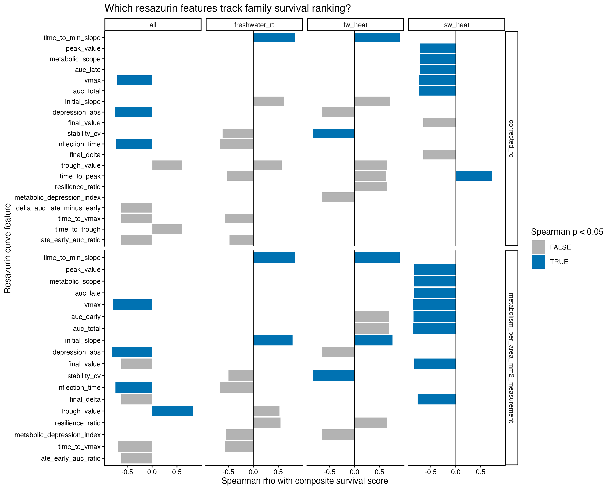
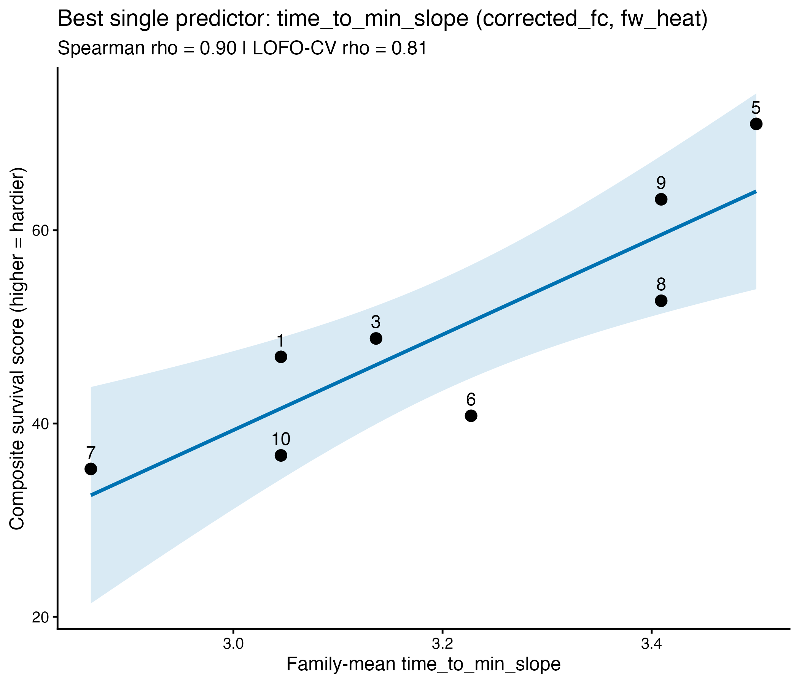
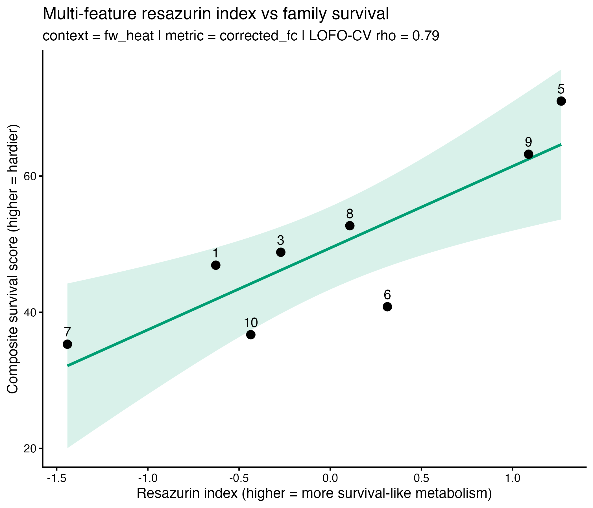

## The question

**Can a non-lethal resazurin run predict how hardy a USDA *Magallana gigas*
family is?**

- Survival ranking normally requires **killing hundreds of animals** in heat /
  stress challenges.
- Resazurin measures live metabolism cheaply and repeatedly.
- Both datasets use the **same 9 families** — so we can test the link.

## Two datasets, same families

::: {.incremental}
- **Phenotype** — cross-experiment survivorship summary (doc 09): a
  `composite_score` per family (0–100, higher = hardier), pooled over 7 heat /
  salinity experiments.
- **Predictors** — resazurin curve features (notebook 03.5): ~20 shape,
  capacity, and depression traits per individual (AUC, vmax, metabolic scope,
  depression index, time-to-decline…).
:::

::: {.fragment}
Families 1, 2, 3, 5, 6, 7, 8, 9, 10 · `9b` excluded (label ambiguity).
:::

## Approach

1. Aggregate resazurin traits to **family means** — pooled and within stress
   **contexts** (seawater heat, freshwater, freshwater+heat).
2. **Screen** every feature vs. survival phenotype (Spearman rank correlation).
3. **Leave-one-family-out cross-validation** — the honest test at small n.
4. Combine top traits into one **resazurin index** and cross-validate it.

## Caveat up front

::: {.callout-warning}
**n ≈ 9 families.** This is a *screening / ranking* tool, not an oracle.
:::

- Different animals — same families (a genetic/cohort prediction).
- Single families can swing a correlation → we lean on cross-validation.
- Family 9 identity uncertain in some runs; `9b` dropped; family 4 absent.

## Screening result — the signal inverts intuition

{height="480"}

Under **heat challenge**, metabolic *capacity* traits correlate **negatively**
with survival.

## Hardy families restrain metabolism under heat

Under a matching heat challenge (`sw_heat`):

| Feature | Spearman rho | p |
|---|---|---|
| `auc_total` | **−0.87** | 0.005 |
| `vmax` | **−0.87** | 0.005 |
| `metabolic_scope` | −0.83 | 0.008 |
| `final_value` | −0.83 | 0.008 |

Families that ramp metabolism **up** most when heated survive **least** — a
coherent block of ~6 features, not a lucky hit.

## Best single predictor — timing of decline

{height="440"}

`time_to_min_slope`: hardy families **delay** their steepest metabolic crash
(raw rho = 0.90, LOFO-CV rho = 0.81).

## A simple index generalizes out-of-sample

{height="430"}

Z-scored, sign-aligned top traits → one index. **LOFO-CV Spearman rho = 0.79**,
correctly placing family 5 (hardiest) and 7 (most fragile) at the extremes.

## What a "survivor-like" curve looks like

- **Lower metabolic capacity** under heat (less AUC, lower vmax, smaller scope).
- **Delayed decline** — later `time_to_min_slope`.
- Signal is strongest when resazurin is run **under stress**, not at rest.

→ Measure metabolism under a challenge that mirrors the survival stressor.

## Take-homes & next steps

**Take-homes**

- Resazurin under heat stress predicts the family survival *ranking*
  (CV rho ≈ 0.8).
- The predictive direction is metabolic **restraint**, not vigor.

**Next steps**

- Re-run as doc 09 grows — CV power rises fast with more families.
- Resolve the 9 / 9b label to score family 9.
- Link same animals through resazurin → survival for individual-level prediction.

## References

- Analysis: `Resazurin/code/04-resazurin-family-phenotype-prediction.Rmd`
- Curve features: `Resazurin/code/03.5-resazurin-curve-features-all-experiments.Rmd`
- Phenotype: `heat-survivorship/code/09-mgig-survivorship-cross-experiment-summary.qmd`
