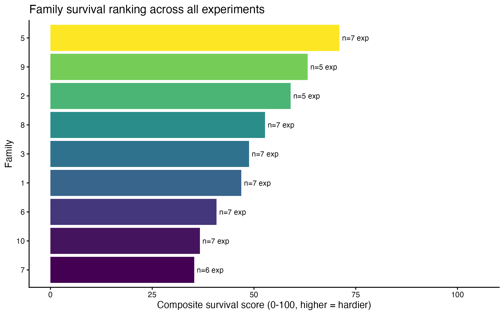
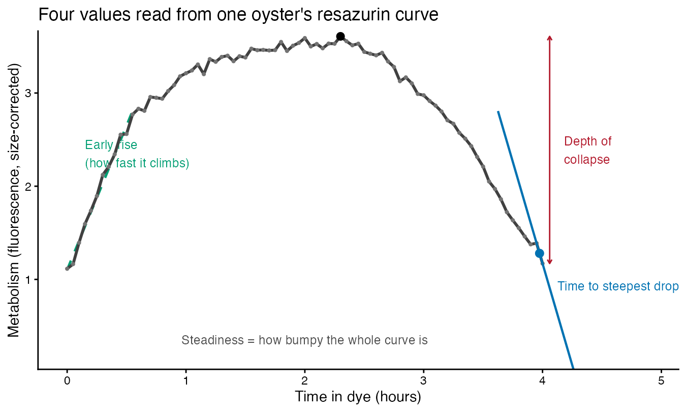

## The problem

Oyster growers and breeders want to know **which family lines survive heat and
stress** — so they can farm the tough ones.

- Finding out the usual way means **heat-stressing hundreds of oysters until
  many die**.
- That's slow, expensive, and kills the animals.
- **Is there a faster, non-lethal shortcut?**

# Part 1 · The survival trials {background-color="#f0f0f0"}

## How the survival trials work

We test oyster families side by side under a **known stress** and record who
lives.

- **20 oysters per family**, 9 USDA families, tested together.
- Exposed to a stressor — **heat (33–36 °C)**, low salinity, or **freshwater**.
- Checked repeatedly over hours to days; we log **when each animal dies**.

::: {.fragment}
Seven trials run so far, from mild to severe.
:::

## Seven trials, mild to severe

| Trial | Stress | Oysters | % that died |
|---|---|---|---|
| Apr 27 | 33 °C | 128 | 49% |
| May 11 | 33 °C | 84 | 99% |
| Jun 04 | 36 °C | 39 | 95% |
| Jun 09 | 36 °C | 77 | 86% |
| Jul 06 | 35 °C | 378 | 97% |
| Jul 06 | 35 °C + low salt | 204 | 84% |
| Jul 07 | Freshwater → 36 °C | 185 | 33% |

Harshness varies a lot — so raw survival can't be compared trial-to-trial.

## What the "survival score" means

A single **0–100 hardiness number** per family, built to be fair across trials:

::: {.incremental}
- Within **each trial**, rank the families on two things:
  **(1)** what fraction survived to the end, and
  **(2)** how long they lasted on average.
- Turn each family's standing into a **percentile** vs. the other families in
  that *same* trial — this cancels out how harsh the trial was.
- **Average those percentiles across all seven trials.**
:::

::: {.fragment}
Higher score = **consistently tougher** across many kinds of stress.
:::

## Survival results: families differ

{height="430"}

Family **5** is the toughest; family **7** the most fragile. The spread is real
and repeatable across trials.

# Part 2 · The metabolism test {background-color="#f0f0f0"}

## How the resazurin assay works

**Resazurin** is a blue dye that turns pink as living cells burn energy — a
non-lethal readout of **metabolism**.

- Each oyster sits in a cup of dye; a small sample is read in a plate reader
  **every ~30–60 min for a few hours**.
- We correct for background and **adjust for body size**.
- The result is a **metabolism curve** for each animal over time.

::: {.fragment}
Runs can be done at rest **or during heat/freshwater stress**.
:::

## What the metabolism curve tells us

From each curve we pull ~20 simple descriptions of its **shape**, for example:

- **How high** metabolism climbs, and **how fast** it rises.
- Whether it **holds steady, spikes, or crashes** under stress.
- **When** the sharpest drop happens.

::: {.fragment}
Families show **distinct, repeatable** curve shapes — the raw material for a
prediction.
:::

# Part 3 · Linking the two {background-color="#f0f0f0"}

## The idea

We have two independent results on the **same 9 families**:

- A **survival score** (from the lethal trials).
- A **metabolism fingerprint** (from the non-lethal dye test).

::: {.fragment}
**Question:** can the metabolism fingerprint predict the survival score —
letting us skip the killing?
:::

## How we tested it

1. Summarize each family's metabolism curve into simple numbers.
2. Check which numbers line up with the survival score.
3. **The honest test:** hide one family, predict its hardiness from the other
   eight, then reveal the truth — repeat for every family.

::: {.fragment}
::: {.callout-note}
Only 9 families, so this is a promising **screening tool**, not a crystal ball.
:::
:::

## Reading the score: what the numbers mean {.smaller}

Both numbers ask: **does the test rank the families in their true survival
order?** Each runs from −1 to +1.

- **Spearman rho** — a *ranking* agreement score.
  **+1** = same order (test's toughest = truly toughest), **0** = unrelated,
  **−1** = reversed. We use ranking (not raw values) so one odd family can't
  distort it.
- **LOFO-CV rho** — the same score, but measured **honestly on families the
  model never saw**: hide one family, predict it from the other eight, repeat
  for all nine, then compare.

::: {.fragment}
Spearman rho = optimistic best case; **LOFO-CV rho = the trustworthy one** (how
it'd do on a *new* family). A small gap between them means the prediction isn't
just memorizing our nine families.
:::

## The surprise: tough families "stay calm"

The clearest pattern was the **opposite** of what you might guess.

- Families whose metabolism **spikes the most** when heated tend to **survive
  the least**.
- The **hardy** families keep their metabolism **restrained** under heat —
  they don't overreact.

## Tough families also crash later {.smaller}

:::: {.columns}
::: {.column width="55%"}

:::
::: {.column width="45%"}
**How to read it**

- Each **dot is a family**.
- **Left → right:** how long before the metabolism curve makes its sharpest
  drop (*"time to steepest decline"*). Further right = crashes later.
- **Bottom → top:** survival score (higher = tougher).
- The **upward trend** = later-crashing families survive better.

**The chart's labels**

- *time_to_min_slope* = time to the steepest metabolic drop.
- *corrected_fc / fw_heat* = the metabolism measure, taken during a
  freshwater-plus-heat run.
- *rho* = how well two rankings agree (0 = not at all, 1 = perfect). **0.90**
  is very strong; the cross-validated **0.81** (the hide-one-family test)
  confirms it holds for families we didn't train on.
:::
::::

## What is the "resazurin index"? {.smaller}

One **combined score** that blends the best metabolism clues into a single
"survivor-like metabolism" number per family — so their signals reinforce and
individual noise averages out.

Built from the four strongest clues (measured under freshwater + heat):

| Clue | Plain meaning | Survivor-like value |
|---|---|---|
| Time to steepest drop | how long before metabolism crashes | **later** |
| Steadiness | how much metabolism bounces around | **steadier** |
| Early rise | how fast metabolism climbs at first | **faster** |
| Depth of collapse | how far it falls from its peak | **smaller** |

Each clue is put on a common scale, flipped so "higher = tougher," and the four
are **averaged**. Higher index = metabolism that looks like a hardy family's.

## Where those values come from

{height="470"}

Each oyster's dye curve yields the four numbers the index blends — read straight
off the curve's shape.

## Putting the clues together {.smaller}

:::: {.columns}
::: {.column width="55%"}

:::
::: {.column width="45%"}
**How to read it**

- Each **dot is a family**.
- **Left → right:** a combined *resazurin index* — several top metabolism clues
  merged into one "survivor-like metabolism" score. Further right = more
  survivor-like.
- **Bottom → top:** survival score (higher = tougher).
- The tight **upward trend** = the metabolism index tracks real survival.

**The takeaway number**

- *LOFO-CV rho = 0.79*: even in the honest hide-one-family test, the index
  predicts the survival ranking **strongly** (1 = perfect).
- The toughest family (**5**) and most fragile (**7**) land at opposite ends.
:::
::::

## What a "survivor" looks like on the test

::: {.incremental}
- **Restrained** metabolism under heat — not a big spike.
- A **slower, later** decline instead of an early crash.
- The signal is strongest when the test is run **during heat stress**, not at
  rest.
:::

## Bottom line

- A **cheap, non-lethal dye test** can flag which oyster families are likely
  **tough vs. fragile** — before any survival trial.
- Counterintuitively, **calm-and-steady** metabolism beats a big energy burst.
- Best used to **shortlist** promising families for confirmation, not to
  replace survival testing.

## What's next

- Test **more families** — the prediction gets sharper as the roster grows.
- Follow the **same animals** through both the dye test and survival to sharpen
  predictions down to the individual oyster.
- Fold results into breeding decisions for **heat-resilient stock**.
