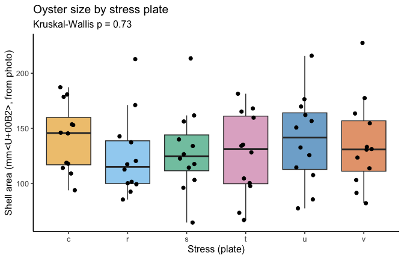
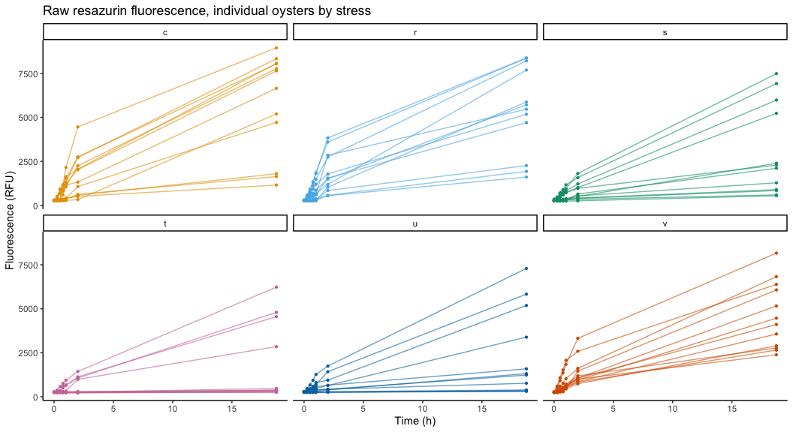
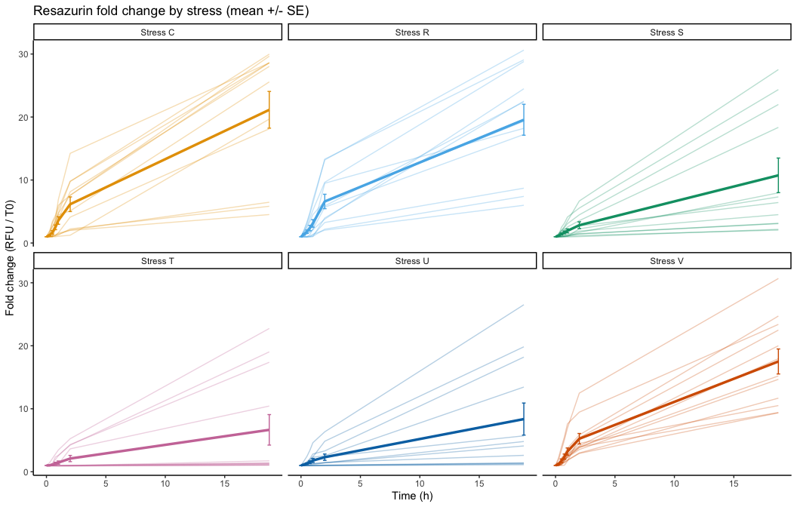
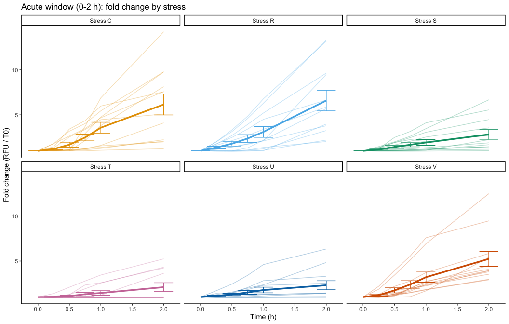
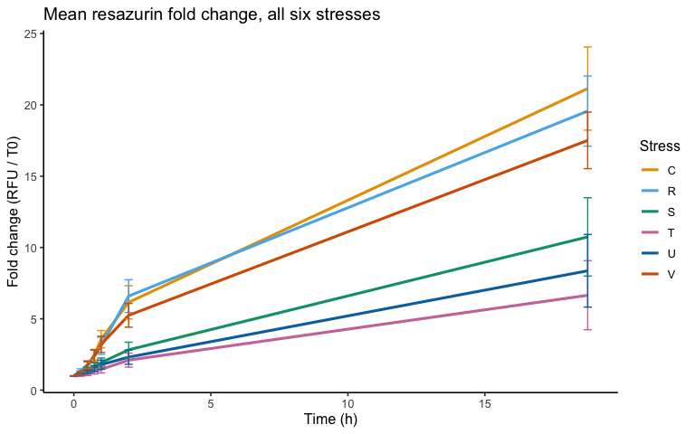
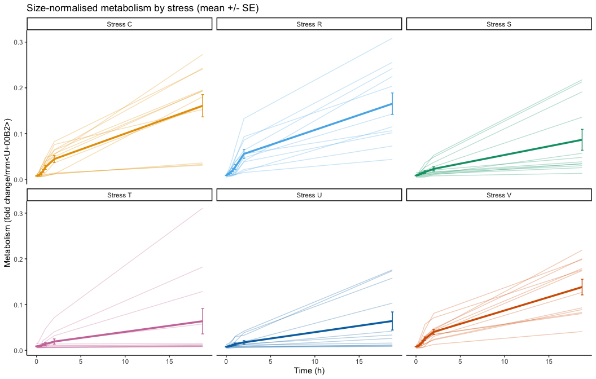
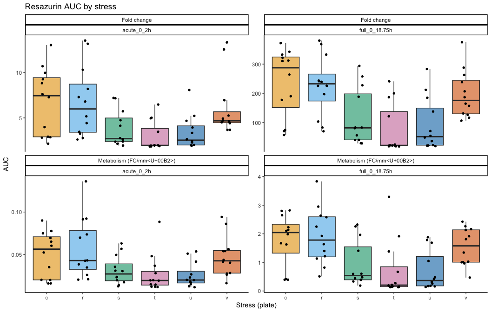
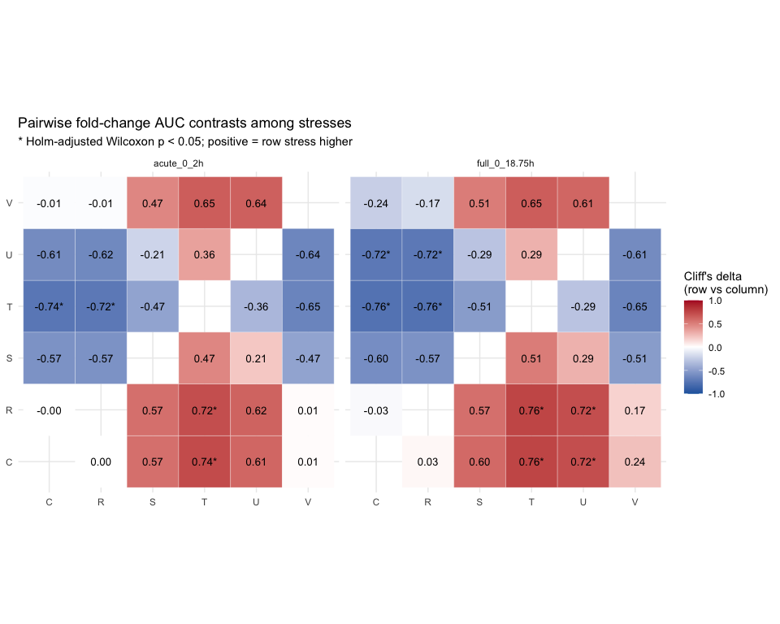

05.00-resazurin-20260921-mgig-multi\_stress
================
Steven Roberts
2026-09-22

-   [1 Background](#1-background)
    -   [1.1 Differences from the 01.00
        pipeline](#11-differences-from-the-0100-pipeline)
    -   [1.2 Expected inputs](#12-expected-inputs)
    -   [1.3 Expected outputs](#13-expected-outputs)
-   [2 Setup](#2-setup)
-   [3 Helper Functions](#3-helper-functions)
-   [4 Load Data](#4-load-data)
    -   [4.1 Plate export files](#41-plate-export-files)
    -   [4.2 Plate temperatures](#42-plate-temperatures)
    -   [4.3 Layout file](#43-layout-file)
    -   [4.4 Oyster size by stress](#44-oyster-size-by-stress)
-   [5 Merge and Normalise](#5-merge-and-normalise)
-   [6 Responder Status](#6-responder-status)
-   [7 Metabolic Curves](#7-metabolic-curves)
    -   [7.1 Raw fluorescence](#71-raw-fluorescence)
    -   [7.2 Fold change — each stress on its
        own](#72-fold-change--each-stress-on-its-own)
    -   [7.3 Acute window (0–2 h)](#73-acute-window-02-h)
    -   [7.4 All stresses overlaid
        (means)](#74-all-stresses-overlaid-means)
    -   [7.5 Size-normalised metabolism](#75-size-normalised-metabolism)
-   [8 Area Under the Curve](#8-area-under-the-curve)
-   [9 Comparing the Six Stresses](#9-comparing-the-six-stresses)
    -   [9.1 Stress severity ranking](#91-stress-severity-ranking)
    -   [9.2 Pairwise contrasts](#92-pairwise-contrasts)
    -   [9.3 When do the stresses
        diverge?](#93-when-do-the-stresses-diverge)
-   [10 Summary](#10-summary)
    -   [10.1 Caveats](#101-caveats)
-   [11 Session info](#11-session-info)

# 1 Background

On 20260921, juvenile *Magallana gigas* from a **single family** were
assigned to **six stress conditions**, one 12-well plate per condition
(plates `C`, `R`, `S`, `T`, `U`, `V`; 12 oysters per plate, one per
well, 72 total). Oysters were submerged in resazurin working solution
and fluorescence was read in a Synergy HTX at 0, 0.25, 0.5, 0.75, 1, 2
and 18.75 h.

Because all animals share one family, the question here is not family
ranking (notebook 04) but **what metabolic curve each stress produces**.
There is **no control plate**: plates `C`, `R`, `S`, `T`, `U` and `V`
are six distinct stresses. Each stress is first characterised **on its
own** (its curve, AUC and responder profile). The six are then compared
**among themselves** with an omnibus test and all 15 pairwise contrasts,
with no plate treated as a reference. Plate letters are used as stress
labels until stress names are added to `layout.csv`.

Oyster size (shell surface area, mm²) was measured from the plate photos
by `05.0-measure-oyster-area-20260921.py` (ruler-calibrated, per-well
segmentation; overlays in
`outputs/05.0-measure-oyster-area-20260921/overlays/`).

## 1.1 Differences from the 01.00 pipeline

-   **No blank wells** on these plates, so there is no blank fold-change
    correction. Each well is normalised to its own T0 reading
    (`fold_change`), and `corrected_fc` is set equal to `fold_change` so
    downstream code (05.1, 03.5-style features) runs unchanged.
-   **Uneven sampling** (dense 0–2 h, then one read at 18.75 h). AUC is
    reported for the **acute window (0–2 h)** and the **full run
    (0–18.75 h)** separately, because the single overnight interval
    dominates the full-run trapezoid.
-   **Final-read file names** differ (`plate-*-T18.75.0.txt` vs
    `plate-V-T18.75.txt`); the time parser accepts both.

## 1.2 Expected inputs

| Path                                                             | Description                                                                               |
|:-----------------------------------------------------------------|:------------------------------------------------------------------------------------------|
| `Resazurin/data/20260921-mgig-sormi-multi_stress/plate-*-T*.txt` | Plate reader exports (one per plate per timepoint)                                        |
| `Resazurin/data/20260921-mgig-sormi-multi_stress/layout.csv`     | Well metadata: plate, well, treatment (plate letter), sample ID, photo-derived area (mm²) |

## 1.3 Expected outputs

All written to
`Resazurin/outputs/05.00-resazurin-20260921-mgig-multi_stress/`.

| File                           | Description                                                               |
|:-------------------------------|:--------------------------------------------------------------------------|
| `metabolism.csv`               | Per-well per-timepoint fold change and size-normalised metabolism         |
| `plate_temperatures.csv`       | Plate-reader temperature at each read                                     |
| `auc_all_metrics.csv`          | Per-individual AUC (0–2 h and 0–18.75 h) for each metric                  |
| `auc_summary.csv`              | Per-stress AUC summary statistics                                         |
| `stress_omnibus_auc.csv`       | Kruskal-Wallis across all six stresses, per metric x window               |
| `stress_pairwise_auc.csv`      | All 15 pairwise stress contrasts (Wilcoxon, Cliff’s delta), Holm-adjusted |
| `stress_timepoint_omnibus.csv` | Kruskal-Wallis across stresses at each read                               |
| `stress_severity_ranking.csv`  | Stresses ranked by median AUC (most to least metabolically suppressive)   |
| `responder_status.csv`         | Per-individual responder / non-responder call                             |
| `figures/`                     | All plots                                                                 |

# 2 Setup

``` r
knitr::opts_chunk$set(
  echo = TRUE,
  eval = TRUE,
  warning = FALSE,
  message = FALSE,
  comment = "",
  results = "hold"
)
```

``` r
library(tidyverse)
library(rprojroot)
```

# 3 Helper Functions

``` r
normalize_well_id <- function(x) {
  x <- toupper(trimws(x))
  valid <- str_detect(x, "^[A-Z]+[0-9]+$")
  out <- rep(NA_character_, length(x))
  if (!any(valid)) return(out)
  m <- str_match(x[valid], "^([A-Z]+)([0-9]+)$")
  out[valid] <- paste0(m[, 2], as.integer(m[, 3]))
  out
}

# Accepts "-T0.25.txt", "-T18.75.txt" and the "-T18.75.0.txt" variant.
parse_time_hr <- function(path) {
  hit <- str_match(basename(path),
                   "(?i)-T([0-9]+(?:\\.[0-9]+)?)(?:\\.0)?\\.txt$")
  as.numeric(hit[, 2])
}

parse_plate_id <- function(path) {
  hit <- str_match(basename(path), "(?i)^plate-([A-Za-z0-9]+)-T")
  id <- hit[, 2]
  ifelse(is.na(id), "unknown", id)
}

parse_temperature <- function(lines) {
  hit <- str_match(lines, "^Actual Temperature:\\t([0-9.]+)")
  as.numeric(hit[!is.na(hit[, 2]), 2][1])
}

extract_results_block <- function(lines) {
  results_idx <- which(trimws(lines) == "Results")
  if (length(results_idx) == 0) stop("No Results section found")
  idx <- results_idx[1]
  header_tokens <- str_split(lines[idx + 1], "\\t")[[1]] |> trimws()
  col_ids <- header_tokens[
    header_tokens != "" & str_detect(header_tokens, "^[0-9]+$")]
  j <- idx + 2
  data_lines <- character()
  while (j <= length(lines)) {
    line <- lines[j]
    if (trimws(line) == "") break
    if (!str_detect(line, "^[A-Za-z]\\t")) break
    data_lines <- c(data_lines, line)
    j <- j + 1
  }
  list(col_ids = col_ids, data_lines = data_lines)
}

parse_plate_export <- function(path) {
  lines <- readLines(path, warn = FALSE)
  res <- extract_results_block(lines)

  map_dfr(res$data_lines, function(line) {
    tokens <- str_split(line, "\\t")[[1]] |> trimws()
    tokens <- tokens[tokens != ""]
    row_letter <- tokens[1]
    nums <- suppressWarnings(as.numeric(tokens[-1]))
    valid_idx <- which(!is.na(nums))
    if (length(valid_idx) == 0) return(tibble())
    vals <- nums[valid_idx]
    n <- min(length(vals), length(res$col_ids))
    tibble(
      row_id  = toupper(row_letter),
      col_id  = as.integer(res$col_ids[seq_len(n)]),
      well_id = normalize_well_id(
        paste0(toupper(row_letter), res$col_ids[seq_len(n)])),
      value   = vals[seq_len(n)]
    )
  }) %>%
    mutate(
      plate_id = str_to_lower(parse_plate_id(path)),
      time_hr  = parse_time_hr(path),
      temp_c   = parse_temperature(lines)
    )
}

trapezoid_auc <- function(time_hr, value) {
  ok <- is.finite(time_hr) & is.finite(value)
  t <- time_hr[ok]
  v <- value[ok]
  if (length(t) < 2) return(NA_real_)
  ord <- order(t)
  t <- t[ord]; v <- v[ord]
  sum(diff(t) * (head(v, -1) + tail(v, -1)) / 2)
}

# Okabe-Ito, one colour per stress (no reference colour: all stresses equal).
make_stress_palette <- function(levels) {
  okabe_ito <- c("#E69F00", "#56B4E9", "#009E73", "#CC79A7",
                 "#0072B2", "#D55E00", "#F0E442")
  setNames(okabe_ito[seq_along(levels)], levels)
}

# Cliff's delta: P(x > y) - P(x < y); -1..1, sign gives direction.
cliffs_delta <- function(x, y) mean(sign(outer(x, y, "-")))

# Omnibus + all pairwise contrasts among stresses for one value column.
compare_stresses <- function(df, value_col) {
  df <- df %>% filter(is.finite(.data[[value_col]]))
  kw <- kruskal.test(df[[value_col]] ~ df$treatment_group)
  pairs <- combn(stress_levels, 2, simplify = FALSE)
  pw <- map_dfr(pairs, function(pr) {
    x <- df %>% filter(treatment_group == pr[1]) %>% pull(value_col)
    y <- df %>% filter(treatment_group == pr[2]) %>% pull(value_col)
    tibble(stress_1 = pr[1], stress_2 = pr[2],
           median_1 = median(x), median_2 = median(y),
           cliffs_delta = cliffs_delta(x, y),
           wilcox_p = suppressWarnings(wilcox.test(x, y)$p.value))
  }) %>%
    mutate(wilcox_p_holm = p.adjust(wilcox_p, "holm"))
  list(omnibus = tibble(kw_statistic = unname(kw$statistic),
                        kw_df = unname(kw$parameter),
                        kw_p = kw$p.value),
       pairwise = pw)
}
```

# 4 Load Data

``` r
proj_root <- rprojroot::find_rstudio_root_file()
data_dir  <- file.path(proj_root, "Resazurin", "data",
                       "20260921-mgig-sormi-multi_stress")
out_dir   <- file.path(proj_root, "Resazurin", "outputs",
                       "05.00-resazurin-20260921-mgig-multi_stress")
fig_dir   <- file.path(out_dir, "figures")
dir.create(fig_dir, recursive = TRUE, showWarnings = FALSE)
```

## 4.1 Plate export files

``` r
plate_files <- list.files(data_dir, pattern = "(?i)^plate-.*-T.*\\.txt$",
                          full.names = TRUE)

plate_raw <- map_dfr(plate_files, parse_plate_export)

stopifnot(!any(is.na(plate_raw$time_hr)))

plate_raw %>%
  count(plate_id, time_hr, name = "n_wells") %>%
  pivot_wider(names_from = time_hr, values_from = n_wells)
```

    # A tibble: 6 x 8
      plate_id   `0` `0.25` `0.5` `0.75`   `1`   `2` `18.75`
      <chr>    <int>  <int> <int>  <int> <int> <int>   <int>
    1 c           12     12    12     12    12    12      12
    2 r           12     12    12     12    12    12      12
    3 s           12     12    12     12    12    12      12
    4 t           12     12    12     12    12    12      12
    5 u           12     12    12     12    12    12      12
    6 v           12     12    12     12    12    12      12

## 4.2 Plate temperatures

``` r
plate_temps <- plate_raw %>%
  distinct(plate_id, time_hr, temp_c) %>%
  arrange(time_hr, plate_id)

write_csv(plate_temps, file.path(out_dir, "plate_temperatures.csv"))

knitr::kable(
  plate_temps %>%
    group_by(time_hr) %>%
    summarise(mean_temp_c = round(mean(temp_c), 1),
              min_c = min(temp_c), max_c = max(temp_c), .groups = "drop"),
  col.names = c("Timepoint (h)", "Mean temp (C)", "Min", "Max"),
  caption = "Resazurin working-solution temperature recorded by the plate reader"
)
```

| Timepoint (h) | Mean temp (C) |  Min |  Max |
|--------------:|--------------:|-----:|-----:|
|          0.00 |          20.4 | 20.4 | 20.5 |
|          0.25 |          21.2 | 21.1 | 21.3 |
|          0.50 |          22.0 | 21.9 | 22.1 |
|          0.75 |          22.9 | 22.7 | 23.0 |
|          1.00 |          23.7 | 23.6 | 23.7 |
|          2.00 |          24.8 | 24.7 | 24.8 |
|         18.75 |          25.5 | 25.5 | 25.5 |

Resazurin working-solution temperature recorded by the plate reader

## 4.3 Layout file

``` r
layout_raw <- read_csv(file.path(data_dir, "layout.csv"),
                       col_types = cols(.default = "c"),
                       show_col_types = FALSE)

names(layout_raw) <- names(layout_raw) |>
  str_to_lower() |>
  str_replace_all("[^a-z0-9]+", "_") |>
  str_replace_all("_+", "_") |>
  str_replace("_$", "")

layout_clean <- layout_raw %>%
  mutate(
    plate_id = str_remove(str_to_lower(plate_id), "^plate-"),
    well_id  = normalize_well_id(plate_well),
    is_blank = toupper(trimws(is_blank)) %in% c("TRUE", "T", "1", "YES", "Y"),
    exclude_from_analysis = toupper(trimws(exclude_from_analysis)) %in%
      c("TRUE", "T", "1", "YES", "Y"),
    area_mm2_measurement = as.numeric(area_mm2_measurement),
    treatment_group = str_to_lower(trimws(treatment_group)),
    sample_id_group = str_to_lower(trimws(sample_id_group))
  )

layout_clean %>%
  group_by(treatment_group) %>%
  summarise(n = n(),
            mean_area_mm2 = round(mean(area_mm2_measurement, na.rm = TRUE), 1),
            sd_area_mm2   = round(sd(area_mm2_measurement, na.rm = TRUE), 1),
            .groups = "drop")
```

    # A tibble: 6 x 4
      treatment_group     n mean_area_mm2 sd_area_mm2
      <chr>           <int>         <dbl>       <dbl>
    1 c                  12          142.        30.9
    2 r                  12          124.        36.9
    3 s                  12          129.        37.4
    4 t                  12          126.        38  
    5 u                  12          140.        40.2
    6 v                  12          136.        40.4

## 4.4 Oyster size by stress

Oysters were assigned randomly, so size should not differ between
plates. A size difference would confound the size-normalised metric.

``` r
stress_levels <- sort(unique(layout_clean$treatment_group))
stress_pal <- make_stress_palette(stress_levels)

size_kw <- kruskal.test(area_mm2_measurement ~ treatment_group,
                        data = layout_clean)
cat("Kruskal-Wallis test of area by stress: p =",
    signif(size_kw$p.value, 3), "\n")

p_size <- layout_clean %>%
  mutate(treatment_group = factor(treatment_group, levels = stress_levels)) %>%
  ggplot(aes(treatment_group, area_mm2_measurement, fill = treatment_group)) +
  geom_boxplot(outlier.shape = NA, alpha = 0.6) +
  geom_jitter(width = 0.15, size = 1.8) +
  scale_fill_manual(values = stress_pal, guide = "none") +
  labs(x = "Stress (plate)", y = "Shell area (mm², from photo)",
       title = "Oyster size by stress plate",
       subtitle = sprintf("Kruskal-Wallis p = %.2g", size_kw$p.value)) +
  theme_classic(base_size = 12)
p_size
```

<!-- -->

``` r
ggsave(file.path(fig_dir, "size_by_stress.png"), p_size, width = 7, height = 4.5)
```

    Kruskal-Wallis test of area by stress: p = 0.731 

# 5 Merge and Normalise

Each well’s fluorescence is divided by its own T0 value (`fold_change`).
`metabolism_per_area_mm2_measurement` = fold change / shell area.

``` r
dat <- plate_raw %>%
  left_join(layout_clean %>%
              select(plate_id, well_id, is_blank, exclude_from_analysis,
                     any_of("exclude_reason"), family_id_group,
                     sample_id_group, treatment_group, area_mm2_measurement),
            by = c("plate_id", "well_id")) %>%
  filter(!is_blank, !exclude_from_analysis) %>%
  mutate(trace_id = sample_id_group)

t0 <- min(dat$time_hr)

metabolism <- dat %>%
  group_by(trace_id) %>%
  mutate(value_t0 = value[time_hr == t0][1]) %>%
  ungroup() %>%
  mutate(
    fold_change   = value / value_t0,
    corrected_fc  = fold_change,   # no blanks: fold change is the corrected metric
    metabolism_per_area_mm2_measurement = corrected_fc / area_mm2_measurement,
    treatment_group = factor(treatment_group, levels = stress_levels)
  ) %>%
  arrange(treatment_group, well_id, time_hr)

write_csv(metabolism, file.path(out_dir, "metabolism.csv"))

metabolism %>%
  group_by(treatment_group) %>%
  summarise(n_indiv = n_distinct(trace_id),
            t0_rfu_mean = round(mean(value_t0), 0),
            final_fc_median = round(median(fold_change[time_hr == max(time_hr)]), 2),
            .groups = "drop")
```

    # A tibble: 6 x 4
      treatment_group n_indiv t0_rfu_mean final_fc_median
      <fct>             <int>       <dbl>           <dbl>
    1 c                    12         274           26.8 
    2 r                    12         276           20.9 
    3 s                    12         287            6.88
    4 t                    12         265            1.38
    5 u                    12         277            4.45
    6 v                    12         263           16.6 

# 6 Responder Status

Wells whose fluorescence barely rises over the whole run (final fold
change below `nonresponder_fc`) are consistent with a dead or fully
shut-down animal. They are **flagged, not dropped**, because a shut-down
response may be exactly what a stress does. The proportion of
non-responders per stress is itself a phenotype.

``` r
nonresponder_fc <- 2

responder_status <- metabolism %>%
  filter(time_hr == max(time_hr)) %>%
  transmute(trace_id, plate_id, well_id, treatment_group,
            final_fc = fold_change,
            responder = final_fc >= nonresponder_fc)

write_csv(responder_status, file.path(out_dir, "responder_status.csv"))

resp_tab <- responder_status %>%
  group_by(treatment_group) %>%
  summarise(n = n(), n_nonresponder = sum(!responder),
            pct_nonresponder = round(100 * mean(!responder), 0),
            .groups = "drop")

# Fisher exact test: does the non-responder proportion differ among stresses?
resp_fisher <- fisher.test(
  table(responder_status$treatment_group,
        factor(responder_status$responder, levels = c(TRUE, FALSE))),
  simulate.p.value = TRUE, B = 1e5
)
cat("Fisher exact test (simulated) of non-responder proportion across stresses: p =",
    signif(resp_fisher$p.value, 3), "\n")

knitr::kable(resp_tab,
             caption = sprintf("Non-responders (final fold change < %g) by stress",
                               nonresponder_fc))
```

    Fisher exact test (simulated) of non-responder proportion across stresses: p = 1e-05 

| treatment\_group |   n | n\_nonresponder | pct\_nonresponder |
|:-----------------|----:|----------------:|------------------:|
| c                |  12 |               0 |                 0 |
| r                |  12 |               0 |                 0 |
| s                |  12 |               0 |                 0 |
| t                |  12 |               8 |                67 |
| u                |  12 |               4 |                33 |
| v                |  12 |               0 |                 0 |

Non-responders (final fold change &lt; 2) by stress

# 7 Metabolic Curves

## 7.1 Raw fluorescence

``` r
p_raw <- ggplot(metabolism, aes(time_hr, value, group = trace_id,
                                color = treatment_group)) +
  geom_line(alpha = 0.6) +
  geom_point(size = 0.8) +
  facet_wrap(~ treatment_group, nrow = 2) +
  scale_color_manual(values = stress_pal, guide = "none") +
  labs(x = "Time (h)", y = "Fluorescence (RFU)",
       title = "Raw resazurin fluorescence, individual oysters by stress") +
  theme_classic(base_size = 11)
p_raw
```

<!-- -->

``` r
ggsave(file.path(fig_dir, "raw_individual_by_stress.png"), p_raw,
       width = 11, height = 6)
```

## 7.2 Fold change — each stress on its own

Each panel is one stress: individual traces (thin) and the stress mean ±
SE (thick). Panels share a y-axis so curves are directly comparable.

``` r
stress_labeller <- labeller(treatment_group = function(x) paste("Stress", toupper(x)))

plot_by_stress <- function(df, y, ylab, title) {
  ggplot(df, aes(time_hr, .data[[y]], color = treatment_group)) +
    geom_line(aes(group = trace_id), alpha = 0.3) +
    stat_summary(fun = mean, geom = "line", linewidth = 1.2) +
    stat_summary(fun.data = mean_se, geom = "errorbar", width = 0.3) +
    facet_wrap(~ treatment_group, nrow = 2, labeller = stress_labeller) +
    scale_color_manual(values = stress_pal, guide = "none") +
    labs(x = "Time (h)", y = ylab, title = title) +
    theme_classic(base_size = 11)
}

p_fc <- plot_by_stress(metabolism, "fold_change", "Fold change (RFU / T0)",
                       "Resazurin fold change by stress (mean +/- SE)")
p_fc
```

<!-- -->

``` r
ggsave(file.path(fig_dir, "fold_change_by_stress.png"), p_fc,
       width = 11, height = 7)
```

## 7.3 Acute window (0–2 h)

``` r
p_fc_acute <- plot_by_stress(filter(metabolism, time_hr <= 2), "fold_change",
                             "Fold change (RFU / T0)",
                             "Acute window (0-2 h): fold change by stress")
p_fc_acute
```

<!-- -->

``` r
ggsave(file.path(fig_dir, "fold_change_acute_by_stress.png"),
       p_fc_acute, width = 11, height = 7)
```

## 7.4 All stresses overlaid (means)

``` r
p_overlay <- ggplot(metabolism, aes(time_hr, fold_change,
                                    color = treatment_group)) +
  stat_summary(fun = mean, geom = "line", linewidth = 1.1) +
  stat_summary(fun.data = mean_se, geom = "errorbar", width = 0.3) +
  scale_color_manual(values = stress_pal, labels = toupper, name = "Stress") +
  labs(x = "Time (h)", y = "Fold change (RFU / T0)",
       title = "Mean resazurin fold change, all six stresses") +
  theme_classic(base_size = 12)
p_overlay
```

<!-- -->

``` r
ggsave(file.path(fig_dir, "fold_change_mean_overlay.png"), p_overlay,
       width = 8, height = 5)
```

## 7.5 Size-normalised metabolism

``` r
p_met <- plot_by_stress(metabolism, "metabolism_per_area_mm2_measurement",
                        "Metabolism (fold change/mm²)",
                        "Size-normalised metabolism by stress (mean +/- SE)")
p_met
```

<!-- -->

``` r
ggsave(file.path(fig_dir, "metabolism_by_stress.png"), p_met,
       width = 11, height = 7)
```

# 8 Area Under the Curve

``` r
metric_cols <- c("fold_change", "metabolism_per_area_mm2_measurement")
windows <- list(acute_0_2h = c(0, 2), full_0_18.75h = c(0, Inf))

auc_all <- expand_grid(metric = metric_cols, window = names(windows)) %>%
  pmap_dfr(function(metric, window) {
    w <- windows[[window]]
    metabolism %>%
      filter(time_hr >= w[1], time_hr <= w[2]) %>%
      group_by(trace_id, plate_id, well_id, treatment_group,
               area_mm2_measurement) %>%
      summarise(auc = trapezoid_auc(time_hr, .data[[metric]]),
                .groups = "drop") %>%
      mutate(metric = metric, window = window)
  })

write_csv(auc_all, file.path(out_dir, "auc_all_metrics.csv"))

auc_summary <- auc_all %>%
  group_by(metric, window, treatment_group) %>%
  summarise(n = n(), mean = mean(auc), sd = sd(auc), se = sd / sqrt(n),
            median = median(auc), .groups = "drop")
write_csv(auc_summary, file.path(out_dir, "auc_summary.csv"))
```

``` r
p_auc <- auc_all %>%
  mutate(metric = recode(metric,
                         fold_change = "Fold change",
                         metabolism_per_area_mm2_measurement = "Metabolism (FC/mm²)")) %>%
  ggplot(aes(treatment_group, auc, fill = treatment_group)) +
  geom_boxplot(outlier.shape = NA, alpha = 0.6) +
  geom_jitter(width = 0.15, size = 1.2) +
  facet_wrap(metric ~ window, scales = "free_y") +
  scale_fill_manual(values = stress_pal, guide = "none") +
  labs(x = "Stress (plate)", y = "AUC",
       title = "Resazurin AUC by stress") +
  theme_classic(base_size = 11)
p_auc
```

<!-- -->

``` r
ggsave(file.path(fig_dir, "auc_by_stress.png"), p_auc, width = 11, height = 7)
```

# 9 Comparing the Six Stresses

With 12 animals per stress, stresses are compared with a Kruskal-Wallis
omnibus test followed by all 15 pairwise Wilcoxon rank-sum tests (robust
to the bimodal responder / non-responder mix), Holm-adjusted within each
metric × window. Pairwise effect size is Cliff’s delta (−1 to 1;
positive = first stress higher).

``` r
auc_cmp <- auc_all %>%
  group_by(metric, window) %>%
  group_map(~ {
    r <- compare_stresses(.x, "auc")
    list(omnibus  = bind_cols(.y, r$omnibus),
         pairwise = bind_cols(.y, r$pairwise))
  })

stress_omnibus_auc  <- map_dfr(auc_cmp, "omnibus")
stress_pairwise_auc <- map_dfr(auc_cmp, "pairwise")

write_csv(stress_omnibus_auc,  file.path(out_dir, "stress_omnibus_auc.csv"))
write_csv(stress_pairwise_auc, file.path(out_dir, "stress_pairwise_auc.csv"))

knitr::kable(
  stress_omnibus_auc %>%
    mutate(kw_statistic = round(kw_statistic, 2), kw_p = signif(kw_p, 3)),
  caption = "Kruskal-Wallis test of AUC across the six stresses"
)
```

| metric                                  | window          | kw\_statistic | kw\_df |    kw\_p |
|:----------------------------------------|:----------------|--------------:|-------:|---------:|
| fold\_change                            | acute\_0\_2h    |         22.66 |      5 | 3.93e-04 |
| fold\_change                            | full\_0\_18.75h |         25.77 |      5 | 9.91e-05 |
| metabolism\_per\_area\_mm2\_measurement | acute\_0\_2h    |         18.08 |      5 | 2.84e-03 |
| metabolism\_per\_area\_mm2\_measurement | full\_0\_18.75h |         22.96 |      5 | 3.43e-04 |

Kruskal-Wallis test of AUC across the six stresses

## 9.1 Stress severity ranking

Stresses ordered by median fold-change AUC. Lower AUC = stronger
suppression of resazurin reduction (lower metabolic activity).

``` r
stress_severity <- auc_all %>%
  filter(metric == "fold_change") %>%
  group_by(window, treatment_group) %>%
  summarise(median_auc = median(auc), mean_auc = mean(auc), .groups = "drop") %>%
  left_join(resp_tab %>% select(treatment_group, pct_nonresponder),
            by = "treatment_group") %>%
  group_by(window) %>%
  mutate(severity_rank = rank(median_auc)) %>%   # 1 = most suppressive
  ungroup() %>%
  arrange(window, severity_rank)

write_csv(stress_severity, file.path(out_dir, "stress_severity_ranking.csv"))

knitr::kable(
  stress_severity %>%
    mutate(treatment_group = toupper(treatment_group),
           across(c(median_auc, mean_auc), ~ round(.x, 1))),
  caption = "Stresses ranked by median fold-change AUC (1 = most suppressive)"
)
```

| window          | treatment\_group | median\_auc | mean\_auc | pct\_nonresponder | severity\_rank |
|:----------------|:-----------------|------------:|----------:|------------------:|---------------:|
| acute\_0\_2h    | T                |         2.0 |       2.9 |                67 |              1 |
| acute\_0\_2h    | U                |         2.6 |       3.4 |                33 |              2 |
| acute\_0\_2h    | S                |         2.7 |       3.8 |                 0 |              3 |
| acute\_0\_2h    | V                |         4.7 |       6.1 |                 0 |              4 |
| acute\_0\_2h    | R                |         6.0 |       6.7 |                 0 |              5 |
| acute\_0\_2h    | C                |         7.4 |       6.8 |                 0 |              6 |
| full\_0\_18.75h | T                |        21.9 |      76.3 |                67 |              1 |
| full\_0\_18.75h | U                |        51.7 |      92.8 |                33 |              2 |
| full\_0\_18.75h | S                |        81.8 |     117.4 |                 0 |              3 |
| full\_0\_18.75h | V                |       175.7 |     196.6 |                 0 |              4 |
| full\_0\_18.75h | R                |       232.5 |     225.8 |                 0 |              5 |
| full\_0\_18.75h | C                |       287.4 |     235.4 |                 0 |              6 |

Stresses ranked by median fold-change AUC (1 = most suppressive)

## 9.2 Pairwise contrasts

``` r
pw_plot <- stress_pairwise_auc %>%
  filter(metric == "fold_change") %>%
  bind_rows(
    stress_pairwise_auc %>% filter(metric == "fold_change") %>%
      rename(stress_1 = stress_2, stress_2 = stress_1) %>%
      mutate(cliffs_delta = -cliffs_delta)
  ) %>%
  mutate(stress_1 = factor(toupper(stress_1), levels = toupper(stress_levels)),
         stress_2 = factor(toupper(stress_2), levels = toupper(stress_levels)),
         lab = sprintf("%.2f%s", cliffs_delta,
                       ifelse(wilcox_p_holm < 0.05, "*", "")))

p_pw <- ggplot(pw_plot, aes(stress_2, stress_1, fill = cliffs_delta)) +
  geom_tile(color = "white") +
  geom_text(aes(label = lab), size = 3.5) +
  facet_wrap(~ window) +
  scale_fill_gradient2(low = "#2166AC", mid = "white", high = "#B2182B",
                       limits = c(-1, 1), name = "Cliff's delta\n(row vs column)") +
  coord_equal() +
  labs(x = NULL, y = NULL,
       title = "Pairwise fold-change AUC contrasts among stresses",
       subtitle = "* Holm-adjusted Wilcoxon p < 0.05; positive = row stress higher") +
  theme_minimal(base_size = 11)
p_pw
```

<!-- -->

``` r
ggsave(file.path(fig_dir, "pairwise_auc_heatmap.png"), p_pw,
       width = 10, height = 8)

knitr::kable(
  stress_pairwise_auc %>%
    filter(metric == "fold_change", wilcox_p_holm < 0.05) %>%
    transmute(window, contrast = paste(toupper(stress_1), "vs", toupper(stress_2)),
              median_1 = round(median_1, 1), median_2 = round(median_2, 1),
              cliffs_delta = round(cliffs_delta, 2),
              wilcox_p_holm = signif(wilcox_p_holm, 2)),
  caption = "Significant pairwise stress contrasts (fold-change AUC, Holm p < 0.05)"
)
```

| window          | contrast | median\_1 | median\_2 | cliffs\_delta | wilcox\_p\_holm |
|:----------------|:---------|----------:|----------:|--------------:|----------------:|
| acute\_0\_2h    | C vs T   |       7.4 |       2.0 |          0.74 |           0.021 |
| acute\_0\_2h    | R vs T   |       6.0 |       2.0 |          0.72 |           0.026 |
| full\_0\_18.75h | C vs T   |     287.4 |      21.9 |          0.76 |           0.013 |
| full\_0\_18.75h | C vs U   |     287.4 |      51.7 |          0.72 |           0.024 |
| full\_0\_18.75h | R vs T   |     232.5 |      21.9 |          0.76 |           0.013 |
| full\_0\_18.75h | R vs U   |     232.5 |      51.7 |          0.72 |           0.024 |

Significant pairwise stress contrasts (fold-change AUC, Holm p &lt;
0.05)

## 9.3 When do the stresses diverge?

Kruskal-Wallis across the six stresses at each read, Holm-adjusted
across reads.

``` r
stress_timepoint <- metabolism %>%
  filter(time_hr > t0) %>%
  group_by(time_hr) %>%
  summarise(kw_p = kruskal.test(fold_change ~ treatment_group)$p.value,
            .groups = "drop") %>%
  mutate(kw_p_holm = p.adjust(kw_p, "holm"))

write_csv(stress_timepoint, file.path(out_dir, "stress_timepoint_omnibus.csv"))

knitr::kable(stress_timepoint %>% mutate(across(c(kw_p, kw_p_holm), ~ signif(.x, 3))),
             caption = "Kruskal-Wallis across stresses at each read")
```

| time\_hr |    kw\_p | kw\_p\_holm |
|---------:|---------:|------------:|
|     0.25 | 0.059600 |    0.059600 |
|     0.50 | 0.028300 |    0.056500 |
|     0.75 | 0.005670 |    0.017000 |
|     1.00 | 0.001230 |    0.004930 |
|     2.00 | 0.000101 |    0.000603 |
|    18.75 | 0.000118 |    0.000603 |

Kruskal-Wallis across stresses at each read

# 10 Summary

``` r
sev_acute <- stress_severity %>% filter(window == "acute_0_2h")
sev_full  <- stress_severity %>% filter(window == "full_0_18.75h")
omni <- stress_omnibus_auc %>% filter(metric == "fold_change")

cat(sprintf(
  "Stresses differ in fold-change AUC (Kruskal-Wallis p = %.2g acute, %.2g full run).\n\n",
  omni$kw_p[omni$window == "acute_0_2h"],
  omni$kw_p[omni$window == "full_0_18.75h"]))
```

Stresses differ in fold-change AUC (Kruskal-Wallis p = 0.00039 acute,
9.9e-05 full run).

``` r
cat("Per-stress profile (ordered most to least suppressive, full run):\n\n")
```

Per-stress profile (ordered most to least suppressive, full run):

``` r
for (g in sev_full$treatment_group) {
  a <- sev_acute %>% filter(treatment_group == g)
  f <- sev_full %>% filter(treatment_group == g)
  r <- resp_tab %>% filter(treatment_group == g)
  cat(sprintf(
    "- **Stress %s**: median AUC %.1f (0-2 h, rank %d) / %.1f (0-18.75 h, rank %d); %d/%d non-responders.\n",
    toupper(g), a$median_auc, as.integer(a$severity_rank),
    f$median_auc, as.integer(f$severity_rank),
    r$n_nonresponder, r$n))
}
```

-   **Stress T**: median AUC 2.0 (0-2 h, rank 1) / 21.9 (0-18.75 h, rank
    1); 8/12 non-responders.
-   **Stress U**: median AUC 2.6 (0-2 h, rank 2) / 51.7 (0-18.75 h, rank
    2); 4/12 non-responders.
-   **Stress S**: median AUC 2.7 (0-2 h, rank 3) / 81.8 (0-18.75 h, rank
    3); 0/12 non-responders.
-   **Stress V**: median AUC 4.7 (0-2 h, rank 4) / 175.7 (0-18.75 h,
    rank 4); 0/12 non-responders.
-   **Stress R**: median AUC 6.0 (0-2 h, rank 5) / 232.5 (0-18.75 h,
    rank 5); 0/12 non-responders.
-   **Stress C**: median AUC 7.4 (0-2 h, rank 6) / 287.4 (0-18.75 h,
    rank 6); 0/12 non-responders.

## 10.1 Caveats

-   **One plate per stress**: plate and stress effects cannot be
    separated.
-   **No blanks**: medium-only fluorescence drift is not removed. If a
    stress changes the medium itself (e.g. salinity, pH, chemical
    exposure), drift may differ between plates.
-   **Temperature ramp** (≈20.5 → 25.5 °C) is shared by all plates.
-   **Photo-derived areas** are automated. Plate S was photographed with
    resazurin already in the wells, and the S-A03 outline is uncertain
    (see `area_note` in `layout.csv`). Photo well orientation is assumed
    to match the reader (A01 = top-left as photographed).

# 11 Session info

``` r
sessionInfo()
```

    R version 4.3.2 (2023-10-31)
    Platform: aarch64-apple-darwin20 (64-bit)
    Running under: macOS Sonoma 14.7.6

    Matrix products: default
    BLAS:   /Library/Frameworks/R.framework/Versions/4.3-arm64/Resources/lib/libRblas.0.dylib 
    LAPACK: /Library/Frameworks/R.framework/Versions/4.3-arm64/Resources/lib/libRlapack.dylib;  LAPACK version 3.11.0

    locale:
    [1] C

    time zone: America/Los_Angeles
    tzcode source: internal

    attached base packages:
    [1] stats     graphics  grDevices utils     datasets  methods   base     

    other attached packages:
     [1] rprojroot_2.0.4 lubridate_1.9.3 forcats_1.0.0   stringr_1.5.1  
     [5] dplyr_1.1.4     purrr_1.0.2     readr_2.1.5     tidyr_1.3.1    
     [9] tibble_3.2.1    ggplot2_3.5.2   tidyverse_2.0.0

    loaded via a namespace (and not attached):
     [1] utf8_1.2.4         generics_0.1.3     stringi_1.8.4      hms_1.1.3         
     [5] digest_0.6.37      magrittr_2.0.3     evaluate_1.0.0     grid_4.3.2        
     [9] timechange_0.3.0   RColorBrewer_1.1-3 fastmap_1.2.0      fansi_1.0.6       
    [13] scales_1.4.0       textshaping_0.4.0  cli_3.6.3          rlang_1.1.4       
    [17] crayon_1.5.3       bit64_4.5.2        withr_3.0.1        yaml_2.3.10       
    [21] tools_4.3.2        parallel_4.3.2     tzdb_0.4.0         vctrs_0.6.5       
    [25] R6_2.5.1           lifecycle_1.0.4    bit_4.5.0          vroom_1.6.5       
    [29] ragg_1.3.3         pkgconfig_2.0.3    pillar_1.9.0       gtable_0.3.6      
    [33] glue_1.8.0         systemfonts_1.1.0  xfun_0.48          tidyselect_1.2.1  
    [37] highr_0.11         knitr_1.48         farver_2.1.2       htmltools_0.5.8.1 
    [41] rmarkdown_2.28     labeling_0.4.3     compiler_4.3.2    
