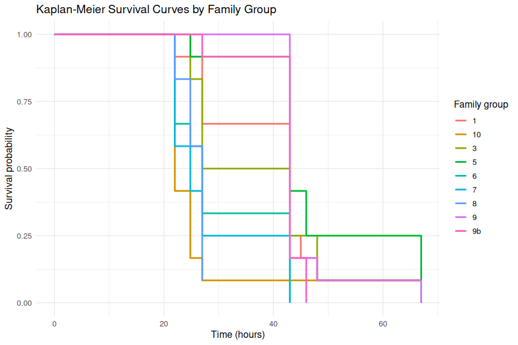

00.00-mgig-heat-survivorship-20260511
================
Sam White
2026-05-11

- [1 BACKGROUND](#1-background)
  - [1.1 SETUP](#11-setup)
    - [1.1.1 Load packages](#111-load-packages)
    - [1.1.2 Read in and view raw data](#112-read-in-and-view-raw-data)
  - [1.2 ANALYSIS](#12-analysis)
    - [1.2.1 Clean and standardize columns used for survival
      analysis](#121-clean-and-standardize-columns-used-for-survival-analysis)
    - [1.2.2 Reduce repeated observations to one survival row per
      individual](#122-reduce-repeated-observations-to-one-survival-row-per-individual)
    - [1.2.3 Create Surv object and fit Kaplan-Meier
      models](#123-create-surv-object-and-fit-kaplan-meier-models)
    - [1.2.4 Perform log-rank test to compare survival between
      families](#124-perform-log-rank-test-to-compare-survival-between-families)
    - [1.2.5 Pairwise log-rank tests with BH
      correction](#125-pairwise-log-rank-tests-with-bh-correction)
    - [1.2.6 Convert Kaplan-Meier fit to plotting data
      frames](#126-convert-kaplan-meier-fit-to-plotting-data-frames)
  - [1.3 PLOTS](#13-plots)
    - [1.3.1 Plot Kaplan-Meier curves](#131-plot-kaplan-meier-curves)

# 1 BACKGROUND

<!-- This is a Kaplan-Meier survival analysis of 33<sup>o</sup>C heat stress of _Magallana gigas_ oysters, [conducted on 20260511](https://github.com/RobertsLab/sormi-assay-development/tree/main/heat-survivorship/20260511-33C-USDA-families) (GitHub repo). It compares 9 different families bred/selected by the USDA. -->

## 1.1 SETUP

### 1.1.1 Load packages

``` r
library(readr)
library(dplyr)
library(survival)
library(survminer)
library(ggplot2)

knitr::opts_chunk$set(
  echo = TRUE,         # Display code chunks
  eval = TRUE,        # Evaluate code chunks
  warning = FALSE,     # Hide warnings
  message = FALSE,     # Hide messages
  comment = "",         # Prevents appending '##' to beginning of lines in code output
  results = 'hold',    # Holds output so it's all printed together after code chunk
  fig.path = "../outputs/00.00-mgig-heat-survivorship-20260511/"
)
```

### 1.1.2 Read in and view raw data

``` r
survivorship_raw <- read_csv(
    "../data/20260511-33C-USDA-families/survivorship.csv",
    show_col_types = FALSE
)

# Preview newly created object
cat("\n=== survivorship_raw: str() ===\n")
str(survivorship_raw)
```

    === survivorship_raw: str() ===
    spc_tbl_ [1,080 × 10] (S3: spec_tbl_df/tbl_df/tbl/data.frame)
     $ plate_ID         : chr [1:1080] "plate-A" "plate-A" "plate-A" "plate-A" ...
     $ plate_well       : chr [1:1080] "A01" "A02" "A03" "A04" ...
     $ individual_id    : num [1:1080] 1 2 3 4 5 6 7 8 9 10 ...
     $ familly_id.group : chr [1:1080] "3" "3" "3" "3" ...
     $ timepoint_count  : num [1:1080] 0 0 0 0 0 0 0 0 0 0 ...
     $ timepoint_hrs    : num [1:1080] 0 0 0 0 0 0 0 0 0 0 ...
     $ alive.measurement: logi [1:1080] TRUE TRUE TRUE TRUE TRUE TRUE ...
     $ date             : num [1:1080] 20260511 20260511 20260511 20260511 20260511 ...
     $ time             : 'hms' num [1:1080] 12:30:00 12:30:00 12:30:00 12:30:00 ...
      ..- attr(*, "units")= chr "secs"
     $ notes            : logi [1:1080] NA NA NA NA NA NA ...
     - attr(*, "spec")=
      .. cols(
      ..   plate_ID = col_character(),
      ..   plate_well = col_character(),
      ..   individual_id = col_double(),
      ..   familly_id.group = col_character(),
      ..   timepoint_count = col_double(),
      ..   timepoint_hrs = col_double(),
      ..   alive.measurement = col_logical(),
      ..   date = col_double(),
      ..   time = col_time(format = ""),
      ..   notes = col_logical()
      .. )
     - attr(*, "problems")=<externalptr> 

## 1.2 ANALYSIS

### 1.2.1 Clean and standardize columns used for survival analysis

``` r
survivorship_clean <- survivorship_raw %>%
    mutate(
        individual_id = as.character(individual_id),
        family_group = as.character(`familly_id.group`),
        timepoint_hrs = as.numeric(timepoint_hrs),
        alive_chr = toupper(trimws(as.character(`alive.measurement`))),
        alive = case_when(
            alive_chr %in% c("TRUE", "T", "1", "YES", "Y") ~ TRUE,
            alive_chr %in% c("FALSE", "F", "0", "NO", "N") ~ FALSE,
            TRUE ~ NA
        )
    ) %>%
    select(
        individual_id,
        family_group,
        timepoint_count,
        timepoint_hrs,
        alive,
        date,
        time,
        everything()
    )

# Preview newly created object
cat("\n=== survivorship_clean: str() ===\n")
str(survivorship_clean)
cat("\n=== survivorship_clean: summary(alive) ===\n")
summary(survivorship_clean$alive)
```

    === survivorship_clean: str() ===
    tibble [1,080 × 13] (S3: tbl_df/tbl/data.frame)
     $ individual_id    : chr [1:1080] "1" "2" "3" "4" ...
     $ family_group     : chr [1:1080] "3" "3" "3" "3" ...
     $ timepoint_count  : num [1:1080] 0 0 0 0 0 0 0 0 0 0 ...
     $ timepoint_hrs    : num [1:1080] 0 0 0 0 0 0 0 0 0 0 ...
     $ alive            : logi [1:1080] TRUE TRUE TRUE TRUE TRUE TRUE ...
     $ date             : num [1:1080] 20260511 20260511 20260511 20260511 20260511 ...
     $ time             : 'hms' num [1:1080] 12:30:00 12:30:00 12:30:00 12:30:00 ...
      ..- attr(*, "units")= chr "secs"
     $ plate_ID         : chr [1:1080] "plate-A" "plate-A" "plate-A" "plate-A" ...
     $ plate_well       : chr [1:1080] "A01" "A02" "A03" "A04" ...
     $ familly_id.group : chr [1:1080] "3" "3" "3" "3" ...
     $ alive.measurement: logi [1:1080] TRUE TRUE TRUE TRUE TRUE TRUE ...
     $ notes            : logi [1:1080] NA NA NA NA NA NA ...
     $ alive_chr        : chr [1:1080] "TRUE" "TRUE" "TRUE" "TRUE" ...

    === survivorship_clean: summary(alive) ===
       Mode   FALSE    TRUE 
    logical     683     397 

### 1.2.2 Reduce repeated observations to one survival row per individual

``` r
individual_survival <- survivorship_clean %>%
    filter(!is.na(individual_id), !is.na(timepoint_hrs), !is.na(alive)) %>%
    arrange(individual_id, timepoint_hrs) %>%
    group_by(individual_id) %>%
    summarise(
        family_group = first(family_group[!is.na(family_group)]),
        event = if_else(any(!alive), 1L, 0L),
        time_to_event = {
            if (any(!alive)) {
                min(timepoint_hrs[!alive])
            } else {
                max(timepoint_hrs)
            }
        },
        n_observations = n(),
        .groups = "drop"
    )

# Preview newly created object
cat("\n=== individual_survival: str() ===\n")
str(individual_survival)
cat("\n=== individual_survival: summary(time_to_event) ===\n")
summary(individual_survival$time_to_event)
cat("\n=== individual_survival: table(event) ===\n")
table(individual_survival$event)
```

    === individual_survival: str() ===
    tibble [108 × 5] (S3: tbl_df/tbl/data.frame)
     $ individual_id : chr [1:108] "1" "10" "100" "101" ...
     $ family_group  : chr [1:108] "3" "3" "6" "6" ...
     $ event         : int [1:108] 1 1 1 1 1 1 1 1 1 1 ...
     $ time_to_event : num [1:108] 48 48 22 43 27 27 22 43 22 43 ...
     $ n_observations: int [1:108] 10 10 10 10 10 10 10 10 10 10 ...

    === individual_survival: summary(time_to_event) ===
       Min. 1st Qu.  Median    Mean 3rd Qu.    Max. 
      22.00   24.83   43.00   36.42   43.00   67.00 

    === individual_survival: table(event) ===

      0   1 
      1 107 

### 1.2.3 Create Surv object and fit Kaplan-Meier models

``` r
surv_object <- with(individual_survival, Surv(time = time_to_event, event = event))

km_fit_overall <- survfit(surv_object ~ 1, data = individual_survival)
km_fit_by_family <- survfit(surv_object ~ family_group, data = individual_survival)

# Preview newly created objects
cat("\n=== km_fit_overall ===\n")
print(km_fit_overall)
cat("\n=== km_fit_by_family ===\n")
print(km_fit_by_family)
cat("\n=== km_fit_overall: str() ===\n")
str(km_fit_overall)
cat("\n=== km_fit_by_family: str() ===\n")
str(km_fit_by_family)
```

    === km_fit_overall ===
    Call: survfit(formula = surv_object ~ 1, data = individual_survival)

           n events median 0.95LCL 0.95UCL
    [1,] 108    107     43      27      43

    === km_fit_by_family ===
    Call: survfit(formula = surv_object ~ family_group, data = individual_survival)

                     n events median 0.95LCL 0.95UCL
    family_group=1  12     12   43.0    27.0      NA
    family_group=10 12     12   22.0    22.0      NA
    family_group=3  12     12   35.0    27.0      NA
    family_group=5  12     12   43.0    43.0      NA
    family_group=6  12     12   27.0    22.0      NA
    family_group=7  12     12   24.8    22.0      NA
    family_group=8  12     11   27.0    24.8      NA
    family_group=9  12     12   43.0    43.0      NA
    family_group=9b 12     12   43.0    43.0      NA

    === km_fit_overall: str() ===
    List of 17
     $ n        : int 108
     $ time     : num [1:8] 22 24.8 27 43 45 ...
     $ n.risk   : num [1:8] 108 89 77 57 17 16 12 8
     $ n.event  : num [1:8] 19 12 20 40 1 4 4 7
     $ n.censor : num [1:8] 0 0 0 0 0 0 0 1
     $ surv     : num [1:8] 0.824 0.713 0.528 0.157 0.148 ...
     $ std.err  : num [1:8] 0.0445 0.0611 0.091 0.2226 0.2307 ...
     $ cumhaz   : num [1:8] 0.176 0.311 0.57 1.272 1.331 ...
     $ std.chaz : num [1:8] 0.0404 0.0561 0.0807 0.1372 0.1493 ...
     $ type     : chr "right"
     $ logse    : logi TRUE
     $ conf.int : num 0.95
     $ conf.type: chr "log"
     $ lower    : num [1:8] 0.7553 0.6326 0.4415 0.1017 0.0943 ...
     $ upper    : num [1:8] 0.899 0.804 0.631 0.244 0.233 ...
     $ t0       : num 0
     $ call     : language survfit(formula = surv_object ~ 1, data = individual_survival)
     - attr(*, "class")= chr "survfit"

    === km_fit_by_family: str() ===
    List of 18
     $ n        : int [1:9] 12 12 12 12 12 12 12 12 12
     $ time     : num [1:37] 22 27 43 45 48 ...
     $ n.risk   : num [1:37] 12 11 8 3 2 1 12 5 2 1 ...
     $ n.event  : num [1:37] 1 3 5 1 1 1 7 3 1 1 ...
     $ n.censor : num [1:37] 0 0 0 0 0 0 0 0 0 0 ...
     $ surv     : num [1:37] 0.9167 0.6667 0.25 0.1667 0.0833 ...
     $ std.err  : num [1:37] 0.087 0.204 0.5 0.645 0.957 ...
     $ cumhaz   : num [1:37] 0.0833 0.3561 0.9811 1.3144 1.8144 ...
     $ std.chaz : num [1:37] 0.0833 0.1782 0.3315 0.4701 0.6863 ...
     $ strata   : Named int [1:9] 6 4 5 4 4 4 4 3 3
      ..- attr(*, "names")= chr [1:9] "family_group=1" "family_group=10" "family_group=3" "family_group=5" ...
     $ type     : chr "right"
     $ logse    : logi TRUE
     $ conf.int : num 0.95
     $ conf.type: chr "log"
     $ lower    : num [1:37] 0.7729 0.4468 0.0938 0.047 0.0128 ...
     $ upper    : num [1:37] 1 0.995 0.666 0.591 0.544 ...
     $ t0       : num 0
     $ call     : language survfit(formula = surv_object ~ family_group, data = individual_survival)
     - attr(*, "class")= chr "survfit"

### 1.2.4 Perform log-rank test to compare survival between families

``` r
logrank_test <- survdiff(surv_object ~ family_group, data = individual_survival)

# Display test results
cat("\n=== Log-rank test: survdiff() output ===\n")
print(logrank_test)

# Extract and report key statistics
cat("\n=== Log-Rank Test Summary ===\n")
cat("Chi-square statistic:", logrank_test$chisq, "\n")
cat("Degrees of freedom:", length(logrank_test$n) - 1, "\n")
cat("p-value:", 1 - pchisq(logrank_test$chisq, df = length(logrank_test$n) - 1), "\n")
cat("\nInterpretation:\n")
p_val <- 1 - pchisq(logrank_test$chisq, df = length(logrank_test$n) - 1)
if (p_val < 0.05) {
  cat("p < 0.05: Family groups show SIGNIFICANTLY DIFFERENT survival (reject null hypothesis)\n")
} else {
  cat("p >= 0.05: No significant difference in survival detected between family groups\n")
}
```

    === Log-rank test: survdiff() output ===
    Call:
    survdiff(formula = surv_object ~ family_group, data = individual_survival)

                     N Observed Expected (O-E)^2/E (O-E)^2/V
    family_group=1  12       12    14.28     0.365     0.744
    family_group=10 12       12     5.52     7.593    12.784
    family_group=3  12       12    13.34     0.134     0.259
    family_group=5  12       12    19.47     2.869     6.823
    family_group=6  12       12     7.81     2.241     3.934
    family_group=7  12       12     6.46     4.754     8.000
    family_group=8  12       11     7.50     1.637     2.650
    family_group=9  12       12    17.43     1.690     3.802
    family_group=9b 12       12    15.18     0.667     1.426

     Chisq= 38.3  on 8 degrees of freedom, p= 7e-06 

    === Log-Rank Test Summary ===
    Chi-square statistic: 38.31314 
    Degrees of freedom: 8 
    p-value: 6.588796e-06 

    Interpretation:
    p < 0.05: Family groups show SIGNIFICANTLY DIFFERENT survival (reject null hypothesis)

### 1.2.5 Pairwise log-rank tests with BH correction

``` r
pairwise_results <- pairwise_survdiff(
    Surv(time_to_event, event) ~ family_group,
    data = individual_survival,
    p.adjust.method = "BH"
)

cat("\n=== Pairwise log-rank test (BH-adjusted p-values) ===\n")
print(pairwise_results)

# Extract and display only significant pairs
p_mat <- pairwise_results$p.value
sig_pairs <- which(p_mat <= 0.05, arr.ind = TRUE)

cat("\n=== Significant pairwise comparisons (BH-adjusted p <= 0.05) ===\n")
if (nrow(sig_pairs) == 0) {
    cat("No significant pairwise differences found.\n")
} else {
    sig_df <- data.frame(
        group1      = rownames(p_mat)[sig_pairs[, 1]],
        group2      = colnames(p_mat)[sig_pairs[, 2]],
        p_adjusted  = p_mat[sig_pairs]
    )
    print(sig_df)
}
```

    === Pairwise log-rank test (BH-adjusted p-values) ===

        Pairwise comparisons using Log-Rank test 

    data:  individual_survival and family_group 

       1      10     3      5      6      7      8      9     
    10 0.0333 -      -      -      -      -      -      -     
    3  0.8810 0.0333 -      -      -      -      -      -     
    5  0.2411 0.0051 0.2382 -      -      -      -      -     
    6  0.0549 0.2681 0.1482 0.0051 -      -      -      -     
    7  0.0251 0.5335 0.0532 0.0038 0.6378 -      -      -     
    8  0.1918 0.0846 0.3170 0.0333 0.8543 0.7041 -      -     
    9  0.4492 0.0038 0.2858 0.5155 0.0038 0.0038 0.0142 -     
    9b 0.9547 0.0075 0.8835 0.1918 0.0075 0.0038 0.0142 0.3198

    P value adjustment method: BH 

    === Significant pairwise comparisons (BH-adjusted p <= 0.05) ===
       group1 group2  p_adjusted
    1      10      1 0.033324135
    2       7      1 0.025143399
    3       3     10 0.033324135
    4       5     10 0.005050921
    5       9     10 0.003843674
    6      9b     10 0.007545462
    7       6      5 0.005050921
    8       7      5 0.003843674
    9       8      5 0.033324135
    10      9      6 0.003843674
    11     9b      6 0.007545462
    12      9      7 0.003843674
    13     9b      7 0.003843674
    14      9      8 0.014195943
    15     9b      8 0.014195943

### 1.2.6 Convert Kaplan-Meier fit to plotting data frames

``` r
km_overall_df <- bind_rows(
    data.frame(
        time = 0,
        surv = 1,
        n_risk = km_fit_overall$n,
        n_event = 0,
        n_censor = 0
    ),
    summary(km_fit_overall) %>%
        with(
            data.frame(
                time = time,
                surv = surv,
                n_risk = n.risk,
                n_event = n.event,
                n_censor = n.censor
            )
        )
) %>%
    arrange(time)

km_family_df <- bind_rows(
    data.frame(
        time = 0,
        surv = 1,
        n_risk = as.numeric(km_fit_by_family$n),
        n_event = 0,
        n_censor = 0,
        strata = names(km_fit_by_family$strata)
    ),
    summary(km_fit_by_family) %>%
        with(
            data.frame(
                time = time,
                surv = surv,
                n_risk = n.risk,
                n_event = n.event,
                n_censor = n.censor,
                strata = strata
            )
        )
) %>%
    mutate(family_group = sub("^family_group=", "", strata)) %>%
    arrange(family_group, time)

# Preview newly created objects
cat("\n=== km_overall_df: head() ===\n")
print(head(km_overall_df))
cat("\n=== km_overall_df: str() ===\n")
str(km_overall_df)

cat("\n=== km_family_df: head() ===\n")
print(head(km_family_df))
cat("\n=== km_family_df: str() ===\n")
str(km_family_df)
```

    === km_overall_df: head() ===
       time      surv n_risk n_event n_censor
    1  0.00 1.0000000    108       0        0
    2 22.00 0.8240741    108      19        0
    3 24.83 0.7129630     89      12        0
    4 27.00 0.5277778     77      20        0
    5 43.00 0.1574074     57      40        0
    6 45.00 0.1481481     17       1        0

    === km_overall_df: str() ===
    'data.frame':   9 obs. of  5 variables:
     $ time    : num  0 22 24.8 27 43 ...
     $ surv    : num  1 0.824 0.713 0.528 0.157 ...
     $ n_risk  : num  108 108 89 77 57 17 16 12 8
     $ n_event : num  0 19 12 20 40 1 4 4 7
     $ n_censor: num  0 0 0 0 0 0 0 0 1

    === km_family_df: head() ===
      time       surv n_risk n_event n_censor         strata family_group
    1    0 1.00000000     12       0        0 family_group=1            1
    2   22 0.91666667     12       1        0 family_group=1            1
    3   27 0.66666667     11       3        0 family_group=1            1
    4   43 0.25000000      8       5        0 family_group=1            1
    5   45 0.16666667      3       1        0 family_group=1            1
    6   48 0.08333333      2       1        0 family_group=1            1

    === km_family_df: str() ===
    'data.frame':   45 obs. of  7 variables:
     $ time        : num  0 22 27 43 45 ...
     $ surv        : num  1 0.917 0.667 0.25 0.167 ...
     $ n_risk      : num  12 12 11 8 3 2 1 12 12 5 ...
     $ n_event     : num  0 1 3 5 1 1 1 0 7 3 ...
     $ n_censor    : num  0 0 0 0 0 0 0 0 0 0 ...
     $ strata      : chr  "family_group=1" "family_group=1" "family_group=1" "family_group=1" ...
     $ family_group: chr  "1" "1" "1" "1" ...

## 1.3 PLOTS

### 1.3.1 Plot Kaplan-Meier curves

#### 1.3.1.1 Families

``` r
ggplot(km_family_df, aes(x = time, y = surv, color = family_group)) +
    geom_step(linewidth = 1.0) +
    labs(
        title = "Kaplan-Meier Survival Curves by Family Group",
        x = "Time (hours)",
        y = "Survival probability",
        color = "Family group"
    ) +
    ylim(0, 1) +
    theme_minimal(base_size = 12)
```

<!-- -->
