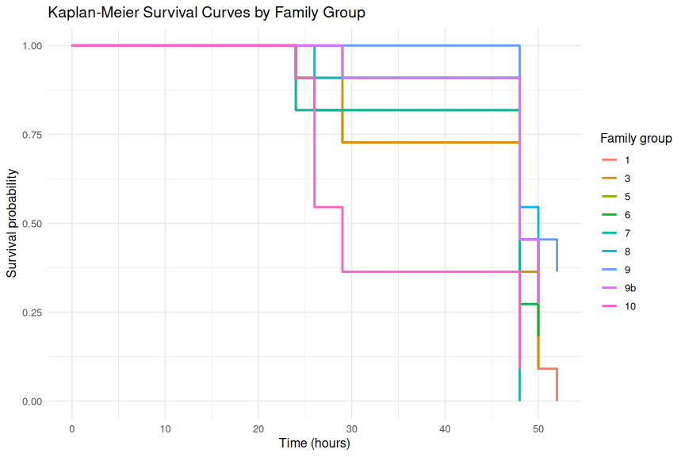

00.00-mgig-heat-survivorship-20260609
================
Sam White
2026-06-09

- [1 BACKGROUND](#1-background)
  - [1.1 SETUP](#11-setup)
    - [1.1.1 Load packages](#111-load-packages)
    - [1.1.2 Read in and view raw data](#112-read-in-and-view-raw-data)
  - [1.2 ANALYSIS](#12-analysis)
    - [1.2.1 Clean and standardize columns used for survival
      analysis](#121-clean-and-standardize-columns-used-for-survival-analysis)
    - [1.2.2 Reduce repeated observations to one survival row per
      individual](#122-reduce-repeated-observations-to-one-survival-row-per-individual)
    - [1.2.3 Create Surv object and fit Kaplan-Meier
      models](#123-create-surv-object-and-fit-kaplan-meier-models)
    - [1.2.4 Perform log-rank test to compare survival between
      families](#124-perform-log-rank-test-to-compare-survival-between-families)
    - [1.2.5 Pairwise log-rank tests with BH
      correction](#125-pairwise-log-rank-tests-with-bh-correction)
    - [1.2.6 Convert Kaplan-Meier fit to plotting data
      frames](#126-convert-kaplan-meier-fit-to-plotting-data-frames)
  - [1.3 PLOTS](#13-plots)
    - [1.3.1 Plot Kaplan-Meier curves](#131-plot-kaplan-meier-curves)

# 1 BACKGROUND

This is a Kaplan-Meier survival analysis of 36<sup>o</sup>C heat stress
of *Magallana gigas* oysters, [conducted on
20260609](https://github.com/RobertsLab/sormi-assay-development/tree/main/heat-survivorship/data/20260609-36C-USDA-families)
(GitHub repo) by Maddy Bernstein. It compares 9 different families
bred/selected by the USDA.

Oysters were distributed across nine 12-well plates and submerged in 4mL
of Instant Ocean (~15<sup>o</sup>C at beginning of experiment). Plates
were incubated at 36<sup>o</sup>C and periodically assessed for
mortalities over the course of 52hrs.

## 1.1 SETUP

### 1.1.1 Load packages

``` r
library(readr)
library(dplyr)
library(survival)
library(survminer)
library(ggplot2)

knitr::opts_chunk$set(
  echo = TRUE,         # Display code chunks
  eval = TRUE,        # Evaluate code chunks
  warning = FALSE,     # Hide warnings
  message = FALSE,     # Hide messages
  comment = "",         # Prevents appending '##' to beginning of lines in code output
  results = 'hold',    # Holds output so it's all printed together after code chunk
  fig.path = "../outputs/00.00-mgig-heat-survivorship-20260609/"
)
```

### 1.1.2 Read in and view raw data

``` r
survivorship_raw <- read_csv(
    "../data/20260609-36C-USDA-families/survivorship.csv",
    show_col_types = FALSE
)

# Preview newly created object
cat("\n=== survivorship_raw: str() ===\n")
str(survivorship_raw)
```

    === survivorship_raw: str() ===
    spc_tbl_ [756 × 11] (S3: spec_tbl_df/tbl_df/tbl/data.frame)
     $ plate_ID         : chr [1:756] "plate-A" "plate-A" "plate-A" "plate-A" ...
     $ plate_well       : chr [1:756] "A01" "A02" "A03" "A04" ...
     $ individual_id    : num [1:756] 1 2 3 4 5 6 7 8 9 10 ...
     $ familly_id.group : chr [1:756] "7" "9" "5" "6" ...
     $ is_blank         : logi [1:756] FALSE FALSE FALSE FALSE FALSE FALSE ...
     $ timepoint_count  : num [1:756] 0 0 0 0 0 0 0 0 0 0 ...
     $ timepoint_hrs    : num [1:756] 0 0 0 0 0 0 0 0 0 0 ...
     $ alive.measurement: logi [1:756] TRUE TRUE TRUE TRUE TRUE TRUE ...
     $ date             : num [1:756] 6092026 6092026 6092026 6092026 6092026 ...
     $ time             : 'hms' num [1:756] 12:35:00 12:35:00 12:35:00 12:35:00 ...
      ..- attr(*, "units")= chr "secs"
     $ notes            : logi [1:756] NA NA NA NA NA NA ...
     - attr(*, "spec")=
      .. cols(
      ..   plate_ID = col_character(),
      ..   plate_well = col_character(),
      ..   individual_id = col_double(),
      ..   familly_id.group = col_character(),
      ..   is_blank = col_logical(),
      ..   timepoint_count = col_double(),
      ..   timepoint_hrs = col_double(),
      ..   alive.measurement = col_logical(),
      ..   date = col_double(),
      ..   time = col_time(format = ""),
      ..   notes = col_logical()
      .. )
     - attr(*, "problems")=<pointer: 0x592d28171440> 

## 1.2 ANALYSIS

### 1.2.1 Clean and standardize columns used for survival analysis

``` r
survivorship_clean <- survivorship_raw %>%
    mutate(
        individual_id = as.character(individual_id),
        family_group = as.character(`familly_id.group`),
        timepoint_hrs = as.numeric(timepoint_hrs),
        alive_chr = toupper(trimws(as.character(`alive.measurement`))),
        alive = case_when(
            alive_chr %in% c("TRUE", "T", "1", "YES", "Y") ~ TRUE,
            alive_chr %in% c("FALSE", "F", "0", "NO", "N") ~ FALSE,
            TRUE ~ NA
        )
    ) %>%
    select(
        individual_id,
        family_group,
        timepoint_count,
        timepoint_hrs,
        alive,
        date,
        time,
        everything()
    )

# Preview newly created object
cat("\n=== survivorship_clean: str() ===\n")
str(survivorship_clean)
cat("\n=== survivorship_clean: summary(alive) ===\n")
summary(survivorship_clean$alive)
```

    === survivorship_clean: str() ===
    tibble [756 × 14] (S3: tbl_df/tbl/data.frame)
     $ individual_id    : chr [1:756] "1" "2" "3" "4" ...
     $ family_group     : chr [1:756] "7" "9" "5" "6" ...
     $ timepoint_count  : num [1:756] 0 0 0 0 0 0 0 0 0 0 ...
     $ timepoint_hrs    : num [1:756] 0 0 0 0 0 0 0 0 0 0 ...
     $ alive            : logi [1:756] TRUE TRUE TRUE TRUE TRUE TRUE ...
     $ date             : num [1:756] 6092026 6092026 6092026 6092026 6092026 ...
     $ time             : 'hms' num [1:756] 12:35:00 12:35:00 12:35:00 12:35:00 ...
      ..- attr(*, "units")= chr "secs"
     $ plate_ID         : chr [1:756] "plate-A" "plate-A" "plate-A" "plate-A" ...
     $ plate_well       : chr [1:756] "A01" "A02" "A03" "A04" ...
     $ familly_id.group : chr [1:756] "7" "9" "5" "6" ...
     $ is_blank         : logi [1:756] FALSE FALSE FALSE FALSE FALSE FALSE ...
     $ alive.measurement: logi [1:756] TRUE TRUE TRUE TRUE TRUE TRUE ...
     $ notes            : logi [1:756] NA NA NA NA NA NA ...
     $ alive_chr        : chr [1:756] "TRUE" "TRUE" "TRUE" "TRUE" ...

    === survivorship_clean: summary(alive) ===
       Mode   FALSE    TRUE     NAs 
    logical     265     428      63 

### 1.2.2 Reduce repeated observations to one survival row per individual

``` r
individual_survival <- survivorship_clean %>%
    filter(!is.na(individual_id), !is.na(timepoint_hrs), !is.na(alive)) %>%
    arrange(individual_id, timepoint_hrs) %>%
    group_by(individual_id) %>%
    summarise(
        family_group = first(family_group[!is.na(family_group)]),
        event = if_else(any(!alive), 1L, 0L),
        time_to_event = {
            if (any(!alive)) {
                min(timepoint_hrs[!alive])
            } else {
                max(timepoint_hrs)
            }
        },
        n_observations = n(),
        .groups = "drop"
    )

# Preview newly created object
cat("\n=== individual_survival: str() ===\n")
str(individual_survival)
cat("\n=== individual_survival: summary(time_to_event) ===\n")
summary(individual_survival$time_to_event)
cat("\n=== individual_survival: table(event) ===\n")
table(individual_survival$event)
```

    === individual_survival: str() ===
    tibble [99 × 5] (S3: tbl_df/tbl/data.frame)
     $ individual_id : chr [1:99] "1" "10" "11" "12" ...
     $ family_group  : chr [1:99] "7" "3" "7" "7" ...
     $ event         : int [1:99] 1 1 1 1 1 1 1 1 0 0 ...
     $ time_to_event : num [1:99] 48 50 48 48 48 48 48 26 52 52 ...
     $ n_observations: int [1:99] 7 7 7 7 7 7 7 7 7 7 ...

    === individual_survival: summary(time_to_event) ===
       Min. 1st Qu.  Median    Mean 3rd Qu.    Max. 
      24.00   48.00   48.00   44.72   50.00   52.00 

    === individual_survival: table(event) ===

     0  1 
    18 81 

### 1.2.3 Create Surv object and fit Kaplan-Meier models

``` r
surv_object <- with(individual_survival, Surv(time = time_to_event, event = event))

km_fit_overall <- survfit(surv_object ~ 1, data = individual_survival)
km_fit_by_family <- survfit(surv_object ~ family_group, data = individual_survival)

# Preview newly created objects
cat("\n=== km_fit_overall ===\n")
print(km_fit_overall)
cat("\n=== km_fit_by_family ===\n")
print(km_fit_by_family)
cat("\n=== km_fit_overall: str() ===\n")
str(km_fit_overall)
cat("\n=== km_fit_by_family: str() ===\n")
str(km_fit_by_family)
```

    === km_fit_overall ===
    Call: survfit(formula = surv_object ~ 1, data = individual_survival)

          n events median 0.95LCL 0.95UCL
    [1,] 99     81     48      48      48

    === km_fit_by_family ===
    Call: survfit(formula = surv_object ~ family_group, data = individual_survival)

                     n events median 0.95LCL 0.95UCL
    family_group=1  11     11     48      48      NA
    family_group=10 11     10     29      26      NA
    family_group=3  11     10     48      48      NA
    family_group=5  11      8     48      48      NA
    family_group=6  11      9     48      48      NA
    family_group=7  11     11     48      NA      NA
    family_group=8  11      7     50      48      NA
    family_group=9  11      7     48      48      NA
    family_group=9b 11      8     48      48      NA

    === km_fit_overall: str() ===
    List of 17
     $ n        : int 99
     $ time     : num [1:6] 24 26 29 48 50 52
     $ n.risk   : num [1:6] 99 92 86 79 34 20
     $ n.event  : num [1:6] 7 6 7 45 14 2
     $ n.censor : num [1:6] 0 0 0 0 0 18
     $ surv     : num [1:6] 0.929 0.869 0.798 0.343 0.202 ...
     $ std.err  : num [1:6] 0.0277 0.0391 0.0506 0.139 0.1997 ...
     $ cumhaz   : num [1:6] 0.0707 0.1359 0.2173 0.7869 1.1987 ...
     $ std.chaz : num [1:6] 0.0267 0.0377 0.0487 0.0979 0.1473 ...
     $ type     : chr "right"
     $ logse    : logi TRUE
     $ conf.int : num 0.95
     $ conf.type: chr "log"
     $ lower    : num [1:6] 0.88 0.805 0.723 0.262 0.137 ...
     $ upper    : num [1:6] 0.981 0.938 0.881 0.451 0.299 ...
     $ t0       : num 0
     $ call     : language survfit(formula = surv_object ~ 1, data = individual_survival)
     - attr(*, "class")= chr "survfit"

    === km_fit_by_family: str() ===
    List of 18
     $ n        : int [1:9] 11 11 11 11 11 11 11 11 11
     $ time     : num [1:36] 24 29 48 50 52 24 26 29 48 52 ...
     $ n.risk   : num [1:36] 11 9 8 5 1 11 10 6 4 1 ...
     $ n.event  : num [1:36] 2 1 3 4 1 1 4 2 3 0 ...
     $ n.censor : num [1:36] 0 0 0 0 0 0 0 0 0 1 ...
     $ surv     : num [1:36] 0.8182 0.7273 0.4545 0.0909 0 ...
     $ std.err  : num [1:36] 0.142 0.185 0.33 0.953 Inf ...
     $ cumhaz   : num [1:36] 0.182 0.293 0.668 1.468 2.468 ...
     $ std.chaz : num [1:36] 0.129 0.17 0.275 0.486 1.112 ...
     $ strata   : Named int [1:9] 5 5 5 4 5 2 4 2 4
      ..- attr(*, "names")= chr [1:9] "family_group=1" "family_group=10" "family_group=3" "family_group=5" ...
     $ type     : chr "right"
     $ logse    : logi TRUE
     $ conf.int : num 0.95
     $ conf.type: chr "log"
     $ lower    : num [1:36] 0.619 0.506 0.238 0.014 NA ...
     $ upper    : num [1:36] 1 1 0.868 0.589 NA ...
     $ t0       : num 0
     $ call     : language survfit(formula = surv_object ~ family_group, data = individual_survival)
     - attr(*, "class")= chr "survfit"

### 1.2.4 Perform log-rank test to compare survival between families

``` r
logrank_test <- survdiff(surv_object ~ family_group, data = individual_survival)

# Display test results
cat("\n=== Log-rank test: survdiff() output ===\n")
print(logrank_test)

# Extract and report key statistics
cat("\n=== Log-Rank Test Summary ===\n")
cat("Chi-square statistic:", logrank_test$chisq, "\n")
cat("Degrees of freedom:", length(logrank_test$n) - 1, "\n")
cat("p-value:", 1 - pchisq(logrank_test$chisq, df = length(logrank_test$n) - 1), "\n")
cat("\nInterpretation:\n")
p_val <- 1 - pchisq(logrank_test$chisq, df = length(logrank_test$n) - 1)
if (p_val < 0.05) {
  cat("p < 0.05: Family groups show SIGNIFICANTLY DIFFERENT survival (reject null hypothesis)\n")
} else {
  cat("p >= 0.05: No significant difference in survival detected between family groups\n")
}
```

    === Log-rank test: survdiff() output ===
    Call:
    survdiff(formula = surv_object ~ family_group, data = individual_survival)

                     N Observed Expected (O-E)^2/E (O-E)^2/V
    family_group=1  11       11     8.81   0.54267    1.0179
    family_group=10 11       10     4.71   5.94644    9.6692
    family_group=3  11       10     8.55   0.24667    0.4561
    family_group=5  11        8    10.45   0.57256    1.0981
    family_group=6  11        9     8.72   0.00871    0.0164
    family_group=7  11       11     7.22   1.97389    3.8135
    family_group=8  11        7    10.88   1.38128    2.6734
    family_group=9  11        7    11.22   1.58425    3.0942
    family_group=9b 11        8    10.45   0.57256    1.0981

     Chisq= 21.1  on 8 degrees of freedom, p= 0.007 

    === Log-Rank Test Summary ===
    Chi-square statistic: 21.122 
    Degrees of freedom: 8 
    p-value: 0.006830309 

    Interpretation:
    p < 0.05: Family groups show SIGNIFICANTLY DIFFERENT survival (reject null hypothesis)

### 1.2.5 Pairwise log-rank tests with BH correction

``` r
pairwise_results <- pairwise_survdiff(
    Surv(time_to_event, event) ~ family_group,
    data = individual_survival,
    p.adjust.method = "BH"
)

cat("\n=== Pairwise log-rank test (BH-adjusted p-values) ===\n")
print(pairwise_results)

# Extract and display only significant pairs
p_mat <- pairwise_results$p.value
sig_pairs <- which(p_mat <= 0.05, arr.ind = TRUE)

cat("\n=== Significant pairwise comparisons (BH-adjusted p <= 0.05) ===\n")
if (nrow(sig_pairs) == 0) {
    cat("No significant pairwise differences found.\n")
} else {
    sig_df <- data.frame(
        group1      = rownames(p_mat)[sig_pairs[, 1]],
        group2      = colnames(p_mat)[sig_pairs[, 2]],
        p_adjusted  = p_mat[sig_pairs]
    )
    print(sig_df)
}
```

    === Pairwise log-rank test (BH-adjusted p-values) ===

        Pairwise comparisons using Log-Rank test 

    data:  individual_survival and family_group 

       1     10    3     5     6     7     8     9    
    10 0.383 -     -     -     -     -     -     -    
    3  0.940 0.337 -     -     -     -     -     -    
    5  0.369 0.099 0.383 -     -     -     -     -    
    6  0.758 0.315 0.856 0.574 -     -     -     -    
    7  0.337 0.372 0.383 0.112 0.383 -     -     -    
    8  0.264 0.099 0.337 0.762 0.383 0.099 -     -    
    9  0.167 0.099 0.264 0.694 0.369 0.099 0.940 -    
    9b 0.369 0.099 0.383 1.000 0.574 0.112 0.762 0.694

    P value adjustment method: BH 

    === Significant pairwise comparisons (BH-adjusted p <= 0.05) ===
    No significant pairwise differences found.

### 1.2.6 Convert Kaplan-Meier fit to plotting data frames

``` r
km_overall_df <- bind_rows(
    data.frame(
        time = 0,
        surv = 1,
        n_risk = km_fit_overall$n,
        n_event = 0,
        n_censor = 0
    ),
    summary(km_fit_overall) %>%
        with(
            data.frame(
                time = time,
                surv = surv,
                n_risk = n.risk,
                n_event = n.event,
                n_censor = n.censor
            )
        )
) %>%
    arrange(time)

km_family_df <- bind_rows(
    data.frame(
        time = 0,
        surv = 1,
        n_risk = as.numeric(km_fit_by_family$n),
        n_event = 0,
        n_censor = 0,
        strata = names(km_fit_by_family$strata)
    ),
    summary(km_fit_by_family) %>%
        with(
            data.frame(
                time = time,
                surv = surv,
                n_risk = n.risk,
                n_event = n.event,
                n_censor = n.censor,
                strata = strata
            )
        )
) %>%
    mutate(family_group = sub("^family_group=", "", strata)) %>%
    arrange(family_group, time)

# Preview newly created objects
cat("\n=== km_overall_df: head() ===\n")
print(head(km_overall_df))
cat("\n=== km_overall_df: str() ===\n")
str(km_overall_df)

cat("\n=== km_family_df: head() ===\n")
print(head(km_family_df))
cat("\n=== km_family_df: str() ===\n")
str(km_family_df)
```

    === km_overall_df: head() ===
      time      surv n_risk n_event n_censor
    1    0 1.0000000     99       0        0
    2   24 0.9292929     99       7        0
    3   26 0.8686869     92       6        0
    4   29 0.7979798     86       7        0
    5   48 0.3434343     79      45        0
    6   50 0.2020202     34      14        0

    === km_overall_df: str() ===
    'data.frame':   7 obs. of  5 variables:
     $ time    : num  0 24 26 29 48 50 52
     $ surv    : num  1 0.929 0.869 0.798 0.343 ...
     $ n_risk  : num  99 99 92 86 79 34 20
     $ n_event : num  0 7 6 7 45 14 2
     $ n_censor: num  0 0 0 0 0 0 18

    === km_family_df: head() ===
      time       surv n_risk n_event n_censor         strata family_group
    1    0 1.00000000     11       0        0 family_group=1            1
    2   24 0.81818182     11       2        0 family_group=1            1
    3   29 0.72727273      9       1        0 family_group=1            1
    4   48 0.45454545      8       3        0 family_group=1            1
    5   50 0.09090909      5       4        0 family_group=1            1
    6   52 0.00000000      1       1        0 family_group=1            1

    === km_family_df: str() ===
    'data.frame':   39 obs. of  7 variables:
     $ time        : num  0 24 29 48 50 52 0 24 26 29 ...
     $ surv        : num  1 0.8182 0.7273 0.4545 0.0909 ...
     $ n_risk      : num  11 11 9 8 5 1 11 11 10 6 ...
     $ n_event     : num  0 2 1 3 4 1 0 1 4 2 ...
     $ n_censor    : num  0 0 0 0 0 0 0 0 0 0 ...
     $ strata      : chr  "family_group=1" "family_group=1" "family_group=1" "family_group=1" ...
     $ family_group: chr  "1" "1" "1" "1" ...

## 1.3 PLOTS

### 1.3.1 Plot Kaplan-Meier curves

#### 1.3.1.1 Families

``` r
family_levels <- local({
    lvls <- unique(km_family_df$family_group)
    lvls[order(readr::parse_number(lvls), lvls)]
})

ggplot(
    km_family_df %>% mutate(family_group = factor(family_group, levels = family_levels)),
    aes(x = time, y = surv, color = family_group)
) +
    geom_step(linewidth = 1.0) +
    labs(
        title = "Kaplan-Meier Survival Curves by Family Group",
        x = "Time (hours)",
        y = "Survival probability",
        color = "Family group"
    ) +
    ylim(0, 1) +
    theme_minimal(base_size = 12)
```

<!-- -->
