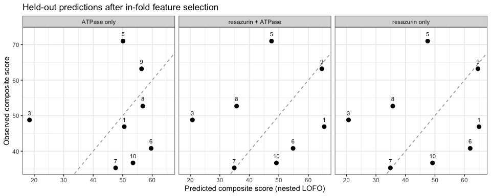
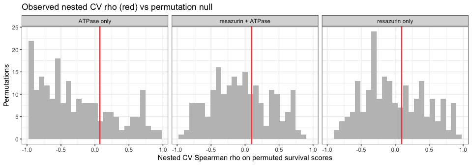
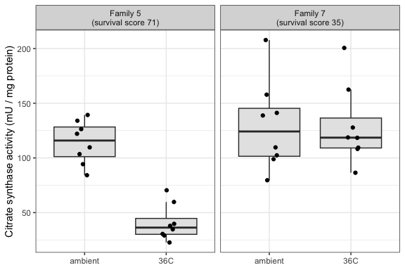

01-multi-assay-family-survival-prediction
================
Steven Roberts
2026-10-02

-   [Goal](#goal)
-   [Data](#data)
    -   [Survival](#survival)
    -   [Resazurin](#resazurin)
    -   [Na/K-ATPase](#nak-atpase)
    -   [Citrate synthase](#citrate-synthase)
    -   [Combined family × predictor
        matrix](#combined-family--predictor-matrix)
-   [Methods](#methods)
-   [Apparent fit: best combinations by exhaustive
    search](#apparent-fit-best-combinations-by-exhaustive-search)
-   [Honest performance: nested
    cross-validation](#honest-performance-nested-cross-validation)
-   [Sensitivity: 9 families](#sensitivity-9-families)
-   [Citrate synthase (families 5 and 7
    only)](#citrate-synthase-families-5-and-7-only)
-   [Conclusions](#conclusions)

# Goal

Integrate family-level resazurin, Na<sup>+</sup>/K<sup>+</sup>-ATPase
and citrate synthase data to find the combination of measures that best
predicts family survival.

**Survival target:** `composite_score` from the cross-experiment
survival summary (mean within-experiment survival percentile, 0-100,
higher = hardier).

**The main constraint is sample size.** Survival is a family-level
phenotype and there are at most 9 families, against \~180 candidate
predictors. Picking the best combination from that many candidates will
always find something that fits 9 points well, so this notebook
separates two things:

1.  **Apparent fit**: the best combinations found by exhaustive search,
    scored by leave-one-family-out (LOFO) cross-validation. This is
    optimistic because the same data chose the features.
2.  **Honest performance**: *nested* LOFO cross-validation, where
    feature selection is repeated inside each training fold, plus a
    permutation test that runs the whole selection procedure on shuffled
    survival scores.

# Data

## Survival

``` r
survival <- read_csv(
  "../../heat-survivorship/outputs/09-mgig-survivorship-cross-experiment-summary/family_ranking.csv",
  col_types = cols(family = col_character())
) %>%
  select(family, composite_score, mean_surv_prop, n_experiments)

knitr::kable(survival)
```

| family | composite\_score | mean\_surv\_prop | n\_experiments |
|:-------|-----------------:|-----------------:|---------------:|
| 5      |             71.0 |            0.329 |              7 |
| 9      |             63.2 |            0.346 |              5 |
| 2      |             59.0 |            0.356 |              5 |
| 8      |             52.7 |            0.190 |              7 |
| 3      |             48.8 |            0.218 |              7 |
| 1      |             46.9 |            0.219 |              7 |
| 6      |             40.8 |            0.186 |              7 |
| 10     |             36.7 |            0.185 |              7 |
| 7      |             35.3 |            0.168 |              6 |

## Resazurin

Family-mean curve features from
`Resazurin/code/04-resazurin-family-phenotype-prediction.Rmd`, for each
stress context (`all`, `sw_heat`, `fw_heat`, `freshwater_rt`) and value
metric (`corrected_fc`, `metabolism_per_area_mm2_measurement`).
Bookkeeping columns (`cup_id_group`, `round_group`) are dropped.

``` r
resazurin_long <- read_csv(
  "../../Resazurin/outputs/04-resazurin-family-phenotype-prediction/family_feature_matrix.csv",
  col_types = cols(family = col_character())
) %>%
  filter(!feature %in% c("cup_id_group", "round_group")) %>%
  mutate(metric = recode(value_metric,
                         corrected_fc = "fc",
                         metabolism_per_area_mm2_measurement = "area"),
         predictor = paste("rz", context, metric, feature, sep = "."))

resazurin <- resazurin_long %>%
  select(family, predictor, family_mean) %>%
  pivot_wider(names_from = predictor, values_from = family_mean)

resazurin_long %>%
  group_by(context) %>%
  summarise(families = paste(sort(as.integer(unique(family))), collapse = ","),
            n_predictors = n_distinct(predictor), .groups = "drop") %>%
  knitr::kable()
```

| context        | families           | n\_predictors |
|:---------------|:-------------------|--------------:|
| all            | 1,2,3,5,6,7,8,9,10 |            44 |
| freshwater\_rt | 1,3,5,6,7,8,9,10   |            44 |
| fw\_heat       | 1,3,5,6,7,8,9,10   |            44 |
| sw\_heat       | 1,2,3,5,6,7,8,9,10 |            44 |

The freshwater contexts have no family 2.

## Na/K-ATPase

Family medians of gill ATPase activity from the June 2026 sampling (see
`NaK-ATPase/code/02-NaK-ATPase-vs-family-survival.Rmd`).

``` r
atpase_raw <- read_tsv("../../NaK-ATPase/data/202606-sampling.tsv") %>%
  rename(ATPase = `ATPase (umol ADP/mg protein/hr)`) %>%
  left_join(read_csv("../../sampling-event-metadata/june-2026/sampling-log.csv") %>%
              select(`Tube ID`, Condition, `Oyster Family ID`),
            by = "Tube ID") %>%
  mutate(family = str_remove(`Oyster Family ID`, "Family "))

stopifnot(!any(is.na(atpase_raw$Condition)))

atpase <- atpase_raw %>%
  group_by(family) %>%
  summarise(
    atp.ambient   = median(ATPase[Condition == "Ambient"]),
    atp.heat      = median(ATPase[Condition == "36C"]),
    atp.log2ratio = log2(atp.heat / atp.ambient),
    .groups = "drop"
  )

knitr::kable(atpase, digits = 3)
```

| family | atp.ambient | atp.heat | atp.log2ratio |
|:-------|------------:|---------:|--------------:|
| 1      |       5.136 |    3.825 |        -0.425 |
| 10     |       5.480 |    3.743 |        -0.550 |
| 2      |       3.972 |    4.331 |         0.125 |
| 3      |       5.445 |    4.639 |        -0.231 |
| 5      |       3.384 |    3.556 |         0.072 |
| 6      |       3.657 |    4.446 |         0.282 |
| 7      |       4.272 |    4.144 |        -0.044 |
| 8      |       3.841 |    3.419 |        -0.168 |
| 9      |       4.013 |    3.195 |        -0.329 |

## Citrate synthase

Citrate synthase has only been assayed in families 5 and 7, so it cannot
enter a family-level model. It is summarized descriptively at the end.

``` r
cs <- read_csv(
  "../../Citrate_synthase/outputs/Gen5-20260825-mgig-sormi-citrate_synthase-F05-F07-temperature-comparison/cs_activity_all_families_no_background.csv"
) %>%
  filter(QC == "usable") %>%
  mutate(family = str_remove(Family, "^F0?"))

count(cs, family, Temperature)
```

    ## # A tibble: 4 x 3
    ##   family Temperature     n
    ##   <chr>  <chr>       <int>
    ## 1 5      36C             8
    ## 2 5      ambient         8
    ## 3 7      36C             8
    ## 4 7      ambient         8

## Combined family × predictor matrix

``` r
fam_data <- survival %>%
  inner_join(resazurin, by = "family") %>%
  inner_join(atpase, by = "family")

predictor_cols <- setdiff(names(fam_data), names(survival))

# drop predictors that are constant, and exact duplicates (e.g. timing features
# are identical for the fc and per-area metrics)
predictor_cols <- predictor_cols[map_lgl(predictor_cols, function(p) {
  x <- fam_data[[p]]
  sum(!is.na(x)) >= 8 && sd(x, na.rm = TRUE) > 0
})]
dup <- duplicated(as.list(fam_data[predictor_cols]))
predictor_cols <- predictor_cols[!dup]

tibble(source = if_else(str_starts(predictor_cols, "atp"), "ATPase", "resazurin")) %>%
  count(source) %>%
  knitr::kable(caption = "Candidate predictors after removing constant and duplicate columns")
```

| source    |   n |
|:----------|----:|
| ATPase    |   3 |
| resazurin | 162 |

Candidate predictors after removing constant and duplicate columns

Two family sets are analysed:

-   **Primary (8 families):** families 1, 3, 5, 6, 7, 8, 9, 10, which
    have every predictor, including the freshwater contexts.
-   **Sensitivity (9 families):** adds family 2, restricted to
    predictors measured in all 9 families (resazurin `all` and `sw_heat`
    contexts, plus ATPase).

``` r
complete_cols <- predictor_cols[map_lgl(predictor_cols, ~ !anyNA(fam_data[[.x]]))]

primary <- fam_data %>%
  filter(if_all(all_of(predictor_cols), ~ !is.na(.x)))
sensitivity <- fam_data

c(primary_families = nrow(primary), primary_predictors = length(predictor_cols),
  sensitivity_families = nrow(sensitivity), sensitivity_predictors = length(complete_cols))
```

    ##       primary_families     primary_predictors   sensitivity_families 
    ##                      8                    165                      9 
    ## sensitivity_predictors 
    ##                     85

# Methods

All models are ordinary linear regressions of `composite_score` on 1-3
predictors. Leave-one-out prediction errors are computed exactly from
the hat matrix, so every candidate model can be scored without
refitting.

``` r
# Leave-one-out residuals for lm(y ~ X) via the hat matrix
loo_resid <- function(X, y) {
  X <- cbind(1, X)
  q <- qr(X)
  if (q$rank < ncol(X)) return(rep(NA_real_, length(y)))
  e <- qr.resid(q, y)
  h <- rowSums(qr.Q(q)^2)
  if (any(h > 1 - 1e-8)) return(rep(NA_real_, length(y)))
  e / (1 - h)
}

loo_rmse <- function(X, y) sqrt(mean(loo_resid(X, y)^2))

# Forward selection of up to k_max predictors, each step adding the predictor
# that minimises LOO RMSE; final size chosen by LOO RMSE.
select_model <- function(Xall, y, k_max = 3) {
  chosen <- character(0)
  path <- list()
  for (k in seq_len(k_max)) {
    cand <- setdiff(colnames(Xall), chosen)
    scores <- vapply(cand, function(p) loo_rmse(Xall[, c(chosen, p), drop = FALSE], y), numeric(1))
    if (all(is.na(scores))) break
    chosen <- c(chosen, cand[which.min(scores)])
    path[[k]] <- list(vars = chosen, rmse = min(scores, na.rm = TRUE))
  }
  path[[which.min(map_dbl(path, "rmse"))]]$vars
}

# Nested LOFO CV: selection is redone within each training fold
nested_cv <- function(Xall, y, k_max = 3) {
  n <- length(y)
  sel <- vector("list", n)
  pred <- numeric(n)
  for (i in seq_len(n)) {
    vars <- select_model(Xall[-i, , drop = FALSE], y[-i], k_max)
    fit <- lm.fit(cbind(1, Xall[-i, vars, drop = FALSE]), y[-i])
    pred[i] <- sum(c(1, Xall[i, vars]) * fit$coefficients)
    sel[[i]] <- vars
  }
  list(pred = pred,
       rho = cor(pred, y, method = "spearman"),
       rmse = sqrt(mean((pred - y)^2)),
       selected = sel)
}

# Permutation test of the whole nested procedure
perm_test <- function(Xall, y, observed_rho, n_perm = 200, k_max = 3) {
  null <- replicate(n_perm, nested_cv(Xall, sample(y), k_max)$rho)
  list(null = null, p = (sum(null >= observed_rho) + 1) / (n_perm + 1))
}

# Exhaustive search over all combinations of size k
exhaustive <- function(Xall, y, k) {
  combos <- combn(ncol(Xall), k)
  scores <- apply(combos, 2, function(v) {
    r <- loo_resid(Xall[, v, drop = FALSE], y)
    if (anyNA(r)) return(c(NA_real_, NA_real_))
    c(sqrt(mean(r^2)), cor(y - r, y, method = "spearman"))
  })
  tibble(k = k,
         predictors = apply(combos, 2, function(v) paste(colnames(Xall)[v], collapse = " + ")),
         loo_rmse = scores[1, ],
         loo_rho = scores[2, ]) %>%
    filter(!is.na(loo_rmse)) %>%
    arrange(loo_rmse)
}

as_matrix <- function(df, cols) {
  m <- scale(as.matrix(df[cols]))
  rownames(m) <- df$family
  m
}
```

# Apparent fit: best combinations by exhaustive search

Primary 8-family set. Predictors are z-scored, so the null model
(predicting the training mean) has LOO RMSE of about 13.5.

``` r
X_primary <- as_matrix(primary, predictor_cols)
y_primary <- primary$composite_score

search <- bind_rows(
  exhaustive(X_primary, y_primary, 1),
  exhaustive(X_primary, y_primary, 2),
  exhaustive(X_primary, y_primary, 3)
) %>%
  mutate(includes_atpase = str_detect(predictors, "atp\\."),
         includes_resazurin = str_detect(predictors, "rz\\."))

write_csv(search %>% group_by(k) %>% slice_min(loo_rmse, n = 100),
          file.path(out_dir, "exhaustive_search_top100_per_k.csv"))

search %>%
  group_by(k) %>%
  slice_min(loo_rmse, n = 5) %>%
  ungroup() %>%
  select(k, predictors, loo_rmse, loo_rho) %>%
  knitr::kable(digits = 3, caption = "Top 5 combinations of each size (LOFO CV, optimistic)")
```

|   k | predictors                                                                                                        | loo\_rmse | loo\_rho |
|----:|:------------------------------------------------------------------------------------------------------------------|----------:|---------:|
|   1 | rz.all.area.trough\_value                                                                                         |     7.664 |    0.643 |
|   1 | rz.fw\_heat.fc.time\_to\_min\_slope                                                                               |     7.698 |    0.810 |
|   1 | rz.freshwater\_rt.area.inflection\_time                                                                           |     7.956 |    0.667 |
|   1 | rz.freshwater\_rt.area.initial\_slope                                                                             |     8.011 |    0.667 |
|   1 | rz.all.fc.inflection\_time                                                                                        |     8.054 |    0.667 |
|   2 | rz.fw\_heat.fc.time\_to\_min\_slope + rz.sw\_heat.area.late\_early\_auc\_ratio                                    |     2.305 |    1.000 |
|   2 | rz.fw\_heat.fc.time\_to\_min\_slope + rz.sw\_heat.fc.late\_early\_auc\_ratio                                      |     2.305 |    1.000 |
|   2 | rz.fw\_heat.fc.time\_to\_min\_slope + rz.sw\_heat.area.trough\_value                                              |     2.685 |    0.952 |
|   2 | rz.all.area.inflection\_time + rz.fw\_heat.fc.time\_to\_min\_slope                                                |     3.058 |    0.976 |
|   2 | rz.all.fc.inflection\_time + rz.all.fc.time\_to\_vmax                                                             |     3.072 |    0.952 |
|   3 | rz.all.fc.inflection\_time + rz.all.area.time\_to\_vmax + rz.freshwater\_rt.fc.min\_slope                         |     0.595 |    1.000 |
|   3 | rz.freshwater\_rt.fc.time\_to\_peak + rz.freshwater\_rt.area.stability\_cv + rz.fw\_heat.fc.initial\_slope        |     0.643 |    1.000 |
|   3 | rz.all.area.time\_to\_peak + rz.fw\_heat.fc.time\_to\_min\_slope + rz.sw\_heat.area.trough\_value                 |     0.711 |    1.000 |
|   3 | rz.fw\_heat.fc.time\_to\_min\_slope + rz.sw\_heat.fc.auc\_total + rz.sw\_heat.area.delta\_auc\_late\_minus\_early |     0.817 |    1.000 |
|   3 | rz.freshwater\_rt.fc.stability\_cv + rz.freshwater\_rt.fc.time\_to\_peak + rz.fw\_heat.fc.initial\_slope          |     0.839 |    1.000 |

Top 5 combinations of each size (LOFO CV, optimistic)

How often each predictor appears among the 50 best 2- and 3-predictor
combinations shows which measures recur, rather than relying on a single
winner.

``` r
recurring <- search %>%
  filter(k > 1) %>%
  group_by(k) %>%
  slice_min(loo_rmse, n = 50) %>%
  ungroup() %>%
  separate_rows(predictors, sep = " \\+ ") %>%
  count(predictors, name = "n_top_models", sort = TRUE)

write_csv(recurring, file.path(out_dir, "recurring_predictors.csv"))
knitr::kable(head(recurring, 15))
```

| predictors                                    | n\_top\_models |
|:----------------------------------------------|---------------:|
| rz.fw\_heat.fc.time\_to\_min\_slope           |             31 |
| rz.all.fc.inflection\_time                    |             28 |
| rz.sw\_heat.area.late\_early\_auc\_ratio      |             13 |
| rz.sw\_heat.fc.late\_early\_auc\_ratio        |             13 |
| rz.freshwater\_rt.fc.time\_to\_peak           |              9 |
| rz.freshwater\_rt.fc.inflection\_time         |              7 |
| rz.fw\_heat.area.resilience\_ratio            |              7 |
| rz.fw\_heat.fc.initial\_slope                 |              7 |
| rz.fw\_heat.fc.resilience\_ratio              |              7 |
| rz.all.area.inflection\_time                  |              6 |
| rz.fw\_heat.area.metabolic\_depression\_index |              6 |
| rz.fw\_heat.fc.metabolic\_depression\_index   |              6 |
| rz.all.area.final\_delta                      |              5 |
| rz.all.area.final\_value                      |              5 |
| rz.all.area.metabolic\_scope                  |              5 |

``` r
search %>%
  mutate(source = case_when(
    includes_atpase & includes_resazurin ~ "resazurin + ATPase",
    includes_atpase ~ "ATPase only",
    TRUE ~ "resazurin only")) %>%
  group_by(source, k) %>%
  slice_min(loo_rmse, n = 1, with_ties = FALSE) %>%
  ungroup() %>%
  select(source, k, predictors, loo_rmse, loo_rho) %>%
  arrange(k, loo_rmse) %>%
  knitr::kable(digits = 3, caption = "Best combination by data source and size")
```

| source             |   k | predictors                                                                                | loo\_rmse | loo\_rho |
|:-------------------|----:|:------------------------------------------------------------------------------------------|----------:|---------:|
| resazurin only     |   1 | rz.all.area.trough\_value                                                                 |     7.664 |    0.643 |
| ATPase only        |   1 | atp.heat                                                                                  |    12.770 |    0.310 |
| resazurin only     |   2 | rz.fw\_heat.fc.time\_to\_min\_slope + rz.sw\_heat.area.late\_early\_auc\_ratio            |     2.305 |    1.000 |
| resazurin + ATPase |   2 | rz.all.area.inflection\_time + atp.ambient                                                |     6.440 |    0.595 |
| ATPase only        |   2 | atp.ambient + atp.log2ratio                                                               |    15.447 |    0.381 |
| resazurin only     |   3 | rz.all.fc.inflection\_time + rz.all.area.time\_to\_vmax + rz.freshwater\_rt.fc.min\_slope |     0.595 |    1.000 |
| resazurin + ATPase |   3 | rz.all.fc.inflection\_time + rz.all.fc.time\_to\_vmax + atp.heat                          |     1.638 |    1.000 |
| ATPase only        |   3 | atp.ambient + atp.heat + atp.log2ratio                                                    |    23.165 |   -0.548 |

Best combination by data source and size

# Honest performance: nested cross-validation

For each predictor pool, forward selection (up to 3 predictors) is rerun
inside every training fold, the held-out family is predicted, and the
procedure is repeated on 200 permutations of the survival scores.

``` r
pools <- list(
  "ATPase only"        = str_subset(predictor_cols, "^atp\\."),
  "resazurin only"     = str_subset(predictor_cols, "^rz\\."),
  "resazurin + ATPase" = predictor_cols
)

nested <- imap_dfr(pools, function(cols, pool) {
  X <- as_matrix(primary, cols)
  cv <- nested_cv(X, y_primary)
  pt <- perm_test(X, y_primary, cv$rho)
  sel <- table(unlist(cv$selected))
  tibble(pool = pool, n_predictors = length(cols),
         nested_rho = cv$rho, nested_rmse = cv$rmse, perm_p = pt$p,
         most_selected = paste(names(sort(sel, decreasing = TRUE))[1:min(3, length(sel))],
                               collapse = "; "),
         pred = list(tibble(family = primary$family, observed = y_primary, predicted = cv$pred)),
         null = list(pt$null))
})

write_csv(nested %>% select(-pred, -null), file.path(out_dir, "nested_cv_performance.csv"))

nested %>%
  select(pool, n_predictors, nested_rho, nested_rmse, perm_p, most_selected) %>%
  knitr::kable(digits = 3, caption = "Nested LOFO CV, primary 8-family set")
```

| pool               | n\_predictors | nested\_rho | nested\_rmse | perm\_p | most\_selected                                                                                          |
|:-------------------|--------------:|------------:|-------------:|--------:|:--------------------------------------------------------------------------------------------------------|
| ATPase only        |             3 |       0.071 |       16.673 |   0.269 | atp.heat; atp.ambient; atp.log2ratio                                                                    |
| resazurin only     |           162 |       0.095 |       17.883 |   0.398 | rz.all.area.trough\_value; rz.freshwater\_rt.area.initial\_slope; rz.freshwater\_rt.fc.min\_slope       |
| resazurin + ATPase |           165 |       0.095 |       17.046 |   0.353 | rz.all.area.trough\_value; rz.freshwater\_rt.area.initial\_slope; rz.freshwater\_rt.area.time\_to\_peak |

Nested LOFO CV, primary 8-family set

``` r
nested %>%
  select(pool, pred) %>%
  unnest(pred) %>%
  ggplot(aes(x = predicted, y = observed)) +
  geom_abline(linetype = "dashed", colour = "grey60") +
  geom_point(size = 2.5) +
  geom_text(aes(label = family), nudge_y = 2, size = 3) +
  facet_wrap(~ pool) +
  labs(x = "Predicted composite score (nested LOFO)",
       y = "Observed composite score",
       title = "Held-out predictions after in-fold feature selection") +
  theme_bw()
```

<!-- -->

``` r
nested %>%
  select(pool, nested_rho, null) %>%
  unnest(null) %>%
  ggplot(aes(x = null)) +
  geom_histogram(bins = 25, fill = "grey75") +
  geom_vline(aes(xintercept = nested_rho), colour = "#E45756", linewidth = 1) +
  facet_wrap(~ pool) +
  labs(x = "Nested CV Spearman rho on permuted survival scores",
       y = "Permutations",
       title = "Observed nested CV rho (red) vs permutation null") +
  theme_bw()
```

<!-- -->

# Sensitivity: 9 families

Adds family 2 and restricts to predictors measured in all 9 families.

``` r
pools9 <- map(pools, ~ intersect(.x, complete_cols))
y9 <- sensitivity$composite_score

nested9 <- imap_dfr(pools9, function(cols, pool) {
  X <- as_matrix(sensitivity, cols)
  cv <- nested_cv(X, y9)
  pt <- perm_test(X, y9, cv$rho)
  sel <- table(unlist(cv$selected))
  tibble(pool = pool, n_predictors = length(cols),
         nested_rho = cv$rho, nested_rmse = cv$rmse, perm_p = pt$p,
         most_selected = paste(names(sort(sel, decreasing = TRUE))[1:min(3, length(sel))],
                               collapse = "; "))
})

write_csv(nested9, file.path(out_dir, "nested_cv_performance_9_families.csv"))
knitr::kable(nested9, digits = 3, caption = "Nested LOFO CV, 9-family set")
```

| pool               | n\_predictors | nested\_rho | nested\_rmse | perm\_p | most\_selected                                                                          |
|:-------------------|--------------:|------------:|-------------:|--------:|:----------------------------------------------------------------------------------------|
| ATPase only        |             3 |      -0.567 |       19.925 |   0.652 | atp.ambient; atp.heat; atp.log2ratio                                                    |
| resazurin only     |            82 |       0.683 |       12.407 |   0.045 | rz.all.area.trough\_value; rz.sw\_heat.fc.time\_to\_peak; rz.sw\_heat.fc.time\_to\_vmax |
| resazurin + ATPase |            85 |       0.683 |       12.407 |   0.060 | rz.all.area.trough\_value; rz.sw\_heat.fc.time\_to\_peak; rz.sw\_heat.fc.time\_to\_vmax |

Nested LOFO CV, 9-family set

# Citrate synthase (families 5 and 7 only)

``` r
cs_summary <- cs %>%
  group_by(family, Temperature) %>%
  summarise(median_activity = median(`Activity, no BG (mU/mg)`), n = n(), .groups = "drop") %>%
  pivot_wider(names_from = Temperature, values_from = c(median_activity, n)) %>%
  mutate(log2_36C_vs_ambient = log2(median_activity_36C / median_activity_ambient)) %>%
  left_join(survival %>% select(family, composite_score), by = "family")

knitr::kable(cs_summary, digits = 2)
```

| family | median\_activity\_36C | median\_activity\_ambient | n\_36C | n\_ambient | log2\_36C\_vs\_ambient | composite\_score |
|:-------|----------------------:|--------------------------:|-------:|-----------:|-----------------------:|-----------------:|
| 5      |                 36.30 |                     115.9 |      8 |          8 |                  -1.67 |             71.0 |
| 7      |                118.55 |                     124.2 |      8 |          8 |                  -0.07 |             35.3 |

``` r
cs %>%
  left_join(survival, by = "family") %>%
  mutate(family_label = sprintf("Family %s\n(survival score %.0f)", family, composite_score),
         Temperature = factor(Temperature, levels = c("ambient", "36C"))) %>%
  ggplot(aes(x = Temperature, y = `Activity, no BG (mU/mg)`)) +
  geom_boxplot(outlier.shape = NA, fill = "grey90") +
  geom_jitter(width = 0.1, size = 1.5) +
  facet_wrap(~ family_label) +
  labs(y = "Citrate synthase activity (mU / mg protein)", x = NULL) +
  theme_bw()
```

<!-- -->

# Conclusions

-   **Apparent fits are perfect, and that is the warning sign.**
    Exhaustive search finds 2-predictor resazurin combinations with LOFO
    Spearman rho = 1.0 and 3-predictor combinations with LOFO RMSE under
    1 point. With 162 resazurin predictors and 8 families, that many
    combinations will always contain near-perfect fits by chance.
-   **Under nested cross-validation the combinations do not hold up.**
    When selection is redone inside each fold (8 families), held-out
    predictions are essentially uncorrelated with survival (rho about
    0.1 for every pool), RMSE (17-18) is worse than predicting the mean
    (about 13.5), and none beats the permutation null (p 0.27-0.40). The
    selected predictors change from fold to fold.
-   **Adding ATPase does not help.** ATPase alone does not predict
    survival, and resazurin + ATPase performs the same as resazurin
    alone; ATPase rarely enters the selected models.
-   **The 9-family sensitivity analysis is more encouraging for
    resazurin.** With family 2 included and only `all`/`sw_heat`
    resazurin features, nested rho is 0.68 (permutation p = 0.045),
    driven mainly by `rz.all.area.trough_value` (family-mean minimum
    per-area resazurin signal), but RMSE (12.4) is only slightly better
    than the mean. This is the most promising lead, not a validated
    predictor.
-   **Recurring resazurin timing features** (`fw_heat`
    `time_to_min_slope`, `all` `inflection_time`) appear most often
    among top combinations and are worth targeting in future
    experiments.
-   **Citrate synthase** is the most striking contrast but covers only
    two families: the hardiest family (5) cuts CS activity by about 70%
    at 36C (log2 change -1.67), while the least hardy (7) does not
    change. Assaying CS in the remaining families is the clearest next
    step for testing whether metabolic down-regulation under heat
    predicts survival.

Bottom line: no combination of the current resazurin and ATPase measures
predicts family survival robustly with 8-9 families. More families, or
measurements and survival on the same individuals, are needed before a
multi-assay predictor can be selected and trusted.
