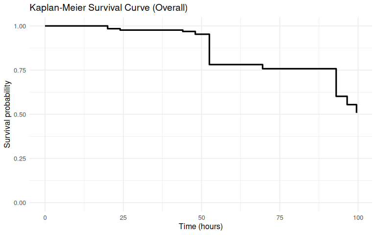
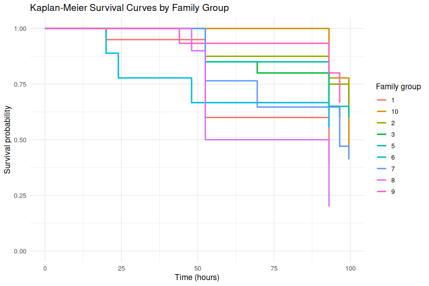

00.00-mgig-heat-survivorship.Rmd
================
Sam White
2026-05-07

- [1 BACKGROUND](#1-background)
  - [1.1 SETUP](#11-setup)
    - [1.1.1 Load packages](#111-load-packages)
    - [1.1.2 Read in and view raw data](#112-read-in-and-view-raw-data)
  - [1.2 ANALYSIS](#12-analysis)
    - [1.2.1 Clean and standardize columns used for survival
      analysis](#121-clean-and-standardize-columns-used-for-survival-analysis)
    - [1.2.2 Reduce repeated observations to one survival row per
      individual](#122-reduce-repeated-observations-to-one-survival-row-per-individual)
    - [1.2.3 Create Surv object and fit Kaplan-Meier
      models](#123-create-surv-object-and-fit-kaplan-meier-models)
    - [1.2.4 Perform log-rank test to compare survival between
      families](#124-perform-log-rank-test-to-compare-survival-between-families)
    - [1.2.5 Convert Kaplan-Meier fit to plotting data
      frames](#125-convert-kaplan-meier-fit-to-plotting-data-frames)
  - [1.3 PLOTS](#13-plots)
    - [1.3.1 Plot Kaplan-Meier curves](#131-plot-kaplan-meier-curves)

# 1 BACKGROUND

This is a Kaplan-Meier survival analysis of 33<sup>o</sup>C heat stress
of *Magallana gigas* oysters, [conducted on
20260427](https://github.com/RobertsLab/sormi-assay-development/tree/main/heat-survivorship/20260427-33C-USDA-families)
(GitHub repo). It compares 9 different families bred/selected by the
USDA.

These oysters had been [previously heat stressed @ 36<sup>o</sup>C and
assessed by the resazurin assay on
20260415](https://github.com/RobertsLab/sormi-assay-development/blob/main/Resazurin/20260415-36C/README.md)
(GitHub README)

## 1.1 SETUP

### 1.1.1 Load packages

``` r
library(readr)
library(dplyr)
library(survival)
library(ggplot2)

knitr::opts_chunk$set(
  echo = TRUE,         # Display code chunks
  eval = TRUE,        # Evaluate code chunks
  warning = FALSE,     # Hide warnings
  message = FALSE,     # Hide messages
  comment = "",         # Prevents appending '##' to beginning of lines in code output
  results = 'hold'     # Holds output so it's all printed together after code chunk
)
```

### 1.1.2 Read in and view raw data

``` r
survivorship_raw <- read_csv(
    "../heat-survivorship/20260427-33C-USDA-families/survivorship.csv",
    show_col_types = FALSE
)

# Preview newly created object
cat("\n=== survivorship_raw: str() ===\n")
str(survivorship_raw)
```

    === survivorship_raw: str() ===
    spc_tbl_ [1,920 × 10] (S3: spec_tbl_df/tbl_df/tbl/data.frame)
     $ individual_id      : num [1:1920] 184 199 207 206 205 204 203 202 201 198 ...
     $ familly_id.group   : num [1:1920] 1 1 1 1 1 1 1 1 1 1 ...
     $ timepoint_count    : num [1:1920] 0 0 0 0 0 0 0 0 0 0 ...
     $ timepoint_hrs      : num [1:1920] 0 0 0 0 0 0 0 0 0 0 ...
     $ alive.measurement  : logi [1:1920] TRUE TRUE TRUE TRUE TRUE TRUE ...
     $ date               : Date[1:1920], format: "2026-04-27" "2026-04-27" ...
     $ time               : 'hms' num [1:1920] 11:30:00 11:30:00 11:30:00 11:30:00 ...
      ..- attr(*, "units")= chr "secs"
     $ area_mm2.measurment: num [1:1920] 893 752 867 966 671 ...
     $ imageJ_ID          : logi [1:1920] NA NA NA NA NA NA ...
     $ notes              : chr [1:1920] NA NA NA NA ...
     - attr(*, "spec")=
      .. cols(
      ..   individual_id = col_double(),
      ..   familly_id.group = col_double(),
      ..   timepoint_count = col_double(),
      ..   timepoint_hrs = col_double(),
      ..   alive.measurement = col_logical(),
      ..   date = col_date(format = ""),
      ..   time = col_time(format = ""),
      ..   area_mm2.measurment = col_double(),
      ..   imageJ_ID = col_logical(),
      ..   notes = col_character()
      .. )
     - attr(*, "problems")=<pointer: 0x561a2453d570> 

## 1.2 ANALYSIS

### 1.2.1 Clean and standardize columns used for survival analysis

``` r
survivorship_clean <- survivorship_raw %>%
    mutate(
        individual_id = as.character(individual_id),
        family_group = as.character(`familly_id.group`),
        timepoint_hrs = as.numeric(timepoint_hrs),
        alive_chr = toupper(trimws(as.character(`alive.measurement`))),
        alive = case_when(
            alive_chr %in% c("TRUE", "T", "1", "YES", "Y") ~ TRUE,
            alive_chr %in% c("FALSE", "F", "0", "NO", "N") ~ FALSE,
            TRUE ~ NA
        )
    ) %>%
    select(
        individual_id,
        family_group,
        timepoint_count,
        timepoint_hrs,
        alive,
        date,
        time,
        everything()
    )

# Preview newly created object
cat("\n=== survivorship_clean: str() ===\n")
str(survivorship_clean)
cat("\n=== survivorship_clean: summary(alive) ===\n")
summary(survivorship_clean$alive)
```

    === survivorship_clean: str() ===
    tibble [1,920 × 13] (S3: tbl_df/tbl/data.frame)
     $ individual_id      : chr [1:1920] "184" "199" "207" "206" ...
     $ family_group       : chr [1:1920] "1" "1" "1" "1" ...
     $ timepoint_count    : num [1:1920] 0 0 0 0 0 0 0 0 0 0 ...
     $ timepoint_hrs      : num [1:1920] 0 0 0 0 0 0 0 0 0 0 ...
     $ alive              : logi [1:1920] TRUE TRUE TRUE TRUE TRUE TRUE ...
     $ date               : Date[1:1920], format: "2026-04-27" "2026-04-27" ...
     $ time               : 'hms' num [1:1920] 11:30:00 11:30:00 11:30:00 11:30:00 ...
      ..- attr(*, "units")= chr "secs"
     $ familly_id.group   : num [1:1920] 1 1 1 1 1 1 1 1 1 1 ...
     $ alive.measurement  : logi [1:1920] TRUE TRUE TRUE TRUE TRUE TRUE ...
     $ area_mm2.measurment: num [1:1920] 893 752 867 966 671 ...
     $ imageJ_ID          : logi [1:1920] NA NA NA NA NA NA ...
     $ notes              : chr [1:1920] NA NA NA NA ...
     $ alive_chr          : chr [1:1920] "TRUE" "TRUE" "TRUE" "TRUE" ...

    === survivorship_clean: summary(alive) ===
       Mode   FALSE    TRUE 
    logical     281    1639 

### 1.2.2 Reduce repeated observations to one survival row per individual

``` r
individual_survival <- survivorship_clean %>%
    filter(!is.na(individual_id), !is.na(timepoint_hrs), !is.na(alive)) %>%
    arrange(individual_id, timepoint_hrs) %>%
    group_by(individual_id) %>%
    summarise(
        family_group = first(family_group[!is.na(family_group)]),
        event = if_else(any(!alive), 1L, 0L),
        time_to_event = {
            if (any(!alive)) {
                min(timepoint_hrs[!alive])
            } else {
                max(timepoint_hrs)
            }
        },
        n_observations = n(),
        .groups = "drop"
    )

# Preview newly created object
cat("\n=== individual_survival: str() ===\n")
str(individual_survival)
cat("\n=== individual_survival: summary(time_to_event) ===\n")
summary(individual_survival$time_to_event)
cat("\n=== individual_survival: table(event) ===\n")
table(individual_survival$event)
```

    === individual_survival: str() ===
    tibble [128 × 5] (S3: tbl_df/tbl/data.frame)
     $ individual_id : chr [1:128] "1" "101" "102" "103" ...
     $ family_group  : chr [1:128] "6" "9" "5" "3" ...
     $ event         : int [1:128] 0 0 0 1 0 0 0 1 0 1 ...
     $ time_to_event : num [1:128] 99.5 99.5 99.5 93 99.5 99.5 99.5 99.5 99.5 93 ...
     $ n_observations: int [1:128] 15 15 15 15 15 15 15 15 15 15 ...

    === individual_survival: summary(time_to_event) ===
       Min. 1st Qu.  Median    Mean 3rd Qu.    Max. 
      20.00   93.00   99.50   86.49   99.50   99.50 

    === individual_survival: table(event) ===

     0  1 
    65 63 

### 1.2.3 Create Surv object and fit Kaplan-Meier models

``` r
surv_object <- with(individual_survival, Surv(time = time_to_event, event = event))

km_fit_overall <- survfit(surv_object ~ 1, data = individual_survival)
km_fit_by_family <- survfit(surv_object ~ family_group, data = individual_survival)

# Preview newly created objects
cat("\n=== km_fit_overall ===\n")
print(km_fit_overall)
cat("\n=== km_fit_by_family ===\n")
print(km_fit_by_family)
cat("\n=== km_fit_overall: str() ===\n")
str(km_fit_overall)
cat("\n=== km_fit_by_family: str() ===\n")
str(km_fit_by_family)
```

    === km_fit_overall ===
    Call: survfit(formula = surv_object ~ 1, data = individual_survival)

           n events median 0.95LCL 0.95UCL
    [1,] 128     63     NA    96.5      NA

    === km_fit_by_family ===
    Call: survfit(formula = surv_object ~ family_group, data = individual_survival)

                     n events median 0.95LCL 0.95UCL
    family_group=1  20     12   93.0    52.5      NA
    family_group=10  9      5   99.5    99.5      NA
    family_group=2   8      3     NA    99.5      NA
    family_group=3  20      8     NA    93.0      NA
    family_group=5  20      8     NA    93.0      NA
    family_group=6   9      4     NA    48.0      NA
    family_group=7  17     10   96.5    69.5      NA
    family_group=8  10      8   72.8    52.5      NA
    family_group=9  15      5     NA    96.5      NA

    === km_fit_overall: str() ===
    List of 17
     $ n        : int 128
     $ time     : num [1:9] 20 24 44 48 52.5 69.5 93 96.5 99.5
     $ n.risk   : num [1:9] 128 126 125 124 122 100 97 77 71
     $ n.event  : num [1:9] 2 1 1 2 22 3 20 6 6
     $ n.censor : num [1:9] 0 0 0 0 0 0 0 0 65
     $ surv     : num [1:9] 0.984 0.977 0.969 0.953 0.781 ...
     $ std.err  : num [1:9] 0.0111 0.0137 0.0159 0.0196 0.0468 ...
     $ cumhaz   : num [1:9] 0.0156 0.0236 0.0316 0.0477 0.228 ...
     $ std.chaz : num [1:9] 0.011 0.0136 0.0158 0.0195 0.0431 ...
     $ type     : chr "right"
     $ logse    : logi TRUE
     $ conf.int : num 0.95
     $ conf.type: chr "log"
     $ lower    : num [1:9] 0.963 0.951 0.939 0.917 0.713 ...
     $ upper    : num [1:9] 1 1 0.999 0.99 0.856 ...
     $ t0       : num 0
     $ call     : language survfit(formula = surv_object ~ 1, data = individual_survival)
     - attr(*, "class")= chr "survfit"

    === km_fit_by_family: str() ===
    List of 18
     $ n        : int [1:9] 20 9 8 20 20 9 17 10 15
     $ time     : num [1:34] 20 52.5 93 99.5 93 99.5 52.5 93 99.5 52.5 ...
     $ n.risk   : num [1:34] 20 19 12 8 9 7 8 7 6 20 ...
     $ n.event  : num [1:34] 1 7 4 0 2 3 1 1 1 3 ...
     $ n.censor : num [1:34] 0 0 0 8 0 4 0 0 5 0 ...
     $ surv     : num [1:34] 0.95 0.6 0.4 0.4 0.778 ...
     $ std.err  : num [1:34] 0.0513 0.1826 0.2739 0.2739 0.1782 ...
     $ cumhaz   : num [1:34] 0.05 0.418 0.752 0.752 0.222 ...
     $ std.chaz : num [1:34] 0.05 0.148 0.223 0.223 0.157 ...
     $ strata   : Named int [1:9] 4 2 3 5 3 5 4 4 4
      ..- attr(*, "names")= chr [1:9] "family_group=1" "family_group=10" "family_group=2" "family_group=3" ...
     $ type     : chr "right"
     $ logse    : logi TRUE
     $ conf.int : num 0.95
     $ conf.type: chr "log"
     $ lower    : num [1:34] 0.859 0.42 0.234 0.234 0.549 ...
     $ upper    : num [1:34] 1 0.858 0.684 0.684 1 ...
     $ t0       : num 0
     $ call     : language survfit(formula = surv_object ~ family_group, data = individual_survival)
     - attr(*, "class")= chr "survfit"

### 1.2.4 Perform log-rank test to compare survival between families

``` r
logrank_test <- survdiff(surv_object ~ family_group, data = individual_survival)

# Display test results
cat("\n=== Log-rank test: survdiff() output ===\n")
print(logrank_test)

# Extract and report key statistics
cat("\n=== Log-Rank Test Summary ===\n")
cat("Chi-square statistic:", logrank_test$chisq, "\n")
cat("Degrees of freedom:", length(logrank_test$n) - 1, "\n")
cat("p-value:", 1 - pchisq(logrank_test$chisq, df = length(logrank_test$n) - 1), "\n")
cat("\nInterpretation:\n")
p_val <- 1 - pchisq(logrank_test$chisq, df = length(logrank_test$n) - 1)
if (p_val < 0.05) {
  cat("p < 0.05: Family groups show SIGNIFICANTLY DIFFERENT survival (reject null hypothesis)\n")
} else {
  cat("p >= 0.05: No significant difference in survival detected between family groups\n")
}
```

    === Log-rank test: survdiff() output ===
    Call:
    survdiff(formula = surv_object ~ family_group, data = individual_survival)

                     N Observed Expected (O-E)^2/E (O-E)^2/V
    family_group=1  20       12     8.48    1.4595    1.9665
    family_group=10  9        5     5.31    0.0187    0.0237
    family_group=2   8        3     4.45    0.4736    0.5908
    family_group=3  20        8    10.40    0.5524    0.7674
    family_group=5  20        8    10.69    0.6756    0.9447
    family_group=6   9        4     3.68    0.0271    0.0332
    family_group=7  17       10     8.07    0.4629    0.6156
    family_group=8  10        8     3.61    5.3556    6.6652
    family_group=9  15        5     8.31    1.3188    1.7654

     Chisq= 12.2  on 8 degrees of freedom, p= 0.1 

    === Log-Rank Test Summary ===
    Chi-square statistic: 12.16475 
    Degrees of freedom: 8 
    p-value: 0.1440031 

    Interpretation:
    p >= 0.05: No significant difference in survival detected between family groups

### 1.2.5 Convert Kaplan-Meier fit to plotting data frames

``` r
km_overall_df <- bind_rows(
    data.frame(
        time = 0,
        surv = 1,
        n_risk = km_fit_overall$n,
        n_event = 0,
        n_censor = 0
    ),
    summary(km_fit_overall) %>%
        with(
            data.frame(
                time = time,
                surv = surv,
                n_risk = n.risk,
                n_event = n.event,
                n_censor = n.censor
            )
        )
) %>%
    arrange(time)

km_family_df <- bind_rows(
    data.frame(
        time = 0,
        surv = 1,
        n_risk = as.numeric(km_fit_by_family$n),
        n_event = 0,
        n_censor = 0,
        strata = names(km_fit_by_family$strata)
    ),
    summary(km_fit_by_family) %>%
        with(
            data.frame(
                time = time,
                surv = surv,
                n_risk = n.risk,
                n_event = n.event,
                n_censor = n.censor,
                strata = strata
            )
        )
) %>%
    mutate(family_group = sub("^family_group=", "", strata)) %>%
    arrange(family_group, time)

# Preview newly created objects
cat("\n=== km_overall_df: head() ===\n")
print(head(km_overall_df))
cat("\n=== km_overall_df: str() ===\n")
str(km_overall_df)

cat("\n=== km_family_df: head() ===\n")
print(head(km_family_df))
cat("\n=== km_family_df: str() ===\n")
str(km_family_df)
```

    === km_overall_df: head() ===
      time      surv n_risk n_event n_censor
    1  0.0 1.0000000    128       0        0
    2 20.0 0.9843750    128       2        0
    3 24.0 0.9765625    126       1        0
    4 44.0 0.9687500    125       1        0
    5 48.0 0.9531250    124       2        0
    6 52.5 0.7812500    122      22        0

    === km_overall_df: str() ===
    'data.frame':   10 obs. of  5 variables:
     $ time    : num  0 20 24 44 48 52.5 69.5 93 96.5 99.5
     $ surv    : num  1 0.984 0.977 0.969 0.953 ...
     $ n_risk  : num  128 128 126 125 124 122 100 97 77 71
     $ n_event : num  0 2 1 1 2 22 3 20 6 6
     $ n_censor: num  0 0 0 0 0 0 0 0 0 65

    === km_family_df: head() ===
      time      surv n_risk n_event n_censor          strata family_group
    1  0.0 1.0000000     20       0        0  family_group=1            1
    2 20.0 0.9500000     20       1        0  family_group=1            1
    3 52.5 0.6000000     19       7        0  family_group=1            1
    4 93.0 0.4000000     12       4        0  family_group=1            1
    5  0.0 1.0000000      9       0        0 family_group=10           10
    6 93.0 0.7777778      9       2        0 family_group=10           10

    === km_family_df: str() ===
    'data.frame':   38 obs. of  7 variables:
     $ time        : num  0 20 52.5 93 0 93 99.5 0 52.5 93 ...
     $ surv        : num  1 0.95 0.6 0.4 1 ...
     $ n_risk      : num  20 20 19 12 9 9 7 8 8 7 ...
     $ n_event     : num  0 1 7 4 0 2 3 0 1 1 ...
     $ n_censor    : num  0 0 0 0 0 0 4 0 0 0 ...
     $ strata      : chr  "family_group=1" "family_group=1" "family_group=1" "family_group=1" ...
     $ family_group: chr  "1" "1" "1" "1" ...

## 1.3 PLOTS

### 1.3.1 Plot Kaplan-Meier curves

#### 1.3.1.1 Overall

``` r
ggplot(km_overall_df, aes(x = time, y = surv)) +
    geom_step(linewidth = 1.1) +
    labs(
        title = "Kaplan-Meier Survival Curve (Overall)",
        x = "Time (hours)",
        y = "Survival probability"
    ) +
    ylim(0, 1) +
    theme_minimal(base_size = 12)
```

<!-- -->

#### 1.3.1.2 Families

``` r
ggplot(km_family_df, aes(x = time, y = surv, color = family_group)) +
    geom_step(linewidth = 1.0) +
    labs(
        title = "Kaplan-Meier Survival Curves by Family Group",
        x = "Time (hours)",
        y = "Survival probability",
        color = "Family group"
    ) +
    ylim(0, 1) +
    theme_minimal(base_size = 12)
```

<!-- -->
